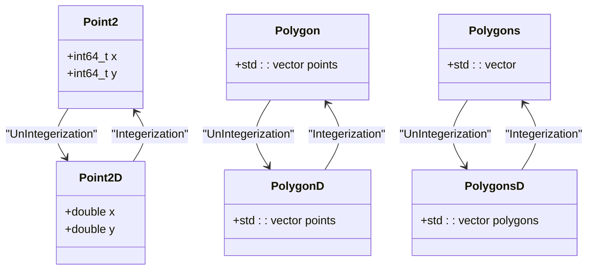
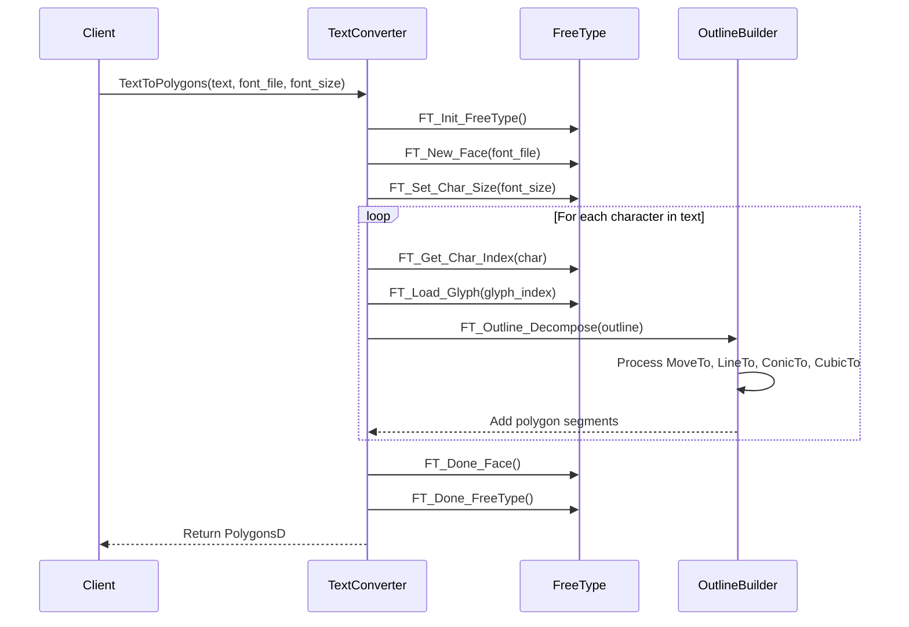
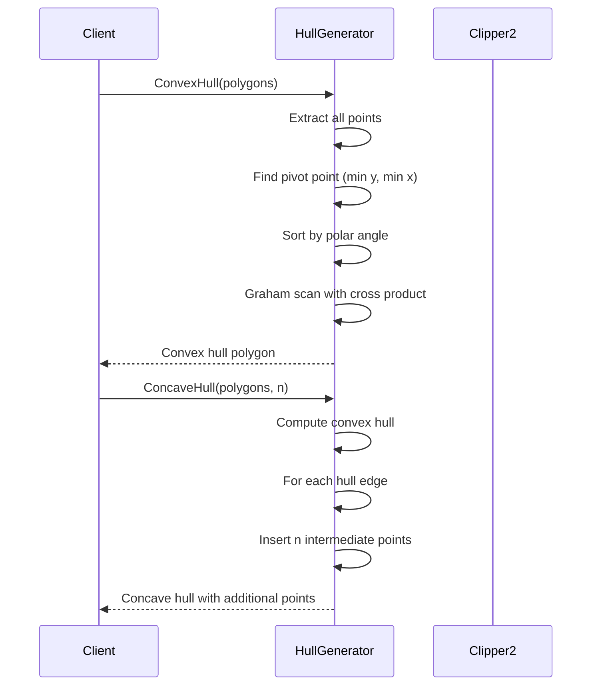
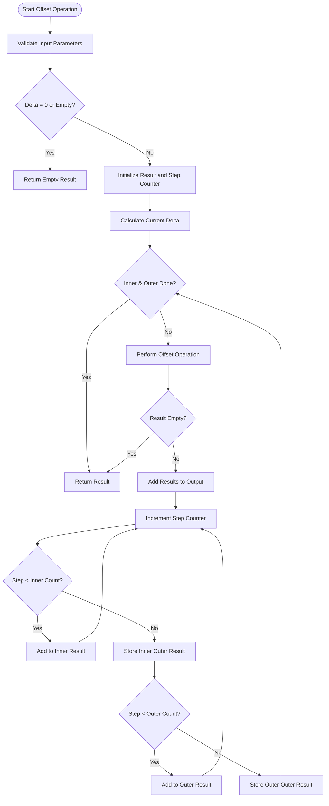
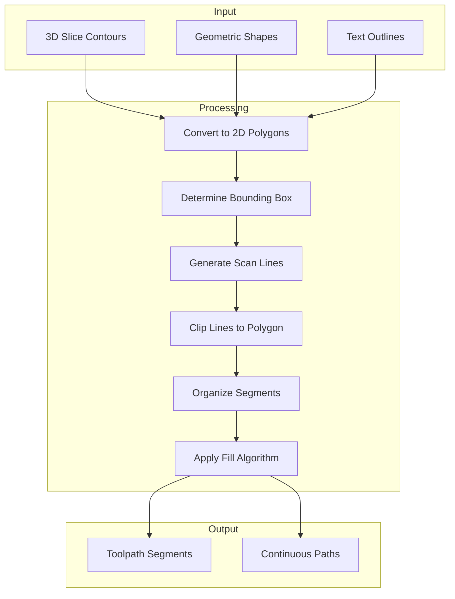
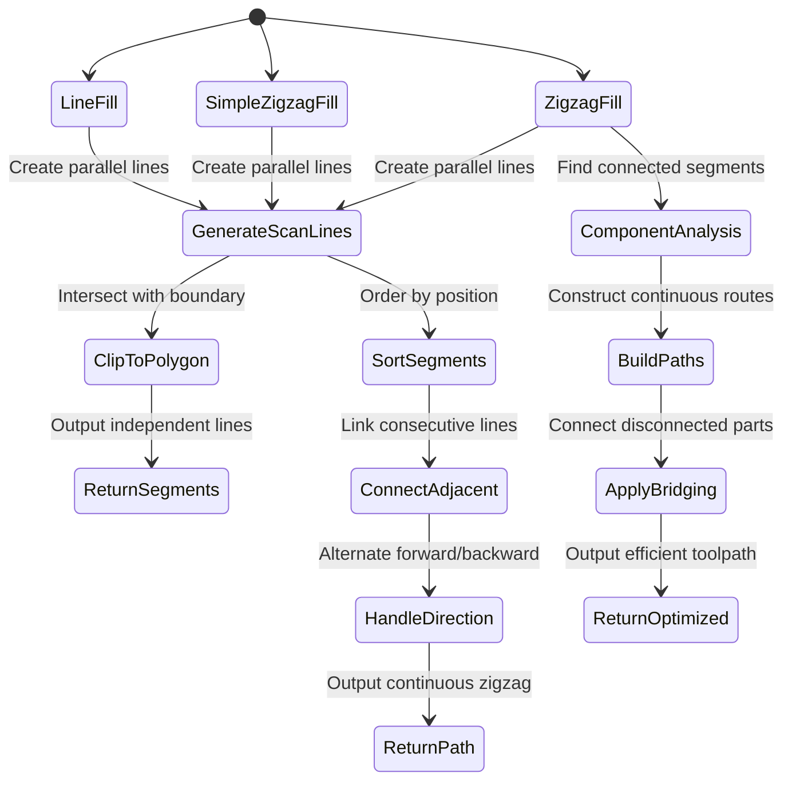
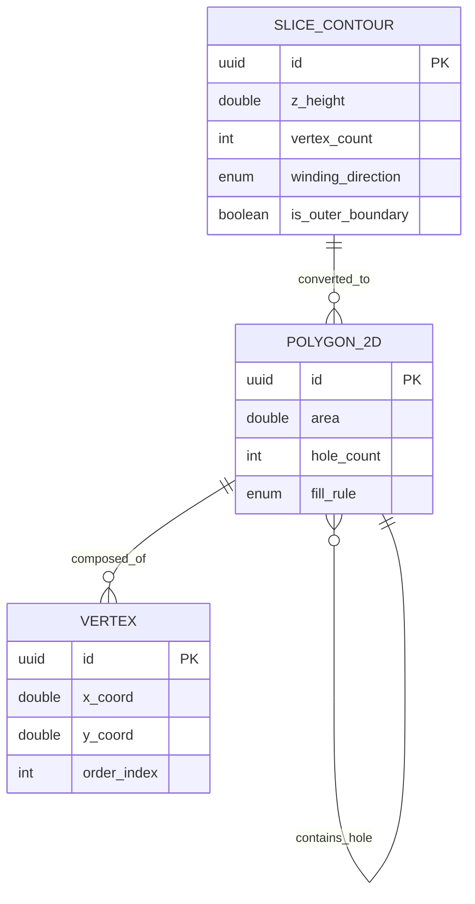
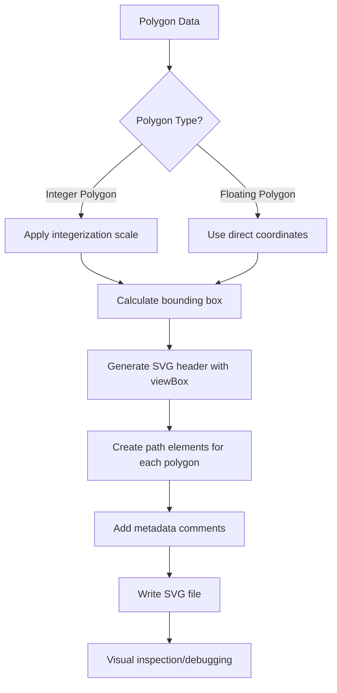
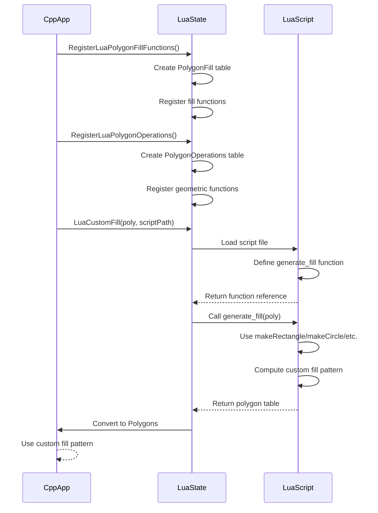
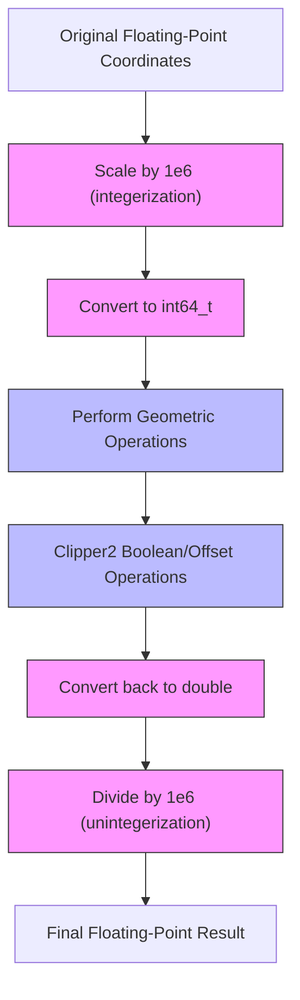

# 2D Geometry Processing

<cite>
**Referenced Files in This Document**   
- [PolygonFill.cpp](file://2D/PolygonFill.cpp)
- [PolygonFill.hpp](file://2D/PolygonFill.hpp)
- [IntPolygon.hpp](file://2D/IntPolygon.hpp)
- [FloatPolygons.hpp](file://2D/FloatPolygons.hpp)
- [2Dhull.cpp](file://2D/2Dhull.cpp)
- [2Dhull.hpp](file://2D/2Dhull.hpp)
- [LuaAdapter.cpp](file://2D/LuaAdapter.cpp)
- [LuaAdapter.hpp](file://2D/LuaAdapter.hpp)
- [IntPolygon.cpp](file://2D/IntPolygon.cpp)
- [FloatPolygons.cpp](file://2D/FloatPolygons.cpp)
- [polygon_fill_test.cpp](file://tests/PolygonFill/polygon_fill_test.cpp)
- [lua_polygon_operations_test.cpp](file://tests/PolygonFill/lua_polygon_operations_test.cpp)
- [custom_fill.lua](file://tests/PolygonFill/custom_fill.lua)
</cite>

## Update Summary
**Changes Made**
- Added new geometric shape creation functions (MakeRectangle, MakeCircle, MakeEllipse, MakeRegularPolygon) to FloatPolygons module
- Implemented text-to-polygon conversion using FreeType font support
- Enhanced SVG dump functionality for debugging with improved visualization capabilities
- Updated LuaAdapter to expose new geometric operations and text processing functions
- Added comprehensive test coverage for new geometric shape generation and text conversion features

## Table of Contents
1. [Introduction](#introduction)
2. [Data Structures and Numerical Representation](#data-structures-and-numerical-representation)
3. [Geometric Shape Creation Functions](#geometric-shape-creation-functions)
4. [Text-to-Polygon Conversion](#text-to-polygon-conversion)
5. [Hull Generation Algorithms](#hull-generation-algorithms)
6. [Polygon Offsetting and Clipping](#polygon-offsetting-and-clipping)
7. [Fill Pattern Generation](#fill-pattern-generation)
8. [Fill Type Implementation Details](#fill-type-implementation-details)
9. [3D to 2D Slice Conversion](#3d-to-2d-slice-conversion)
10. [SVG Dump Functionality for Debugging](#svg-dump-functionality-for-debugging)
11. [Lua Scripting Integration](#lua-scripting-integration)
12. [Numerical Stability and Floating-Point Considerations](#numerical-stability-and-floating-point-considerations)
13. [Error Handling and Edge Cases](#error-handling-and-edge-cases)

## Introduction

The 2D Geometry Processing component in HsBaSlicer is responsible for transforming 3D model slice contours into 2D polygonal representations and generating various fill patterns for 3D printing. This system handles polygon manipulation, hull generation, offsetting, and fill pattern creation using the Clipper2 library for robust geometric operations. The component supports multiple fill types including line, zigzag, and offset patterns, with extensibility through Lua scripting for custom fill algorithms. The implementation addresses numerical stability in floating-point operations and provides comprehensive integration between C++ geometric processing and Lua-based customization.

**Updated** Enhanced with new geometric shape creation functions and text-to-polygon conversion capabilities using FreeType font support.

**Section sources**
- [PolygonFill.cpp:1-1243](file://2D/PolygonFill.cpp#L1-L1243)
- [PolygonFill.hpp:1-46](file://2D/PolygonFill.hpp#L1-L46)

## Data Structures and Numerical Representation

The 2D geometry system employs two primary data representations: integer-based and floating-point polygon structures. The integer representation uses `Point2` (Clipper2Lib::Point64), `Polygon` (Clipper2Lib::Path64), and `Polygons` (Clipper2Lib::Paths64) types for precise geometric operations, while the floating-point representation uses `Point2D` (Clipper2Lib::PointD), `PolygonD` (Clipper2Lib::PathD), and `PolygonsD` (Clipper2Lib::PathsD) for coordinate storage and transformations.

A critical aspect of the implementation is the fixed-point conversion between these representations, governed by the `integerization` constant (1e6) defined in IntPolygon.hpp. This scaling factor converts floating-point coordinates to 64-bit integers for precise clipping and boolean operations, then converts back to floating-point for output. The conversion functions `Integerization` and `UnIntegerization` handle this transformation bidirectionally, ensuring numerical stability during geometric operations.



**Diagram sources**
- [IntPolygon.hpp:10-14](file://2D/IntPolygon.hpp#L10-L14)
- [FloatPolygons.hpp:13-15](file://2D/FloatPolygons.hpp#L13-L15)
- [FloatPolygons.cpp:60-97](file://2D/FloatPolygons.cpp#L60-L97)

**Section sources**
- [IntPolygon.hpp:1-75](file://2D/IntPolygon.hpp#L1-L75)
- [FloatPolygons.hpp:1-72](file://2D/FloatPolygons.hpp#L1-L72)
- [FloatPolygons.cpp:1-122](file://2D/FloatPolygons.cpp#L1-L122)

## Geometric Shape Creation Functions

**New** The system now includes comprehensive geometric shape creation functions that generate standard geometric primitives as polygon representations. These functions provide a convenient way to create rectangles, circles, ellipses, and regular polygons with configurable parameters.

The `MakeRectangle` function creates a rectangle polygon given bottom-left corner coordinates and dimensions. The `MakeCircle` function generates a circular approximation using a specified number of segments for smooth curves. The `MakeEllipse` function creates elliptical shapes with separate X and Y radii and optional rotation angles. The `MakeRegularPolygon` function generates regular polygons with any number of sides greater than or equal to 3.

All geometric shape functions return closed polygons suitable for further geometric operations, boolean operations, or fill pattern generation. The functions use double-precision coordinates and provide high-quality approximations of curved shapes through segment subdivision.

```mermaid
flowchart TD
A[Input Parameters] --> B{Shape Type?}
B --> |Rectangle| C[MakeRectangle(x,y,width,height)]
B --> |Circle| D[MakeCircle(cx,cy,radius,segments)]
B --> |Ellipse| E[MakeEllipse(cx,cy,rx,ry,segments,rotation)]
B --> |Regular Polygon| F[MakeRegularPolygon(cx,cy,radius,sides,rotation)]
C --> G[Generate 4 vertices + close path]
D --> H[Calculate n points on circle]
E --> I[Apply ellipse formula with rotation]
F --> J[Calculate n points on regular polygon]
G --> K[Return closed PolygonD]
H --> K
I --> K
J --> K
```

**Diagram sources**
- [FloatPolygons.cpp:310-340](file://2D/FloatPolygons.cpp#L310-L340)
- [FloatPolygons.hpp:133-174](file://2D/FloatPolygons.hpp#L133-L174)

**Section sources**
- [FloatPolygons.cpp:310-340](file://2D/FloatPolygons.cpp#L310-L340)
- [FloatPolygons.hpp:133-174](file://2D/FloatPolygons.hpp#L133-L174)

## Text-to-Polygon Conversion

**New** The system now supports converting text strings to polygon outlines using FreeType font rendering. The `TextToPolygons` function takes UTF-8 encoded text, a font file path, and font size parameters to generate polygon representations of text characters.

The text-to-polygon conversion process involves several steps: initializing the FreeType library, loading the specified font file, setting the character size, and iterating through each character in the input text. For each character, the function loads the glyph outline and decomposes it into line segments and Bezier curves, which are then converted to polygon vertices with configurable curve segmentation.

The implementation supports both TrueType Font (TTF) and OpenType Font (OTF) files, providing accurate text outline generation suitable for 3D printing applications. The function throws appropriate exceptions when FreeType support is not available or when font loading fails.



**Diagram sources**
- [FloatPolygons.cpp:342-403](file://2D/FloatPolygons.cpp#L342-L403)
- [FloatPolygons.hpp:176-187](file://2D/FloatPolygons.hpp#L176-L187)

**Section sources**
- [FloatPolygons.cpp:342-403](file://2D/FloatPolygons.cpp#L342-L403)
- [FloatPolygons.hpp:176-187](file://2D/FloatPolygons.hpp#L176-L187)

## Hull Generation Algorithms

The 2D geometry component implements both convex and concave hull generation algorithms for polygon simplification and boundary detection. The convex hull algorithm uses Graham's scan approach, which first identifies the point with minimum y-coordinate (and minimum x-coordinate in case of ties) as the pivot, then sorts remaining points by polar angle relative to the pivot, and finally constructs the hull by maintaining a stack and ensuring counter-clockwise turns using cross product calculations.

The concave hull implementation is a simulation-based approach that first computes the convex hull, then adds intermediate points along each hull edge to create a more detailed boundary representation. This method allows for configurable detail through the `numAdditionalPoints` parameter, which determines how many additional points are inserted between each pair of convex hull vertices. The algorithm preserves the overall shape while providing a more accurate approximation of the original polygon's boundary.



**Diagram sources**
- [2Dhull.cpp:9-187](file://2D/2Dhull.cpp#L9-L187)
- [2Dhull.hpp:1-21](file://2D/2Dhull.hpp#L1-L21)

**Section sources**
- [2Dhull.cpp:1-187](file://2D/2Dhull.cpp#L1-L187)
- [2Dhull.hpp:1-21](file://2D/2Dhull.hpp#L1-L21)

## Polygon Offsetting and Clipping

Polygon offsetting is implemented using the Clipper2 library's offsetting functionality, which supports various join types (Square, Bevel, Round, Miter) and end types. The offsetting process converts input polygons to integer coordinates, applies the offset operation, and returns the resulting polygons. The `Offset` function in IntPolygon.cpp creates a ClipperOffset object, adds the input paths with specified join and end types, and executes the offset operation to generate expanded or contracted polygons.

The system also implements a specialized `OffsetOnly` function that performs multiple offsetting steps, returning both intermediate offsets and the final inner/outer offset polygons. This function iteratively applies offset operations with increasing delta values until the specified number of inner and outer offsets are generated or the offset operation produces empty results. The clipping operations (union, intersection, difference, xor) are implemented using Clipper2's boolean operations with EvenOdd fill rule by default, ensuring consistent handling of complex polygon relationships.



**Diagram sources**
- [IntPolygon.cpp:53-68](file://2D/IntPolygon.cpp#L53-L68)
- [PolygonFill.cpp:115-157](file://2D/PolygonFill.cpp#L115-L157)
- [IntPolygon.hpp:47-54](file://2D/IntPolygon.hpp#L47-L54)

**Section sources**
- [IntPolygon.cpp:1-190](file://2D/IntPolygon.cpp#L1-L190)
- [IntPolygon.hpp:1-75](file://2D/IntPolygon.hpp#L1-L75)
- [PolygonFill.cpp:115-157](file://2D/PolygonFill.cpp#L115-L157)

## Fill Pattern Generation

The fill pattern generation system transforms 2D polygonal regions into toolpaths for 3D printing. The core functionality is implemented in PolygonFill.cpp, which provides multiple fill algorithms including line fill, zigzag fill, and offset fill. The process begins with converting 3D slice contours to 2D polygons, then applying the selected fill algorithm based on user parameters.

The fill generation workflow involves several key steps: determining the bounding box of the input polygon, calculating scan lines at specified spacing and angle, clipping these lines against the polygon boundary, and organizing the resulting segments into continuous toolpaths. For line fill patterns, each scan line intersection produces independent line segments. For zigzag patterns, adjacent scan line segments are connected to form continuous zigzag paths, minimizing travel moves and improving print efficiency.



**Diagram sources**
- [PolygonFill.cpp:25-113](file://2D/PolygonFill.cpp#L25-L113)
- [PolygonFill.hpp:12-30](file://2D/PolygonFill.hpp#L12-L30)

**Section sources**
- [PolygonFill.cpp:1-1243](file://2D/PolygonFill.cpp#L1-L1243)
- [PolygonFill.hpp:1-46](file://2D/PolygonFill.hpp#L1-L46)

## Fill Type Implementation Details

The system implements three primary fill types: line, simple zigzag, and zigzag, each with distinct characteristics and use cases. The line fill generates independent straight line segments at specified spacing and angle, providing a simple grid pattern. The simple zigzag fill connects scan line segments into continuous zigzag paths, reducing travel moves and improving structural integrity. The advanced zigzag fill implements component analysis to ensure proper connectivity between segments.

The `LineFill` function creates scan lines at the specified angle and spacing, then clips these lines against the input polygon to generate fill segments. Each resulting segment is returned as a two-point polygon representing a single toolpath segment. The `SimpleZigzagFill` function builds on this by connecting adjacent scan line segments into continuous polylines, alternating direction on consecutive scan lines to create the characteristic zigzag pattern.

The most sophisticated implementation is `ZigzagFill`, which performs component analysis to identify connected segments across adjacent scan lines. It uses a union-find data structure to group segments that overlap in the scan direction, then constructs continuous paths within each connected component. This approach handles complex polygon shapes with holes and ensures that the generated toolpaths remain within the printable region.



**Diagram sources**
- [PolygonFill.cpp:420-809](file://2D/PolygonFill.cpp#L420-L809)
- [PolygonFill.hpp:16-23](file://2D/PolygonFill.hpp#L16-L23)

**Section sources**
- [PolygonFill.cpp:420-809](file://2D/PolygonFill.cpp#L420-L809)
- [PolygonFill.hpp:16-23](file://2D/PolygonFill.hpp#L16-L23)

## 3D to 2D Slice Conversion

The conversion from 3D slice contours to 2D polygons is a critical step in the processing pipeline. When a 3D model is sliced at a specific height, the intersection with the model's surface produces one or more closed contours. These contours are projected onto the 2D plane (typically the XY plane) to create 2D polygons that represent the cross-section at that layer.

The system handles complex cases including nested contours (holes within outer boundaries) and multiple disconnected regions. The Clipper2 library's even-odd fill rule is used to correctly interpret the winding direction of contours, where counter-clockwise polygons represent outer boundaries and clockwise polygons represent holes. This ensures that the resulting 2D representation accurately captures the printable area for each layer.

The conversion process also includes polygon simplification to remove redundant vertices and improve numerical stability. The `MakeSimple` function uses Clipper2's simplification algorithm with a configurable epsilon value to remove vertices that don't significantly alter the polygon's shape. For complex self-intersecting polygons, the `MakeSimpleAndSplit` function decomposes them into multiple simple polygons using a polytree structure.



**Diagram sources**
- [IntPolygon.cpp:154-167](file://2D/IntPolygon.cpp#L154-L167)
- [IntPolygon.hpp:19-20](file://2D/IntPolygon.hpp#L19-L20)

**Section sources**
- [IntPolygon.cpp:154-167](file://2D/IntPolygon.cpp#L154-L167)
- [IntPolygon.hpp:19-20](file://2D/IntPolygon.hpp#L19-L20)

## SVG Dump Functionality for Debugging

**Enhanced** The system now includes comprehensive SVG dump functionality for visualizing and debugging polygon operations. The enhanced SVG dump feature provides detailed visualization of polygon data with proper scaling, coordinate system information, and metadata embedded in the SVG output.

The `DumpPolygon` and `DumpPolygons` functions generate SVG files containing vector representations of polygon data. The enhanced implementation includes automatic viewport calculation, proper scaling factors, and informative comments describing the polygon type and scaling parameters. The SVG output uses standard SVG path commands (M, L, Z) to represent polygon boundaries and supports both individual polygons and collections of polygons.

For integer-based polygons, the dump functions automatically apply the integerization scale factor to convert coordinates to real-world units. For floating-point polygons, the functions work directly with double-precision coordinates without additional scaling. The SVG files include metadata comments indicating the polygon type, scaling information, and other relevant details for debugging purposes.



**Diagram sources**
- [IntPolygon.cpp:127-224](file://2D/IntPolygon.cpp#L127-L224)
- [FloatPolygons.cpp:73-168](file://2D/FloatPolygons.cpp#L73-L168)

**Section sources**
- [IntPolygon.cpp:127-224](file://2D/IntPolygon.cpp#L127-L224)
- [FloatPolygons.cpp:73-168](file://2D/FloatPolygons.cpp#L73-L168)
- [IntPolygon.hpp:173-189](file://2D/IntPolygon.hpp#L173-L189)
- [FloatPolygons.hpp:219-235](file://2D/FloatPolygons.hpp#L219-L235)

## Lua Scripting Integration

The system provides extensive integration with Lua scripting through the LuaAdapter component, enabling custom fill pattern generation and geometric operations. The `RegisterLuaPolygonFillFunctions` function exposes C++ fill algorithms to Lua scripts by registering them in the global "PolygonFill" table. This allows Lua scripts to call functions like `offsetFill`, `lineFill`, `zigzagFill`, and `compositeOffsetFill` with appropriate parameters.

**Enhanced** The LuaAdapter has been significantly expanded to include new geometric shape creation functions and text processing capabilities. The `RegisterLuaPolygonOperations` function now exposes a comprehensive set of geometric operations including `makeRectangle`, `makeCircle`, `makeEllipse`, `makeRegularPolygon`, and `textToPolygons`. These functions allow Lua scripts to create geometric primitives and convert text to polygon outlines directly.

Custom fill patterns can be implemented in Lua scripts and loaded through the `LuaCustomFill` and `LuaCustomFillString` functions. These functions create a Lua state, load the specified script, invoke the designated function (defaulting to "generate_fill"), and convert the returned polygon table back to the internal Polygons structure. The test file custom_fill.lua demonstrates a simple implementation that returns diagonal lines across a square region.

The LuaAdapter also provides bidirectional conversion functions between C++ polygon structures and Lua tables. `PushPolygonsDToLua` converts PolygonsD to nested Lua tables with x/y coordinates, while `LuaTableToPolygonsD` performs the reverse operation. This seamless integration allows complex geometric algorithms to be implemented in Lua while leveraging the performance and reliability of C++ for core operations.



**Diagram sources**
- [LuaAdapter.cpp:1-417](file://2D/LuaAdapter.cpp#L1-L417)
- [LuaAdapter.hpp:1-25](file://2D/LuaAdapter.hpp#L1-L25)
- [custom_fill.lua:1-16](file://tests/PolygonFill/custom_fill.lua#L1-L16)

**Section sources**
- [LuaAdapter.cpp:1-417](file://2D/LuaAdapter.cpp#L1-L417)
- [LuaAdapter.hpp:1-25](file://2D/LuaAdapter.hpp#L1-L25)
- [PolygonFill.cpp:159-387](file://2D/PolygonFill.cpp#L159-L387)
- [custom_fill.lua:1-16](file://tests/PolygonFill/custom_fill.lua#L1-L16)

## Numerical Stability and Floating-Point Considerations

The system addresses numerical stability in floating-point polygon operations through several key strategies. The primary approach is the use of fixed-point arithmetic via the integerization process, where floating-point coordinates are scaled by 1e6 and converted to 64-bit integers before geometric operations. This eliminates floating-point precision issues that commonly occur in clipping and boolean operations.

For operations that require floating-point precision, the system implements robust geometric predicates using exact arithmetic where possible. The point-in-polygon test, for example, uses Clipper2's exact point-in-polygon algorithm with even-odd fill rule handling. When converting between floating-point and integer representations, the system uses `std::llround` to ensure consistent rounding behavior and minimize accumulated errors.

The fill algorithms include several numerical safeguards, such as epsilon comparisons for floating-point equality and iterative refinement for boundary intersection calculations. The `find_first_inside` and `find_last_inside` functions in PolygonFill.cpp use binary search with 40 iterations to accurately determine where a line segment enters and exits a polygon, even in cases where floating-point precision might otherwise cause errors.



**Diagram sources**
- [IntPolygon.hpp](file://2D/IntPolygon.hpp#L10)
- [FloatPolygons.cpp:60-97](file://2D/FloatPolygons.cpp#L60-L97)
- [PolygonFill.cpp:453-483](file://2D/PolygonFill.cpp#L453-L483)

**Section sources**
- [IntPolygon.hpp](file://2D/IntPolygon.hpp#L10)
- [FloatPolygons.cpp:60-97](file://2D/FloatPolygons.cpp#L60-L97)
- [PolygonFill.cpp:453-483](file://2D/PolygonFill.cpp#L453-L483)

## Error Handling and Edge Cases

The 2D geometry processing system implements comprehensive error handling for various edge cases and invalid inputs. Functions include validation checks for empty inputs, zero spacing values, and invalid parameters, returning appropriate empty results or throwing exceptions as needed. The system gracefully handles degenerate cases such as self-intersecting polygons, overlapping contours, and extremely thin regions.

For fill pattern generation, the algorithms include safeguards against infinite loops and excessive memory usage. The `OffsetFill` function limits iterations to 10,000 steps to prevent infinite loops in cases where offsetting might not converge. The zigzag fill algorithms include checks for segment length and proximity to avoid creating invalid or excessively dense toolpaths.

**Enhanced** The new geometric shape creation functions include robust parameter validation and error handling. The `MakeRegularPolygon` function validates that the number of sides is at least 3, returning empty polygons for invalid inputs. The text-to-polygon conversion function throws descriptive exceptions when FreeType support is unavailable or when font loading fails, providing clear error messages for debugging.

The test suite in polygon_fill_test.cpp verifies correct behavior for various edge cases, including simple square polygons, complex nested contours, and custom Lua scripts. The tests validate that generated fill patterns remain within the original polygon boundaries and produce expected output formats. The lua_polygon_operations_test.cpp specifically tests the new geometric shape creation and SVG dump functionality, ensuring reliable operation of the enhanced features.

**Section sources**
- [PolygonFill.cpp:398-415](file://2D/PolygonFill.cpp#L398-L415)
- [polygon_fill_test.cpp:1-132](file://tests/PolygonFill/polygon_fill_test.cpp#L1-L132)
- [lua_polygon_operations_test.cpp:1-116](file://tests/PolygonFill/lua_polygon_operations_test.cpp#L1-L116)