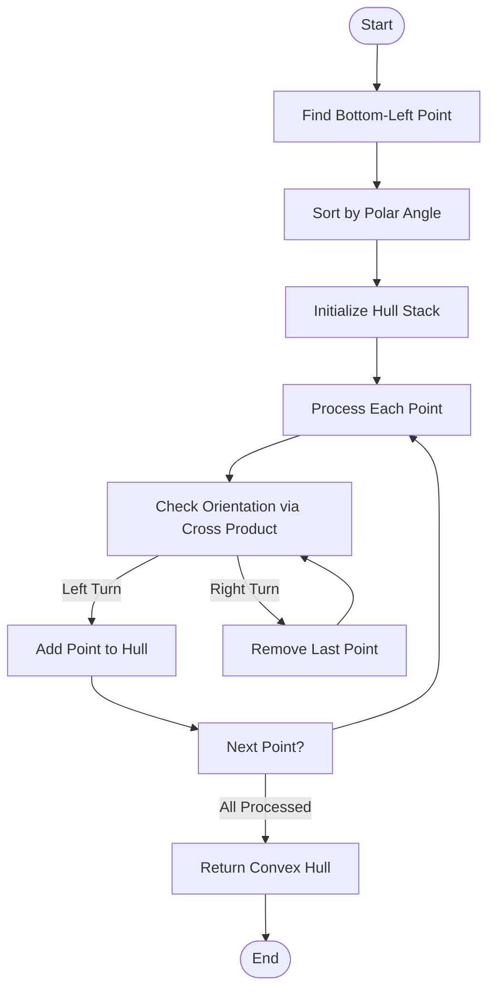
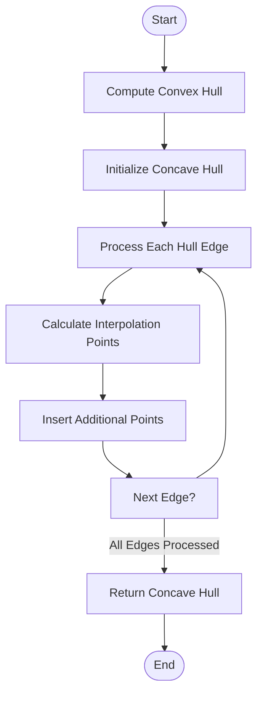
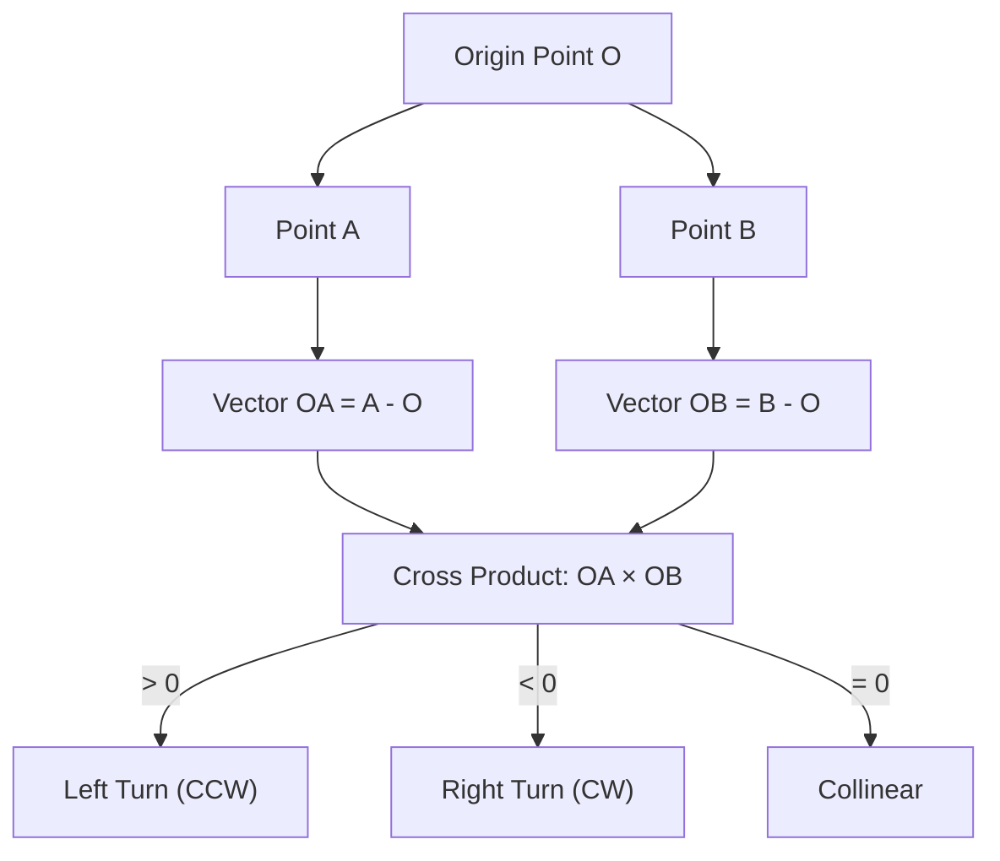
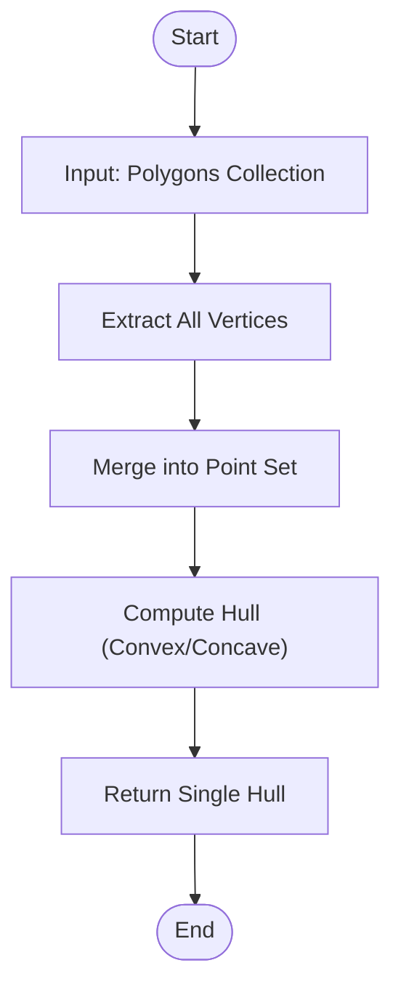
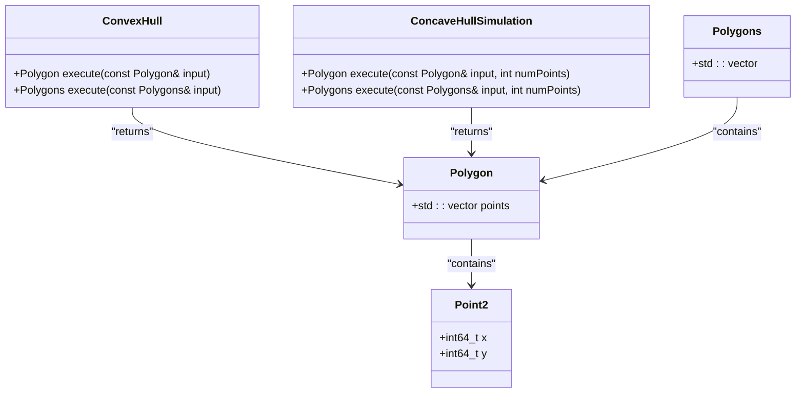
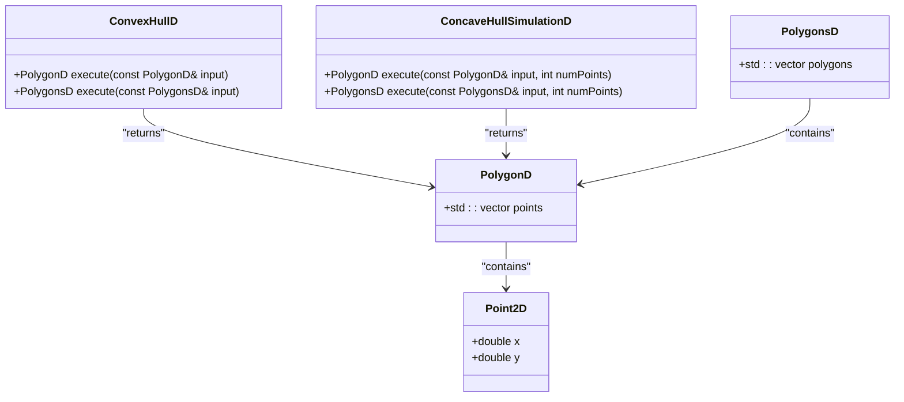
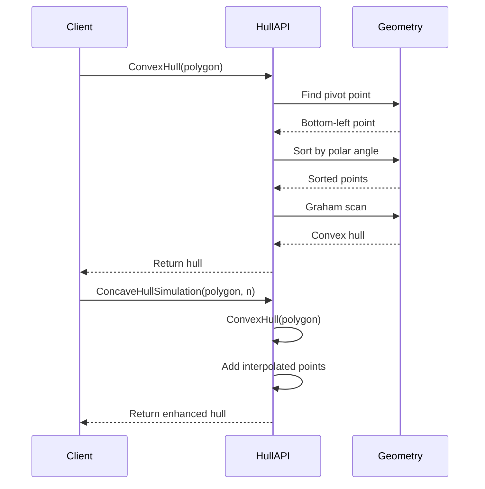

# Hull Generation

<cite>
**Referenced Files in This Document**   
- [2Dhull.hpp](file://2D/2Dhull.hpp)
- [2Dhull.cpp](file://2D/2Dhull.cpp)
- [IntPolygon.hpp](file://2D/IntPolygon.hpp)
- [FloatPolygons.hpp](file://2D/FloatPolygons.hpp)
- [LuaAdapter.cpp](file://2D/LuaAdapter.cpp)
</cite>

## Table of Contents
1. [Introduction](#introduction)
2. [Core Algorithms](#core-algorithms)
3. [Mathematical Foundations](#mathematical-foundations)
4. [Implementation Details](#implementation-details)
5. [Data Type Variants](#data-type-variants)
6. [Usage Patterns](#usage-patterns)
7. [Performance and Numerical Stability](#performance-and-numerical-stability)
8. [Conclusion](#conclusion)

## Introduction
The hull generation component in HsBaSlicer provides geometric algorithms for computing convex and concave hulls from polygonal data. These algorithms are essential for 2D shape analysis, path planning, and geometric processing in the slicing pipeline. The implementation leverages the Graham scan algorithm for convex hull computation and extends it with a simulation technique for concave hull approximation. The system supports both integer and floating-point precision variants to balance accuracy and performance requirements.

**Section sources**
- [2Dhull.hpp](file://2D/2Dhull.hpp#L1-L21)
- [2Dhull.cpp](file://2D/2Dhull.cpp#L1-L187)

## Core Algorithms

### Convex Hull Algorithm
The convex hull implementation uses the Graham scan algorithm, which systematically constructs the convex hull by maintaining a stack of points that form the hull boundary. The algorithm begins by identifying the point with the lowest y-coordinate (and leftmost in case of ties) as the pivot. It then sorts all other points by polar angle relative to this pivot, breaking ties by distance. The algorithm processes points in this sorted order, using a stack-based approach to maintain the convexity property by checking orientation via cross product calculations.

**Diagram sources**
- [2Dhull.cpp](file://2D/2Dhull.cpp#L60-L92)
- [2Dhull.cpp](file://2D/2Dhull.cpp#L135-L167)

### Concave Hull Simulation
The concave hull simulation algorithm builds upon the convex hull by adding intermediate points along the hull edges. This technique creates a more detailed boundary that better approximates the original polygon's shape while maintaining the computational efficiency of convex hull algorithms. The algorithm first computes the convex hull, then inserts a specified number of additional points along each edge using linear interpolation. This approach effectively "simulates" concavity by increasing the resolution of the hull boundary.

**Diagram sources**
- [2Dhull.cpp](file://2D/2Dhull.cpp#L37-L59)
- [2Dhull.cpp](file://2D/2Dhull.cpp#L113-L134)

**Section sources**
- [2Dhull.cpp](file://2D/2Dhull.cpp#L37-L134)

## Mathematical Foundations

### Cross Product for Orientation
The cross product calculation is fundamental to determining point orientation in the plane. For three points O, A, and B, the cross product of vectors (A-O) and (B-O) determines whether point B is to the left, right, or collinear with the directed line from O to A. A positive cross product indicates a left turn (counterclockwise orientation), negative indicates a right turn (clockwise), and zero indicates collinearity. This geometric predicate is crucial for maintaining convexity during hull construction.

**Diagram sources**
- [2Dhull.cpp](file://2D/2Dhull.cpp#L9-L17)

### Polar Angle Sorting
The sorting strategy based on polar angle ensures that points are processed in counterclockwise order around the pivot point. When two points have the same polar angle, the closer point is processed first. This sorting approach guarantees that the Graham scan algorithm can correctly construct the convex hull by always considering points in the proper angular sequence. The implementation uses the cross product as a comparison function to avoid explicit angle calculations, which improves both performance and numerical stability.

**Section sources**
- [2Dhull.cpp](file://2D/2Dhull.cpp#L19-L35)

## Implementation Details

### Single Polygon Processing
When processing a single polygon, the hull generation algorithms operate directly on the polygon's vertex set. The convex hull algorithm extracts the boundary points and applies the Graham scan procedure to compute the minimal convex set containing all points. The concave hull simulation then enhances this result by adding interpolated points along the convex hull edges, creating a higher-resolution approximation of the original shape.

**Section sources**
- [2Dhull.cpp](file://2D/2Dhull.cpp#L60-L92)
- [2Dhull.cpp](file://2D/2Dhull.cpp#L37-L59)

### Polygon Collection Processing
For collections of polygons, the algorithms first merge all vertices from all polygons into a single point set before applying the hull computation. This approach treats the entire collection as a unified point cloud, producing a hull that encompasses all polygons in the collection. The merging process concatenates all vertex lists, preserving the geometric relationship between different polygons while enabling the computation of a comprehensive hull.

**Diagram sources**
- [2Dhull.cpp](file://2D/2Dhull.cpp#L103-L111)
- [2Dhull.cpp](file://2D/2Dhull.cpp#L94-L102)

**Section sources**
- [2Dhull.cpp](file://2D/2Dhull.cpp#L94-L111)

## Data Type Variants

### Integer Precision Implementation
The integer precision variant uses 64-bit integer coordinates (Point64, Path64, Paths64) for geometric computations. This approach provides exact arithmetic and avoids floating-point rounding errors, making it suitable for applications requiring high precision and deterministic results. The implementation includes an integerization factor of 1e6 to convert floating-point coordinates to integers while preserving six decimal places of precision.

**Diagram sources**
- [IntPolygon.hpp](file://2D/IntPolygon.hpp#L12-L14)
- [2Dhull.cpp](file://2D/2Dhull.cpp#L60-L92)

### Double Precision Implementation
The double precision variant uses floating-point coordinates (PointD, PathD, PathsD) for geometric computations. This implementation provides greater flexibility for representing real-world measurements and is more convenient for interfacing with external systems that use floating-point coordinates. The algorithms maintain the same logic as their integer counterparts but operate on double-precision values, requiring careful consideration of numerical stability in geometric predicates.

**Diagram sources**
- [FloatPolygons.hpp](file://2D/FloatPolygons.hpp#L13-L15)
- [2Dhull.cpp](file://2D/2Dhull.cpp#L135-L167)

**Section sources**
- [FloatPolygons.hpp](file://2D/FloatPolygons.hpp#L13-L15)
- [2Dhull.cpp](file://2D/2Dhull.cpp#L135-L186)

## Usage Patterns

### API Interface
The hull generation functions are exposed through a clean C++ interface that supports both single polygons and polygon collections. The API provides overloaded functions for different data types (integer and double precision) and different input configurations (single polygon vs. collection). This design allows clients to choose the appropriate variant based on their precision requirements and data structure.

**Diagram sources**
- [2Dhull.hpp](file://2D/2Dhull.hpp#L10-L18)
- [2Dhull.cpp](file://2D/2Dhull.cpp#L37-L186)

### Lua Integration
The hull generation algorithms are accessible from Lua scripts through the LuaAdapter interface. This integration enables scripting of geometric operations in the slicing pipeline. The Lua functions expose the convex and concave hull operations with appropriate type conversion between Lua tables and C++ polygon structures. The adapter handles the conversion between floating-point Lua values and the internal integer representation, ensuring seamless interoperability.

**Section sources**
- [LuaAdapter.cpp](file://2D/LuaAdapter.cpp#L95-L121)

## Performance and Numerical Stability

### Algorithm Complexity
The convex hull algorithm has O(n log n) time complexity due to the sorting step, where n is the number of input points. The Graham scan phase runs in O(n) time as each point is pushed and popped from the stack at most once. The concave hull simulation adds O(km) complexity, where k is the number of additional points per edge and m is the number of edges in the convex hull. This makes the overall complexity dominated by the initial sorting step.

### Numerical Considerations
The implementation addresses numerical stability through several strategies. For integer coordinates, exact arithmetic eliminates floating-point errors. For double precision, the use of cross products for orientation tests avoids trigonometric functions and their associated precision issues. The polar angle sorting uses cross product comparisons rather than explicit angle calculations, which improves both performance and numerical robustness. The integerization factor of 1e6 provides sufficient precision for most manufacturing applications while maintaining exact arithmetic properties.

**Section sources**
- [IntPolygon.hpp](file://2D/IntPolygon.hpp#L10)
- [2Dhull.cpp](file://2D/2Dhull.cpp#L9-L35)

## Conclusion
The hull generation component in HsBaSlicer provides robust and efficient algorithms for computing convex and concave hulls from polygonal data. The implementation combines the mathematical rigor of the Graham scan algorithm with practical enhancements for concave approximation. By supporting both integer and floating-point precision variants, the system accommodates different accuracy and performance requirements across various applications. The clean API design and Lua integration make these geometric tools accessible for both C++ developers and script authors in the slicing pipeline.