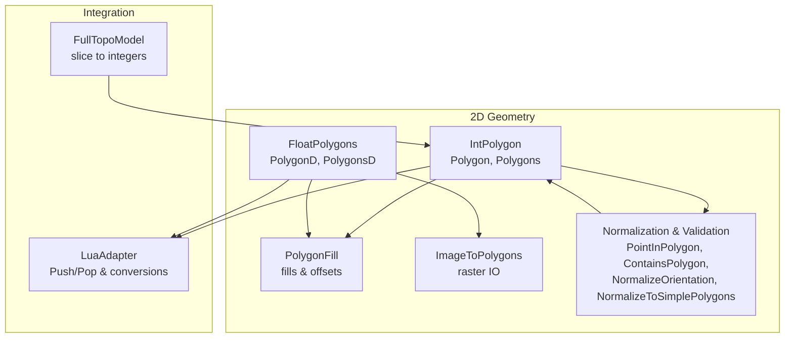
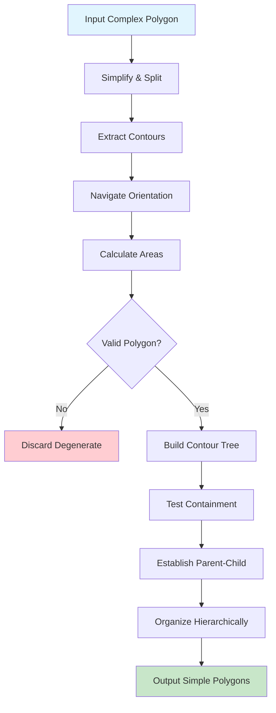
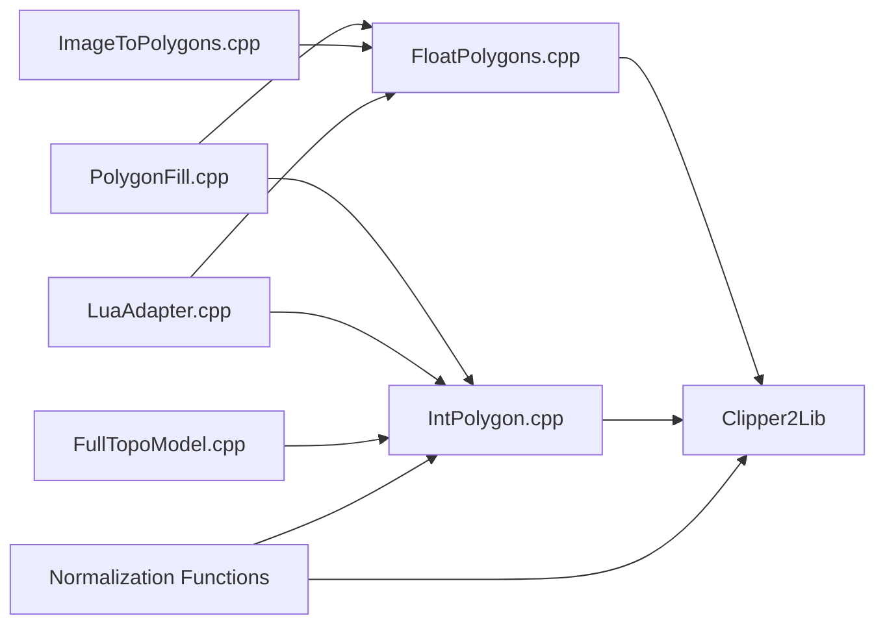

# Polygon Data Structures

<cite>
**Referenced Files in This Document**
- [IntPolygon.hpp](file://2D/IntPolygon.hpp)
- [IntPolygon.cpp](file://2D/IntPolygon.cpp)
- [FloatPolygons.hpp](file://2D/FloatPolygons.hpp)
- [FloatPolygons.cpp](file://2D/FloatPolygons.cpp)
- [PolygonFill.hpp](file://2D/PolygonFill.hpp)
- [PolygonFill.cpp](file://2D/PolygonFill.cpp)
- [ImageToPolygons.hpp](file://2D/ImageToPolygons.hpp)
- [ImageToPolygons.cpp](file://2D/ImageToPolygons.cpp)
- [LuaAdapter.cpp](file://2D/LuaAdapter.cpp)
- [FullTopoModel.cpp](file://meshmodel/FullTopoModel.cpp)
</cite>

## Update Summary
**Changes Made**
- Added comprehensive documentation for new normalization and validation functions including PointInPolygon(), ContainsPolygon(), NormalizeOrientation(), and NormalizeToSimplePolygons()
- Enhanced section on geometric precision and robustness with new validation capabilities
- Updated architecture diagrams to reflect new normalization pipeline
- Added detailed examples showing how normalization functions improve geometric operations

## Table of Contents
1. [Introduction](#introduction)
2. [Project Structure](#project-structure)
3. [Core Components](#core-components)
4. [Architecture Overview](#architecture-overview)
5. [Detailed Component Analysis](#detailed-component-analysis)
6. [Normalization and Validation Functions](#normalization-and-validation-functions)
7. [Dependency Analysis](#dependency-analysis)
8. [Performance Considerations](#performance-considerations)
9. [Troubleshooting Guide](#troubleshooting-guide)
10. [Conclusion](#conclusion)

## Introduction
This document explains the polygon data structures used in the 2D geometry processing module. It focuses on the dual representations:
- Integer-based polygons (Polygon, Polygons) using 64-bit integer coordinates
- Floating-point polygons (PolygonD, PolygonsD) using double-precision coordinates

It also documents the conversion functions Integerization and UnIntegerization that bridge these representations, the underlying Clipper2Lib types (PointD, PathD, PathsD) and how they are aliased, and how these structures integrate with other modules such as slicing and path generation. Memory layout and performance implications are addressed to help developers choose the appropriate representation for different tasks.

**Updated** Enhanced with comprehensive normalization and validation functions for improved geometric precision and robustness.

## Project Structure
The polygon-related code is primarily located under the 2D directory, with supporting integrations in mesh modeling and Lua adapters:
- 2D/IntPolygon.hpp and 2D/IntPolygon.cpp define integer polygon operations, offsets, and advanced normalization functions
- 2D/FloatPolygons.hpp and 2D/FloatPolygons.cpp define floating-point polygon operations and conversions
- 2D/PolygonFill.hpp and 2D/PolygonFill.cpp define fill patterns and hybrid operations
- 2D/ImageToPolygons.hpp and 2D/ImageToPolygons.cpp define raster-to-vector conversion
- 2D/LuaAdapter.cpp defines Lua bindings for pushing/pulling polygons and conversions
- meshmodel/FullTopoModel.cpp demonstrates integerization during model slicing



**Diagram sources**
- [IntPolygon.hpp:1-237](file://2D/IntPolygon.hpp#L1-L237)
- [FloatPolygons.hpp:1-267](file://2D/FloatPolygons.hpp#L1-L267)
- [PolygonFill.hpp:1-137](file://2D/PolygonFill.hpp#L1-L137)
- [ImageToPolygons.hpp:1-26](file://2D/ImageToPolygons.hpp#L1-L26)
- [LuaAdapter.cpp:157-287](file://2D/LuaAdapter.cpp#L157-L287)
- [FullTopoModel.cpp:510-852](file://meshmodel/FullTopoModel.cpp#L510-L852)

**Section sources**
- [IntPolygon.hpp:1-237](file://2D/IntPolygon.hpp#L1-L237)
- [FloatPolygons.hpp:1-267](file://2D/FloatPolygons.hpp#L1-L267)
- [PolygonFill.hpp:1-137](file://2D/PolygonFill.hpp#L1-L137)
- [ImageToPolygons.hpp:1-26](file://2D/ImageToPolygons.hpp#L1-L26)
- [LuaAdapter.cpp:157-287](file://2D/LuaAdapter.cpp#L157-L287)
- [FullTopoModel.cpp:510-852](file://meshmodel/FullTopoModel.cpp#L510-L852)

## Core Components
- Integer-based types:
  - Point2 = Clipper2Lib::Point64
  - Polygon = Clipper2Lib::Path64
  - Polygons = Clipper2Lib::Paths64
- Floating-point types:
  - Point2D = Clipper2Lib::PointD
  - PolygonD = Clipper2Lib::PathD
  - PolygonsD = Clipper2Lib::PathsD
- Conversion constants and functions:
  - integerization scale factor
  - Integerization(PolygonD/PolygonsD) -> Polygon/Polygons
  - UnIntegerization(Polygon/Polygons) -> PolygonD/PolygonsD

These types are thin aliases around Clipper2Lib's native types, enabling consistent usage across the codebase while preserving the library's performance and robustness.

**Updated** Enhanced with comprehensive normalization and validation functions for improved geometric precision.

**Section sources**
- [IntPolygon.hpp:10-23](file://2D/IntPolygon.hpp#L10-L23)
- [FloatPolygons.hpp:14-21](file://2D/FloatPolygons.hpp#L14-L21)
- [FloatPolygons.cpp:172-209](file://2D/FloatPolygons.cpp#L172-L209)

## Architecture Overview
The polygon subsystem integrates with:
- Clipper2Lib for boolean operations, offsets, and area calculations
- Lua for scripting and external tooling
- Mesh slicing for converting continuous geometry to discrete integer polygons
- Raster image IO for vectorization and rendering
- Advanced normalization and validation pipeline for geometric robustness

```mermaid
classDiagram
class Point2 {
+int64_t x
+int64_t y
}
class Polygon {
+vector<Point2> points
}
class Polygons {
+vector<Polygon> paths
}
class Point2D {
+double x
+double y
}
class PolygonD {
+vector<Point2D> points
}
class PolygonsD {
+vector<PolygonD> paths
}
class NormalizationFunctions {
+bool PointInPolygon(Polygon, Point2)
+bool ContainsPolygon(Polygon, Polygon)
+void NormalizeOrientation(Polygon&)
+vector<Polygon> NormalizeToSimplePolygons(Polygon, double)
}
class Clipper2Lib {
+Union(...)
+Intersect(...)
+Difference(...)
+Xor(...)
+Offset(...)
+Area(...)
+PointInPolygon(...)
}
Polygon --> Clipper2Lib : "uses"
Polygons --> Clipper2Lib : "uses"
PolygonD --> Clipper2Lib : "uses"
PolygonsD --> Clipper2Lib : "uses"
NormalizationFunctions --> Polygon : "validates"
NormalizationFunctions --> Clipper2Lib : "uses"
```

**Diagram sources**
- [IntPolygon.hpp:10-23](file://2D/IntPolygon.hpp#L10-L23)
- [FloatPolygons.hpp:14-21](file://2D/FloatPolygons.hpp#L14-L21)
- [IntPolygon.cpp:286-412](file://2D/IntPolygon.cpp#L286-L412)
- [FloatPolygons.cpp:1-427](file://2D/FloatPolygons.cpp#L1-L427)

## Detailed Component Analysis

### Integer-based Polygon Module (IntPolygon)
Responsibilities:
- Boolean operations (Union, Intersection, Difference, Xor) on integer polygons
- Offset operations with configurable join/end types
- Point-in-polygon testing with even-odd semantics
- Area computation
- Simplification and splitting utilities
- **New**: Advanced normalization and validation functions for geometric robustness

Key implementation patterns:
- Wraps Clipper2Lib::Clipper64 and Clipper2Lib::ClipperOffset for robust computation
- Uses PolyTree64 internally to split complex unions into separate polygon groups
- Provides MakeSimpleAndSplit to simplify and split into islands
- **New**: Comprehensive validation pipeline ensuring geometric correctness

Precision and correctness:
- Integer arithmetic avoids floating-point rounding errors in boolean operations
- Even-odd interpretation ensures consistent inside/outside detection for complex polygons
- **New**: Robust orientation normalization and containment validation

Performance characteristics:
- Faster for repeated boolean operations due to integer math
- Slightly higher memory overhead per coordinate compared to floats
- **New**: Efficient validation algorithms minimize computational overhead

**Updated** Enhanced with comprehensive normalization and validation functions for improved geometric precision and robustness.

**Section sources**
- [IntPolygon.hpp:24-206](file://2D/IntPolygon.hpp#L24-L206)
- [IntPolygon.cpp:1-435](file://2D/IntPolygon.cpp#L1-L435)

### Floating-point Polygon Module (FloatPolygons)
Responsibilities:
- Same boolean operations as integer polygons, but on floating-point coordinates
- Area computation
- Conversion functions to/from integer polygons
- Geometric shape creation (rectangles, circles, ellipses, regular polygons)
- Text-to-polygon conversion using FreeType

Conversion functions:
- Integerization converts PolygonD/PolygonsD to Polygon/Polygons by multiplying by integerization and rounding to nearest integer
- UnIntegerization converts Polygon/Polygons to PolygonD/Polygons by dividing by integerization

Precision implications:
- Floating-point operations enable fine-grained geometry manipulation
- Conversions introduce quantization error; use integer polygons for final boolean operations to avoid accumulated errors

**Section sources**
- [FloatPolygons.hpp:23-235](file://2D/FloatPolygons.hpp#L23-L235)
- [FloatPolygons.cpp:1-427](file://2D/FloatPolygons.cpp#L1-L427)

### Conversion Functions: Integerization and UnIntegerization
Behavior:
- Integerization: multiply coordinates by integerization, round to nearest integer, produce integer paths
- UnIntegerization: divide integer coordinates by integerization, produce floating-point paths

Precision considerations:
- integerization = 1e6 scales micro-units to integers; typical epsilon for simplification differs between float and integer modules
- After conversion, small numerical differences may accumulate; prefer integer polygons for final operations requiring exact topology

Integration points:
- Used extensively in fill routines to switch between float and integer representations
- Used in Lua adapters to pass polygons to and from scripts

**Section sources**
- [FloatPolygons.cpp:172-209](file://2D/FloatPolygons.cpp#L172-L209)
- [LuaAdapter.cpp:157-287](file://2D/LuaAdapter.cpp#L157-L287)

### Fill and Path Generation Module (PolygonFill)
Capabilities:
- OffsetFill: expand/shrink polygons using integer polygons, then convert back to float
- LineFill, SimpleZigzagFill, ZigzagFill: generate infill patterns using float computations
- CompositeOffsetFill and HybridFill: combine offsetting and infill strategies
- LuaCustomFill: invoke Lua scripts to generate custom fills

Workflow highlights:
- Convert integer polygons to float for precise line intersection and segment extraction
- Reconvert to integer for boolean operations and unioning
- Use UnIntegerization to restore floating precision for downstream consumers
- **New**: Enhanced integration with normalization functions for improved geometric accuracy

**Updated** Improved integration with new normalization and validation functions.

**Section sources**
- [PolygonFill.hpp:1-137](file://2D/PolygonFill.hpp#L1-L137)
- [PolygonFill.cpp:1-200](file://2D/PolygonFill.cpp#L1-L200)
- [PolygonFill.cpp:587-635](file://2D/PolygonFill.cpp#L587-L635)
- [PolygonFill.cpp:743-773](file://2D/PolygonFill.cpp#L743-L773)

### Raster-to-Polygon Conversion (ImageToPolygons)
Capabilities:
- FromImage: extract contours from grayscale images at a threshold
- FromImageMulti: process multiple thresholds
- ToImage: rasterize polygons to PNG/SVG

Workflow highlights:
- Operates on floating-point polygons (PolygonsD)
- Applies simplification to extracted contours
- Integrates with Lua for custom image generation scripts

**Section sources**
- [ImageToPolygons.hpp:1-26](file://2D/ImageToPolygons.hpp#L1-L26)
- [ImageToPolygons.cpp:1-338](file://2D/ImageToPolygons.cpp#L1-L338)

### Integration with Slicing and Lua Adapters
- FullTopoModel slices meshes and constructs integer polygons by rounding coordinates to integerization scale
- LuaAdapter pushes integer polygons to Lua as floating-point tables and pulls polygon lists back, converting via Integerization/UnIntegerization

**Section sources**
- [FullTopoModel.cpp:510-852](file://meshmodel/FullTopoModel.cpp#L510-L852)
- [LuaAdapter.cpp:157-287](file://2D/LuaAdapter.cpp#L157-L287)

## Normalization and Validation Functions

### Overview
The enhanced 2D polygon processing module includes comprehensive normalization and validation functions designed to improve geometric precision and robustness. These functions address common issues in polygon processing such as self-intersections, inconsistent orientations, and complex nested structures.

### Core Validation Functions

#### PointInPolygon Function
A robust point-in-polygon test implementation using the ray casting algorithm:
- Handles degenerate cases (polygons with fewer than 3 vertices)
- Uses efficient edge intersection testing
- Returns boolean result for fast containment queries

#### ContainsPolygon Function
Tests whether one polygon completely contains another:
- Validates both outer and inner polygons have sufficient complexity
- Uses PointInPolygon to check if the first vertex of the inner polygon lies within the outer polygon
- Provides efficient containment testing for hierarchical polygon structures

#### NormalizeOrientation Function
Ensures consistent polygon orientation:
- Calculates polygon area to determine current orientation
- Automatically reverses vertex order for counter-clockwise polygons
- Handles degenerate cases with zero or near-zero area
- Ensures consistent winding order for downstream operations

### Advanced Normalization Pipeline

#### NormalizeToSimplePolygons Function
Comprehensive normalization function that transforms complex polygons into simple, well-formed structures:

**Processing Pipeline:**
1. **Simplification**: Removes collinear points and reduces complexity
2. **Splitting**: Separates complex polygons into non-overlapping simple polygons
3. **Orientation Normalization**: Ensures consistent vertex ordering
4. **Hole Detection**: Identifies and properly handles polygon holes
5. **Hierarchical Organization**: Establishes parent-child relationships between polygons

**Algorithm Details:**
- Uses ContourNode structure to track polygon hierarchy
- Implements efficient containment testing for hole detection
- Maintains proper winding order for outer boundaries and holes
- Filters out degenerate polygons with insufficient area

**Return Format:**
- Returns vector of normalized polygons
- Each polygon represents a simple, non-self-intersecting boundary
- Holes are represented as separate polygons with opposite orientation
- All polygons have consistent clockwise orientation

### Implementation Architecture



**Diagram sources**
- [IntPolygon.cpp:325-412](file://2D/IntPolygon.cpp#L325-L412)

### Performance Characteristics
- **Time Complexity**: O(n²) for containment testing in worst case
- **Space Complexity**: Linear with respect to input polygon complexity
- **Optimization**: Early termination for degenerate cases
- **Memory Efficiency**: Minimal temporary allocations during processing

### Usage Examples

#### Basic Normalization
```cpp
// Normalize a complex self-intersecting polygon
Polygon complex_poly = /* ... */;
std::vector<Polygon> simple_polys = NormalizeToSimplePolygons(complex_poly);

// Process each simple polygon individually
for (const auto& simple_poly : simple_polys) {
    // Perform operations on guaranteed-simple polygons
    double area = Area(simple_poly);
    Polygons result = Union(simple_poly, other_polygon);
}
```

#### Validation Before Operations
```cpp
// Validate polygon before complex operations
if (!ContainsPolygon(outer_boundary, inner_hole)) {
    // Handle invalid configuration
    throw std::invalid_argument("Invalid polygon hierarchy");
}

// Ensure consistent orientation
Polygon poly = /* ... */;
NormalizeOrientation(poly);
```

### Integration Benefits
- **Robustness**: Eliminates common geometric errors in input data
- **Consistency**: Ensures predictable behavior across all polygon operations
- **Performance**: Reduces computational overhead in subsequent operations
- **Debugging**: Provides clear separation of complex geometries into manageable components

**Updated** New comprehensive normalization and validation system significantly improves geometric precision and robustness.

**Section sources**
- [IntPolygon.cpp:286-412](file://2D/IntPolygon.cpp#L286-L412)
- [IntPolygon.hpp:54-62](file://2D/IntPolygon.hpp#L54-L62)

## Dependency Analysis
Relationships among polygon modules and external libraries:



**Diagram sources**
- [IntPolygon.cpp:1-435](file://2D/IntPolygon.cpp#L1-L435)
- [FloatPolygons.cpp:1-427](file://2D/FloatPolygons.cpp#L1-L427)
- [PolygonFill.cpp:1-200](file://2D/PolygonFill.cpp#L1-L200)
- [ImageToPolygons.cpp:1-338](file://2D/ImageToPolygons.cpp#L1-L338)
- [LuaAdapter.cpp:157-287](file://2D/LuaAdapter.cpp#L157-L287)
- [FullTopoModel.cpp:510-852](file://meshmodel/FullTopoModel.cpp#L510-L852)

**Section sources**
- [IntPolygon.cpp:1-435](file://2D/IntPolygon.cpp#L1-L435)
- [FloatPolygons.cpp:1-427](file://2D/FloatPolygons.cpp#L1-L427)
- [PolygonFill.cpp:1-200](file://2D/PolygonFill.cpp#L1-L200)
- [ImageToPolygons.cpp:1-338](file://2D/ImageToPolygons.cpp#L1-L338)
- [LuaAdapter.cpp:157-287](file://2D/LuaAdapter.cpp#L157-L287)
- [FullTopoModel.cpp:510-852](file://meshmodel/FullTopoModel.cpp#L510-L852)

## Performance Considerations
Memory layout:
- Point2 and Point2D store two scalar components; memory footprint is proportional to vertex count
- Polygon and PolygonD are vectors of points; Polygons and PolygonsD are vectors of polygons
- Integer polygons require 64-bit storage per coordinate; floating-point polygons require 64-bit per coordinate

Performance implications:
- Integer arithmetic is generally faster for boolean operations and offsets due to fewer floating-point operations
- Floating-point operations enable finer precision for fill generation and rasterization
- Conversions add CPU cost; minimize conversions by keeping data in the appropriate representation for each stage
- Even-odd point-in-polygon checks on integer polygons can be faster than general polygon containment checks
- **New**: Normalization functions provide upfront investment for improved downstream performance

Precision trade-offs:
- Use integer polygons for final boolean operations to avoid accumulated floating-point errors
- Use floating-point polygons for intermediate steps requiring precise angles and distances
- **New**: Normalization functions ensure optimal precision throughout the processing pipeline

**Updated** Enhanced with performance considerations for new normalization functions.

## Troubleshooting Guide
Common issues and remedies:
- Unexpected self-intersections or gaps after boolean operations:
  - Simplify polygons using MakeSimple before operations
  - Prefer integer polygons for final boolean operations
  - **New**: Use NormalizeToSimplePolygons to automatically handle complex geometries
- Precision loss in fill generation:
  - Convert to float only when necessary; keep integer polygons for unions and intersections
  - **New**: Apply normalization functions before complex operations to ensure geometric validity
- Lua integration problems:
  - Ensure coordinates are correctly rounded to integerization scale when passing to integer polygons
  - Verify conversion order: Float -> Integer -> Operation -> Float for final output
- **New**: Orientation inconsistencies:
  - Use NormalizeOrientation to ensure consistent vertex ordering
  - Check polygon areas to validate expected winding direction
- **New**: Complex polygon handling:
  - Decompose complex polygons using NormalizeToSimplePolygons before processing
  - Validate containment relationships using ContainsPolygon function

**Updated** Enhanced troubleshooting guide with new normalization and validation functions.

**Section sources**
- [IntPolygon.cpp:1-435](file://2D/IntPolygon.cpp#L1-L435)
- [FloatPolygons.cpp:1-427](file://2D/FloatPolygons.cpp#L1-L427)
- [LuaAdapter.cpp:157-287](file://2D/LuaAdapter.cpp#L157-L287)

## Conclusion
The polygon subsystem cleanly separates floating-point and integer representations, leveraging Clipper2Lib for robust geometry operations. Integerization and UnIntegerization provide safe bridges between representations, enabling precise fill generation and robust boolean operations. By choosing the right representation for each stage—float for fine geometry and integer for topology—the system achieves both accuracy and performance.

**Updated** The addition of comprehensive normalization and validation functions significantly enhances the system's ability to handle complex geometric scenarios with improved precision and robustness. The new functions provide essential tools for preprocessing complex polygons, ensuring consistent behavior across all geometric operations, and maintaining high-quality results in demanding applications.

The enhanced system now offers:
- **Robust Input Processing**: Automatic handling of self-intersecting and complex polygons
- **Geometric Consistency**: Guaranteed valid polygon structures through normalization
- **Performance Optimization**: Reduced computational overhead through preprocessing
- **Developer Experience**: Simplified API for handling challenging geometric cases

By integrating these normalization functions into the existing workflow, developers can achieve more reliable and predictable results while maintaining the high performance characteristics of the original design.