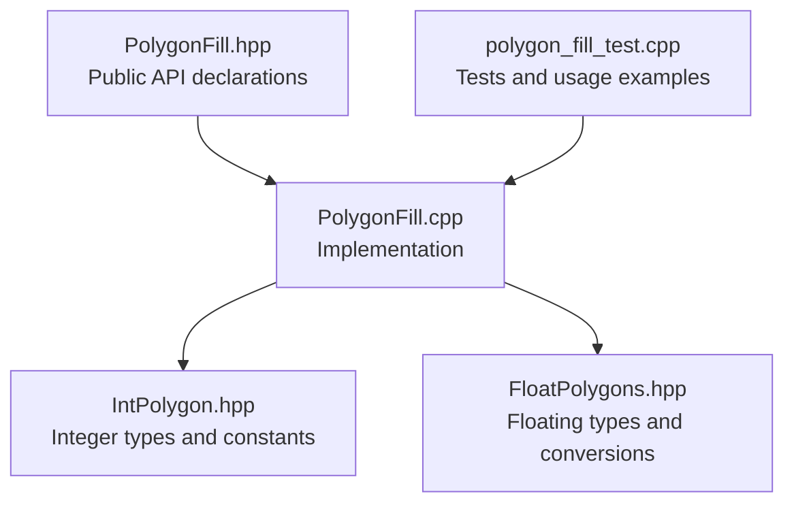
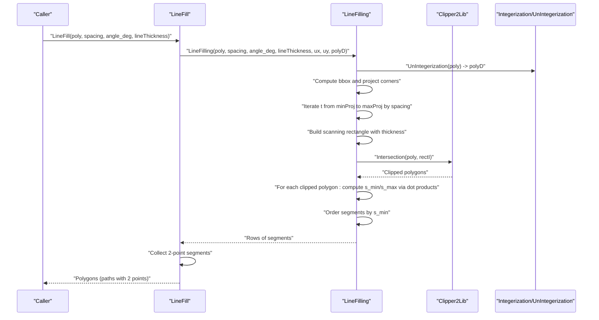
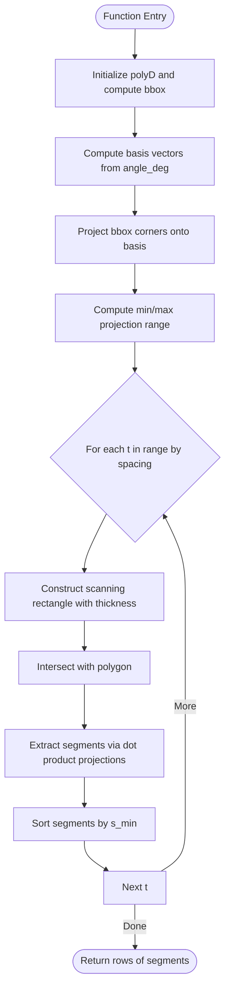
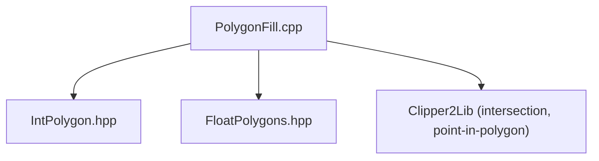

# Line Fill Algorithm

<cite>
**Referenced Files in This Document**
- [PolygonFill.cpp](file://2D/PolygonFill.cpp)
- [PolygonFill.hpp](file://2D/PolygonFill.hpp)
- [IntPolygon.hpp](file://2D/IntPolygon.hpp)
- [FloatPolygons.hpp](file://2D/FloatPolygons.hpp)
- [polygon_fill_test.cpp](file://tests/PolygonFill/polygon_fill_test.cpp)
</cite>

## Table of Contents
1. [Introduction](#introduction)
2. [Project Structure](#project-structure)
3. [Core Components](#core-components)
4. [Architecture Overview](#architecture-overview)
5. [Detailed Component Analysis](#detailed-component-analysis)
6. [Dependency Analysis](#dependency-analysis)
7. [Performance Considerations](#performance-considerations)
8. [Troubleshooting Guide](#troubleshooting-guide)
9. [Conclusion](#conclusion)

## Introduction
This document explains the LineFill algorithm implemented in PolygonFill.cpp. It focuses on how the algorithm generates parallel line segments by projecting the polygon’s axis-aligned bounding box onto a rotated coordinate system defined by an input angle. The process uses a LineFilling helper to create scanning rectangles along the chosen direction, computes intersections with the original polygon, and extracts segment endpoints using dot product projections. The document also covers parameter usage (spacing, angle, lineThickness), floating-point to integer conversions, segment ordering, performance characteristics for high-resolution fills, and guidance for optimizing line angles to achieve anisotropic strength. Edge cases such as empty inputs, invalid angles, and numerical stability in segment intersection are addressed.

## Project Structure
The LineFill algorithm resides in the 2D module alongside supporting polygon utilities and tests:
- PolygonFill.cpp: Implements LineFill, LineFilling, and related fill modes.
- PolygonFill.hpp: Declares public fill APIs.
- IntPolygon.hpp: Defines integer polygon types and constants (including integerization scale).
- FloatPolygons.hpp: Defines floating-point polygon types and conversion utilities.
- tests/PolygonFill/polygon_fill_test.cpp: Validates basic behavior and usage patterns.

**Diagram sources**
- [PolygonFill.hpp](file://2D/PolygonFill.hpp#L1-L46)
- [PolygonFill.cpp](file://2D/PolygonFill.cpp#L1-L1243)
- [IntPolygon.hpp](file://2D/IntPolygon.hpp#L1-L75)
- [FloatPolygons.hpp](file://2D/FloatPolygons.hpp#L1-L72)
- [polygon_fill_test.cpp](file://tests/PolygonFill/polygon_fill_test.cpp#L1-L117)

**Section sources**
- [PolygonFill.hpp](file://2D/PolygonFill.hpp#L1-L46)
- [PolygonFill.cpp](file://2D/PolygonFill.cpp#L1-L1243)
- [IntPolygon.hpp](file://2D/IntPolygon.hpp#L1-L75)
- [FloatPolygons.hpp](file://2D/FloatPolygons.hpp#L1-L72)
- [polygon_fill_test.cpp](file://tests/PolygonFill/polygon_fill_test.cpp#L1-L117)

## Core Components
- LineFill: Public API that produces independent straight line segments (each path has exactly two points). Internally delegates to LineFilling with a fixed lineThickness placeholder and collects 2-point segments into Polygons.
- LineFilling: Internal helper that performs the core computation:
  - Computes the polygon’s axis-aligned bounding box and projects its corners onto the rotated basis vectors defined by the input angle.
  - Iterates along the scan direction with step size equal to spacing, constructing scanning rectangles aligned with the chosen angle.
  - Intersects each scanning rectangle with the polygon to obtain clipped regions.
  - Extracts segment endpoints by computing dot product projections along the scan direction and ensures consistent ordering.
  - Returns rows of segments grouped by scanline.

Key parameters:
- spacing: Distance between scan lines.
- angle_deg: Rotation angle in degrees defining the scan direction.
- lineThickness: Thickness used to construct scanning rectangles; influences width of the clipping region.

Floating-point to integer conversion:
- Uses integerization constant to convert between floating-point and integer coordinates.
- Applies rounding during conversion to nearest integer grid positions.

Segment ordering:
- Segments are sorted by their position along the scan direction (s_min) to ensure deterministic traversal order.

Edge cases handled:
- Empty polygons or invalid spacing lead to early termination.
- Numerical checks prevent degenerate segments and ensure robustness.

**Section sources**
- [PolygonFill.cpp](file://2D/PolygonFill.cpp#L24-L113)
- [PolygonFill.cpp](file://2D/PolygonFill.cpp#L420-L439)
- [IntPolygon.hpp](file://2D/IntPolygon.hpp#L1-L20)
- [FloatPolygons.hpp](file://2D/FloatPolygons.hpp#L51-L56)

## Architecture Overview
The LineFill pipeline transforms a polygon into a set of parallel line segments by rotating the coordinate system and sweeping perpendicular to the rotation axis.

**Diagram sources**
- [PolygonFill.cpp](file://2D/PolygonFill.cpp#L24-L113)
- [PolygonFill.cpp](file://2D/PolygonFill.cpp#L420-L439)
- [IntPolygon.hpp](file://2D/IntPolygon.hpp#L1-L20)
- [FloatPolygons.hpp](file://2D/FloatPolygons.hpp#L51-L56)

## Detailed Component Analysis

### LineFilling Algorithm
LineFilling is the core routine that:
- Converts the input polygon to floating-point coordinates for precise computations.
- Computes the axis-aligned bounding box and projects its four corners onto the rotated basis vectors defined by the angle.
- Determines the range of projection values to sweep across.
- For each scan position t, constructs a scanning rectangle centered on the projection axis with width controlled by lineThickness.
- Intersects the scanning rectangle with the polygon to obtain clipped regions.
- For each clipped region, computes dot product projections to define segment endpoints and ensures consistent ordering along the scan direction.
- Sorts segments by their position along the scan direction.

**Diagram sources**
- [PolygonFill.cpp](file://2D/PolygonFill.cpp#L24-L113)

**Section sources**
- [PolygonFill.cpp](file://2D/PolygonFill.cpp#L24-L113)

### Floating-Point to Integer Conversion
The algorithm uses a global integerization scale to convert between floating-point and integer coordinates:
- Conversions occur when preparing the scanning rectangle and when returning results.
- During conversion, floating-point coordinates are multiplied by the integerization factor and rounded to the nearest integer grid position.

Constants and utilities:
- integerization scale is defined in IntPolygon.hpp.
- Conversion functions are provided in FloatPolygons.hpp.

Practical implications:
- Higher resolution fills require careful tuning of spacing relative to the integerization scale to avoid excessive computational cost or numerical artifacts.
- Results are returned as integer polygons, preserving precision appropriate for downstream operations.

**Section sources**
- [IntPolygon.hpp](file://2D/IntPolygon.hpp#L1-L20)
- [FloatPolygons.hpp](file://2D/FloatPolygons.hpp#L51-L56)
- [PolygonFill.cpp](file://2D/PolygonFill.cpp#L442-L470)

### Segment Ordering and Endpoint Extraction
Endpoint extraction relies on dot product projections:
- For each clipped polygon, the algorithm computes s_min and s_max by taking dot products with the scan direction vector.
- The pair of points corresponding to s_min and s_max defines the segment endpoints.
- The algorithm ensures consistent ordering by swapping endpoints if necessary so that the first endpoint lies earlier along the scan direction.

Sorting:
- Rows of segments are sorted by s_min to guarantee deterministic traversal order across scanlines.

Edge case handling:
- Empty polygons or clipped regions are skipped.
- Degenerate segments with negligible length are ignored.

**Section sources**
- [PolygonFill.cpp](file://2D/PolygonFill.cpp#L79-L111)

### Parameter Usage Examples
Concrete examples from the test suite demonstrate typical parameter usage:
- LineFill with spacing, angle_deg, and lineThickness.
- SimpleZigzagFill and ZigzagFill with the same parameters, showcasing how lineThickness affects scanning rectangle width.

These examples illustrate:
- How spacing controls density of scan lines.
- How angle_deg rotates the scan direction.
- How lineThickness influences the width of the scanning region.

**Section sources**
- [polygon_fill_test.cpp](file://tests/PolygonFill/polygon_fill_test.cpp#L21-L30)
- [polygon_fill_test.cpp](file://tests/PolygonFill/polygon_fill_test.cpp#L31-L56)
- [polygon_fill_test.cpp](file://tests/PolygonFill/polygon_fill_test.cpp#L59-L90)

### API Surface and Integration Points
Public API:
- LineFill, SimpleZigzagFill, ZigzagFill are declared in PolygonFill.hpp.
- Lua bindings expose these functions for scripting integration.

Integration:
- The algorithm integrates with Clipper2Lib for polygon operations (union, intersection, difference).
- It uses PointInPolygons to validate segment placement and ensure segments remain inside the original polygon.

**Section sources**
- [PolygonFill.hpp](file://2D/PolygonFill.hpp#L12-L24)
- [PolygonFill.cpp](file://2D/PolygonFill.cpp#L195-L210)
- [IntPolygon.hpp](file://2D/IntPolygon.hpp#L56-L60)

## Dependency Analysis
The LineFill algorithm depends on:
- PolygonFill.cpp for the core implementation.
- IntPolygon.hpp for integer types and constants.
- FloatPolygons.hpp for floating-point types and conversions.
- Clipper2Lib for polygon operations and point-in-polygon testing.

**Diagram sources**
- [PolygonFill.cpp](file://2D/PolygonFill.cpp#L1-L1243)
- [IntPolygon.hpp](file://2D/IntPolygon.hpp#L1-L75)
- [FloatPolygons.hpp](file://2D/FloatPolygons.hpp#L1-L72)

**Section sources**
- [PolygonFill.cpp](file://2D/PolygonFill.cpp#L1-L1243)
- [IntPolygon.hpp](file://2D/IntPolygon.hpp#L1-L75)
- [FloatPolygons.hpp](file://2D/FloatPolygons.hpp#L1-L72)

## Performance Considerations
- Computational complexity:
  - The algorithm iterates over a number of scan positions proportional to the polygon’s bounding box size divided by spacing. Each iteration involves constructing a scanning rectangle and intersecting it with the polygon.
  - Sorting segments per row adds overhead proportional to the number of segments per row.
- High-resolution fills:
  - Smaller spacing increases the number of scan lines and intersections, raising CPU and memory usage.
  - Larger lineThickness increases the width of scanning rectangles, potentially increasing intersection computations.
- Optimization strategies:
  - Choose spacing larger than the minimum feature size to reduce unnecessary scans.
  - Prefer angles aligned with dominant structural directions to minimize segment count and improve coverage.
  - For very dense fills, consider batching or limiting the number of scanlines.
  - Use appropriate integerization scales to balance precision and performance.
- Memory footprint:
  - Clipping operations and intermediate floating-point representations consume memory proportional to the number of vertices in clipped polygons.

[No sources needed since this section provides general guidance]

## Troubleshooting Guide
Common issues and remedies:
- Empty or invalid inputs:
  - If the polygon is empty or spacing is non-positive, the algorithm returns early with no segments.
- Invalid angles:
  - Angles are converted to radians internally; ensure reasonable values to avoid unexpected scan directions.
- Numerical instability:
  - Very small or near-zero segment lengths can cause degeneracies. The algorithm filters out segments with negligible length.
  - Rounding during integerization can shift segment endpoints slightly; ensure spacing is sufficiently large compared to the integerization scale to avoid artifacts.
- Coverage gaps:
  - If lineThickness is too small relative to spacing, gaps may appear. Increase lineThickness or decrease spacing accordingly.
- Ordering anomalies:
  - Ensure sorting by s_min is applied consistently. Verify that the scan direction vector is computed correctly from the input angle.

Validation via tests:
- The test suite verifies that LineFill produces 2-point segments and that Zigzag/SimpleZigzag segments remain inside the polygon.

**Section sources**
- [polygon_fill_test.cpp](file://tests/PolygonFill/polygon_fill_test.cpp#L21-L30)
- [polygon_fill_test.cpp](file://tests/PolygonFill/polygon_fill_test.cpp#L31-L56)

## Conclusion
The LineFill algorithm in PolygonFill.cpp efficiently generates parallel line segments by projecting the polygon’s bounding box onto a rotated coordinate system defined by the input angle. Through careful construction of scanning rectangles, polygon clipping, and dot product-based endpoint extraction, it produces ordered segments suitable for subsequent processing. Proper tuning of spacing, angle, and lineThickness enables high-resolution fills while maintaining performance and numerical stability. The algorithm’s integration with integerization and Clipper2Lib ensures robust handling of real-world geometry.