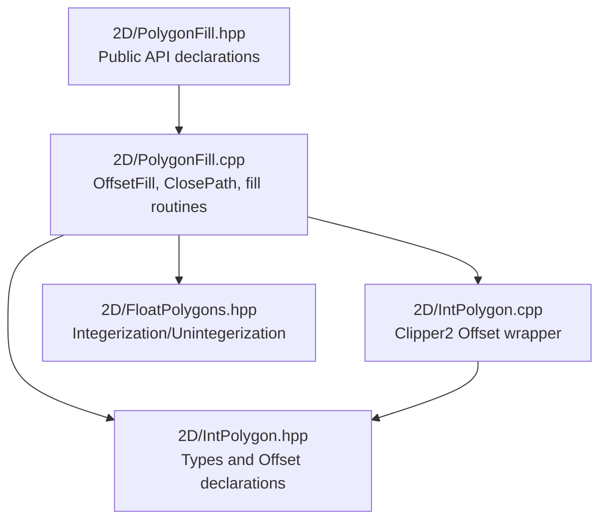
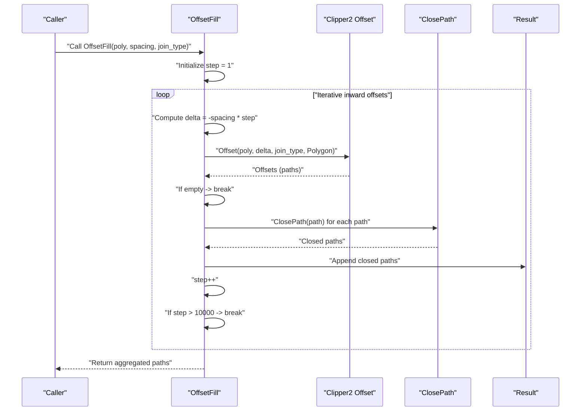
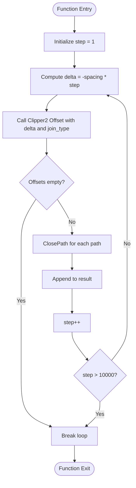
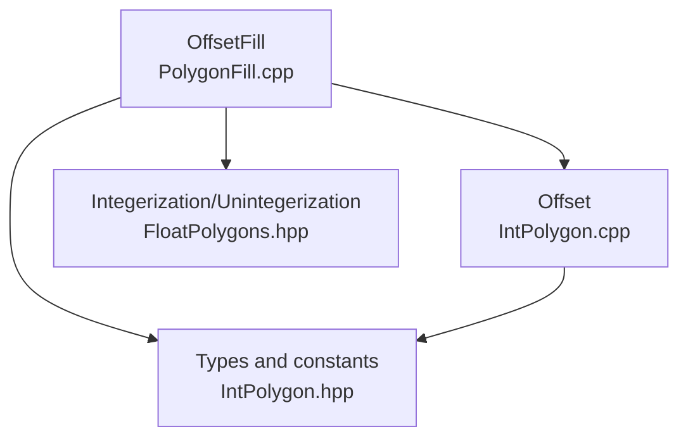

# Offset Fill Algorithm

<cite>
**Referenced Files in This Document**
- [PolygonFill.cpp](file://2D/PolygonFill.cpp)
- [PolygonFill.hpp](file://2D/PolygonFill.hpp)
- [IntPolygon.cpp](file://2D/IntPolygon.cpp)
- [IntPolygon.hpp](file://2D/IntPolygon.hpp)
- [FloatPolygons.hpp](file://2D/FloatPolygons.hpp)
</cite>

## Table of Contents
1. [Introduction](#introduction)
2. [Project Structure](#project-structure)
3. [Core Components](#core-components)
4. [Architecture Overview](#architecture-overview)
5. [Detailed Component Analysis](#detailed-component-analysis)
6. [Dependency Analysis](#dependency-analysis)
7. [Performance Considerations](#performance-considerations)
8. [Troubleshooting Guide](#troubleshooting-guide)
9. [Conclusion](#conclusion)
10. [Appendices](#appendices)

## Introduction
This document explains the Offset Fill algorithm implemented in PolygonFill.cpp. It focuses on how the algorithm generates concentric offset paths by iteratively applying negative offsets using Clipper2’s polygon offsetting with configurable JoinType (Square, Round, Bevel, Miter). It covers the mathematical approach for inward polygon offsetting, handling of self-intersections, closure of output paths, step-by-step iteration, termination conditions, and integration with the ClosePath utility. It also documents performance characteristics in high-curvature regions and provides guidance for selecting spacing and join types for structural integrity in 3D printing, including edge cases such as degenerate polygons, zero spacing, and numerical precision issues during integerization.

## Project Structure
The Offset Fill algorithm resides in the 2D module and integrates with Clipper2 for polygon operations. The primary files involved are:
- PolygonFill.cpp: Contains the OffsetFill function, ClosePath utility, and related fill routines.
- PolygonFill.hpp: Declares the public API for fill algorithms.
- IntPolygon.cpp/.hpp: Provides Clipper2-based polygon operations, including Offset.
- FloatPolygons.hpp: Defines floating-point polygon types and integerization/unintegerization utilities.

**Diagram sources**
- [PolygonFill.cpp](file://2D/PolygonFill.cpp#L1-L1243)
- [PolygonFill.hpp](file://2D/PolygonFill.hpp#L1-L46)
- [IntPolygon.cpp](file://2D/IntPolygon.cpp#L1-L190)
- [IntPolygon.hpp](file://2D/IntPolygon.hpp#L1-L75)
- [FloatPolygons.hpp](file://2D/FloatPolygons.hpp#L1-L72)

**Section sources**
- [PolygonFill.cpp](file://2D/PolygonFill.cpp#L1-L1243)
- [PolygonFill.hpp](file://2D/PolygonFill.hpp#L1-L46)
- [IntPolygon.cpp](file://2D/IntPolygon.cpp#L1-L190)
- [IntPolygon.hpp](file://2D/IntPolygon.hpp#L1-L75)
- [FloatPolygons.hpp](file://2D/FloatPolygons.hpp#L1-L72)

## Core Components
- OffsetFill: Generates concentric inward offset paths by iteratively applying negative offsets with a fixed spacing and specified JoinType. It closes each resulting path and aggregates them into a set of polylines.
- ClosePath: Ensures a polygon path is closed by duplicating the first vertex at the end if not already closed.
- Offset (Clipper2): Performs polygon offsetting with configurable JoinType and EndType. The OffsetFill algorithm uses negative deltas for inward offsets and Polygon EndType to produce closed rings.

Key responsibilities:
- Iterative inward offsetting with controlled spacing.
- Handling empty or degenerate results from Clipper2.
- Closing paths to form valid polygons/polylines.
- Integrating with integerization/unintegerization for robustness.

**Section sources**
- [PolygonFill.cpp](file://2D/PolygonFill.cpp#L395-L418)
- [IntPolygon.cpp](file://2D/IntPolygon.cpp#L52-L68)
- [IntPolygon.hpp](file://2D/IntPolygon.hpp#L47-L54)
- [FloatPolygons.hpp](file://2D/FloatPolygons.hpp#L51-L56)

## Architecture Overview
The Offset Fill algorithm orchestrates the following flow:
- Input polygons are processed as integer coordinates.
- For each iteration, a negative offset delta is computed and passed to Clipper2’s Offset routine.
- The resulting paths are checked for emptiness; if empty, iteration stops.
- Each path is closed using ClosePath and appended to the result.
- The loop terminates either when Clipper2 produces no more offsets or when a safety limit is reached.

**Diagram sources**
- [PolygonFill.cpp](file://2D/PolygonFill.cpp#L395-L418)
- [IntPolygon.cpp](file://2D/IntPolygon.cpp#L52-L68)

## Detailed Component Analysis

### OffsetFill Function
- Purpose: Generate concentric inward offset paths by iteratively applying negative offsets with a fixed spacing and specified JoinType.
- Input:
  - poly: Input polygon(s) represented as integer paths.
  - spacing: Positive offset distance for each iteration.
  - join_type: Clipper2 JoinType (Square, Round, Bevel, Miter).
- Output: A collection of closed polygon paths representing the offset rings.

Mathematical approach:
- Iteration index step starts at 1.
- At each step, delta = -spacing * step (negative for inward offset).
- Clipper2 Offset is invoked with EndType::Polygon to produce closed rings.
- Empty results terminate the loop early.

Termination conditions:
- Clipper2 returns no offsets (empty result).
- Safety cap on iterations (step > 10000).

Closure:
- Each path is closed using ClosePath before appending to results.

Integration with ClosePath:
- ClosePath duplicates the first vertex at the end if the path is not already closed.

Edge cases handled:
- Zero spacing: Returns empty result immediately.
- Extremely small or degenerate polygons: Clipper2 may produce empty offsets, causing early termination.

Performance characteristics:
- Complexity grows with the number of iterations until termination.
- High-curvature regions increase the number of generated paths per iteration due to self-intersections and joins; Clipper2’s JoinType selection influences path count and shape.

**Section sources**
- [PolygonFill.cpp](file://2D/PolygonFill.cpp#L395-L418)
- [IntPolygon.cpp](file://2D/IntPolygon.cpp#L52-L68)
- [IntPolygon.hpp](file://2D/IntPolygon.hpp#L47-L54)

### ClosePath Utility
- Purpose: Ensure a polygon path is closed by adding the first vertex at the end if missing.
- Behavior:
  - If the path is empty or already closed, return unchanged.
  - Otherwise, copy the path and append the first vertex.

Integration:
- Applied to each offset path before appending to results.

**Section sources**
- [PolygonFill.cpp](file://2D/PolygonFill.cpp#L16-L23)

### Offset (Clipper2 Wrapper)
- Purpose: Provide a unified interface to Clipper2’s polygon offsetting.
- Parameters:
  - delta: Signed offset distance (negative for inward).
  - join_type: Square, Round, Bevel, or Miter.
  - end_type: Polygon to produce closed rings.

Behavior:
- Adds paths to ClipperOffset and executes with the given delta.
- Returns resulting paths.

**Section sources**
- [IntPolygon.cpp](file://2D/IntPolygon.cpp#L52-L68)
- [IntPolygon.hpp](file://2D/IntPolygon.hpp#L47-L54)

### Integerization and Precision
- Floating-to-integer conversion:
  - PolygonsD are converted to integer Polygons using a fixed scaling factor.
  - Results are unintegerized back to floating coordinates for Lua outputs.
- Numerical precision:
  - Scaling factor affects rounding behavior; care is needed to avoid degeneracies near zero-length edges or near-collinear vertices.
  - Very small polygons or extreme curvature can lead to near-zero areas or invalid paths after offsetting.

**Section sources**
- [FloatPolygons.hpp](file://2D/FloatPolygons.hpp#L51-L56)
- [IntPolygon.hpp](file://2D/IntPolygon.hpp#L10-L10)

### Step-by-Step Iteration and Termination

**Diagram sources**
- [PolygonFill.cpp](file://2D/PolygonFill.cpp#L395-L418)

## Dependency Analysis
- PolygonFill.cpp depends on:
  - Clipper2 via IntPolygon.cpp for polygon operations.
  - FloatPolygons.hpp for integerization/unintegerization.
  - PolygonFill.hpp for public API declarations.
- Coupling:
  - Tight coupling to Clipper2’s Offset for geometric correctness.
  - Loose coupling to JoinType via parameterization.
- Cohesion:
  - High cohesion within OffsetFill and ClosePath for path closure.
- External dependencies:
  - Clipper2 library for robust polygon arithmetic and offsetting.

**Diagram sources**
- [PolygonFill.cpp](file://2D/PolygonFill.cpp#L395-L418)
- [IntPolygon.cpp](file://2D/IntPolygon.cpp#L52-L68)
- [IntPolygon.hpp](file://2D/IntPolygon.hpp#L10-L10)
- [FloatPolygons.hpp](file://2D/FloatPolygons.hpp#L51-L56)

**Section sources**
- [PolygonFill.cpp](file://2D/PolygonFill.cpp#L395-L418)
- [IntPolygon.cpp](file://2D/IntPolygon.cpp#L52-L68)
- [IntPolygon.hpp](file://2D/IntPolygon.hpp#L10-L10)
- [FloatPolygons.hpp](file://2D/FloatPolygons.hpp#L51-L56)

## Performance Considerations
- Iterative complexity: Number of iterations depends on polygon size and curvature; high-curvature regions often yield more self-intersections and splits, increasing computation.
- JoinType impact:
  - Square and Miter can introduce long extensions at sharp angles, potentially increasing path count and computational cost.
  - Round and Bevel tend to smooth joins, reducing excessive extensions but possibly increasing path density.
- Early termination: Clipper2 returning empty offsets halts further iterations, preventing unnecessary work.
- Safety cap: A hard cap on iterations prevents runaway loops for pathological inputs.
- Integerization effects: Rounding during integerization can alter geometry slightly; ensure spacing is chosen to balance structural integrity and printability.

[No sources needed since this section provides general guidance]

## Troubleshooting Guide
Common issues and remedies:
- No output:
  - Cause: Zero spacing or degenerate polygon.
  - Remedy: Verify spacing > 0 and polygon validity; consider simplification prior to offsetting.
- Excessive runtime:
  - Cause: High-curvature geometry with Square/Miter joins.
  - Remedy: Switch to Round/Bevel joins or reduce spacing; consider pre-processing with MakeSimple.
- Self-intersections and gaps:
  - Cause: Aggressive inward offsets leading to splits.
  - Remedy: Reduce spacing incrementally; validate with visual inspection; consider hybrid approaches.
- Numerical precision artifacts:
  - Cause: Integerization rounding near tiny edges.
  - Remedy: Increase spacing; post-process with MakeSimple; verify area thresholds for discard logic.
- Degenerate polygons:
  - Cause: Near-zero area or collinear vertices.
  - Remedy: Preprocess with MakeSimple; adjust tolerance; validate polygon orientation.

**Section sources**
- [PolygonFill.cpp](file://2D/PolygonFill.cpp#L395-L418)
- [IntPolygon.cpp](file://2D/IntPolygon.cpp#L1-L190)

## Conclusion
The Offset Fill algorithm in PolygonFill.cpp provides a robust method for generating concentric inward offset paths using Clipper2. By iterating with negative offsets and closing each path, it produces a set of polylines suitable for 3D printing infills. Proper selection of spacing and JoinType is crucial for balancing structural integrity and performance. Edge cases such as degenerate polygons, zero spacing, and numerical precision are handled through early termination, safety caps, and careful integerization. For high-curvature regions, Round or Bevel joins typically yield better results, while Square or Miter may require smaller spacing to avoid excessive extensions.

[No sources needed since this section summarizes without analyzing specific files]

## Appendices

### Mathematical Approach for Inward Polygon Offsetting
- Delta progression: delta = -spacing × step, where step ≥ 1.
- Clipper2 Offset with EndType::Polygon ensures closed rings.
- Self-intersections:
  - Sharp angles with Square/Miter joins can cause spikes and splits.
  - Round/Bevel joins mitigate spikes but may increase path density.
- Closure:
  - ClosePath guarantees each ring is closed, enabling downstream path processing.

**Section sources**
- [PolygonFill.cpp](file://2D/PolygonFill.cpp#L395-L418)
- [IntPolygon.cpp](file://2D/IntPolygon.cpp#L52-L68)

### Guidance for 3D Printing Structural Integrity
- Spacing selection:
  - Larger spacing reduces path count but may compromise strength.
  - Smaller spacing increases density and strength but raises print time.
- JoinType selection:
  - Round/Bevel: Better for curved regions; smoother transitions.
  - Square/Miter: Stronger at corners but may extend beyond boundaries; use with caution.
- Curvature-aware tuning:
  - High-curvature regions benefit from Round/Bevel and reduced spacing.
  - Low-curvature regions can use Square/Miter with larger spacing.
- Tolerance and preprocessing:
  - Apply MakeSimple to remove near-degeneracies.
  - Validate polygon orientation and area thresholds to discard trivial islands.

**Section sources**
- [PolygonFill.cpp](file://2D/PolygonFill.cpp#L395-L418)
- [IntPolygon.cpp](file://2D/IntPolygon.cpp#L1-L190)