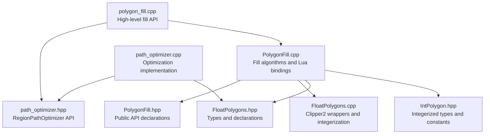
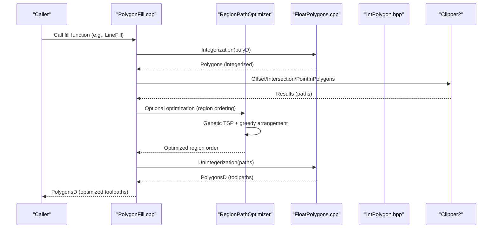
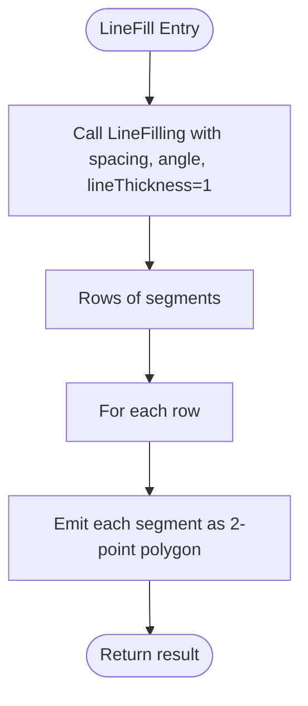
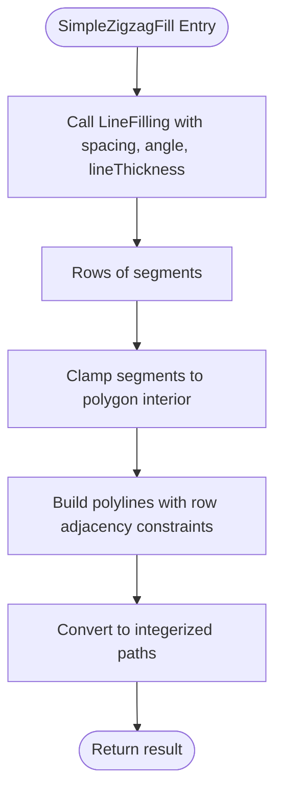
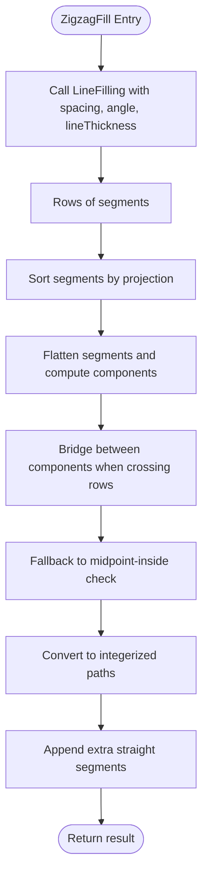
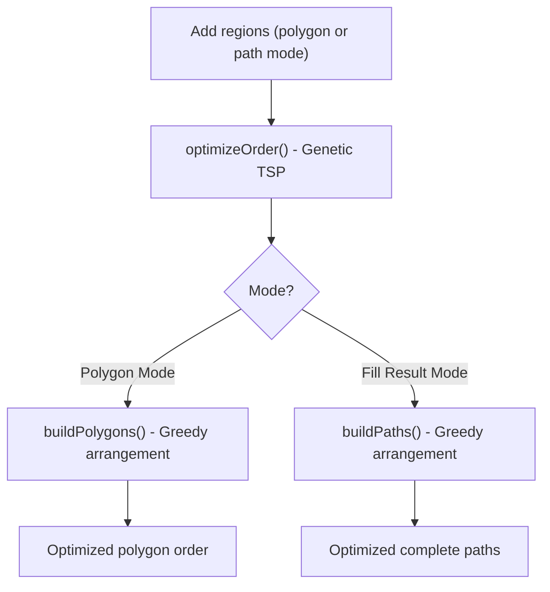
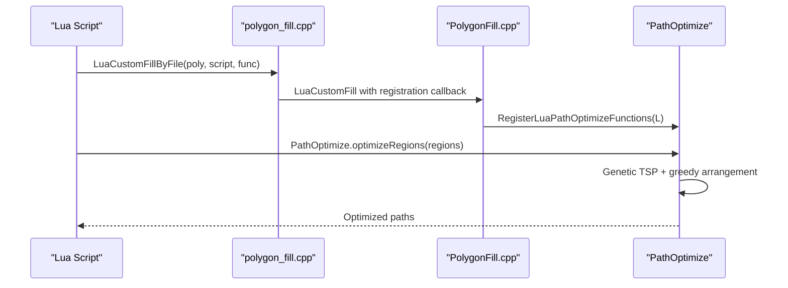
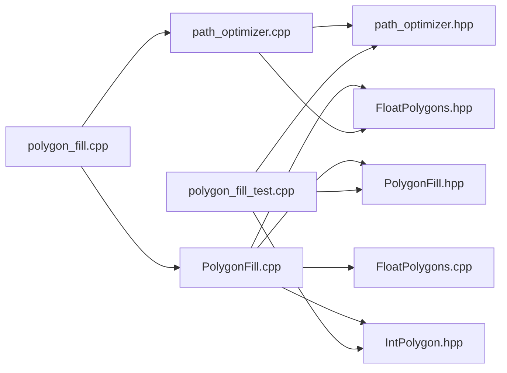

# Polygon Fill Algorithms

<cite>
**Referenced Files in This Document**
- [PolygonFill.cpp](file://2D/PolygonFill.cpp)
- [PolygonFill.hpp](file://2D/PolygonFill.hpp)
- [FloatPolygons.cpp](file://2D/FloatPolygons.cpp)
- [FloatPolygons.hpp](file://2D/FloatPolygons.hpp)
- [IntPolygon.hpp](file://2D/IntPolygon.hpp)
- [path_optimizer.hpp](file://LibHsBaSlicer/Path/path_optimizer.hpp)
- [path_optimizer.cpp](file://LibHsBaSlicer/Path/path_optimizer.cpp)
- [polygon_fill.cpp](file://LibHsBaSlicer/Fill/polygon_fill.cpp)
- [polygon_fill_test.cpp](file://tests/PolygonFill/polygon_fill_test.cpp)
- [custom_fill.lua](file://tests/PolygonFill/custom_fill.lua)
- [optimize_paths.lua](file://tests/PolygonFill/optimize_paths.lua)
</cite>

## Update Summary
**Changes Made**
- Added comprehensive documentation for the integrated path optimization system using RegionPathOptimizer
- Updated architecture overview to include path optimization pipeline stages
- Enhanced API summary with new optimization functions
- Added detailed explanation of polygon mode vs fill-result mode optimization
- Updated performance considerations to include optimization complexity
- Expanded troubleshooting guide with optimization-related issues

## Table of Contents
1. [Introduction](#introduction)
2. [Project Structure](#project-structure)
3. [Core Components](#core-components)
4. [Architecture Overview](#architecture-overview)
5. [Detailed Component Analysis](#detailed-component-analysis)
6. [Path Optimization System](#path-optimization-system)
7. [Dependency Analysis](#dependency-analysis)
8. [Performance Considerations](#performance-considerations)
9. [Troubleshooting Guide](#troubleshooting-guide)
10. [Conclusion](#conclusion)
11. [Appendices](#appendices)

## Introduction
This document explains the polygon fill algorithms implemented in PolygonFill.cpp, focusing on OffsetFill, LineFill, SimpleZigzagFill, and ZigzagFill. It details the mathematical foundations, algorithmic approaches, and how each fill type processes input polygons to produce toolpaths suitable for 3D printing. The system now includes an integrated path optimization layer that optimizes region visitation order to minimize travel moves between independent polygon regions. It also documents parameter usage, numerical precision handling, and integration with Clipper2 for polygon operations. Performance characteristics and selection guidance are included, along with edge-case handling for degenerate polygons and floating-point stability.

## Project Structure
The fill algorithms reside in the 2D module alongside supporting polygon utilities and a new path optimization system:
- PolygonFill.cpp/.hpp: Fill algorithms and Lua bindings
- FloatPolygons.cpp/.hpp: Floating-point polygon operations and integerization utilities
- IntPolygon.hpp: Integerized polygon types and constants
- path_optimizer.hpp/.cpp: Path optimization system with RegionPathOptimizer
- polygon_fill.cpp: High-level fill API with optimization integration
- Tests: Unit tests and Lua-based custom fill examples



**Diagram sources**
- [PolygonFill.cpp:1-1439](file://2D/PolygonFill.cpp#L1-L1439)
- [PolygonFill.hpp:1-137](file://2D/PolygonFill.hpp#L1-L137)
- [FloatPolygons.cpp:1-122](file://2D/FloatPolygons.cpp#L1-L122)
- [FloatPolygons.hpp:1-72](file://2D/FloatPolygons.hpp#L1-L72)
- [IntPolygon.hpp:1-39](file://2D/IntPolygon.hpp#L1-L39)
- [path_optimizer.hpp:1-166](file://LibHsBaSlicer/Path/path_optimizer.hpp#L1-L166)
- [path_optimizer.cpp:1-628](file://LibHsBaSlicer/Path/path_optimizer.cpp#L1-L628)
- [polygon_fill.cpp:1-47](file://LibHsBaSlicer/Fill/polygon_fill.cpp#L1-L47)

**Section sources**
- [PolygonFill.cpp:1-1439](file://2D/PolygonFill.cpp#L1-L1439)
- [PolygonFill.hpp:1-137](file://2D/PolygonFill.hpp#L1-L137)
- [FloatPolygons.cpp:1-122](file://2D/FloatPolygons.cpp#L1-L122)
- [FloatPolygons.hpp:1-72](file://2D/FloatPolygons.hpp#L1-L72)
- [IntPolygon.hpp:1-39](file://2D/IntPolygon.hpp#L1-L39)
- [path_optimizer.hpp:1-166](file://LibHsBaSlicer/Path/path_optimizer.hpp#L1-L166)
- [path_optimizer.cpp:1-628](file://LibHsBaSlicer/Path/path_optimizer.cpp#L1-L628)
- [polygon_fill.cpp:1-47](file://LibHsBaSlicer/Fill/polygon_fill.cpp#L1-L47)

## Core Components
- OffsetFill: Generates concentric offset paths around the input polygon using Clipper2 offset operations with configurable join types. Returns closed integerized paths suitable for toolpaths.
- LineFill: Produces straight-line segments across scanlines at a given angle and spacing, returning 2-point polylines.
- SimpleZigzagFill: Builds a connected zigzag path by connecting segment centers across adjacent scanlines, clamping segments to the polygon interior and avoiding loops.
- ZigzagFill: Similar to SimpleZigzagFill but constructs a more complex connectivity graph across scanlines, including bridges between disconnected components when crossing rows.
- RegionPathOptimizer: Optimizes the visitation order of independent polygon regions to minimize travel moves between regions, supporting both polygon mode (before fill) and fill-result mode (after fill).

Key integration points:
- Integerization/UnIntegerization: Converts between floating-point and integer coordinate spaces using a fixed scaling factor.
- Clipper2 operations: Union, intersection, difference, offset, and point-in-polygon checks.
- Path optimization: Genetic TSP solver for region ordering with greedy intra-region arrangement.
- Lua bindings: Expose fill functions and optimization capabilities to external scripts for custom toolpath generation.

**Section sources**
- [PolygonFill.hpp:1-137](file://2D/PolygonFill.hpp#L1-L137)
- [FloatPolygons.cpp:60-97](file://2D/FloatPolygons.cpp#L60-L97)
- [IntPolygon.hpp:1-16](file://2D/IntPolygon.hpp#L1-L16)
- [path_optimizer.hpp:18-84](file://LibHsBaSlicer/Path/path_optimizer.hpp#L18-L84)

## Architecture Overview
The enhanced fill pipeline now includes a path optimization stage that minimizes travel moves between independent polygon regions. The pipeline converts floating inputs to integer coordinates, performs geometric operations, optimizes region ordering, and produces optimized integer toolpaths. Lua functions wrap the C++ fill routines and return results back to the scripting environment with access to optimization capabilities.



**Diagram sources**
- [PolygonFill.cpp:1-1439](file://2D/PolygonFill.cpp#L1-L1439)
- [path_optimizer.cpp:1-628](file://LibHsBaSlicer/Path/path_optimizer.cpp#L1-L628)
- [FloatPolygons.cpp:60-97](file://2D/FloatPolygons.cpp#L60-L97)
- [IntPolygon.hpp:1-16](file://2D/IntPolygon.hpp#L1-L16)

## Detailed Component Analysis

### Mathematical Foundations and Coordinate Space
- Scaling factor: integerization constant scales floating coordinates to integers for robust Clipper2 computations.
- Integerization: Multiplies floating coordinates by integerization and rounds to nearest integer.
- UnIntegerization: Divides integer coordinates by integerization to recover floating precision for output.

Precision and stability:
- Epsilon offsets are used to avoid degeneracies when clamping segments to polygon interiors.
- Robust point-in-polygon checks prevent paths from leaving the polygon boundaries.
- Sorting and connectivity rely on projections along scanline directions to ensure deterministic ordering.

Integration with Clipper2:
- Offset operations support Square, Bevel, Round, and Miter joins.
- Intersections clip scanline segments to polygon interiors.
- Point-in-polygon checks confirm segment validity.

**Section sources**
- [IntPolygon.hpp:1-16](file://2D/IntPolygon.hpp#L1-L16)
- [FloatPolygons.cpp:60-97](file://2D/FloatPolygons.cpp#L60-L97)
- [FloatPolygons.hpp:1-72](file://2D/FloatPolygons.hpp#L1-L72)

### OffsetFill
- Purpose: Generate concentric offset paths around the input polygon using increasing/decreasing deltas until empty results occur.
- Approach:
  - Iteratively applies Clipper2 offset with EndType::Polygon.
  - Collects results up to a safety limit.
  - Closes each resulting path by duplicating the first vertex.
- Output: Closed integerized paths representing offset contours.


**Diagram sources**
- [PolygonFill.cpp:414-443](file://2D/PolygonFill.cpp#L414-L443)

**Section sources**
- [PolygonFill.cpp:414-443](file://2D/PolygonFill.cpp#L414-L443)

### LineFill
- Purpose: Produce straight-line segments across scanlines at a specified angle and spacing.
- Approach:
  - Uses internal LineFilling routine to compute scanline intersections with the polygon.
  - Sorts segments by projection along the scan direction.
  - Outputs each segment as a 2-point polygon (line segment).
- Output: A set of 2-point polylines forming a raster-like fill.



**Diagram sources**
- [PolygonFill.cpp:445-465](file://2D/PolygonFill.cpp#L445-L465)

**Section sources**
- [PolygonFill.cpp:445-465](file://2D/PolygonFill.cpp#L445-L465)

### SimpleZigzagFill
- Purpose: Build a connected zigzag path by connecting segment centers across adjacent scanlines.
- Approach:
  - Computes scanline segments via LineFilling.
  - Clamps segments to polygon interior using binary search on segment parametrization.
  - Connects segments within the same row or adjacent rows; avoids long-range connections to prevent loops.
  - Converts final polylines to integerized paths.
- Output: A set of connected integerized polylines forming a zigzag toolpath.



**Diagram sources**
- [PolygonFill.cpp:467-666](file://2D/PolygonFill.cpp#L467-L666)

**Section sources**
- [PolygonFill.cpp:467-666](file://2D/PolygonFill.cpp#L467-L666)

### ZigzagFill
- Purpose: Construct a more sophisticated zigzag by building connectivity across scanlines and bridging disconnected components when crossing rows.
- Approach:
  - Computes scanline segments via LineFilling.
  - Sorts segments by projection along scan direction.
  - Flattens segments and computes connected components across adjacent rows using interval overlap.
  - Bridges between components when moving to the next row; falls back to simple connection if midpoint is inside polygon.
  - Converts final polylines to integerized paths and appends any extra straight segments that failed to connect.
- Output: A set of connected integerized polylines with bridges where necessary.



**Diagram sources**
- [PolygonFill.cpp:668-1164](file://2D/PolygonFill.cpp#L668-L1164)

**Section sources**
- [PolygonFill.cpp:668-1164](file://2D/PolygonFill.cpp#L668-L1164)

### Parameter Usage and Numerical Precision
- spacing: Distance between scanlines or offset steps. Must be positive; non-positive inputs return empty results for zigzag variants.
- angle_deg: Scanline orientation in degrees; converted to radians for trigonometric basis vectors.
- lineThickness: Controls segment width and clamping offsets; influences epsilon offsets and sampling for bridges.
- Join types: Square, Bevel, Round, Miter for offset operations.
- Integerization: Fixed scaling factor ensures robust Clipper2 operations while preserving precision for output.

Numerical stability:
- Epsilon offsets prevent degeneracies when clamping segments.
- Binary search on segment parametrization locates first/last inside positions reliably.
- Point-in-polygon checks ensure output paths remain inside the polygon.
- Sorting by projection ensures deterministic ordering across rows.

**Section sources**
- [PolygonFill.cpp:19-24](file://2D/PolygonFill.cpp#L19-L24)
- [PolygonFill.cpp:467-666](file://2D/PolygonFill.cpp#L467-L666)
- [PolygonFill.cpp:668-1164](file://2D/PolygonFill.cpp#L668-L1164)
- [IntPolygon.hpp:1-16](file://2D/IntPolygon.hpp#L1-L16)
- [FloatPolygons.cpp:60-97](file://2D/FloatPolygons.cpp#L60-L97)

### Integration with Clipper2
- Offset: Applies offsets with configurable join types and EndType::Polygon to produce closed contours.
- Intersection: Clips scanline rectangles to polygon interiors to extract segments.
- PointInPolygons: Determines whether points lie inside the polygon for clamping and connectivity decisions.
- Area: Used to filter small islands during hybrid fill.

**Section sources**
- [PolygonFill.cpp:135-179](file://2D/PolygonFill.cpp#L135-L179)
- [PolygonFill.cpp:1166-1270](file://2D/PolygonFill.cpp#L1166-L1270)
- [FloatPolygons.cpp:1-58](file://2D/FloatPolygons.cpp#L1-L58)

## Path Optimization System

### RegionPathOptimizer Overview
The path optimization system provides intelligent ordering of independent polygon regions to minimize travel moves between regions. It supports two distinct modes:

**Polygon Mode (Before Fill)**: Optimizes the order of polygon processing before fill generation. Regions are modeled as AreaGraph vertices with all polygon vertices serving as gates (entry/exit points).

**Fill-Result Mode (After Fill)**: Optimizes the order of already-generated fill paths. Each polyline's endpoints serve as gates, allowing multi-point polylines to be handled efficiently.

### Mathematical Foundation
- **AreaGraph Modeling**: Each region becomes a vertex in an area graph, with gates representing candidate entry/exit points.
- **Cost Calculation**: Intra-region costs use gate-to-gate distances; inter-region costs use minimum endpoint distances.
- **TSP Solution**: Genetic algorithm solves the Traveling Salesman Problem for region ordering when ≥3 regions exist.
- **Greedy Arrangement**: Within each region, paths are arranged greedily to minimize jumps and maintain continuity.

### Implementation Details


**Diagram sources**
- [path_optimizer.cpp:113-195](file://LibHsBaSlicer/Path/path_optimizer.cpp#L113-L195)

### Integration with Fill Pipeline
The path optimization system is seamlessly integrated into the fill pipeline through the `LuaCustomFillByFile` function, which automatically registers the `PathOptimize` Lua interface alongside standard polygon operations.



**Diagram sources**
- [polygon_fill.cpp:32-44](file://LibHsBaSlicer/Fill/polygon_fill.cpp#L32-L44)
- [path_optimizer.cpp:619-628](file://LibHsBaSlicer/Path/path_optimizer.cpp#L619-L628)

### Lua Interface
The optimization system exposes a comprehensive Lua interface:

| Function | Description |
|----------|-------------|
| `PathOptimize.new()` | Create optimizer object |
| `addRegion(id, paths)` | Add fill-result region (multi-point polylines supported) |
| `addPolygonRegion(id, polygons)` | Add polygon-mode region (all vertices as gates) |
| `addRoute(from, to, cost)` | Manually specify inter-region travel cost |
| `optimizeOrder()` | Solve TSP for region ordering |
| `buildPaths()` | Get optimized complete paths (fill-result mode) |
| `buildPolygons()` | Get optimized polygon order (polygon mode) |
| `PathOptimize.optimizeRegions(regions)` | One-shot fill-result optimization |
| `PathOptimize.optimizePolygons(regions)` | One-shot polygon-mode optimization |

**Section sources**
- [path_optimizer.hpp:18-166](file://LibHsBaSlicer/Path/path_optimizer.hpp#L18-L166)
- [path_optimizer.cpp:377-628](file://LibHsBaSlicer/Path/path_optimizer.cpp#L377-L628)
- [polygon_fill.cpp:32-44](file://LibHsBaSlicer/Fill/polygon_fill.cpp#L32-L44)

### Example Usage
```lua
-- Fill-result mode optimization
function optimize_paths(regions)
    return PathOptimize.optimizeRegions(regions)
end

-- Manual optimization with custom routes
function optimize_paths_manual(regions)
    local opt = PathOptimize.new()
    for i, paths in ipairs(regions) do
        opt:addRegion(i, paths)
    end
    opt:addRoute(1, 2, 15.0) -- Custom route cost
    local order = opt:optimizeOrder()
    return opt:buildPaths()
end

-- Polygon mode optimization (before fill)
function optimize_polygons(regions)
    return PathOptimize.optimizePolygons(regions)
end
```

**Section sources**
- [optimize_paths.lua:1-34](file://tests/PolygonFill/optimize_paths.lua#L1-L34)

## Dependency Analysis
- PolygonFill.cpp depends on:
  - PolygonFill.hpp for public API declarations
  - FloatPolygons.cpp/.hpp for integerization/unintegerization and Clipper2 wrappers
  - IntPolygon.hpp for integerized types and integerization constant
- Path optimization system depends on:
  - AreaGraph for region modeling
  - Genetic TSP solver for optimal ordering
  - Greedy algorithms for intra-region arrangement
- Tests exercise:
  - Basic fill correctness and containment
  - Composite and hybrid fills
  - Lua custom fill integration
  - Path optimization functionality



**Diagram sources**
- [PolygonFill.cpp:1-1439](file://2D/PolygonFill.cpp#L1-L1439)
- [PolygonFill.hpp:1-137](file://2D/PolygonFill.hpp#L1-L137)
- [FloatPolygons.cpp:1-122](file://2D/FloatPolygons.cpp#L1-L122)
- [FloatPolygons.hpp:1-72](file://2D/FloatPolygons.hpp#L1-L72)
- [IntPolygon.hpp:1-39](file://2D/IntPolygon.hpp#L1-L39)
- [path_optimizer.hpp:1-166](file://LibHsBaSlicer/Path/path_optimizer.hpp#L1-L166)
- [path_optimizer.cpp:1-628](file://LibHsBaSlicer/Path/path_optimizer.cpp#L1-L628)
- [polygon_fill.cpp:1-47](file://LibHsBaSlicer/Fill/polygon_fill.cpp#L1-L47)
- [polygon_fill_test.cpp:1-452](file://tests/PolygonFill/polygon_fill_test.cpp#L1-L452)

**Section sources**
- [PolygonFill.cpp:1-1439](file://2D/PolygonFill.cpp#L1-L1439)
- [PolygonFill.hpp:1-137](file://2D/PolygonFill.hpp#L1-L137)
- [FloatPolygons.cpp:1-122](file://2D/FloatPolygons.cpp#L1-L122)
- [FloatPolygons.hpp:1-72](file://2D/FloatPolygons.hpp#L1-L72)
- [IntPolygon.hpp:1-39](file://2D/IntPolygon.hpp#L1-L39)
- [path_optimizer.hpp:1-166](file://LibHsBaSlicer/Path/path_optimizer.hpp#L1-L166)
- [path_optimizer.cpp:1-628](file://LibHsBaSlicer/Path/path_optimizer.cpp#L1-L628)
- [polygon_fill.cpp:1-47](file://LibHsBaSlicer/Fill/polygon_fill.cpp#L1-L47)
- [polygon_fill_test.cpp:1-452](file://tests/PolygonFill/polygon_fill_test.cpp#L1-L452)

## Performance Considerations
- Complexity:
  - LineFilling: O(N_rows × N_segs_per_row) for segment extraction plus sorting per row.
  - SimpleZigzagFill: Additional clamping and polyline construction; worst-case grows with number of segments and rows.
  - ZigzagFill: Adds component detection and bridging; complexity increases with row connectivity and bridge computation.
  - OffsetFill: Iterative offsetting; stops when results become empty, bounded by a safety limit.
  - Path Optimization: Genetic TSP solver with O(n²) cost matrix computation for n regions; greedy intra-region arrangement is linear in path count.
- Memory:
  - Temporary storage for rows, segments, polylines, and bridges; results are integerized paths.
  - Path optimization stores region graphs and cost matrices proportional to region count and path counts.
- Practical tips:
  - Reduce spacing for finer detail; increase angle_deg for different raster orientations.
  - Use appropriate join types for offsetFill to balance sharpness vs. smoothness.
  - Prefer SimpleZigzagFill for speed; use ZigzagFill for better connectivity in complex regions.
  - For large polygons, consider simplifying input geometry beforehand.
  - Use path optimization for multiple disconnected regions to significantly reduce travel moves.
  - Choose between polygon mode (faster, less precise) and fill-result mode (slower, more accurate) based on requirements.

## Troubleshooting Guide
Common issues and remedies:
- Degenerate polygons:
  - Empty or invalid input polygons yield empty results; validate inputs before calling fill routines.
- Non-positive spacing:
  - LineFill and zigzag variants return empty results for non-positive spacing.
- Very small lineThickness:
  - May cause numerical instability in clamping; increase thickness slightly.
- Disconnected components:
  - ZigzagFill builds bridges between components; if bridges fail, fallback to midpoint-inside check and extra straight segments are appended.
- Floating-point precision:
  - Epsilon offsets and binary search mitigate precision issues; ensure integerization constant remains consistent.
- Lua integration:
  - Verify script loads and function name match expectations; ensure returned table contains arrays of {x,y} points.
- Path optimization issues:
  - Mixed modes: Cannot mix polygon mode and fill-result mode regions in the same optimizer instance.
  - Insufficient regions: Optimization only applies when ≥2 regions exist; single regions pass through unchanged.
  - Route conflicts: Manual route specifications override automatic distance calculations; ensure symmetric costs.
  - Performance: Large numbers of regions may require tuning genetic algorithm parameters or reducing region count.

**Section sources**
- [PolygonFill.cpp:467-666](file://2D/PolygonFill.cpp#L467-L666)
- [PolygonFill.cpp:668-1164](file://2D/PolygonFill.cpp#L668-L1164)
- [path_optimizer.cpp:163-195](file://LibHsBaSlicer/Path/path_optimizer.cpp#L163-L195)
- [polygon_fill_test.cpp:426-452](file://tests/PolygonFill/polygon_fill_test.cpp#L426-L452)

## Conclusion
The polygon fill algorithms provide flexible toolpath generation for 3D printing with an integrated path optimization system:
- OffsetFill offers concentric contour paths.
- LineFill produces straightforward raster-like fills.
- SimpleZigzagFill balances speed and connectivity with row-local connections.
- ZigzagFill improves connectivity across rows with bridges and fallbacks.
- RegionPathOptimizer minimizes travel moves between independent regions using genetic TSP and greedy arrangement.

The system integrates seamlessly with Clipper2 and supports Lua-based customization with full optimization capabilities. Proper parameter tuning, attention to numerical stability, and strategic use of path optimization ensure reliable results across diverse geometries while minimizing total print time through reduced travel moves.

## Appendices

### API Summary
- OffsetFill(poly, spacing, join_type)
- LineFill(poly, spacing, angle_deg, lineThickness)
- SimpleZigzagFill(poly, spacing, angle_deg, lineThickness)
- ZigzagFill(poly, spacing, angle_deg, lineThickness)
- CompositeOffsetFill(poly, spacing, offsetStep, outwardCount, inwardCount, mode, angle_deg, lineThickness, join_type)
- HybridFill(poly, spacing, offsetStep, outwardCount, inwardCount, mode, angle_deg, lineThickness, join_type)
- LuaCustomFill(poly, scriptPath, functionName, lineThickness)
- LuaCustomFillString(poly, script, functionName, lineThickness)
- RegionPathOptimizer.addRegion(regionId, paths)
- RegionPathOptimizer.addPolygonRegion(regionId, polygons)
- RegionPathOptimizer.addRoute(fromId, toId, cost)
- RegionPathOptimizer.optimizeOrder()
- RegionPathOptimizer.buildPaths()
- RegionPathOptimizer.buildPolygons()
- LuaOptimizeRegionPaths(regions, scriptPath, functionName)
- LuaOptimizeRegionPolygons(regions, scriptPath, functionName)

**Section sources**
- [PolygonFill.hpp:1-137](file://2D/PolygonFill.hpp#L1-L137)
- [path_optimizer.hpp:18-166](file://LibHsBaSlicer/Path/path_optimizer.hpp#L18-L166)
- [polygon_fill.cpp:9-44](file://LibHsBaSlicer/Fill/polygon_fill.cpp#L9-L44)

### Path Optimization Modes Comparison
| Aspect | Polygon Mode | Fill-Result Mode |
|--------|--------------|------------------|
| Execution Timing | Before fill generation | After fill generation |
| Input Data | Polygon contours | Generated fill paths |
| Gate Points | All polygon vertices | First/last endpoints of polylines |
| Output | Optimized polygon order | Complete optimized paths |
| Precision | Less precise (vertex-based) | More precise (endpoint-based) |
| Performance | Faster (fewer gates) | Slower (more gates) |
| Use Case | Pre-fill optimization | Post-fill optimization |

**Section sources**
- [path_optimizer.hpp:22-26](file://LibHsBaSlicer/Path/path_optimizer.hpp#L22-L26)
- [path_optimizer.cpp:81-104](file://LibHsBaSlicer/Path/path_optimizer.cpp#L81-L104)