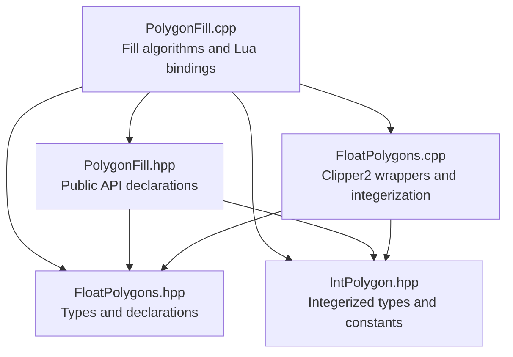
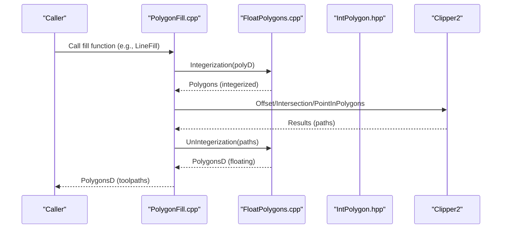
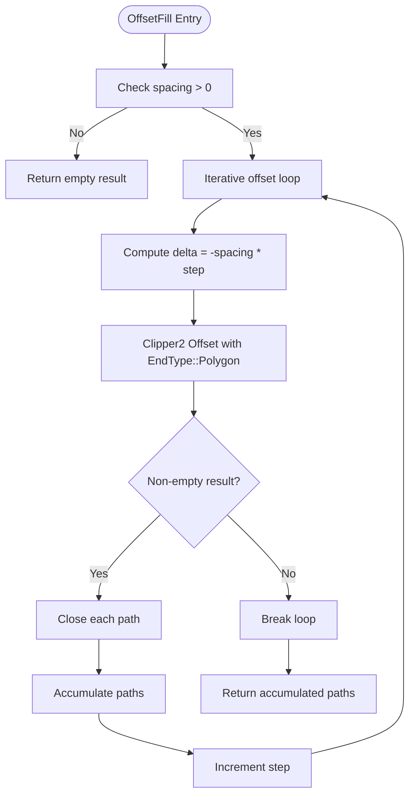
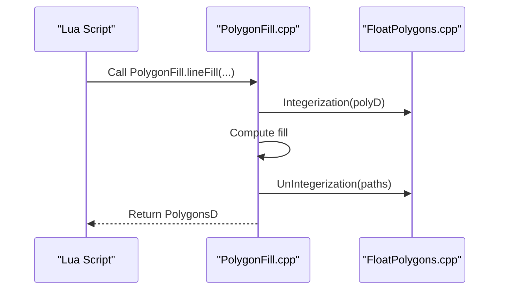
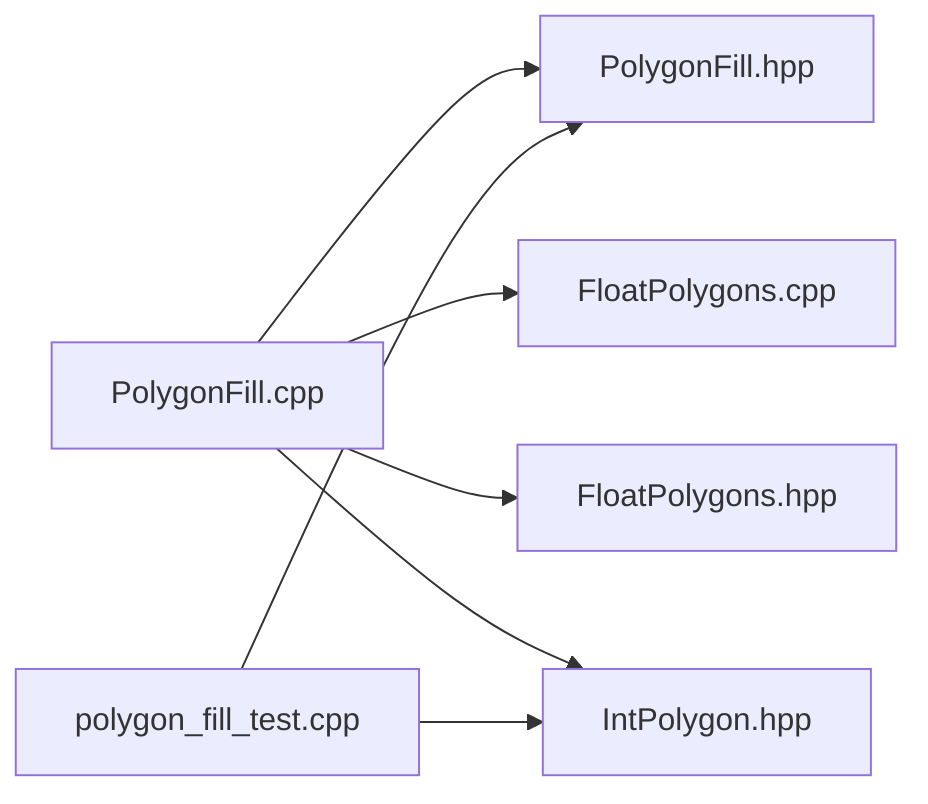

# Polygon Fill Algorithms

<cite>
**Referenced Files in This Document**
- [PolygonFill.cpp](file://2D/PolygonFill.cpp)
- [PolygonFill.hpp](file://2D/PolygonFill.hpp)
- [FloatPolygons.cpp](file://2D/FloatPolygons.cpp)
- [FloatPolygons.hpp](file://2D/FloatPolygons.hpp)
- [IntPolygon.hpp](file://2D/IntPolygon.hpp)
- [polygon_fill_test.cpp](file://tests/PolygonFill/polygon_fill_test.cpp)
- [custom_fill.lua](file://tests/PolygonFill/custom_fill.lua)
</cite>

## Table of Contents
1. [Introduction](#introduction)
2. [Project Structure](#project-structure)
3. [Core Components](#core-components)
4. [Architecture Overview](#architecture-overview)
5. [Detailed Component Analysis](#detailed-component-analysis)
6. [Dependency Analysis](#dependency-analysis)
7. [Performance Considerations](#performance-considerations)
8. [Troubleshooting Guide](#troubleshooting-guide)
9. [Conclusion](#conclusion)
10. [Appendices](#appendices)

## Introduction
This document explains the polygon fill algorithms implemented in PolygonFill.cpp, focusing on OffsetFill, LineFill, SimpleZigzagFill, and ZigzagFill. It details the mathematical foundations, algorithmic approaches, and how each fill type processes input polygons to produce toolpaths suitable for 3D printing. It also documents parameter usage, numerical precision handling, and integration with Clipper2 for polygon operations. Performance characteristics and selection guidance are included, along with edge-case handling for degenerate polygons and floating-point stability.

## Project Structure
The fill algorithms reside in the 2D module alongside supporting polygon utilities:
- PolygonFill.cpp/.hpp: Fill algorithms and Lua bindings
- FloatPolygons.cpp/.hpp: Floating-point polygon operations and integerization utilities
- IntPolygon.hpp: Integerized polygon types and constants
- Tests: Unit tests and a Lua-based custom fill example

**Diagram sources**
- [PolygonFill.cpp](file://2D/PolygonFill.cpp#L1-L1243)
- [PolygonFill.hpp](file://2D/PolygonFill.hpp#L1-L46)
- [FloatPolygons.cpp](file://2D/FloatPolygons.cpp#L1-L122)
- [FloatPolygons.hpp](file://2D/FloatPolygons.hpp#L1-L72)
- [IntPolygon.hpp](file://2D/IntPolygon.hpp#L1-L39)

**Section sources**
- [PolygonFill.cpp](file://2D/PolygonFill.cpp#L1-L1243)
- [PolygonFill.hpp](file://2D/PolygonFill.hpp#L1-L46)
- [FloatPolygons.cpp](file://2D/FloatPolygons.cpp#L1-L122)
- [FloatPolygons.hpp](file://2D/FloatPolygons.hpp#L1-L72)
- [IntPolygon.hpp](file://2D/IntPolygon.hpp#L1-L39)

## Core Components
- OffsetFill: Generates concentric offset paths around the input polygon using Clipper2 offset operations with configurable join types. Returns closed integerized paths suitable for toolpaths.
- LineFill: Produces straight-line segments across scanlines at a given angle and spacing, returning 2-point polylines.
- SimpleZigzagFill: Builds a connected zigzag path by connecting segment centers across adjacent scanlines, clamping segments to the polygon interior and avoiding loops.
- ZigzagFill: Similar to SimpleZigzagFill but constructs a more complex connectivity graph across scanlines, including bridges between disconnected components when crossing rows.

Key integration points:
- Integerization/UnIntegerization: Converts between floating-point and integer coordinate spaces using a fixed scaling factor.
- Clipper2 operations: Union, intersection, difference, offset, and point-in-polygon checks.
- Lua bindings: Expose fill functions to external scripts for custom toolpath generation.

**Section sources**
- [PolygonFill.hpp](file://2D/PolygonFill.hpp#L1-L46)
- [FloatPolygons.cpp](file://2D/FloatPolygons.cpp#L60-L97)
- [IntPolygon.hpp](file://2D/IntPolygon.hpp#L1-L16)

## Architecture Overview
The fill pipeline converts floating inputs to integer coordinates, performs geometric operations, and produces integer toolpaths. Lua functions wrap the C++ fill routines and return results back to the scripting environment.

**Diagram sources**
- [PolygonFill.cpp](file://2D/PolygonFill.cpp#L1-L1243)
- [FloatPolygons.cpp](file://2D/FloatPolygons.cpp#L60-L97)
- [IntPolygon.hpp](file://2D/IntPolygon.hpp#L1-L16)

## Detailed Component Analysis

### Mathematical Foundations and Coordinate Space
- Scaling factor: integerization constant scales floating coordinates to integers for robust Clipper2 computations.
- Integerization: Multiplies floating coordinates by integerization and rounds to nearest integer.
- UnIntegerization: Divides integer coordinates by integerization to recover floating precision for output.

Precision and stability:
- Epsilon offsets are used to avoid degeneracies when clamping segments to polygon interiors.
- Robust point-in-polygon checks prevent paths from leaving the polygon boundaries.
- Sorting and connectivity rely on projections along scanline directions to ensure deterministic ordering.

Integration with Clipper2:
- Offset operations support Square, Bevel, Round, and Miter joins.
- Intersections clip scanline segments to polygon interiors.
- Point-in-polygon checks confirm segment validity.

**Section sources**
- [IntPolygon.hpp](file://2D/IntPolygon.hpp#L1-L16)
- [FloatPolygons.cpp](file://2D/FloatPolygons.cpp#L60-L97)
- [FloatPolygons.hpp](file://2D/FloatPolygons.hpp#L1-L72)

### OffsetFill
- Purpose: Generate concentric offset paths around the input polygon using increasing/decreasing deltas until empty results occur.
- Approach:
  - Iteratively applies Clipper2 offset with EndType::Polygon.
  - Collects results up to a safety limit.
  - Closes each resulting path by duplicating the first vertex.
- Output: Closed integerized paths representing offset contours.

**Diagram sources**
- [PolygonFill.cpp](file://2D/PolygonFill.cpp#L395-L418)

**Section sources**
- [PolygonFill.cpp](file://2D/PolygonFill.cpp#L395-L418)

### LineFill
- Purpose: Produce straight-line segments across scanlines at a specified angle and spacing.
- Approach:
  - Uses internal LineFilling routine to compute scanline intersections with the polygon.
  - Sorts segments by projection along the scan direction.
  - Outputs each segment as a 2-point polygon (line segment).
- Output: A set of 2-point polylines forming a raster-like fill.

**Diagram sources**
- [PolygonFill.cpp](file://2D/PolygonFill.cpp#L420-L439)

**Section sources**
- [PolygonFill.cpp](file://2D/PolygonFill.cpp#L420-L439)

### SimpleZigzagFill
- Purpose: Build a connected zigzag path by connecting segment centers across adjacent scanlines.
- Approach:
  - Computes scanline segments via LineFilling.
  - Clamps segments to polygon interior using binary search on segment parametrization.
  - Connects segments within the same row or adjacent rows; avoids long-range connections to prevent loops.
  - Converts final polylines to integerized paths.
- Output: A set of connected integerized polylines forming a zigzag toolpath.

**Diagram sources**
- [PolygonFill.cpp](file://2D/PolygonFill.cpp#L441-L609)

**Section sources**
- [PolygonFill.cpp](file://2D/PolygonFill.cpp#L441-L609)

### ZigzagFill
- Purpose: Construct a more sophisticated zigzag by building connectivity across scanlines and bridging disconnected components when crossing rows.
- Approach:
  - Computes scanline segments via LineFilling.
  - Sorts segments by projection along scan direction.
  - Flattens segments and computes connected components across adjacent rows using interval overlap.
  - Bridges between components when moving to the next row; falls back to simple connection if midpoint is inside polygon.
  - Converts final polylines to integerized paths and appends any extra straight segments that failed to connect.
- Output: A set of connected integerized polylines with bridges where necessary.

**Diagram sources**
- [PolygonFill.cpp](file://2D/PolygonFill.cpp#L611-L970)

**Section sources**
- [PolygonFill.cpp](file://2D/PolygonFill.cpp#L611-L970)

### Parameter Usage and Numerical Precision
- spacing: Distance between scanlines or offset steps. Must be positive; non-positive inputs return empty results for zigzag variants.
- angle_deg: Scanline orientation in degrees; converted to radians for trigonometric basis vectors.
- lineThickness: Controls segment width and clamping offsets; influences epsilon offsets and sampling for bridges.
- Join types: Square, Bevel, Round, Miter for offset operations.
- Integerization: Fixed scaling factor ensures robust Clipper2 operations while preserving precision for output.

Numerical stability:
- Epsilon offsets prevent degeneracies when clamping segments.
- Binary search on segment parametrization locates first/last inside positions reliably.
- Point-in-polygon checks ensure output paths remain inside the polygon.
- Sorting by projection ensures deterministic ordering across rows.

**Section sources**
- [PolygonFill.cpp](file://2D/PolygonFill.cpp#L25-L113)
- [PolygonFill.cpp](file://2D/PolygonFill.cpp#L441-L609)
- [PolygonFill.cpp](file://2D/PolygonFill.cpp#L611-L970)
- [IntPolygon.hpp](file://2D/IntPolygon.hpp#L1-L16)
- [FloatPolygons.cpp](file://2D/FloatPolygons.cpp#L60-L97)

### Integration with Clipper2
- Offset: Applies offsets with configurable join types and EndType::Polygon to produce closed contours.
- Intersection: Clips scanline rectangles to polygon interiors to extract segments.
- PointInPolygons: Determines whether points lie inside the polygon for clamping and connectivity decisions.
- Area: Used to filter small islands during hybrid fill.

**Section sources**
- [PolygonFill.cpp](file://2D/PolygonFill.cpp#L115-L157)
- [PolygonFill.cpp](file://2D/PolygonFill.cpp#L972-L1080)
- [FloatPolygons.cpp](file://2D/FloatPolygons.cpp#L1-L58)

### Lua Bindings and Custom Fill
- Lua functions expose fill routines to external scripts:
  - offsetFill, lineFill, simpleZigzagFill, zigzagFill, compositeOffsetFill, hybridFill, offsetOnly
- LuaCustomFill/LuaCustomFillString: Load a Lua script/function to generate arbitrary toolpaths; expects arrays of {x,y} points.

**Diagram sources**
- [PolygonFill.cpp](file://2D/PolygonFill.cpp#L167-L244)
- [polygon_fill_test.cpp](file://tests/PolygonFill/polygon_fill_test.cpp#L92-L116)
- [custom_fill.lua](file://tests/PolygonFill/custom_fill.lua#L1-L16)

**Section sources**
- [PolygonFill.cpp](file://2D/PolygonFill.cpp#L167-L375)
- [polygon_fill_test.cpp](file://tests/PolygonFill/polygon_fill_test.cpp#L92-L116)
- [custom_fill.lua](file://tests/PolygonFill/custom_fill.lua#L1-L16)

## Dependency Analysis
- PolygonFill.cpp depends on:
  - PolygonFill.hpp for public API declarations
  - FloatPolygons.cpp/.hpp for integerization/unintegerization and Clipper2 wrappers
  - IntPolygon.hpp for integerized types and integerization constant
- Tests exercise:
  - Basic fill correctness and containment
  - Composite and hybrid fills
  - Lua custom fill integration

**Diagram sources**
- [PolygonFill.cpp](file://2D/PolygonFill.cpp#L1-L1243)
- [PolygonFill.hpp](file://2D/PolygonFill.hpp#L1-L46)
- [FloatPolygons.cpp](file://2D/FloatPolygons.cpp#L1-L122)
- [FloatPolygons.hpp](file://2D/FloatPolygons.hpp#L1-L72)
- [IntPolygon.hpp](file://2D/IntPolygon.hpp#L1-L39)
- [polygon_fill_test.cpp](file://tests/PolygonFill/polygon_fill_test.cpp#L1-L117)

**Section sources**
- [PolygonFill.cpp](file://2D/PolygonFill.cpp#L1-L1243)
- [PolygonFill.hpp](file://2D/PolygonFill.hpp#L1-L46)
- [FloatPolygons.cpp](file://2D/FloatPolygons.cpp#L1-L122)
- [FloatPolygons.hpp](file://2D/FloatPolygons.hpp#L1-L72)
- [IntPolygon.hpp](file://2D/IntPolygon.hpp#L1-L39)
- [polygon_fill_test.cpp](file://tests/PolygonFill/polygon_fill_test.cpp#L1-L117)

## Performance Considerations
- Complexity:
  - LineFilling: O(N_rows × N_segs_per_row) for segment extraction plus sorting per row.
  - SimpleZigzagFill: Additional clamping and polyline construction; worst-case grows with number of segments and rows.
  - ZigzagFill: Adds component detection and bridging; complexity increases with row connectivity and bridge computation.
  - OffsetFill: Iterative offsetting; stops when results become empty, bounded by a safety limit.
- Memory:
  - Temporary storage for rows, segments, polylines, and bridges; results are integerized paths.
- Practical tips:
  - Reduce spacing for finer detail; increase angle_deg for different raster orientations.
  - Use appropriate join types for offsetFill to balance sharpness vs. smoothness.
  - Prefer SimpleZigzagFill for speed; use ZigzagFill for better connectivity in complex regions.
  - For large polygons, consider simplifying input geometry beforehand.

[No sources needed since this section provides general guidance]

## Troubleshooting Guide
Common issues and remedies:
- Degenerate polygons:
  - Empty or invalid input polygons yield empty results; validate inputs before calling fill routines.
- Non-positive spacing:
  - LineFill and zigzag variants return empty results for non-positive spacing.
- Very small lineThickness:
  - May cause numerical instability in clamping; increase thickness slightly.
- Disconnected components:
  - ZigzagFill builds bridges between components; if bridges fail, fallback to midpoint-inside check and extra straight segments are appended.
- Floating-point precision:
  - Epsilon offsets and binary search mitigate precision issues; ensure integerization constant remains consistent.
- Lua integration:
  - Verify script loads and function name match expectations; ensure returned table contains arrays of {x,y} points.

**Section sources**
- [PolygonFill.cpp](file://2D/PolygonFill.cpp#L441-L609)
- [PolygonFill.cpp](file://2D/PolygonFill.cpp#L611-L970)
- [polygon_fill_test.cpp](file://tests/PolygonFill/polygon_fill_test.cpp#L1-L117)
- [custom_fill.lua](file://tests/PolygonFill/custom_fill.lua#L1-L16)

## Conclusion
The polygon fill algorithms provide flexible toolpath generation for 3D printing:
- OffsetFill offers concentric contour paths.
- LineFill produces straightforward raster-like fills.
- SimpleZigzagFill balances speed and connectivity with row-local connections.
- ZigzagFill improves connectivity across rows with bridges and fallbacks.

They integrate seamlessly with Clipper2 and support Lua-based customization. Proper parameter tuning and attention to numerical stability ensure reliable results across diverse geometries.

[No sources needed since this section summarizes without analyzing specific files]

## Appendices

### API Summary
- OffsetFill(poly, spacing, join_type)
- LineFill(poly, spacing, angle_deg, lineThickness)
- SimpleZigzagFill(poly, spacing, angle_deg, lineThickness)
- ZigzagFill(poly, spacing, angle_deg, lineThickness)
- CompositeOffsetFill(poly, spacing, offsetStep, outwardCount, inwardCount, mode, angle_deg, lineThickness, join_type)
- HybridFill(poly, spacing, offsetStep, outwardCount, inwardCount, mode, angle_deg, lineThickness, join_type)
- LuaCustomFill(poly, scriptPath, functionName, lineThickness)
- LuaCustomFillString(poly, script, functionName, lineThickness)

**Section sources**
- [PolygonFill.hpp](file://2D/PolygonFill.hpp#L1-L46)