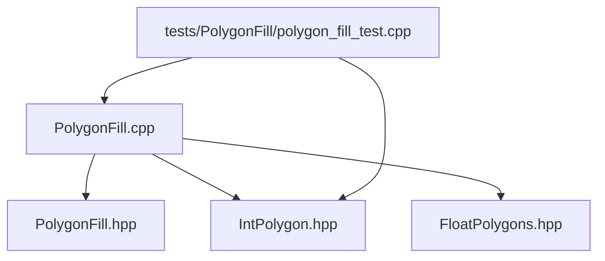
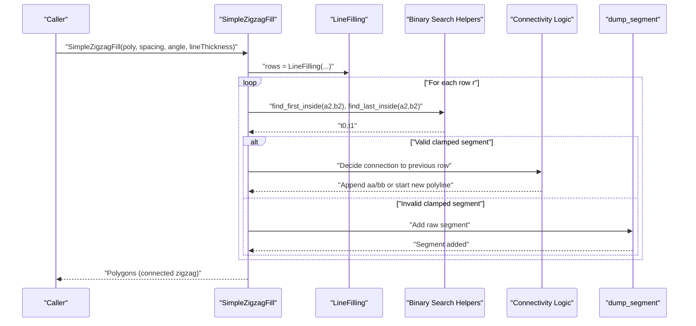
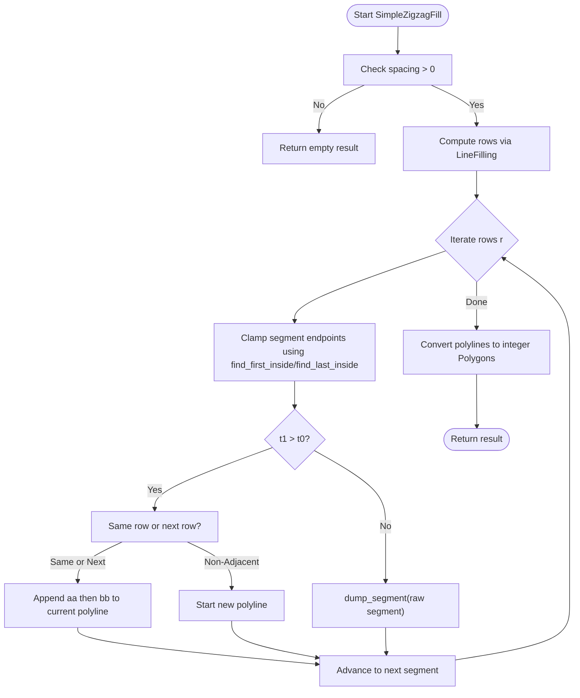
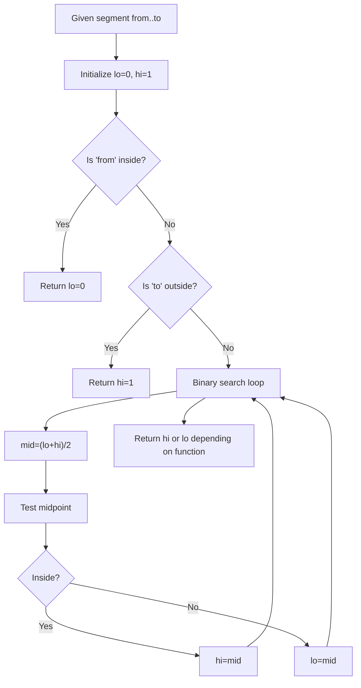
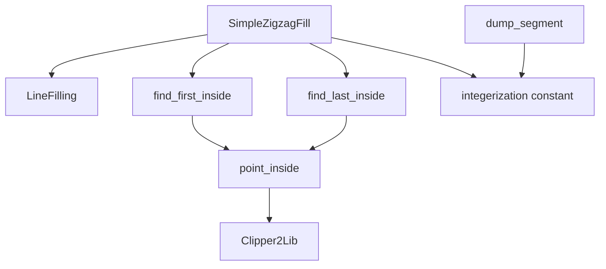

# Simple Zigzag Fill Algorithm

<cite>
**Referenced Files in This Document**
- [PolygonFill.cpp](file://2D/PolygonFill.cpp)
- [PolygonFill.hpp](file://2D/PolygonFill.hpp)
- [IntPolygon.hpp](file://2D/IntPolygon.hpp)
- [FloatPolygons.hpp](file://2D/FloatPolygons.hpp)
- [polygon_fill_test.cpp](file://tests/PolygonFill/polygon_fill_test.cpp)
</cite>

## Table of Contents
1. [Introduction](#introduction)
2. [Project Structure](#project-structure)
3. [Core Components](#core-components)
4. [Architecture Overview](#architecture-overview)
5. [Detailed Component Analysis](#detailed-component-analysis)
6. [Dependency Analysis](#dependency-analysis)
7. [Performance Considerations](#performance-considerations)
8. [Troubleshooting Guide](#troubleshooting-guide)
9. [Conclusion](#conclusion)

## Introduction
This document explains the Simple Zigzag Fill algorithm implemented in PolygonFill.cpp. It focuses on how the algorithm constructs connected zigzag toolpaths by linking the centers of adjacent scan-line segments, alternating direction between even and odd rows to minimize travel distance, and how it uses binary search to clamp segment endpoints within the polygon boundary. It also documents the dump_segment utility for integerization, connectivity logic, handling of non-adjacent row transitions, and guidance for selecting spacing and angle to optimize print speed. Edge cases such as disconnected segments, narrow features, and numerical precision in endpoint clamping are addressed.

## Project Structure
The Simple Zigzag Fill algorithm resides in the 2D module and is part of the polygon filling suite. The relevant files are:
- PolygonFill.cpp: Implementation of SimpleZigzagFill and related helpers
- PolygonFill.hpp: Public API declarations for fill algorithms
- IntPolygon.hpp: Integerization constants and polygon types
- FloatPolygons.hpp: Floating-point polygon types and conversions
- Tests: Validation that produced paths remain inside the polygon

**Diagram sources**
- [PolygonFill.cpp](file://2D/PolygonFill.cpp#L1-L120)
- [PolygonFill.hpp](file://2D/PolygonFill.hpp#L1-L46)
- [IntPolygon.hpp](file://2D/IntPolygon.hpp#L1-L20)
- [FloatPolygons.hpp](file://2D/FloatPolygons.hpp#L1-L20)
- [polygon_fill_test.cpp](file://tests/PolygonFill/polygon_fill_test.cpp#L1-L60)

**Section sources**
- [PolygonFill.cpp](file://2D/PolygonFill.cpp#L1-L120)
- [PolygonFill.hpp](file://2D/PolygonFill.hpp#L1-L46)

## Core Components
- SimpleZigzagFill: Main function that generates a connected zigzag path from scan-line segments.
- LineFilling: Internal helper that computes oriented scan lines and segments aligned with the fill angle.
- Binary search helpers: find_first_inside and find_last_inside locate the first and last parameter values where a segment remains inside the polygon.
- dump_segment: Utility to round and integerize segment endpoints and add them to the result.
- Connectivity logic: Ensures connections occur only between the same row or adjacent rows; alternates direction per row to reduce travel.

Key public API:
- SimpleZigzagFill(const Polygons&, double spacing, double angle_deg, double lineThickness) -> Polygons

**Section sources**
- [PolygonFill.hpp](file://2D/PolygonFill.hpp#L16-L23)
- [PolygonFill.cpp](file://2D/PolygonFill.cpp#L441-L609)

## Architecture Overview
The algorithm proceeds in stages:
1. Compute scan-line segments aligned with the given angle and spacing.
2. For each row, clamp segment endpoints to the polygon boundary using binary search.
3. Connect segments across rows only when rows are equal or adjacent, alternating direction per row.
4. Convert the resulting polylines to integer coordinates.

**Diagram sources**
- [PolygonFill.cpp](file://2D/PolygonFill.cpp#L441-L609)
- [PolygonFill.cpp](file://2D/PolygonFill.cpp#L459-L493)
- [PolygonFill.cpp](file://2D/PolygonFill.cpp#L494-L609)

## Detailed Component Analysis

### SimpleZigzagFill Algorithm
- Input validation: Returns empty result if spacing is non-positive.
- Scan-line generation: Delegates to LineFilling to produce rows of oriented segments aligned with the fill angle and spacing.
- Endpoint clamping: Uses find_first_inside and find_last_inside to compute t0 and t1 along the segment, ensuring endpoints lie inside the polygon.
- Connectivity: Builds polylines by appending clamped endpoints; connects only when the current row equals or immediately follows the previous row. Direction alternates per row to minimize travel.
- Integerization: Converts final polylines to integer coordinates using dump_segment and explicit rounding.

**Diagram sources**
- [PolygonFill.cpp](file://2D/PolygonFill.cpp#L441-L609)
- [PolygonFill.cpp](file://2D/PolygonFill.cpp#L459-L493)
- [PolygonFill.cpp](file://2D/PolygonFill.cpp#L494-L609)

**Section sources**
- [PolygonFill.cpp](file://2D/PolygonFill.cpp#L441-L609)

### Binary Search for Endpoint Clamping
- find_first_inside: Binary search to find the smallest parameter t where the segment remains inside the polygon, starting from the “from” endpoint.
- find_last_inside: Binary search to find the largest parameter t where the segment remains inside the polygon, starting from the “to” endpoint.
- Precision: Iterative binary search with a fixed number of iterations ensures robustness against floating-point noise while maintaining reasonable performance.

**Diagram sources**
- [PolygonFill.cpp](file://2D/PolygonFill.cpp#L459-L493)

**Section sources**
- [PolygonFill.cpp](file://2D/PolygonFill.cpp#L459-L493)

### Connectivity Logic and Alternating Row Directions
- Even rows: Segments are processed in forward order.
- Odd rows: Segments are processed in reverse order to alternate direction and reduce travel.
- Connections: Only allowed between the same row or the next row. Non-adjacent row transitions start a new polyline.
- Duplicate avoidance: Adjacent points are checked for near-equality before appending to avoid redundant points.

Concrete example references:
- Even-row connectivity and direction: [PolygonFill.cpp](file://2D/PolygonFill.cpp#L494-L551)
- Odd-row connectivity and direction: [PolygonFill.cpp](file://2D/PolygonFill.cpp#L552-L609)

**Section sources**
- [PolygonFill.cpp](file://2D/PolygonFill.cpp#L494-L609)

### Handling Non-Adjacent Row Transitions
- When moving from row r to row r+2 or beyond, the algorithm starts a new polyline rather than attempting to connect across gaps.
- This prevents unnecessary travel and maintains path continuity within reasonable row adjacency.

Reference:
- [PolygonFill.cpp](file://2D/PolygonFill.cpp#L533-L549)

**Section sources**
- [PolygonFill.cpp](file://2D/PolygonFill.cpp#L533-L549)

### dump_segment Utility for Integerization
- Rounds floating-point coordinates to integer grid using the global integerization scale and stores them as 64-bit integer points.
- Used to add raw segments when clamping fails or to finalize the output.

References:
- [PolygonFill.cpp](file://2D/PolygonFill.cpp#L485-L493)
- [IntPolygon.hpp](file://2D/IntPolygon.hpp#L10-L15)

**Section sources**
- [PolygonFill.cpp](file://2D/PolygonFill.cpp#L485-L493)
- [IntPolygon.hpp](file://2D/IntPolygon.hpp#L10-L15)

### Relationship to LineFilling and Orientation
- LineFilling computes rows of oriented segments aligned with the fill angle and spacing. SimpleZigzagFill relies on these rows to construct zigzag paths.
- The orientation vectors ux, uy define the scan-line direction; rows are sorted by projection along the u-axis.

References:
- [PolygonFill.cpp](file://2D/PolygonFill.cpp#L25-L113)
- [PolygonFill.cpp](file://2D/PolygonFill.cpp#L441-L451)

**Section sources**
- [PolygonFill.cpp](file://2D/PolygonFill.cpp#L25-L113)
- [PolygonFill.cpp](file://2D/PolygonFill.cpp#L441-L451)

### Validation That Output Remains Inside the Polygon
- Tests confirm that all generated paths’ vertices lie inside or on the boundary of the original polygon, ensuring valid toolpath geometry.

Reference:
- [polygon_fill_test.cpp](file://tests/PolygonFill/polygon_fill_test.cpp#L31-L56)

**Section sources**
- [polygon_fill_test.cpp](file://tests/PolygonFill/polygon_fill_test.cpp#L31-L56)

## Dependency Analysis
- SimpleZigzagFill depends on:
  - LineFilling for scan-line segmentation
  - Binary search helpers for endpoint clamping
  - Integerization constants and conversion utilities
  - Polygon membership checks via Clipper2Lib

**Diagram sources**
- [PolygonFill.cpp](file://2D/PolygonFill.cpp#L441-L609)
- [IntPolygon.hpp](file://2D/IntPolygon.hpp#L10-L15)
- [FloatPolygons.hpp](file://2D/FloatPolygons.hpp#L51-L56)

**Section sources**
- [PolygonFill.cpp](file://2D/PolygonFill.cpp#L441-L609)
- [IntPolygon.hpp](file://2D/IntPolygon.hpp#L10-L15)
- [FloatPolygons.hpp](file://2D/FloatPolygons.hpp#L51-L56)

## Performance Considerations
- Path continuity and travel reduction:
  - Alternating directions per row reduces travel between rows.
  - Connecting only same-row or next-row segments avoids long diagonal jumps.
- Binary search cost:
  - find_first_inside and find_last_inside perform iterative binary search with a fixed iteration count, balancing accuracy and speed.
- Integerization overhead:
  - dump_segment and final conversion to integer coordinates add minimal overhead compared to scan-line generation and clamping.
- Practical guidance:
  - Increase spacing to reduce total path length and travel, but ensure line thickness and resolution still meet quality requirements.
  - Choose angles aligned with polygon features to minimize gaps and improve connectivity.
  - For narrow regions, consider reducing spacing or adjusting angle to maintain continuous paths.

[No sources needed since this section provides general guidance]

## Troubleshooting Guide
Common issues and remedies:
- Disconnected segments:
  - Symptom: Short segments appear as separate paths.
  - Cause: Clamping failure (t1 <= t0) or non-adjacent row transitions.
  - Fix: Verify polygon orientation and integerization; adjust spacing/angle; ensure segments are long enough to clamp.
  - References:
    - [PolygonFill.cpp](file://2D/PolygonFill.cpp#L517-L524)
    - [PolygonFill.cpp](file://2D/PolygonFill.cpp#L569-L576)
- Narrow features:
  - Symptom: Very short segments or gaps.
  - Cause: Segment length below threshold or tight polygon geometry.
  - Fix: Reduce spacing or increase line thickness; consider angle alignment with feature orientation.
  - References:
    - [PolygonFill.cpp](file://2D/PolygonFill.cpp#L508-L510)
    - [PolygonFill.cpp](file://2D/PolygonFill.cpp#L561-L563)
- Numerical precision in endpoint clamping:
  - Symptom: Clamped endpoints near boundaries.
  - Cause: Floating-point noise during binary search.
  - Fix: Confirm point_inside uses integerized coordinates; verify tolerance and iteration counts.
  - References:
    - [PolygonFill.cpp](file://2D/PolygonFill.cpp#L453-L457)
    - [PolygonFill.cpp](file://2D/PolygonFill.cpp#L459-L493)
- Non-adjacent row transitions:
  - Symptom: Unexpected path breaks across rows.
  - Cause: Attempting to connect rows separated by more than one index.
  - Fix: Keep connectivity constrained to same or next row; start new polyline when crossing gaps.
  - References:
    - [PolygonFill.cpp](file://2D/PolygonFill.cpp#L533-L549)

**Section sources**
- [PolygonFill.cpp](file://2D/PolygonFill.cpp#L453-L493)
- [PolygonFill.cpp](file://2D/PolygonFill.cpp#L508-L576)
- [PolygonFill.cpp](file://2D/PolygonFill.cpp#L533-L549)

## Conclusion
SimpleZigzagFill produces connected zigzag toolpaths by aligning scan lines with the fill angle and spacing, clamping segment endpoints to the polygon boundary using binary search, and connecting segments only within adjacent rows while alternating directions per row. The algorithm emphasizes path continuity and travel reduction, with integerization and validation ensuring geometric correctness. For optimal print speed, tune spacing and angle to balance coverage and travel distance, and handle narrow features carefully.