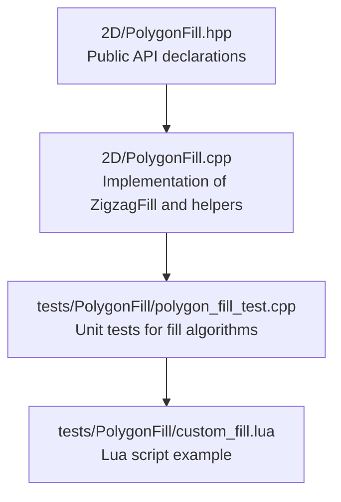
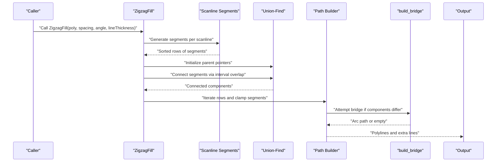
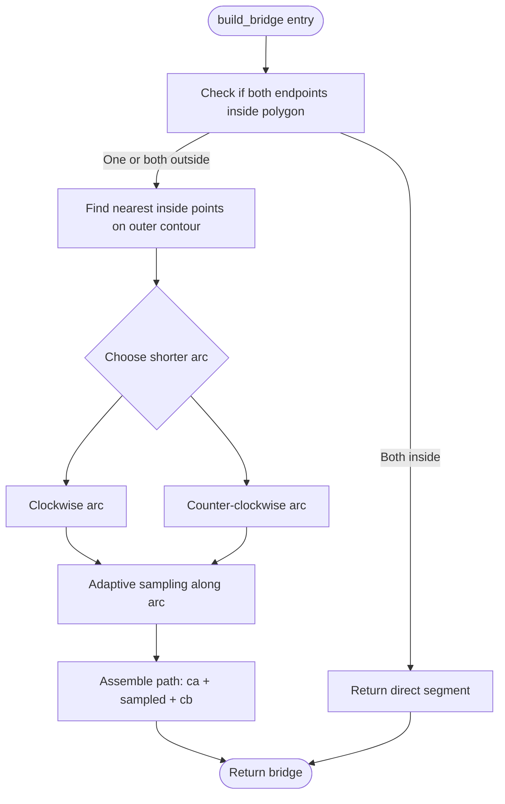
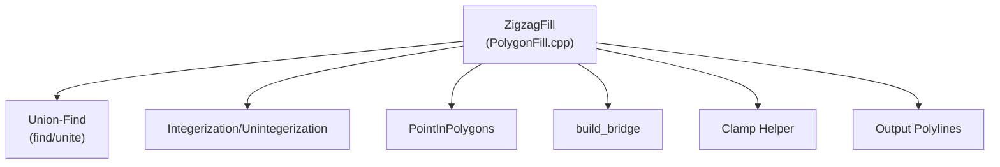

# Zigzag Fill Algorithm

<cite>
**Referenced Files in This Document**
- [PolygonFill.cpp](file://2D/PolygonFill.cpp)
- [PolygonFill.hpp](file://2D/PolygonFill.hpp)
- [polygon_fill_test.cpp](file://tests/PolygonFill/polygon_fill_test.cpp)
- [custom_fill.lua](file://tests/PolygonFill/custom_fill.lua)
</cite>

## Table of Contents
1. [Introduction](#introduction)
2. [Project Structure](#project-structure)
3. [Core Components](#core-components)
4. [Architecture Overview](#architecture-overview)
5. [Detailed Component Analysis](#detailed-component-analysis)
6. [Dependency Analysis](#dependency-analysis)
7. [Performance Considerations](#performance-considerations)
8. [Troubleshooting Guide](#troubleshooting-guide)
9. [Conclusion](#conclusion)
10. [Appendices](#appendices)

## Introduction
This document explains the ZigzagFill algorithm implemented in PolygonFill.cpp. It focuses on how ZigzagFill improves upon SimpleZigzagFill by using a union-find (disjoint set) data structure to identify connected components across scan lines and to build continuous paths through overlapping segments. It documents the interval overlap logic for connectivity determination, component labeling, and the build_bridge function that generates smooth transitions between disconnected segments using boundary arcs. The document also provides concrete examples from the code, discusses performance benefits in complex geometries with multiple islands, and offers guidance on tuning lineThickness for reliable connectivity. Edge cases such as failed bridge construction, isolated segments, and numerical robustness in path joining are addressed.

## Project Structure
The ZigzagFill implementation resides in the 2D module alongside related fill algorithms and polygon utilities. The primary interface is declared in the header and implemented in the source file. Tests exercise the algorithm and demonstrate expected behavior.

**Diagram sources**
- [PolygonFill.hpp](file://2D/PolygonFill.hpp#L1-L46)
- [PolygonFill.cpp](file://2D/PolygonFill.cpp#L611-L970)
- [polygon_fill_test.cpp](file://tests/PolygonFill/polygon_fill_test.cpp#L1-L117)
- [custom_fill.lua](file://tests/PolygonFill/custom_fill.lua#L1-L16)

**Section sources**
- [PolygonFill.hpp](file://2D/PolygonFill.hpp#L1-L46)
- [PolygonFill.cpp](file://2D/PolygonFill.cpp#L611-L970)
- [polygon_fill_test.cpp](file://tests/PolygonFill/polygon_fill_test.cpp#L1-L117)

## Core Components
- ZigzagFill: The main algorithm that builds connected zigzag paths across scan lines using union-find to detect connectivity via interval overlap, then connects segments with bridges or fallbacks.
- Union-Find (Disjoint Set): Used to group segments into connected components across adjacent scan lines based on interval overlap.
- Interval Overlap Logic: Determines whether two segments from adjacent scan lines overlap in the sweep direction (s-axis) to establish connectivity.
- Component Labeling: Assigns each segment to a component ID derived from the union-find structure.
- Bridge Construction (build_bridge): Generates a smooth transition path between two points by walking along the outer contour and applying adaptive sampling.
- Adaptive Sampling: Controls the density of sampled points along the boundary arc based on lineThickness and integerization scale.
- Fallback Mechanisms: When bridges fail, the algorithm falls back to connecting segments only if the midpoint lies inside the polygon, otherwise it emits extra straight-line segments.

**Section sources**
- [PolygonFill.cpp](file://2D/PolygonFill.cpp#L611-L970)

## Architecture Overview
The ZigzagFill pipeline consists of:
- Scanline segmentation: Extracts line segments per scan line and sorts them by position along the sweep direction.
- Connectivity detection: Uses union-find to merge segments whose projections overlap on the sweep axis across adjacent scan lines.
- Path building: Iterates scan lines, clamps segments to polygon interiors, and connects them either directly or via bridges.
- Output: Produces a collection of polylines representing continuous zigzag paths, plus any extra straight segments that could not be connected.

**Diagram sources**
- [PolygonFill.cpp](file://2D/PolygonFill.cpp#L611-L970)

## Detailed Component Analysis

### ZigzagFill Implementation
ZigzagFill performs the following steps:
- Segment extraction and sorting: For each scan line, segments are extracted and sorted by their projection along the sweep direction.
- Union-Find initialization: Parent pointers are initialized; a recursive find with path compression is used to locate roots efficiently.
- Connectivity via interval overlap: Adjacent scan lines are checked for overlaps in s-projection; if overlap exists, segments are united.
- Component labeling: Each segment is labeled with a component ID derived from its root in the union-find structure.
- Clamping and path building: Segments are clamped to the polygon interior, and paths are constructed by connecting segments within the same row or adjacent rows. When moving to the next row and components differ, a bridge is attempted; otherwise, a fallback connection is used. Isolated segments that cannot be connected emit extra straight segments.

Key implementation references:
- Segment extraction and sorting: [Segment extraction and sorting](file://2D/PolygonFill.cpp#L611-L630)
- Union-Find setup and unite/find: [Union-Find setup and operations](file://2D/PolygonFill.cpp#L647-L650)
- Interval overlap connectivity: [Interval overlap loop](file://2D/PolygonFill.cpp#L661-L675)
- Component labeling: [Component mapping](file://2D/PolygonFill.cpp#L677-L688)
- Clamping helper: [Clamp segment](file://2D/PolygonFill.cpp#L807-L820)
- Path building and fallbacks: [Path building loop](file://2D/PolygonFill.cpp#L822-L956)
- Extra lines emission: [Extra lines append](file://2D/PolygonFill.cpp#L966-L969)

**Section sources**
- [PolygonFill.cpp](file://2D/PolygonFill.cpp#L611-L970)

### Union-Find (Disjoint Set) Data Structure
The union-find structure groups segments into connected components across scan lines:
- Initialization: parent[i] = i for all segments.
- Find with path compression: Recursively compresses paths to root for efficiency.
- Union: Merges two sets by linking roots.

This enables efficient identification of which segments belong to the same connected component, allowing bridges to be built only between segments that are topologically connected across scan lines.

Concrete references:
- [Union-Find initialization and find/unite](file://2D/PolygonFill.cpp#L647-L650)

**Section sources**
- [PolygonFill.cpp](file://2D/PolygonFill.cpp#L647-L650)

### Interval Overlap Logic for Connectivity
Connectivity across adjacent scan lines is determined by overlap of segment projections along the sweep direction:
- For each pair of segments from consecutive rows, compute s_min and s_max.
- If max(s_min1, s_min2) ≤ min(s_max1, s_max2), the intervals overlap and the segments are united.

This ensures that only overlapping segments are considered part of the same connected component, preventing spurious connections.

Concrete references:
- [Overlap condition and union](file://2D/PolygonFill.cpp#L661-L675)

**Section sources**
- [PolygonFill.cpp](file://2D/PolygonFill.cpp#L661-L675)

### Component Labeling
After union-find completes, each segment is assigned a component ID:
- Root nodes are mapped to unique component indices.
- Each segment’s component ID is stored in compId.

This labeling allows the builder to decide whether to attempt a bridge (different components) or a direct connection (same component).

Concrete references:
- [Component mapping and labeling](file://2D/PolygonFill.cpp#L677-L688)

**Section sources**
- [PolygonFill.cpp](file://2D/PolygonFill.cpp#L677-L688)

### Bridge Construction (build_bridge)
The bridge function constructs a smooth transition between two points by walking along the outer contour:
- If both points are inside, return a straight segment.
- Otherwise, find the nearest points on the outer contour that are inside the polygon.
- Choose the shorter arc (clockwise vs counter-clockwise) around the outer contour.
- Apply adaptive sampling along the arc using a step size proportional to lineThickness and integerization scale.
- Assemble the path as ca + sampled_arc + cb.

Adaptive sampling ensures that bridges are smooth and dense enough to avoid gaps while remaining efficient.

Concrete references:
- [Bridge function definition and logic](file://2D/PolygonFill.cpp#L722-L781)
- [Adaptive sampling step calculation](file://2D/PolygonFill.cpp#L770-L776)

**Diagram sources**
- [PolygonFill.cpp](file://2D/PolygonFill.cpp#L722-L781)

**Section sources**
- [PolygonFill.cpp](file://2D/PolygonFill.cpp#L722-L781)

### Path Building and Fallbacks
During path construction:
- Segments are clamped to the polygon interior using a small epsilon offset along the segment direction.
- Within the same row or adjacent rows, segments are appended to the current polyline.
- When moving to the next row and components differ, a bridge is attempted. If successful, the bridge is appended; otherwise, a fallback checks if the midpoint between the last point and the new segment is inside the polygon. If so, the segment is appended; otherwise, a new polyline starts or an extra straight segment is emitted.

Concrete references:
- [Clamp helper](file://2D/PolygonFill.cpp#L807-L820)
- [Path building loop and fallbacks](file://2D/PolygonFill.cpp#L822-L956)
- [Extra lines emission](file://2D/PolygonFill.cpp#L966-L969)

**Section sources**
- [PolygonFill.cpp](file://2D/PolygonFill.cpp#L807-L969)

### Relationship to SimpleZigzagFill
SimpleZigzagFill connects segments across scan lines by only allowing connections between the same row or adjacent rows, without computing connected components. ZigzagFill extends this by:
- Computing connected components via union-find.
- Using interval overlap to define connectivity across rows.
- Attempting bridges between components to form continuous paths.

This enables ZigzagFill to handle complex geometries with multiple islands and disconnected segments more reliably.

Concrete references:
- [SimpleZigzagFill implementation](file://2D/PolygonFill.cpp#L441-L609)
- [ZigzagFill implementation](file://2D/PolygonFill.cpp#L611-L970)

**Section sources**
- [PolygonFill.cpp](file://2D/PolygonFill.cpp#L441-L609)
- [PolygonFill.cpp](file://2D/PolygonFill.cpp#L611-L970)

## Dependency Analysis
ZigzagFill depends on:
- Polygon clipping and offset operations (via external libraries) for polygon preprocessing and island handling.
- Integerization and unintegerization for coordinate conversions between integer and floating-point spaces.
- Point-in-polygon tests for robust containment checks during clamping and midpoint validation.
- Lua integration for custom fill scripts (not required for ZigzagFill core, but demonstrates usage patterns).

**Diagram sources**
- [PolygonFill.cpp](file://2D/PolygonFill.cpp#L611-L970)

**Section sources**
- [PolygonFill.cpp](file://2D/PolygonFill.cpp#L611-L970)

## Performance Considerations
- Complexity:
  - Segment extraction and sorting: O(R*S log S) where R is the number of scan lines and S is the average number of segments per line.
  - Union-Find operations: Nearly O(R*S α(N)) amortized, where α is the inverse Ackermann function and N is the total number of segments.
  - Interval overlap connectivity: O(R*S^2) in the worst case if all segments on adjacent rows overlap.
  - Bridge construction: O(ArcLength/Step) per bridge, with adaptive sampling controlling density.
- Practical benefits in complex geometries:
  - Union-find reduces redundant connections and avoids unnecessary fallbacks by identifying true topological connectivity.
  - Bridges enable continuous paths across disconnected components, reducing path breaks in multi-island regions.
- Tuning lineThickness:
  - Larger lineThickness increases the sampling step size along arcs, improving performance but potentially reducing smoothness.
  - Smaller lineThickness improves smoothness but increases computational cost due to denser sampling.
- Numerical robustness:
  - Epsilon offsets prevent degenerate cases near segment endpoints.
  - Binary search for inside points ensures robust intersection with polygon boundaries.
  - Integerization conversion ensures consistent coordinate handling.

[No sources needed since this section provides general guidance]

## Troubleshooting Guide
Common issues and remedies:
- Failed bridge construction:
  - Cause: No inside points found on the outer contour for one or both endpoints.
  - Remedy: Verify polygon orientation and ensure the outer contour is consistently oriented. Adjust lineThickness to improve sampling density. Consider simplifying geometry near sharp edges.
  - Reference: [Bridge failure path](file://2D/PolygonFill.cpp#L742-L743)
- Isolated segments:
  - Cause: No connectivity to previous segments; midpoint test fails.
  - Remedy: Increase lineThickness to improve sampling density and connectivity. Review spacing and angle settings. Emitting extra straight segments is intentional fallback behavior.
  - Reference: [Fallback to extra lines](file://2D/PolygonFill.cpp#L872-L877)
- Numerical robustness:
  - Symptom: Degenerate segments or near-zero lengths.
  - Remedy: Use epsilon offsets during clamping. Validate segment lengths before processing. Ensure polygon coordinates are well-conditioned.
  - Reference: [Clamp helper and epsilon](file://2D/PolygonFill.cpp#L807-L820)
- Multi-island connectivity:
  - Symptom: Discontinuous paths across islands.
  - Remedy: Ensure union-find detects overlaps across scan lines. Verify interval overlap logic and component labeling. Consider adjusting spacing and angle to increase overlap probability.
  - Reference: [Overlap and labeling](file://2D/PolygonFill.cpp#L661-L688)

**Section sources**
- [PolygonFill.cpp](file://2D/PolygonFill.cpp#L722-L781)
- [PolygonFill.cpp](file://2D/PolygonFill.cpp#L807-L877)
- [PolygonFill.cpp](file://2D/PolygonFill.cpp#L872-L877)
- [PolygonFill.cpp](file://2D/PolygonFill.cpp#L807-L820)
- [PolygonFill.cpp](file://2D/PolygonFill.cpp#L661-L688)

## Conclusion
ZigzagFill enhances connectivity over SimpleZigzagFill by leveraging union-find to identify connected components across scan lines using interval overlap. Bridges constructed along the outer contour provide smooth transitions between disconnected segments, while fallback mechanisms ensure robust path completion. Proper tuning of lineThickness balances performance and smoothness, and careful attention to numerical robustness prevents failures in complex geometries with multiple islands.

[No sources needed since this section summarizes without analyzing specific files]

## Appendices

### API Usage Example References
- Unit tests demonstrate calling ZigzagFill and verifying that all output points lie inside the polygon:
  - [Test case for ZigzagFill](file://tests/PolygonFill/polygon_fill_test.cpp#L31-L56)
- Lua custom fill scripts show how to integrate custom fill generators:
  - [Lua script example](file://tests/PolygonFill/custom_fill.lua#L1-L16)

**Section sources**
- [polygon_fill_test.cpp](file://tests/PolygonFill/polygon_fill_test.cpp#L31-L56)
- [custom_fill.lua](file://tests/PolygonFill/custom_fill.lua#L1-L16)