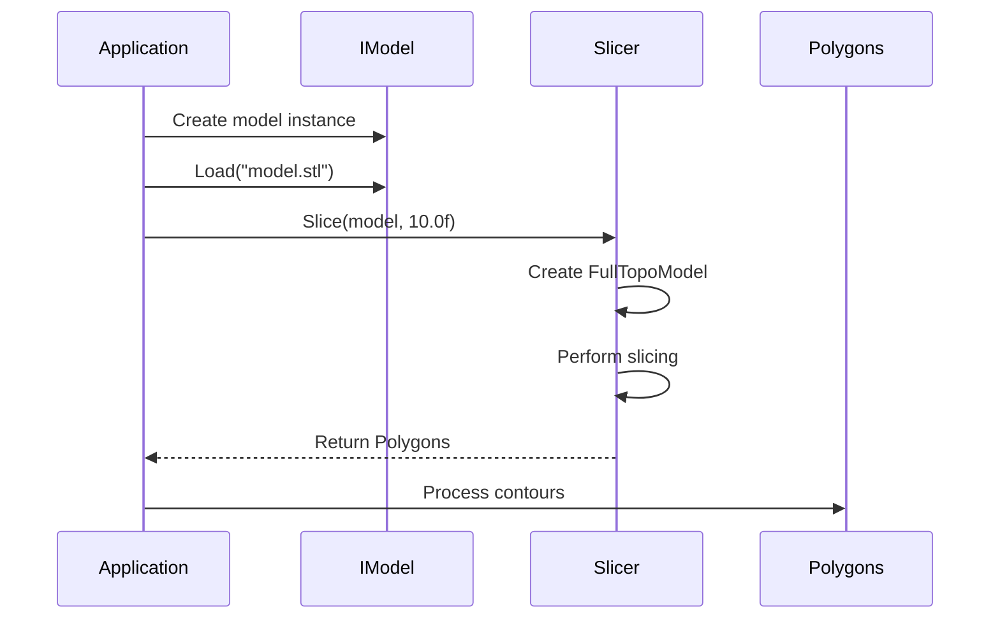
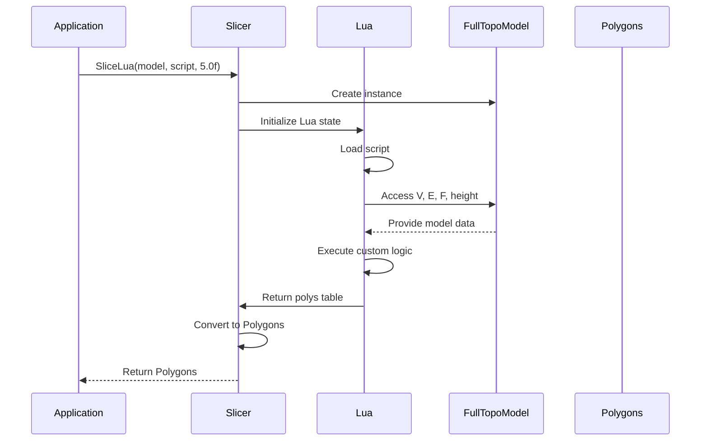
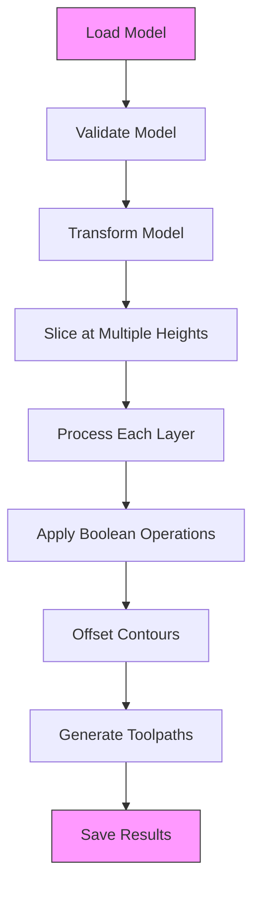

# API Reference

<cite>
**Referenced Files in This Document**   
- [mesh_slice.hpp](file://LibHsBaSlicer/Slice/mesh_slice.hpp)
- [IModel.hpp](file://base/IModel.hpp)
- [FloatPolygons.hpp](file://2D/FloatPolygons.hpp)
- [IntPolygon.hpp](file://2D/IntPolygon.hpp)
- [error.hpp](file://base/error.hpp)
- [FullTopoModel.hpp](file://meshmodel/FullTopoModel.hpp)
- [mesh_slice.cpp](file://LibHsBaSlicer/Slice/mesh_slice.cpp)
- [FloatPolygons.cpp](file://2D/FloatPolygons.cpp)
- [FullTopoModel.cpp](file://meshmodel/FullTopoModel.cpp)
</cite>

## Table of Contents
1. [Introduction](#introduction)
2. [Slicing Functions](#slicing-functions)
3. [IModel Interface](#imodel-interface)
4. [Polygon Data Structures](#polygon-data-structures)
5. [Error Handling](#error-handling)
6. [API Usage Patterns](#api-usage-patterns)
7. [Resource Management](#resource-management)

## Introduction
The HsBaSlicer public API provides a comprehensive set of functions for 3D model processing, with a focus on slicing operations for additive manufacturing. The API is designed to be thread-safe and provides both safe and unsafe slicing operations depending on the requirements of the manufacturing process. This documentation covers the exported functions in mesh_slice.hpp, the IModel interface, polygon data structures, error handling mechanisms, and usage patterns for common workflows.

## Slicing Functions

The slicing functions in the HsBaSlicer API provide both safe and unsafe slicing operations for 3D models. These functions operate on the IModel interface and return polygonal representations of the model at a specified height.

### Slice Function
The `Slice` function performs a safe slicing operation that only returns closed, valid contours. This is the recommended function for most applications where geometric integrity is critical.

**Function Signature**
```cpp
Polygons Slice(const IModel& model, const float height);
```

**Parameters**
- `model`: A const reference to an IModel object representing the 3D model to be sliced
- `height`: The Z-axis height at which to perform the slicing operation

**Return Value**
- Returns a `Polygons` object containing only closed, valid contours

**Thread Safety**
- The function is thread-safe as it operates on a const reference to the model and creates a new FullTopoModel instance for each call

**Section sources**
- [mesh_slice.hpp](file://LibHsBaSlicer/Slice/mesh_slice.hpp#L12)
- [mesh_slice.cpp](file://LibHsBaSlicer/Slice/mesh_slice.cpp#L5-L9)

### UnSafeSlice Function
The `UnSafeSlice` function performs an unsafe slicing operation that includes both closed and open contours. This function is intended for specialized manufacturing processes like wire feeding where open contours may be acceptable.

**Function Signature**
```cpp
UnSafePolygons UnSafeSlice(const IModel& model, const float height);
```

**Parameters**
- `model`: A const reference to an IModel object representing the 3D model to be sliced
- `height`: The Z-axis height at which to perform the slicing operation

**Return Value**
- Returns an `UnSafePolygons` object that may contain both closed and open contours

**Usage Considerations**
- Not recommended for SLA or other area-based manufacturing processes
- Suitable for wire feeding and similar processes where open contours are acceptable

**Section sources**
- [mesh_slice.hpp](file://LibHsBaSlicer/Slice/mesh_slice.hpp#L15)
- [mesh_slice.cpp](file://LibHsBaSlicer/Slice/mesh_slice.cpp#L10-L14)

### SliceLua Function
The `SliceLua` function allows custom slicing logic to be implemented in Lua scripts, providing flexibility for specialized slicing algorithms.

**Function Signature**
```cpp
Polygons SliceLua(const IModel& model, const std::string& script, const float height);
```

**Parameters**
- `model`: A const reference to an IModel object representing the 3D model to be sliced
- `script`: A string containing the Lua script to be executed
- `height`: The Z-axis height at which to perform the slicing operation

**Lua Environment**
- The script has access to global variables: V (vertices), E (edges), F (faces), and height
- V is a 1-based array of vertex objects with x, y, z properties
- E is a 1-based array of edge objects with vertex indices
- F is a 1-based array of face objects with vertex indices
- The script must return a table of polygons in the format: polys = { { {x=..,y=..}, ... }, ... }

**Return Value**
- Returns a `Polygons` object containing the contours generated by the Lua script

**Section sources**
- [mesh_slice.hpp](file://LibHsBaSlicer/Slice/mesh_slice.hpp#L17)
- [mesh_slice.cpp](file://LibHsBaSlicer/Slice/mesh_slice.cpp#L16-L20)
- [FullTopoModel.cpp](file://meshmodel/FullTopoModel.cpp#L434-L534)

### UnSafeSliceLua Function
The `UnSafeSliceLua` function is similar to `SliceLua` but returns potentially open polylines with a closed flag.

**Function Signature**
```cpp
UnSafePolygons UnSafeSliceLua(const IModel& model, const std::string& script, const float height);
```

**Parameters**
- `model`: A const reference to an IModel object representing the 3D model to be sliced
- `script`: A string containing the Lua script to be executed
- `height`: The Z-axis height at which to perform the slicing operation

**Return Value**
- Returns an `UnSafePolygons` object that may contain both closed and open contours with a closed flag indicating the status of each contour

**Section sources**
- [mesh_slice.hpp](file://LibHsBaSlicer/Slice/mesh_slice.hpp#L18)
- [mesh_slice.cpp](file://LibHsBaSlicer/Slice/mesh_slice.cpp#L22-L26)
- [FullTopoModel.cpp](file://meshmodel/FullTopoModel.cpp#L537-L849)

## IModel Interface

The IModel interface defines the contract for 3D model objects in the HsBaSlicer system. All model types must implement this interface to be compatible with the slicing functions.

### Load Method
The `Load` method loads a model from a file.

**Function Signature**
```cpp
virtual bool Load(std::string_view fileName) = 0;
```

**Parameters**
- `fileName`: The path to the file to be loaded

**Return Value**
- Returns `true` if the model was successfully loaded, `false` otherwise

**Section sources**
- [IModel.hpp](file://base/IModel.hpp#L19)

### Save Method
The `Save` method saves a model to a file in the specified format.

**Function Signature**
```cpp
virtual bool Save(std::string_view fileName, const ModelFormat format) const = 0;
```

**Parameters**
- `fileName`: The path where the file should be saved
- `format`: The ModelFormat enum value specifying the desired output format

**Return Value**
- Returns `true` if the model was successfully saved, `false` otherwise

**Section sources**
- [IModel.hpp](file://base/IModel.hpp#L20)
- [ModelFormat.hpp](file://base/ModelFormat.hpp#L10)

### Transformation Methods
The IModel interface provides several methods for transforming the model in 3D space.

#### Translate Method
Translates the model by the specified vector.

**Function Signature**
```cpp
virtual void Translate(const Eigen::Vector3f& translation) = 0;
```

**Section sources**
- [IModel.hpp](file://base/IModel.hpp#L22)

#### Rotate Method
Rotates the model by the specified quaternion.

**Function Signature**
```cpp
virtual void Rotate(const Eigen::Quaternionf& rotation) = 0;
```

**Section sources**
- [IModel.hpp](file://base/IModel.hpp#L23)

#### Scale Methods
Scales the model by the specified factor or vector.

**Function Signatures**
```cpp
virtual void Scale(const float scale) = 0;
virtual void Scale(const Eigen::Vector3f& scale) = 0;
```

**Section sources**
- [IModel.hpp](file://base/IModel.hpp#L24-L25)

#### Transform Methods
Applies a complete transformation to the model using various matrix representations.

**Function Signatures**
```cpp
virtual void Transform(const Eigen::Isometry3f& transform) = 0;
virtual void Transform(const Eigen::Matrix4f& transform) = 0;
virtual void Transform(const Eigen::Transform<float, 3, Eigen::Affine>& transform) = 0;
```

**Section sources**
- [IModel.hpp](file://base/IModel.hpp#L26-L28)

### Bounding Box and Volume Methods
These methods provide geometric information about the model.

#### BoundingBox Method
Retrieves the axis-aligned bounding box of the model.

**Function Signature**
```cpp
virtual void BoundingBox(Eigen::Vector3f& min, Eigen::Vector3f& max) const = 0;
```

**Parameters**
- `min`: Output parameter for the minimum coordinates of the bounding box
- `max`: Output parameter for the maximum coordinates of the bounding box

**Section sources**
- [IModel.hpp](file://base/IModel.hpp#L30)

#### Volume Method
Calculates the volume of the model.

**Function Signature**
```cpp
virtual float Volume() const = 0;
```

**Return Value**
- Returns the volume of the model in cubic units

**Section sources**
- [IModel.hpp](file://base/IModel.hpp#L31)

### TriangleMesh Method
Retrieves the triangle mesh representation of the model in IGL format.

**Function Signature**
```cpp
virtual std::pair<Eigen::MatrixXf, Eigen::MatrixXi> TriangleMesh() const = 0;
```

**Return Value**
- Returns a pair containing:
  - First: Vertex matrix (V) with dimensions Nx3
  - Second: Face index matrix (F) with dimensions Mx3

**Section sources**
- [IModel.hpp](file://base/IModel.hpp#L33)

## Polygon Data Structures

The HsBaSlicer API provides two main polygon data structures for representing 2D contours: Polygons and UnSafePolygons.

### Polygons Structure
The `Polygons` type is defined as a collection of integer-coordinate polygons using the Clipper2 library's Paths64 type.

**Definition**
```cpp
using Polygons = Clipper2Lib::Paths64;
```

**Characteristics**
- Uses 64-bit integer coordinates for high precision
- Coordinates are scaled by a factor of 1e6 (defined as `integerization` in IntPolygon.hpp)
- Only contains closed, valid contours
- Compatible with Clipper2 boolean operations and offsetting

**Section sources**
- [IntPolygon.hpp](file://2D/IntPolygon.hpp#L14)

### FloatPolygons Structure
The `FloatPolygons` type is defined as a collection of double-precision floating-point polygons.

**Definition**
```cpp
using PolygonsD = Clipper2Lib::PathsD;
```

**Characteristics**
- Uses double-precision floating-point coordinates
- Used internally for floating-point operations
- Can be converted to/from integer polygons using the Integerization/UnIntegerization functions

**Section sources**
- [FloatPolygons.hpp](file://2D/FloatPolygons.hpp#L15)

### UnSafePolygons Structure
The `UnSafePolygons` type is a vector of UnSafePolygon structures that can represent both closed and open contours.

**Definition**
```cpp
struct UnSafePolygon
{
    Polygon path;
    bool closed = true;
};
using UnSafePolygons = std::vector<UnSafePolygon>;
```

**Characteristics**
- Contains a `path` member of type Polygon (integer coordinates)
- Includes a `closed` boolean flag indicating whether the contour is closed
- Allows for open polylines in addition to closed contours
- Used in unsafe slicing operations where open contours may be acceptable

**Section sources**
- [FullTopoModel.hpp](file://meshmodel/FullTopoModel.hpp#L19-L25)

### Polygon Operations
The API provides a comprehensive set of operations for manipulating polygons.

#### Boolean Operations
The following boolean operations are available for both integer and floating-point polygons:

**Function Signatures**
```cpp
Polygons Union(const Polygons& left, const Polygons& right, Clipper2Lib::FillRule fill_rule = Clipper2Lib::FillRule::EvenOdd);
Polygons Intersection(const Polygons& left, const Polygons& right, Clipper2Lib::FillRule fill_rule = Clipper2Lib::FillRule::EvenOdd);
Polygons Difference(const Polygons& left, const Polygons& right, Clipper2Lib::FillRule fill_rule = Clipper2Lib::FillRule::EvenOdd);
Polygons Xor(const Polygons& left, const Polygons& right, Clipper2Lib::FillRule fill_rule = Clipper2Lib::FillRule::EvenOdd);
```

**Section sources**
- [IntPolygon.hpp](file://2D/IntPolygon.hpp#L34-L45)

#### Offset Operations
The API provides offsetting (inflation/deflation) operations for polygons.

**Function Signatures**
```cpp
Polygons Offset(const Polygon& p, double delta, Clipper2Lib::JoinType join_type = Clipper2Lib::JoinType::Square, Clipper2Lib::EndType end_type = Clipper2Lib::EndType::Polygon);
Polygons Offset(const Polygons& ps, double delta, Clipper2Lib::JoinType join_type = Clipper2Lib::JoinType::Square, Clipper2Lib::EndType end_type = Clipper2Lib::EndType::Polygon);
```

**Parameters**
- `delta`: The offset distance (positive for outward, negative for inward)
- `join_type`: How corners are joined (Square, Round, Miter)
- `end_type`: How open paths are treated (Polygon, Joined, Butt, Square, Round)

**Section sources**
- [IntPolygon.hpp](file://2D/IntPolygon.hpp#L47-L54)

#### Area Calculation
Functions to calculate the area of polygons.

**Function Signatures**
```cpp
double Area(const Polygon& p);
double Area(const Polygons& ps);
```

**Return Value**
- Returns the area in square units (with appropriate scaling based on the integerization factor)

**Section sources**
- [IntPolygon.hpp](file://2D/IntPolygon.hpp#L58-L59)
- [FloatPolygons.hpp](file://2D/FloatPolygons.hpp#L46-L47)

## Error Handling

The HsBaSlicer API uses a comprehensive exception hierarchy for error handling, defined in the error.hpp file.

### Exception Hierarchy
The API defines a hierarchy of exception classes that inherit from a base RuntimeError class.

```mermaid
classDiagram
class RuntimeError {
+what() const char*
}
class OutOfRangeError {
+what() const char*
}
class InvalidArgumentError {
+what() const char*
}
class IOError {
+what() const char*
}
class NotImplementedError {
+what() const char*
}
class NullValueError {
+what() const char*
}
class NotSupportedError {
+what() const char*
}
class NotFoundError {
+what() const char*
}
class AlreadyExistsError {
+what() const char*
}
class PermissionDeniedError {
+what() const char*
}
class TimeoutError {
+what() const char*
}
class InterruptedError {
+what() const char*
}
class CancelledError {
+what() const char*
}
class OutOfMemoryError {
+what() const char*
}
RuntimeError <|-- OutOfRangeError
RuntimeError <|-- InvalidArgumentError
RuntimeError <|-- IOError
RuntimeError <|-- NotImplementedError
RuntimeError <|-- NullValueError
RuntimeError <|-- NotSupportedError
RuntimeError <|-- NotFoundError
RuntimeError <|-- AlreadyExistsError
RuntimeError <|-- PermissionDeniedError
RuntimeError <|-- TimeoutError
RuntimeError <|-- InterruptedError
RuntimeError <|-- CancelledError
RuntimeError <|-- OutOfMemoryError
```



**Diagram sources**
- [error.hpp](file://base/error.hpp#L12-L136)

### Exception Types
The API defines the following specific exception types:

- **RuntimeError**: Base class for all runtime errors
- **OutOfRangeError**: Thrown when an index or value is out of valid range
- **InvalidArgumentError**: Thrown when a function receives an invalid argument
- **IOError**: Thrown when an input/output operation fails
- **NotImplementedError**: Thrown when a function is not implemented
- **NullValueError**: Thrown when a null value is encountered where it's not allowed
- **NotSupportedError**: Thrown when an operation is not supported
- **NotFoundError**: Thrown when a requested resource is not found
- **AlreadyExistsError**: Thrown when attempting to create a resource that already exists
- **PermissionDeniedError**: Thrown when access to a resource is denied
- **TimeoutError**: Thrown when an operation times out
- **InterruptedError**: Thrown when an operation is interrupted
- **CancelledError**: Thrown when an operation is cancelled
- **OutOfMemoryError**: Thrown when memory allocation fails

### Error Handling in Slicing Functions
The slicing functions may throw exceptions in the following circumstances:

- **RuntimeError**: If Lua initialization fails in SliceLua or UnSafeSliceLua functions
- **InvalidArgumentError**: If invalid parameters are passed to any function
- **IOError**: If there are issues with file operations (though the core slicing functions don't directly perform file I/O)

**Section sources**
- [error.hpp](file://base/error.hpp#L12-L136)
- [FullTopoModel.cpp](file://meshmodel/FullTopoModel.cpp#L438)
- [FullTopoModel.cpp](file://meshmodel/FullTopoModel.cpp#L542)

## API Usage Patterns

This section demonstrates common usage patterns for the HsBaSlicer API.

### Model Loading and Slicing Workflow
A typical workflow for loading a model and performing slicing operations.



**Diagram sources**
- [mesh_slice.hpp](file://LibHsBaSlicer/Slice/mesh_slice.hpp#L12)
- [IModel.hpp](file://base/IModel.hpp#L19)
- [FullTopoModel.hpp](file://meshmodel/FullTopoModel.hpp#L63)

### Custom Slicing with Lua
Using Lua scripts to implement custom slicing logic.



**Diagram sources**
- [mesh_slice.hpp](file://LibHsBaSlicer/Slice/mesh_slice.hpp#L17)
- [FullTopoModel.cpp](file://meshmodel/FullTopoModel.cpp#L434-L534)

### Complete Slicing Pipeline
A comprehensive workflow showing the complete process from model loading to path generation.



**Diagram sources**
- [IModel.hpp](file://base/IModel.hpp#L19)
- [mesh_slice.hpp](file://LibHsBaSlicer/Slice/mesh_slice.hpp#L12)
- [IntPolygon.hpp](file://2D/IntPolygon.hpp#L34)

## Resource Management

Proper resource management is critical when using the HsBaSlicer API.

### Object Lifetimes
- IModel objects should be kept alive for the duration of slicing operations
- The slicing functions take const references to IModel, so the caller is responsible for managing the model's lifetime
- Temporary FullTopoModel instances are created and destroyed within each slicing function call

### Thread Safety
All exported slicing functions are thread-safe as they:
- Operate on const references to models
- Create independent FullTopoModel instances for each call
- Do not share mutable state between calls

### Memory Management
- Polygon data structures use standard containers (std::vector) with automatic memory management
- The API does not require explicit memory deallocation by the caller
- Large models may consume significant memory, so applications should be aware of memory usage patterns

**Section sources**
- [mesh_slice.cpp](file://LibHsBaSlicer/Slice/mesh_slice.cpp#L5-L26)
- [FullTopoModel.hpp](file://meshmodel/FullTopoModel.hpp#L63)