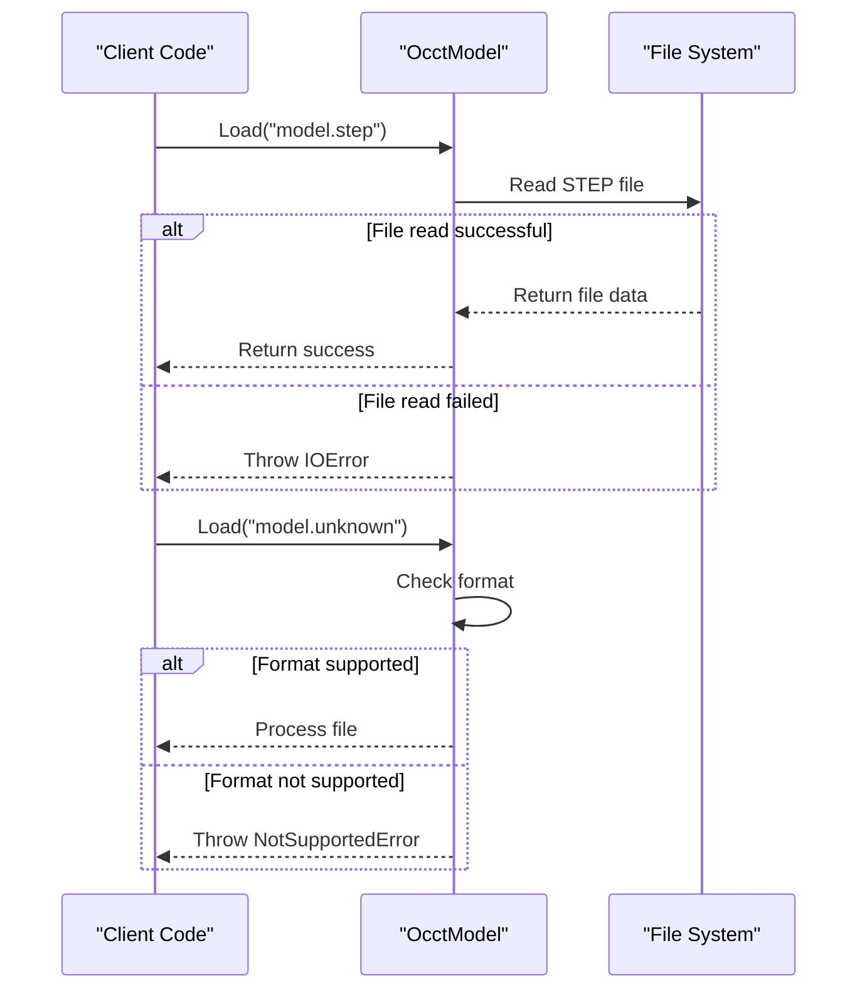
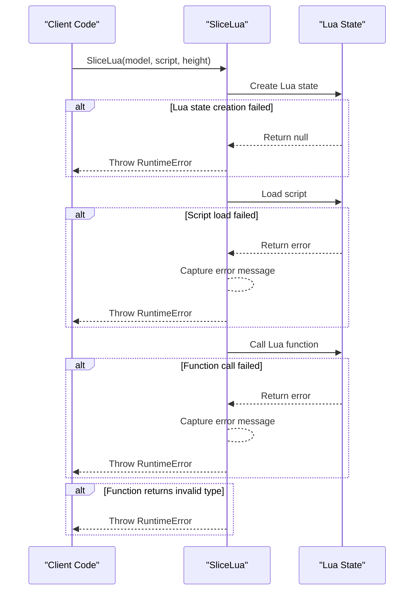

# Error Handling and Exceptions

<cite>
**Referenced Files in This Document**   
- [error.hpp](file://base/error.hpp)
- [error.cpp](file://base/error.cpp)
- [mesh_slice.hpp](file://LibHsBaSlicer/Slice/mesh_slice.hpp)
- [mesh_slice.cpp](file://LibHsBaSlicer/Slice/mesh_slice.cpp)
- [OcctModel.cpp](file://cadmodel/OcctModel.cpp)
- [CgalModel.cpp](file://meshmodel/CgalModel.cpp)
- [ImageToPolygons.cpp](file://2D/ImageToPolygons.cpp)
- [PolygonFill.cpp](file://2D/PolygonFill.cpp)
- [encoder.cpp](file://cipher/encoder.cpp)
- [unzipper.cpp](file://fileoperator/unzipper.cpp)
- [logger.hpp](file://logger/logger.hpp)
- [logger.cpp](file://logger/logger.cpp)
</cite>

## Table of Contents
1. [Exception Hierarchy](#exception-hierarchy)
2. [Core Exception Types](#core-exception-types)
3. [Error Throwing Locations](#error-throwing-locations)
4. [Lua Scripting Error Translation](#lua-scripting-error-translation)
5. [Try-Catch Patterns for Robust Error Handling](#try-catch-patterns-for-robust-error-handling)
6. [Exception Safety Guarantees](#exception-safety-guarantees)
7. [Error Logging with Logger Module](#error-logging-with-logger-module)
8. [Best Practices for Error Handling](#best-practices-for-error-handling)

## Exception Hierarchy

The HsBaSlicer error handling system is built around a comprehensive exception hierarchy that inherits from the base `RuntimeError` class. This hierarchy provides semantic categorization of different error conditions that can occur during slicing operations, model processing, file operations, and scripting execution.

```mermaid
classDiagram
class RuntimeError {
+what() const char*
}
class OutOfRangeError {
+what() const char*
}
class InvalidArgumentError {
+what() const char*
}
class IOError {
+what() const char*
}
class NotImplementedError {
+what() const char*
}
class NotSupportedError {
+what() const char*
}
class NotFoundError {
+what() const char*
}
class AlreadyExistsError {
+what() const char*
}
class PermissionDeniedError {
+what() const char*
}
class TimeoutError {
+what() const char*
}
class InterruptedError {
+what() const char*
}
class CancelledError {
+what() const char*
}
class OutOfMemoryError {
+what() const char*
}
RuntimeError <|-- OutOfRangeError
RuntimeError <|-- InvalidArgumentError
RuntimeError <|-- IOError
RuntimeError <|-- NotImplementedError
RuntimeError <|-- NotSupportedError
RuntimeError <|-- NotFoundError
RuntimeError <|-- AlreadyExistsError
RuntimeError <|-- PermissionDeniedError
RuntimeError <|-- TimeoutError
RuntimeError <|-- InterruptedError
RuntimeError <|-- CancelledError
RuntimeError <|-- OutOfMemoryError
```



**Diagram sources**
- [error.hpp](file://base/error.hpp#L12-L136)

**Section sources**
- [error.hpp](file://base/error.hpp#L1-L139)

## Core Exception Types

The HsBaSlicer error handling system defines several specialized exception types that inherit from the base `RuntimeError` class. Each exception type represents a specific category of error condition with distinct semantic meaning.

### RuntimeError
The base exception class for all runtime errors in HsBaSlicer. This class inherits from `std::runtime_error` and serves as the root of the exception hierarchy. All other exception types in the system derive from this class, providing a consistent interface for error handling across the codebase.

### InvalidArgumentError
Thrown when a function receives an invalid argument that cannot be processed. This exception is used to indicate parameter validation failures in API functions. For example, the `hex_decode` function in the cipher module throws this exception when encountering invalid hexadecimal characters.

### IOError
Raised when file operations fail, including reading, writing, or accessing files and archives. This exception is commonly thrown in file handling components such as the unzipper and model loading functions when operations on files cannot be completed successfully.

### OutOfRangeError
Indicates that a value is outside the valid range for an operation. This exception is used when array indices, numerical values, or other parameters exceed their expected bounds.

### NotImplementedError
Thrown when a requested functionality has not been implemented. This exception serves as a placeholder for features that are planned but not yet available in the current version of the software.

### NotSupportedError
Indicates that a requested operation or format is not supported by the current implementation. This exception is commonly used in file format handling to indicate that a particular file type cannot be processed.

**Section sources**
- [error.hpp](file://base/error.hpp#L12-L73)

## Error Throwing Locations

The HsBaSlicer codebase contains numerous locations where exceptions are thrown to handle error conditions. These locations span various components of the system, including model loading, file operations, and parameter validation.

### Model Loading and File Operations
The `OcctModel` class throws several exceptions during model loading operations. When attempting to read STEP or IGES files, an `IOError` is thrown if the file cannot be read successfully. Similarly, when saving models, an `IOError` is thrown if the write operation fails. The `Load` method throws a `NotSupportedError` when attempting to load a model format that is not supported by the OCCT backend.



**Diagram sources**
- [OcctModel.cpp](file://cadmodel/OcctModel.cpp#L65-L180)

### Parameter Validation in Mesh Slicing
The mesh slicing functions in the `mesh_slice.hpp` header perform parameter validation and throw exceptions when invalid parameters are provided. The `Slice` and `UnSafeSlice` functions validate the input model and height parameters, throwing appropriate exceptions when validation fails.

### File Operations in Archive Handling
The `Unzipper` class in the file operator module throws `IOError` exceptions when archive operations fail. This includes failures to open zip files, locate files within archives, or extract file contents. The exception messages provide detailed information about the specific failure condition.

**Section sources**
- [OcctModel.cpp](file://cadmodel/OcctModel.cpp#L65-L180)
- [CgalModel.cpp](file://meshmodel/CgalModel.cpp#L31-L67)
- [unzipper.cpp](file://fileoperator/unzipper.cpp#L37-L72)

## Lua Scripting Error Translation

HsBaSlicer integrates Lua scripting capabilities for custom processing operations, and the system includes robust error translation between Lua runtime errors and C++ exceptions. When Lua scripts are executed through the `SliceLua` and `UnSafeSliceLua` functions, any Lua runtime errors are translated into appropriate C++ exceptions.

The error translation mechanism captures Lua error messages and wraps them in `RuntimeError` exceptions with descriptive messages. This allows client code to handle Lua scripting errors using the same exception handling patterns as other errors in the system.



**Diagram sources**
- [ImageToPolygons.cpp](file://2D/ImageToPolygons.cpp#L219-L245)
- [PolygonFill.cpp](file://2D/PolygonFill.cpp#L1091-L1124)

**Section sources**
- [ImageToPolygons.cpp](file://2D/ImageToPolygons.cpp#L219-L245)
- [PolygonFill.cpp](file://2D/PolygonFill.cpp#L1091-L1124)

## Try-Catch Patterns for Robust Error Handling

Client code should implement robust error handling patterns to gracefully handle exceptions thrown by the HsBaSlicer API. The recommended approach is to catch specific exception types first, followed by more general exception types.

### Basic Try-Catch Pattern
```cpp
try {
    // Call HsBaSlicer API functions
    auto result = Slice(model, height);
    // Process result
} catch (const InvalidArgumentError& e) {
    // Handle invalid argument errors
    std::cerr << "Invalid argument: " << e.what() << std::endl;
} catch (const IOError& e) {
    // Handle file I/O errors
    std::cerr << "File operation failed: " << e.what() << std::endl;
} catch (const NotSupportedError& e) {
    // Handle unsupported operations
    std::cerr << "Operation not supported: " << e.what() << std::endl;
} catch (const RuntimeError& e) {
    // Handle general runtime errors
    std::cerr << "Runtime error: " << e.what() << std::endl;
}
```

### Comprehensive Error Handling
For production code, a more comprehensive error handling strategy should be implemented that includes logging and recovery mechanisms:

```cpp
try {
    // Perform slicing operation
    auto polygons = Slice(model, sliceHeight);
    // Process the resulting polygons
    ProcessPolygons(polygons);
} catch (const InvalidArgumentError& e) {
    // Log the error and provide user feedback
    LoggerSingletone::LogError("Invalid parameter provided: " + std::string(e.what()));
    // Recover by using default parameters or asking user for correction
    HandleInvalidParameter();
} catch (const IOError& e) {
    // Log the file operation error
    LoggerSingletone::LogError("File operation failed: " + std::string(e.what()));
    // Attempt recovery by checking file permissions or availability
    HandleFileError();
} catch (const NotSupportedError& e) {
    // Log the unsupported operation
    LoggerSingletone::LogError("Unsupported operation: " + std::string(e.what()));
    // Provide alternative methods or inform user of limitations
    InformUserOfLimitations();
} catch (const RuntimeError& e) {
    // Log the general runtime error
    LoggerSingletone::LogError("Unexpected error: " + std::string(e.what()));
    // Perform graceful shutdown or fallback to safe state
    HandleUnexpectedError();
}
```

**Section sources**
- [ImageToPolygons.cpp](file://2D/ImageToPolygons.cpp#L219-L245)
- [PolygonFill.cpp](file://2D/PolygonFill.cpp#L1091-L1124)
- [encoder.cpp](file://cipher/encoder.cpp#L21-L22)

## Exception Safety Guarantees

The HsBaSlicer API functions provide strong exception safety guarantees to ensure that objects remain in a valid state even when exceptions are thrown. The system follows the basic exception safety guarantee, ensuring that no resources are leaked and class invariants are maintained.

### Resource Management
All resource allocations in the codebase use RAII (Resource Acquisition Is Initialization) principles to ensure proper cleanup. For example, the `Unzipper` class automatically closes the zip archive in its destructor, even if an exception is thrown during operations.

### Transactional Operations
Many operations in HsBaSlicer are designed to be transactional, meaning they either complete successfully or leave the system in its original state. For example, model transformation operations create temporary copies of data structures and only update the original upon successful completion.

### No-Throw Destructors
All destructors in the codebase are designed to be noexcept, preventing the possibility of exceptions being thrown during stack unwinding. This ensures that if an exception is thrown, it can be properly propagated to the appropriate handler without being masked by destructor exceptions.

**Section sources**
- [unzipper.cpp](file://fileoperator/unzipper.cpp#L10-L24)
- [OcctModel.cpp](file://cadmodel/OcctModel.cpp#L52-L63)

## Error Logging with Logger Module

The HsBaSlicer logging system provides comprehensive error logging capabilities that integrate with the exception handling system. The `LoggerSingletone` class allows for structured logging of error conditions with source location information.

### Logging Error Conditions
When handling exceptions, it is recommended to log the error using the logger module to provide detailed diagnostic information:

```cpp
try {
    // Perform operation that might fail
    auto result = Slice(model, height);
} catch (const RuntimeError& e) {
    // Log the error with source location
    LoggerSingletone::LogError(std::string("Slicing operation failed: ") + e.what());
    // Re-throw or handle as appropriate
    throw;
}
```

### Log Levels and Filtering
The logger supports multiple log levels (trace, debug, info, warning, error, fatal) that can be configured at runtime. This allows for fine-grained control over the verbosity of error logging in different environments.

### Configuration and Output
The logger can be configured to output to both console and file destinations. The log configuration is controlled by the `logcfg.ini` file, which specifies the log level, output format, and file rotation policies.

**Section sources**
- [logger.hpp](file://logger/logger.hpp#L17-L69)
- [logger.cpp](file://logger/logger.cpp#L74-L282)

## Best Practices for Error Handling

To ensure robust and maintainable code when using the HsBaSlicer API, follow these best practices for error handling:

### Catch Specific Exceptions First
Always catch more specific exception types before more general ones to ensure proper error handling:

```cpp
try {
    // API calls
} catch (const InvalidArgumentError& e) {
    // Handle invalid arguments
} catch (const IOError& e) {
    // Handle file I/O errors
} catch (const RuntimeError& e) {
    // Handle all other runtime errors
}
```

### Provide Meaningful Error Messages
When re-throwing or wrapping exceptions, include contextual information to help diagnose the problem:

```cpp
try {
    auto result = Slice(model, height);
} catch (const RuntimeError& e) {
    LoggerSingletone::LogError("Failed to slice model at height " + 
                              std::to_string(height) + ": " + e.what());
    throw; // Re-throw to allow higher-level handling
}
```

### Use Logging for Diagnostics
Always log error conditions to provide an audit trail for debugging and monitoring:

```cpp
try {
    // Operation
} catch (const RuntimeError& e) {
    LoggerSingletone::LogError("Operation failed: " + std::string(e.what()));
    // Implement recovery or fallback
}
```

### Implement Graceful Degradation
Design your application to handle errors gracefully by providing fallback mechanisms or alternative workflows when operations fail.

### Validate Inputs Proactively
Perform input validation before calling API functions to prevent avoidable exceptions:

```cpp
if (height <= 0) {
    throw InvalidArgumentError("Slice height must be positive");
}
if (!model.IsValid()) {
    throw InvalidArgumentError("Model is not valid for slicing");
}
```

By following these best practices, client code can effectively handle the rich exception hierarchy provided by HsBaSlicer while maintaining robustness and providing a good user experience.

**Section sources**
- [error.hpp](file://base/error.hpp#L12-L136)
- [logger.hpp](file://logger/logger.hpp#L17-L69)
- [logger.cpp](file://logger/logger.cpp#L74-L282)