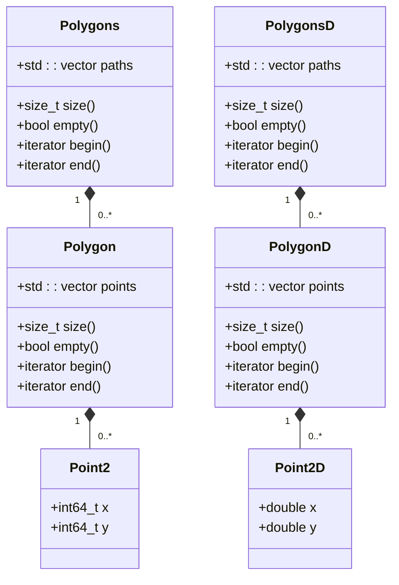
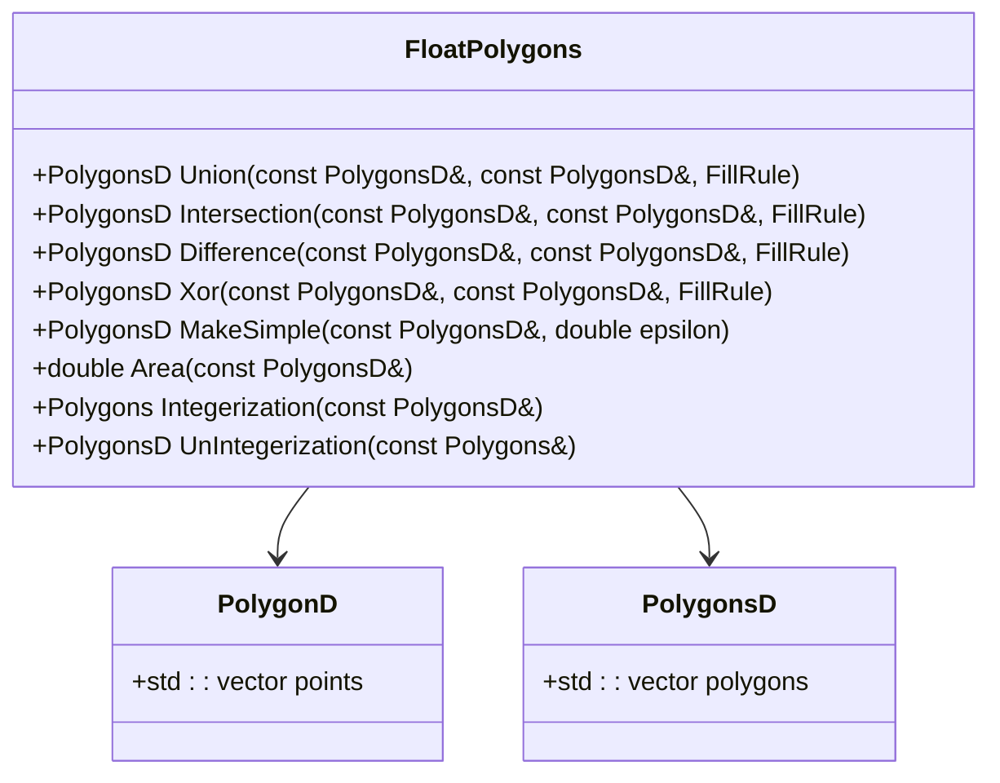
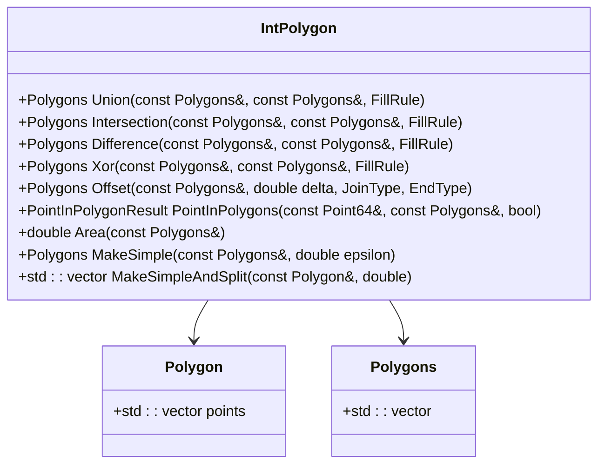
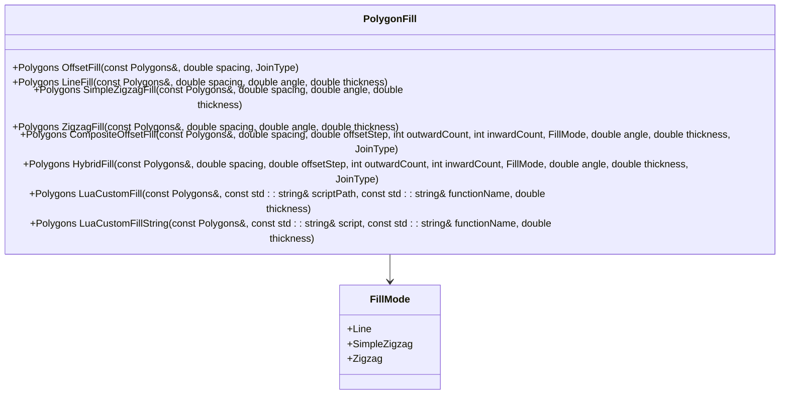

# Geometry Data Structures

<cite>
**Referenced Files in This Document**   
- [FloatPolygons.hpp](file://2D/FloatPolygons.hpp)
- [FloatPolygons.cpp](file://2D/FloatPolygons.cpp)
- [IntPolygon.hpp](file://2D/IntPolygon.hpp)
- [IntPolygon.cpp](file://2D/IntPolygon.cpp)
- [PolygonFill.hpp](file://2D/PolygonFill.hpp)
- [PolygonFill.cpp](file://2D/PolygonFill.cpp)
- [ImageToPolygons.hpp](file://2D/ImageToPolygons.hpp)
- [ImageToPolygons.cpp](file://2D/ImageToPolygons.cpp)
- [LuaAdapter.hpp](file://2D/LuaAdapter.hpp)
- [LuaAdapter.cpp](file://2D/LuaAdapter.cpp)
- [2Dhull.hpp](file://2D/2Dhull.hpp)
- [2Dhull.cpp](file://2D/2Dhull.cpp)
</cite>

## Table of Contents
1. [Introduction](#introduction)
2. [Core Data Structures](#core-data-structures)
3. [Coordinate System and Units](#coordinate-system-and-units)
4. [FloatPolygons: Floating-Point Geometry](#floatpolygons-floating-point-geometry)
5. [IntPolygon: Integer-Based Geometry](#intpolygon-integer-based-geometry)
6. [PolygonFill: Path Generation Algorithms](#polygonfill-path-generation-algorithms)
7. [Image Integration](#image-integration)
8. [Lua Integration](#lua-integration)
9. [Memory Layout and Performance](#memory-layout-and-performance)
10. [Downstream Path Generation](#downstream-path-generation)
11. [Serialization Behavior](#serialization-behavior)
12. [Usage Examples](#usage-examples)

## Introduction
This document provides comprehensive API documentation for the core 2D geometry data structures used in HsBaSlicer's slicing pipeline. The system is built around two primary representations of polygonal data: floating-point precision structures for high-accuracy operations and integer-based structures for efficient processing. These structures form the foundation of the slicing process, representing contours extracted from 3D models and serving as input for path generation algorithms. The design leverages the Clipper2 library for robust polygon operations while providing a domain-specific interface tailored to additive manufacturing requirements.

**Section sources**
- [FloatPolygons.hpp](file://2D/FloatPolygons.hpp#L1-L72)
- [IntPolygon.hpp](file://2D/IntPolygon.hpp#L1-L75)

## Core Data Structures
The geometry system in HsBaSlicer centers around two complementary data structure families: floating-point (`FloatPolygons`) and integer-based (`IntPolygon`). The primary container for polygonal data is the `Polygons` type alias, which represents a collection of closed paths. This structure is used throughout the slicing pipeline to represent sliced contours, support structures, and generated toolpaths.

The `Polygons` type is defined as `Clipper2Lib::Paths64`, a vector of `Clipper2Lib::Path64` objects, where each `Path64` represents a single polygon as a sequence of 64-bit integer points. This integer-based representation provides exact arithmetic for reliable boolean operations and offset calculations. The corresponding floating-point type, `PolygonsD`, is defined as `Clipper2Lib::PathsD`, using double-precision coordinates for operations requiring higher precision.

These structures are designed to represent complex polygonal regions with multiple contours and holes, following the even-odd fill rule by default. Each polygon path is a closed loop, and the collection can represent disjoint regions or nested structures with outer boundaries and internal holes.



**Diagram sources**
- [IntPolygon.hpp](file://2D/IntPolygon.hpp#L13-L14)
- [FloatPolygons.hpp](file://2D/FloatPolygons.hpp#L14-L15)

**Section sources**
- [IntPolygon.hpp](file://2D/IntPolygon.hpp#L13-L14)
- [FloatPolygons.hpp](file://2D/FloatPolygons.hpp#L14-L15)

## Coordinate System and Units
HsBaSlicer uses a right-handed Cartesian coordinate system with millimeters (mm) as the fundamental unit of measurement. All geometric operations and data representations are based on this unit, ensuring consistency across the slicing pipeline. The origin (0,0) is typically positioned at the center of the build platform, with positive X extending to the right and positive Y extending forward.

The system maintains floating-point precision for coordinates during initial processing stages, with values represented in millimeters. For operations requiring exact arithmetic, such as boolean operations and offset calculations, coordinates are converted to 64-bit integers using a scaling factor defined by the `integerization` constant (1e6). This converts millimeters to nanometers, providing sub-micron precision while enabling exact integer arithmetic.

This dual-precision approach balances the need for high accuracy in geometric calculations with the reliability of integer-based algorithms. The conversion between floating-point and integer representations is handled transparently through the `Integerization` and `UnIntegerization` functions, ensuring that coordinate values remain consistent across different processing stages.

**Section sources**
- [IntPolygon.hpp](file://2D/IntPolygon.hpp#L10)
- [FloatPolygons.cpp](file://2D/FloatPolygons.cpp#L60-L97)

## FloatPolygons: Floating-Point Geometry
The `FloatPolygons` module provides a floating-point interface for 2D geometric operations, built on top of the Clipper2 library's double-precision types. This module is designed for operations that benefit from floating-point precision, such as initial contour extraction, area calculations, and image-based processing. The primary types are `PolygonD` (a single polygon) and `PolygonsD` (a collection of polygons), both using double-precision coordinates.

The module exposes a comprehensive set of boolean operations, including union, intersection, difference, and exclusive-or (XOR), all operating on `PolygonsD` collections. These operations are implemented as thin wrappers around the corresponding Clipper2 functions, providing a consistent interface while maintaining the precision benefits of floating-point arithmetic. The `MakeSimple` function is provided to remove self-intersections and simplify complex paths, using a configurable epsilon value to control the simplification tolerance.

Area calculations are supported through the `Area` function, which computes the signed area of a polygon or collection of polygons. This is particularly useful for volume estimation and process validation. The module also provides conversion utilities to transform between floating-point and integer representations, enabling seamless integration with the integer-based processing pipeline.



**Diagram sources**
- [FloatPolygons.hpp](file://2D/FloatPolygons.hpp#L11-L56)
- [FloatPolygons.cpp](file://2D/FloatPolygons.cpp#L7-L97)

**Section sources**
- [FloatPolygons.hpp](file://2D/FloatPolygons.hpp#L11-L56)
- [FloatPolygons.cpp](file://2D/FloatPolygons.cpp#L7-L97)

## IntPolygon: Integer-Based Geometry
The `IntPolygon` module provides an integer-based representation of 2D geometry, optimized for performance and reliability in manufacturing operations. Built on Clipper2's 64-bit integer types, this module ensures exact arithmetic for critical operations like offsetting, boolean operations, and point-in-polygon tests. The primary types are `Polygon` (alias for `Clipper2Lib::Path64`) and `Polygons` (alias for `Clipper2Lib::Paths64`).

This module exposes the same set of boolean operations as the floating-point counterpart—union, intersection, difference, and XOR—but operates on integer coordinates. The `Offset` function is a key feature, allowing for the creation of parallel paths at a specified distance, which is essential for generating perimeters and infill patterns. The offset operation supports different join types (Square, Bevel, Round, Miter) and end types to control the shape of corners and path terminations.

The `PointInPolygons` function provides robust point-in-polygon testing, determining whether a given point lies inside, outside, or on the boundary of a polygon collection. This is crucial for operations like support generation and collision detection. The module also includes area calculation functions and path simplification utilities, with a higher epsilon value (1e-3) reflecting the integer-based precision.



**Diagram sources**
- [IntPolygon.hpp](file://2D/IntPolygon.hpp#L8-L61)
- [IntPolygon.cpp](file://2D/IntPolygon.cpp#L9-L167)

**Section sources**
- [IntPolygon.hpp](file://2D/IntPolygon.hpp#L8-L61)
- [IntPolygon.cpp](file://2D/IntPolygon.cpp#L9-L167)

## PolygonFill: Path Generation Algorithms
The `PolygonFill` module implements a suite of algorithms for generating toolpaths within polygonal regions, serving as the bridge between geometric contours and machine instructions. These algorithms transform boundary representations into continuous paths suitable for additive manufacturing processes. The module supports various fill patterns, including offset-based, line-based, and zigzag fills, each optimized for different material and structural requirements.

The `OffsetFill` algorithm generates concentric paths by repeatedly offsetting the boundary inward, creating a spiral-like pattern ideal for solid infill. The `LineFill` algorithm produces parallel straight-line segments at a specified angle and spacing, suitable for lightweight infill structures. The `SimpleZigzagFill` and `ZigzagFill` algorithms create connected zigzag patterns that minimize travel moves, improving print efficiency.

More complex patterns are available through `CompositeOffsetFill` and `HybridFill`, which combine offset and line-based approaches. These algorithms first create offset paths near the boundary and then fill the remaining interior with line or zigzag patterns. The module also supports Lua scripting through `LuaCustomFill`, allowing users to define custom fill patterns programmatically.



**Diagram sources**
- [PolygonFill.hpp](file://2D/PolygonFill.hpp#L8-L45)
- [PolygonFill.cpp](file://2D/PolygonFill.cpp#L395-L800)

**Section sources**
- [PolygonFill.hpp](file://2D/PolygonFill.hpp#L8-L45)
- [PolygonFill.cpp](file://2D/PolygonFill.cpp#L395-L800)

## Image Integration
The `ImageToPolygons` module provides bidirectional conversion between raster images and polygonal geometry, enabling integration with image-based design workflows. This functionality allows users to import grayscale images as polygonal contours and export polygonal data as raster images for visualization or further processing.

The `FromImage` function converts a grayscale image into a `PolygonsD` collection by extracting contours at a specified threshold. Pixels above the threshold are considered part of the foreground, and connected components are traced to form closed polygonal paths. The `FromImageMulti` variant supports multiple thresholds, creating layered polygonal representations from a single image. This is particularly useful for multi-material or multi-density printing.

The reverse operation is provided by `ToImage`, which rasterizes a `PolygonsD` collection into a grayscale image. The function supports both PNG and SVG output formats, with SVG providing vector-based representation for high-quality visualization. The module also includes Lua integration through `LuaToImage` and `LuaToImageString`, allowing custom image generation scripts to be executed within the HsBaSlicer environment.

**Section sources**
- [ImageToPolygons.hpp](file://2D/ImageToPolygons.hpp#L9-L25)
- [ImageToPolygons.cpp](file://2D/ImageToPolygons.cpp#L136-L337)

## Lua Integration
The `LuaAdapter` module provides seamless integration between the C++ geometry system and Lua scripting, enabling extensible and customizable processing workflows. This interface allows Lua scripts to access and manipulate polygonal data, perform geometric operations, and implement custom algorithms without recompiling the core application.

The adapter exposes key geometric types to Lua, including `PolygonD`, `PolygonsD`, `Polygon`, and `Polygons`, with automatic conversion between C++ and Lua representations. Polygonal data is represented as Lua tables with named fields (x, y) for points, making it accessible through standard Lua syntax. The module registers a global `PolygonOperations` table containing functions for boolean operations, offsetting, convex hull generation, and area calculation.

Additionally, the `PolygonFill` module registers a `PolygonFill` table with functions for all fill algorithms, allowing Lua scripts to generate toolpaths programmatically. The `LuaCustomFill` functions enable users to define entirely custom fill patterns in Lua, which are then integrated into the standard processing pipeline. This extensibility is crucial for supporting specialized manufacturing processes and experimental algorithms.

**Section sources**
- [LuaAdapter.hpp](file://2D/LuaAdapter.hpp#L10-L24)
- [LuaAdapter.cpp](file://2D/LuaAdapter.cpp#L8-L287)

## Memory Layout and Performance
The geometry data structures are designed with memory efficiency and cache performance in mind, leveraging contiguous memory layouts and value semantics for optimal processing. The `Polygons` and `PolygonsD` types are implemented as vectors of vectors, with each polygon stored as a contiguous array of points. This layout ensures good cache locality during sequential processing and enables efficient memory allocation patterns.

The use of 64-bit integers in the `IntPolygon` module provides exact arithmetic while maintaining a compact memory footprint—each point requires 16 bytes (two 64-bit integers). The floating-point `FloatPolygons` module uses 16 bytes per point as well (two 64-bit doubles), making the memory overhead equivalent between the two representations. The conversion between these formats is optimized to minimize memory allocations and copying.

Hash functions are provided for both `Polygon` and `Polygons` types, enabling efficient storage in unordered containers. These hash functions combine the coordinates of all points in the polygon, ensuring that geometrically identical polygons produce the same hash value. This is particularly useful for caching operations and eliminating duplicate geometry.

**Section sources**
- [IntPolygon.cpp](file://2D/IntPolygon.cpp#L170-L189)
- [FloatPolygons.cpp](file://2D/FloatPolygons.cpp#L102-L122)

## Downstream Path Generation
The polygonal data structures serve as the foundation for downstream path generation modules, providing the geometric input for toolpath planning and machine instruction generation. After slicing, contours are represented as `Polygons` collections and passed to path generation algorithms that convert these boundaries into continuous toolpaths.

The path generation process typically begins with perimeter generation using the `Offset` function to create concentric paths from the outer boundary. Infill patterns are then generated using the `PolygonFill` algorithms, with different patterns selected based on material properties and structural requirements. Support structures are generated by analyzing overhangs and creating appropriate support geometry using boolean operations.

The generated paths are represented as `Polygons` collections, where each individual path is a separate polygon. For continuous movements, paths are connected with travel moves, while for discrete operations, each path remains independent. The final toolpath data is then processed for machine-specific requirements, including acceleration planning, velocity profiling, and G-code generation.

**Section sources**
- [PolygonFill.hpp](file://2D/PolygonFill.hpp#L12-L39)
- [IntPolygon.hpp](file://2D/IntPolygon.hpp#L47-L54)

## Serialization Behavior
The geometry data structures are designed to be serializable through their integration with Lua and image formats, providing multiple pathways for data persistence and exchange. While the core structures do not implement explicit serialization interfaces, their compatibility with Lua tables enables straightforward serialization to and from Lua scripts.

When exposed to Lua through the `LuaAdapter`, polygonal data is automatically converted to Lua tables with a hierarchical structure: `Polygons` become arrays of polygons, each of which is an array of points, with each point represented as a table with x and y fields. This format is both human-readable and easily processed by Lua scripts, making it ideal for configuration files and custom processing workflows.

The `ImageToPolygons` module provides an alternative serialization pathway through raster and vector image formats. Polygonal data can be exported as PNG images for compact storage or as SVG files for lossless vector representation. Conversely, these image formats can be imported to reconstruct the original geometry, enabling integration with graphic design tools and visualization systems.

**Section sources**
- [LuaAdapter.cpp](file://2D/LuaAdapter.cpp#L149-L280)
- [ImageToPolygons.cpp](file://2D/ImageToPolygons.cpp#L144-L173)

## Usage Examples
The following examples demonstrate common operations with the geometry data structures:

**Creating and manipulating polygons:**
```cpp
// Create a square polygon in floating-point coordinates
PolygonD square;
square.emplace_back(Point2D{0.0, 0.0});
square.emplace_back(Point2D{10.0, 0.0});
square.emplace_back(Point2D{10.0, 10.0});
square.emplace_back(Point2D{0.0, 10.0});

// Convert to integer representation for processing
Polygons intPolygons = Integerization(PolygonsD{square});

// Perform an offset operation
Polygons offsetPolygons = Offset(intPolygons, 1.0);

// Convert back to floating-point for further processing
PolygonsD result = UnIntegerization(offsetPolygons);
```

**Generating fill patterns:**
```cpp
// Generate a zigzag fill pattern
Polygons fillPaths = ZigzagFill(polygons, 2.0, 45.0, 0.4);

// Generate a composite fill with 3 offset paths and zigzag interior
Polygons compositeFill = CompositeOffsetFill(
    polygons, 2.0, 0.4, 3, 0, FillMode::Zigzag, 45.0, 0.4
);
```

**Working with images:**
```cpp
// Import polygons from a grayscale image
PolygonsD imported = FromImage("design.png", 128, 0.1);

// Export polygons to a PNG image
bool success = ToImage(imported, 800, 600, 0.1, "output.png");
```

**Using Lua integration:**
```cpp
// Execute a Lua script to perform boolean operations
auto L = MakeUniqueLuaState();
RegisterLuaPolygonOperations(L.get());
// Load and execute Lua script that uses PolygonOperations.union()
```

**Section sources**
- [polygon_fill_test.cpp](file://tests/PolygonFill/polygon_fill_test.cpp#L11-L117)
- [image_polygons_test.cpp](file://tests/PolygonFill/image_polygons_test.cpp#L20-L115)