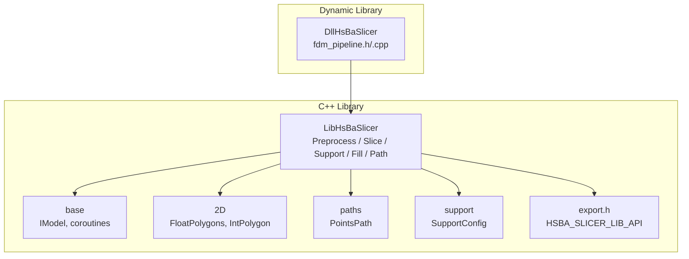
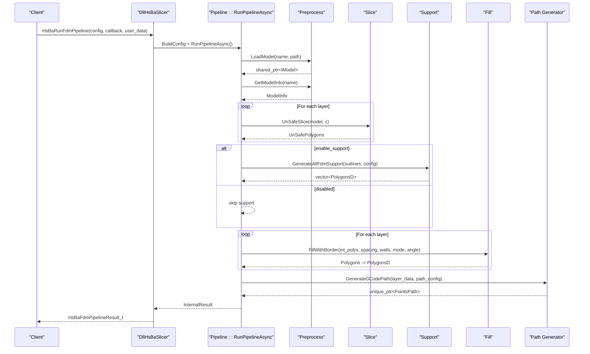
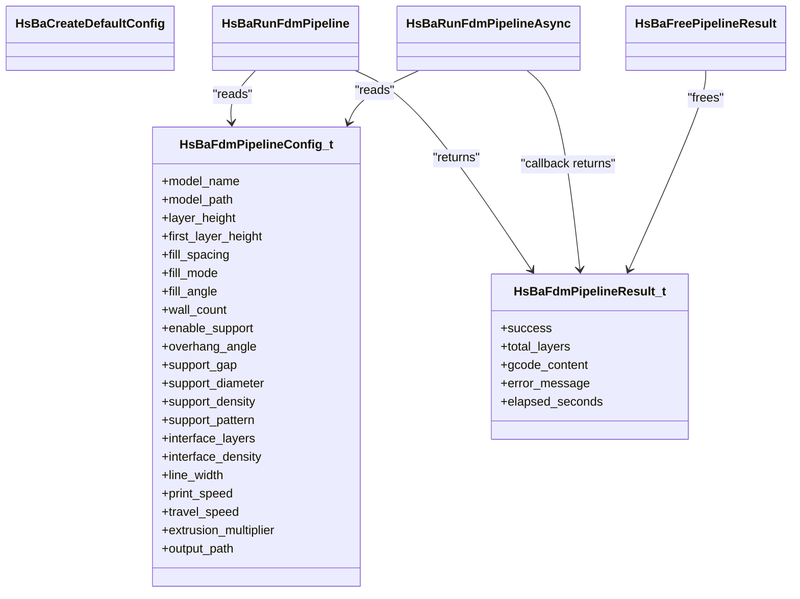
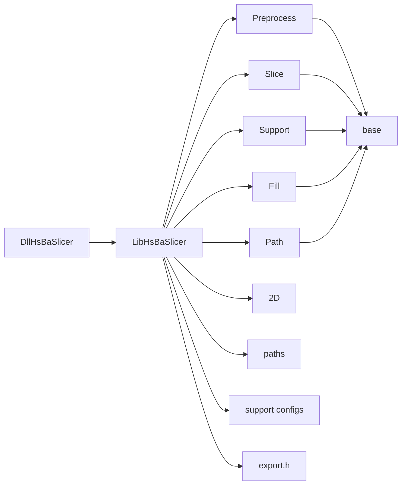

# LibHsBaSlicer API

<cite>
**Referenced Files in This Document**
- [README.md](file://README.md)
- [LibHsBaSlicer/CMakeLists.txt](file://LibHsBaSlicer/CMakeLists.txt)
- [LibHsBaSlicer/export.h](file://LibHsBaSlicer/export.h)
- [LibHsBaSlicer/pch_headers.hpp](file://LibHsBaSlicer/pch_headers.hpp)
- [DllHsBaSlicer/CMakeLists.txt](file://DllHsBaSlicer/CMakeLists.txt)
- [base/IModel.hpp](file://base/IModel.hpp)
- [2D/FloatPolygons.hpp](file://2D/FloatPolygons.hpp)
- [2D/IntPolygon.hpp](file://2D/IntPolygon.hpp)
- [paths/pointspath.hpp](file://paths/pointspath.hpp)
- [support/SupportConfig.hpp](file://support/SupportConfig.hpp)
- [LibHsBaSlicer/Slice/mesh_slice.hpp](file://LibHsBaSlicer/Slice/mesh_slice.hpp)
- [LibHsBaSlicer/Preprocess/model_preprocess.hpp](file://LibHsBaSlicer/Preprocess/model_preprocess.hpp)
- [LibHsBaSlicer/Support/fdm_support.hpp](file://LibHsBaSlicer/Support/fdm_support.hpp)
- [LibHsBaSlicer/Fill/polygon_fill.hpp](file://LibHsBaSlicer/Fill/polygon_fill.hpp)
- [LibHsBaSlicer/Path/path_generator.hpp](file://LibHsBaSlicer/Path/path_generator.hpp)
- [DllHsBaSlicer/fdm_pipeline.h](file://DllHsBaSlicer/fdm_pipeline.h)
- [DllHsBaSlicer/fdm_pipeline.cpp](file://DllHsBaSlicer/fdm_pipeline.cpp)
- [base/coroutine.hpp](file://base/coroutine.hpp)
</cite>

## Update Summary
**Changes Made**
- Updated project structure section to reflect enhanced static library organization with proper header file exposure
- Added new section documenting the improved public API installation and export configuration
- Enhanced dependency analysis to include the new export macro system
- Updated build configuration details to reflect the enhanced LibHsBaSlicer static library setup

## Table of Contents
1. [Introduction](#introduction)
2. [Project Structure](#project-structure)
3. [Core Components](#core-components)
4. [Architecture Overview](#architecture-overview)
5. [Detailed Component Analysis](#detailed-component-analysis)
6. [Dependency Analysis](#dependency-analysis)
7. [Performance Considerations](#performance-considerations)
8. [Troubleshooting Guide](#troubleshooting-guide)
9. [Conclusion](#conclusion)

## Introduction
This document describes the LibHsBaSlicer API and the FDM pipeline exposed by DllHsBaSlicer. It covers:
- The C++ library surface for preprocessing, slicing, support generation, polygon filling, and path generation.
- The C-compatible API for synchronous and asynchronous execution of a complete FDM pipeline using C++20 coroutines internally.
- Data types, configuration structures, and how components interact to produce G-code from 3D models.

The project provides a layered architecture where low-level geometry and mesh modules are wrapped into a high-level slicer API, and a dynamic library exposes a stable C interface for cross-language integration.

[No sources needed since this section summarizes without analyzing specific files]

## Project Structure
At a high level:
- base: Core interfaces (IModel), utilities, and coroutine primitives.
- 2D: Polygon math and boolean operations over Polygons/PolygonsD.
- paths: Path abstractions and G-code point sequences.
- support: Support generation configurations and algorithms.
- preprocess: Model loading and transformation helpers.
- LibHsBaSlicer: Public C++ API for preprocessing, slicing, support, fill, and path generation with enhanced static library support.
- DllHsBaSlicer: C-compatible entry points and the FDM pipeline orchestrator.

**Diagram sources**
- [LibHsBaSlicer/CMakeLists.txt:1-59](file://LibHsBaSlicer/CMakeLists.txt#L1-L59)
- [LibHsBaSlicer/export.h:1-15](file://LibHsBaSlicer/export.h#L1-L15)
- [DllHsBaSlicer/CMakeLists.txt:1-20](file://DllHsBaSlicer/CMakeLists.txt#L1-L20)
- [base/IModel.hpp:108-136](file://base/IModel.hpp#L108-L136)
- [2D/FloatPolygons.hpp:1-267](file://2D/FloatPolygons.hpp#L1-L267)
- [2D/IntPolygon.hpp:1-220](file://2D/IntPolygon.hpp#L1-L220)
- [paths/pointspath.hpp:1-77](file://paths/pointspath.hpp#L1-L77)
- [support/SupportConfig.hpp:1-43](file://support/SupportConfig.hpp#L1-L43)

**Section sources**
- [README.md:1-194](file://README.md#L1-L194)
- [LibHsBaSlicer/CMakeLists.txt:1-59](file://LibHsBaSlicer/CMakeLists.txt#L1-L59)
- [LibHsBaSlicer/export.h:1-15](file://LibHsBaSlicer/export.h#L1-L15)
- [DllHsBaSlicer/CMakeLists.txt:1-20](file://DllHsBaSlicer/CMakeLists.txt#L1-L20)

## Core Components
- Preprocessing API: Load model, transform, query info, remove from pool.
- Slicing API: Safe and unsafe Z-slice functions returning polygons at a given height.
- Support API: Generate per-layer or all-layer supports based on layer outlines and config.
- Fill API: Fill polygons with various modes and optional borders.
- Path Generation API: Convert outlines/fills/supports into G-code point sequences.
- Pipeline API (C): Create default config, run synchronously or asynchronously, free results.

Key data types:
- IModel: Abstract 3D model interface with load/save, transforms, bounding box, volume, triangle mesh access.
- Polygons/PolygonsD: Integer/double precision polygon collections used across the pipeline.
- PointsPath: G-code point list with units and serialization.
- SupportConfig/FdmSupportConfig: Parameters controlling support generation.
- FdmPathConfig: Print parameters for path generation.

**Section sources**
- [base/IModel.hpp:108-136](file://base/IModel.hpp#L108-L136)
- [2D/FloatPolygons.hpp:1-267](file://2D/FloatPolygons.hpp#L1-L267)
- [2D/IntPolygon.hpp:1-220](file://2D/IntPolygon.hpp#L1-L220)
- [paths/pointspath.hpp:1-77](file://paths/pointspath.hpp#L1-L77)
- [support/SupportConfig.hpp:1-43](file://support/SupportConfig.hpp#L1-L43)
- [LibHsBaSlicer/Preprocess/model_preprocess.hpp:1-88](file://LibHsBaSlicer/Preprocess/model_preprocess.hpp#L1-L88)
- [LibHsBaSlicer/Slice/mesh_slice.hpp:1-28](file://LibHsBaSlicer/Slice/mesh_slice.hpp#L1-L28)
- [LibHsBaSlicer/Support/fdm_support.hpp:1-36](file://LibHsBaSlicer/Support/fdm_support.hpp#L1-L36)
- [LibHsBaSlicer/Fill/polygon_fill.hpp:1-36](file://LibHsBaSlicer/Fill/polygon_fill.hpp#L1-L36)
- [LibHsBaSlicer/Path/path_generator.hpp:1-62](file://LibHsBaSlicer/Path/path_generator.hpp#L1-L62)
- [DllHsBaSlicer/fdm_pipeline.h:1-147](file://DllHsBaSlicer/fdm_pipeline.h#L1-L147)

## Architecture Overview
The FDM pipeline is orchestrated by DllHsBaSlicer and implemented as a C++20 coroutine Task. It composes the following stages:
1. Preprocess: Load model and compute total layers.
2. Slice: Produce layer outlines via safe/unsafe slicing.
3. Support: Generate supports for each layer if enabled.
4. Fill: Compute fills with border for each layer.
5. Path Generation: Merge outlines, fills, and supports into a PointsPath and serialize to G-code.

Progress callbacks report stage progress; errors are captured and returned in the result structure.

**Diagram sources**
- [DllHsBaSlicer/fdm_pipeline.cpp:182-292](file://DllHsBaSlicer/fdm_pipeline.cpp#L182-L292)
- [LibHsBaSlicer/Preprocess/model_preprocess.hpp:35-77](file://LibHsBaSlicer/Preprocess/model_preprocess.hpp#L35-L77)
- [LibHsBaSlicer/Slice/mesh_slice.hpp:17-24](file://LibHsBaSlicer/Slice/mesh_slice.hpp#L17-L24)
- [LibHsBaSlicer/Support/fdm_support.hpp:21-31](file://LibHsBaSlicer/Support/fdm_support.hpp#L21-L31)
- [LibHsBaSlicer/Fill/polygon_fill.hpp:19-31](file://LibHsBaSlicer/Fill/polygon_fill.hpp#L19-L31)
- [LibHsBaSlicer/Path/path_generator.hpp:45-46](file://LibHsBaSlicer/Path/path_generator.hpp#L45-L46)

**Section sources**
- [DllHsBaSlicer/fdm_pipeline.h:1-147](file://DllHsBaSlicer/fdm_pipeline.h#L1-L147)
- [DllHsBaSlicer/fdm_pipeline.cpp:1-357](file://DllHsBaSlicer/fdm_pipeline.cpp#L1-L357)
- [base/coroutine.hpp:1-800](file://base/coroutine.hpp#L1-L800)

## Detailed Component Analysis

### Enhanced Static Library Configuration
**Updated** The LibHsBaSlicer static library now includes enhanced configuration with proper export macros and header organization for external consumption.

Key improvements:
- Conditional compilation for both STATIC and SHARED library builds
- Export macro system via `HSBA_SLICER_LIB_API` for Windows DLL import/export
- Comprehensive precompiled headers (`pch_headers.hpp`) for faster compilation
- Proper dependency linking against core libraries (base, utils, mesh, 2D, preprocess, support, paths)

Build configuration features:
- Automatic platform detection for CAD kernel availability (OCCT)
- Conditional compilation for Android/iOS/game console platforms
- Integration with existing export infrastructure from DllHsBaSlicer

**Section sources**
- [LibHsBaSlicer/CMakeLists.txt:1-59](file://LibHsBaSlicer/CMakeLists.txt#L1-L59)
- [LibHsBaSlicer/export.h:1-15](file://LibHsBaSlicer/export.h#L1-L15)
- [LibHsBaSlicer/pch_headers.hpp:1-40](file://LibHsBaSlicer/pch_headers.hpp#L1-L40)

### Preprocessing API
Responsibilities:
- Load a model file into an internal pool and return a shared pointer to IModel.
- Apply translation, rotation, and scaling transformations.
- Query model info such as bounding box and volume.
- Remove models from the pool when no longer needed.

Data types:
- ModelInfo: Bounding box min/max and volume.

Usage notes:
- Errors include invalid arguments (duplicate names, unsupported formats) and runtime failures (file I/O).

**Section sources**
- [LibHsBaSlicer/Preprocess/model_preprocess.hpp:1-88](file://LibHsBaSlicer/Preprocess/model_preprocess.hpp#L1-L88)
- [base/IModel.hpp:108-136](file://base/IModel.hpp#L108-L136)

### Slicing API
Responsibilities:
- Provide safe and unsafe Z-slice functions that return polygons at a specified height.
- Offer Lua-based variants for custom slicing scripts.

Data types:
- Polygons: Integer polygon sets.
- UnSafePolygons: Polygon sets that may contain unclosed paths.

Notes:
- Unsafe slicing includes non-closed contours; use safe slicing when closed contours are required.

**Section sources**
- [LibHsBaSlicer/Slice/mesh_slice.hpp:1-28](file://LibHsBaSlicer/Slice/mesh_slice.hpp#L1-L28)
- [2D/FloatPolygons.hpp:1-267](file://2D/FloatPolygons.hpp#L1-L267)

### Support API
Responsibilities:
- Generate per-layer support polygons given current and previous layer outlines.
- Generate supports for all layers at once.

Configuration:
- FdmSupportConfig extends general support settings with interface layers and density.

**Section sources**
- [LibHsBaSlicer/Support/fdm_support.hpp:1-36](file://LibHsBaSlicer/Support/fdm_support.hpp#L1-L36)
- [support/SupportConfig.hpp:1-43](file://support/SupportConfig.hpp#L1-L43)

### Fill API
Responsibilities:
- Fill a polygon set with configurable spacing, mode, and angle.
- Fill with border to enforce wall thickness around the interior fill.

Modes:
- Line, SimpleZigzag, Zigzag.

**Section sources**
- [LibHsBaSlicer/Fill/polygon_fill.hpp:1-36](file://LibHsBaSlicer/Fill/polygon_fill.hpp#L1-L36)
- [2D/FloatPolygons.hpp:1-267](file://2D/FloatPolygons.hpp#L1-L267)

### Path Generation API
Responsibilities:
- Convert layer data (outlines, fills, supports) into a PointsPath object.
- Provide helper to convert PolygonsD to GPoint sequences with extrusion control.

Configuration:
- FdmPathConfig: Layer height, line width, print/travel speeds, extrusion multiplier, units.

Output:
- PointsPath can be serialized to G-code strings or saved to files.

**Section sources**
- [LibHsBaSlicer/Path/path_generator.hpp:1-62](file://LibHsBaSlicer/Path/path_generator.hpp#L1-L62)
- [paths/pointspath.hpp:1-77](file://paths/pointspath.hpp#L1-L77)

### FDM Pipeline (C API)
Responsibilities:
- Provide C-compatible enums and structs for configuration and results.
- Expose synchronous and asynchronous entry points to run the full FDM pipeline.
- Manage memory for returned strings and provide a free function.

Key elements:
- HsBaFdmPipelineConfig_t: All printing, slicing, support, and output options.
- HsBaFdmPipelineResult_t: Success flag, total layers, G-code content, error message, elapsed time.
- Progress callback: Reports percentage and stage description.
- Async callback: Receives final result when completed.

Internal orchestration:
- Uses Utils::Task to implement asynchronous flow with co_await semantics.
- Converts between integer and double-precision polygons as needed.
- Computes total layers from model bounding box and first/regular layer heights.

**Diagram sources**
- [DllHsBaSlicer/fdm_pipeline.h:1-147](file://DllHsBaSlicer/fdm_pipeline.h#L1-L147)
- [DllHsBaSlicer/fdm_pipeline.cpp:298-357](file://DllHsBaSlicer/fdm_pipeline.cpp#L298-L357)

**Section sources**
- [DllHsBaSlicer/fdm_pipeline.h:1-147](file://DllHsBaSlicer/fdm_pipeline.h#L1-L147)
- [DllHsBaSlicer/fdm_pipeline.cpp:1-357](file://DllHsBaSlicer/fdm_pipeline.cpp#L1-L357)

### Coroutine Infrastructure
The pipeline uses a Task<T> abstraction backed by C++20 coroutines:
- Initial suspension dispatches onto an executor.
- Final suspension yields control back to the caller.
- get_result blocks until completion and rethrows exceptions.
- then/catching/finally allow chaining callbacks.

This enables clean composition of pipeline stages while keeping the C API simple.

**Section sources**
- [base/coroutine.hpp:1-800](file://base/coroutine.hpp#L1-L800)

## Dependency Analysis
Build-time dependencies:
- LibHsBaSlicer links against core libraries: base, utils, mesh, 2D, preprocess, support, paths, and optionally CAD model.
- DllHsBaSlicer depends on LibHsBaSlicer and the same core libraries.

Runtime dependency graph:
- DllHsBaSlicer -> LibHsBaSlicer -> (preprocess, slice, support, fill, path) -> base, 2D, paths, support configs.

**Diagram sources**
- [LibHsBaSlicer/CMakeLists.txt:37-50](file://LibHsBaSlicer/CMakeLists.txt#L37-L50)
- [DllHsBaSlicer/CMakeLists.txt:12-20](file://DllHsBaSlicer/CMakeLists.txt#L12-L20)
- [LibHsBaSlicer/export.h:1-15](file://LibHsBaSlicer/export.h#L1-L15)

**Section sources**
- [LibHsBaSlicer/CMakeLists.txt:1-59](file://LibHsBaSlicer/CMakeLists.txt#L1-L59)
- [DllHsBaSlicer/CMakeLists.txt:1-20](file://DllHsBaSlicer/CMakeLists.txt#L1-L20)

## Performance Considerations
- Use safe slicing unless you specifically need unclosed contours; it avoids extra processing to close paths.
- Adjust fill spacing and wall count to balance quality and speed.
- Disable support generation when not needed to reduce computation.
- Tune print/travel speeds and extrusion multiplier for desired throughput.
- The coroutine-based pipeline allows future parallelization across layers if needed.
- Precompiled headers significantly improve build times for large projects.

[No sources needed since this section provides general guidance]

## Troubleshooting Guide
Common issues and remedies:
- Model loading fails: Verify file path and supported format; ensure the model has positive height.
- Invalid model height: Check bounding box and layer height settings; adjust first layer height if necessary.
- Empty layers: Ensure model intersects the build volume and layer heights are reasonable.
- Memory leaks: Always call the free function to release G-code and error strings returned by the pipeline.
- Progress not reported: Ensure progress callback is provided and invoked; check that the pipeline reaches reporting points.
- Build issues with static library: Ensure proper export macro configuration for your target platform.

**Section sources**
- [DllHsBaSlicer/fdm_pipeline.cpp:182-292](file://DllHsBaSlicer/fdm_pipeline.cpp#L182-L292)
- [DllHsBaSlicer/fdm_pipeline.h:111-140](file://DllHsBaSlicer/fdm_pipeline.h#L111-L140)

## Conclusion
LibHsBaSlicer provides a cohesive C++ API for preprocessing, slicing, support generation, polygon filling, and path generation. The enhanced static library configuration with proper export macros and header organization enables better external consumption and cross-platform compatibility. DllHsBaSlicer wraps these capabilities into a stable C interface and orchestrates them through a coroutine-based pipeline. The design balances simplicity for consumers with flexibility for advanced users, enabling both synchronous and asynchronous workflows while maintaining clear separation of concerns across modules.

[No sources needed since this section summarizes without analyzing specific files]