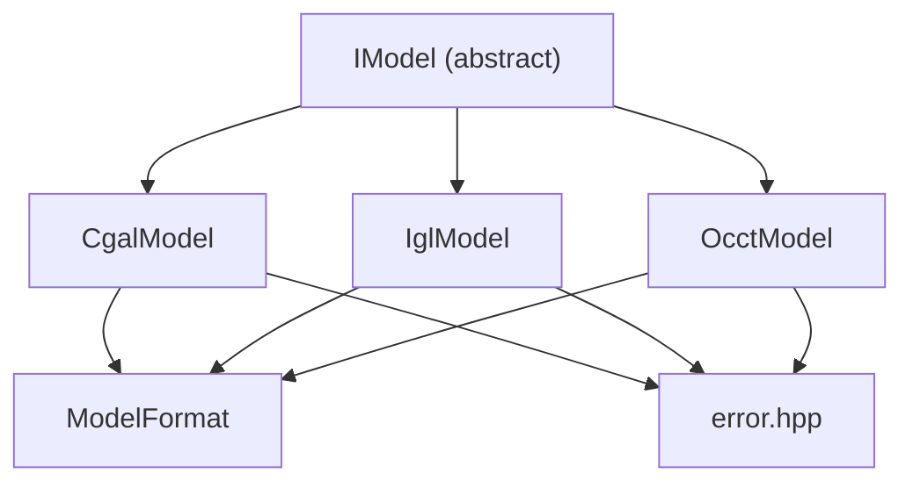
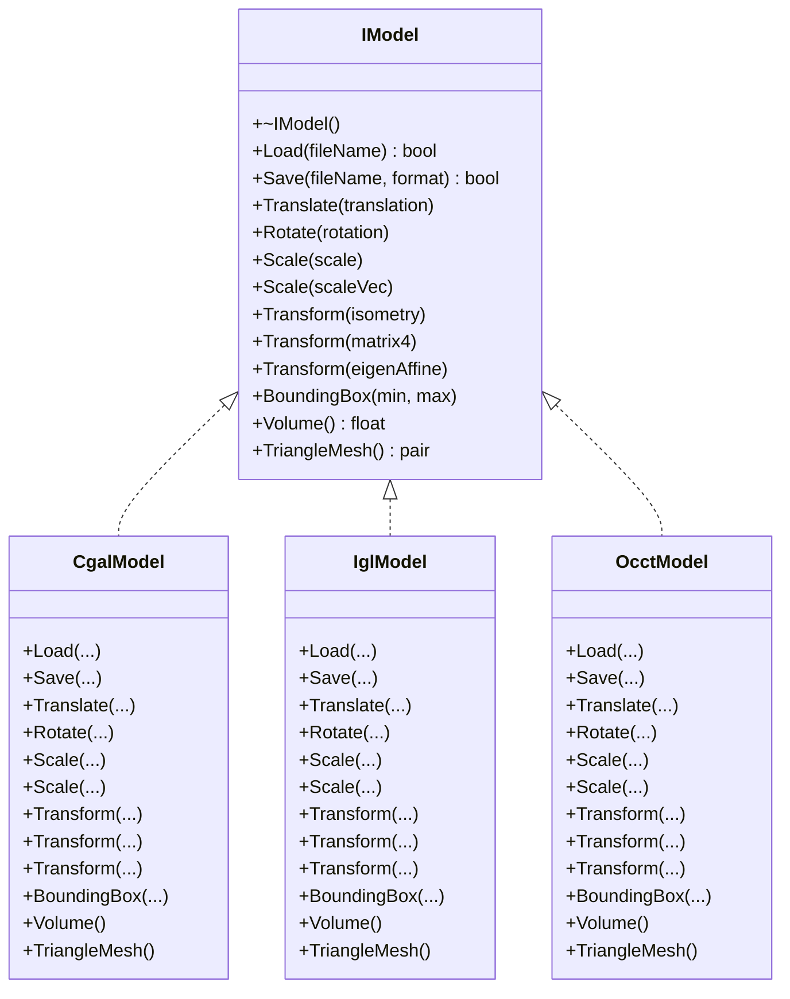
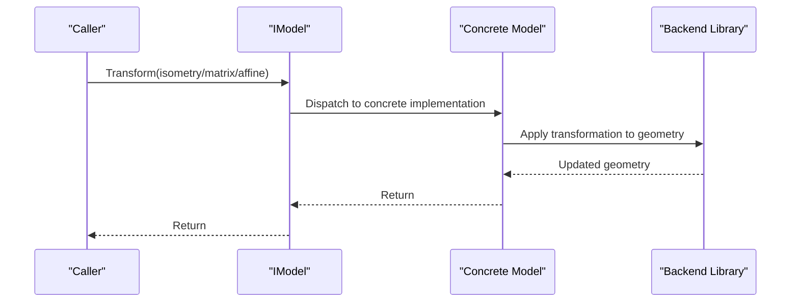
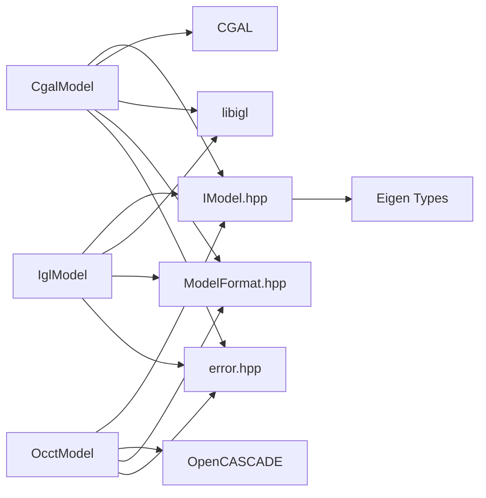

# Model Interface (IModel)

<cite>
**Referenced Files in This Document**
- [IModel.hpp](file://base/IModel.hpp)
- [CgalModel.hpp](file://meshmodel/CgalModel.hpp)
- [CgalModel.cpp](file://meshmodel/CgalModel.cpp)
- [IglModel.hpp](file://meshmodel/IglModel.hpp)
- [IglModel.cpp](file://meshmodel/IglModel.cpp)
- [OcctModel.hpp](file://cadmodel/OcctModel.hpp)
- [OcctModel.cpp](file://cadmodel/OcctModel.cpp)
- [ModelFormat.hpp](file://base/ModelFormat.hpp)
- [error.hpp](file://base/error.hpp)
- [encoding_convert.hpp](file://base/encoding_convert.hpp)
- [cgal_model_test.cpp](file://tests/Models/cgal_model_test.cpp)
- [igl_model_test.cpp](file://tests/Models/igl_model_test.cpp)
- [occt_model_test.cpp](file://tests/Models/occt_model_test.cpp)
</cite>

## Table of Contents
1. [Introduction](#introduction)
2. [Project Structure](#project-structure)
3. [Core Components](#core-components)
4. [Architecture Overview](#architecture-overview)
5. [Detailed Component Analysis](#detailed-component-analysis)
6. [Dependency Analysis](#dependency-analysis)
7. [Performance Considerations](#performance-considerations)
8. [Troubleshooting Guide](#troubleshooting-guide)
9. [Conclusion](#conclusion)

## Introduction
This document provides comprehensive API documentation for the IModel abstract interface that underpins all 3D model representations in HsBaSlicer. It defines the contract for loading, saving, transforming, measuring, and extracting triangle meshes from models. It also documents the expectations for implementers, including thread-safety guarantees, lifetime management, and error handling using the project’s exception types. Concrete implementations (CgalModel, IglModel, OcctModel) are analyzed to show how they satisfy the IModel contract, including transformation semantics and coordinate system conventions.

## Project Structure
The IModel interface resides in the base layer and is implemented by specialized model backends:
- Mesh-based models: CgalModel and IglModel
- CAD-based model: OcctModel
- Shared utilities: ModelFormat enumeration and error types

**Diagram sources**
- [IModel.hpp](file://base/IModel.hpp#L12-L37)
- [CgalModel.hpp](file://meshmodel/CgalModel.hpp#L18-L73)
- [IglModel.hpp](file://meshmodel/IglModel.hpp#L11-L66)
- [OcctModel.hpp](file://cadmodel/OcctModel.hpp#L14-L80)
- [ModelFormat.hpp](file://base/ModelFormat.hpp#L10-L66)
- [error.hpp](file://base/error.hpp#L1-L139)

**Section sources**
- [IModel.hpp](file://base/IModel.hpp#L12-L37)
- [ModelFormat.hpp](file://base/ModelFormat.hpp#L10-L66)

## Core Components
- IModel: Defines the model abstraction with methods for file I/O, transformations, geometry queries, and mesh extraction.
- ModelFormat: Enumerates supported file formats for load/save operations.
- Error types: Standardized exceptions for runtime errors, invalid arguments, IO failures, and unsupported operations.

Key responsibilities:
- Load(fileName): Populate internal representation from a file.
- Save(fileName, format): Persist the model to a file in the given format.
- Transformations: Translate, Rotate, Scale, and general Transform overloads.
- Queries: BoundingBox(min, max), Volume().
- Mesh extraction: TriangleMesh() returns an igl-style pair of vertices and faces.

Thread-safety and lifetime:
- Implementations manage their own internal state and resources.
- Methods operate on mutable state; callers must ensure synchronization if used concurrently.
- Ownership of returned data structures is documented per method.

**Section sources**
- [IModel.hpp](file://base/IModel.hpp#L12-L37)
- [ModelFormat.hpp](file://base/ModelFormat.hpp#L10-L66)
- [error.hpp](file://base/error.hpp#L1-L139)

## Architecture Overview
The IModel interface enables polymorphic model handling across different backends. Implementations encapsulate their native geometry representation while exposing a unified API.

**Diagram sources**
- [IModel.hpp](file://base/IModel.hpp#L12-L37)
- [CgalModel.hpp](file://meshmodel/CgalModel.hpp#L18-L73)
- [IglModel.hpp](file://meshmodel/IglModel.hpp#L11-L66)
- [OcctModel.hpp](file://cadmodel/OcctModel.hpp#L14-L80)

## Detailed Component Analysis

### IModel Contract and Method Specifications
- Load(fileName: string_view) -> bool
  - Preconditions: fileName must be a valid path accessible by the platform.
  - Postconditions: On success, the model is populated with geometry; on failure, the model remains unchanged.
  - Exceptions: May throw NotSupportedError for unsupported formats; IO-related failures may raise IOError depending on backend.
  - Notes: Implementations may normalize geometry (e.g., triangulate faces) after load to ensure downstream compatibility.

- Save(fileName: string_view, format: ModelFormat) -> bool
  - Preconditions: format must be a supported mesh or B-rep format; file path must be writable.
  - Postconditions: Geometry is persisted according to format rules.
  - Exceptions: NotSupportedError for unsupported formats; IOError for IO failures.
  - Notes: Implementations convert internal representation to the target format.

- Translate(translation: Eigen::Vector3f)
  - Preconditions: translation is finite.
  - Postconditions: All vertices/points are translated by the given vector.
  - Exceptions: None declared by interface; implementation-specific exceptions may occur.

- Rotate(rotation: Eigen::Quaternionf)
  - Preconditions: rotation is normalized; vertices/normals are updated accordingly.
  - Postconditions: Orientation is rotated around origin.
  - Exceptions: None declared by interface.

- Scale(scale: float)
  - Preconditions: scale is finite and non-zero for meaningful scaling.
  - Postconditions: Uniform scaling applied to all coordinates.

- Scale(scaleVec: Eigen::Vector3f)
  - Preconditions: scale factors are finite.
  - Postconditions: Non-uniform scaling along axes.

- Transform(transform: Eigen::Isometry3f)
  - Preconditions: transform is a valid isometry.
  - Postconditions: Applies rigid transformation preserving distances and angles.

- Transform(transform: Eigen::Matrix4f)
  - Preconditions: transform is a valid 4x4 matrix representing an affine transform.
  - Postconditions: Applies general affine transformation.

- Transform(transform: Eigen::Transform<float, 3, Eigen::Affine>)
  - Preconditions: transform is a valid 3D affine transform.
  - Postconditions: Applies general affine transformation.

- BoundingBox(min: out Eigen::Vector3f, max: out Eigen::Vector3f)
  - Preconditions: min and max are provided as mutable references.
  - Postconditions: min and max are filled with axis-aligned bounding box extents.
  - Exceptions: None declared by interface.

- Volume() -> float
  - Preconditions: Model represents a closed, oriented manifold where applicable.
  - Postconditions: Returns signed or unsigned volume depending on implementation.
  - Exceptions: None declared by interface.

- TriangleMesh() -> pair<Eigen::MatrixXf, Eigen::MatrixXi>
  - Preconditions: Mesh is triangulated if needed internally.
  - Postconditions: Returns vertices and faces matrices suitable for downstream libraries.
  - Ownership: Returned matrices are copies of internal data; caller manages memory.
  - Exceptions: None declared by interface.

Coordinate system conventions:
- Implementations generally use a right-handed Cartesian coordinate system aligned with typical 3D graphics conventions.
- Transformations are applied in model-local space; translations are applied first, followed by rotations and scales as per the order implied by the transformation matrix composition.

Thread-safety and lifetime:
- Implementations manage their internal state; methods modify state.
- Callers must synchronize concurrent access if models are shared across threads.
- Returned data is owned by the caller; implementations do not retain external references to returned buffers.

**Section sources**
- [IModel.hpp](file://base/IModel.hpp#L12-L37)
- [ModelFormat.hpp](file://base/ModelFormat.hpp#L10-L66)

### CgalModel Implementation Details
- Load(fileName) -> bool
  - Reads polygon mesh from file; ensures triangulated faces post-load.
  - Throws NotSupportedError for unsupported formats; IO errors are propagated via IOError.
  - Uses UTF-8 to local encoding conversion for file paths.

- Save(fileName, format) -> bool
  - Supports STL (binary/ASCII), PLY (binary/ASCII), OBJ, OFF.
  - Throws NotSupportedError for unsupported formats.

- Transformations
  - Translate/Rotate/Scale/Transform apply CGAL transformations to the underlying polyhedron.
  - Rotation uses a 3x3 rotation matrix derived from the quaternion.

- BoundingBox
  - Iterates over mesh points to compute min/max.

- Volume
  - Computes volume using CGAL mesh processing utilities.

- TriangleMesh
  - Ensures triangulated faces before conversion to igl-style mesh.

- Error handling
  - Throws NotSupportedError and IOError as appropriate.

- Performance
  - Load/Save depend on file I/O and CGAL parsing/triangulation costs.
  - Transformations are O(n) over vertices/faces.

**Section sources**
- [CgalModel.cpp](file://meshmodel/CgalModel.cpp#L31-L67)
- [CgalModel.cpp](file://meshmodel/CgalModel.cpp#L68-L123)
- [CgalModel.cpp](file://meshmodel/CgalModel.cpp#L125-L143)
- [CgalModel.cpp](file://meshmodel/CgalModel.cpp#L145-L154)
- [CgalModel.hpp](file://meshmodel/CgalModel.hpp#L18-L73)
- [encoding_convert.hpp](file://base/encoding_convert.hpp#L12-L14)

### IglModel Implementation Details
- Load(fileName) -> bool
  - Loads triangle mesh using igl readers; stores vertices, faces, and optionally normals.

- Save(fileName, format) -> bool
  - Supports STL (binary/ASCII), OFF, OBJ, PLY (binary/ASCII).
  - Throws NotSupportedError for unsupported formats.

- Transformations
  - Translate adds the translation vector to all vertices.
  - Rotate applies rotation matrix to vertices; rotates normals if present.
  - Scale multiplies vertices by scalar or element-wise scale factors.
  - Transform applies 4x4 matrix to homogeneous vertices; adjusts normals appropriately.

- BoundingBox
  - Computes column-wise minima and maxima.

- Volume
  - Computes tetrahedral volumes from vertices and faces.

- TriangleMesh
  - Returns stored vertices and faces as a copy.

- Error handling
  - Throws NotSupportedError for unsupported formats.

- Performance
  - Transformations are vectorized using Eigen operations.
  - Volume computation uses igl routines.

**Section sources**
- [IglModel.cpp](file://meshmodel/IglModel.cpp#L54-L89)
- [IglModel.cpp](file://meshmodel/IglModel.cpp#L91-L135)
- [IglModel.cpp](file://meshmodel/IglModel.cpp#L137-L153)
- [IglModel.cpp](file://meshmodel/IglModel.cpp#L173-L178)
- [IglModel.hpp](file://meshmodel/IglModel.hpp#L11-L66)

### OcctModel Implementation Details
- Load(fileName) -> bool
  - Detects format by extension; reads STEP or IGES.
  - Throws NotSupportedError for unsupported formats; IOError for read failures.

- Save(fileName, format) -> bool
  - Writes STEP or IGES; for mesh formats, converts to triangle mesh via IglModel and delegates to it.
  - Throws NotSupportedError for unsupported formats.

- Transformations
  - Translate/Rotate/Scale apply gp_Trsf transformations to TopoDS_Shape.
  - Rotation uses gp_Quaternion.

- BoundingBox
  - Uses BRepBndLib to compute bounding box.

- Volume
  - Uses BRepGProp/GProp_GProps to compute mass properties.

- TriangleMesh
  - Extracts triangulation from shape and returns vertices/faces.

- Error handling
  - Throws NotSupportedError and IOError as appropriate.

- Performance
  - CAD operations are expensive; caching and reuse of triangulations can improve repeated queries.

**Section sources**
- [OcctModel.cpp](file://cadmodel/OcctModel.cpp#L137-L183)
- [OcctModel.cpp](file://cadmodel/OcctModel.cpp#L184-L200)
- [OcctModel.cpp](file://cadmodel/OcctModel.cpp#L1-L100)
- [OcctModel.hpp](file://cadmodel/OcctModel.hpp#L14-L80)

### Transformation Semantics and Coordinate System
- Transformations are applied in model-local space.
- Translation precedes rotation/scale in the order of matrix multiplication.
- Rotation uses a quaternion-to-matrix conversion; normals are adjusted consistently where applicable.
- Affine transforms preserve collinearity and ratios of distances along lines.

[No sources needed since this diagram shows conceptual workflow, not actual code structure]

## Dependency Analysis
- IModel depends on Eigen types for vectors, quaternions, and transforms.
- Implementations depend on their respective geometry libraries:
  - CgalModel depends on CGAL and libigl for conversions.
  - IglModel depends on libigl for mesh I/O and computations.
  - OcctModel depends on OpenCASCADE for CAD operations.
- ModelFormat enumerates supported formats; implementations gate save/load by format checks.
- Error types unify error reporting across implementations.

**Diagram sources**
- [IModel.hpp](file://base/IModel.hpp#L12-L37)
- [CgalModel.hpp](file://meshmodel/CgalModel.hpp#L18-L73)
- [IglModel.hpp](file://meshmodel/IglModel.hpp#L11-L66)
- [OcctModel.hpp](file://cadmodel/OcctModel.hpp#L14-L80)
- [ModelFormat.hpp](file://base/ModelFormat.hpp#L10-L66)
- [error.hpp](file://base/error.hpp#L1-L139)

**Section sources**
- [ModelFormat.hpp](file://base/ModelFormat.hpp#L10-L66)
- [error.hpp](file://base/error.hpp#L1-L139)

## Performance Considerations
- Load/Save:
  - File I/O dominates cost; binary formats are typically faster than ASCII.
  - CGAL triangulation during load adds overhead; repeated loads should reuse cached triangulated meshes when possible.
- Transformations:
  - Eigen vectorized operations yield good performance for IglModel.
  - CGAL/OpenCASCADE transformations operate on large datasets; consider batching operations.
- Queries:
  - BoundingBox is O(n) over vertices.
  - Volume computation varies by backend; CGAL and OpenCASCADE may cache properties for repeated queries.
- Memory:
  - TriangleMesh returns copies; avoid repeated conversions if results are large.
  - Prefer reusing transformed instances when performing multiple operations.

[No sources needed since this section provides general guidance]

## Troubleshooting Guide
Common issues and resolutions:
- Unsupported format errors:
  - Ensure the requested ModelFormat is supported by the implementation.
  - Check IsMeshFormat/IsBrepFormat helpers to validate format selection.
- IO failures:
  - Verify file paths and permissions; handle IOError exceptions.
  - On Windows, ensure UTF-8 to local encoding conversion is performed for file names.
- Invalid argument errors:
  - Validate transformation inputs (e.g., finite values, normalized quaternions).
- Empty or degenerate meshes:
  - Some operations may produce empty results; test for non-empty outputs before downstream processing.
- CAD-specific issues:
  - OpenCASCADE operations may require shapes to be valid and manifold; validate inputs and handle exceptions.

**Section sources**
- [error.hpp](file://base/error.hpp#L1-L139)
- [encoding_convert.hpp](file://base/encoding_convert.hpp#L12-L14)
- [CgalModel.cpp](file://meshmodel/CgalModel.cpp#L31-L67)
- [IglModel.cpp](file://meshmodel/IglModel.cpp#L54-L89)
- [OcctModel.cpp](file://cadmodel/OcctModel.cpp#L137-L183)

## Conclusion
The IModel interface provides a robust, extensible foundation for 3D model operations across multiple backends. Implementations adhere to a consistent contract for loading, saving, transforming, and querying geometry, while leveraging their native libraries for optimal performance. By following the documented preconditions, postconditions, and exception specifications, developers can integrate models reliably and efficiently. Proper error handling and careful memory management ensure predictable behavior in production environments.