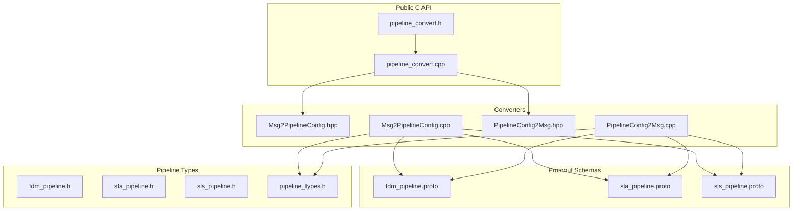
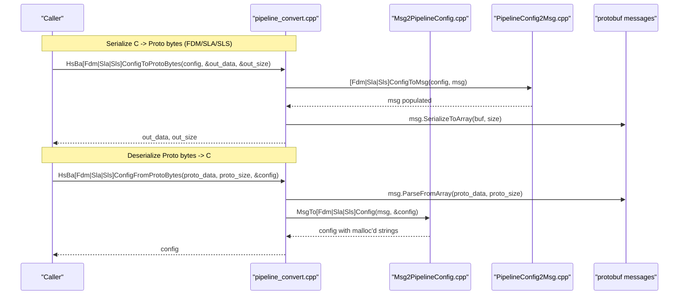
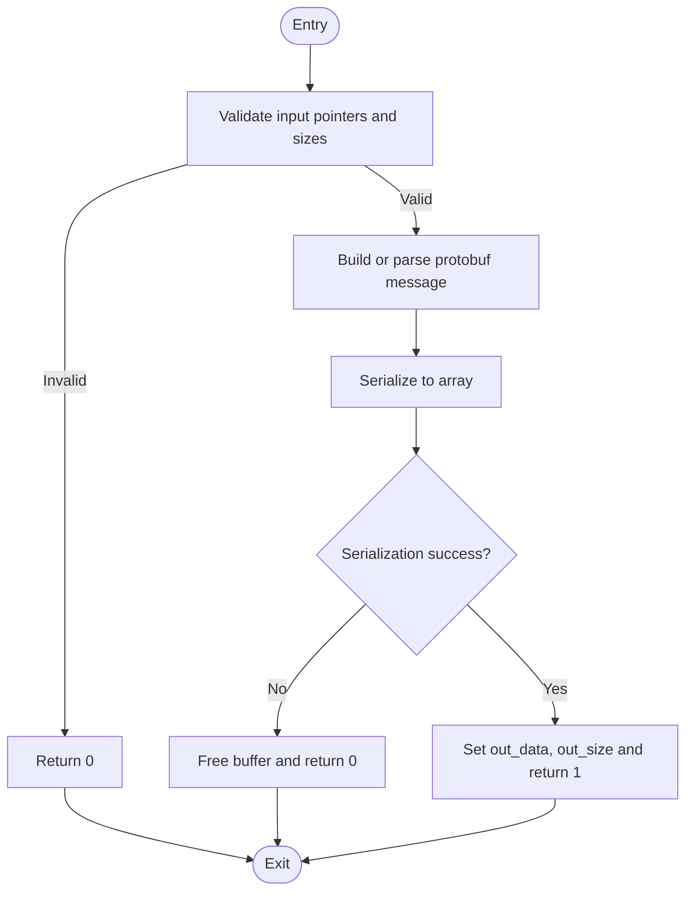
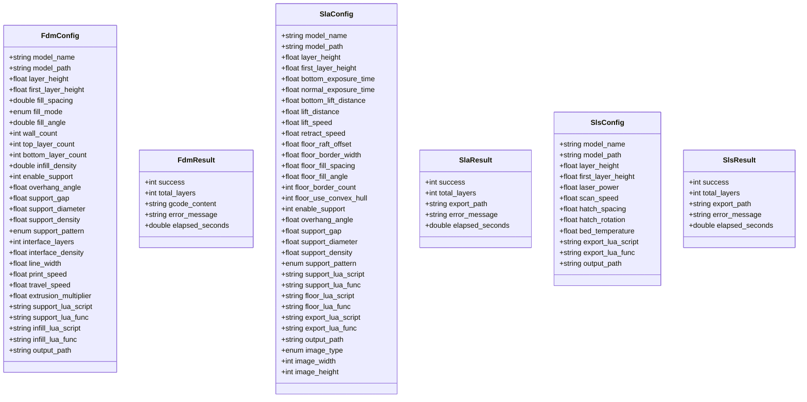
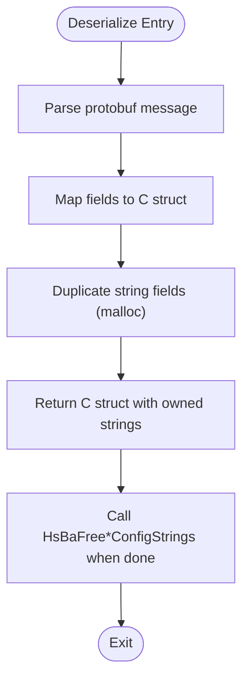
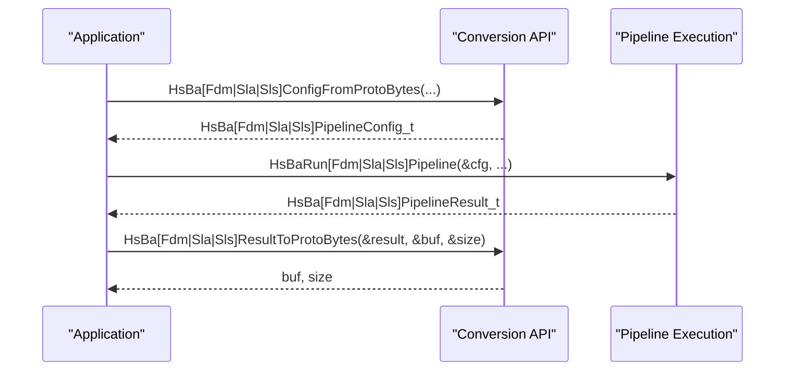
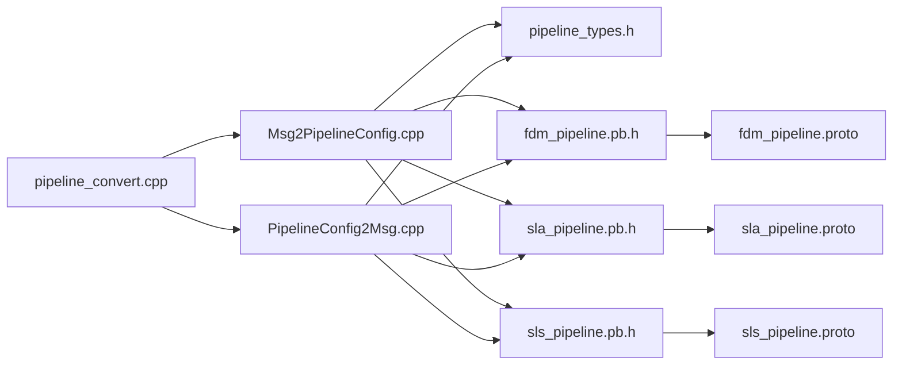

# Pipeline Conversion API

<cite>
**Referenced Files in This Document**
- [pipeline_convert.h](file://DllHsBaSlicer/pipeline_convert.h)
- [pipeline_convert.cpp](file://DllHsBaSlicer/pipeline_convert.cpp)
- [Msg2PipelineConfig.hpp](file://convert/Msg2PipelineConfig.hpp)
- [Msg2PipelineConfig.cpp](file://convert/Msg2PipelineConfig.cpp)
- [PipelineConfig2Msg.hpp](file://convert/PipelineConfig2Msg.hpp)
- [PipelineConfig2Msg.cpp](file://convert/PipelineConfig2Msg.cpp)
- [fdm_pipeline.proto](file://proto/fdm_pipeline.proto)
- [sla_pipeline.proto](file://proto/sla_pipeline.proto)
- [sls_pipeline.proto](file://proto/sls_pipeline.proto)
- [fdm_pipeline.h](file://DllHsBaSlicer/fdm_pipeline.h)
- [fdm_pipeline.cpp](file://DllHsBaSlicer/fdm_pipeline.cpp)
- [sla_pipeline.h](file://DllHsBaSlicer/sla_pipeline.h)
- [sla_pipeline.cpp](file://DllHsBaSlicer/sla_pipeline.cpp)
- [sls_pipeline.h](file://DllHsBaSlicer/sls_pipeline.h)
- [pipeline_types.h](file://pipelinetypes/pipeline_types.h)
</cite>

## Update Summary
**Changes Made**
- Added comprehensive SLS (Selective Laser Sintering) pipeline support to the conversion API
- Updated all architectural diagrams to include SLS components
- Added new sections covering SLS serialization/deserialization, data models, and integration patterns
- Enhanced memory management documentation with SLS-specific cleanup functions
- Updated dependency analysis to reflect SLS protobuf schema and converter implementations

## Table of Contents
1. [Introduction](#introduction)
2. [Project Structure](#project-structure)
3. [Core Components](#core-components)
4. [Architecture Overview](#architecture-overview)
5. [Detailed Component Analysis](#detailed-component-analysis)
6. [Dependency Analysis](#dependency-analysis)
7. [Performance Considerations](#performance-considerations)
8. [Troubleshooting Guide](#troubleshooting-guide)
9. [Conclusion](#conclusion)

## Introduction
This document describes the Pipeline Conversion API that bridges C-compatible pipeline configuration and result structures with protobuf messages for FDM, SLA, and SLS printing pipelines. It explains how to serialize and deserialize configurations and results, memory ownership rules, and the end-to-end data flow from C structs to protobuf wire format and back.

**Updated** Added comprehensive support for Selective Laser Sintering (SLS) pipeline processing alongside existing FDM and SLA capabilities.

## Project Structure
The conversion layer is implemented across three main areas:
- Public C API for serialization/deserialization (DLL interface)
- Internal converters between C structs and protobuf messages
- Protobuf schema definitions for FDM, SLA, and SLS pipelines

**Diagram sources**
- [pipeline_convert.h:1-169](file://DllHsBaSlicer/pipeline_convert.h#L1-L169)
- [pipeline_convert.cpp:1-301](file://DllHsBaSlicer/pipeline_convert.cpp#L1-L301)
- [Msg2PipelineConfig.hpp:1-47](file://convert/Msg2PipelineConfig.hpp#L1-L47)
- [Msg2PipelineConfig.cpp:1-160](file://convert/Msg2PipelineConfig.cpp#L1-L160)
- [PipelineConfig2Msg.hpp:1-35](file://convert/PipelineConfig2Msg.hpp#L1-L35)
- [PipelineConfig2Msg.cpp:1-160](file://convert/PipelineConfig2Msg.cpp#L1-L160)
- [fdm_pipeline.proto:1-63](file://proto/fdm_pipeline.proto#L1-L63)
- [sla_pipeline.proto:1-67](file://proto/sla_pipeline.proto#L1-L67)
- [sls_pipeline.proto:1-33](file://proto/sls_pipeline.proto#L1-L33)
- [fdm_pipeline.h:1-156](file://DllHsBaSlicer/fdm_pipeline.h#L1-L156)
- [sla_pipeline.h:1-160](file://DllHsBaSlicer/sla_pipeline.h#L1-L160)
- [sls_pipeline.h:1-60](file://DllHsBaSlicer/sls_pipeline.h#L1-L60)
- [pipeline_types.h:1-400](file://pipelinetypes/pipeline_types.h#L1-L400)

**Section sources**
- [pipeline_convert.h:1-169](file://DllHsBaSlicer/pipeline_convert.h#L1-L169)
- [pipeline_convert.cpp:1-301](file://DllHsBaSlicer/pipeline_convert.cpp#L1-L301)
- [Msg2PipelineConfig.hpp:1-47](file://convert/Msg2PipelineConfig.hpp#L1-L47)
- [Msg2PipelineConfig.cpp:1-160](file://convert/Msg2PipelineConfig.cpp#L1-L160)
- [PipelineConfig2Msg.hpp:1-35](file://convert/PipelineConfig2Msg.hpp#L1-L35)
- [PipelineConfig2Msg.cpp:1-160](file://convert/PipelineConfig2Msg.cpp#L1-L160)
- [fdm_pipeline.proto:1-63](file://proto/fdm_pipeline.proto#L1-L63)
- [sla_pipeline.proto:1-67](file://proto/sla_pipeline.proto#L1-L67)
- [sls_pipeline.proto:1-33](file://proto/sls_pipeline.proto#L1-L33)
- [fdm_pipeline.h:1-156](file://DllHsBaSlicer/fdm_pipeline.h#L1-L156)
- [sla_pipeline.h:1-160](file://DllHsBaSlicer/sla_pipeline.h#L1-L160)
- [sls_pipeline.h:1-60](file://DllHsBaSlicer/sls_pipeline.h#L1-L60)
- [pipeline_types.h:1-400](file://pipelinetypes/pipeline_types.h#L1-L400)

## Core Components
- Public C API functions for FDM, SLA, and SLS:
  - Config and result serialization to/from protobuf bytes
  - Memory cleanup helpers for converted config strings
- Converters:
  - From protobuf message to C struct (allocates string fields via malloc)
  - From C struct to protobuf message
- Protobuf schemas:
  - FDM pipeline config/result messages and enums
  - SLA pipeline config/result messages and enums
  - SLS pipeline config/result messages and enums

Key responsibilities:
- Validate inputs and return clear success/failure codes
- Manage memory ownership explicitly (caller frees allocated buffers)
- Provide symmetric conversions for both directions across all three pipeline types

**Updated** Added SLS pipeline support with dedicated serialization functions and memory management utilities.

**Section sources**
- [pipeline_convert.h:14-162](file://DllHsBaSlicer/pipeline_convert.h#L14-L162)
- [pipeline_convert.cpp:23-300](file://DllHsBaSlicer/pipeline_convert.cpp#L23-L300)
- [Msg2PipelineConfig.hpp:14-42](file://convert/Msg2PipelineConfig.hpp#L14-L42)
- [Msg2PipelineConfig.cpp:27-159](file://convert/Msg2PipelineConfig.cpp#L27-L159)
- [PipelineConfig2Msg.hpp:14-30](file://convert/PipelineConfig2Msg.hpp#L14-L30)
- [PipelineConfig2Msg.cpp:6-159](file://convert/PipelineConfig2Msg.cpp#L6-L159)
- [fdm_pipeline.proto:19-63](file://proto/fdm_pipeline.proto#L19-L63)
- [sla_pipeline.proto:18-67](file://proto/sla_pipeline.proto#L18-L67)
- [sls_pipeline.proto:5-32](file://proto/sls_pipeline.proto#L5-L32)

## Architecture Overview
End-to-end flow for converting a C config to protobuf bytes and back across all supported pipeline types:

**Diagram sources**
- [pipeline_convert.cpp:37-259](file://DllHsBaSlicer/pipeline_convert.cpp#L37-L259)
- [Msg2PipelineConfig.cpp:27-159](file://convert/Msg2PipelineConfig.cpp#L27-L159)
- [PipelineConfig2Msg.cpp:6-159](file://convert/PipelineConfig2Msg.cpp#L6-L159)
- [fdm_pipeline.proto:19-63](file://proto/fdm_pipeline.proto#L19-L63)
- [sla_pipeline.proto:18-67](file://proto/sla_pipeline.proto#L18-L67)
- [sls_pipeline.proto:5-32](file://proto/sls_pipeline.proto#L5-L32)

## Detailed Component Analysis

### FDM Serialization/Deserialization API
- Functions:
  - HsBaFdmConfigToProtoBytes / HsBaFdmConfigFromProtoBytes
  - HsBaFdmResultToProtoBytes / HsBaFdmResultFromProtoBytes
  - HsBaFreeFdmConfigStrings
- Behavior:
  - Validates pointers and sizes
  - Parses or serializes using protobuf
  - Allocates output buffer with malloc; caller must free
  - Converts between C structs and protobuf messages

**Diagram sources**
- [pipeline_convert.cpp:37-99](file://DllHsBaSlicer/pipeline_convert.cpp#L37-L99)

**Section sources**
- [pipeline_convert.h:21-59](file://DllHsBaSlicer/pipeline_convert.h#L21-L59)
- [pipeline_convert.cpp:23-99](file://DllHsBaSlicer/pipeline_convert.cpp#L23-L99)
- [Msg2PipelineConfig.cpp:27-73](file://convert/Msg2PipelineConfig.cpp#L27-L73)
- [PipelineConfig2Msg.cpp:6-59](file://convert/PipelineConfig2Msg.cpp#L6-L59)
- [fdm_pipeline.proto:19-63](file://proto/fdm_pipeline.proto#L19-L63)

### SLA Serialization/Deserialization API
- Functions:
  - HsBaSlaConfigToProtoBytes / HsBaSlaConfigFromProtoBytes
  - HsBaSlaResultToProtoBytes / HsBaSlaResultFromProtoBytes
  - HsBaFreeSlaConfigStrings
- Behavior:
  - Same validation and allocation semantics as FDM
  - Maps SLA-specific fields including image type and dimensions

**Diagram sources**
- [pipeline_convert.cpp:117-179](file://DllHsBaSlicer/pipeline_convert.cpp#L117-L179)

**Section sources**
- [pipeline_convert.h:62-99](file://DllHsBaSlicer/pipeline_convert.h#L62-L99)
- [pipeline_convert.cpp:103-179](file://DllHsBaSlicer/pipeline_convert.cpp#L103-L179)
- [Msg2PipelineConfig.cpp:75-126](file://convert/Msg2PipelineConfig.cpp#L75-L126)
- [PipelineConfig2Msg.cpp:61-121](file://convert/PipelineConfig2Msg.cpp#L61-L121)
- [sla_pipeline.proto:18-67](file://proto/sla_pipeline.proto#L18-L67)

### SLS Serialization/Deserialization API
- Functions:
  - HsBaSlsConfigToProtoBytes / HsBaSlsConfigFromProtoBytes
  - HsBaSlsResultToProtoBytes / HsBaSlsResultFromProtoBytes
  - HsBaFreeSlsConfigStrings
- Behavior:
  - Same validation and allocation semantics as FDM/SLA
  - Maps SLS-specific laser parameters and powder bed settings
  - Requires export Lua script configuration for custom output formats

**Diagram sources**
- [pipeline_convert.cpp:183-259](file://DllHsBaSlicer/pipeline_convert.cpp#L183-L259)

**Section sources**
- [pipeline_convert.h:101-138](file://DllHsBaSlicer/pipeline_convert.h#L101-L138)
- [pipeline_convert.cpp:181-259](file://DllHsBaSlicer/pipeline_convert.cpp#L181-L259)
- [Msg2PipelineConfig.cpp:128-159](file://convert/Msg2PipelineConfig.cpp#L128-L159)
- [PipelineConfig2Msg.cpp:123-159](file://convert/PipelineConfig2Msg.cpp#L123-L159)
- [sls_pipeline.proto:5-32](file://proto/sls_pipeline.proto#L5-L32)

### Data Models and Mapping
- FDM model mapping:
  - Config fields include model info, slice parameters, fill settings, support options, path/printing parameters, Lua customization hooks, and output path
  - Result includes success flag, total layers, G-code content, error message, and elapsed time
- SLA model mapping:
  - Config fields include model info, slice/exposure/lift/retract parameters, floor/raft settings, support options, Lua customization hooks, output path, and image export settings
  - Result includes success flag, total layers, export path, error message, and elapsed time
- SLS model mapping:
  - Config fields include model info, slice parameters, laser power/scan speed/hatch spacing, bed temperature, export Lua configuration, and output path
  - Result includes success flag, total layers, export path, error message, and elapsed time

**Diagram sources**
- [fdm_pipeline.h:35-93](file://DllHsBaSlicer/fdm_pipeline.h#L35-L93)
- [sla_pipeline.h:36-98](file://DllHsBaSlicer/sla_pipeline.h#L36-98)
- [sls_pipeline.h:13-53](file://DllHsBaSlicer/sls_pipeline.h#L13-53)
- [pipeline_types.h:46-274](file://pipelinetypes/pipeline_types.h#L46-L274)
- [fdm_pipeline.proto:19-63](file://proto/fdm_pipeline.proto#L19-L63)
- [sla_pipeline.proto:18-67](file://proto/sla_pipeline.proto#L18-L67)
- [sls_pipeline.proto:5-32](file://proto/sls_pipeline.proto#L5-L32)

**Section sources**
- [fdm_pipeline.h:35-93](file://DllHsBaSlicer/fdm_pipeline.h#L35-L93)
- [sla_pipeline.h:36-98](file://DllHsBaSlicer/sla_pipeline.h#L36-98)
- [sls_pipeline.h:13-53](file://DllHsBaSlicer/sls_pipeline.h#L13-53)
- [pipeline_types.h:46-274](file://pipelinetypes/pipeline_types.h#L46-L274)
- [fdm_pipeline.proto:19-63](file://proto/fdm_pipeline.proto#L19-L63)
- [sla_pipeline.proto:18-67](file://proto/sla_pipeline.proto#L18-L67)
- [sls_pipeline.proto:5-32](file://proto/sls_pipeline.proto#L5-L32)

### Memory Management and Ownership
- Output buffers from ToProtoBytes are allocated with malloc; callers must free them after use.
- When deserializing from proto bytes into C structs, string fields are allocated with malloc; callers must free these strings using provided cleanup helpers or their own logic.
- Dedicated cleanup helpers exist for freeing config string fields:
  - HsBaFreeFdmConfigStrings
  - HsBaFreeSlaConfigStrings
  - HsBaFreeSlsConfigStrings

**Diagram sources**
- [Msg2PipelineConfig.cpp:15-23](file://convert/Msg2PipelineConfig.cpp#L15-L23)
- [pipeline_convert.cpp:263-300](file://DllHsBaSlicer/pipeline_convert.cpp#L263-L300)

**Section sources**
- [Msg2PipelineConfig.cpp:15-23](file://convert/Msg2PipelineConfig.cpp#L15-L23)
- [pipeline_convert.cpp:263-300](file://DllHsBaSlicer/pipeline_convert.cpp#L263-L300)

### Integration with Pipeline Execution
- The same C structs used by the conversion API are consumed by the pipeline execution APIs:
  - FDM: HsBaRunFdmPipeline, HsBaRunFdmPipelineAsync
  - SLA: HsBaRunSlaPipeline, HsBaRunSlaPipelineAsync
  - SLS: HsBaRunSlsPipeline, HsBaRunSlsPipelineAsync
- Results returned by pipeline execution can be serialized to protobuf via the conversion API for transport or storage.

**Diagram sources**
- [fdm_pipeline.h:107-149](file://DllHsBaSlicer/fdm_pipeline.h#L107-L149)
- [fdm_pipeline.cpp:386-419](file://DllHsBaSlicer/fdm_pipeline.cpp#L386-L419)
- [sls_pipeline.h:29-44](file://DllHsBaSlicer/sls_pipeline.h#L29-L44)
- [pipeline_convert.cpp:62-259](file://DllHsBaSlicer/pipeline_convert.cpp#L62-L259)

**Section sources**
- [fdm_pipeline.h:107-149](file://DllHsBaSlicer/fdm_pipeline.h#L107-L149)
- [fdm_pipeline.cpp:386-419](file://DllHsBaSlicer/fdm_pipeline.cpp#L386-L419)
- [sls_pipeline.h:29-44](file://DllHsBaSlicer/sls_pipeline.h#L29-L44)
- [pipeline_convert.cpp:62-259](file://DllHsBaSlicer/pipeline_convert.cpp#L62-L259)

## Dependency Analysis
High-level dependencies among components:

**Diagram sources**
- [pipeline_convert.cpp:1-301](file://DllHsBaSlicer/pipeline_convert.cpp#L1-L301)
- [Msg2PipelineConfig.cpp:1-160](file://convert/Msg2PipelineConfig.cpp#L1-L160)
- [PipelineConfig2Msg.cpp:1-160](file://convert/PipelineConfig2Msg.cpp#L1-L160)
- [pipeline_types.h:1-400](file://pipelinetypes/pipeline_types.h#L1-L400)
- [fdm_pipeline.proto:1-63](file://proto/fdm_pipeline.proto#L1-L63)
- [sla_pipeline.proto:1-67](file://proto/sla_pipeline.proto#L1-L67)
- [sls_pipeline.proto:1-33](file://proto/sls_pipeline.proto#L1-L33)

**Section sources**
- [pipeline_convert.cpp:1-301](file://DllHsBaSlicer/pipeline_convert.cpp#L1-L301)
- [Msg2PipelineConfig.cpp:1-160](file://convert/Msg2PipelineConfig.cpp#L1-L160)
- [PipelineConfig2Msg.cpp:1-160](file://convert/PipelineConfig2Msg.cpp#L1-L160)
- [pipeline_types.h:1-400](file://pipelinetypes/pipeline_types.h#L1-L400)
- [fdm_pipeline.proto:1-63](file://proto/fdm_pipeline.proto#L1-L63)
- [sla_pipeline.proto:1-67](file://proto/sla_pipeline.proto#L1-L67)
- [sls_pipeline.proto:1-33](file://proto/sls_pipeline.proto#L1-L33)

## Performance Considerations
- Avoid repeated allocations by reusing buffers where possible at the application level.
- Prefer batch operations if sending multiple configs/results over the same connection.
- Be mindful of large payloads (e.g., G-code content) when serializing; consider streaming or chunking strategies outside this API.
- Use async pipeline execution APIs to overlap work while serialization occurs.
- For SLS pipelines, note that export Lua scripts may generate variable-sized outputs affecting serialization performance.

**Updated** Added SLS-specific performance considerations regarding variable output sizes from Lua export scripts.

## Troubleshooting Guide
Common issues and resolutions:
- Invalid arguments: Ensure non-null pointers and positive sizes for all input buffers.
- Serialization failures: Verify that the underlying protobuf message can be serialized; check available memory.
- Memory leaks: Always free buffers returned by ToProtoBytes and call the appropriate HsBaFree*ConfigStrings for deserialized configs.
- Error propagation: Inspect error_message fields in results and handle success flags appropriately.
- SLS-specific issues: Ensure export_lua_script is properly configured as it's required for SLS pipeline execution.

**Updated** Added SLS-specific troubleshooting guidance regarding required export Lua script configuration.

**Section sources**
- [pipeline_convert.cpp:23-259](file://DllHsBaSlicer/pipeline_convert.cpp#L23-L259)
- [Msg2PipelineConfig.cpp:27-159](file://convert/Msg2PipelineConfig.cpp#L27-L159)
- [sls_pipeline.h:24](file://DllHsBaSlicer/sls_pipeline.h#L24)

## Conclusion
The Pipeline Conversion API provides a robust, explicit-memory-management bridge between C-compatible pipeline structures and protobuf messages for FDM, SLA, and SLS workflows. By following the documented ownership rules and leveraging the provided helpers, applications can reliably serialize and deserialize pipeline configurations and results across process boundaries or languages.

**Updated** The API now comprehensively supports all three major additive manufacturing processes: Fused Deposition Modeling (FDM), Stereolithography (SLA), and Selective Laser Sintering (SLS), providing unified serialization capabilities across diverse printing technologies.