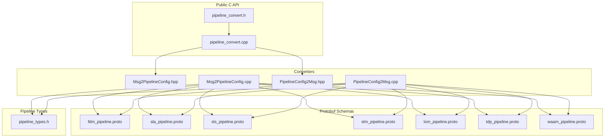
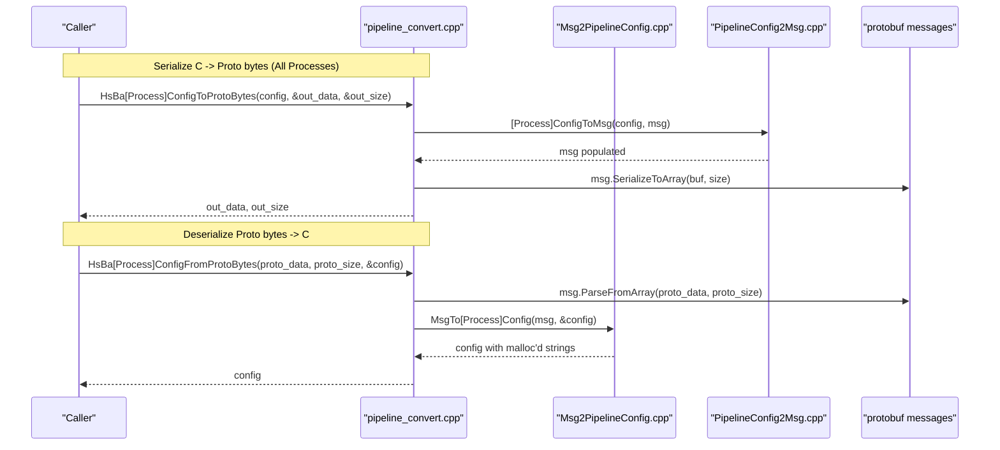
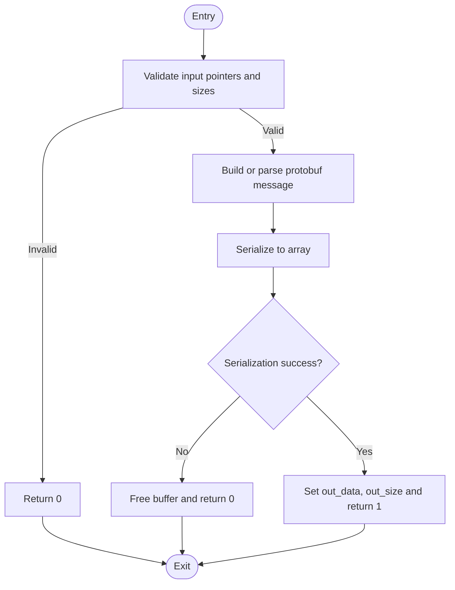
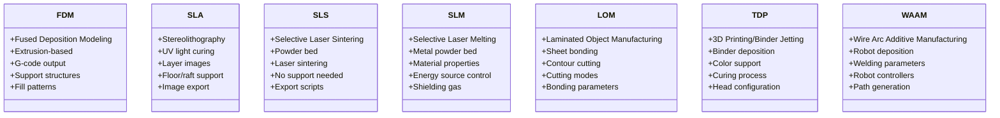
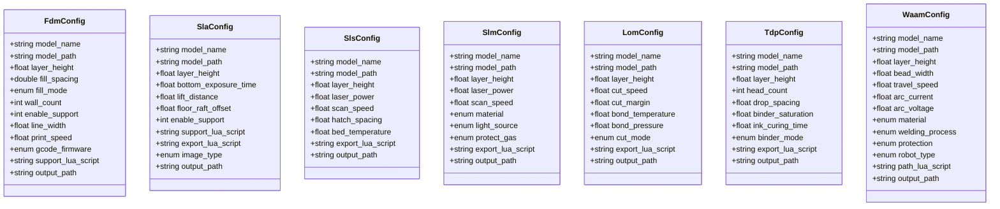
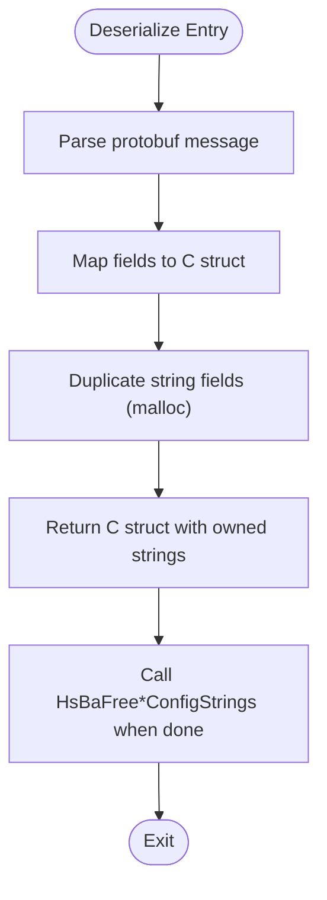
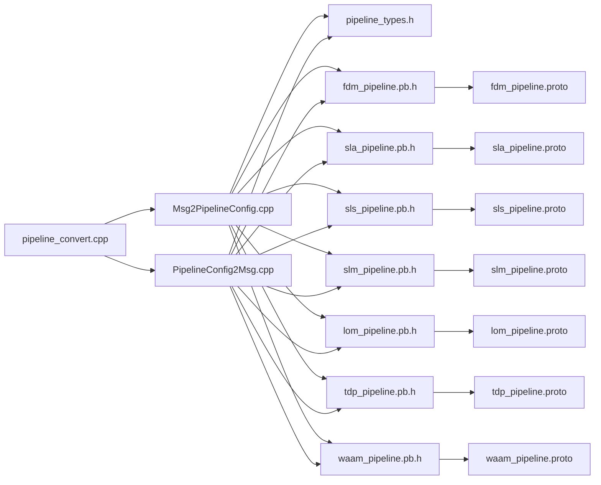

# Pipeline Conversion API

<cite>
**Referenced Files in This Document**
- [pipeline_convert.h](file://DllHsBaSlicer/pipeline_convert.h)
- [pipeline_convert.cpp](file://DllHsBaSlicer/pipeline_convert.cpp)
- [Msg2PipelineConfig.hpp](file://convert/Msg2PipelineConfig.hpp)
- [Msg2PipelineConfig.cpp](file://convert/Msg2PipelineConfig.cpp)
- [PipelineConfig2Msg.hpp](file://convert/PipelineConfig2Msg.hpp)
- [PipelineConfig2Msg.cpp](file://convert/PipelineConfig2Msg.cpp)
- [fdm_pipeline.proto](file://proto/fdm_pipeline.proto)
- [sla_pipeline.proto](file://proto/sla_pipeline.proto)
- [sls_pipeline.proto](file://proto/sls_pipeline.proto)
- [slm_pipeline.proto](file://proto/slm_pipeline.proto)
- [lom_pipeline.proto](file://proto/lom_pipeline.proto)
- [tdp_pipeline.proto](file://proto/tdp_pipeline.proto)
- [waam_pipeline.proto](file://proto/waam_pipeline.proto)
- [fdm_pipeline.h](file://DllHsBaSlicer/fdm_pipeline.h)
- [fdm_pipeline.cpp](file://DllHsBaSlicer/fdm_pipeline.cpp)
- [sla_pipeline.h](file://DllHsBaSlicer/sla_pipeline.h)
- [sla_pipeline.cpp](file://DllHsBaSlicer/sla_pipeline.cpp)
- [sls_pipeline.h](file://DllHsBaSlicer/sls_pipeline.h)
- [sls_pipeline.cpp](file://DllHsBaSlicer/sls_pipeline.cpp)
- [slm_pipeline.h](file://DllHsBaSlicer/slm_pipeline.h)
- [slm_pipeline.cpp](file://DllHsBaSlicer/slm_pipeline.cpp)
- [lom_pipeline.h](file://DllHsBaSlicer/lom_pipeline.h)
- [lom_pipeline.cpp](file://DllHsBaSlicer/lom_pipeline.cpp)
- [tdp_pipeline.h](file://DllHsBaSlicer/tdp_pipeline.h)
- [tdp_pipeline.cpp](file://DllHsBaSlicer/tdp_pipeline.cpp)
- [waam_pipeline.h](file://DllHsBaSlicer/waam_pipeline.h)
- [waam_pipeline.cpp](file://DllHsBaSlicer/waam_pipeline.cpp)
- [pipeline_types.h](file://pipelinetypes/pipeline_types.h)
</cite>

## Update Summary
**Changes Made**
- Added comprehensive support for four new manufacturing process types: SLM (Selective Laser Melting), LOM (Laminated Object Manufacturing), 3DP (Three-Dimensional Printing/Binder Jetting), and WAAM (Wire Arc Additive Manufacturing)
- Extended the C ABI conversion API with serialization/deserialization functions for all new process types
- Enhanced memory management utilities with dedicated cleanup functions for each new pipeline type
- Updated protobuf schemas and converter implementations to support the expanded manufacturing ecosystem
- Expanded architectural diagrams to reflect the complete multi-process pipeline architecture

## Table of Contents
1. [Introduction](#introduction)
2. [Project Structure](#project-structure)
3. [Core Components](#core-components)
4. [Architecture Overview](#architecture-overview)
5. [Detailed Component Analysis](#detailed-component-analysis)
6. [Manufacturing Process Types](#manufacturing-process-types)
7. [Dependency Analysis](#dependency-analysis)
8. [Performance Considerations](#performance-considerations)
9. [Troubleshooting Guide](#troubleshooting-guide)
10. [Conclusion](#conclusion)

## Introduction
This document describes the Pipeline Conversion API that bridges C-compatible pipeline configuration and result structures with protobuf messages for multiple additive manufacturing processes. The API now supports FDM (Fused Deposition Modeling), SLA (Stereolithography), SLS (Selective Laser Sintering), SLM (Selective Laser Melting), LOM (Laminated Object Manufacturing), 3DP (Binder Jetting), and WAAM (Wire Arc Additive Manufacturing) alongside File Transfer and Custom Lua pipelines. It explains how to serialize and deserialize configurations and results, memory ownership rules, and the end-to-end data flow from C structs to protobuf wire format and back.

**Updated** Significantly expanded to support seven distinct manufacturing processes with unified serialization capabilities across diverse additive and subtractive technologies.

## Project Structure
The conversion layer is implemented across three main areas:
- Public C API for serialization/deserialization (DLL interface)
- Internal converters between C structs and protobuf messages
- Protobuf schema definitions for all supported pipeline types

```mermaid
graph TB
subgraph "Public C API"
PC_H["pipeline_convert.h"]
PC_CPP["pipeline_convert.cpp"]
end
subgraph "Converters"
M2C_HPP["Msg2PipelineConfig.hpp"]
M2C_CPP["Msg2PipelineConfig.cpp"]
C2M_HPP["PipelineConfig2Msg.hpp"]
C2M_CPP["PipelineConfig2Msg.cpp"]
end
subgraph "Protobuf Schemas"
FDM_PROTO["fdm_pipeline.proto"]
SLA_PROTO["sla_pipeline.proto"]
SLS_PROTO["sls_pipeline.proto"]
SLM_PROTO["slm_pipeline.proto"]
LOM_PROTO["lom_pipeline.proto"]
TDP_PROTO["tdp_pipeline.proto"]
WAAM_PROTO["waam_pipeline.proto"]
end
subgraph "Pipeline Types"
TYPES_H["pipeline_types.h"]
end
PC_H --> PC_CPP
PC_CPP --> M2C_HPP
PC_CPP --> C2M_HPP
M2C_CPP --> TYPES_H
C2M_CPP --> TYPES_H
M2C_CPP --> FDM_PROTO
M2C_CPP --> SLA_PROTO
M2C_CPP --> SLS_PROTO
M2C_CPP --> SLM_PROTO
M2C_CPP --> LOM_PROTO
M2C_CPP --> TDP_PROTO
M2C_CPP --> WAAM_PROTO
C2M_CPP --> FDM_PROTO
C2M_CPP --> SLA_PROTO
C2M_CPP --> SLS_PROTO
C2M_CPP --> SLM_PROTO
C2M_CPP --> LOM_PROTO
C2M_CPP --> TDP_PROTO
C2M_CPP --> WAAM_PROTO
```

**Diagram sources**
- [pipeline_convert.h:1-397](file://DllHsBaSlicer/pipeline_convert.h#L1-L397)
- [pipeline_convert.cpp:1-786](file://DllHsBaSlicer/pipeline_convert.cpp#L1-L786)
- [Msg2PipelineConfig.hpp:1-104](file://convert/Msg2PipelineConfig.hpp#L1-L104)
- [PipelineConfig2Msg.hpp:1-81](file://convert/PipelineConfig2Msg.hpp#L1-L81)
- [fdm_pipeline.proto:1-63](file://proto/fdm_pipeline.proto#L1-L63)
- [sla_pipeline.proto:1-67](file://proto/sla_pipeline.proto#L1-L67)
- [sls_pipeline.proto:1-32](file://proto/sls_pipeline.proto#L1-L32)
- [slm_pipeline.proto:1-65](file://proto/slm_pipeline.proto#L1-L65)
- [lom_pipeline.proto:1-46](file://proto/lom_pipeline.proto#L1-L46)
- [tdp_pipeline.proto:1-47](file://proto/tdp_pipeline.proto#L1-L47)
- [waam_pipeline.proto:1-89](file://proto/waam_pipeline.proto#L1-L89)
- [pipeline_types.h:1-1049](file://pipelinetypes/pipeline_types.h#L1-L1049)

## Core Components
- Public C API functions for all supported manufacturing processes:
  - Config and result serialization to/from protobuf bytes for FDM, SLA, SLS, SLM, LOM, 3DP, and WAAM
  - Memory cleanup helpers for converted config strings specific to each process type
- Converters:
  - From protobuf message to C struct (allocates string fields via malloc)
  - From C struct to protobuf message
- Protobuf schemas:
  - Comprehensive message definitions for all seven manufacturing processes plus file transfer and custom Lua pipelines

Key responsibilities:
- Validate inputs and return clear success/failure codes
- Manage memory ownership explicitly (caller frees allocated buffers)
- Provide symmetric conversions for both directions across all supported process types
- Support both synchronous and asynchronous pipeline execution patterns

**Updated** Expanded to support seven distinct manufacturing processes with specialized serialization functions and memory management utilities for each process type.

## Architecture Overview
End-to-end flow for converting a C config to protobuf bytes and back across all supported manufacturing processes:

```mermaid
sequenceDiagram
participant Caller as "Caller"
participant API as "pipeline_convert.cpp"
participant ConvIn as "Msg2PipelineConfig.cpp"
participant ConvOut as "PipelineConfig2Msg.cpp"
participant Proto as "protobuf messages"
Note over Caller,API : Serialize C -> Proto bytes (All Processes)
Caller->>API : HsBa[Process]ConfigToProtoBytes(config, &out_data, &out_size)
API->>ConvOut : [Process]ConfigToMsg(config, msg)
ConvOut-->>API : msg populated
API->>Proto : msg.SerializeToArray(buf, size)
API-->>Caller : out_data, out_size
Note over Caller,API : Deserialize Proto bytes -> C
Caller->>API : HsBa[Process]ConfigFromProtoBytes(proto_data, proto_size, &config)
API->>Proto : msg.ParseFromArray(proto_data, proto_size)
API->>ConvIn : MsgTo[Process]Config(msg, &config)
ConvIn-->>API : config with malloc'd strings
API-->>Caller : config
```

**Diagram sources**
- [pipeline_convert.cpp:27-786](file://DllHsBaSlicer/pipeline_convert.cpp#L27-L786)
- [Msg2PipelineConfig.hpp:24-99](file://convert/Msg2PipelineConfig.hpp#L24-L99)
- [PipelineConfig2Msg.hpp:24-76](file://convert/PipelineConfig2Msg.hpp#L24-L76)

## Detailed Component Analysis

### FDM Serialization/Deserialization API
- Functions:
  - HsBaFdmConfigToProtoBytes / HsBaFdmConfigFromProtoBytes
  - HsBaFdmResultToProtoBytes / HsBaFdmResultFromProtoBytes
  - HsBaFreeFdmConfigStrings
- Behavior:
  - Validates pointers and sizes
  - Parses or serializes using protobuf
  - Allocates output buffer with malloc; caller must free
  - Converts between C structs and protobuf messages

```mermaid
flowchart TD
Start([Entry]) --> CheckArgs["Validate input pointers and sizes"]
CheckArgs --> |Invalid| ReturnZero["Return 0"]
CheckArgs --> |Valid| BuildOrParse["Build or parse protobuf message"]
BuildOrParse --> Serialize["Serialize to array"]
Serialize --> Success{"Serialization success?"}
Success --> |No| FreeBuf["Free buffer and return 0"]
Success --> |Yes| OutParams["Set out_data, out_size and return 1"]
ReturnZero --> End([Exit])
FreeBuf --> End
OutParams --> End
```

**Diagram sources**
- [pipeline_convert.cpp:27-99](file://DllHsBaSlicer/pipeline_convert.cpp#L27-L99)

### SLA Serialization/Deserialization API
- Functions:
  - HsBaSlaConfigToProtoBytes / HsBaSlaConfigFromProtoBytes
  - HsBaSlaResultToProtoBytes / HsBaSlaResultFromProtoBytes
  - HsBaFreeSlaConfigStrings
- Behavior:
  - Same validation and allocation semantics as FDM
  - Maps SLA-specific fields including image type and dimensions

### SLS Serialization/Deserialization API
- Functions:
  - HsBaSlsConfigToProtoBytes / HsBaSlsConfigFromProtoBytes
  - HsBaSlsResultToProtoBytes / HsBaSlsResultFromProtoBytes
  - HsBaFreeSlsConfigStrings
- Behavior:
  - Same validation and allocation semantics as FDM/SLA
  - Maps SLS-specific laser parameters and powder bed settings
  - Requires export Lua script configuration for custom output formats

### New Process Type Serializations

#### SLM (Selective Laser Melting)
- Functions:
  - HsBaSlmConfigToProtoBytes / HsBaSlmConfigFromProtoBytes
  - HsBaSlmResultToProtoBytes / HsBaSlmResultFromProtoBytes
  - HsBaFreeSlmConfigStrings
- Specialization: Metal powder-bed process with material, energy source, and shielding gas parameters

#### LOM (Laminated Object Manufacturing)
- Functions:
  - HsBaLomConfigToProtoBytes / HsBaLomConfigFromProtoBytes
  - HsBaLomResultToProtoBytes / HsBaLomResultFromProtoBytes
  - HsBaFreeLomConfigStrings
- Specialization: Sheet-bonding process with cutting modes and bonding parameters

#### 3DP (Three-Dimensional Printing/Binder Jetting)
- Functions:
  - HsBaTdpConfigToProtoBytes / HsBaTdpConfigFromProtoBytes
  - HsBaTdpResultToProtoBytes / HsBaTdpResultFromProtoBytes
  - HsBaFreeTdpConfigStrings
- Specialization: Binder jetting with color support and curing parameters

#### WAAM (Wire Arc Additive Manufacturing)
- Functions:
  - HsBaWaamConfigToProtoBytes / HsBaWaamConfigFromProtoBytes
  - HsBaWaamResultToProtoBytes / HsBaWaamResultFromProtoBytes
  - HsBaFreeWaamConfigStrings
- Specialization: Robot-based deposition with welding parameters and robot controller integration

**Section sources**
- [pipeline_convert.h:240-390](file://DllHsBaSlicer/pipeline_convert.h#L240-L390)
- [pipeline_convert.cpp:413-786](file://DllHsBaSlicer/pipeline_convert.cpp#L413-L786)

## Manufacturing Process Types

### Process Classification and Characteristics

```mermaid
classDiagram
class FDM {
+Fused Deposition Modeling
+Extrusion-based
+G-code output
+Support structures
+Fill patterns
}
class SLA {
+Stereolithography
+UV light curing
+Layer images
+Floor/raft support
+Image export
}
class SLS {
+Selective Laser Sintering
+Powder bed
+Laser sintering
+No support needed
+Export scripts
}
class SLM {
+Selective Laser Melting
+Metal powder bed
+Material properties
+Energy source control
+Shielding gas
}
class LOM {
+Laminated Object Manufacturing
+Sheet bonding
+Contour cutting
+Cutting modes
+Bonding parameters
}
class TDP {
+3D Printing/Binder Jetting
+Binder deposition
+Color support
+Curing process
+Head configuration
}
class WAAM {
+Wire Arc Additive Manufacturing
+Robot deposition
+Welding parameters
+Robot controllers
+Path generation
}
```

**Diagram sources**
- [pipeline_types.h:56-612](file://pipelinetypes/pipeline_types.h#L56-L612)
- [fdm_pipeline.proto:19-63](file://proto/fdm_pipeline.proto#L19-L63)
- [sla_pipeline.proto:18-67](file://proto/sla_pipeline.proto#L18-L67)
- [sls_pipeline.proto:5-32](file://proto/sls_pipeline.proto#L5-L32)
- [slm_pipeline.proto:33-65](file://proto/slm_pipeline.proto#L33-L65)
- [lom_pipeline.proto:13-46](file://proto/lom_pipeline.proto#L13-L46)
- [tdp_pipeline.proto:15-47](file://proto/tdp_pipeline.proto#L15-L47)
- [waam_pipeline.proto:49-89](file://proto/waam_pipeline.proto#L49-L89)

### Data Models and Mapping

Each manufacturing process has specialized configuration structures optimized for their specific requirements:

- **FDM**: Model info, slice parameters, fill settings, support options, path/printing parameters, Lua customization hooks, G-code firmware settings, and output path
- **SLA**: Model info, slice/exposure/lift/retract parameters, floor/raft settings, support options, Lua customization hooks, output path, and image export settings  
- **SLS**: Model info, slice parameters, laser power/scan speed/hatch spacing, bed temperature, export Lua configuration, and output path
- **SLM**: Metal-specific parameters including material type, energy source (laser/e-beam), shielding gas, and processing parameters
- **LOM**: Sheet thickness, cutting parameters (speed/margin/power), bonding conditions (temperature/pressure/time), and cutting mode selection
- **3DP**: Head configuration, binder parameters (saturation/curing time), powder bed temperature, and binder jetting modes
- **WAAM**: Welding parameters (current/voltage/gas flow), material properties, protection methods, robot controller types, and path generation options

```mermaid
classDiagram
class FdmConfig {
+string model_name
+string model_path
+float layer_height
+double fill_spacing
+enum fill_mode
+int wall_count
+int enable_support
+float line_width
+float print_speed
+enum gcode_firmware
+string support_lua_script
+string output_path
}
class SlaConfig {
+string model_name
+string model_path
+float layer_height
+float bottom_exposure_time
+float lift_distance
+float floor_raft_offset
+int enable_support
+string support_lua_script
+string export_lua_script
+enum image_type
+string output_path
}
class SlsConfig {
+string model_name
+string model_path
+float layer_height
+float laser_power
+float scan_speed
+float hatch_spacing
+float bed_temperature
+string export_lua_script
+string output_path
}
class SlmConfig {
+string model_name
+string model_path
+float layer_height
+float laser_power
+float scan_speed
+enum material
+enum light_source
+enum protect_gas
+string export_lua_script
+string output_path
}
class LomConfig {
+string model_name
+string model_path
+float layer_height
+float cut_speed
+float cut_margin
+float bond_temperature
+float bond_pressure
+enum cut_mode
+string export_lua_script
+string output_path
}
class TdpConfig {
+string model_name
+string model_path
+float layer_height
+int head_count
+float drop_spacing
+float binder_saturation
+float ink_curing_time
+enum binder_mode
+string export_lua_script
+string output_path
}
class WaamConfig {
+string model_name
+string model_path
+float layer_height
+float bead_width
+float travel_speed
+float arc_current
+float arc_voltage
+enum material
+enum welding_process
+enum protection
+enum robot_type
+string path_lua_script
+string output_path
}
```

**Diagram sources**
- [pipeline_types.h:56-612](file://pipelinetypes/pipeline_types.h#L56-L612)

**Section sources**
- [pipeline_types.h:56-612](file://pipelinetypes/pipeline_types.h#L56-L612)

### Memory Management and Ownership
- Output buffers from ToProtoBytes are allocated with malloc; callers must free them after use.
- When deserializing from proto bytes into C structs, string fields are allocated with malloc; callers must free these strings using provided cleanup helpers or their own logic.
- Dedicated cleanup helpers exist for freeing config string fields for all supported process types:
  - HsBaFreeFdmConfigStrings
  - HsBaFreeSlaConfigStrings
  - HsBaFreeSlsConfigStrings
  - HsBaFreeSlmConfigStrings
  - HsBaFreeLomConfigStrings
  - HsBaFreeTdpConfigStrings
  - HsBaFreeWaamConfigStrings

```mermaid
flowchart TD
Start([Deserialize Entry]) --> Parse["Parse protobuf message"]
Parse --> MapFields["Map fields to C struct"]
MapFields --> DupStrings["Duplicate string fields (malloc)"]
DupStrings --> ReturnStruct["Return C struct with owned strings"]
ReturnStruct --> Cleanup["Call HsBaFree*ConfigStrings when done"]
Cleanup --> End([Exit])
```

**Diagram sources**
- [pipeline_convert.cpp:673-786](file://DllHsBaSlicer/pipeline_convert.cpp#L673-L786)

**Section sources**
- [pipeline_convert.cpp:673-786](file://DllHsBaSlicer/pipeline_convert.cpp#L673-L786)

## Dependency Analysis
High-level dependencies among components across all supported manufacturing processes:

```mermaid
graph LR
A["pipeline_convert.cpp"] --> B["Msg2PipelineConfig.cpp"]
A --> C["PipelineConfig2Msg.cpp"]
B --> D["pipeline_types.h"]
C --> D
B --> E["fdm_pipeline.pb.h"]
B --> F["sla_pipeline.pb.h"]
B --> G["sls_pipeline.pb.h"]
B --> H["slm_pipeline.pb.h"]
B --> I["lom_pipeline.pb.h"]
B --> J["tdp_pipeline.pb.h"]
B --> K["waam_pipeline.pb.h"]
C --> E
C --> F
C --> G
C --> H
C --> I
C --> J
C --> K
E --> L["fdm_pipeline.proto"]
F --> M["sla_pipeline.proto"]
G --> N["sls_pipeline.proto"]
H --> O["slm_pipeline.proto"]
I --> P["lom_pipeline.proto"]
J --> Q["tdp_pipeline.proto"]
K --> R["waam_pipeline.proto"]
```

**Diagram sources**
- [pipeline_convert.cpp:1-786](file://DllHsBaSlicer/pipeline_convert.cpp#L1-L786)
- [Msg2PipelineConfig.hpp:1-104](file://convert/Msg2PipelineConfig.hpp#L1-L104)
- [PipelineConfig2Msg.hpp:1-81](file://convert/PipelineConfig2Msg.hpp#L1-L81)
- [pipeline_types.h:1-1049](file://pipelinetypes/pipeline_types.h#L1-L1049)

**Section sources**
- [pipeline_convert.cpp:1-786](file://DllHsBaSlicer/pipeline_convert.cpp#L1-L786)
- [Msg2PipelineConfig.hpp:1-104](file://convert/Msg2PipelineConfig.hpp#L1-L104)
- [PipelineConfig2Msg.hpp:1-81](file://convert/PipelineConfig2Msg.hpp#L1-L81)
- [pipeline_types.h:1-1049](file://pipelinetypes/pipeline_types.h#L1-L1049)

## Performance Considerations
- Avoid repeated allocations by reusing buffers where possible at the application level.
- Prefer batch operations if sending multiple configs/results over the same connection.
- Be mindful of large payloads (e.g., G-code content for FDM) when serializing; consider streaming or chunking strategies outside this API.
- Use async pipeline execution APIs to overlap work while serialization occurs.
- For metal processes (SLM, WAAM), note that welding parameters and robot program generation may affect serialization performance.
- For sheet-based processes (LOM), contour cutting calculations can impact processing time.
- For binder jetting (3DP), color data and curing times may increase payload sizes.

**Updated** Added process-specific performance considerations for the new manufacturing types, particularly regarding metal processing, sheet-based manufacturing, and binder jetting characteristics.

## Troubleshooting Guide
Common issues and resolutions:
- Invalid arguments: Ensure non-null pointers and positive sizes for all input buffers.
- Serialization failures: Verify that the underlying protobuf message can be serialized; check available memory.
- Memory leaks: Always free buffers returned by ToProtoBytes and call the appropriate HsBaFree*ConfigStrings for deserialized configs.
- Error propagation: Inspect error_message fields in results and handle success flags appropriately.
- Process-specific validation: Ensure required fields are set for each manufacturing process (e.g., export_lua_script for SLS/SLM/LOM/3DP).
- Metal process configuration: For SLM/WAAM, verify material compatibility and energy source settings.
- Robot integration: For WAAM, ensure proper robot controller type and path generator configuration.

**Updated** Added troubleshooting guidance for the new manufacturing processes, including metal process validation and robot integration considerations.

**Section sources**
- [pipeline_convert.cpp:27-786](file://DllHsBaSlicer/pipeline_convert.cpp#L27-L786)

## Conclusion
The Pipeline Conversion API provides a robust, explicit-memory-management bridge between C-compatible pipeline structures and protobuf messages for seven distinct additive manufacturing processes: Fused Deposition Modeling (FDM), Stereolithography (SLA), Selective Laser Sintering (SLS), Selective Laser Melting (SLM), Laminated Object Manufacturing (LOM), Three-Dimensional Printing/Binder Jetting (3DP), and Wire Arc Additive Manufacturing (WAAM), along with File Transfer and Custom Lua pipeline support. By following the documented ownership rules and leveraging the provided helpers, applications can reliably serialize and deserialize pipeline configurations and results across process boundaries or languages, supporting the complete spectrum of modern manufacturing technologies from plastic extrusion to metal deposition.

**Updated** The API now comprehensively supports the full range of contemporary manufacturing processes, providing unified serialization capabilities across diverse additive and hybrid manufacturing technologies, from traditional plastic printing to advanced metal deposition systems.