# Slicing API

<cite>
**Referenced Files in This Document**   
- [mesh_slice.hpp](file://LibHsBaSlicer/Slice/mesh_slice.hpp)
- [mesh_slice.cpp](file://LibHsBaSlicer/Slice/mesh_slice.cpp)
- [FullTopoModel.hpp](file://meshmodel/FullTopoModel.hpp)
- [FullTopoModel.cpp](file://meshmodel/FullTopoModel.cpp)
- [IntPolygon.hpp](file://2D/IntPolygon.hpp)
- [FloatPolygons.hpp](file://2D/FloatPolygons.hpp)
- [LuaAdapter.hpp](file://2D/LuaAdapter.hpp)
- [error.hpp](file://base/error.hpp)
- [IModel.hpp](file://base/IModel.hpp)
- [custom_fill.lua](file://tests/PolygonFill/custom_fill.lua)
- [image_from_polygons.lua](file://tests/PolygonFill/image_from_polygons.lua)
- [LuaNewObject.hpp](file://utils/LuaNewObject.hpp)
</cite>

## Table of Contents
1. [Introduction](#introduction)
2. [Core Slicing Functions](#core-slicing-functions)
3. [Safe vs Unsafe Slicing](#safe-vs-unsafe-slicing)
4. [Lua Scripting Interface](#lua-scripting-interface)
5. [Error Handling and Exception Hierarchy](#error-handling-and-exception-hierarchy)
6. [Performance Considerations](#performance-considerations)
7. [Usage Examples](#usage-examples)
8. [Underlying Implementation](#underlying-implementation)

## Introduction
The HsBaSlicer provides a comprehensive API for 3D model slicing operations, enabling both standard and custom slicing workflows. The core slicing functions allow for Z-direction planar slicing of 3D models at specified heights, with options for safe and unsafe slicing modes. The API also supports Lua scripting for custom fill pattern generation, providing flexibility for specialized manufacturing processes. This documentation covers the Slice, UnSafeSlice, SliceLua, and UnSafeSliceLua functions, their parameters, return types, thread safety guarantees, and integration with the underlying FullTopoModel implementation.

**Section sources**
- [mesh_slice.hpp](file://LibHsBaSlicer/Slice/mesh_slice.hpp#L1-L21)
- [FullTopoModel.hpp](file://meshmodel/FullTopoModel.hpp#L1-L119)

## Core Slicing Functions
The HsBaSlicer API provides four primary slicing functions that operate on 3D models through the IModel interface. These functions are designed for Z-direction planar slicing at specified heights and differ in their handling of contour closure and support for custom Lua-based path generation.

### Slice Function
The `Slice` function performs safe slicing of a 3D model at a specified height, returning only closed polygon contours. This function ignores any non-closed contours that may result from the slicing process.

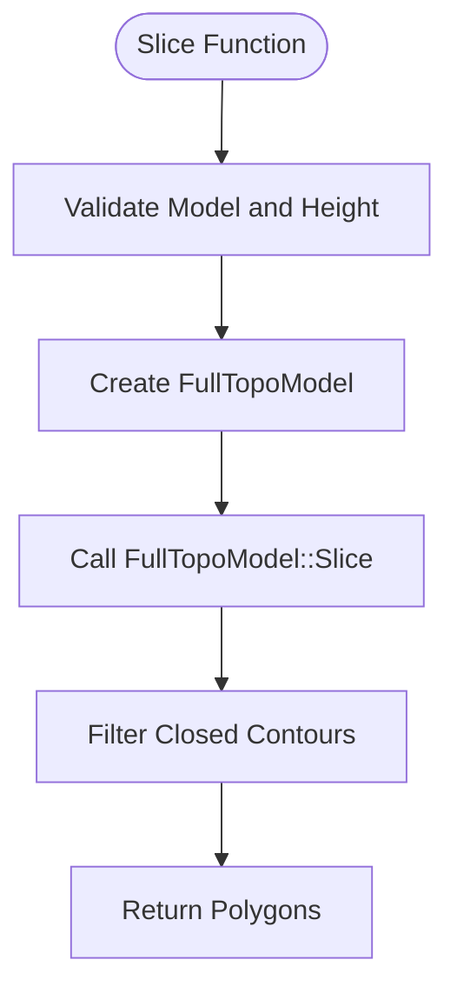

**Diagram sources**
- [mesh_slice.cpp](file://LibHsBaSlicer/Slice/mesh_slice.cpp#L5-L9)
- [FullTopoModel.cpp](file://meshmodel/FullTopoModel.cpp#L256-L342)

**Section sources**
- [mesh_slice.hpp](file://LibHsBaSlicer/Slice/mesh_slice.hpp#L12-L12)
- [FullTopoModel.hpp](file://meshmodel/FullTopoModel.hpp#L93-L93)

### UnSafeSlice Function
The `UnSafeSlice` function performs slicing that includes both closed and open (non-closed) contours in the result. This mode is suitable for specific manufacturing processes like wire feeding where open contours are acceptable.

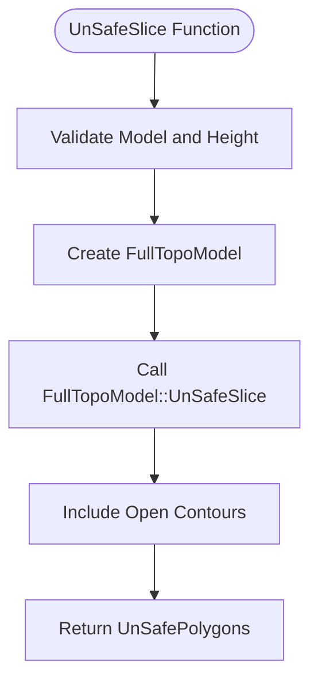

**Diagram sources**
- [mesh_slice.cpp](file://LibHsBaSlicer/Slice/mesh_slice.cpp#L10-L14)
- [FullTopoModel.cpp](file://meshmodel/FullTopoModel.cpp#L344-L432)

**Section sources**
- [mesh_slice.hpp](file://LibHsBaSlicer/Slice/mesh_slice.hpp#L15-L15)
- [FullTopoModel.hpp](file://meshmodel/FullTopoModel.hpp#L95-L95)

### SliceLua Function
The `SliceLua` function enables custom slicing logic through Lua scripting, allowing users to define their own path generation algorithms. The script has access to the model's vertex, edge, and face data.

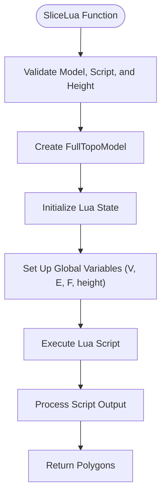

**Diagram sources**
- [mesh_slice.cpp](file://LibHsBaSlicer/Slice/mesh_slice.cpp#L16-L20)
- [FullTopoModel.cpp](file://meshmodel/FullTopoModel.cpp#L434-L535)

**Section sources**
- [mesh_slice.hpp](file://LibHsBaSlicer/Slice/mesh_slice.hpp#L17-L17)
- [FullTopoModel.hpp](file://meshmodel/FullTopoModel.hpp#L101-L101)

### UnSafeSliceLua Function
The `UnSafeSliceLua` function combines Lua scripting capabilities with the ability to return open contours, providing maximum flexibility for custom path generation that may include polylines.

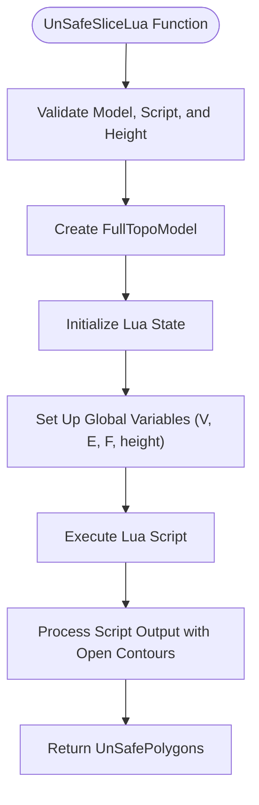

**Diagram sources**
- [mesh_slice.cpp](file://LibHsBaSlicer/Slice/mesh_slice.cpp#L22-L26)
- [FullTopoModel.cpp](file://meshmodel/FullTopoModel.cpp#L537-L642)

**Section sources**
- [mesh_slice.hpp](file://LibHsBaSlicer/Slice/mesh_slice.hpp#L18-L18)
- [FullTopoModel.hpp](file://meshmodel/FullTopoModel.hpp#L108-L108)

## Safe vs Unsafe Slicing
The HsBaSlicer API provides two distinct slicing modes: safe and unsafe, each with specific use cases, performance characteristics, and error handling behaviors.

### Safe Slicing Mode
Safe slicing, implemented by the `Slice` function, only returns closed polygon contours and discards any non-closed contours that result from the slicing process. This mode ensures geometric integrity and is recommended for most manufacturing processes.

**Key Characteristics:**
- Only closed contours are returned
- Non-closed contours are discarded
- Ensures topological correctness
- Recommended for SLA and similar processes

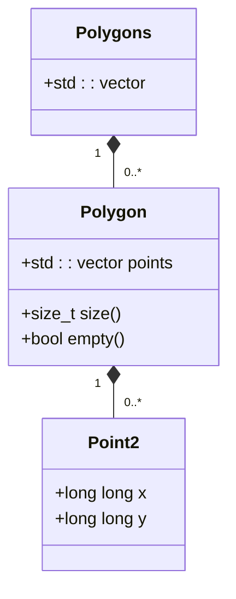

**Diagram sources**
- [IntPolygon.hpp](file://2D/IntPolygon.hpp#L12-L14)
- [FullTopoModel.cpp](file://meshmodel/FullTopoModel.cpp#L256-L342)

**Section sources**
- [mesh_slice.hpp](file://LibHsBaSlicer/Slice/mesh_slice.hpp#L12-L12)
- [FullTopoModel.hpp](file://meshmodel/FullTopoModel.hpp#L93-L93)

### Unsafe Slicing Mode
Unsafe slicing, implemented by the `UnSafeSlice` function, includes both closed and open contours in the result. This mode is suitable for specific manufacturing processes where open contours are acceptable or required.

**Key Characteristics:**
- Both closed and open contours are returned
- Open contours are marked with a closed flag
- Suitable for wire feeding processes
- Not recommended for SLA and similar processes

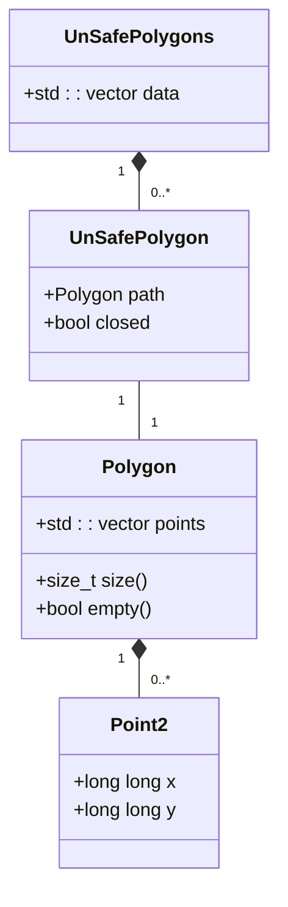

**Diagram sources**
- [FullTopoModel.hpp](file://meshmodel/FullTopoModel.hpp#L19-L25)
- [FullTopoModel.cpp](file://meshmodel/FullTopoModel.cpp#L344-L432)

**Section sources**
- [mesh_slice.hpp](file://LibHsBaSlicer/Slice/mesh_slice.hpp#L15-L15)
- [FullTopoModel.hpp](file://meshmodel/FullTopoModel.hpp#L95-L95)

### Performance Implications
The choice between safe and unsafe slicing modes has performance implications that should be considered based on the specific use case.

**Performance Comparison:**
- **Safe Slicing**: Slightly higher computational overhead due to contour closure validation
- **Unsafe Slicing**: Lower computational overhead as all contours are preserved
- **Memory Usage**: Unsafe slicing may require more memory due to additional open contours
- **Processing Time**: Safe slicing may be slower for models with many open contours

The performance difference is typically minimal for most models, but can become significant for complex geometries with numerous open contours.

## Lua Scripting Interface
The HsBaSlicer API provides a powerful Lua scripting interface that allows users to implement custom fill patterns and path generation algorithms. This interface enables advanced customization beyond the standard slicing capabilities.

### Lua Script Environment
When executing Lua scripts for slicing, the following global variables are made available to the script:

- **V**: 1-based array of vertices, where each vertex is a table with x, y, z coordinates
- **E**: 1-based array of edges, where each edge is a table with two vertex indices
- **F**: 1-based array of faces, where each face is a table with three vertex indices
- **height**: The slicing height as a floating-point number

The script should return a table of polygons in the format: `polys = { { {x=..,y=..}, ... }, ... }`

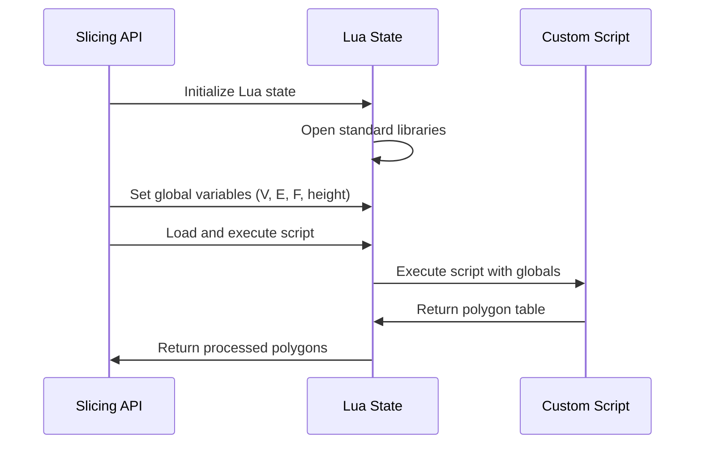

**Diagram sources**
- [FullTopoModel.cpp](file://meshmodel/FullTopoModel.cpp#L434-L535)
- [LuaNewObject.hpp](file://utils/LuaNewObject.hpp#L57-L61)

**Section sources**
- [FullTopoModel.hpp](file://meshmodel/FullTopoModel.hpp#L97-L101)
- [FullTopoModel.cpp](file://meshmodel/FullTopoModel.cpp#L434-L535)

### Supported Function Signatures
The Lua scripting interface supports multiple function signatures for different use cases:

1. **Direct Script Execution**:
   ```cpp
   Polygons SliceLua(const std::string& script, const float height) const;
   ```

2. **Function-Based Script Execution**:
   ```cpp
   Polygons SliceLua(const std::string& script, const std::string& funcName, const float height) const;
   ```

3. **File-Based Script Execution**:
   ```cpp
   Polygons SliceLua(const std::filesystem::path& script_file, const std::string& funcName, const float height) const;
   ```

These signatures allow for flexibility in how Lua scripts are provided and executed, supporting both inline scripts and external script files.

### Script Loading Mechanisms
The API supports loading Lua scripts from both strings and file paths, providing flexibility for different deployment scenarios.

**String-Based Loading:**
- Scripts are provided as string parameters
- Suitable for embedded scripts or dynamically generated scripts
- No file I/O overhead

**File-Based Loading:**
- Scripts are loaded from specified file paths
- Suitable for complex scripts or shared script libraries
- Enables script reuse across multiple applications

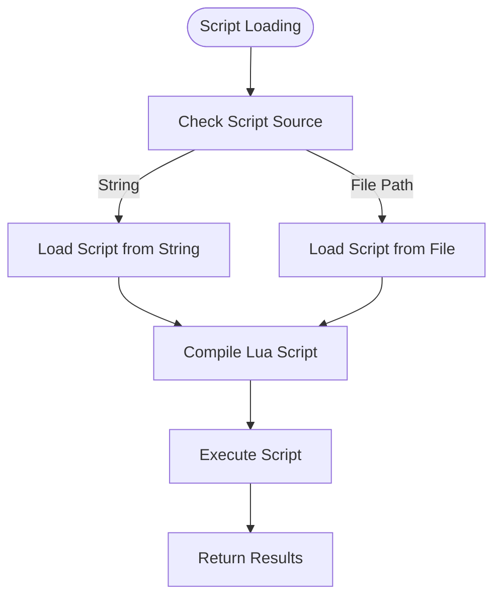

**Diagram sources**
- [FullTopoModel.cpp](file://meshmodel/FullTopoModel.cpp#L644-L746)
- [FullTopoModel.cpp](file://meshmodel/FullTopoModel.cpp#L748-L800)

**Section sources**
- [FullTopoModel.hpp](file://meshmodel/FullTopoModel.hpp#L103-L105)
- [FullTopoModel.cpp](file://meshmodel/FullTopoModel.cpp#L644-L800)

## Error Handling and Exception Hierarchy
The HsBaSlicer API implements a comprehensive error handling system based on C++ exceptions, with a well-defined hierarchy for different error types.

### Exception Hierarchy
The exception hierarchy is defined in the base/error.hpp file and follows a structured approach:

```mermaid
classDiagram
class std : : runtime_error {
+const char* what()
}
class RuntimeError {
+RuntimeError(const std : : string& msg)
+const char* what()
}
class InvalidArgumentError {
+InvalidArgumentError(const std : : string& msg)
+const char* what()
}
class RuntimeError {
+RuntimeError(const std : : string& msg)
+const char* what()
}
std : : runtime_error <|-- RuntimeError
RuntimeError <|-- InvalidArgumentError
RuntimeError <|-- RuntimeError
class OutOfRangeError
class IOError
class NotImplementedError
class NullValueError
class NotSupportedError
class NotFoundError
class AlreadyExistsError
class PermissionDeniedError
class TimeoutError
class InterruptedError
class CancelledError
class OutOfMemoryError
RuntimeError <|-- OutOfRangeError
RuntimeError <|-- IOError
RuntimeError <|-- NotImplementedError
RuntimeError <|-- NullValueError
RuntimeError <|-- NotSupportedError
RuntimeError <|-- NotFoundError
RuntimeError <|-- AlreadyExistsError
RuntimeError <|-- PermissionDeniedError
RuntimeError <|-- TimeoutError
RuntimeError <|-- InterruptedError
RuntimeError <|-- CancelledError
RuntimeError <|-- OutOfMemoryError
```

**Diagram sources**
- [error.hpp](file://base/error.hpp#L12-L137)

**Section sources**
- [error.hpp](file://base/error.hpp#L12-L137)

### Error Propagation
Errors are propagated through the slicing functions according to specific conditions:

**InvalidArgumentError Cases:**
- Null or invalid model input
- Invalid script content
- Invalid function name in Lua script
- Null function in coroutine execution

**RuntimeError Cases:**
- Lua initialization failure
- Lua script loading errors
- Lua script execution errors
- Lua function not found

The error propagation follows a consistent pattern where lower-level errors are caught and rethrown as appropriate exception types, providing clear error messages and stack traces.

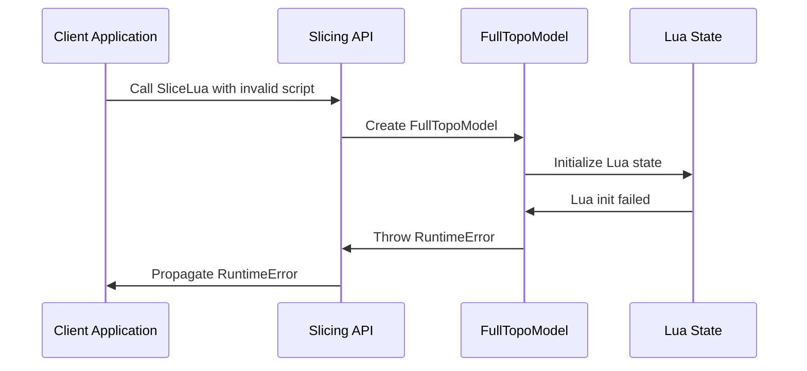

**Diagram sources**
- [FullTopoModel.cpp](file://meshmodel/FullTopoModel.cpp#L437-L485)
- [FullTopoModel.cpp](file://meshmodel/FullTopoModel.cpp#L541-L587)

**Section sources**
- [FullTopoModel.cpp](file://meshmodel/FullTopoModel.cpp#L437-L485)
- [error.hpp](file://base/error.hpp#L12-L37)

## Performance Considerations
When working with the HsBaSlicer API, several performance considerations should be taken into account, particularly when processing large models or performing multiple slicing operations.

### Large Model Processing
For large 3D models, the slicing operations can be resource-intensive. The following recommendations can help optimize performance:

- **Memory Management**: The FullTopoModel constructor creates a complete topological representation of the model, which can consume significant memory for complex geometries.
- **Temporal Locality**: When slicing at multiple heights, consider the order of operations to maximize cache efficiency.
- **Resource Reuse**: The API creates a new FullTopoModel for each slicing operation, which involves topological reconstruction overhead.

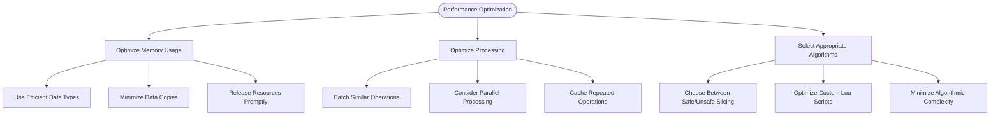

**Diagram sources**
- [mesh_slice.cpp](file://LibHsBaSlicer/Slice/mesh_slice.cpp#L5-L26)
- [FullTopoModel.cpp](file://meshmodel/FullTopoModel.cpp#L19-L143)

**Section sources**
- [FullTopoModel.hpp](file://meshmodel/FullTopoModel.hpp#L63-L65)
- [FullTopoModel.cpp](file://meshmodel/FullTopoModel.cpp#L19-L143)

### Resource Management Recommendations
To ensure efficient resource utilization when using the slicing API:

1. **Object Lifetime Management**: The slicing functions create temporary FullTopoModel instances that are automatically destroyed after the operation completes.
2. **Lua State Management**: Lua states are managed using unique_ptr with custom deleters to ensure proper cleanup.
3. **Memory Allocation**: The integerization constant (1e6) in IntPolygon.hpp affects memory usage and precision trade-offs.

The API uses smart pointers and RAII principles to ensure proper resource cleanup, but clients should still be mindful of the overall resource consumption when performing multiple operations.

## Usage Examples
This section provides practical examples demonstrating typical usage patterns for the HsBaSlicer API.

### Basic Slicing at Specific Layer Heights
The following example demonstrates how to perform basic slicing at a specific layer height:

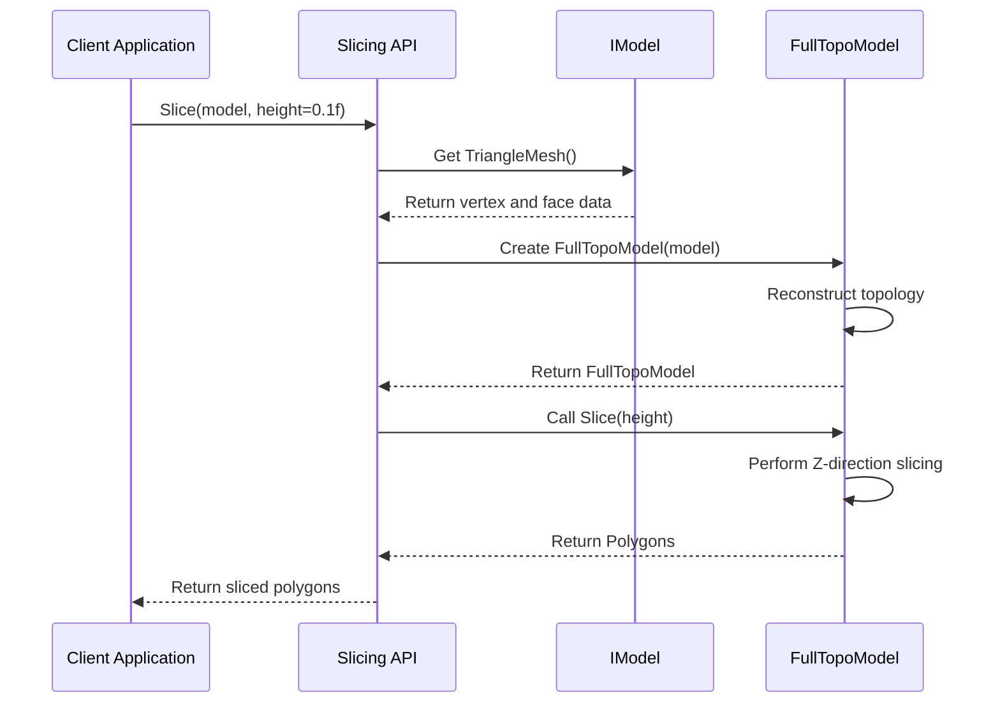

**Diagram sources**
- [mesh_slice.cpp](file://LibHsBaSlicer/Slice/mesh_slice.cpp#L5-L9)
- [FullTopoModel.cpp](file://meshmodel/FullTopoModel.cpp#L256-L342)

**Section sources**
- [mesh_slice.cpp](file://LibHsBaSlicer/Slice/mesh_slice.cpp#L5-L9)
- [FullTopoModel.cpp](file://meshmodel/FullTopoModel.cpp#L256-L342)

### Integrating Lua-Based Path Generation
The following example demonstrates how to use Lua scripting for custom path generation:

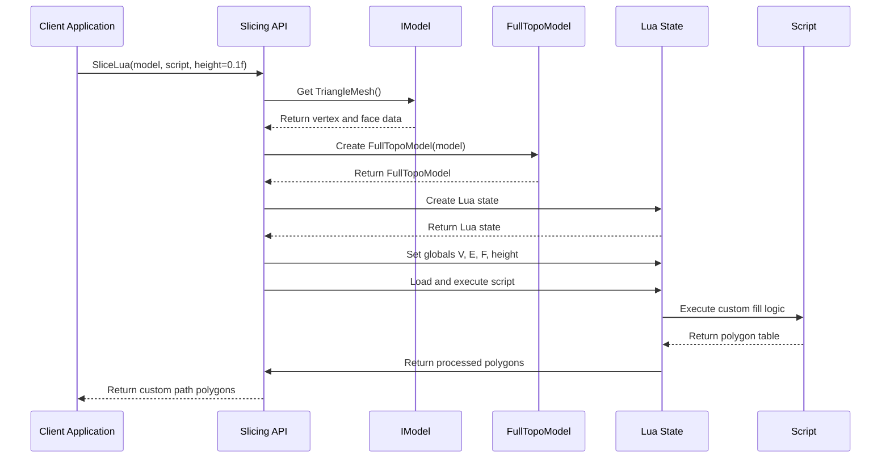

**Diagram sources**
- [mesh_slice.cpp](file://LibHsBaSlicer/Slice/mesh_slice.cpp#L16-L20)
- [FullTopoModel.cpp](file://meshmodel/FullTopoModel.cpp#L434-L535)

**Section sources**
- [mesh_slice.cpp](file://LibHsBaSlicer/Slice/mesh_slice.cpp#L16-L20)
- [FullTopoModel.cpp](file://meshmodel/FullTopoModel.cpp#L434-L535)

### Example Lua Script for Custom Fill Patterns
The following is an example of a Lua script that generates custom fill patterns:

```lua
-- simple custom fill script for tests
-- returns an array of polylines (each polyline is array of {x=.., y=..})

local w = 10000
local margin = 1000

function generate_fill(poly)
    -- Two diagonal polylines across the square
    return {
        { { x = margin, y = margin }, { x = w - margin, y = w - margin } },
        { { x = margin, y = w - margin }, { x = w - margin, y = margin } }
    }
end

return { generate_fill = generate_fill }
```

This script demonstrates how to create a simple cross-hatch fill pattern that could be used for infill operations in additive manufacturing.

**Section sources**
- [custom_fill.lua](file://tests/PolygonFill/custom_fill.lua#L1-L16)

## Underlying Implementation
The core slicing functionality in HsBaSlicer is implemented through the FullTopoModel class, which provides the foundation for all slicing operations.

### FullTopoModel Class Structure
The FullTopoModel class maintains a complete topological representation of the 3D model, including vertices, edges, and faces with their interrelationships.

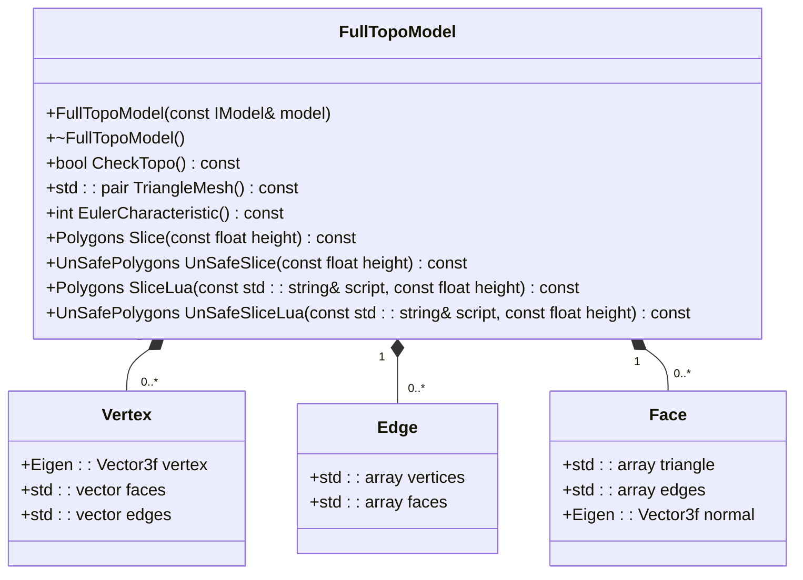

**Diagram sources**
- [FullTopoModel.hpp](file://meshmodel/FullTopoModel.hpp#L42-L115)
- [FullTopoModel.cpp](file://meshmodel/FullTopoModel.cpp#L19-L143)

**Section sources**
- [FullTopoModel.hpp](file://meshmodel/FullTopoModel.hpp#L42-L115)
- [FullTopoModel.cpp](file://meshmodel/FullTopoModel.cpp#L19-L143)

### Slicing Algorithm
The slicing algorithm implemented in FullTopoModel performs Z-direction planar slicing by intersecting the model's faces with a plane at the specified height.

The algorithm follows these steps:
1. For each face, calculate intersections with the slicing plane
2. Collect intersection segments as integerized 2D points
3. Build an adjacency map of connected segments
4. Traverse the adjacency map to form closed loops (for safe slicing) or include open contours (for unsafe slicing)

The algorithm ensures that the resulting polygons are properly formed and handles edge cases such as degenerate intersections and numerical precision issues.

**Section sources**
- [FullTopoModel.cpp](file://meshmodel/FullTopoModel.cpp#L256-L432)