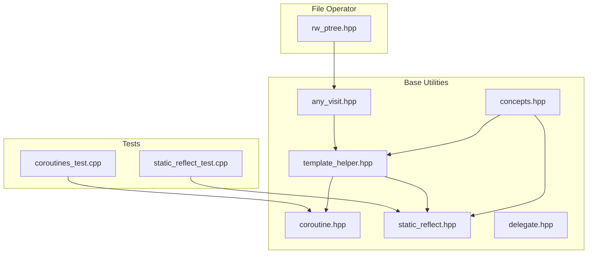
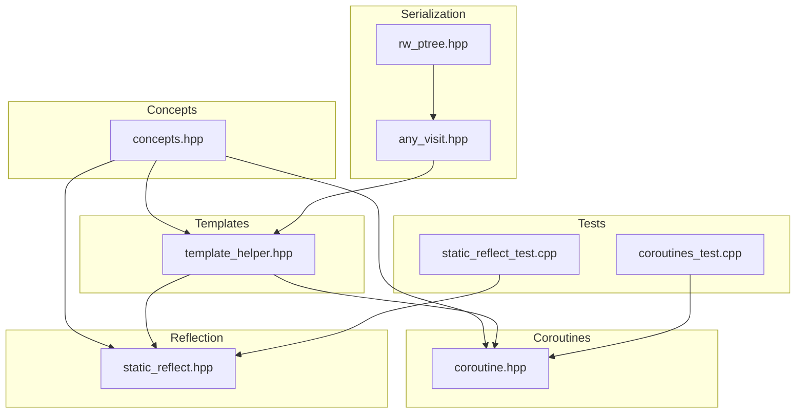
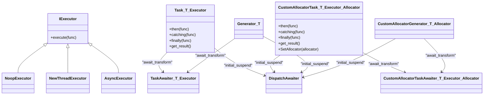
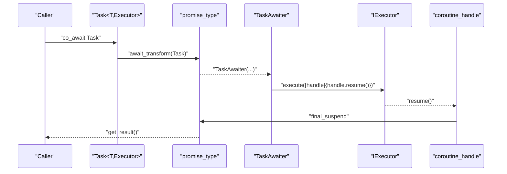
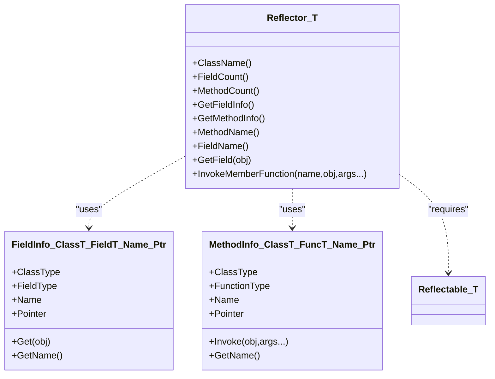
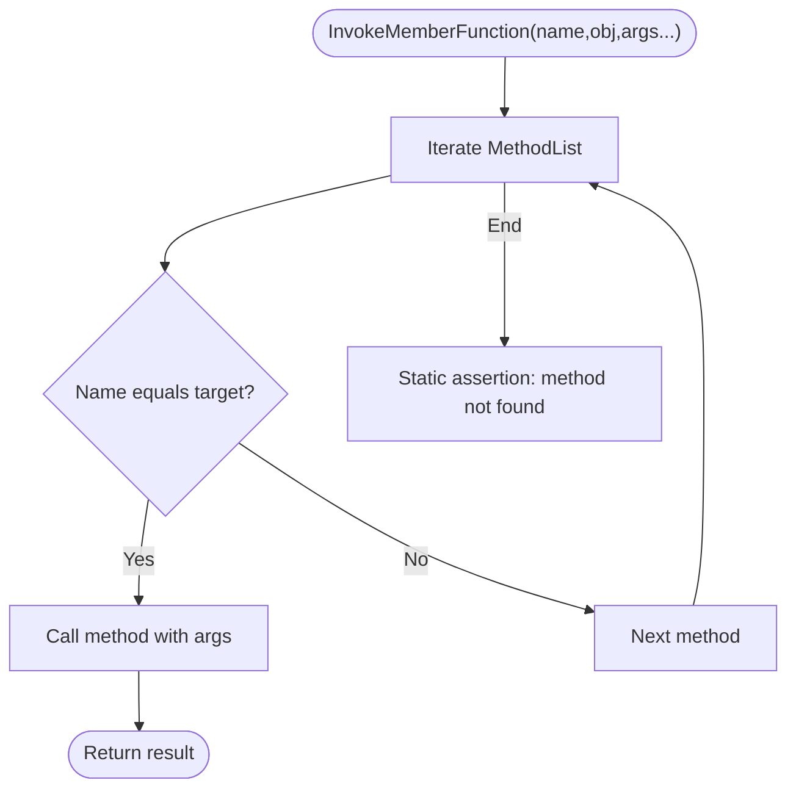
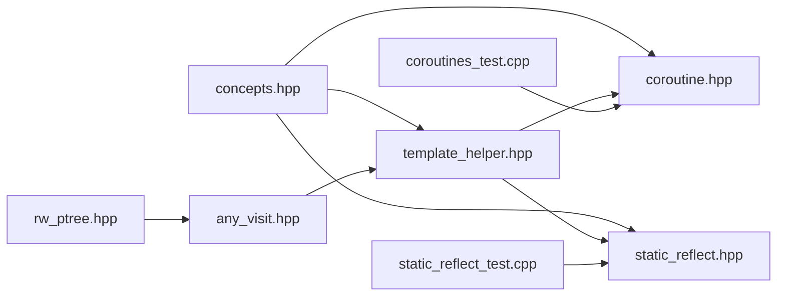

# Advanced Topics

<cite>
**Referenced Files in This Document**
- [coroutine.hpp](file://base/coroutine.hpp)
- [static_reflect.hpp](file://base/static_reflect.hpp)
- [concepts.hpp](file://base/concepts.hpp)
- [template_helper.hpp](file://base/template_helper.hpp)
- [coroutines_test.cpp](file://tests/Coroutines/coroutines_test.cpp)
- [static_reflect_test.cpp](file://tests/Reflect/static_reflect_test.cpp)
- [any_visit.hpp](file://base/any_visit.hpp)
- [rw_ptree.hpp](file://fileoperator/rw_ptree.hpp)
- [delegate.hpp](file://base/delegate.hpp)
</cite>

## Table of Contents
1. [Introduction](#introduction)
2. [Project Structure](#project-structure)
3. [Core Components](#core-components)
4. [Architecture Overview](#architecture-overview)
5. [Detailed Component Analysis](#detailed-component-analysis)
6. [Dependency Analysis](#dependency-analysis)
7. [Performance Considerations](#performance-considerations)
8. [Troubleshooting Guide](#troubleshooting-guide)
9. [Conclusion](#conclusion)
10. [Appendices](#appendices)

## Introduction
This document explains three advanced C++ features used in the project’s core utilities:
- C++20 coroutines for asynchronous operations and streaming data
- Static reflection for compile-time introspection enabling serialization and configuration
- Custom concepts for template constraints and type safety

We provide code-level analysis, diagrams, and practical examples drawn from the repository to show how these features are implemented and how they enhance the library’s capabilities. We also address the learning curve for developers unfamiliar with these techniques and offer best practices for extension and maintenance.

## Project Structure
The advanced topics live primarily under the base/ directory and are exercised by tests in tests/.

**Diagram sources**
- [concepts.hpp](file://base/concepts.hpp#L1-L198)
- [template_helper.hpp](file://base/template_helper.hpp#L1-L491)
- [coroutine.hpp](file://base/coroutine.hpp#L1-L1043)
- [static_reflect.hpp](file://base/static_reflect.hpp#L1-L199)
- [any_visit.hpp](file://base/any_visit.hpp#L1-L123)
- [rw_ptree.hpp](file://fileoperator/rw_ptree.hpp#L45-L194)
- [coroutines_test.cpp](file://tests/Coroutines/coroutines_test.cpp#L1-L123)
- [static_reflect_test.cpp](file://tests/Reflect/static_reflect_test.cpp#L1-L57)

**Section sources**
- [concepts.hpp](file://base/concepts.hpp#L1-L198)
- [template_helper.hpp](file://base/template_helper.hpp#L1-L491)
- [coroutine.hpp](file://base/coroutine.hpp#L1-L1043)
- [static_reflect.hpp](file://base/static_reflect.hpp#L1-L199)
- [any_visit.hpp](file://base/any_visit.hpp#L1-L123)
- [rw_ptree.hpp](file://fileoperator/rw_ptree.hpp#L45-L194)
- [coroutines_test.cpp](file://tests/Coroutines/coroutines_test.cpp#L1-L123)
- [static_reflect_test.cpp](file://tests/Reflect/static_reflect_test.cpp#L1-L57)

## Core Components
- C++20 coroutines: Tasks, Generators, and awaiters with pluggable executors and custom allocators
- Static reflection: Compile-time introspection of class fields and methods via templates and concepts
- Concepts: Strong template constraints for type safety and readable SFINAE

These components are used across the codebase to enable asynchronous workflows, flexible serialization, and robust configuration handling.

**Section sources**
- [coroutine.hpp](file://base/coroutine.hpp#L1-L1043)
- [static_reflect.hpp](file://base/static_reflect.hpp#L1-L199)
- [concepts.hpp](file://base/concepts.hpp#L1-L198)

## Architecture Overview
The advanced features integrate as follows:
- Concepts define reusable constraints used by coroutine and reflection utilities
- Template helpers provide compile-time strings and utilities that power reflection
- Coroutine utilities encapsulate async execution and result propagation
- Reflection enables compile-time metadata extraction for serialization and configuration
- Tests demonstrate usage patterns and correctness

**Diagram sources**
- [concepts.hpp](file://base/concepts.hpp#L1-L198)
- [template_helper.hpp](file://base/template_helper.hpp#L1-L491)
- [coroutine.hpp](file://base/coroutine.hpp#L1-L1043)
- [static_reflect.hpp](file://base/static_reflect.hpp#L1-L199)
- [any_visit.hpp](file://base/any_visit.hpp#L1-L123)
- [rw_ptree.hpp](file://fileoperator/rw_ptree.hpp#L45-L194)
- [coroutines_test.cpp](file://tests/Coroutines/coroutines_test.cpp#L1-L123)
- [static_reflect_test.cpp](file://tests/Reflect/static_reflect_test.cpp#L1-L57)

## Detailed Component Analysis

### C++20 Coroutines in coroutine.hpp
The coroutine module provides:
- Executors: IExecutor and implementations (noop, new thread, async)
- Task<T, Executor>: Promise-based coroutine with awaiter, then/catching/finally chaining, and result propagation
- CustomAllocatorTask<T, Executor, Allocator>: Same as Task but with custom allocation hooks
- Generator<T>: Coroutine-based producer with await-transform to Task/CustomAllocatorTask
- CustomAllocatorGenerator<T, Allocator>: Generator with custom allocator
- DispatchAwaiter: Bridges coroutine suspension to executor scheduling

Key design patterns:
- Promise-based coroutine with initial/final suspend and await_transform to inject Task/CustomAllocatorTask awaiters
- Thread-safe result storage guarded by mutex and condition variable
- Executor abstraction decouples scheduling from coroutine logic
- Custom allocator support via promise operator new/delete and static allocator setter

**Diagram sources**
- [coroutine.hpp](file://base/coroutine.hpp#L1-L1043)

Practical usage examples from tests:
- Generator iteration and exception handling
- Chaining Task<void> and Task<int> with co_await
- Custom allocator variants for tasks and generators

**Section sources**
- [coroutine.hpp](file://base/coroutine.hpp#L1-L1043)
- [coroutines_test.cpp](file://tests/Coroutines/coroutines_test.cpp#L1-L123)

#### Coroutine Execution Flow

**Diagram sources**
- [coroutine.hpp](file://base/coroutine.hpp#L190-L354)

### Static Reflection in static_reflect.hpp
The static reflection system enables compile-time introspection of class members:
- FieldInfo<Class, Type, Name, MemberPtr>: Encapsulates field metadata and accessors
- MethodInfo<Class, Signature, Name, MemberPtr>: Encapsulates method metadata and invocation
- Reflectable concept: Requires class to expose FieldList, MethodList, and ClassName
- Reflector<T>: Provides compile-time accessors for class name, counts, field/method info, and dynamic invocation by name

**Diagram sources**
- [static_reflect.hpp](file://base/static_reflect.hpp#L1-L199)

Usage example from tests:
- Define a class with FieldList, MethodList, and ClassName using TemplateString literals
- Use Reflector to access fields and invoke methods by name

**Section sources**
- [static_reflect.hpp](file://base/static_reflect.hpp#L1-L199)
- [static_reflect_test.cpp](file://tests/Reflect/static_reflect_test.cpp#L1-L57)
- [template_helper.hpp](file://base/template_helper.hpp#L1-L491)

#### Reflection Invocation Flow

**Diagram sources**
- [static_reflect.hpp](file://base/static_reflect.hpp#L169-L194)

### Custom Concepts in concepts.hpp
The concepts module defines reusable constraints for:
- Streamability (char/wchar), translators, enums, pointers, pointer-like types, optionals
- Arithmetic types, unions, equality/hash combinations, strings and string views
- Allocators for T, character types, and arithmetic operators (add, subtract, multiply, divide)

These concepts are used extensively in template constraints for coroutine tasks, generators, and reflection utilities to enforce type safety and simplify SFINAE.

**Section sources**
- [concepts.hpp](file://base/concepts.hpp#L1-L198)

### Supporting Utilities
- TemplateString: Compile-time string with conversions and formatting support; used by reflection and string literals
- any_visit: Type-safe visitor for std::any and boost::any with compile-time return type deduction
- Delegate/Event: Publish-subscribe constructs using concepts for type safety

**Section sources**
- [template_helper.hpp](file://base/template_helper.hpp#L1-L491)
- [any_visit.hpp](file://base/any_visit.hpp#L1-L123)
- [delegate.hpp](file://base/delegate.hpp#L1-L190)

## Dependency Analysis
- Concepts are foundational and consumed by both coroutine and reflection utilities
- TemplateHelper depends on Concepts and is used by both coroutine and reflection
- Reflection depends on TemplateHelper and Concepts
- Serialization utilities depend on any_visit and TemplateHelper
- Tests exercise coroutine and reflection APIs

**Diagram sources**
- [concepts.hpp](file://base/concepts.hpp#L1-L198)
- [template_helper.hpp](file://base/template_helper.hpp#L1-L491)
- [coroutine.hpp](file://base/coroutine.hpp#L1-L1043)
- [static_reflect.hpp](file://base/static_reflect.hpp#L1-L199)
- [any_visit.hpp](file://base/any_visit.hpp#L1-L123)
- [rw_ptree.hpp](file://fileoperator/rw_ptree.hpp#L45-L194)
- [coroutines_test.cpp](file://tests/Coroutines/coroutines_test.cpp#L1-L123)
- [static_reflect_test.cpp](file://tests/Reflect/static_reflect_test.cpp#L1-L57)

**Section sources**
- [concepts.hpp](file://base/concepts.hpp#L1-L198)
- [template_helper.hpp](file://base/template_helper.hpp#L1-L491)
- [coroutine.hpp](file://base/coroutine.hpp#L1-L1043)
- [static_reflect.hpp](file://base/static_reflect.hpp#L1-L199)
- [any_visit.hpp](file://base/any_visit.hpp#L1-L123)
- [rw_ptree.hpp](file://fileoperator/rw_ptree.hpp#L45-L194)
- [coroutines_test.cpp](file://tests/Coroutines/coroutines_test.cpp#L1-L123)
- [static_reflect_test.cpp](file://tests/Reflect/static_reflect_test.cpp#L1-L57)

## Performance Considerations
- Executors: Choose appropriate IExecutor based on workload. AsyncExecutor leverages std::async; NewThreadExecutor detaches threads; NoopExecutor runs synchronously for testing
- Memory: Custom allocator variants for tasks and generators reduce heap fragmentation and enable pool-based allocation strategies
- Synchronization: Promise result storage uses mutex and condition variable; keep critical sections small and avoid blocking in hot paths
- Reflection: Compile-time computations occur during template instantiation; avoid excessive recursion in reflection-heavy code paths

[No sources needed since this section provides general guidance]

## Troubleshooting Guide
Common issues and remedies:
- Null function passed to executors: Throws invalid argument error; ensure non-null callbacks
- Exception propagation in tasks: Exceptions are captured and rethrown on get_result; wrap awaits in try-catch blocks
- Reflection method not found: Static assertion triggers when invoking non-existent method by name; verify MethodList entries
- Generator cancellation: Set cancel handler to observe cleanup; exceptions during iteration stop consumption early
- Serialization type mismatches: Ensure variant/map keys match expected types; use translator-aware getters

**Section sources**
- [coroutine.hpp](file://base/coroutine.hpp#L40-L67)
- [coroutine.hpp](file://base/coroutine.hpp#L218-L247)
- [static_reflect.hpp](file://base/static_reflect.hpp#L175-L194)
- [coroutines_test.cpp](file://tests/Coroutines/coroutines_test.cpp#L51-L77)
- [rw_ptree.hpp](file://fileoperator/rw_ptree.hpp#L45-L100)

## Conclusion
The advanced topics in this codebase demonstrate:
- C++20 coroutines as a powerful abstraction for asynchronous computation and streaming data
- Static reflection enabling compile-time introspection and flexible serialization/configuration
- Custom concepts enforcing template constraints and improving code clarity

Together, these features improve extensibility, type safety, and developer productivity while maintaining performance and readability.

[No sources needed since this section summarizes without analyzing specific files]

## Appendices

### Best Practices for Using These Features in Extensions
- Coroutines
  - Prefer Task<T, Executor> for structured concurrency; chain operations with then/catching/finally
  - Use CustomAllocatorTask/Generator when memory control is critical
  - Implement minimal executors for deterministic testing
- Reflection
  - Define FieldList/MethodList and ClassName consistently; keep names stable across versions
  - Use Reflector for generic traversal; cache counts and indices when iterating frequently
- Concepts
  - Keep constraints precise and focused; group related constraints into composite concepts
  - Use concepts to guide overload resolution and SFINAE-friendly designs

[No sources needed since this section provides general guidance]