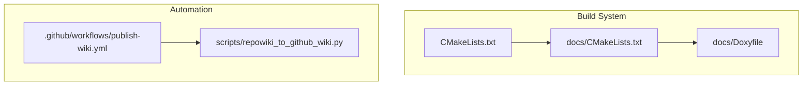
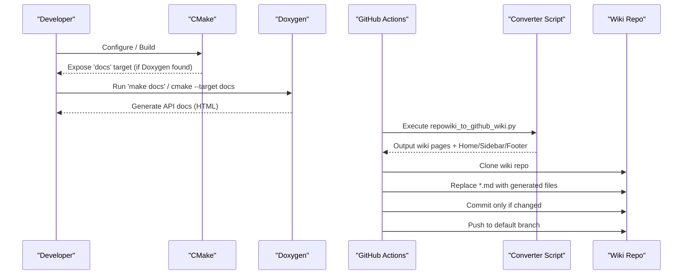
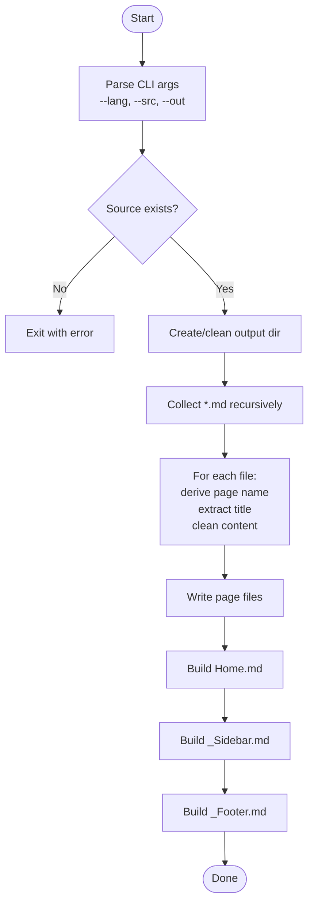
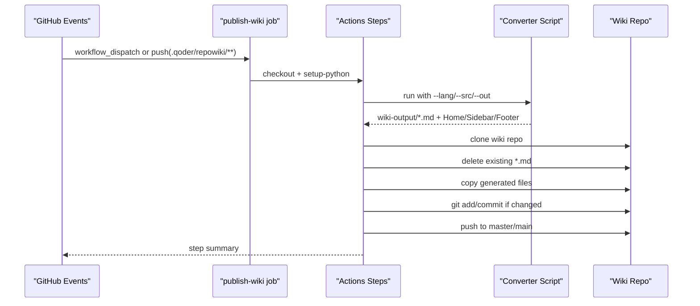
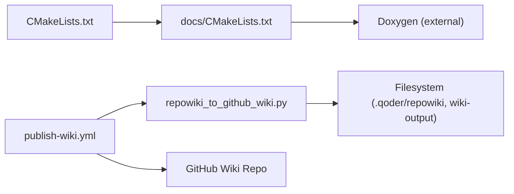

# Automated Documentation Publishing

<cite>
**Referenced Files in This Document**
- [CMakeLists.txt](file://CMakeLists.txt)
- [docs/CMakeLists.txt](file://docs/CMakeLists.txt)
- [docs/Doxyfile](file://docs/Doxyfile)
- [scripts/repowiki_to_github_wiki.py](file://scripts/repowiki_to_github_wiki.py)
- [.github/workflows/publish-wiki.yml](file:.github/workflows/publish-wiki.yml)
</cite>

## Table of Contents
1. [Introduction](#introduction)
2. [Project Structure](#project-structure)
3. [Core Components](#core-components)
4. [Architecture Overview](#architecture-overview)
5. [Detailed Component Analysis](#detailed-component-analysis)
6. [Dependency Analysis](#dependency-analysis)
7. [Performance Considerations](#performance-considerations)
8. [Troubleshooting Guide](#troubleshooting-guide)
9. [Conclusion](#conclusion)

## Introduction
This document explains the automated documentation publishing system for HsBaSlicer. It covers two complementary pipelines:
- API documentation generation via Doxygen, integrated into CMake and optionally built during development or CI.
- Wiki publication from repowiki content to GitHub Wiki using a Python converter and a GitHub Actions workflow.

The goal is to keep API docs and project wiki synchronized with code changes and authoring updates, with minimal manual effort.

## Project Structure
The documentation automation spans build configuration, generator scripts, and CI workflows:
- CMake integration for Doxygen target discovery and optional building.
- A Doxygen configuration file that defines input sources, output format, and processing options.
- A Python script that transforms repowiki markdown into GitHub Wiki pages, including navigation and sidebar generation.
- A GitHub Actions workflow that triggers on pushes or manual dispatch, runs the converter, clones the wiki repository, and publishes updated pages.

**Diagram sources**
- [CMakeLists.txt](file://CMakeLists.txt)
- [docs/CMakeLists.txt](file://docs/CMakeLists.txt)
- [docs/Doxyfile](file://docs/Doxyfile)
- [scripts/repowiki_to_github_wiki.py](file://scripts/repowiki_to_github_wiki.py)
- [.github/workflows/publish-wiki.yml](file:.github/workflows/publish-wiki.yml)

**Section sources**
- [CMakeLists.txt](file://CMakeLists.txt)
- [docs/CMakeLists.txt](file://docs/CMakeLists.txt)
- [docs/Doxyfile](file://docs/Doxyfile)
- [scripts/repowiki_to_github_wiki.py](file://scripts/repowiki_to_github_wiki.py)
- [.github/workflows/publish-wiki.yml](file:.github/workflows/publish-wiki.yml)

## Core Components
- Doxygen integration (CMake + Doxyfile): Provides an opt-in docs target to generate HTML/API documentation from annotated source headers and Markdown.
- Repowiki-to-Wiki converter (Python): Reads structured repowiki content, cleans metadata, flattens page names, and generates Home/Sidebar/Footer files suitable for GitHub Wiki.
- GitHub Actions workflow: Orchestrates conversion and publishing to the repository’s wiki, with support for language selection and branch targeting.

Key responsibilities:
- Build-time discovery and execution of Doxygen when available.
- Deterministic page naming and navigation structure for the wiki.
- Safe, idempotent publish steps that avoid unnecessary commits.

**Section sources**
- [docs/CMakeLists.txt](file://docs/CMakeLists.txt)
- [docs/Doxyfile](file://docs/Doxyfile)
- [scripts/repowiki_to_github_wiki.py](file://scripts/repowiki_to_github_wiki.py)
- [.github/workflows/publish-wiki.yml](file:.github/workflows/publish-wiki.yml)

## Architecture Overview
The system has two parallel flows:

- API Docs Flow (local/CI):
  - CMake detects Doxygen and exposes a docs target.
  - Running the target invokes Doxygen with the provided Doxyfile to produce HTML documentation.

- Wiki Publish Flow (GitHub Actions):
  - On push to main/master (when repowiki changes) or manual dispatch, the workflow runs the Python converter.
  - The converter outputs cleaned Markdown pages plus Home/Sidebar/Footer.
  - The workflow clones the wiki repo, replaces existing pages, commits only if there are changes, and pushes to the default branch.

**Diagram sources**
- [docs/CMakeLists.txt](file://docs/CMakeLists.txt)
- [docs/Doxyfile](file://docs/Doxyfile)
- [scripts/repowiki_to_github_wiki.py](file://scripts/repowiki_to_github_wiki.py)
- [.github/workflows/publish-wiki.yml](file:.github/workflows/publish-wiki.yml)

## Detailed Component Analysis

### Doxygen Integration (CMake + Doxyfile)
- CMake conditionally finds Doxygen and creates a custom target named docs that executes Doxygen with the provided Doxyfile.
- The top-level CMake also controls whether docs are enabled based on Doxygen availability.
- Doxyfile configures project metadata, inputs, outputs, and processing behavior for API documentation.

Operational notes:
- If Doxygen is not installed, the docs target is disabled and a warning is emitted.
- The docs target can be invoked explicitly after configuring the project.

**Section sources**
- [docs/CMakeLists.txt](file://docs/CMakeLists.txt)
- [CMakeLists.txt](file://CMakeLists.txt)
- [docs/Doxyfile](file://docs/Doxyfile)

### Repowiki-to-Wiki Converter (Python)
Responsibilities:
- Recursively collect Markdown files under a language-specific content directory.
- Convert nested paths into flat, wiki-friendly page names by sanitizing characters and joining segments with hyphens.
- Clean repowiki-specific markup and references to produce clean wiki pages.
- Build a category-aware sidebar and a Home index with cross-language links.
- Write Home, Sidebar, Footer, and all pages to an output directory.

Algorithm overview:
- Page name derivation: flatten path segments, remove .md extension, sanitize special characters, join with hyphens.
- Content cleaning: strip citation blocks, section/diagram sources, convert file:// links to plain text, normalize blank lines.
- Sidebar construction: detect category indices by repeated folder-file patterns or prefix relationships; group pages accordingly; render sorted lists with links.
- Home page generation: list all pages with titles extracted from first H1 headings; include language switch link.

**Diagram sources**
- [scripts/repowiki_to_github_wiki.py](file://scripts/repowiki_to_github_wiki.py)

**Section sources**
- [scripts/repowiki_to_github_wiki.py](file://scripts/repowiki_to_github_wiki.py)

### GitHub Actions Workflow (Publish Wiki)
Triggers:
- Manual dispatch with a language choice (en, zh, both).
- Automatic push to main/master when repowiki content changes.

Workflow steps:
- Checkout repository and set up Python.
- Run the converter script with selected language(s) and source/output directories.
- Clone the wiki repository using a token-scoped URL.
- Sync content by deleting existing wiki pages and copying generated files.
- Commit only if there are changes and push to the default branch (master or main).
- Produce a summary of published files.

**Diagram sources**
- [.github/workflows/publish-wiki.yml](file:.github/workflows/publish-wiki.yml)
- [scripts/repowiki_to_github_wiki.py](file://scripts/repowiki_to_github_wiki.py)

**Section sources**
- [.github/workflows/publish-wiki.yml](file:.github/workflows/publish-wiki.yml)

## Dependency Analysis
- CMake depends on Doxygen being present to enable the docs target.
- The workflow depends on:
  - Python runtime.
  - The converter script.
  - Access to the wiki repository via GITHUB_TOKEN.
- The converter script depends on standard library modules and pathlib for filesystem operations.

**Diagram sources**
- [CMakeLists.txt](file://CMakeLists.txt)
- [docs/CMakeLists.txt](file://docs/CMakeLists.txt)
- [scripts/repowiki_to_github_wiki.py](file://scripts/repowiki_to_github_wiki.py)
- [.github/workflows/publish-wiki.yml](file:.github/workflows/publish-wiki.yml)

**Section sources**
- [CMakeLists.txt](file://CMakeLists.txt)
- [docs/CMakeLists.txt](file://docs/CMakeLists.txt)
- [scripts/repowiki_to_github_wiki.py](file://scripts/repowiki_to_github_wiki.py)
- [.github/workflows/publish-wiki.yml](file:.github/workflows/publish-wiki.yml)

## Performance Considerations
- Doxygen:
  - Parallel processing can be tuned via NUM_PROC_THREADS in Doxyfile for large codebases.
  - Avoid excessive subdirectory creation unless necessary to mitigate filesystem overhead.
- Wiki publishing:
  - Use shallow clone (--depth 1) to reduce network and disk usage.
  - Skip commit when no changes are detected to minimize CI time and history churn.
  - Limit language scope via --lang to speed up processing when only one language is updated.

[No sources needed since this section provides general guidance]

## Troubleshooting Guide
Common issues and resolutions:
- Doxygen not found:
  - Symptom: docs target is disabled with a warning.
  - Resolution: Install Doxygen and ensure it is discoverable by CMake.
- Wiki repository not initialized:
  - Symptom: workflow fails to clone the wiki repo.
  - Resolution: Initialize the wiki manually at least once before enabling automation.
- Permissions errors pushing to wiki:
  - Symptom: push rejected due to insufficient permissions.
  - Resolution: Ensure GITHUB_TOKEN has write access to the wiki (default for public repos).
- Source directory missing:
  - Symptom: converter exits with an error indicating missing source directory.
  - Resolution: Verify .qoder/repowiki layout and correct --src argument.

**Section sources**
- [docs/CMakeLists.txt](file://docs/CMakeLists.txt)
- [.github/workflows/publish-wiki.yml](file:.github/workflows/publish-wiki.yml)
- [scripts/repowiki_to_github_wiki.py](file://scripts/repowiki_to_github_wiki.py)

## Conclusion
HsBaSlicer’s documentation automation combines a robust Doxygen-based API docs pipeline with a flexible repowiki-to-Wiki publishing workflow. The design emphasizes:
- Opt-in Doxygen integration through CMake.
- Deterministic, clean wiki page generation with navigation aids.
- Safe, incremental publishing to GitHub Wiki with clear failure modes and summaries.

Adopting these practices ensures consistent, maintainable documentation across code evolution and multi-language authoring.