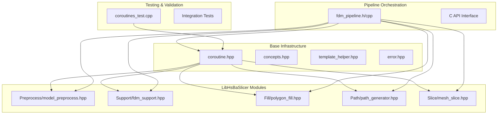
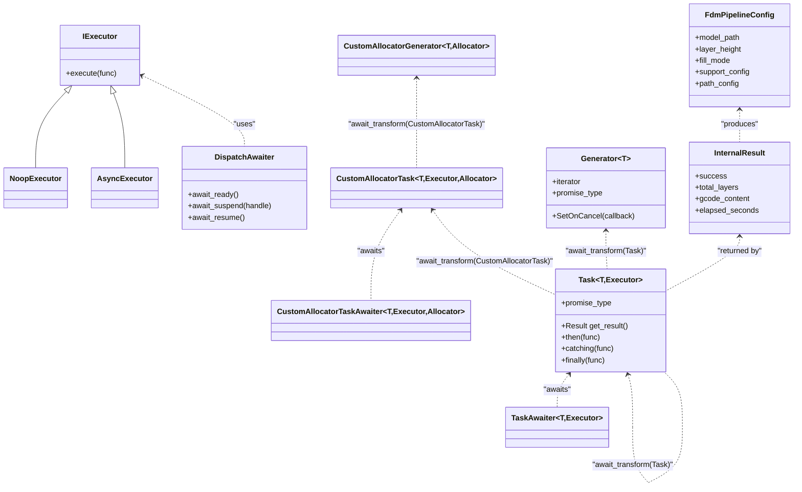
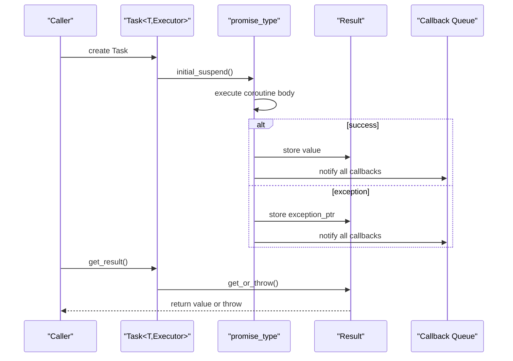
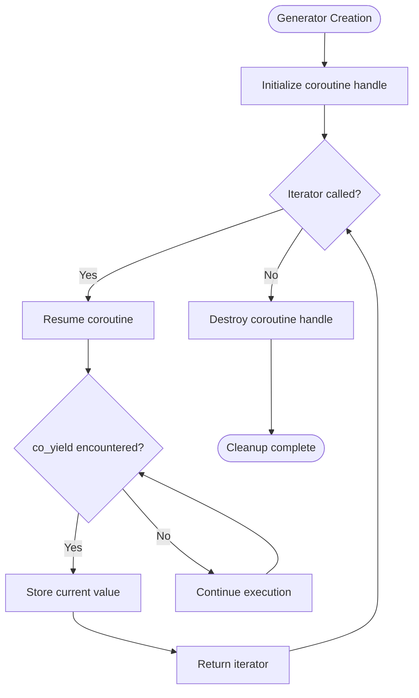

# C++20 Coroutines

<cite>
**Referenced Files in This Document**
- [coroutine.hpp](file://base/coroutine.hpp)
- [concepts.hpp](file://base/concepts.hpp)
- [template_helper.hpp](file://base/template_helper.hpp)
- [error.hpp](file://base/error.hpp)
- [coroutines_test.cpp](file://tests/Coroutines/coroutines_test.cpp)
- [fdm_pipeline.h](file://DllHsBaSlicer/fdm_pipeline.h)
- [fdm_pipeline.cpp](file://DllHsBaSlicer/fdm_pipeline.cpp)
- [model_preprocess.hpp](file://LibHsBaSlicer/Preprocess/model_preprocess.hpp)
- [fdm_support.hpp](file://LibHsBaSlicer/Support/fdm_support.hpp)
- [polygon_fill.hpp](file://LibHsBaSlicer/Fill/polygon_fill.hpp)
- [path_generator.hpp](file://LibHsBaSlicer/Path/path_generator.hpp)
</cite>

## Update Summary
**Changes Made**
- Enhanced Task<T> implementation with improved Result class and callback mechanisms
- Added CustomAllocatorTask<T, Executor, Allocator> for memory-managed coroutines
- Improved Generator<T> with cancellation support and custom allocator variants
- Enhanced AsyncExecutor with std::async integration
- Added comprehensive FDM pipeline implementation using coroutines
- Integrated new LibHsBaSlicer modules (Preprocess, Support, Fill, Path) into coroutine framework
- Updated error handling with better exception propagation and cleanup mechanisms

## Table of Contents
1. [Introduction](#introduction)
2. [Project Structure](#project-structure)
3. [Core Components](#core-components)
4. [Architecture Overview](#architecture-overview)
5. [Detailed Component Analysis](#detailed-component-analysis)
6. [FDM Pipeline Integration](#fdm-pipeline-integration)
7. [Custom Allocator Support](#custom-allocator-support)
8. [Error Handling and Cancellation](#error-handling-and-cancellation)
9. [Performance Considerations](#performance-considerations)
10. [Troubleshooting Guide](#troubleshooting-guide)
11. [Conclusion](#conclusion)
12. [Appendices](#appendices)

## Introduction
This document explains the enhanced C++20 Coroutines implementation in the HsBaSlicer framework, focusing on the improved coroutine utilities in base/coroutine.hpp. The system provides cooperative multitasking without threads, enabling efficient asynchronous operations for long-running tasks such as model slicing, file operations, and complex FDM processing pipelines. The enhanced infrastructure includes improved Task<T> implementations, custom allocator support, better error handling, and comprehensive integration with the FDM slicing workflow.

The coroutine framework enables developers to write asynchronous code that appears synchronous while providing the performance benefits of non-blocking execution. It integrates seamlessly with existing Boost-based components and provides a robust foundation for building scalable 3D printing software.

## Project Structure
The enhanced coroutine utilities reside in the base module and are consumed by various components throughout the HsBaSlicer framework. The key architectural components include:

- **Base Coroutine Infrastructure**: Core Task, Generator, and executor implementations
- **LibHsBaSlicer Modules**: Preprocessing, support generation, filling, and path generation interfaces
- **DllHsBaSlicer Pipeline**: Complete FDM workflow orchestration using coroutines
- **Test Suite**: Comprehensive validation of coroutine functionality



**Diagram sources**
- [coroutine.hpp:1-120](file://base/coroutine.hpp#L1-L120)
- [fdm_pipeline.h:1-147](file://DllHsBaSlicer/fdm_pipeline.h#L1-L147)
- [model_preprocess.hpp:1-88](file://LibHsBaSlicer/Preprocess/model_preprocess.hpp#L1-L88)
- [fdm_support.hpp:1-36](file://LibHsBaSlicer/Support/fdm_support.hpp#L1-L36)
- [polygon_fill.hpp:1-36](file://LibHsBaSlicer/Fill/polygon_fill.hpp#L1-L36)
- [path_generator.hpp:1-62](file://LibHsBaSlicer/Path/path_generator.hpp#L1-L62)

**Section sources**
- [coroutine.hpp:1-120](file://base/coroutine.hpp#L1-L120)
- [fdm_pipeline.h:1-147](file://DllHsBaSlicer/fdm_pipeline.h#L1-L147)

## Core Components
The enhanced coroutine infrastructure provides several key components that work together to enable efficient asynchronous programming:

### Executors and Scheduling
- **IExecutor**: Abstract interface defining how continuations resume execution
- **NoopExecutor**: Executes immediately on current thread (no scheduling overhead)
- **AsyncExecutor**: Uses std::async for asynchronous execution
- **DispatchAwaiter**: Manages suspension/resumption at executor boundaries

### Task Management
- **Task<T, Executor>**: Enhanced task wrapper with improved Result class and callback mechanisms
- **TaskAwaiter<T, Executor>**: Enables co_await syntax for task completion
- **CustomAllocatorTask<T, Executor, Allocator>**: Memory-managed variant with custom allocators
- **CustomAllocatorTaskAwaiter<T, Executor, Allocator>**: Awaiter for custom allocator tasks

### Generators and Streaming
- **Generator<T>**: Coroutine generator with co_yield/co_return semantics and cancellation support
- **CustomAllocatorGenerator<T, Allocator>**: Memory-managed generator variant
- **GeneratorInvoke**: Helper function to transform containers into generator pipelines

These components collectively enable cooperative multitasking, reduce memory overhead through custom allocators, and provide robust error handling and cancellation mechanisms.

**Section sources**
- [coroutine.hpp:42-193](file://base/coroutine.hpp#L42-L193)
- [coroutine.hpp:200-377](file://base/coroutine.hpp#L200-L377)
- [coroutine.hpp:558-767](file://base/coroutine.hpp#L558-L767)
- [coroutine.hpp:779-888](file://base/coroutine.hpp#L779-L888)

## Architecture Overview
The enhanced coroutine architecture centers around a promise-driven design with sophisticated awaitable patterns and flexible scheduling mechanisms. The system supports both synchronous and asynchronous execution models while maintaining consistent APIs across different use cases.



**Diagram sources**
- [coroutine.hpp:42-193](file://base/coroutine.hpp#L42-L193)
- [coroutine.hpp:200-377](file://base/coroutine.hpp#L200-L377)
- [coroutine.hpp:558-767](file://base/coroutine.hpp#L558-L767)
- [coroutine.hpp:779-888](file://base/coroutine.hpp#L779-L888)
- [fdm_pipeline.h:35-84](file://DllHsBaSlicer/fdm_pipeline.h#L35-L84)
- [fdm_pipeline.cpp:24-31](file://DllHsBaSlicer/fdm_pipeline.cpp#L24-L31)

## Detailed Component Analysis

### Enhanced Task<T, Executor> Implementation
The Task class has been significantly improved with better result management and callback mechanisms:

- **Result Class**: Encapsulates both successful values and exceptions with `get_or_throw()` method
- **Improved Callback System**: `on_completed` registers callbacks that execute when results are ready
- **Enhanced Exception Handling**: Better propagation and cleanup of exceptions across coroutine boundaries
- **Memory Management**: Automatic cleanup of coroutine frames through RAII principles



**Diagram sources**
- [coroutine.hpp:200-377](file://base/coroutine.hpp#L200-L377)
- [coroutine.hpp:229-311](file://base/coroutine.hpp#L229-L311)

**Section sources**
- [coroutine.hpp:200-377](file://base/coroutine.hpp#L200-L377)
- [coroutine.hpp:229-311](file://base/coroutine.hpp#L229-L311)

### Improved AsyncExecutor and Scheduling
The AsyncExecutor now uses std::async for more reliable asynchronous execution:

- **std::async Integration**: Leverages standard library async facilities
- **Better Resource Management**: Proper handling of futures and thread lifecycle
- **Consistent Behavior**: More predictable execution across different platforms

### Enhanced Generator<T> with Cancellation Support
Generators now support cancellation hooks and improved error handling:

- **Cancellation Hooks**: `SetOnCancel` allows registration of cleanup callbacks
- **Exception Propagation**: Better handling of exceptions during iteration
- **Memory Safety**: Automatic cleanup of generator state on destruction



**Diagram sources**
- [coroutine.hpp:779-888](file://base/coroutine.hpp#L779-L888)

**Section sources**
- [coroutine.hpp:779-888](file://base/coroutine.hpp#L779-L888)

## FDM Pipeline Integration
The enhanced coroutine infrastructure powers the complete FDM (Fused Deposition Modeling) pipeline implementation in DllHsBaSlicer. This represents a major advancement in the framework's ability to handle complex 3D printing workflows efficiently.

### Pipeline Architecture
The FDM pipeline orchestrates multiple stages using coroutines for optimal performance:

1. **Model Preprocessing**: Load and transform 3D models
2. **Slicing**: Convert 3D geometry to 2D layers
3. **Support Generation**: Create support structures for overhangs
4. **Infill Generation**: Fill layer geometries with print paths
5. **Path Generation**: Convert to G-code instructions

### Asynchronous Execution Model
The pipeline uses `Utils::Task<InternalResult>` to manage the entire workflow asynchronously:

```cpp
// Core pipeline function using coroutines
Utils::Task<InternalResult> RunPipelineAsync(InternalConfig cfg)
{
    // Stage 1: Model preprocessing
    auto model = LoadModel(cfg.model_name, cfg.model_path);
    
    // Stage 2: Slicing with progress reporting
    for (int i = 0; i < total_layers; ++i) {
        layer_outlines[i] = UnSafeSlice(*model, z);
        ReportProgress(cfg, progress, "Slicing layer");
    }
    
    // Stage 3: Support generation
    if (cfg.enable_support) {
        layer_supports = GenerateAllFdmSupport(layer_outlines, cfg.support_config);
    }
    
    // Stage 4: Infill generation
    for (int i = 0; i < total_layers; ++i) {
        layer_fills[i] = FillWithBorder(int_polys, spacing, border_count, mode, angle);
    }
    
    // Stage 5: Path generation
    auto gcode_path = GenerateGCodePath(layer_path_data, cfg.path_config);
    
    co_return result;
}
```

### C API Integration
The pipeline exposes both synchronous and asynchronous interfaces through C-compatible APIs:

- **Synchronous**: `HsBaRunFdmPipeline` - blocks until completion
- **Asynchronous**: `HsBaRunFdmPipelineAsync` - returns immediately with callback
- **Progress Reporting**: Real-time progress updates via callback functions
- **Memory Management**: Automatic cleanup through RAII patterns

**Section sources**
- [fdm_pipeline.cpp:182-292](file://DllHsBaSlicer/fdm_pipeline.cpp#L182-L292)
- [fdm_pipeline.h:111-130](file://DllHsBaSlicer/fdm_pipeline.h#L111-L130)

## Custom Allocator Support
The enhanced coroutine infrastructure provides comprehensive custom allocator support through `CustomAllocatorTask` and `CustomAllocatorGenerator`:

### TAllocator Concept
The `TAllocator<T, Allocator>` concept ensures allocators meet specific requirements:

```cpp
template <typename T, typename Allocator>
concept TAllocator = requires(Allocator alloc, std::size_t n, T* p)
{
    {alloc.allocate(n)}->std::same_as<T*>;
    {alloc.deallocate(p, n)};
    requires std::is_constructible_v<Allocator>;
    requires std::is_destructible_v<Allocator>;
};
```

### NoStateAllocator Optimization
The `NoStateAllocator` concept enables optimizations for allocators without state:

```cpp
template <typename Allocator>
concept NoStateAllocator = std::is_empty_v<Allocator> && requires
{
    typename std::allocator_traits<Allocator>::is_always_equal;
    requires std::allocator_traits<Allocator>::is_always_equal::value;
};
```

### Usage Patterns
Custom allocators enable fine-grained memory control for long-running coroutines:

- **Pool Allocators**: Reuse memory blocks for frequently allocated types
- **Stack Allocators**: Allocate small objects on stack-like storage
- **Custom Heap Managers**: Integrate with application-specific memory pools

**Section sources**
- [concepts.hpp:201-218](file://base/concepts.hpp#L201-L218)
- [coroutine.hpp:118-174](file://base/coroutine.hpp#L118-L174)
- [coroutine.hpp:558-767](file://base/coroutine.hpp#L558-L767)

## Error Handling and Cancellation
The enhanced coroutine infrastructure provides robust error handling and cancellation mechanisms:

### Exception Propagation
Exceptions are captured and propagated through the coroutine chain:

- **Automatic Capture**: `unhandled_exception()` captures exceptions in promise_type
- **Result Storage**: Exceptions stored alongside successful results in Result class
- **Re-throw Mechanism**: `get_or_throw()` rethrows exceptions when accessing results
- **Callback Integration**: `catching()` method provides structured exception handling

### Cancellation Support
Generators support cancellation through callback mechanisms:

- **Global Cancellation Handler**: `SetOnCancel()` registers global cancellation callbacks
- **Per-Instance Control**: Each generator maintains its own cancellation state
- **Resource Cleanup**: Cancellation triggers proper resource cleanup

### Error Recovery Patterns
The FDM pipeline demonstrates comprehensive error recovery:

```cpp
try {
    // Pipeline execution
    auto result = RunPipelineAsync(config).get_result();
    if (!result.success) {
        // Handle pipeline failure
        LogError(result.error_message);
    }
} catch (const std::exception& e) {
    // Handle unexpected exceptions
    LogError(std::string("Pipeline error: ") + e.what());
}
```

**Section sources**
- [coroutine.hpp:237-243](file://base/coroutine.hpp#L237-L243)
- [coroutine.hpp:817-822](file://base/coroutine.hpp#L817-L822)
- [coroutine.hpp:935-940](file://base/coroutine.hpp#L935-L940)
- [fdm_pipeline.cpp:282-286](file://DllHsBaSlicer/fdm_pipeline.cpp#L282-L286)

## Performance Considerations
The enhanced coroutine infrastructure provides several performance optimizations:

### Cooperative Multitasking Benefits
- **Reduced Context Switching**: Avoids OS thread overhead for I/O-bound operations
- **Memory Efficiency**: Smaller memory footprint compared to thread-based approaches
- **Scalability**: Can handle thousands of concurrent coroutines efficiently

### Executor Selection Strategy
- **NoopExecutor**: For CPU-bound tasks where threading adds overhead
- **AsyncExecutor**: For I/O-bound operations requiring background execution
- **Custom Executors**: Application-specific scheduling strategies

### Memory Management Optimizations
- **Custom Allocators**: Reduce heap fragmentation for long-running coroutines
- **RAII Patterns**: Automatic cleanup prevents memory leaks
- **Move Semantics**: Minimize copying of large data structures

## Troubleshooting Guide
Common issues and solutions when working with the enhanced coroutine infrastructure:

### Lifetime Management Issues
- **Problem**: Coroutine frame destroyed before completion
- **Solution**: Ensure Task/Generator objects remain alive until completion
- **Best Practice**: Use smart pointers or RAII wrappers for automatic lifetime management

### Stack Overflow Risks
- **Problem**: Deep recursion in coroutines consuming excessive stack space
- **Solution**: Use CustomAllocatorTask with bounded allocators
- **Mitigation**: Break large computations into smaller chunks

### Exception Handling Pitfalls
- **Problem**: Exceptions not properly propagated across coroutine boundaries
- **Solution**: Always call `get_result()` or use `catching()` callback
- **Debugging**: Enable detailed logging in unhandled_exception handlers

### Memory Leak Detection
- **Problem**: Custom allocators not properly releasing memory
- **Solution**: Implement proper destructor logic in custom allocators
- **Tools**: Use memory profilers to detect allocation/deallocation mismatches

### Performance Bottlenecks
- **Problem**: Excessive executor switching causing overhead
- **Solution**: Choose appropriate executor type for workload characteristics
- **Optimization**: Batch operations to minimize context switches

**Section sources**
- [coroutine.hpp:369-373](file://base/coroutine.hpp#L369-L373)
- [coroutine.hpp:759-763](file://base/coroutine.hpp#L759-L763)
- [coroutine.hpp:832-836](file://base/coroutine.hpp#L832-L836)
- [coroutines_test.cpp:181-242](file://tests/Coroutines/coroutines_test.cpp#L181-L242)

## Conclusion
The enhanced C++20 Coroutines implementation in HsBaSlicer provides a robust, high-performance foundation for asynchronous programming in 3D printing applications. The improved Task<T> and Generator<T> implementations, combined with custom allocator support and comprehensive error handling, enable developers to build scalable and maintainable asynchronous workflows.

The integration with the FDM pipeline demonstrates the practical benefits of this approach, showing how coroutines can efficiently orchestrate complex multi-stage processing workflows while maintaining clean, readable code structure. The framework's compatibility with existing Boost-based components ensures smooth migration paths for legacy code while providing modern C++20 features for new development.

By following the best practices outlined in this document, developers can leverage the full power of C++20 coroutines to create responsive, efficient, and maintainable 3D printing software that scales effectively to handle increasingly complex workflows.

## Appendices

### Practical Usage Patterns

#### Model Slicing Workflows
Break complex slicing operations into manageable coroutine steps:

```cpp
// Example: Progressive slicing with progress reporting
auto sliceModel = []() -> Utils::Task<std::vector<PolygonsD>> {
    auto model = LoadModel("model", "path/to/file.stl");
    int totalLayers = CalculateLayerCount(model);
    
    std::vector<PolygonsD> layers(totalLayers);
    for (int i = 0; i < totalLayers; ++i) {
        layers[i] = SliceLayer(model, i);
        ReportProgress(i * 100 / totalLayers, "Slicing...");
    }
    
    co_return layers;
}();
```

#### File Processing Pipelines
Use generators for streaming file operations:

```cpp
// Example: Process files in batches using generators
auto processFiles = []() -> Utils::Generator<FileResult> {
    for (const auto& file : GetFileList()) {
        try {
            auto result = ProcessFile(file);
            co_yield result;
        } catch (const std::exception& e) {
            co_yield FileResult{file, false, e.what()};
        }
    }
}();
```

#### Memory-Constrained Environments
Leverage custom allocators for embedded systems:

```cpp
// Example: Pool allocator for memory-constrained environments
using PoolAllocator = MyPoolAllocator<MyType>;
Utils::CustomAllocatorTask<MyType, Utils::AsyncExecutor, PoolAllocator> 
    task = []() -> Utils::CustomAllocatorTask<MyType> {
    // Large allocations use pool allocator
    auto buffer = std::make_unique<MyType[]>(largeSize);
    co_return std::move(buffer);
}();
```

[No sources needed since this section provides general guidance based on analyzed code patterns]