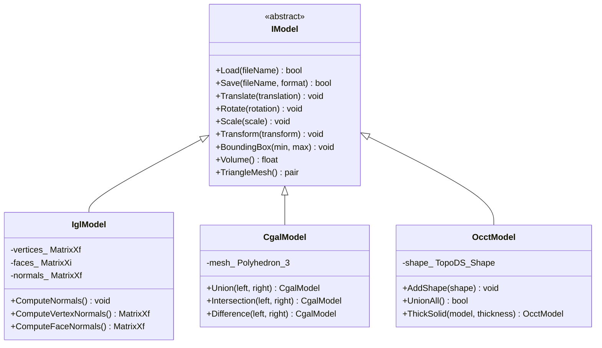
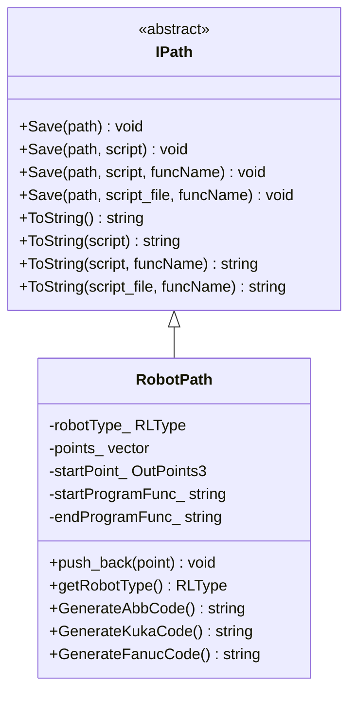
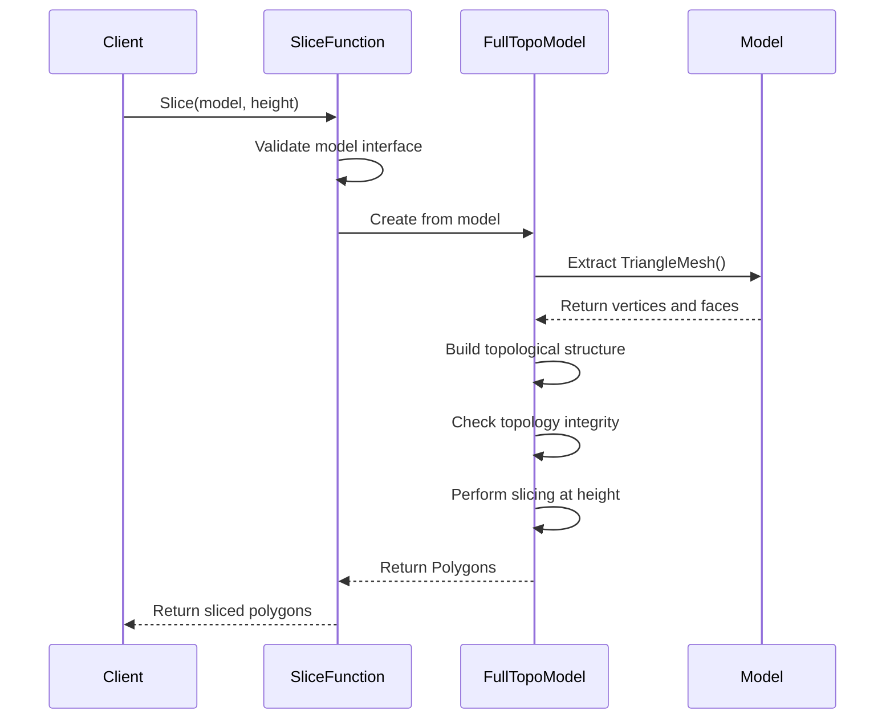
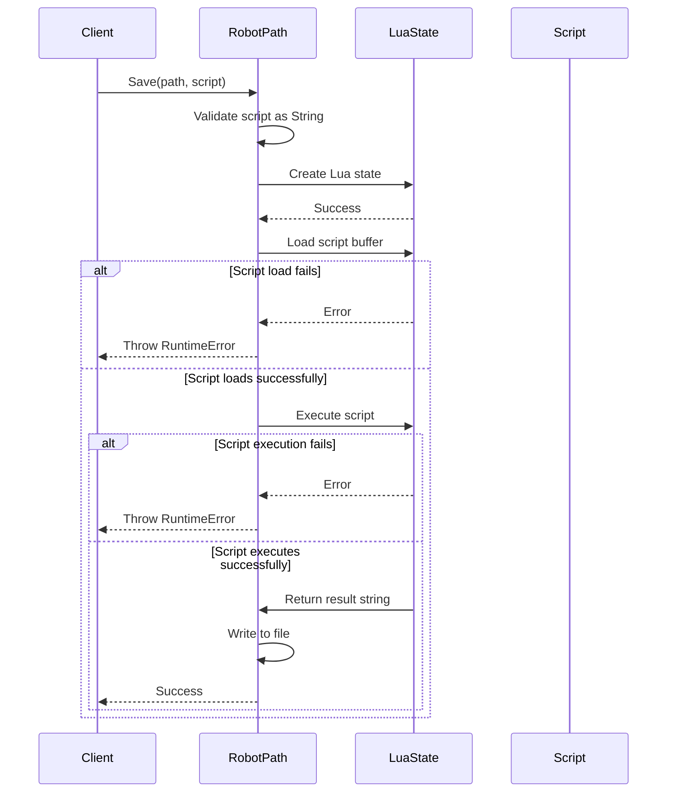

# Custom Concepts and Type Constraints

<cite>
**Referenced Files in This Document**   
- [concepts.hpp](file://base/concepts.hpp)
- [IModel.hpp](file://base/IModel.hpp)
- [IPath.hpp](file://paths/IPath.hpp)
- [mesh_slice.cpp](file://LibHsBaSlicer/Slice/mesh_slice.cpp)
- [robotpath.cpp](file://paths/robotpath.cpp)
- [FullTopoModel.hpp](file://meshmodel/FullTopoModel.hpp)
- [IglModel.hpp](file://meshmodel/IglModel.hpp)
- [CgalModel.hpp](file://meshmodel/CgalModel.hpp)
- [OcctModel.hpp](file://cadmodel/OcctModel.hpp)
</cite>

## Table of Contents
1. [Introduction](#introduction)
2. [Core Concepts Overview](#core-concepts-overview)
3. [ModelType Concept and IModel Interface Validation](#modeltype-concept-and-imodel-interface-validation)
4. [PathGenerator Concept and IPath Interface Validation](#pathgenerator-concept-and-ipath-interface-validation)
5. [PolygonContainer Concept and Geometry Kernel Support](#polygoncontainer-concept-and-geometry-kernel-support)
6. [Concept Implementation in Mesh Slicing](#concept-implementation-in-mesh-slicing)
7. [Concept Usage in Robot Path Generation](#concept-usage-in-robot-path-generation)
8. [Syntax and Semantics of Key Concepts](#syntax-and-semantics-of-key-concepts)
9. [Benefits of Concept-Based Design](#benefits-of-concept-based-design)
10. [Extending the Framework with New Concepts](#extending-the-framework-with-new-concepts)
11. [Troubleshooting Common Constraint Violations](#troubleshooting-common-constraint-violations)

## Introduction
The HsBaSlicer framework employs C++20 concepts to enforce compile-time requirements on templates, ensuring type safety and interface correctness across its geometry processing pipeline. These custom concepts, defined in concepts.hpp, serve as contracts that validate template parameters against specific structural and behavioral requirements. By leveraging concepts, the framework achieves robust generic programming patterns that support multiple geometry kernels (IGL, CGAL, OCCT) while preventing incorrect template instantiation. This documentation details the purpose, implementation, and practical usage of key concepts such as ModelType, PathGenerator, and PolygonContainer, demonstrating how they validate interfaces like IModel and IPath at compile time.

## Core Concepts Overview
The concepts defined in concepts.hpp provide a comprehensive type constraint system that enables compile-time validation of template parameters throughout HsBaSlicer. These concepts fall into several categories: fundamental type traits (arithmetic types, pointers, references), container requirements (strings, allocators), and domain-specific interfaces (model types, path generators). The concept system ensures that only types satisfying specific structural and behavioral requirements can be used in templated functions and classes, preventing runtime errors through early compile-time checking. This approach enhances code clarity by making template requirements explicit and improves error messages when constraints are violated.

**Section sources**
- [concepts.hpp](file://base/concepts.hpp#L1-L198)

## ModelType Concept and IModel Interface Validation
The ModelType concept, though not explicitly named in concepts.hpp, is implicitly defined through the requirements placed on model types used throughout the framework. Any type satisfying the IModel interface contract can be used as a model type in templated functions. The IModel abstract base class defines a comprehensive interface for 3D model manipulation, including loading, saving, transformation, and mesh extraction operations. Types such as IglModel, CgalModel, and OcctModel implement this interface, thereby satisfying the implicit ModelType concept. When template functions in the slicing pipeline accept IModel references, they effectively require that any model type must provide the complete set of operations defined in the interface, ensuring consistent behavior across different geometry kernels.

**Diagram sources**
- [IModel.hpp](file://base/IModel.hpp#L14-L37)
- [IglModel.hpp](file://meshmodel/IglModel.hpp#L12-L66)
- [CgalModel.hpp](file://meshmodel/CgalModel.hpp#L20-L82)
- [OcctModel.hpp](file://cadmodel/OcctModel.hpp#L16-L80)

**Section sources**
- [IModel.hpp](file://base/IModel.hpp#L14-L37)
- [IglModel.hpp](file://meshmodel/IglModel.hpp#L12-L66)
- [CgalModel.hpp](file://meshmodel/CgalModel.hpp#L20-L82)
- [OcctModel.hpp](file://cadmodel/OcctModel.hpp#L16-L80)

## PathGenerator Concept and IPath Interface Validation
The PathGenerator concept, like ModelType, is implicitly defined through the IPath interface contract. The IPath abstract base class establishes a standard interface for path generation and output, requiring implementations to provide methods for saving paths in various formats and converting them to string representations. The RobotPath class implements this interface, thereby satisfying the PathGenerator concept. This design ensures that any path generator used in the framework must support the complete set of output operations, including direct file saving, Lua script-based formatting, and function-name-specified script execution. The concept enforces consistency in path generation across different robot types (ABB, KUKA, FANUC) while allowing customization through Lua scripting.

**Diagram sources**
- [IPath.hpp](file://paths/IPath.hpp#L12-L34)
- [robotpath.cpp](file://paths/robotpath.cpp#L39-L451)

**Section sources**
- [IPath.hpp](file://paths/IPath.hpp#L12-L34)
- [robotpath.cpp](file://paths/robotpath.cpp#L39-L451)

## PolygonContainer Concept and Geometry Kernel Support
The PolygonContainer concept is supported through the framework's use of standard containers and the Polygons/UnSafePolygons types defined in the 2D module. These container types must satisfy requirements for storing and manipulating polygon data used in the slicing process. The concept ensures that polygon containers provide appropriate iterators, size operations, and element access methods required by the slicing algorithms. By using standard container interfaces, the framework maintains compatibility across different geometry kernels while allowing kernel-specific optimizations. The concept also supports the distinction between safe and unsafe polygon containers, where UnSafePolygons may include non-closed contours suitable for specific manufacturing processes like wire feeding.

**Section sources**
- [FloatPolygons.hpp](file://2D/FloatPolygons.hpp)
- [IntPolygon.hpp](file://2D/IntPolygon.hpp)

## Concept Implementation in Mesh Slicing
The mesh slicing functionality in mesh_slice.cpp demonstrates the practical application of concepts in the HsBaSlicer framework. The Slice and UnSafeSlice functions accept const IModel& parameters, effectively requiring that any model type must satisfy the implicit ModelType concept by implementing the complete IModel interface. This ensures that regardless of whether the model is represented using IGL, CGAL, or OCCT kernels, it provides the necessary TriangleMesh() method for slicing operations. The FullTopoModel class, used internally in these functions, further validates model topology before slicing, providing an additional layer of correctness checking. The concept-based design allows these slicing functions to work uniformly across different model types without template specialization.

**Diagram sources**
- [mesh_slice.cpp](file://LibHsBaSlicer/Slice/mesh_slice.cpp#L5-L27)
- [FullTopoModel.hpp](file://meshmodel/FullTopoModel.hpp#L63-L83)
- [FullTopoModel.cpp](file://meshmodel/FullTopoModel.cpp#L432-L470)

**Section sources**
- [mesh_slice.cpp](file://LibHsBaSlicer/Slice/mesh_slice.cpp#L5-L27)
- [mesh_slice.hpp](file://LibHsBaSlicer/Slice/mesh_slice.hpp#L11-L18)

## Concept Usage in Robot Path Generation
The robot path generation system in robotpath.cpp illustrates how concepts ensure interface correctness in path output operations. The RobotPath class implements the IPath interface, thereby satisfying the PathGenerator concept. This ensures that the class provides all required Save and ToString methods with consistent signatures. The concept enforcement prevents incorrect implementations that might omit essential functionality. The Lua scripting integration further demonstrates concept-based design, as the ToString methods validate that script parameters meet string-like requirements through the String concept (StdString or CStyleString). This ensures that only valid string types can be used for script-based path generation, preventing common errors like passing incompatible string types.

**Diagram sources**
- [robotpath.cpp](file://paths/robotpath.cpp#L54-L183)
- [concepts.hpp](file://base/concepts.hpp#L150-L151)

**Section sources**
- [robotpath.cpp](file://paths/robotpath.cpp#L54-L183)

## Syntax and Semantics of Key Concepts
The concepts defined in concepts.hpp use C++20's requires expression syntax to specify constraints on template parameters. Each concept defines a set of operations that must be supported by any type satisfying the concept. For example, the CharStream concept requires that a type supports both output (<<) and input (>>) stream operations with std::ostream and std::istream. The StrTranslator concept requires that a type can be converted to and from strings using a translator object. The StandardArithmetic concept uses type traits to constrain types to built-in arithmetic types. These concepts can be combined using logical operators to create more complex requirements, such as EqualAndStdHash which requires both equality comparison and hashability. The syntax makes template requirements explicit and improves error messages by identifying which specific requirement was not met.

**Section sources**
- [concepts.hpp](file://base/concepts.hpp#L15-L198)

## Benefits of Concept-Based Design
The concept-based design in HsBaSlicer provides several significant benefits. First, it improves code clarity by making template requirements explicit in the function signature rather than buried in documentation or SFINAE constraints. Second, it reduces compilation errors by catching constraint violations at the point of template instantiation rather than deep within template code. Third, it supports generic programming across different geometry kernels by defining clear interface contracts that each kernel implementation must satisfy. Fourth, it enables better error messages that identify exactly which concept requirement was not met. Finally, it facilitates framework extension by providing clear guidelines for implementing new model or path types that integrate seamlessly with existing functionality.

**Section sources**
- [concepts.hpp](file://base/concepts.hpp#L1-L198)
- [IModel.hpp](file://base/IModel.hpp#L14-L37)
- [IPath.hpp](file://paths/IPath.hpp#L12-L34)

## Extending the Framework with New Concepts
When extending the HsBaSlicer framework with new concepts, developers should follow established patterns from concepts.hpp. New concepts should be defined in the HsBa::Slicer namespace and use descriptive names that clearly indicate their purpose. The requires expression should specify the minimal set of operations needed for the concept, avoiding overly restrictive constraints. For interface-like concepts, abstract base classes should be defined to provide a reference implementation. When creating concepts that combine multiple requirements, logical operators (&&, ||) can be used to compose existing concepts. New concepts should be thoroughly tested with both satisfying and non-satisfying types to ensure they work correctly in template contexts.

**Section sources**
- [concepts.hpp](file://base/concepts.hpp#L1-L198)

## Troubleshooting Common Constraint Violations
Common constraint violations in the HsBaSlicer framework typically occur when implementing new model or path types that don't fully satisfy the required interfaces. For ModelType violations, ensure that all methods from IModel are implemented, particularly the transformation and mesh extraction methods. For PathGenerator violations, verify that all Save and ToString overloads are provided with correct signatures. When encountering StrTranslator violations, confirm that the type can be properly converted to and from strings using the specified translator. For container-related concept violations, check that iterators, size methods, and element access operations are properly implemented. The most effective troubleshooting approach is to examine the specific concept definition in concepts.hpp and verify that the implementing type satisfies all listed requirements.

**Section sources**
- [concepts.hpp](file://base/concepts.hpp#L1-L198)
- [IModel.hpp](file://base/IModel.hpp#L14-L37)
- [IPath.hpp](file://paths/IPath.hpp#L12-L34)