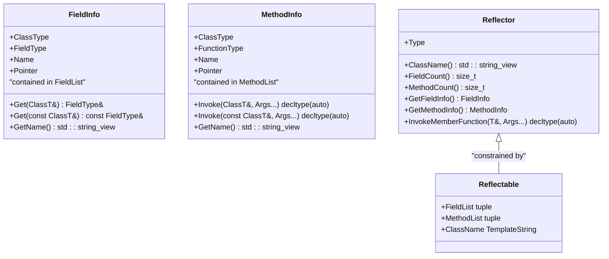
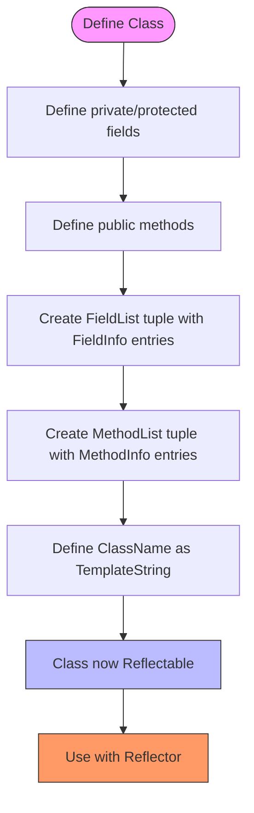
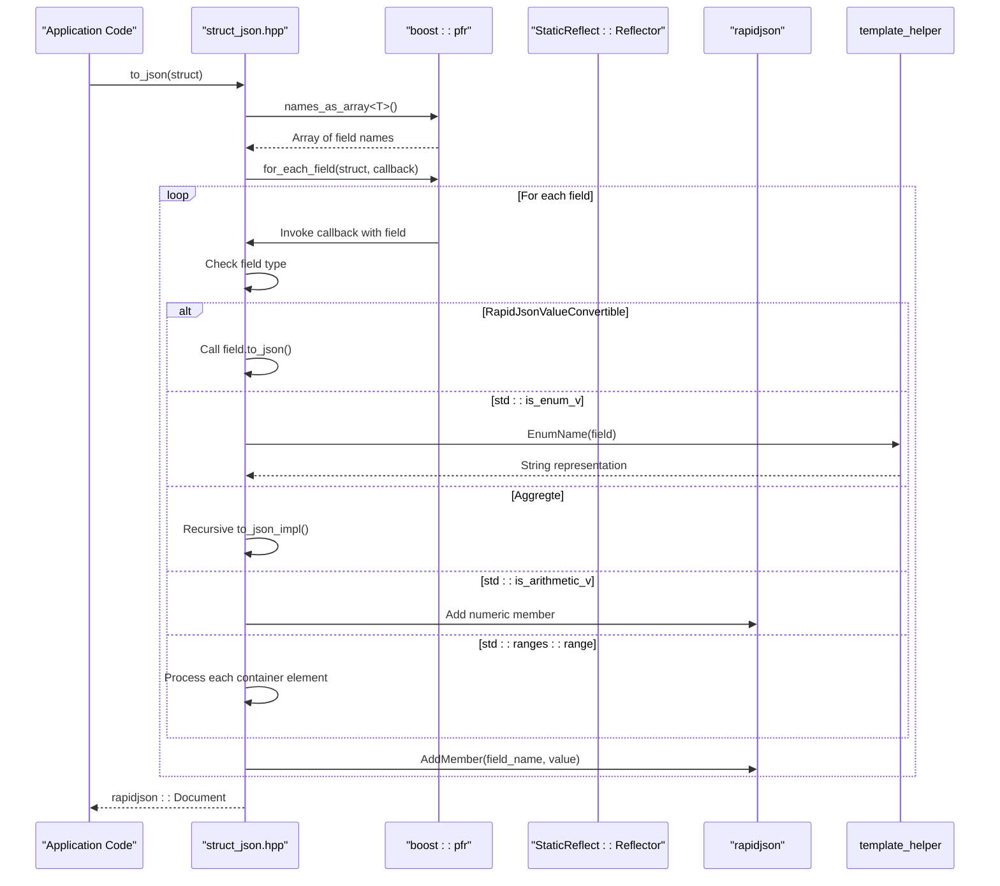
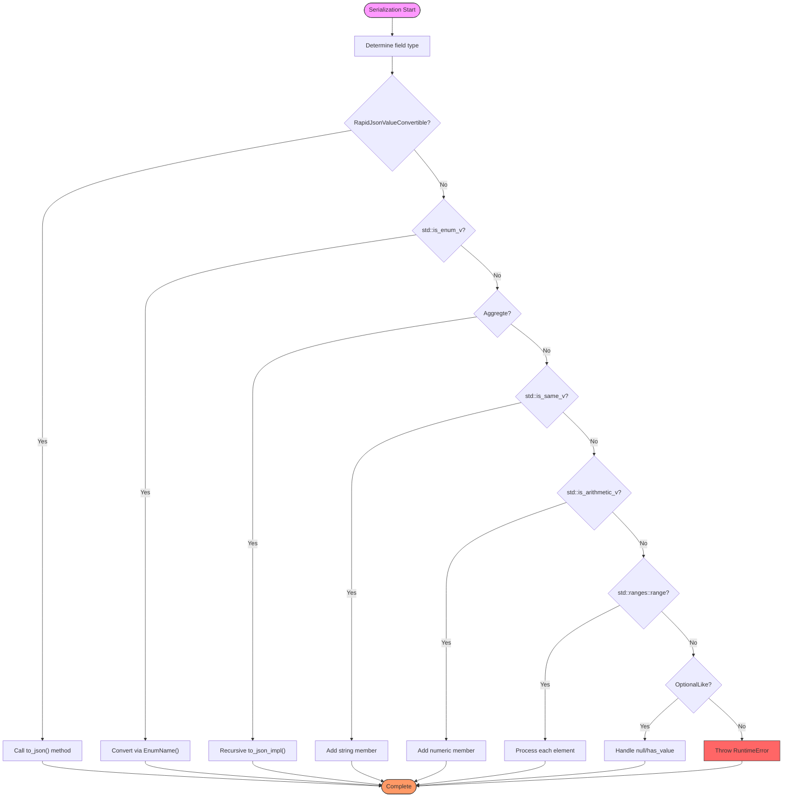

# Static Reflection System

<cite>
**Referenced Files in This Document**   
- [static_reflect.hpp](file://base/static_reflect.hpp)
- [struct_json.hpp](file://utils/struct_json.hpp)
- [template_helper.hpp](file://base/template_helper.hpp)
- [concepts.hpp](file://base/concepts.hpp)
- [slice_config.proto](file://proto/slice_config.proto)
- [base_config.proto](file://proto/base_config.proto)
- [Eigen2Msg.cpp](file://convert/Eigen2Msg.cpp)
- [Msg2Eigen.cpp](file://convert/Msg2Eigen.cpp)
- [static_reflect_test.cpp](file://tests/Reflect/static_reflect_test.cpp)
</cite>

## Table of Contents
1. [Introduction](#introduction)
2. [Core Architecture](#core-architecture)
3. [Macro-Based Registration System](#macro-based-registration-system)
4. [Integration with Configuration and Serialization](#integration-with-configuration-and-serialization)
5. [Type Mapping and Conversion Rules](#type-mapping-and-conversion-rules)
6. [Performance Characteristics](#performance-characteristics)
7. [Debugging and Error Handling](#debugging-and-error-handling)
8. [Extending the System](#extending-the-system)
9. [Limitations and Best Practices](#limitations-and-best-practices)

## Introduction

The Static Reflection System in HsBaSlicer provides compile-time introspection capabilities for C++ structures, enabling automatic conversion between Protobuf messages, JSON, and internal structs without runtime overhead. This system eliminates boilerplate code in configuration handling while enhancing type safety through compile-time validation. The core implementation resides in `static_reflect.hpp`, which leverages modern C++ features including concepts, templates, and constexpr evaluation to provide a robust reflection framework.

The system supports serialization of critical components such as slice configurations and model metadata, facilitating seamless data exchange between different parts of the application. By using a macro-based registration system, developers can expose struct members for reflection with minimal code changes, while the integration with `app_config.hpp` and `struct_json.hpp` enables comprehensive configuration management.

**Section sources**
- [static_reflect.hpp](file://base/static_reflect.hpp#L1-L199)
- [struct_json.hpp](file://utils/struct_json.hpp#L1-L476)

## Core Architecture

The Static Reflection System is built around three core components: `FieldInfo`, `MethodInfo`, and `Reflector`. These components work together to provide compile-time introspection capabilities through template metaprogramming and constexpr evaluation.

**Diagram sources**
- [static_reflect.hpp](file://base/static_reflect.hpp#L26-L198)

The `FieldInfo` template captures information about a class member field, including its type, name (as a compile-time string), and pointer-to-member. Similarly, `MethodInfo` captures method information. The `Reflector` class provides a uniform interface for accessing this reflection data, with methods to retrieve field and method information by index, invoke member functions by name, and query class metadata.

The `Reflectable` concept ensures that only classes explicitly designed for reflection can be used with the system, requiring the presence of `FieldList`, `MethodList`, and `ClassName` members. This design prevents accidental reflection of arbitrary classes while providing compile-time guarantees about the reflection interface.

**Section sources**
- [static_reflect.hpp](file://base/static_reflect.hpp#L26-L198)

## Macro-Based Registration System

The system employs an explicit registration mechanism that requires developers to manually define reflection metadata for each class. This approach trades some convenience for maximum type safety and zero runtime overhead. The registration process involves defining three static members: `FieldList`, `MethodList`, and `ClassName`.

**Diagram sources**
- [static_reflect_test.cpp](file://tests/Reflect/static_reflect_test.cpp#L26-L32)

As demonstrated in the test code, a `Player` class is made reflectable by defining its `FieldList` as a tuple of `FieldInfo` instances, each specifying the class type, field type, field name (using the `_ts` literal operator), and pointer-to-member. The same pattern applies to `MethodList` for member functions. This explicit registration ensures that only intended members are exposed to reflection, preventing accidental exposure of internal implementation details.

The use of `TemplateString` from `template_helper.hpp` enables compile-time string handling, allowing field and method names to be compared and manipulated at compile time. The `_ts` user-defined literal (defined in the `TemplateStringLiterals` namespace) provides a convenient syntax for creating `TemplateString` instances.

**Section sources**
- [static_reflect.hpp](file://base/static_reflect.hpp#L26-L198)
- [static_reflect_test.cpp](file://tests/Reflect/static_reflect_test.cpp#L26-L32)
- [template_helper.hpp](file://base/template_helper.hpp#L441-L448)

## Integration with Configuration and Serialization

The Static Reflection System integrates with `struct_json.hpp` to provide automatic JSON serialization and deserialization capabilities. This integration enables seamless conversion between C++ structs and JSON format, which is essential for configuration management and data persistence.

**Diagram sources**
- [struct_json.hpp](file://utils/struct_json.hpp#L34-L144)

The integration leverages Boost.PFR (Pretty Fast Reflection) to iterate over struct fields without requiring macro-based registration for JSON serialization. However, the Static Reflection system provides additional capabilities such as method invocation and more detailed type information. The `to_json_impl` function in `struct_json.hpp` uses `boost::pfr::for_each_field` to visit each field of an aggregate type, then applies appropriate serialization logic based on the field's type.

For configuration binding, the system works in conjunction with Protobuf definitions in files like `slice_config.proto` and `base_config.proto`. These protocol buffer definitions describe the structure of configuration data, which can then be converted to and from C++ structs using the reflection system.

**Section sources**
- [struct_json.hpp](file://utils/struct_json.hpp#L34-L144)
- [slice_config.proto](file://proto/slice_config.proto#L8-L27)
- [base_config.proto](file://proto/base_config.proto#L5-L42)

## Type Mapping and Conversion Rules

The system implements comprehensive type mapping rules to handle various data types during serialization and deserialization. These rules are implemented through template specialization and constexpr evaluation, ensuring type safety and optimal performance.

**Diagram sources**
- [struct_json.hpp](file://utils/struct_json.hpp#L34-L144)

The type mapping system handles several categories of types:
- **RapidJsonValueConvertible**: Types that implement custom `to_json` and `from_json` methods
- **Enums**: Converted to strings using `EnumName` from `template_helper.hpp`
- **Aggregates**: Structs and classes that are recursively serialized
- **Strings**: Directly added as JSON string members
- **Arithmetic types**: Added as JSON numeric values
- **Ranges**: Containers like vectors and lists, whose elements are processed individually
- **Optional-like types**: Handled with special logic for null values

The conversion utilities in `Eigen2Msg.cpp` and `Msg2Eigen.cpp` demonstrate how the system extends to handle more complex type mappings, particularly for mathematical types like `Eigen::Vector3f` and `Eigen::Transform`. These utilities provide bidirectional conversion between Eigen types and Protobuf messages, enabling seamless integration with the serialization system.

**Section sources**
- [struct_json.hpp](file://utils/struct_json.hpp#L34-L144)
- [Eigen2Msg.cpp](file://convert/Eigen2Msg.cpp#L5-L145)
- [Msg2Eigen.cpp](file://convert/Msg2Eigen.cpp#L7-L115)

## Performance Characteristics

The Static Reflection System is designed for maximum performance with zero runtime overhead for reflection operations. All introspection is performed at compile time, resulting in highly optimized code generation.

The use of `constexpr` and template metaprogramming ensures that:
- Field and method lookups are resolved at compile time
- Type checking occurs during compilation
- Generated code contains no reflection metadata at runtime
- Iteration over fields uses unrolled loops when possible

For serialization operations, the system leverages Boost.PFR's compile-time reflection capabilities, which generate highly optimized code for iterating over struct members. The `for_each_field` function from Boost.PFR is implemented using template recursion and fold expressions, allowing the compiler to fully optimize the iteration pattern.

The integration with RapidJSON provides high-performance JSON parsing and generation, with direct memory allocation and minimal copying. The system avoids dynamic allocation where possible by using stack-allocated buffers and pre-allocated document objects.

**Section sources**
- [static_reflect.hpp](file://base/static_reflect.hpp#L116-L198)
- [struct_json.hpp](file://utils/struct_json.hpp#L34-L144)

## Debugging and Error Handling

When reflection fails due to missing type mappings, the system provides clear error messages through static assertions and runtime exceptions. The compile-time nature of the reflection system means that many errors are caught during compilation rather than at runtime.

Common issues and their debugging approaches include:
- **Missing field registration**: Results in compile-time errors when accessing unregistered fields
- **Incorrect field types**: Causes type mismatch errors during compilation
- **Missing TemplateString literals**: Results in linker errors for undefined `_ts` literals
- **Unsupported types in serialization**: Throws `RuntimeError` with descriptive messages

The test file `static_reflect_test.cpp` provides a comprehensive example of how to verify reflection functionality, using Boost.Test to validate class name, field count, method count, and member access. This testing pattern can be replicated for any reflectable class to ensure proper registration.

**Section sources**
- [static_reflect_test.cpp](file://tests/Reflect/static_reflect_test.cpp#L1-L57)
- [struct_json.hpp](file://utils/struct_json.hpp#L142-L143)

## Extending the System

To extend the Static Reflection System with new types, follow these steps:
1. Ensure the type is an aggregate (no private/protected non-static data members, no user-provided constructors)
2. Include the necessary headers: `static_reflect.hpp`, `template_helper.hpp`
3. Define the `FieldList` tuple with `FieldInfo` entries for each member field
4. Define the `MethodList` tuple with `MethodInfo` entries for each accessible method
5. Define the `ClassName` as a `TemplateString` using the `_ts` literal

For types that require custom JSON serialization, implement the `RapidJsonValueConvertible` concept by providing `to_json` and `from_json` methods. This allows the type to participate in the automatic serialization system while maintaining control over the serialization format.

When working with complex nested structures, ensure that all constituent types are either reflectable or supported by the type mapping rules in `struct_json.hpp`. For container types, verify that the value type is properly handled by the serialization system.

**Section sources**
- [static_reflect.hpp](file://base/static_reflect.hpp#L26-L198)
- [struct_json.hpp](file://utils/struct_json.hpp#L26-L30)

## Limitations and Best Practices

The Static Reflection System has several important limitations that developers should be aware of:
- **Explicit registration required**: All types must be manually registered for reflection
- **No inheritance support**: The system does not automatically handle base class members
- **Compile-time only**: Reflection data is not available at runtime
- **Limited to public access**: Only public fields and methods can be reflected
- **No dynamic modification**: Reflection metadata cannot be changed at runtime

Best practices for using the system include:
- Register only the fields and methods that need to be accessible through reflection
- Use descriptive and consistent field names
- Keep reflection metadata close to the class definition
- Test reflection functionality thoroughly using unit tests
- Document the reflection interface for each class
- Avoid exposing sensitive or implementation-specific members

The requirement for explicit registration, while adding some boilerplate, enhances type safety and makes the reflection interface explicit and auditable. This design choice aligns with the system's goal of providing robust, performant reflection without compromising code safety.

**Section sources**
- [static_reflect.hpp](file://base/static_reflect.hpp#L104-L110)
- [static_reflect_test.cpp](file://tests/Reflect/static_reflect_test.cpp#L26-L32)