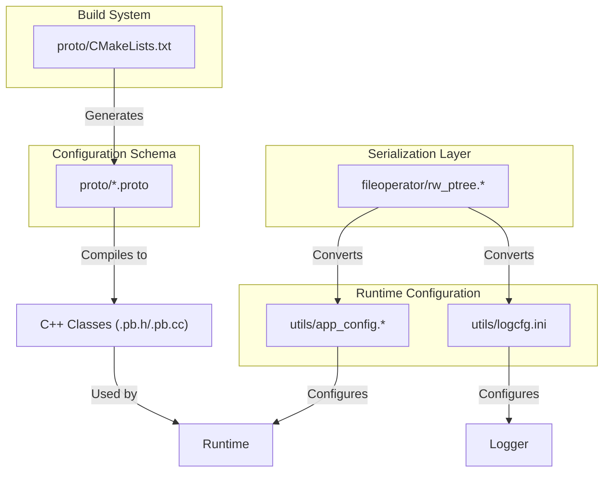
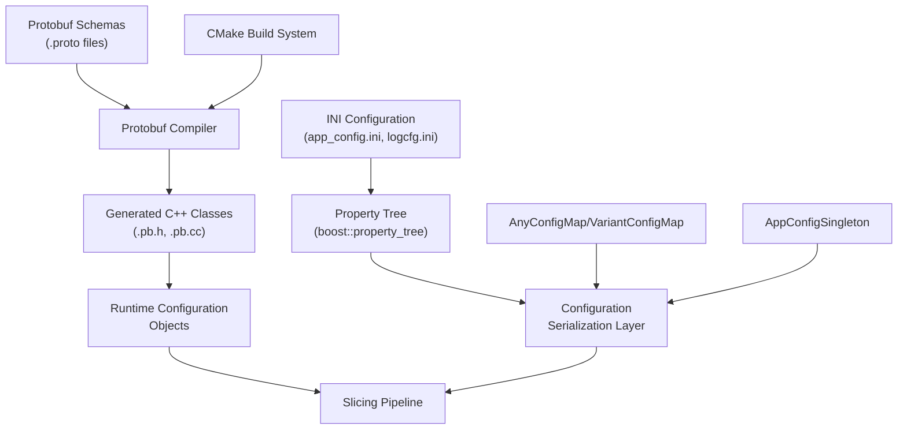
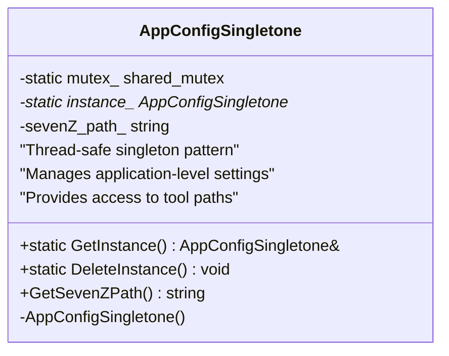
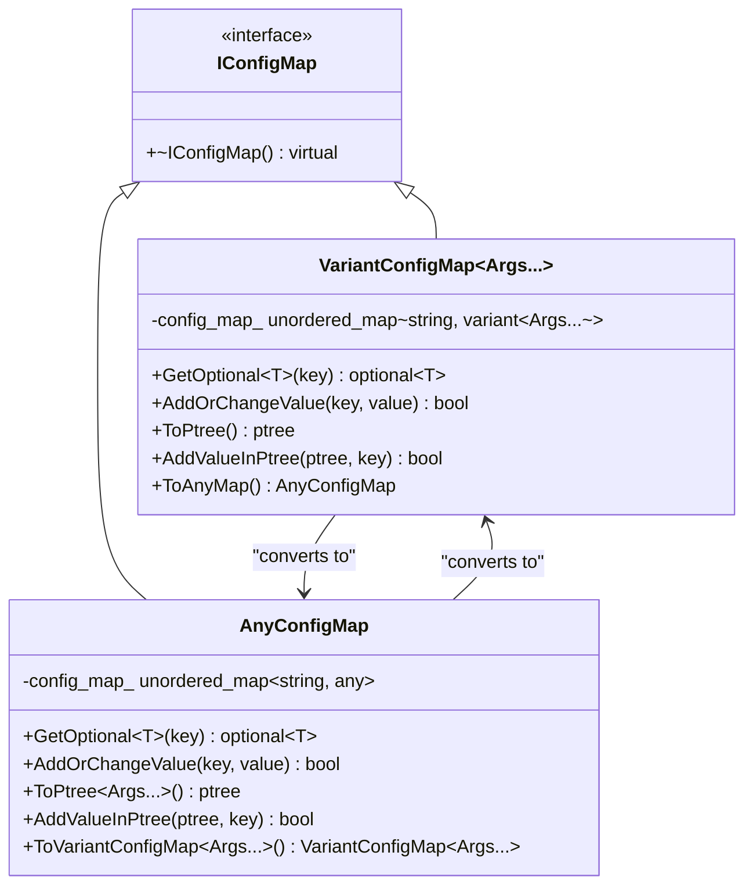
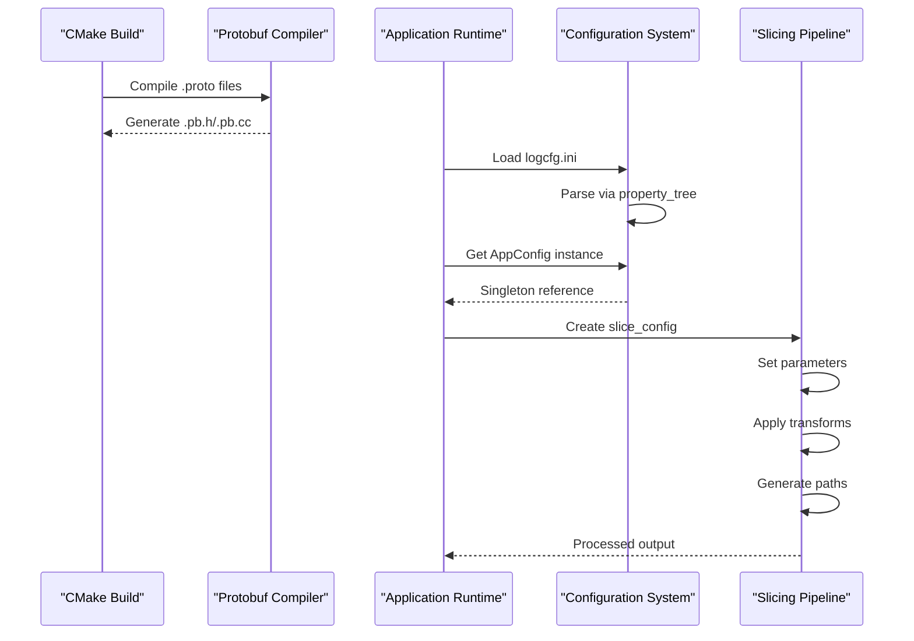
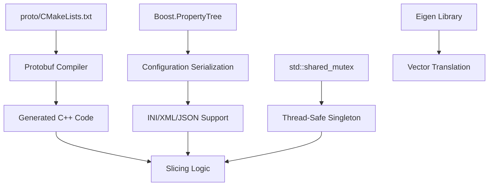

# Configuration System

<cite>
**Referenced Files in This Document**   
- [slice_config.proto](file://proto/slice_config.proto)
- [base_config.proto](file://proto/base_config.proto)
- [transform.proto](file://proto/transform.proto)
- [path.proto](file://proto/path.proto)
- [point.proto](file://proto/point.proto)
- [vector.proto](file://proto/vector.proto)
- [app_config.cpp](file://utils/app_config.cpp)
- [app_config.hpp](file://utils/app_config.hpp)
- [rw_ptree.hpp](file://fileoperator/rw_ptree.hpp)
- [rw_ptree.cpp](file://fileoperator/rw_ptree.cpp)
- [logcfg.ini](file://utils/logcfg.ini)
- [CMakeLists.txt](file://proto/CMakeLists.txt)
</cite>

## Table of Contents
1. [Introduction](#introduction)
2. [Project Structure](#project-structure)
3. [Core Components](#core-components)
4. [Architecture Overview](#architecture-overview)
5. [Detailed Component Analysis](#detailed-component-analysis)
6. [Dependency Analysis](#dependency-analysis)
7. [Performance Considerations](#performance-considerations)
8. [Troubleshooting Guide](#troubleshooting-guide)
9. [Conclusion](#conclusion)

## Introduction
The Configuration System in HsBaSlicer is a dual-layer architecture combining Protocol Buffers (Protobuf) for structured slicing parameters and INI files for application-level settings. This system enables flexible, versionable, and cross-platform configuration management for the 3D slicing pipeline. The Protobuf schemas define precise data contracts for slice parameters, transforms, and paths, while the INI-based application configuration handles runtime environment settings. These systems interoperate through a robust serialization layer using Boost.PropertyTree, allowing seamless conversion between binary Protobuf messages and human-readable configuration formats.

## Project Structure
The configuration system spans multiple directories with clear separation of concerns:
- `proto/`: Contains all `.proto` schema definitions for slicing parameters and data structures
- `utils/`: Houses the singleton-based application configuration (`app_config.*`) and logging configuration
- `fileoperator/`: Implements the property tree serialization system for INI, JSON, and XML formats
- Build system in `proto/CMakeLists.txt` automates Protobuf code generation for multiple languages



**Diagram sources**
- [slice_config.proto](file://proto/slice_config.proto)
- [app_config.cpp](file://utils/app_config.cpp)
- [rw_ptree.hpp](file://fileoperator/rw_ptree.hpp)
- [CMakeLists.txt](file://proto/CMakeLists.txt)

**Section sources**
- [proto](file://proto)
- [utils](file://utils)
- [fileoperator](file://fileoperator)

## Core Components
The configuration system consists of two primary components: the Protobuf-based slicing configuration schema and the INI-based application configuration. The Protobuf schemas define strongly-typed, versionable message structures for slice parameters, transform operations, and geometric primitives, while the application configuration manages runtime environment settings through a singleton pattern. These components are connected by a serialization layer that converts between Protobuf messages and property trees, enabling configuration persistence and format interchange.

**Section sources**
- [slice_config.proto](file://proto/slice_config.proto)
- [app_config.cpp](file://utils/app_config.cpp)
- [rw_ptree.hpp](file://fileoperator/rw_ptree.hpp)

## Architecture Overview
The configuration architecture follows a layered pattern with clear separation between schema definition, code generation, runtime representation, and persistence. Protobuf schemas serve as the source of truth for slicing parameters, which are compiled into C++ classes during the build process. Application settings are managed separately through INI files and a thread-safe singleton. Both configuration types can be serialized to and from property trees, enabling format conversion and configuration merging.



**Diagram sources**
- [slice_config.proto](file://proto/slice_config.proto)
- [app_config.cpp](file://utils/app_config.cpp)
- [rw_ptree.hpp](file://fileoperator/rw_ptree.hpp)
- [CMakeLists.txt](file://proto/CMakeLists.txt)

## Detailed Component Analysis

### Protobuf Schema System
The Protobuf schema system provides a language-neutral, platform-neutral mechanism for serializing structured data. The configuration schemas are defined across multiple `.proto` files that import and extend each other to create a comprehensive data model for slicing operations.

#### Data Model Diagram
```mermaid
erDiagram
msg_slice_config {
int32 type PK
float slice_height
string diff_string
float ring_radius
msg_point3 ring_center FK
msg_vector3 ring_normal FK
string curved_path
}
msg_base_config {
int32 version PK
int32 technology_type
int32 profiles_format
int32 output_type
string output_filename
}
msg_point3 {
float x
float y
float z
}
msg_vector3 {
float x
float y
float z
}
msg_transform3 {
repeated float matrix
}
msg_path3 {
repeated msg_point3 point
}
msg_slice_config ||--o{ msg_point3 : "contains"
msg_slice_config ||--o{ msg_vector3 : "contains"
msg_slice_config }|--|| msg_base_config : "extends"
msg_transform3 }|--|| msg_base_config : "extends"
msg_path3 ||--o{ msg_point3 : "contains"
```

**Diagram sources**
- [slice_config.proto](file://proto/slice_config.proto)
- [base_config.proto](file://proto/base_config.proto)
- [point.proto](file://proto/point.proto)
- [vector.proto](file://proto/vector.proto)
- [path.proto](file://proto/path.proto)
- [transform.proto](file://proto/transform.proto)

**Section sources**
- [slice_config.proto](file://proto/slice_config.proto)
- [base_config.proto](file://proto/base_config.proto)

### Application Configuration System
The application configuration system manages runtime environment settings through a singleton pattern implementation. This system provides thread-safe access to application-level parameters that are independent of the slicing process but essential for runtime operation.

#### Class Diagram


**Diagram sources**
- [app_config.hpp](file://utils/app_config.hpp)
- [app_config.cpp](file://utils/app_config.cpp)

**Section sources**
- [app_config.cpp](file://utils/app_config.cpp)
- [app_config.hpp](file://utils/app_config.hpp)

### Configuration Serialization Layer
The configuration serialization layer provides a unified interface for reading and writing configuration data in multiple formats. Built on Boost.PropertyTree, this system supports INI, XML, and JSON formats, enabling flexible configuration management and migration.

#### Class Hierarchy


**Diagram sources**
- [rw_ptree.hpp](file://fileoperator/rw_ptree.hpp)
- [rw_ptree.cpp](file://fileoperator/rw_ptree.cpp)

**Section sources**
- [rw_ptree.hpp](file://fileoperator/rw_ptree.hpp)
- [rw_ptree.cpp](file://fileoperator/rw_ptree.cpp)

### Configuration Workflow
The configuration workflow illustrates how settings propagate through the system from definition to runtime usage. This process involves schema compilation, configuration loading, and parameter application to the slicing pipeline.

#### Sequence Diagram


**Diagram sources**
- [CMakeLists.txt](file://proto/CMakeLists.txt)
- [slice_config.proto](file://proto/slice_config.proto)
- [app_config.cpp](file://utils/app_config.cpp)

**Section sources**
- [CMakeLists.txt](file://proto/CMakeLists.txt)
- [slice_config.proto](file://proto/slice_config.proto)
- [app_config.cpp](file://utils/app_config.cpp)

## Dependency Analysis
The configuration system has well-defined dependencies that ensure modularity and maintainability. The build system depends on Protobuf tools to generate C++ code from schema definitions. The runtime system depends on Boost libraries for property tree manipulation and threading primitives. These dependencies are managed through the CMake build system, which orchestrates the code generation process.



**Diagram sources**
- [CMakeLists.txt](file://proto/CMakeLists.txt)
- [rw_ptree.hpp](file://fileoperator/rw_ptree.hpp)
- [app_config.cpp](file://utils/app_config.cpp)

**Section sources**
- [CMakeLists.txt](file://proto/CMakeLists.txt)
- [rw_ptree.hpp](file://fileoperator/rw_ptree.hpp)
- [app_config.cpp](file://utils/app_config.cpp)

## Performance Considerations
The configuration system is designed with performance in mind, particularly for the serialization and deserialization of configuration data. The use of Protobuf ensures efficient binary serialization for slicing parameters, while the property tree system provides reasonable performance for text-based configuration files. The singleton pattern eliminates configuration loading overhead during runtime, and the thread-safe implementation ensures safe concurrent access without significant performance penalties.

## Troubleshooting Guide
When troubleshooting configuration issues, consider the following common scenarios:
- Verify that the Protobuf compiler is properly installed and accessible during the build process
- Check that INI file paths are correct and files are readable by the application
- Ensure that property tree keys match expected configuration parameters
- Validate that generated Protobuf code is up-to-date with schema changes
- Confirm that the singleton instance is properly initialized before first use

**Section sources**
- [app_config.cpp](file://utils/app_config.cpp)
- [rw_ptree.cpp](file://fileoperator/rw_ptree.cpp)
- [CMakeLists.txt](file://proto/CMakeLists.txt)

## Conclusion
The Configuration System in HsBaSlicer provides a robust, extensible framework for managing both slicing parameters and application settings. By combining Protobuf schemas with INI-based configuration and a powerful serialization layer, the system achieves a balance of type safety, flexibility, and ease of use. The clear separation between schema definition and runtime implementation, along with comprehensive build automation, makes this system maintainable and adaptable to future requirements. Developers can extend the configuration system by adding new Protobuf messages or INI parameters following the established patterns, ensuring consistency across the codebase.