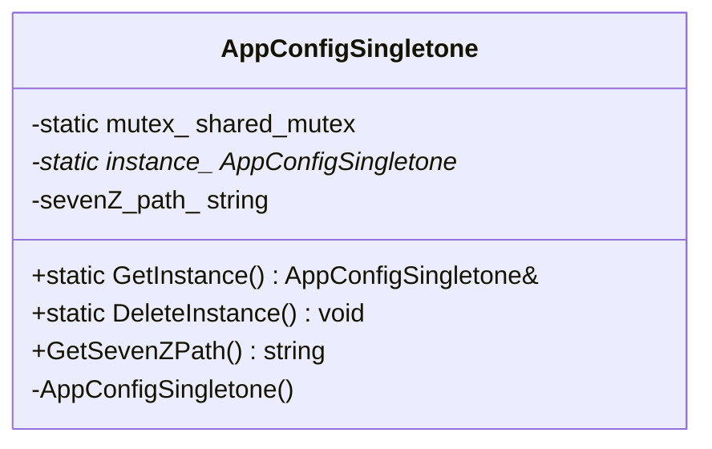
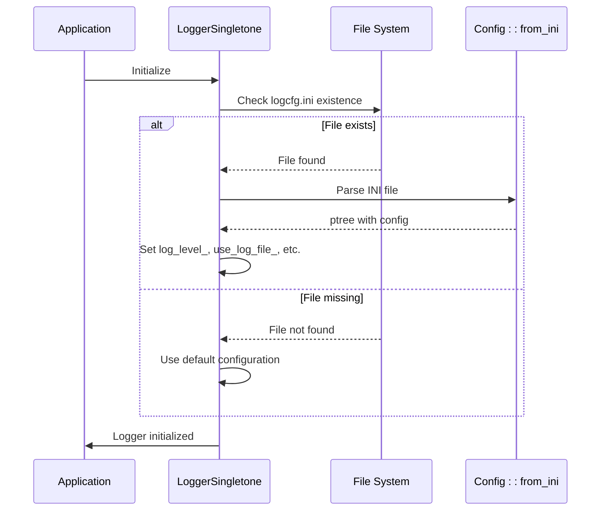
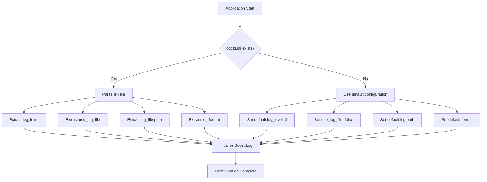

# INI File Configuration

<cite>
**Referenced Files in This Document**   
- [app_config.hpp](file://utils/app_config.hpp)
- [app_config.cpp](file://utils/app_config.cpp)
- [logcfg.ini](file://utils/logcfg.ini)
- [logger.cpp](file://logger/logger.cpp)
- [logger.hpp](file://logger/logger.hpp)
- [rw_ptree.hpp](file://fileoperator/rw_ptree.hpp)
- [rw_ptree.cpp](file://fileoperator/rw_ptree.cpp)
- [singleton.hpp](file://base/singleton.hpp)
</cite>

## Table of Contents
1. [Introduction](#introduction)
2. [AppConfigSingletone: Thread-Safe Configuration Management](#appconfigsingletone-thread-safe-configuration-management)
3. [Configuration Accessors and Thread Safety](#configuration-accessors-and-thread-safety)
4. [logcfg.ini: Structure and Logging System Integration](#logcfgini-structure-and-logging-system-integration)
5. [Common INI Configuration Parameters](#common-ini-configuration-parameters)
6. [Configuration System Initialization Sequence](#configuration-system-initialization-sequence)
7. [Common Configuration Issues and Troubleshooting](#common-configuration-issues-and-troubleshooting)
8. [Best Practices for Configuration Management](#best-practices-for-configuration-management)

## Introduction
The INI-based configuration system in HsBaSlicer provides a flexible and thread-safe mechanism for managing application settings at runtime. This document details the implementation of the AppConfigSingletone class, the structure and purpose of configuration files like logcfg.ini, and the initialization sequence that ensures proper configuration loading during application startup. The system leverages INI file parsing through Boost.PropertyTree and ensures thread safety using shared_mutex for concurrent access scenarios.

## AppConfigSingletone: Thread-Safe Configuration Management
The AppConfigSingletone class serves as a thread-safe singleton responsible for managing runtime configuration data. Implemented as a classic double-checked locking singleton pattern, it ensures only one instance exists throughout the application lifecycle while allowing efficient access from multiple threads.

The singleton pattern is implemented with static methods GetInstance() and DeleteInstance(), with the instance pointer and mutex being static members. This design allows for controlled instantiation and destruction of the configuration object while maintaining thread safety during access.



**Diagram sources**
- [app_config.hpp](file://utils/app_config.hpp#L9-L20)
- [app_config.cpp](file://utils/app_config.cpp#L5-L6)

**Section sources**
- [app_config.hpp](file://utils/app_config.hpp#L9-L20)
- [app_config.cpp](file://utils/app_config.cpp#L5-L37)

## Configuration Accessors and Thread Safety
Configuration accessors such as GetSevenZPath() provide read-only access to configuration parameters with thread safety ensured through std::shared_lock. The implementation uses a std::shared_mutex (mutex_) that allows multiple readers simultaneously while ensuring exclusive access for writers.

When retrieving configuration values, a shared_lock is acquired, allowing concurrent read operations from multiple threads without blocking. This is particularly important in a slicing application where multiple threads may need to access configuration data simultaneously during processing operations.

The thread safety model follows a read-write lock pattern:
- Read operations (configuration access) use shared_lock for concurrent access
- Write operations (instance creation/destruction) use unique_lock for exclusive access
- Double-checked locking optimizes the common case of instance already existing

This approach balances performance and safety, allowing maximum concurrency for read operations while preventing race conditions during initialization and destruction.

**Section sources**
- [app_config.hpp](file://utils/app_config.hpp#L13)
- [app_config.cpp](file://utils/app_config.cpp#L32-L36)

## logcfg.ini: Structure and Logging System Integration
The logcfg.ini file defines the logging configuration for the application, controlling log output behavior and formatting. Located in the utils directory, this INI file is copied to the build output directory during compilation and loaded at runtime by the LoggerSingletone class.

The file structure consists of two main sections:
- [log] section containing logging behavior parameters
- [log_format] section defining timestamp formatting

```ini
[log]
log_level = 3
log_level_debug = 1
use_log_file = false
log_file = /log/log.txt

[log_format]
log_datatime_format=%Y-%m-%d %H:%M:%S
log_time_format=%H:%M:%S
```

During initialization, the logger attempts to load this configuration file from the current working directory. If the file doesn't exist or contains invalid paths, default values are used to ensure the logging system remains functional. The configuration directly impacts system behavior by determining log verbosity, output destination, and message formatting.



**Diagram sources**
- [logcfg.ini](file://utils/logcfg.ini#L1-L8)
- [logger.cpp](file://logger/logger.cpp#L74-L112)

**Section sources**
- [logcfg.ini](file://utils/logcfg.ini#L1-L8)
- [logger.cpp](file://logger/logger.cpp#L74-L112)
- [rw_ptree.cpp](file://fileoperator/rw_ptree.cpp#L11-L16)

## Common INI Configuration Parameters
The INI configuration system supports various parameters that control application behavior. Key parameters include:

| Parameter | File | Type | Purpose | Impact on System Behavior |
|---------|------|------|--------|--------------------------|
| log_level | logcfg.ini | int | Sets minimum severity level for log messages | Controls verbosity of logging output |
| use_log_file | logcfg.ini | bool | Determines whether logs are written to file | Enables/disables file-based logging |
| log_file | logcfg.ini | string | Specifies path for log file output | Determines location of log files |
| log_datatime_format | logcfg.ini | string | Defines format for timestamp in logs | Affects readability and parsing of log timestamps |
| log_level_debug | logcfg.ini | int | Debug-specific log level setting | Overrides log_level in debug builds |

These parameters are accessed through configuration accessor methods and influence various aspects of application behavior, from logging verbosity to file output locations. The system uses default values when configuration keys are missing, ensuring robust operation even with incomplete configuration files.

**Section sources**
- [logcfg.ini](file://utils/logcfg.ini#L1-L8)
- [logger.cpp](file://logger/logger.cpp#L86-L104)

## Configuration System Initialization Sequence
The configuration system follows a specific initialization sequence during application startup:

1. Application determines current working directory
2. Constructs path to logcfg.ini file
3. Checks if configuration file exists
4. If file exists, parses INI content using Boost.PropertyTree
5. Extracts configuration values with appropriate type conversion
6. Applies defaults if file missing or keys not found
7. Initializes logging system with configuration parameters

This sequence ensures that the configuration system is robust against missing or malformed configuration files. The use of try-catch blocks around configuration parsing prevents startup failures due to configuration issues, falling back to sensible defaults instead.

The initialization is triggered by the LoggerSingletone's constructor, which is called through the GetInstance() method when logging is first accessed. This lazy initialization approach delays configuration loading until actually needed, improving startup performance.



**Diagram sources**
- [logger.cpp](file://logger/logger.cpp#L74-L112)
- [rw_ptree.cpp](file://fileoperator/rw_ptree.cpp#L11-L16)

**Section sources**
- [logger.cpp](file://logger/logger.cpp#L74-L112)
- [rw_ptree.cpp](file://fileoperator/rw_ptree.cpp#L11-L16)

## Common Configuration Issues and Troubleshooting
Several common issues can occur with the INI configuration system:

**Configuration File Loading Failures**
- Cause: Missing logcfg.ini file in working directory
- Solution: Ensure the file is copied to output directory during build
- Verification: Check CMakeLists.txt for file copy commands

**Missing Configuration Keys**
- Cause: INI file lacks expected keys
- Solution: Implement proper error handling with defaults
- Example: logger.cpp uses try-catch around ptree.get() calls

**Thread Contention During Configuration Access**
- Cause: Multiple threads accessing configuration simultaneously
- Solution: Use shared_mutex for read-write protection
- Prevention: Minimize configuration access in performance-critical paths

**File Path Encoding Issues**
- Cause: UTF-8 to local encoding conversion problems
- Solution: Use utf8_to_local() wrapper function
- Implementation: See rw_ptree.cpp for path conversion

Troubleshooting steps include verifying file existence, checking file permissions, validating INI syntax, and ensuring proper build configuration for file copying. The system's use of default values provides resilience against many configuration issues.

**Section sources**
- [logger.cpp](file://logger/logger.cpp#L84-L104)
- [rw_ptree.cpp](file://fileoperator/rw_ptree.cpp#L13)
- [encoding_convert.cpp](file://base/encoding_convert.cpp)

## Best Practices for Configuration Management
When extending the configuration system, follow these best practices:

**Adding New Configuration Parameters**
1. Define the parameter in the INI file with appropriate section
2. Add accessor method in the configuration class
3. Implement default value in code
4. Add error handling for missing keys
5. Update documentation

**Ensuring Backward Compatibility**
- Use default values for new parameters
- Make configuration changes additive when possible
- Avoid removing existing parameters
- Support both old and new parameter names during transitions
- Document breaking changes clearly

**Thread Safety Considerations**
- Use shared_mutex for read-heavy workloads
- Minimize lock scope
- Prefer const methods for read operations
- Avoid complex operations while holding locks
- Consider read-copy-update patterns for frequent updates

**Configuration Validation**
- Validate parameter values after loading
- Implement bounds checking for numeric values
- Verify file paths are accessible
- Log warnings for invalid or unexpected values
- Provide clear error messages for configuration issues

Following these practices ensures a robust, maintainable, and user-friendly configuration system that can evolve with the application's needs.

**Section sources**
- [app_config.hpp](file://utils/app_config.hpp)
- [app_config.cpp](file://utils/app_config.cpp)
- [logger.cpp](file://logger/logger.cpp)
- [rw_ptree.hpp](file://fileoperator/rw_ptree.hpp)