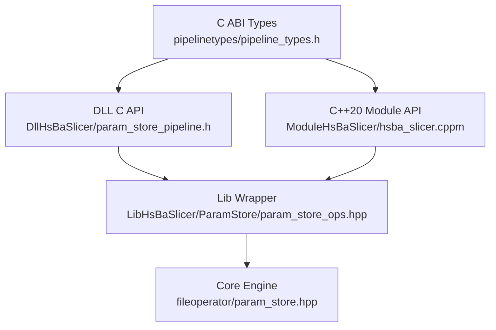
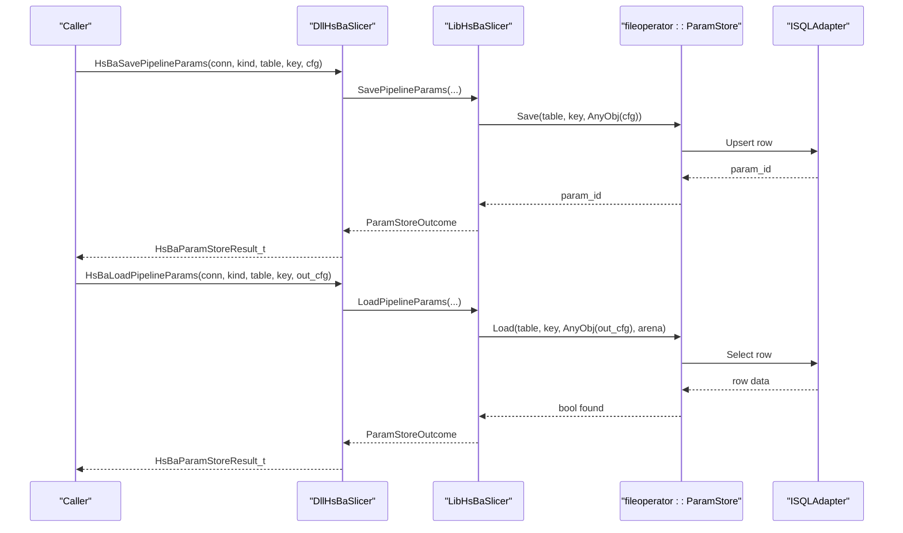
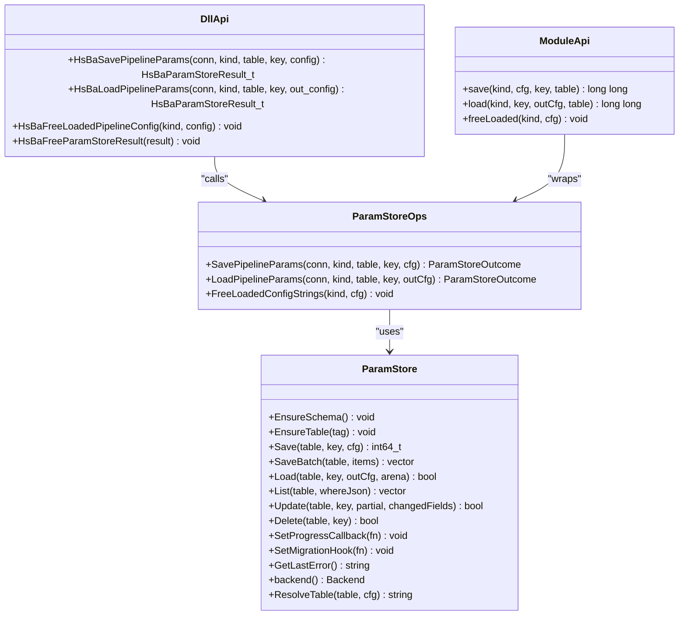
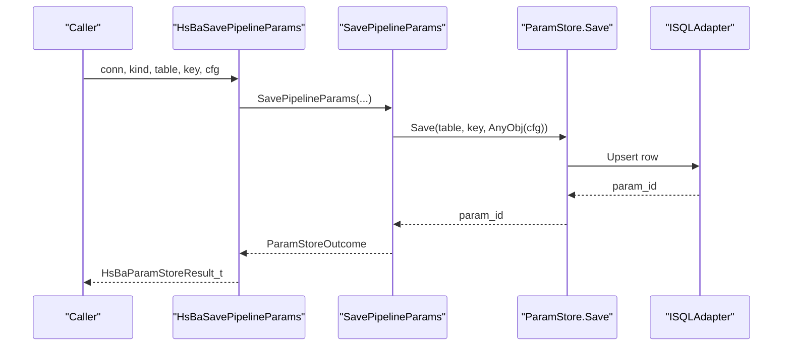
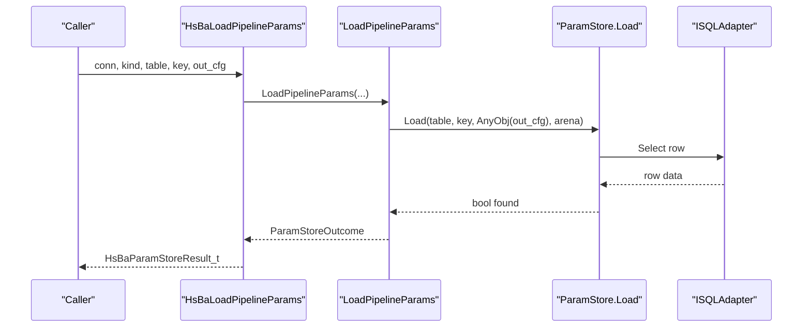
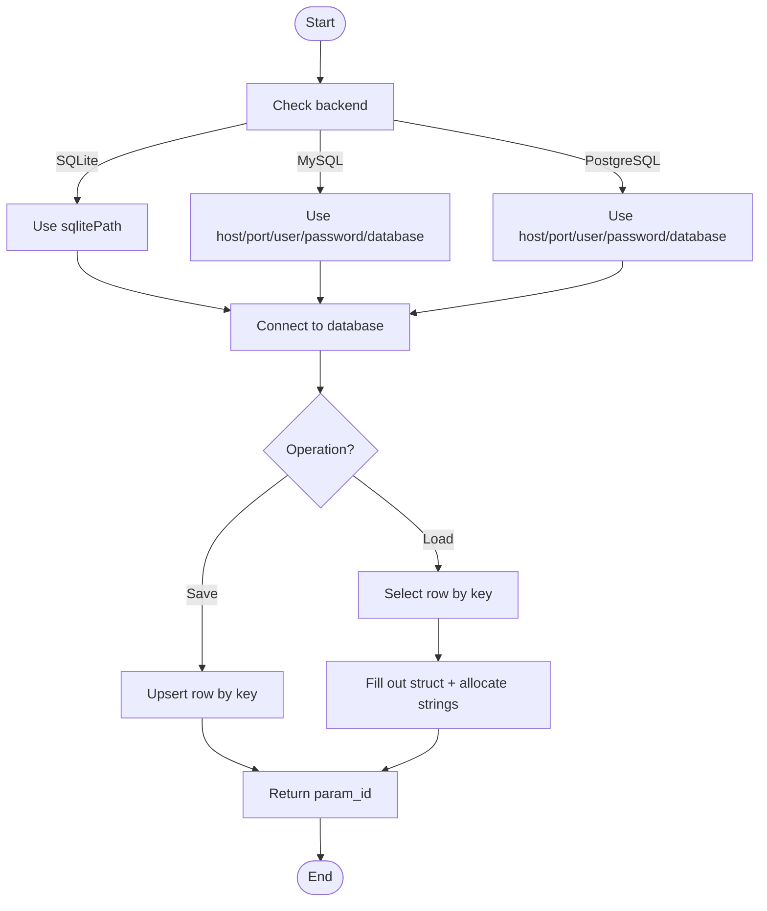
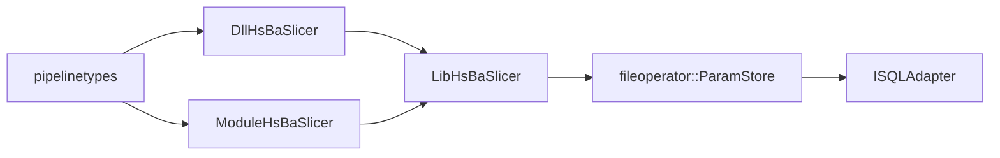

# Parameter Storage System (ParamStore)

<cite>
**Referenced Files in This Document**
- [pipeline_types.h](file://pipelinetypes/pipeline_types.h)
- [param_store.hpp](file://fileoperator\param_store.hpp)
- [param_store_ops.hpp](file://LibHsBaSlicer\ParamStore\param_store_ops.hpp)
- [param_store_pipeline.h](file://DllHsBaSlicer\param_store_pipeline.h)
- [hsba_slicer.cppm](file://ModuleHsBaSlicer\hsba_slicer.cppm)
</cite>

## Table of Contents
1. [Introduction](#introduction)
2. [Project Structure](#project-structure)
3. [Core Components](#core-components)
4. [Architecture Overview](#architecture-overview)
5. [Detailed Component Analysis](#detailed-component-analysis)
6. [Dependency Analysis](#dependency-analysis)
7. [Performance Considerations](#performance-considerations)
8. [Troubleshooting Guide](#troubleshooting-guide)
9. [Conclusion](#conclusion)

## Introduction
This document explains the ParamStore parameter storage system that exposes process-parameter persistence for all pipeline configurations through a Lib/Dll/Module three-layer design. The system supports:
- Writing parameters by upserting a typed PipelineConfig under a business key.
- Reading parameters by key into a caller-provided C struct, with library-owned string fields released via a dedicated free function.
- Three backends: SQLite, MySQL, and PostgreSQL; mobile builds are restricted to SQLite.

The implementation follows the repository’s established pattern where the Dll layer calls only the Lib layer and never references fileoperator directly. The core persistence engine lives in fileoperator, while LibHsBaSlicer provides a thin wrapper over C ABI structs, and DllHsBaSlicer exposes stable C functions. ModuleHsBaSlicer adds a C++20 module API wrapping the Lib layer.

## Project Structure
ParamStore spans four layers:
- pipelinetypes: C ABI types shared across modules.
- fileoperator: Core ParamStore engine using reflection, schema management, and SQL adapters.
- LibHsBaSlicer: Free-function wrapper exposing Save/Load/Free over C config structs.
- DllHsBaSlicer: Stable C ABI entry points for external consumers.
- ModuleHsBaSlicer: C++20 module API wrapping LibHsBaSlicer.

**Diagram sources**
- [pipeline_types.h:1-12](file://pipelinetypes/pipeline_types.h#L1-L12)
- [param_store.hpp:1-10](file://fileoperator\param_store.hpp#L1-L10)
- [param_store_ops.hpp:1-12](file://LibHsBaSlicer\ParamStore\param_store_ops.hpp#L1-L12)
- [param_store_pipeline.h:1-11](file://DllHsBaSlicer\param_store_pipeline.h#L1-L11)
- [hsba_slicer.cppm:1-9](file://ModuleHsBaSlicer\hsba_slicer.cppm#L1-L9)

**Section sources**
- [pipeline_types.h:1-12](file://pipelinetypes/pipeline_types.h#L1-L12)
- [param_store.hpp:1-10](file://fileoperator\param_store.hpp#L1-L10)
- [param_store_ops.hpp:1-12](file://LibHsBaSlicer\ParamStore\param_store_ops.hpp#L1-L12)
- [param_store_pipeline.h:1-11](file://DllHsBaSlicer\param_store_pipeline.h#L1-L11)
- [hsba_slicer.cppm:1-9](file://ModuleHsBaSlicer\hsba_slicer.cppm#L1-L9)

## Core Components
- C ABI types define pipeline kinds, backend selection, connection parameters, and result structures used by both DLL and module APIs.
- Core ParamStore provides CRUD operations backed by ISQLAdapter, with EnsureSchema/Save/Load/List/Update/Delete and progress/migration hooks.
- Lib wrapper exposes SavePipelineParams, LoadPipelineParams, and FreeLoadedConfigStrings over C config structs.
- DLL API exposes HsBaSavePipelineParams, HsBaLoadPipelineParams, HsBaFreeLoadedPipelineConfig, and HsBaFreeParamStoreResult.
- Module API exposes ParamStorePipeline class with save/load/free methods.

Key responsibilities:
- Type safety: pipeline kind enums must align with internal PipelineConfigTag.
- Ownership: loaded string fields are allocated by the library and freed by a matching free function.
- Backend abstraction: connection parameters select SQLite vs MySQL vs PostgreSQL.

**Section sources**
- [pipeline_types.h:1-12](file://pipelinetypes/pipeline_types.h#L1-L12)
- [param_store.hpp:30-105](file://fileoperator\param_store.hpp#L30-L105)
- [param_store_ops.hpp:24-89](file://LibHsBaSlicer\ParamStore\param_store_ops.hpp#L24-L89)
- [param_store_pipeline.h:17-69](file://DllHsBaSlicer\param_store_pipeline.h#L17-L69)
- [hsba_slicer.cppm:380-445](file://ModuleHsBaSlicer\hsba_slicer.cppm#L380-L445)

## Architecture Overview
The architecture enforces strict layering:
- DllHsBaSlicer does not reference fileoperator directly; it calls LibHsBaSlicer.
- LibHsBaSlicer wraps fileoperator ParamStore and translates between C ABI structs and AnyObject-based reflection.
- ModuleHsBaSlicer provides a modern C++20 interface over LibHsBaSlicer.

**Diagram sources**
- [param_store_pipeline.h:17-69](file://DllHsBaSlicer\param_store_pipeline.h#L17-L69)
- [param_store_ops.hpp:66-89](file://LibHsBaSlicer\ParamStore\param_store_ops.hpp#L66-L89)
- [param_store.hpp:45-79](file://fileoperator\param_store.hpp#L45-L79)

## Detailed Component Analysis

### C ABI Types and Enums
- HsBaPipelineKind enumerates supported pipeline configuration types.
- HsBaParamStoreBackend selects the database backend.
- HsBaParamStoreConn_t carries connection parameters:
  - SQLite uses sqlite_path.
  - MySQL/PostgreSQL use host/port/user/password/database.
- HsBaParamStoreResult_t reports success, param_id, error_message, and elapsed_seconds.

Design notes:
- The enum order must match PipelineConfigTag to ensure correct reflection mapping.
- All string fields in results are UTF-8 and owned by the library; callers must use the provided free functions.

**Section sources**
- [pipeline_types.h:1-12](file://pipelinetypes/pipeline_types.h#L1-L12)

### Core ParamStore Engine
Responsibilities:
- Schema management: EnsureSchema/EnsureTable.
- Persistence: Save/SaveBatch/Load/List/Update/Delete.
- Error handling: last_error_ is recorded and exceptions propagate so callers can handle them.
- Extensibility: ProgressFn and MigrationFn hooks.

Data flow:
- Save validates, reflects, coerces, and upserts a wide table per PipelineConfig type.
- Load fills a caller-provided AnyObject-backed struct and allocates const char* fields into a StringArena.

Complexity considerations:
- Batch Save uses transactions to reduce overhead and ensure atomicity.
- Reflection-driven field traversal avoids manual serialization code but depends on accurate TypeInfo registration.

Error handling:
- Errors are not swallowed; GetLastError() captures the last failure message.

**Section sources**
- [param_store.hpp:1-10](file://fileoperator\param_store.hpp#L1-L10)
- [param_store.hpp:30-105](file://fileoperator\param_store.hpp#L30-L105)

### Lib Layer Wrapper
Responsibilities:
- Expose SavePipelineParams and LoadPipelineParams over C config structs.
- Provide FreeLoadedConfigStrings to release malloc’d string fields produced by Load.
- Maintain ParamPipelineKind aligned with PipelineConfigTag and HsBaPipelineKind.

Ownership model:
- LoadPipelineParams allocates const char* fields via std::malloc; callers must call FreeLoadedConfigStrings(kind, cfg).

Backend constraints:
- Mobile targets support SQLite only.

**Section sources**
- [param_store_ops.hpp:24-89](file://LibHsBaSlicer\ParamStore\param_store_ops.hpp#L24-L89)

### DLL C API
Responsibilities:
- HsBaSavePipelineParams: Connect -> EnsureTable -> Reflect -> Coerce -> Upsert.
- HsBaLoadPipelineParams: Load into caller-provided struct; allocate string fields.
- HsBaFreeLoadedPipelineConfig: Release loaded string fields.
- HsBaFreeParamStoreResult: Free result memory.

ABI guarantees:
- All inputs are POD-compatible; strings are UTF-8.
- Callers must free result and loaded strings using the provided functions.

**Section sources**
- [param_store_pipeline.h:17-69](file://DllHsBaSlicer\param_store_pipeline.h#L17-L69)

### C++20 Module API
Responsibilities:
- ParamStorePipeline class wraps LibHsBaSlicer free functions.
- Provides save/load/free methods with exception-based error reporting.
- Re-exports C ABI types for convenience.

Usage pattern:
- Construct ParamStorePipeline with ParamStoreConnection.
- Call save/load with appropriate ParamStoreKind and C config pointers.
- Use freeLoaded to release heap strings from load.

**Section sources**
- [hsba_slicer.cppm:380-445](file://ModuleHsBaSlicer\hsba_slicer.cppm#L380-L445)

### Class Diagram: ParamStore Pipeline Layers

**Diagram sources**
- [param_store.hpp:30-105](file://fileoperator\param_store.hpp#L30-L105)
- [param_store_ops.hpp:66-89](file://LibHsBaSlicer\ParamStore\param_store_ops.hpp#L66-L89)
- [param_store_pipeline.h:17-69](file://DllHsBaSlicer\param_store_pipeline.h#L17-L69)
- [hsba_slicer.cppm:420-445](file://ModuleHsBaSlicer\hsba_slicer.cppm#L420-L445)

### Sequence Diagram: Save Flow

**Diagram sources**
- [param_store_pipeline.h:17-32](file://DllHsBaSlicer\param_store_pipeline.h#L17-L32)
- [param_store_ops.hpp:66-76](file://LibHsBaSlicer\ParamStore\param_store_ops.hpp#L66-L76)
- [param_store.hpp:51-62](file://fileoperator\param_store.hpp#L51-L62)

### Sequence Diagram: Load Flow

**Diagram sources**
- [param_store_pipeline.h:34-50](file://DllHsBaSlicer\param_store_pipeline.h#L34-L50)
- [param_store_ops.hpp:78-86](file://LibHsBaSlicer\ParamStore\param_store_ops.hpp#L78-L86)
- [param_store.hpp:64-69](file://fileoperator\param_store.hpp#L64-L69)

### Flowchart: Backend Selection and Connection Parameters

**Diagram sources**
- [pipeline_types.h:1-12](file://pipelinetypes/pipeline_types.h#L1-L12)
- [param_store_ops.hpp:46-56](file://LibHsBaSlicer\ParamStore\param_store_ops.hpp#L46-L56)

## Dependency Analysis
Layer dependencies:
- DllHsBaSlicer depends on pipelinetypes and LibHsBaSlicer; it does not depend on fileoperator.
- LibHsBaSlicer depends on fileoperator ParamStore and Utils reflection utilities.
- ModuleHsBaSlicer depends on LibHsBaSlicer and re-exports C ABI types.

Coupling and cohesion:
- Strong separation of concerns: Dll exposes stable C ABI; Lib handles translation; Core implements persistence logic.
- Cohesion within each layer is high due to focused responsibilities.

Potential circular dependencies:
- None observed; dependencies flow downward from Dll/Module to Lib to Core.

External integration points:
- ISQLAdapter abstracts database backends.
- Utils.AnyObject and reflection drive schema-aware serialization/deserialization.

**Diagram sources**
- [param_store_pipeline.h:1-11](file://DllHsBaSlicer\param_store_pipeline.h#L1-L11)
- [param_store_ops.hpp:1-12](file://LibHsBaSlicer\ParamStore\param_store_ops.hpp#L1-L12)
- [param_store.hpp:1-10](file://fileoperator\param_store.hpp#L1-L10)
- [pipeline_types.h:1-12](file://pipelinetypes/pipeline_types.h#L1-L12)
- [hsba_slicer.cppm:38-59](file://ModuleHsBaSlicer\hsba_slicer.cppm#L38-L59)

**Section sources**
- [param_store_pipeline.h:1-11](file://DllHsBaSlicer\param_store_pipeline.h#L1-L11)
- [param_store_ops.hpp:1-12](file://LibHsBaSlicer\ParamStore\param_store_ops.hpp#L1-L12)
- [param_store.hpp:1-10](file://fileoperator\param_store.hpp#L1-L10)
- [pipeline_types.h:1-12](file://pipelinetypes/pipeline_types.h#L1-L12)
- [hsba_slicer.cppm:38-59](file://ModuleHsBaSlicer\hsba_slicer.cppm#L38-L59)

## Performance Considerations
- Batch Save uses transactions to minimize round-trips and ensure atomicity.
- Reflection-driven field traversal simplifies maintenance but incurs runtime overhead; keep TypeInfo registrations minimal and accurate.
- For large payloads, prefer batch operations and avoid repeated allocations by reusing arenas where possible.
- Backend selection should consider network latency; SQLite is optimal for local/mobile scenarios.

[No sources needed since this section provides general guidance]

## Troubleshooting Guide
Common issues and resolutions:
- Memory leaks: Always call HsBaFreeParamStoreResult after using HsBaParamStoreResult_t and HsBaFreeLoadedPipelineConfig after loading configs.
- Backend mismatch: Ensure HsBaParamStoreBackend matches the actual database; mobile builds restrict to SQLite.
- Enum alignment: HsBaPipelineKind must align with PipelineConfigTag; mismatches cause reflection errors.
- Error propagation: ParamStore records last_error_; inspect it when exceptions occur or when Load returns false.

Operational checks:
- Validate connection parameters before calling Save/Load.
- Initialize C config structs using default initializers before Load to avoid undefined behavior.
- Use FreeLoadedConfigStrings with the correct ParamPipelineKind to match allocation strategy.

**Section sources**
- [param_store_pipeline.h:52-69](file://DllHsBaSlicer\param_store_pipeline.h#L52-L69)
- [param_store_ops.hpp:88-89](file://LibHsBaSlicer\ParamStore\param_store_ops.hpp#L88-L89)
- [param_store.hpp:86-90](file://fileoperator\param_store.hpp#L86-L90)

## Conclusion
The ParamStore system provides a robust, layered approach to persisting and retrieving process parameters across multiple pipeline types and database backends. By enforcing strict layering, clear ownership semantics, and reflection-driven serialization, it balances flexibility with maintainability. Consumers should adhere to the documented ownership rules and backend constraints to ensure reliable operation across desktop and mobile environments.

[No sources needed since this section summarizes without analyzing specific files]