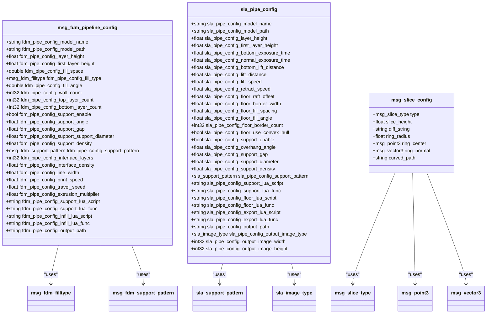
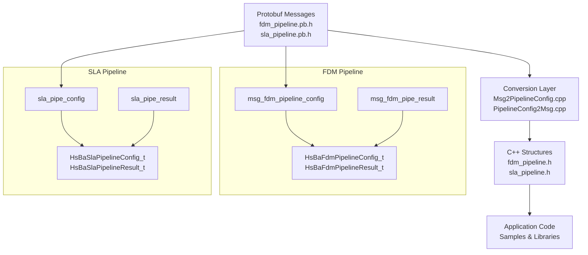
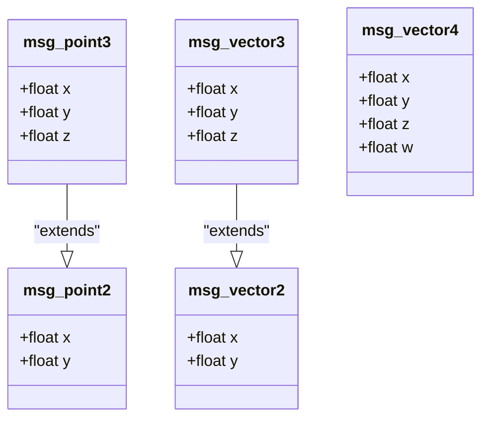
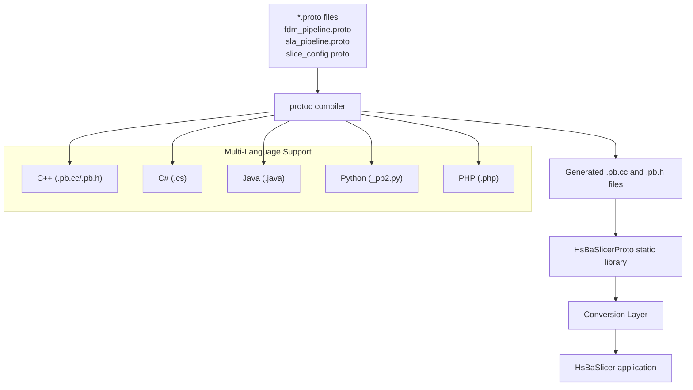

# Protobuf Configuration Schema

<cite>
**Referenced Files in This Document**   
- [slice_config.proto](file://proto/slice_config.proto)
- [fdm_pipeline.proto](file://proto/fdm_pipeline.proto)
- [sla_pipeline.proto](file://proto/sla_pipeline.proto)
- [point.proto](file://proto/point.proto)
- [vector.proto](file://proto/vector.proto)
- [CMakeLists.txt](file://proto/CMakeLists.txt)
- [Msg2PipelineConfig.cpp](file://convert/Msg2PipelineConfig.cpp)
- [PipelineConfig2Msg.cpp](file://convert/PipelineConfig2Msg.cpp)
- [Msg2PipelineConfig.hpp](file://convert/Msg2PipelineConfig.hpp)
- [PipelineConfig2Msg.hpp](file://convert/PipelineConfig2Msg.hpp)
- [fdm_pipeline.h](file://DllHsBaSlicer/fdm_pipeline.h)
- [sla_pipeline.h](file://DllHsBaSlicer/sla_pipeline.h)
- [Eigen2Msg.hpp](file://convert/Eigen2Msg.hpp)
- [Msg2Eigen.hpp](file://convert/Msg2Eigen.hpp)
</cite>

## Update Summary
**Changes Made**   
- Added comprehensive documentation for new FDM and SLA pipeline protobuf schemas
- Documented bidirectional conversion system between C++ structures and protobuf messages
- Updated integration examples to include both legacy slice configuration and new pipeline configurations
- Enhanced schema versioning section with multi-language compilation support
- Added validation rules for all new pipeline configuration fields

## Table of Contents
1. [Introduction](#introduction)
2. [Core Message Structure](#core-message-structure)
3. [FDM Pipeline Configuration](#fdm-pipeline-configuration)
4. [SLA Pipeline Configuration](#sla-pipeline-configuration)
5. [Legacy Slice Configuration](#legacy-slice-configuration)
6. [Bidirectional Conversion System](#bidirectional-conversion-system)
7. [Geometry Type Reuse](#geometry-type-reuse)
8. [Configuration Examples](#configuration-examples)
9. [C++ Integration and Compilation](#c-integration-and-compilation)
10. [Schema Versioning and Compatibility](#schema-versioning-and-compatibility)
11. [Validation and Default Value Handling](#validation-and-default-value-handling)
12. [Best Practices for Schema Extension](#best-practices-for-schema-extension)

## Introduction
This document provides comprehensive documentation for the Protobuf-based configuration system used in the HsBaSlicer application. The system now supports three distinct configuration paradigms: **FDM (Fused Deposition Modeling) pipeline**, **SLA (Stereolithography) pipeline**, and **legacy slice configuration**. Each paradigm serves different 3D printing technologies and processing workflows, with robust bidirectional conversion between internal C++ structures and protobuf messages enabling seamless integration across multiple programming languages.

The enhanced architecture provides comprehensive configuration management for both modern FDM and SLA pipelines while maintaining backward compatibility with existing slice configuration patterns.

## Core Message Structure

The HsBaSlicer configuration system encompasses three primary message families, each tailored to specific 3D printing technologies:



**Diagram sources**
- [fdm_pipeline.proto:19-54](file://proto/fdm_pipeline.proto#L19-L54)
- [sla_pipeline.proto:18-58](file://proto/sla_pipeline.proto#L18-L58)
- [slice_config.proto:18-27](file://proto/slice_config.proto#L18-L27)

**Section sources**
- [fdm_pipeline.proto:1-63](file://proto/fdm_pipeline.proto#L1-L63)
- [sla_pipeline.proto:1-67](file://proto/sla_pipeline.proto#L1-L67)
- [slice_config.proto:1-27](file://proto/slice_config.proto#L1-L27)

## FDM Pipeline Configuration

The FDM (Fused Deposition Modeling) pipeline configuration defines parameters for extrusion-based 3D printing processes. It encompasses model setup, slicing parameters, fill patterns, support generation, and output configuration.

### FDM Fill Types
| Enum Value | Name | Description |
|------------|------|-------------|
| 0 | filltype_fdm_line | Parallel line fill pattern |
| 1 | filltype_fdm_simple_zigzag | Simple zigzag infill pattern |
| 2 | filltype_fdm_zigzag | Advanced zigzag infill with optimization |

### FDM Support Patterns
| Enum Value | Name | Description |
|------------|------|-------------|
| 0 | support_pattern_fdm_plane | Planar pillar support structure |
| 1 | support_pattern_fdm_trnaee | Tree-like organic support structure |
| 2 | support_pattern_fdm_honeycomb | Hexagonal honeycomb support structure |

### Key Configuration Fields

#### Model Configuration
- **fdm_pipe_config_model_name**: Human-readable model identifier
- **fdm_pipe_config_model_path**: File path to input 3D model (STL, OBJ, etc.)

#### Slicing Parameters
- **fdm_pipe_config_layer_height**: Base layer thickness in millimeters (typically 0.1-0.3mm)
- **fdm_pipe_config_first_layer_height**: Initial layer height for better adhesion (typically 1.2x base height)

#### Fill Configuration
- **fdm_pipe_config_fill_space**: Distance between fill lines in millimeters
- **fdm_pipe_config_fill_type**: Infill pattern selection from available fill types
- **fdm_pipe_config_fill_angle**: Angle of infill pattern relative to X-axis
- **fdm_pipe_config_wall_count**: Number of perimeter walls around model edges
- **fdm_pipe_config_top_layer_count**: Solid top surface layers
- **fdm_pipe_config_bottom_layer_count**: Solid bottom surface layers

#### Support Generation
- **fdm_pipe_config_support_enable**: Enable/disable support structure generation
- **fdm_pipe_config_support_angle**: Overhang angle threshold for support generation
- **fdm_pipe_config_support_gap**: Gap distance between support and model surfaces
- **fdm_pipe_config_support_support_diameter**: Diameter of support columns
- **fdm_pipe_config_support_density**: Support structure density percentage
- **fdm_pipe_config_support_pattern**: Support pattern type selection
- **fdm_pipe_config_interface_layers**: Transition layers between support and model
- **fdm_pipe_config_interface_density**: Density of interface layers

#### Printing Parameters
- **fdm_pipe_config_line_width**: Extrusion line width in millimeters
- **fdm_pipe_config_print_speed**: Printing speed in mm/s
- **fdm_pipe_config_travel_speed**: Non-printing travel speed in mm/s
- **fdm_pipe_config_extrusion_multiplier**: Flow rate adjustment factor

#### Lua Customization
- **fdm_pipe_config_support_lua_script**: Path to custom support generation script
- **fdm_pipe_config_support_lua_func**: Function name in support script
- **fdm_pipe_config_infill_lua_script**: Path to custom infill generation script
- **fdm_pipe_config_infill_lua_func**: Function name in infill script

#### Output Configuration
- **fdm_pipe_config_output_path**: Output G-code file path

**Section sources**
- [fdm_pipeline.proto:5-54](file://proto/fdm_pipeline.proto#L5-L54)

## SLA Pipeline Configuration

The SLA (Stereolithography) pipeline configuration defines parameters for resin-based 3D printing processes using light exposure. It includes exposure timing, lift mechanics, floor/raft generation, and image export options.

### SLA Support Patterns
| Enum Value | Name | Description |
|------------|------|-------------|
| 0 | support_pattern_sla_sacrificial | Thin sacrificial column supports |
| 1 | support_pattern_sla_cone | Cone-shaped support structures |

### SLA Image Types
| Enum Value | Name | Description |
|------------|------|-------------|
| 0 | image_type_sla_png | PNG format (lossless compression) |
| 1 | image_type_sla_jpg | JPEG format (lossy compression) |
| 2 | image_type_sla_svg | SVG vector format (scalable) |

### Key Configuration Fields

#### Model Configuration
- **sla_pipe_config_model_name**: Human-readable model identifier
- **sla_pipe_config_model_path**: File path to input 3D model

#### Slicing Parameters
- **sla_pipe_config_layer_height**: Layer thickness in millimeters (typically 0.025-0.1mm)
- **sla_pipe_config_first_layer_height**: First layer thickness for adhesion

#### Exposure Settings
- **sla_pipe_config_bottom_exposure_time**: Bottom layer exposure time in seconds
- **sla_pipe_config_normal_exposure_time**: Normal layer exposure time in seconds
- **sla_pipe_config_bottom_lift_distance**: Lift distance for bottom layers
- **sla_pipe_config_lift_distance**: Standard lift distance between layers
- **sla_pipe_config_lift_speed**: Z-axis movement speed during lifting
- **sla_pipe_config_retract_speed**: Retraction speed after exposure

#### Floor/Raft Configuration
- **sla_pipe_config_floor_raft_offset**: Raft extension beyond model footprint
- **sla_pipe_config_floor_border_width**: Floor border ring width
- **sla_pipe_config_floor_fill_spacing**: Floor fill line spacing
- **sla_pipe_config_floor_fill_angle**: Floor fill pattern angle
- **sla_pipe_config_floor_border_count**: Number of floor border loops
- **sla_pipe_config_floor_use_convex_hull**: Use convex hull for floor generation

#### Support Generation
- **sla_pipe_config_support_enable**: Enable/disable support generation
- **sla_pipe_config_overhang_angle**: Overhang detection threshold
- **sla_pipe_config_support_gap**: Gap between support and model
- **sla_pipe_config_support_diameter**: Support column diameter
- **sla_pipe_config_support_density**: Support density percentage
- **sla_pipe_config_support_pattern**: Support pattern type

#### Lua Customization
- **sla_pipe_config_support_lua_script**: Custom support generation script path
- **sla_pipe_config_support_lua_func**: Support script function name
- **sla_pipe_config_floor_lua_script**: Custom floor generation script path
- **sla_pipe_config_floor_lua_func**: Floor script function name
- **sla_pipe_config_export_lua_script**: Custom export script path
- **sla_pipe_config_export_lua_func**: Export script function name

#### Output Configuration
- **sla_pipe_config_output_path**: Output zip file path containing layer images
- **sla_pipe_config_output_image_type**: Layer image format selection
- **sla_pipe_config_output_image_width**: Output image width in pixels
- **sla_pipe_config_output_image_height**: Output image height in pixels

**Section sources**
- [sla_pipeline.proto:5-58](file://proto/sla_pipeline.proto#L5-L58)

## Legacy Slice Configuration

The legacy `msg_slice_config` maintains backward compatibility for existing slice-based operations, supporting uniform, differential, curved, and ring-based slicing patterns.

### Slice Type Enumeration
| Enum Value | Name | Description |
|------------|------|-------------|
| 0 | slicet_Same | Uniform height slices with consistent z-direction |
| 1 | slicet_Diff | Differential heights with variable z-direction mapping |
| 2 | slicet_Curved | Curved surface slicing based on mesh file |
| 3 | slicet_Ring | Circular ring formation slicing |
| 4 | slicet_None | No slicing operation |
| 5 | slicet_Unknown | Unknown or invalid slice type |

### Field Specifications

| Field Name | Type | Valid Values | Description | Required For |
|------------|------|------------|-------------|-------------|
| type | msg_slice_type | 0-5 | Specifies the slicing behavior pattern | Always |
| slice_height | float | > 0.0 | Base slice height in millimeters | Same, Diff, Curved |
| diff_string | string | [0-X]:h1, [X+1-Y]:h2, ... | Height mapping for differential slicing | Diff |
| ring_radius | float | > 0.0 | Radius of circular ring in millimeters | Ring |
| ring_center | msg_point3 | Any 3D coordinate | Center point of circular ring | Ring |
| ring_normal | msg_vector3 | Non-zero vector | Normal vector defining ring orientation | Ring |
| curved_path | string | Valid file path | Path to mesh file for curved slicing | Curved |

**Section sources**
- [slice_config.proto:8-27](file://proto/slice_config.proto#L8-L27)

## Bidirectional Conversion System

The enhanced configuration system provides comprehensive bidirectional conversion between protobuf messages and internal C++ structures, enabling seamless integration across different programming languages and platforms.

### Conversion Architecture



**Diagram sources**
- [Msg2PipelineConfig.cpp:27-126](file://convert/Msg2PipelineConfig.cpp#L27-L126)
- [PipelineConfig2Msg.cpp:6-121](file://convert/PipelineConfig2Msg.cpp#L6-L121)

### FDM Conversion Functions

#### Protobuf to C++ Structure
- **MsgToFdmConfig**: Converts `msg_fdm_pipeline_config` to `HsBaFdmPipelineConfig_t`
- **MsgToFdmResult**: Converts `msg_fdm_pipe_result` to `HsBaFdmPipelineResult_t`

#### C++ Structure to Protobuf
- **FdmConfigToMsg**: Converts `HsBaFdmPipelineConfig_t` to `msg_fdm_pipeline_config`
- **FdmResultToMsg**: Converts `HsBaFdmPipelineResult_t` to `msg_fdm_pipe_result`

### SLA Conversion Functions

#### Protobuf to C++ Structure
- **MsgToSlaConfig**: Converts `sla_pipe_config` to `HsBaSlaPipelineConfig_t`
- **MsgToSlaResult**: Converts `sla_pipe_result` to `HsBaSlaPipelineResult_t`

#### C++ Structure to Protobuf
- **SlaConfigToMsg**: Converts `HsBaSlaPipelineConfig_t` to `sla_pipe_config`
- **SlaResultToMsg**: Converts `HsBaSlaPipelineResult_t` to `sla_pipe_result`

### Memory Management

The conversion system implements careful memory management for string fields:
- String fields are allocated using `malloc()` during protobuf-to-C++ conversion
- Caller must free allocated memory using appropriate cleanup functions
- Built-in pipeline functions handle internal memory management automatically

**Section sources**
- [Msg2PipelineConfig.cpp:1-129](file://convert/Msg2PipelineConfig.cpp#L1-L129)
- [PipelineConfig2Msg.cpp:1-124](file://convert/PipelineConfig2Msg.cpp#L1-L124)
- [Msg2PipelineConfig.hpp:14-32](file://convert/Msg2PipelineConfig.hpp#L14-L32)
- [PipelineConfig2Msg.hpp:14-24](file://convert/PipelineConfig2Msg.hpp#L14-L24)

## Geometry Type Reuse

The configuration system reuses geometric types from external protobuf files to represent 3D points and vectors, promoting consistency across the application and reducing code duplication.



**Diagram sources**
- [point.proto:5-16](file://proto/point.proto#L5-L16)
- [vector.proto:5-24](file://proto/vector.proto#L5-L24)

**Section sources**
- [point.proto:1-16](file://proto/point.proto#L1-L16)
- [vector.proto:1-24](file://proto/vector.proto#L1-L24)

## Configuration Examples

This section provides valid protobuf configuration examples for each pipeline type, demonstrating proper usage of the schema fields.

### FDM Pipeline Configuration Example
```protobuf
message msg_fdm_pipeline_config {
    fdm_pipe_config_model_name: "test_model"
    fdm_pipe_config_model_path: "models/test.stl"
    fdm_pipe_config_layer_height: 0.2
    fdm_pipe_config_first_layer_height: 0.25
    fdm_pipe_config_fill_space: 0.4
    fdm_pipe_config_fill_type: filltype_fdm_zigzag
    fdm_pipe_config_fill_angle: 45.0
    fdm_pipe_config_wall_count: 3
    fdm_pipe_config_top_layer_count: 5
    fdm_pipe_config_bottom_layer_count: 4
    fdm_pipe_config_support_enable: true
    fdm_pipe_config_support_angle: 50.0
    fdm_pipe_config_support_gap: 0.5
    fdm_pipe_config_support_support_diameter: 2.0
    fdm_pipe_config_support_density: 0.3
    fdm_pipe_config_support_pattern: support_pattern_fdm_tree
    fdm_pipe_config_interface_layers: 2
    fdm_pipe_config_interface_density: 0.5
    fdm_pipe_config_line_width: 0.4
    fdm_pipe_config_print_speed: 60.0
    fdm_pipe_config_travel_speed: 120.0
    fdm_pipe_config_extrusion_multiplier: 1.0
    fdm_pipe_config_output_path: "output/model.gcode"
}
```

### SLA Pipeline Configuration Example
```protobuf
message sla_pipe_config {
    sla_pipe_config_model_name: "resin_model"
    sla_pipe_config_model_path: "models/resin_model.stl"
    sla_pipe_config_layer_height: 0.05
    sla_pipe_config_first_layer_height: 0.1
    sla_pipe_config_bottom_exposure_time: 60.0
    sla_pipe_config_normal_exposure_time: 2.5
    sla_pipe_config_bottom_lift_distance: 5.0
    sla_pipe_config_lift_distance: 3.0
    sla_pipe_config_lift_speed: 60.0
    sla_pipe_config_retract_speed: 150.0
    sla_pipe_config_floor_raft_offset: 3.0
    sla_pipe_config_floor_border_width: 1.5
    sla_pipe_config_floor_fill_spacing: 0.5
    sla_pipe_config_floor_fill_angle: 0.0
    sla_pipe_config_floor_border_count: 3
    sla_pipe_config_floor_use_convex_hull: true
    sla_pipe_config_support_enable: true
    sla_pipe_config_overhang_angle: 45.0
    sla_pipe_config_support_gap: 0.5
    sla_pipe_config_support_diameter: 2.0
    sla_pipe_config_support_density: 0.3
    sla_pipe_config_support_pattern: support_pattern_sla_sacrificial
    sla_pipe_config_output_path: "output/model.zip"
    sla_pipe_config_output_image_type: image_type_sla_png
    sla_pipe_config_output_image_width: 0
    sla_pipe_config_output_image_height: 0
}
```

### Legacy Slice Configuration Examples

#### Same Height Slicing
```protobuf
message msg_slice_config {
    type: slicet_Same
    slice_height: 0.2
}
```

#### Differential Height Slicing
```protobuf
message msg_slice_config {
    type: slicet_Diff
    diff_string: "[0-10]:0.3, [11-20]:0.15, [21-50]:0.2"
}
```

#### Curved Surface Slicing
```protobuf
message msg_slice_config {
    type: slicet_Curved
    curved_path: "models/curved_surface.stl"
    slice_height: 0.1
}
```

#### Ring-Based Slicing
```protobuf
message msg_slice_config {
    type: slicet_Ring
    ring_radius: 50.0
    ring_center: {
        x: 100.0
        y: 100.0
        z: 0.0
    }
    ring_normal: {
        x: 0.0
        y: 0.0
        z: 1.0
    }
    slice_height: 0.25
}
```

**Section sources**
- [fdm_pipeline.proto:19-54](file://proto/fdm_pipeline.proto#L19-L54)
- [sla_pipeline.proto:18-58](file://proto/sla_pipeline.proto#L18-L58)
- [slice_config.proto:18-27](file://proto/slice_config.proto#L18-L27)

## C++ Integration and Compilation

The enhanced protobuf system integrates seamlessly into the C++ build system through automatic code generation and multi-language compilation support.

### Build System Integration



**Diagram sources**
- [CMakeLists.txt:127-134](file://proto/CMakeLists.txt#L127-L134)

### Compilation Process

The build system automatically compiles all protobuf files in the project directory:

1. **File Discovery**: All `.proto` files in the `proto/` directory are discovered
2. **Code Generation**: `protoc` generates language-specific source files
3. **Library Creation**: Generated files are compiled into `HsBaSlicerProto` static library
4. **Integration**: Library is linked with main application components

### Multi-Language Compilation Support

The system supports compilation for multiple programming languages:

- **C++**: Primary language with full feature support
- **C#**: Cross-platform desktop applications
- **Java**: Android and enterprise applications  
- **Python**: Scripting and automation
- **PHP**: Web-based configuration interfaces

**Section sources**
- [CMakeLists.txt:1-134](file://proto/CMakeLists.txt#L1-L134)
- [Msg2PipelineConfig.hpp:8-9](file://convert/Msg2PipelineConfig.hpp#L8-L9)
- [PipelineConfig2Msg.hpp:8-9](file://convert/PipelineConfig2Msg.hpp#L8-L9)

## Schema Versioning and Compatibility

The enhanced protobuf system maintains strict backward and forward compatibility through careful field numbering and deprecation practices, supporting evolution across multiple major versions.

### Field Evolution Guidelines

#### Adding New Fields
- Always use the next available field number
- Never reuse deleted field numbers
- Provide meaningful default values
- Document new fields comprehensively

#### Removing Deprecated Fields
- Mark fields as deprecated before removal
- Maintain deprecated fields for at least two major versions
- Provide migration guides for field removal
- Implement graceful fallback behavior

#### Changing Field Types
- Never change the type or meaning of an existing field
- Create new fields with different names for changed semantics
- Implement conversion logic for type migrations
- Maintain dual support during transition periods

### Compatibility Matrix

| Change Type | Backward Compatible | Forward Compatible | Migration Required |
|-------------|-------------------|-------------------|-------------------|
| Add optional field | ✅ Yes | ✅ Yes | ❌ No |
| Remove deprecated field | ❌ No | ✅ Yes | ⚠️ Optional |
| Change field type | ❌ No | ❌ No | ✅ Yes |
| Rename field | ❌ No | ✅ Yes | ⚠️ Recommended |
| Modify enum values | ❌ No | ✅ Yes | ⚠️ Optional |

### Multi-Language Considerations

The schema supports compilation for multiple languages, requiring additional considerations:

- **Type Mapping**: Ensure consistent type mapping across languages
- **Enum Handling**: Verify enum value compatibility in target languages
- **String Encoding**: Maintain UTF-8 encoding consistency
- **Memory Management**: Account for language-specific memory models

**Section sources**
- [CMakeLists.txt:21-122](file://proto/CMakeLists.txt#L21-L122)

## Validation and Default Value Handling

The enhanced configuration system implements comprehensive validation and default value handling across all pipeline types, ensuring semantic correctness and robust error handling.

### Default Values by Pipeline Type

#### FDM Pipeline Defaults
| Field | Default Value | Description |
|-------|---------------|-------------|
| layer_height | 0.2 | Standard layer height |
| first_layer_height | 0.25 | Enhanced first layer adhesion |
| fill_spacing | 0.4 | Moderate fill density |
| fill_mode | HSBA_FILL_ZIGZAG | Balanced infill pattern |
| wall_count | 3 | Standard wall thickness |
| support_enable | 1 | Supports enabled by default |
| print_speed | 50.0 | Conservative print speed |

#### SLA Pipeline Defaults
| Field | Default Value | Description |
|-------|---------------|-------------|
| layer_height | 0.05 | High-resolution layer height |
| first_layer_height | 0.1 | Strong first layer adhesion |
| bottom_exposure_time | 60.0 | Extended bottom exposure |
| normal_exposure_time | 2.5 | Standard exposure time |
| support_pattern | HSBA_SLA_SUPPORT_SACRIFICIAL | Minimal support visibility |
| image_type | HSBA_SLA_IMAGE_PNG | Lossless image format |

#### Legacy Slice Defaults
| Field | Default Value | Description |
|-------|---------------|-------------|
| type | slicet_None | No slicing operation |
| slice_height | 0.0 | Requires explicit setting |
| ring_radius | 0.0 | Invalid radius |
| curved_path | "" | Empty path |

### Validation Rules

#### FDM Pipeline Validation
1. **Model Path**: Must be non-empty and accessible
2. **Layer Height**: Must be positive (> 0.0)
3. **Fill Spacing**: Must be positive and reasonable (< 10mm)
4. **Support Parameters**: Valid when support is enabled
5. **Output Path**: Must be writable if specified

#### SLA Pipeline Validation
1. **Model Path**: Must be non-empty and accessible
2. **Layer Height**: Must be positive and within printer limits
3. **Exposure Times**: Must be positive and within safe ranges
4. **Image Dimensions**: Must be positive or zero (auto)
5. **Output Path**: Must be writable if specified

#### Legacy Slice Validation
1. **Slice Type**: Must be valid enum value
2. **Height Values**: Must be positive for active slice types
3. **Ring Parameters**: Complete set required for ring slicing
4. **Curved Path**: Must be valid mesh file path
5. **Diff String**: Must follow format specification

### Error Handling

The conversion system implements comprehensive error handling:

- **Invalid Input**: Returns appropriate error codes
- **Missing Required Fields**: Uses sensible defaults where possible
- **Out-of-Range Values**: Clamps to valid ranges
- **Memory Allocation Failures**: Graceful degradation
- **File Access Errors**: Detailed error messages

**Section sources**
- [fdm_pipeline.h:35-79](file://DllHsBaSlicer/fdm_pipeline.h#L35-L79)
- [sla_pipeline.h:36-84](file://DllHsBaSlicer/sla_pipeline.h#L36-L84)
- [slice_config.proto:18-27](file://proto/slice_config.proto#L18-L27)

## Best Practices for Schema Extension

When extending the enhanced protobuf schema with new parameters, follow these best practices to maintain compatibility and clarity across all pipeline types.

### Extension Guidelines

#### Naming Conventions
- **FDM Fields**: Use `fdm_pipe_config_` prefix
- **SLA Fields**: Use `sla_pipe_config_` prefix  
- **Common Fields**: Use descriptive names without prefixes
- **Enums**: Use descriptive names with type context

#### Field Organization
- **Group Related Fields**: Cluster related parameters logically
- **Use Appropriate Types**: Select precise data types for accuracy
- **Document Thoroughly**: Include comprehensive comments for all fields
- **Consider Defaults**: Provide sensible default values

#### Backward Compatibility
- **Incremental Changes**: Make small, focused schema updates
- **Feature Flags**: Use boolean flags for optional features
- **Version Detection**: Implement schema version checking
- **Migration Scripts**: Provide automated migration tools

### Example Extensions

#### Adding FDM Temperature Control
```protobuf
message msg_fdm_temperature_config {
    float nozzle_temperature = 1;
    float bed_temperature = 2;
    map<int32, float> layer_temperatures = 3;
    float cooling_rate = 4;
}

message msg_fdm_pipeline_config {
    // existing fields...
    msg_fdm_temperature_config temperature = 28;
}
```

#### Adding SLA Material Properties
```protobuf
message msg_sla_material_properties {
    float resin_density = 1;
    float shrinkage_rate = 2;
    float viscosity = 3;
    float curing_depth = 4;
}

message sla_pipe_config {
    // existing fields...
    msg_sla_material_properties material = 33;
}
```

### Testing and Validation

When extending schemas:

1. **Unit Tests**: Test conversion functions thoroughly
2. **Integration Tests**: Validate end-to-end pipeline functionality
3. **Compatibility Tests**: Verify backward compatibility
4. **Performance Tests**: Measure impact of new fields
5. **Documentation Updates**: Keep documentation current

**Section sources**
- [fdm_pipeline.proto:19-54](file://proto/fdm_pipeline.proto#L19-L54)
- [sla_pipeline.proto:18-58](file://proto/sla_pipeline.proto#L18-L58)
- [Msg2PipelineConfig.cpp:27-126](file://convert/Msg2PipelineConfig.cpp#L27-L126)
- [PipelineConfig2Msg.cpp:6-121](file://convert/PipelineConfig2Msg.cpp#L6-L121)