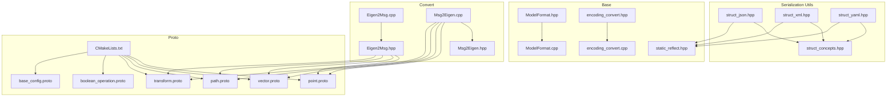
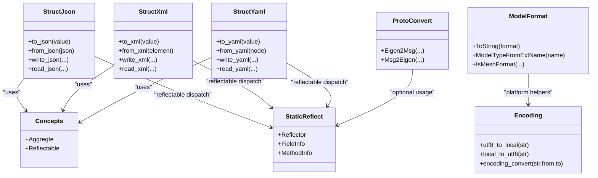
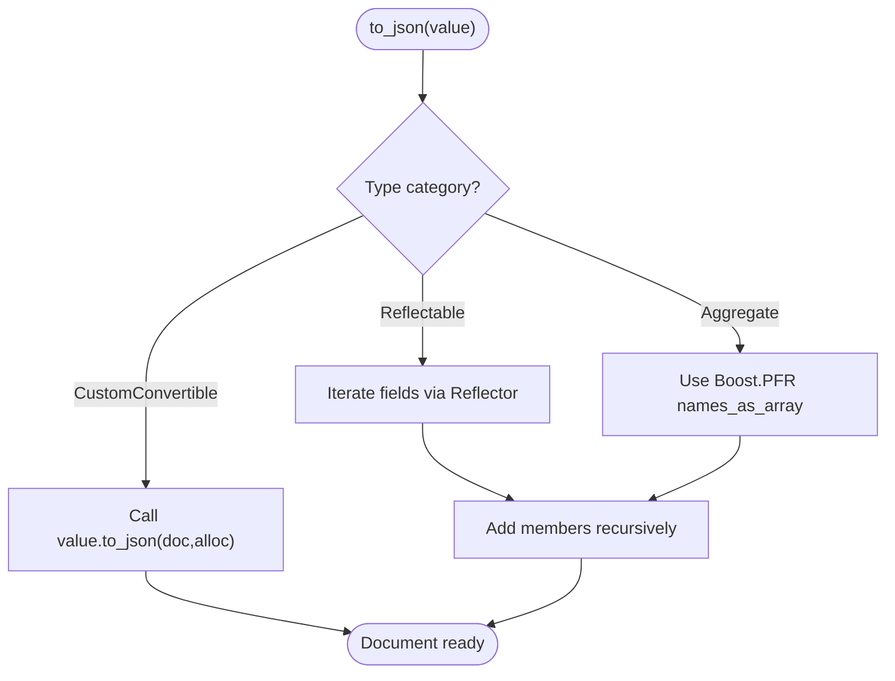
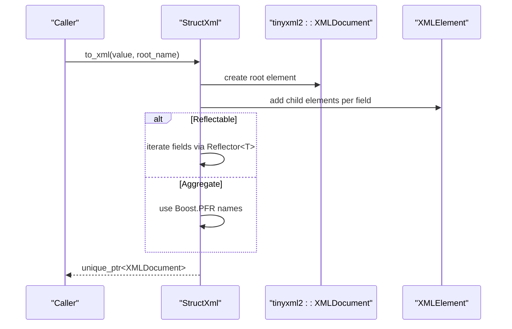
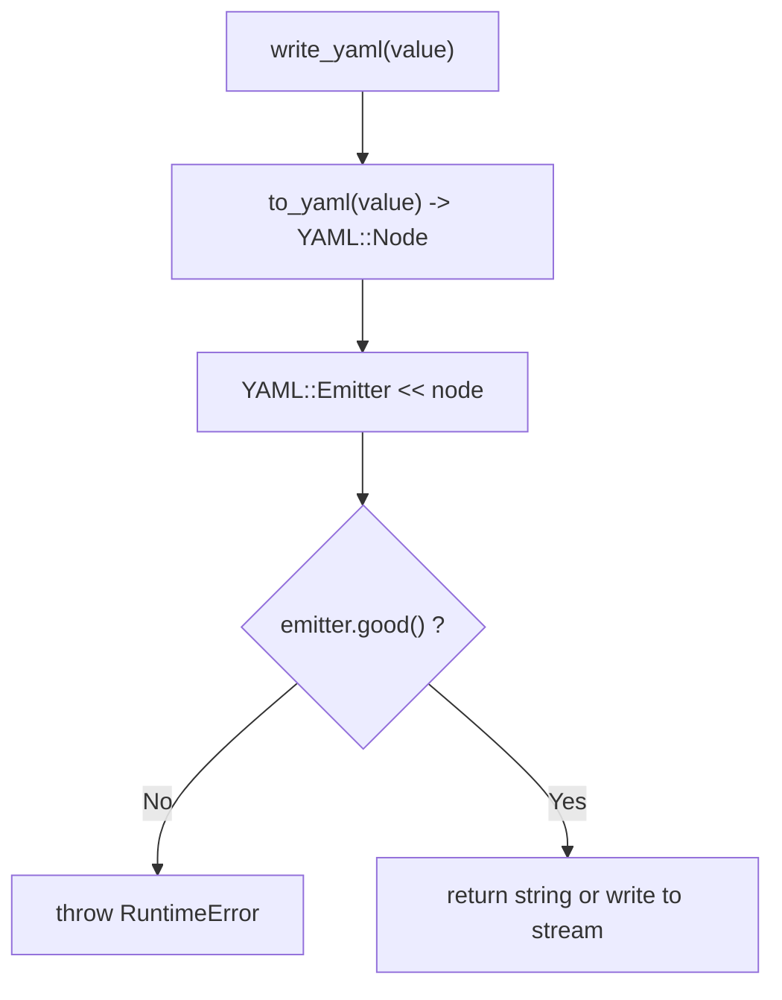
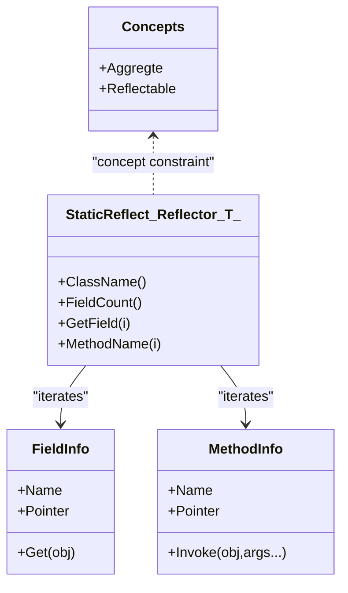
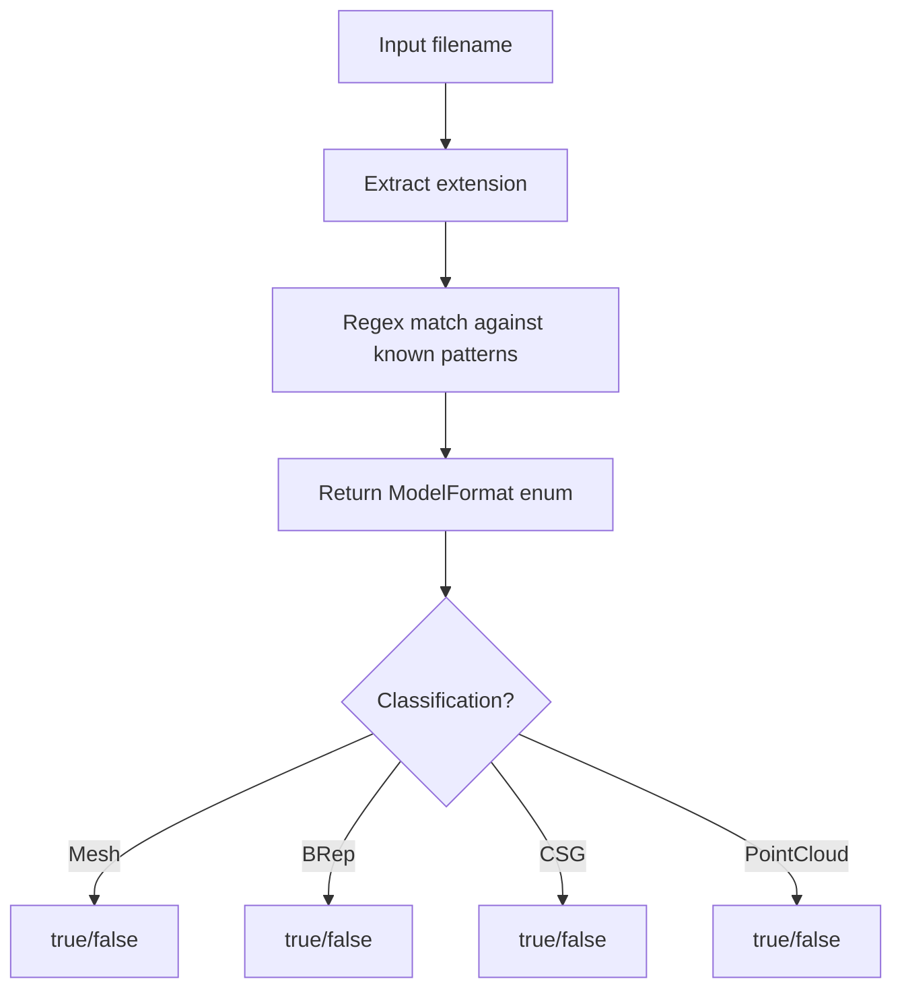
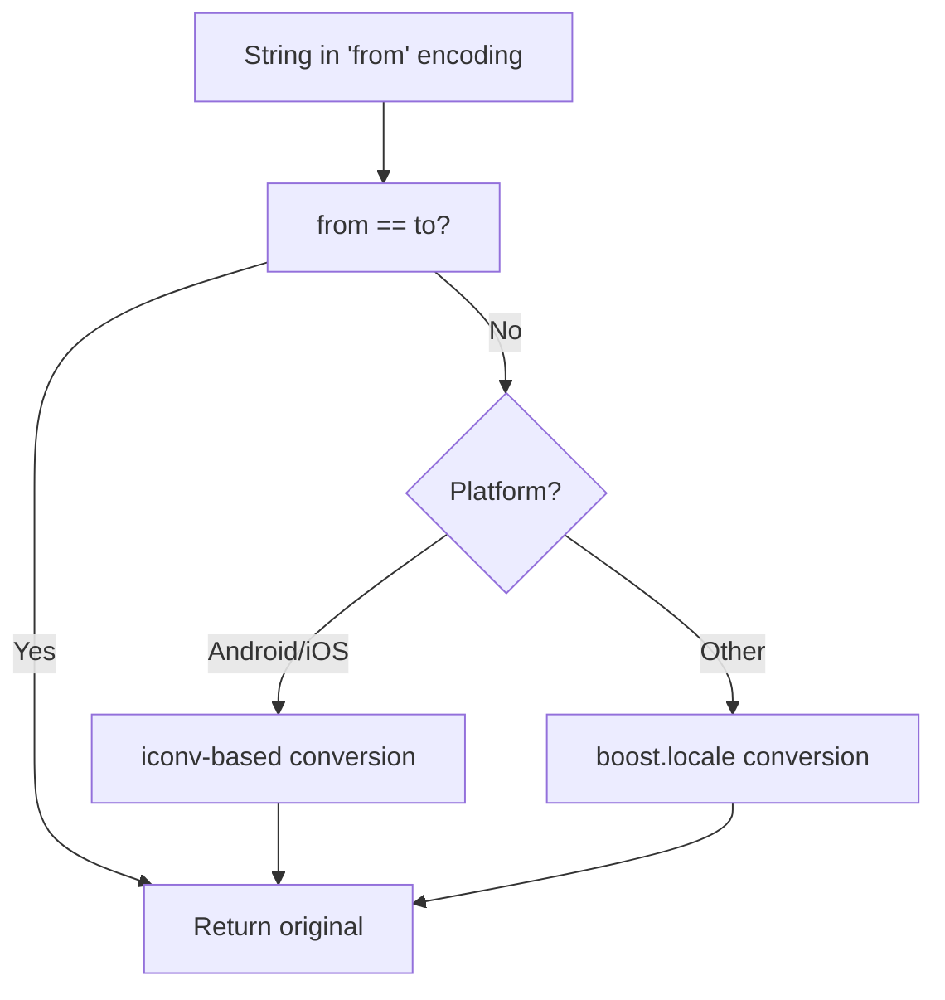
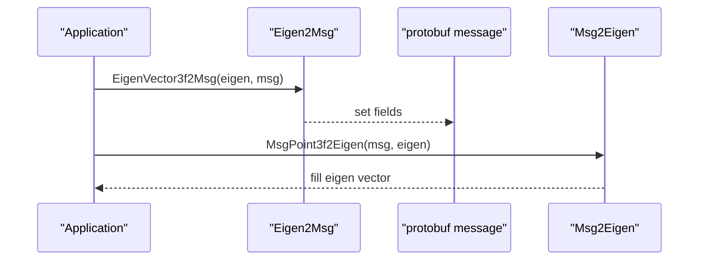
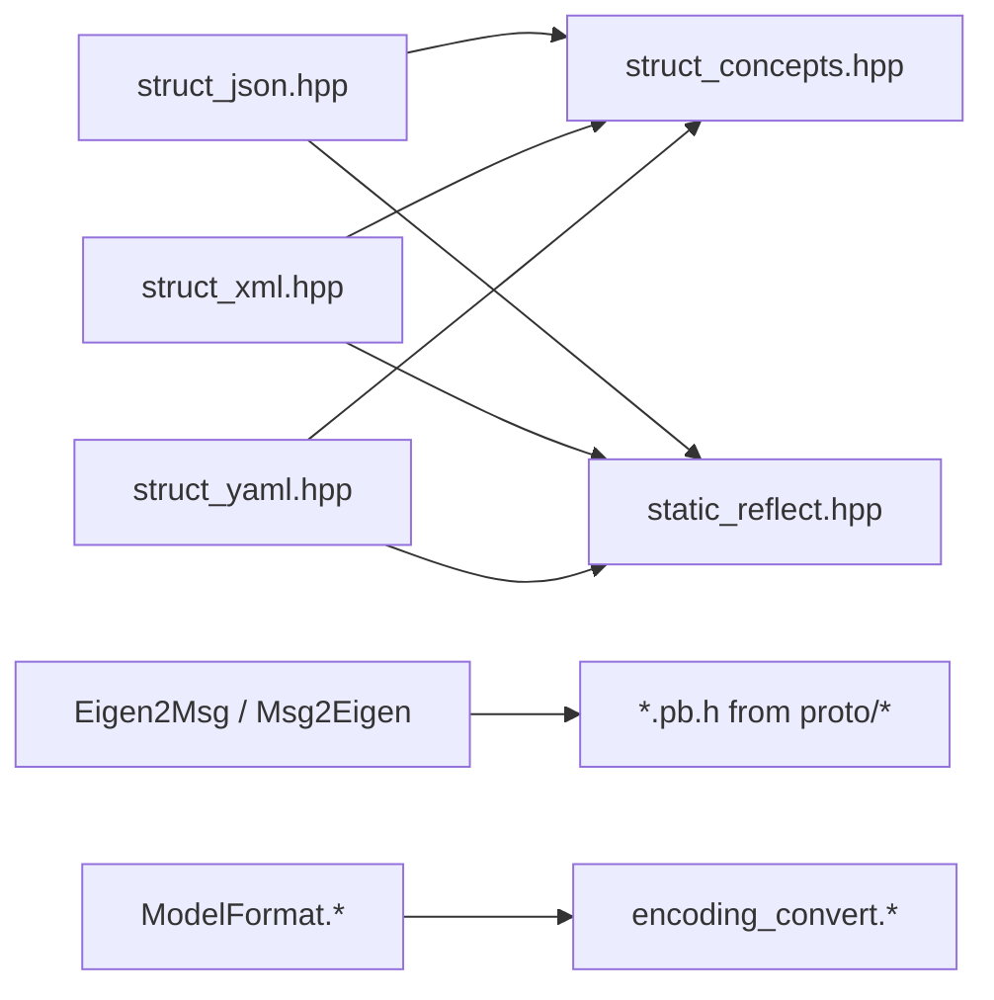

# Serialization Utilities

<cite>
**Referenced Files in This Document**
- [struct_json.hpp](file://utils/struct_json.hpp)
- [struct_xml.hpp](file://utils/struct_xml.hpp)
- [struct_yaml.hpp](file://utils/struct_yaml.hpp)
- [struct_concepts.hpp](file://utils/struct_concepts.hpp)
- [static_reflect.hpp](file://base/static_reflect.hpp)
- [ModelFormat.hpp](file://base/ModelFormat.hpp)
- [ModelFormat.cpp](file://base/ModelFormat.cpp)
- [encoding_convert.hpp](file://base/encoding_convert.hpp)
- [encoding_convert.cpp](file://base/encoding_convert.cpp)
- [Eigen2Msg.hpp](file://convert/Eigen2Msg.hpp)
- [Eigen2Msg.cpp](file://convert/Eigen2Msg.cpp)
- [Msg2Eigen.hpp](file://convert/Msg2Eigen.hpp)
- [Msg2Eigen.cpp](file://convert/Msg2Eigen.cpp)
- [point.proto](file://proto/point.proto)
- [vector.proto](file://proto/vector.proto)
- [path.proto](file://proto/path.proto)
- [transform.proto](file://proto/transform.proto)
- [boolean_operation.proto](file://proto/boolean_operation.proto)
- [base_config.proto](file://proto/base_config.proto)
- [CMakeLists.txt](file://proto/CMakeLists.txt)
</cite>

## Table of Contents
1. [Introduction](#introduction)
2. [Project Structure](#project-structure)
3. [Core Components](#core-components)
4. [Architecture Overview](#architecture-overview)
5. [Detailed Component Analysis](#detailed-component-analysis)
6. [Dependency Analysis](#dependency-analysis)
7. [Performance Considerations](#performance-considerations)
8. [Troubleshooting Guide](#troubleshooting-guide)
9. [Conclusion](#conclusion)

## Introduction
This document explains the serialization utilities provided by the project, focusing on:
- Generic JSON, XML, and YAML serializers for aggregate and reflectable types
- Static reflection integration to enable zero-boilerplate serialization
- Protocol Buffers definitions and conversion helpers between Eigen and protobuf messages
- Encoding conversion utilities used across serialization paths

The goal is to help developers understand how to serialize/deserialize C++ structures efficiently and safely, and how these components fit into the broader system architecture.

## Project Structure
Serialization-related code spans several directories:
- utils: generic struct serializers (JSON/XML/YAML), concepts, and helper headers
- base: static reflection, model format detection, encoding conversion
- convert: bidirectional conversions between Eigen and protobuf messages
- proto: protocol buffer schema files and build configuration



**Diagram sources**
- [struct_json.hpp:1-80](file://utils/struct_json.hpp#L1-L80)
- [struct_xml.hpp:1-80](file://utils/struct_xml.hpp#L1-L80)
- [struct_yaml.hpp:1-60](file://utils/struct_yaml.hpp#L1-L60)
- [struct_concepts.hpp:1-53](file://utils/struct_concepts.hpp#L1-L53)
- [static_reflect.hpp:1-188](file://base/static_reflect.hpp#L1-L188)
- [ModelFormat.hpp:1-112](file://base/ModelFormat.hpp#L1-L112)
- [ModelFormat.cpp:1-171](file://base/ModelFormat.cpp#L1-L171)
- [encoding_convert.hpp:1-280](file://base/encoding_convert.hpp#L1-L280)
- [encoding_convert.cpp:1-188](file://base/encoding_convert.cpp#L1-L188)
- [Eigen2Msg.hpp:1-34](file://convert/Eigen2Msg.hpp#L1-L34)
- [Eigen2Msg.cpp:1-145](file://convert/Eigen2Msg.cpp#L1-L145)
- [Msg2Eigen.hpp:1-33](file://convert/Msg2Eigen.hpp#L1-L33)
- [Msg2Eigen.cpp:1-119](file://convert/Msg2Eigen.cpp#L1-L119)
- [point.proto:1-16](file://proto/point.proto#L1-L16)
- [vector.proto:1-24](file://proto/vector.proto#L1-L24)
- [path.proto:1-15](file://proto/path.proto#L1-L15)
- [transform.proto:1-21](file://proto/transform.proto#L1-L21)
- [boolean_operation.proto:1-12](file://proto/boolean_operation.proto#L1-L12)
- [base_config.proto:1-132](file://proto/base_config.proto#L1-L132)
- [CMakeLists.txt:1-99](file://proto/CMakeLists.txt#L1-L99)

**Section sources**
- [struct_json.hpp:1-80](file://utils/struct_json.hpp#L1-L80)
- [struct_xml.hpp:1-80](file://utils/struct_xml.hpp#L1-L80)
- [struct_yaml.hpp:1-60](file://utils/struct_yaml.hpp#L1-L60)
- [struct_concepts.hpp:1-53](file://utils/struct_concepts.hpp#L1-L53)
- [static_reflect.hpp:1-188](file://base/static_reflect.hpp#L1-L188)
- [ModelFormat.hpp:1-112](file://base/ModelFormat.hpp#L1-L112)
- [ModelFormat.cpp:1-171](file://base/ModelFormat.cpp#L1-L171)
- [encoding_convert.hpp:1-280](file://base/encoding_convert.hpp#L1-L280)
- [encoding_convert.cpp:1-188](file://base/encoding_convert.cpp#L1-L188)
- [Eigen2Msg.hpp:1-34](file://convert/Eigen2Msg.hpp#L1-L34)
- [Eigen2Msg.cpp:1-145](file://convert/Eigen2Msg.cpp#L1-L145)
- [Msg2Eigen.hpp:1-33](file://convert/Msg2Eigen.hpp#L1-L33)
- [Msg2Eigen.cpp:1-119](file://convert/Msg2Eigen.cpp#L1-L119)
- [point.proto:1-16](file://proto/point.proto#L1-L16)
- [vector.proto:1-24](file://proto/vector.proto#L1-L24)
- [path.proto:1-15](file://proto/path.proto#L1-L15)
- [transform.proto:1-21](file://proto/transform.proto#L1-L21)
- [boolean_operation.proto:1-12](file://proto/boolean_operation.proto#L1-L12)
- [base_config.proto:1-132](file://proto/base_config.proto#L1-L132)
- [CMakeLists.txt:1-99](file://proto/CMakeLists.txt#L1-L99)

## Core Components
- JSON serializer: supports aggregates, reflectable types, enums, strings, arithmetic, ranges, and optional-like types via concept-based dispatch. Provides stream/file/string APIs.
- XML serializer: similar capabilities as JSON but using TinyXML2; handles nested elements and arrays with <array>/<item> structure.
- YAML serializer: uses yaml-cpp; provides node-level and string/stream/file APIs.
- Concepts and reflection: Aggregte and Reflectable concepts unify type selection; StaticReflect enables compile-time field introspection without RTTI.
- Model format utilities: detect mesh/BRep/CSG/point-cloud formats from file extensions and provide string representations.
- Encoding conversion: cross-platform UTF-8/local encoding conversion and Windows console helpers.
- Protobuf conversion: bidirectional helpers between Eigen vectors/matrices/transforms and protobuf messages defined in proto/*.proto.

**Section sources**
- [struct_json.hpp:1-80](file://utils/struct_json.hpp#L1-L80)
- [struct_xml.hpp:1-80](file://utils/struct_xml.hpp#L1-L80)
- [struct_yaml.hpp:1-60](file://utils/struct_yaml.hpp#L1-L60)
- [struct_concepts.hpp:1-53](file://utils/struct_concepts.hpp#L1-L53)
- [static_reflect.hpp:1-188](file://base/static_reflect.hpp#L1-L188)
- [ModelFormat.hpp:1-112](file://base/ModelFormat.hpp#L1-L112)
- [ModelFormat.cpp:1-171](file://base/ModelFormat.cpp#L1-L171)
- [encoding_convert.hpp:1-280](file://base/encoding_convert.hpp#L1-L280)
- [encoding_convert.cpp:1-188](file://base/encoding_convert.cpp#L1-L188)
- [Eigen2Msg.hpp:1-34](file://convert/Eigen2Msg.hpp#L1-L34)
- [Eigen2Msg.cpp:1-145](file://convert/Eigen2Msg.cpp#L1-L145)
- [Msg2Eigen.hpp:1-33](file://convert/Msg2Eigen.hpp#L1-L33)
- [Msg2Eigen.cpp:1-119](file://convert/Msg2Eigen.cpp#L1-L119)

## Architecture Overview
The serialization layer composes three pillars:
- Type introspection: StaticReflect + concepts guide compile-time dispatch
- Format backends: RapidJSON, TinyXML2, yaml-cpp
- Cross-language data exchange: Protobuf schemas and Eigen converters



**Diagram sources**
- [struct_json.hpp:1-80](file://utils/struct_json.hpp#L1-L80)
- [struct_xml.hpp:1-80](file://utils/struct_xml.hpp#L1-L80)
- [struct_yaml.hpp:1-60](file://utils/struct_yaml.hpp#L1-L60)
- [struct_concepts.hpp:1-53](file://utils/struct_concepts.hpp#L1-L53)
- [static_reflect.hpp:1-188](file://base/static_reflect.hpp#L1-L188)
- [Eigen2Msg.hpp:1-34](file://convert/Eigen2Msg.hpp#L1-L34)
- [Msg2Eigen.hpp:1-33](file://convert/Msg2Eigen.hpp#L1-L33)
- [ModelFormat.hpp:1-112](file://base/ModelFormat.hpp#L1-L112)
- [encoding_convert.hpp:1-280](file://base/encoding_convert.hpp#L1-L280)

## Detailed Component Analysis

### JSON Serializer (RapidJSON)
Key behaviors:
- Concept-driven dispatch over Aggregte, Reflectable, enums, strings, arithmetic, ranges, and optional-like types
- Custom allocators supported for performance-sensitive paths
- Stream, string, and file I/O helpers with parse error reporting



**Diagram sources**
- [struct_json.hpp:120-160](file://utils/struct_json.hpp#L120-L160)
- [struct_json.hpp:300-340](file://utils/struct_json.hpp#L300-L340)
- [struct_json.hpp:470-520](file://utils/struct_json.hpp#L470-L520)

**Section sources**
- [struct_json.hpp:1-80](file://utils/struct_json.hpp#L1-L80)
- [struct_json.hpp:120-160](file://utils/struct_json.hpp#L120-L160)
- [struct_json.hpp:300-340](file://utils/struct_json.hpp#L300-L340)
- [struct_json.hpp:470-520](file://utils/struct_json.hpp#L470-L520)
- [struct_json.hpp:680-750](file://utils/struct_json.hpp#L680-L750)
- [struct_json.hpp:790-850](file://utils/struct_json.hpp#L790-L850)

### XML Serializer (TinyXML2)
Key behaviors:
- Mirrors JSON semantics with element trees
- Arrays serialized as <array><item>...</item></array>
- Optional fields can be marked null via attributes



**Diagram sources**
- [struct_xml.hpp:540-590](file://utils/struct_xml.hpp#L540-L590)
- [struct_xml.hpp:110-140](file://utils/struct_xml.hpp#L110-L140)
- [struct_xml.hpp:158-248](file://utils/struct_xml.hpp#L158-L248)

**Section sources**
- [struct_xml.hpp:1-80](file://utils/struct_xml.hpp#L1-L80)
- [struct_xml.hpp:110-140](file://utils/struct_xml.hpp#L110-L140)
- [struct_xml.hpp:158-248](file://utils/struct_xml.hpp#L158-L248)
- [struct_xml.hpp:540-590](file://utils/struct_xml.hpp#L540-L590)
- [struct_xml.hpp:800-941](file://utils/struct_xml.hpp#L800-L941)

### YAML Serializer (yaml-cpp)
Key behaviors:
- Node-based API with emitter for text output
- File/stream/string read/write helpers
- Throws on invalid node types during deserialization



**Diagram sources**
- [struct_yaml.hpp:560-600](file://utils/struct_yaml.hpp#L560-L600)
- [struct_yaml.hpp:600-667](file://utils/struct_yaml.hpp#L600-L667)

**Section sources**
- [struct_yaml.hpp:1-60](file://utils/struct_yaml.hpp#L1-L60)
- [struct_yaml.hpp:544-560](file://utils/struct_yaml.hpp#L544-L560)
- [struct_yaml.hpp:560-600](file://utils/struct_yaml.hpp#L560-L600)
- [struct_yaml.hpp:600-667](file://utils/struct_yaml.hpp#L600-L667)

### Concepts and Static Reflection
Concepts constrain template dispatch; StaticReflect provides compile-time field/method metadata.



**Diagram sources**
- [struct_concepts.hpp:1-53](file://utils/struct_concepts.hpp#L1-L53)
- [static_reflect.hpp:1-188](file://base/static_reflect.hpp#L1-L188)

**Section sources**
- [struct_concepts.hpp:1-53](file://utils/struct_concepts.hpp#L1-L53)
- [static_reflect.hpp:1-188](file://base/static_reflect.hpp#L1-L188)

### Model Format Detection
Provides mapping from file extensions to internal format enums and classification helpers.



**Diagram sources**
- [ModelFormat.cpp:85-95](file://base/ModelFormat.cpp#L85-L95)
- [ModelFormat.cpp:97-171](file://base/ModelFormat.cpp#L97-L171)
- [ModelFormat.hpp:19-112](file://base/ModelFormat.hpp#L19-L112)

**Section sources**
- [ModelFormat.hpp:1-112](file://base/ModelFormat.hpp#L1-112)
- [ModelFormat.cpp:1-171](file://base/ModelFormat.cpp#L1-L171)

### Encoding Conversion
Cross-platform helpers for UTF-8/local conversions and Windows console code page management.



**Diagram sources**
- [encoding_convert.cpp:84-147](file://base/encoding_convert.cpp#L84-L147)
- [encoding_convert.hpp:20-39](file://base/encoding_convert.hpp#L20-L39)

**Section sources**
- [encoding_convert.hpp:1-280](file://base/encoding_convert.hpp#L1-L280)
- [encoding_convert.cpp:1-188](file://base/encoding_convert.cpp#L1-L188)

### Protobuf Definitions and Eigen Conversions
Protobuf schemas define geometry primitives and transforms; conversion functions bridge Eigen and protobuf.

```mermaid
erDiagram
MSG_POINT2 {
float x
float y
}
MSG_POINT3 {
float x
float y
float z
}
MSG_VECTOR2 {
float x
float y
}
MSG_VECTOR3 {
float x
float y
float z
}
MSG_PATH2 {
repeated msg_point2 point
}
MSG_PATH3 {
repeated msg_point3 point
}
MSG_TRANSFORM2 {
repeated float matrix
}
MSG_TRANSFORM3 {
repeated float matrix
}
MSG_BOOLEAN_OPERATION {
enum boolop_union
enum boolop_intersection
enum boolop_difference
enum boolop_xor
enum boolop_unknown
}
MSG_BASE_CONFIG {
int32 version
enum technology_type
enum profiles_format
enum output_type
string output_filename
}
```

**Diagram sources**
- [point.proto:1-16](file://proto/point.proto#L1-L16)
- [vector.proto:1-24](file://proto/vector.proto#L1-L24)
- [path.proto:1-15](file://proto/path.proto#L1-L15)
- [transform.proto:1-21](file://proto/transform.proto#L1-L21)
- [boolean_operation.proto:1-12](file://proto/boolean_operation.proto#L1-L12)
- [base_config.proto:1-132](file://proto/base_config.proto#L1-L132)



**Diagram sources**
- [Eigen2Msg.cpp:1-145](file://convert/Eigen2Msg.cpp#L1-L145)
- [Msg2Eigen.cpp:1-119](file://convert/Msg2Eigen.cpp#L1-L119)
- [Eigen2Msg.hpp:1-34](file://convert/Eigen2Msg.hpp#L1-L34)
- [Msg2Eigen.hpp:1-33](file://convert/Msg2Eigen.hpp#L1-L33)

**Section sources**
- [point.proto:1-16](file://proto/point.proto#L1-L16)
- [vector.proto:1-24](file://proto/vector.proto#L1-L24)
- [path.proto:1-15](file://proto/path.proto#L1-L15)
- [transform.proto:1-21](file://proto/transform.proto#L1-L21)
- [boolean_operation.proto:1-12](file://proto/boolean_operation.proto#L1-L12)
- [base_config.proto:1-132](file://proto/base_config.proto#L1-L132)
- [Eigen2Msg.hpp:1-34](file://convert/Eigen2Msg.hpp#L1-L34)
- [Eigen2Msg.cpp:1-145](file://convert/Eigen2Msg.cpp#L1-L145)
- [Msg2Eigen.hpp:1-33](file://convert/Msg2Eigen.hpp#L1-L33)
- [Msg2Eigen.cpp:1-119](file://convert/Msg2Eigen.cpp#L1-L119)
- [CMakeLists.txt:1-99](file://proto/CMakeLists.txt#L1-L99)

## Dependency Analysis
- JSON/XML/YAML serializers depend on:
  - Concepts (Aggregte, Reflectable)
  - StaticReflect for reflectable types
  - Third-party libraries: RapidJSON, TinyXML2, yaml-cpp
- Protobuf conversion depends on generated headers from proto/*.proto and Eigen
- ModelFormat depends on filesystem and regex utilities
- Encoding conversion depends on platform-specific implementations (Windows API, boost.locale, iconv)



**Diagram sources**
- [struct_json.hpp:1-80](file://utils/struct_json.hpp#L1-L80)
- [struct_xml.hpp:1-80](file://utils/struct_xml.hpp#L1-L80)
- [struct_yaml.hpp:1-60](file://utils/struct_yaml.hpp#L1-L60)
- [struct_concepts.hpp:1-53](file://utils/struct_concepts.hpp#L1-L53)
- [static_reflect.hpp:1-188](file://base/static_reflect.hpp#L1-L188)
- [Eigen2Msg.hpp:1-34](file://convert/Eigen2Msg.hpp#L1-L34)
- [Msg2Eigen.hpp:1-33](file://convert/Msg2Eigen.hpp#L1-L33)
- [ModelFormat.hpp:1-112](file://base/ModelFormat.hpp#L1-L112)
- [encoding_convert.hpp:1-280](file://base/encoding_convert.hpp#L1-L280)

**Section sources**
- [struct_json.hpp:1-80](file://utils/struct_json.hpp#L1-L80)
- [struct_xml.hpp:1-80](file://utils/struct_xml.hpp#L1-L80)
- [struct_yaml.hpp:1-60](file://utils/struct_yaml.hpp#L1-L60)
- [struct_concepts.hpp:1-53](file://utils/struct_concepts.hpp#L1-L53)
- [static_reflect.hpp:1-188](file://base/static_reflect.hpp#L1-L188)
- [Eigen2Msg.hpp:1-34](file://convert/Eigen2Msg.hpp#L1-L34)
- [Msg2Eigen.hpp:1-33](file://convert/Msg2Eigen.hpp#L1-L33)
- [ModelFormat.hpp:1-112](file://base/ModelFormat.hpp#L1-L112)
- [encoding_convert.hpp:1-280](file://base/encoding_convert.hpp#L1-L280)

## Performance Considerations
- Prefer custom allocator variants for JSON when serializing large objects repeatedly
- Use compact JSON writer for network payloads; pretty-print only for debugging
- For XML, avoid deep nesting where possible; consider streaming if memory is constrained
- YAML emitter errors are thrown early; validate inputs before emitting
- Protobuf conversions are linear in number of points/matrix size; batch operations when possible
- ModelFormat regex matching runs once per filename; cache results if processing many files

[No sources needed since this section provides general guidance]

## Troubleshooting Guide
Common issues and resolutions:
- JSON parse errors: check input string validity and ensure object structure matches target type
- XML missing root/array elements: verify document structure and that array elements are named correctly
- YAML invalid node types: ensure nodes are maps when expecting map-backed types
- Unsupported field/item types: extend serializers by adding overloads or implementing custom conversion interfaces
- Encoding mismatches: use utf8_to_local/local_to_utf8 around file I/O on platforms with non-UTF-8 locales
- Protobuf dimension mismatches: validate matrix sizes before converting to Eigen matrices

**Section sources**
- [struct_json.hpp:790-850](file://utils/struct_json.hpp#L790-L850)
- [struct_xml.hpp:800-941](file://utils/struct_xml.hpp#L800-L941)
- [struct_yaml.hpp:544-600](file://utils/struct_yaml.hpp#L544-L600)
- [encoding_convert.cpp:84-147](file://base/encoding_convert.cpp#L84-L147)
- [Msg2Eigen.cpp:79-119](file://convert/Msg2Eigen.cpp#L79-L119)

## Conclusion
The serialization utilities provide a cohesive, type-safe, and high-performance foundation for persisting and exchanging structured data across multiple formats. By leveraging compile-time reflection and strong concepts, they minimize boilerplate while supporting complex nested structures. The protobuf conversion layer integrates seamlessly with geometry-heavy workflows, and encoding helpers ensure robustness across platforms.

[No sources needed since this section summarizes without analyzing specific files]