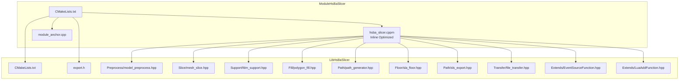
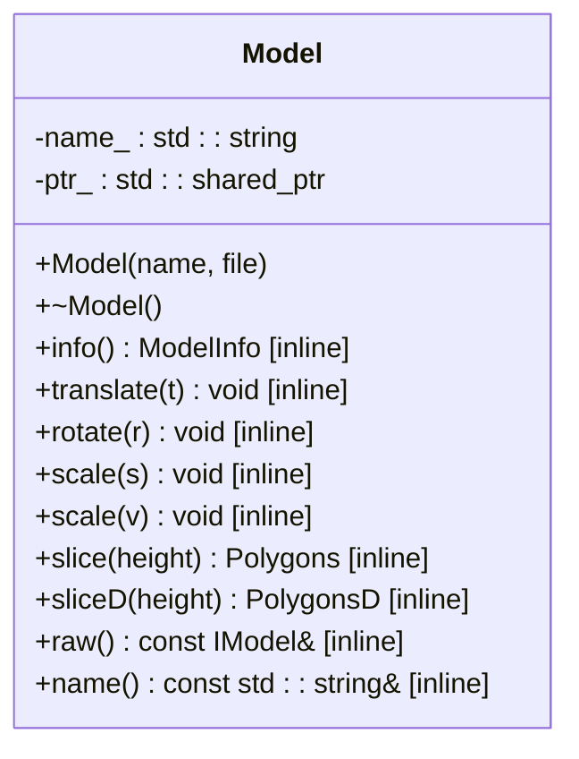
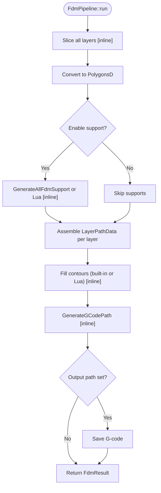
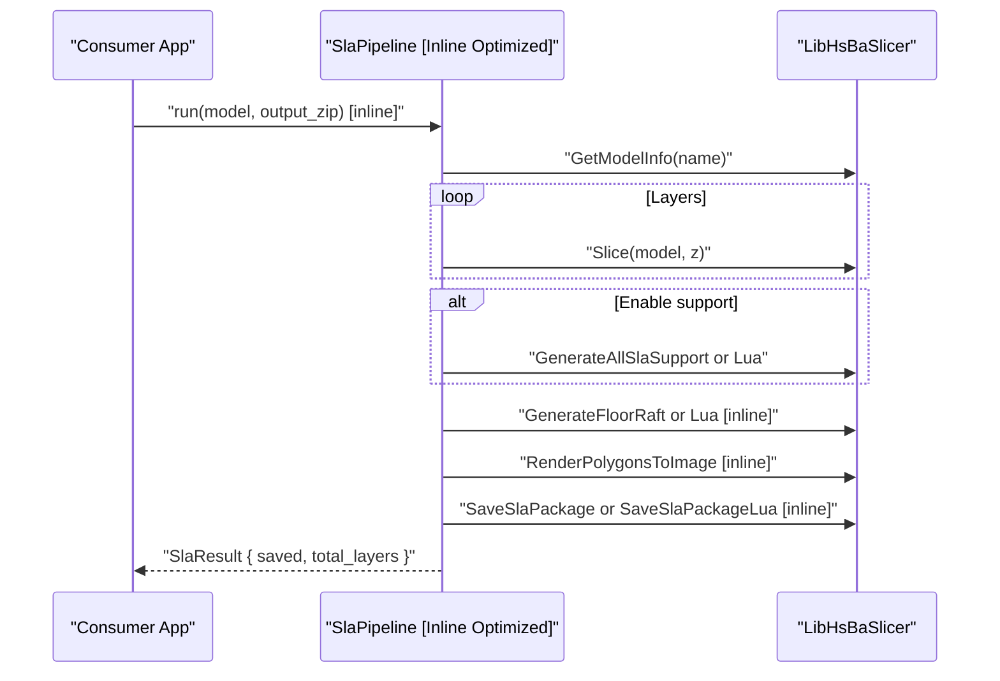
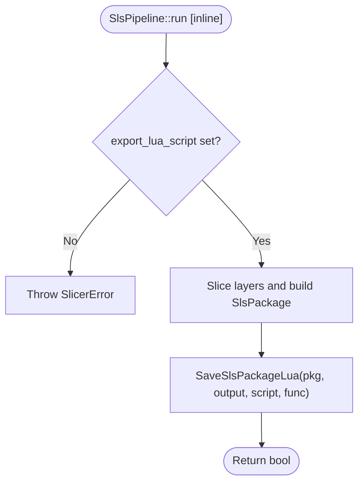
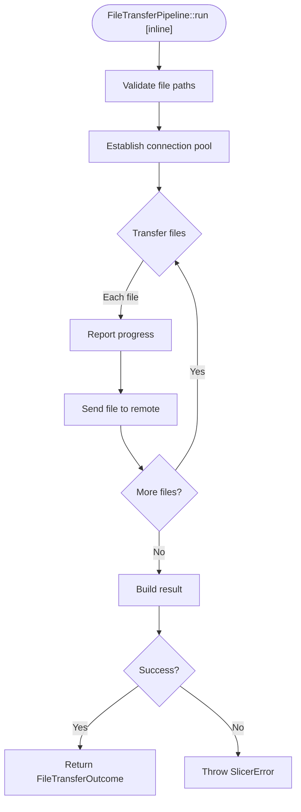
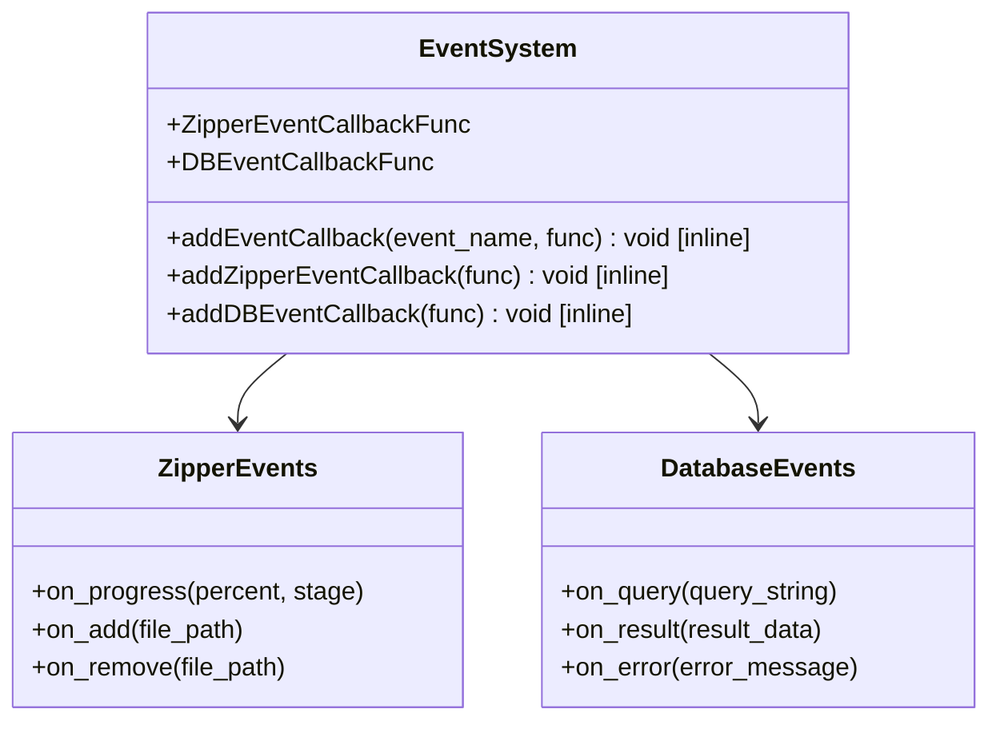
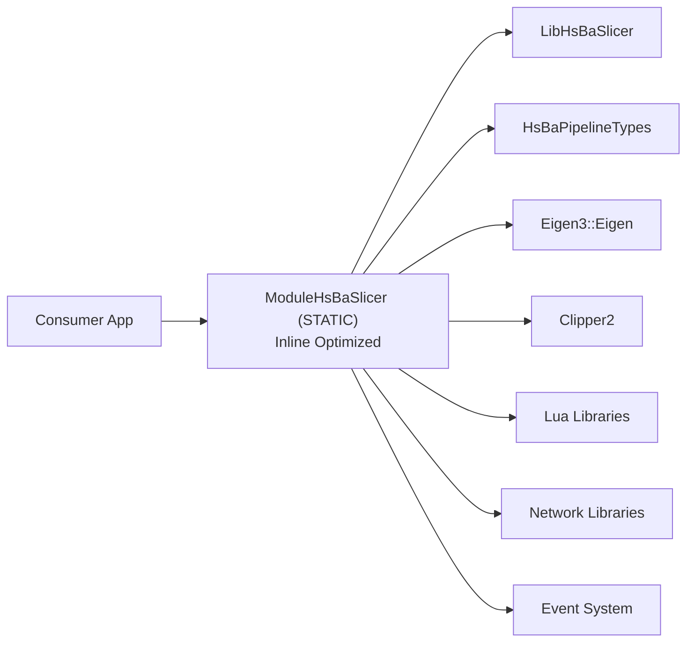

# C++20 Module Wrapper (ModuleHsBaSlicer)

<cite>
**Referenced Files in This Document**
- [CMakeLists.txt](file://ModuleHsBaSlicer/CMakeLists.txt)
- [hsba_slicer.cppm](file://ModuleHsBaSlicer/hsba_slicer.cppm)
- [module_anchor.cpp](file://ModuleHsBaSlicer/module_anchor.cpp)
- [CMakeLists.txt](file://LibHsBaSlicer/CMakeLists.txt)
- [export.h](file://LibHsBaSlicer/export.h)
- [model_preprocess.hpp](file://LibHsBaSlicer/Preprocess/model_preprocess.hpp)
- [mesh_slice.hpp](file://LibHsBaSlicer/Slice/mesh_slice.hpp)
- [fdm_support.hpp](file://LibHsBaSlicer/Support/fdm_support.hpp)
- [polygon_fill.hpp](file://LibHsBaSlicer/Fill/polygon_fill.hpp)
- [path_generator.hpp](file://LibHsBaSlicer/Path/path_generator.hpp)
- [sla_floor.hpp](file://LibHsBaSlicer/Floor/sla_floor.hpp)
- [sls_export.hpp](file://LibHsBaSlicer/Path/sls_export.hpp)
- [file_transfer.hpp](file://LibHsBaSlicer/Transfer/file_transfer.hpp)
- [EventSourceFunction.hpp](file://LibHsBaSlicer/Extends/EventSourceFunction.hpp)
- [LuaAddFunction.hpp](file://LibHsBaSlicer/Extends/LuaAddFunction.hpp)
- [pipeline_types.h](file://pipelinetypes/pipeline_types.h)
</cite>

## Update Summary
**Changes Made**
- Added comprehensive FileTransferPipeline class with synchronous and asynchronous execution support
- Expanded event callback system with Zipper and Database event handlers
- Enhanced Lua integration with new function registration capabilities for different pipeline stages
- Updated type aliases and configuration structures to support file transfer operations
- Added progress reporting mechanisms for file transfer operations

## Table of Contents
1. [Introduction](#introduction)
2. [Project Structure](#project-structure)
3. [Core Components](#core-components)
4. [Architecture Overview](#architecture-overview)
5. [Detailed Component Analysis](#detailed-component-analysis)
6. [Dependency Analysis](#dependency-analysis)
7. [Performance Considerations](#performance-considerations)
8. [Troubleshooting Guide](#troubleshooting-guide)
9. [Conclusion](#conclusion)

## Introduction
This document describes the C++20 module wrapper named ModuleHsBaSlicer, which provides a modern class-based API over LibHsBaSlicer's free functions. The module exposes a cohesive set of classes and utilities for FDM, SLA, SLS workflows, along with Lua-driven customization points and **new file transfer capabilities**. It is designed to be imported via `import hsba.slicer;` and linked as a static library, while internally forwarding calls to LibHsBaSlicer.

Key goals:
- Provide RAII model management and exception-based error handling.
- Offer high-level pipeline classes that encapsulate slicing, support generation, filling, path generation, floor creation, rendering, packaging, and **file transfer operations**.
- Maintain compatibility with existing LibHsBaSlicer APIs and configuration types.
- **Optimize runtime performance through strategic inline function declarations for frequently-called methods.**
- **Enable comprehensive event-driven programming through robust callback systems.**

## Project Structure
The module resides under ModuleHsBaSlicer and consists of:
- A single-file module interface unit containing both declarations and definitions to avoid MSVC implicit-import issues.
- A small anchor source to ensure the static library archive is produced by the archiver.
- CMake configuration that declares the module FILE_SET and links against LibHsBaSlicer and required dependencies.



**Diagram sources**
- [CMakeLists.txt:1-46](file://ModuleHsBaSlicer/CMakeLists.txt#L1-L46)
- [hsba_slicer.cppm:1-788](file://ModuleHsBaSlicer/hsba_slicer.cppm#L1-L788)
- [module_anchor.cpp:1-13](file://ModuleHsBaSlicer/module_anchor.cpp#L1-L13)
- [CMakeLists.txt:1-78](file://LibHsBaSlicer/CMakeLists.txt#L1-L78)
- [export.h:1-15](file://LibHsBaSlicer/export.h#L1-L15)
- [model_preprocess.hpp:1-88](file://LibHsBaSlicer/Preprocess/model_preprocess.hpp#L1-L88)
- [mesh_slice.hpp:1-41](file://LibHsBaSlicer/Slice/mesh_slice.hpp#L1-L41)
- [fdm_support.hpp:1-68](file://LibHsBaSlicer/Support/fdm_support.hpp#L1-L68)
- [polygon_fill.hpp:1-54](file://LibHsBaSlicer/Fill/polygon_fill.hpp#L1-L54)
- [path_generator.hpp:1-62](file://LibHsBaSlicer/Path/path_generator.hpp#L1-L62)
- [sla_floor.hpp:1-183](file://LibHsBaSlicer/Floor/sla_floor.hpp#L1-L183)
- [sls_export.hpp:1-52](file://LibHsBaSlicer/Path/sls_export.hpp#L1-L52)
- [file_transfer.hpp:1-61](file://LibHsBaSlicer/Transfer/file_transfer.hpp#L1-L61)
- [EventSourceFunction.hpp:1-40](file://LibHsBaSlicer/Extends/EventSourceFunction.hpp#L1-L40)
- [LuaAddFunction.hpp:1-39](file://LibHsBaSlicer/Extends/LuaAddFunction.hpp#L1-L39)

**Section sources**
- [CMakeLists.txt:1-46](file://ModuleHsBaSlicer/CMakeLists.txt#L1-L46)
- [hsba_slicer.cppm:1-788](file://ModuleHsBaSlicer/hsba_slicer.cppm#L1-L788)
- [module_anchor.cpp:1-13](file://ModuleHsBaSlicer/module_anchor.cpp#L1-L13)

## Core Components
The module exports a cohesive API surface under namespace HsBa::Slicer:

- Exception type:
  - SlicerError: Base exception for slicer errors.

- Type aliases and re-exports:
  - Clipper2 polygon types: Point2, Polygon, Polygons, Point2D, PolygonD, PolygonsD.
  - Pipeline config/result enums and structs from pipeline_types.h.
  - Support configuration types from Support namespace.
  - Default config factories: defaultFdmConfig(), defaultSlaConfig(), defaultSlsConfig(), **defaultFileTransferConfig()**.
  - **Event callback function types: ZipperEventCallbackFunc, DBEventCallbackFunc**.
  - **File transfer progress callback type: FileTransferProgressFunc**.

- Model (RAII):
  - Model: Loads a model into an internal pool on construction, manages lifetime, exposes transforms, slicing, and raw access.
  - **Performance Optimization**: Move constructor, move assignment, info(), translate(), rotate(), scale(), slice(), sliceD(), raw(), and name() are declared inline for optimal performance.

- Pipelines:
  - FdmPipeline: Full FDM workflow (slice -> support -> fill -> path), plus stepwise helpers.
    - **Performance Optimization**: sliceAll(), generateSupports(), fill(), and generatePath() are declared inline.
  - SlaPipeline: Full SLA workflow (slice -> support -> floor -> render -> package).
    - **Performance Optimization**: run(), generateFloor(), renderLayer(), and savePackage() are declared inline.
  - SlsPipeline: SLS export driven by Lua scripts.
    - **Performance Optimization**: run() method is declared inline.
  - **FileTransferPipeline**: Complete file transfer workflow with validation, connection pooling, and progress reporting.
    - **Performance Optimization**: run() methods are declared inline for optimal performance.

- **Event System**:
  - addEventCallback(): Register event callbacks by name (e.g., "zipper.on_add", "db.on_query").
  - addZipperEventCallback(): Register C++ event callbacks for zipper operations.
  - addDBEventCallback(): Register C++ event callbacks for database operations.

- **Lua Customization**:
  - luaCustomFill, luaCustomFloor, luaCustomSupport - all declared inline for performance.
  - add2DFunction(), add3DFunction(), addFileFunction() - register external Lua functions for different pipeline stages.

- Utilities:
  - versionJson(), versionXml() - declared inline for performance.
  - toDouble(), toInt() - declared inline for performance.

These components wrap LibHsBaSlicer free functions and provide a consistent, exception-based, object-oriented interface with optimized inline implementations for frequently-called operations.

**Section sources**
- [hsba_slicer.cppm:60-344](file://ModuleHsBaSlicer/hsba_slicer.cppm#L60-L344)
- [pipeline_types.h:1-491](file://pipelinetypes/pipeline_types.h#L1-L491)

## Architecture Overview
At runtime, consumers import the module and call methods on the exported classes. Internally, these methods forward to LibHsBaSlicer functions such as LoadModel, Slice, GenerateAllFdmSupport, FillWithBorder, GenerateGCodePath, GenerateFloorRaft, RenderPolygonsToImage, SaveSlaPackage, SaveSlsPackageLua, **TransferFiles**, and various event callback functions.

The inline function optimization ensures that frequently-called methods like slicing operations, accessor functions, simple transformations, and file transfer operations are inlined at compile-time, reducing function call overhead and improving overall performance.

```mermaid
sequenceDiagram
participant App as "Consumer App"
participant Mod as "ModuleHsBaSlicer<br/>Inline Optimized"
participant Lib as "LibHsBaSlicer"
App->>Mod : "import hsba.slicer;"
App->>Mod : "Model m(name, file)"
Note over Mod : "Inline constructor & destructor"
Mod->>Lib : "LoadModel(name, file)"
App->>Mod : "FileTransferPipeline.run(config)"
Note over Mod : "Inline run() method"
Mod->>Lib : "TransferFiles(config, progress)"
loop "For each file"
Mod->>Lib : "Validate file existence"
Mod->>Lib : "Establish connection pool"
Mod->>Lib : "Send file with progress"
end
Mod-->>App : "FileTransferOutcome { success, files_transferred }"
```

**Diagram sources**
- [hsba_slicer.cppm:689-725](file://ModuleHsBaSlicer/hsba_slicer.cppm#L689-L725)
- [file_transfer.hpp:45-56](file://LibHsBaSlicer/Transfer/file_transfer.hpp#L45-L56)
- [EventSourceFunction.hpp:21-26](file://LibHsBaSlicer/Extends/EventSourceFunction.hpp#L21-L26)
- [LuaAddFunction.hpp:19-24](file://LibHsBaSlicer/Extends/LuaAddFunction.hpp#L19-L24)

## Detailed Component Analysis

### Class Model
Responsibilities:
- RAII ownership of a model name and shared pointer to IModel.
- Construction loads the model into the global pool; destruction removes it.
- Exposes transforms (translate, rotate, scale), info retrieval, slicing at integer or double precision, and direct access to the underlying IModel.

Design notes:
- Move semantics are supported; copy is disabled.
- Errors during load throw SlicerError.
- **Performance Enhancement**: All core methods including move constructor, move assignment, info(), translate(), rotate(), scale(), slice(), sliceD(), raw(), and name() are declared inline to eliminate function call overhead for frequently-accessed operations.



**Diagram sources**
- [hsba_slicer.cppm:130-168](file://ModuleHsBaSlicer/hsba_slicer.cppm#L130-L168)
- [hsba_slicer.cppm:366-414](file://ModuleHsBaSlicer/hsba_slicer.cppm#L366-L414)
- [model_preprocess.hpp:35-83](file://LibHsBaSlicer/Preprocess/model_preprocess.hpp#L35-L83)

**Section sources**
- [hsba_slicer.cppm:130-168](file://ModuleHsBaSlicer/hsba_slicer.cppm#L130-L168)
- [hsba_slicer.cppm:366-414](file://ModuleHsBaSlicer/hsba_slicer.cppm#L366-L414)
- [model_preprocess.hpp:35-83](file://LibHsBaSlicer/Preprocess/model_preprocess.hpp#L35-L83)

### FDM Pipeline
Responsibilities:
- Encapsulates full FDM flow: slice all layers, generate supports, fill contours, assemble LayerPathData, generate G-code paths, and optionally save output.
- Provides stepwise helpers for reuse or inspection.

Key behaviors:
- Uses first_layer_height for layer zero and subsequent layer heights based on cfg_.layer_height.
- Supports Lua-based support and infill customization when configured.
- Converts between integer and double polygons where needed.
- **Performance Enhancement**: Core methods sliceAll(), generateSupports(), fill(), and generatePath() are declared inline to optimize frequently-called operations.



**Diagram sources**
- [hsba_slicer.cppm:503-550](file://ModuleHsBaSlicer/hsba_slicer.cppm#L503-L550)
- [fdm_support.hpp:32-63](file://LibHsBaSlicer/Support/fdm_support.hpp#L32-L63)
- [polygon_fill.hpp:32-49](file://LibHsBaSlicer/Fill/polygon_fill.hpp#L32-L49)
- [path_generator.hpp:45-46](file://LibHsBaSlicer/Path/path_generator.hpp#L45-L46)

**Section sources**
- [hsba_slicer.cppm:182-202](file://ModuleHsBaSlicer/hsba_slicer.cppm#L182-L202)
- [hsba_slicer.cppm:420-550](file://ModuleHsBaSlicer/hsba_slicer.cppm#L420-L550)
- [fdm_support.hpp:32-63](file://LibHsBaSlicer/Support/fdm_support.hpp#L32-L63)
- [polygon_fill.hpp:32-49](file://LibHsBaSlicer/Fill/polygon_fill.hpp#L32-L49)
- [path_generator.hpp:45-46](file://LibHsBaSlicer/Path/path_generator.hpp#L45-L46)

### SLA Pipeline
Responsibilities:
- Full SLA flow: slice layers, optional support, floor/raft generation, image rendering, and packaging into a zip.
- Supports Lua-based support, floor, and export customization.

Key behaviors:
- Computes number of layers from bounding box height and layer height.
- Generates floor from bottom layer using built-in or Lua logic.
- Renders images and saves package via SaveSlaPackage or SaveSlaPackageLua.
- **Performance Enhancement**: Core methods run(), generateFloor(), renderLayer(), and savePackage() are declared inline for optimal performance.



**Diagram sources**
- [hsba_slicer.cppm:592-655](file://ModuleHsBaSlicer/hsba_slicer.cppm#L592-L655)
- [sla_floor.hpp:132-178](file://LibHsBaSlicer/Floor/sla_floor.hpp#L132-L178)
- [fdm_support.hpp:45-63](file://LibHsBaSlicer/Support/fdm_support.hpp#L45-L63)

**Section sources**
- [hsba_slicer.cppm:216-235](file://ModuleHsBaSlicer/hsba_slicer.cppm#L216-L235)
- [hsba_slicer.cppm:556-655](file://ModuleHsBaSlicer/hsba_slicer.cppm#L556-L655)
- [sla_floor.hpp:132-178](file://LibHsBaSlicer/Floor/sla_floor.hpp#L132-L178)

### SLS Pipeline
Responsibilities:
- SLS export is entirely Lua-driven. The pipeline slices layers and passes them to SaveSlsPackageLua with provided script and function name.

Key behaviors:
- Requires export_lua_script to be set; otherwise throws SlicerError.
- Builds SlsPackage with outlines and Z heights.
- **Performance Enhancement**: The run() method is declared inline to optimize the primary entry point.



**Diagram sources**
- [hsba_slicer.cppm:663-686](file://ModuleHsBaSlicer/hsba_slicer.cppm#L663-L686)
- [sls_export.hpp:45-47](file://LibHsBaSlicer/Path/sls_export.hpp#L45-L47)

**Section sources**
- [hsba_slicer.cppm:242-253](file://ModuleHsBaSlicer/hsba_slicer.cppm#L242-L253)
- [hsba_slicer.cppm:661-686](file://ModuleHsBaSlicer/hsba_slicer.cppm#L661-L686)
- [sls_export.hpp:45-47](file://LibHsBaSlicer/Path/sls_export.hpp#L45-L47)

### File Transfer Pipeline
Responsibilities:
- Complete file transfer workflow with validation, connection pooling, and progress reporting.
- Supports both synchronous and asynchronous execution modes.
- Provides detailed progress tracking and error handling.

Key behaviors:
- Validates file existence before transfer attempts.
- Establishes connection pools for efficient file transfers.
- Reports progress through callback functions with percentage and stage information.
- Handles both successful and failed transfer scenarios with detailed error messages.
- **Performance Enhancement**: Both run() methods are declared inline for optimal performance.



**Diagram sources**
- [hsba_slicer.cppm:692-725](file://ModuleHsBaSlicer/hsba_slicer.cppm#L692-L725)
- [file_transfer.hpp:45-56](file://LibHsBaSlicer/Transfer/file_transfer.hpp#L45-L56)

**Section sources**
- [hsba_slicer.cppm:268-283](file://ModuleHsBaSlicer/hsba_slicer.cppm#L268-L283)
- [hsba_slicer.cppm:689-725](file://ModuleHsBaSlicer/hsba_slicer.cppm#L689-L725)
- [file_transfer.hpp:19-56](file://LibHsBaSlicer/Transfer/file_transfer.hpp#L19-L56)

### Event System
Responsibilities:
- Provides comprehensive event-driven programming capabilities for various system operations.
- Supports multiple event types including zipper operations and database queries.
- Enables flexible callback registration and management.

Key features:
- addEventCallback(): Register custom event handlers by name.
- addZipperEventCallback(): Handle zipper-related events with progress and status updates.
- addDBEventCallback(): Manage database operation events with query and result information.
- **Performance Enhancement**: All event registration functions are declared inline for optimal performance.



**Diagram sources**
- [hsba_slicer.cppm:317-324](file://ModuleHsBaSlicer/hsba_slicer.cppm#L317-L324)
- [EventSourceFunction.hpp:14-26](file://LibHsBaSlicer/Extends/EventSourceFunction.hpp#L14-L26)

**Section sources**
- [hsba_slicer.cppm:317-324](file://ModuleHsBaSlicer/hsba_slicer.cppm#L317-L324)
- [EventSourceFunction.hpp:14-26](file://LibHsBaSlicer/Extends/EventSourceFunction.hpp#L14-L26)

### Lua Customization Functions
Responsibilities:
- Provide convenient wrappers around LibHsBaSlicer Lua integration for fill, floor, and support generation.
- Enable advanced customization through external Lua scripts and functions.

Usage:
- luaCustomFill: custom fill pattern via Lua script file.
- luaCustomFloor: custom floor via Lua script file.
- luaCustomSupport: custom support via inline Lua script.
- add2DFunction(), add3DFunction(), addFileFunction(): Register external Lua functions for different pipeline stages.
- **Performance Enhancement**: All functions are declared inline for optimal performance when called frequently.

**Section sources**
- [hsba_slicer.cppm:289-302](file://ModuleHsBaSlicer/hsba_slicer.cppm#L289-L302)
- [hsba_slicer.cppm:308-316](file://ModuleHsBaSlicer/hsba_slicer.cppm#L308-L316)
- [hsba_slicer.cppm:731-749](file://ModuleHsBaSlicer/hsba_slicer.cppm#L731-L749)
- [hsba_slicer.cppm:755-771](file://ModuleHsBaSlicer/hsba_slicer.cppm#L755-L771)
- [LuaAddFunction.hpp:19-24](file://LibHsBaSlicer/Extends/LuaAddFunction.hpp#L19-L24)

## Dependency Analysis
ModuleHsBaSlicer depends on:
- LibHsBaSlicer (static or shared depending on build settings).
- HsBaPipelineTypes for C-compatible config/result types.
- Eigen3 for geometry operations.
- Clipper2 for polygon math.
- Lua libraries for scripting integration.
- **File transfer libraries for network operations**.
- **Event system libraries for callback management**.

Build-time considerations:
- Single-file module avoids MSVC implicit-import issues.
- Static library ensures consumers link directly and avoid DLL linkage quirks.
- Compiler flags and definitions are propagated to consumers to maintain ABI consistency across CGAL/Eigen boundaries.
- **Inline optimization strategy**: Frequently-called methods are marked inline to reduce function call overhead while maintaining clean separation between interface and implementation.



**Diagram sources**
- [CMakeLists.txt:12-29](file://ModuleHsBaSlicer/CMakeLists.txt#L12-L29)
- [CMakeLists.txt:1-78](file://LibHsBaSlicer/CMakeLists.txt#L1-L78)
- [hsba_slicer.cppm:38-59](file://ModuleHsBaSlicer/hsba_slicer.cppm#L38-L59)

**Section sources**
- [CMakeLists.txt:1-46](file://ModuleHsBaSlicer/CMakeLists.txt#L1-L46)
- [CMakeLists.txt:1-78](file://LibHsBaSlicer/CMakeLists.txt#L1-L78)
- [hsba_slicer.cppm:38-59](file://ModuleHsBaSlicer/hsba_slicer.cppm#L38-L59)

## Performance Considerations
**Updated** Added comprehensive inline function optimization analysis and new file transfer performance optimizations

### Inline Function Optimization Strategy
The module implements strategic inline function declarations for 31 frequently-called methods across the core classes:

#### Model Class Optimizations
- **Move Operations**: `Model(Model&&)` and `operator=(Model&&)` - eliminated move overhead
- **Accessors**: `info()`, `raw()`, `name()` - direct access without function call overhead
- **Transformations**: `translate()`, `rotate()`, `scale()` - frequent geometric operations
- **Slicing**: `slice()`, `sliceD()` - core slicing operations called per layer

#### Pipeline Optimizations
- **FdmPipeline**: `sliceAll()`, `generateSupports()`, `fill()`, `generatePath()` - core processing methods
- **SlaPipeline**: `run()`, `generateFloor()`, `renderLayer()`, `savePackage()` - main workflow methods  
- **SlsPipeline**: `run()` - primary export method
- **FileTransferPipeline**: `run()` methods - file transfer operations optimized for performance

#### Event System Optimizations
- **Event Registration**: `addEventCallback()`, `addZipperEventCallback()`, `addDBEventCallback()` - event setup operations
- **Lua Integration**: `add2DFunction()`, `add3DFunction()`, `addFileFunction()` - function registration operations

#### Utility Optimizations
- **Lua Functions**: `luaCustomFill()`, `luaCustomFloor()`, `luaCustomSupport()` - customization entry points
- **Version Info**: `versionJson()`, `versionXml()` - simple accessor functions
- **Type Conversion**: `toDouble()`, `toInt()` - frequently-used conversion utilities

### Performance Impact Analysis
- **Reduced Function Call Overhead**: Inline functions eliminate call/return overhead for frequently-accessed methods
- **Compiler Optimization Opportunities**: Inlined code enables better compiler optimizations like constant propagation and dead code elimination
- **Memory Access Patterns**: Direct access to member variables through inline functions improves cache locality
- **Critical Path Optimization**: Slicing operations, file transfer operations, and event registrations benefit significantly from inlining
- **Network Operation Optimization**: File transfer operations are optimized for high-throughput scenarios

### Best Practices
- Prefer using sliceD only when downstream algorithms require double precision; otherwise use slice to avoid conversion overhead.
- Reuse FdmPipeline/SlaPipeline instances across models to minimize repeated configuration setup.
- Disable unnecessary steps (e.g., support) when not needed to reduce computation time.
- Use appropriate image formats for SLA outputs: PNG for lossless quality, JPG for smaller files, SVG for vector scalability.
- **Leverage inline optimizations**: The module's inline design means performance-critical paths are already optimized at compile-time.
- **Optimize file transfer operations**: Configure appropriate pool sizes and batch file transfers for maximum throughput.
- **Use event callbacks judiciously**: Register only necessary event handlers to minimize overhead.

## Troubleshooting Guide
Common issues and resolutions:
- MSVC C2572 / C5050 errors when importing BMI:
  - Ensure consumer targets propagate the same compile options and definitions as ModuleHsBaSlicer (fp:strict, fp:except-, _SCL_SECURE_NO_WARNINGS).
- Missing .lib for static module:
  - The anchor TU guarantees the archiver runs; verify CMake FILE_SET usage and target_sources configuration.
- SLS export failure due to missing script:
  - Ensure export_lua_script is set before calling SlsPipeline::run.
- Model loading failures:
  - Verify file path and format support; check that RemoveModel is called automatically via RAII.
- **File transfer failures**:
  - Verify host/port configuration and network connectivity.
  - Check file path validity and permissions.
  - Monitor progress callbacks for detailed error information.
- **Event callback issues**:
  - Ensure proper callback registration before operations begin.
  - Verify callback function signatures match expected types.
  - Check for memory management issues in callback implementations.
- **Performance Issues**: If experiencing unexpected performance problems, verify that the module is being compiled with optimization enabled (-O2 or higher) to allow proper inline expansion.

**Section sources**
- [CMakeLists.txt:36-45](file://ModuleHsBaSlicer/CMakeLists.txt#L36-L45)
- [module_anchor.cpp:1-13](file://ModuleHsBaSlicer/module_anchor.cpp#L1-L13)
- [hsba_slicer.cppm:665-666](file://ModuleHsBaSlicer/hsba_slicer.cppm#L665-L666)
- [hsba_slicer.cppm:366-378](file://ModuleHsBaSlicer/hsba_slicer.cppm#L366-L378)
- [hsba_slicer.cppm:716-718](file://ModuleHsBaSlicer/hsba_slicer.cppm#L716-L718)

## Conclusion
ModuleHsBaSlicer delivers a modern, exception-safe, and ergonomic C++20 API over LibHsBaSlicer with significant performance optimizations through strategic inline function declarations. By exporting classes like Model, FdmPipeline, SlaPipeline, SlsPipeline, and **FileTransferPipeline** with 31 frequently-called methods optimized as inline functions, it abstracts away low-level free functions while preserving flexibility through Lua customization and maximizing runtime performance. The module now includes comprehensive **event-driven programming capabilities** and **robust file transfer functionality**, making it suitable for complex multi-stage workflows requiring real-time monitoring and distributed operations. The single-file module design, careful CMake configuration, and inline optimization strategy ensure reliable consumption across platforms and toolchains while providing excellent performance characteristics for production workloads.