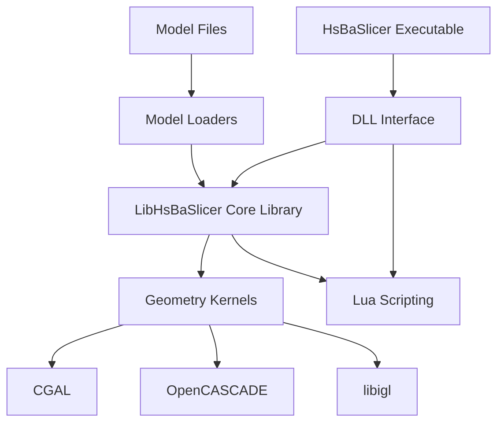
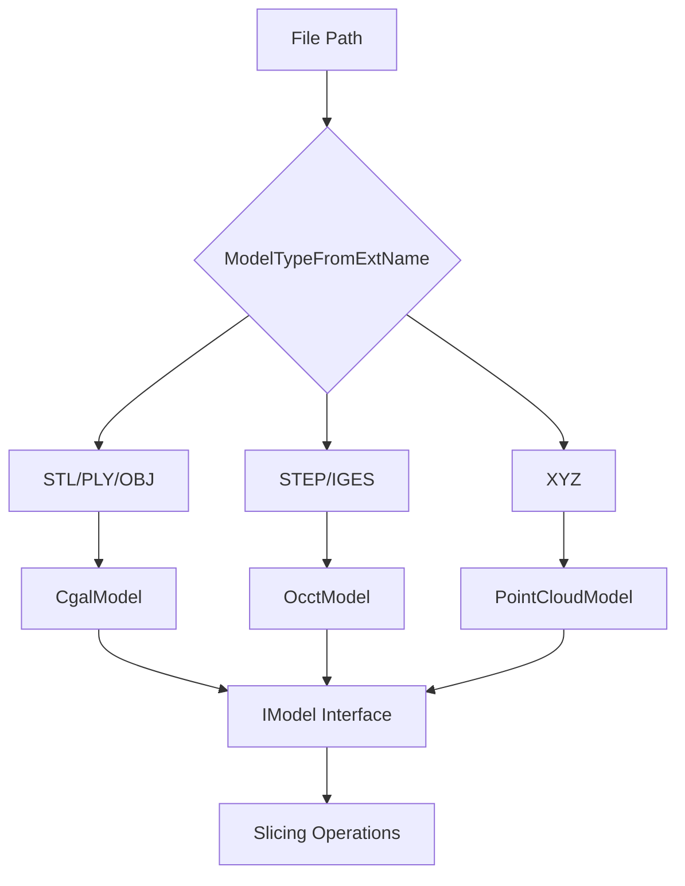
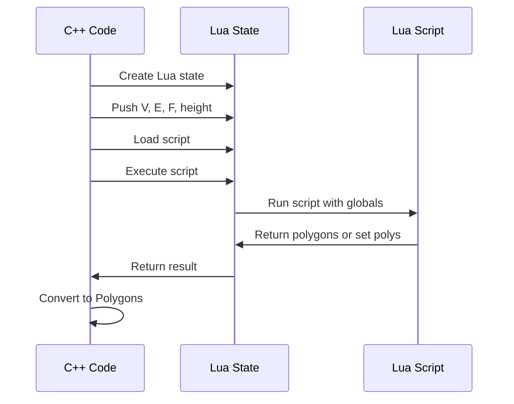
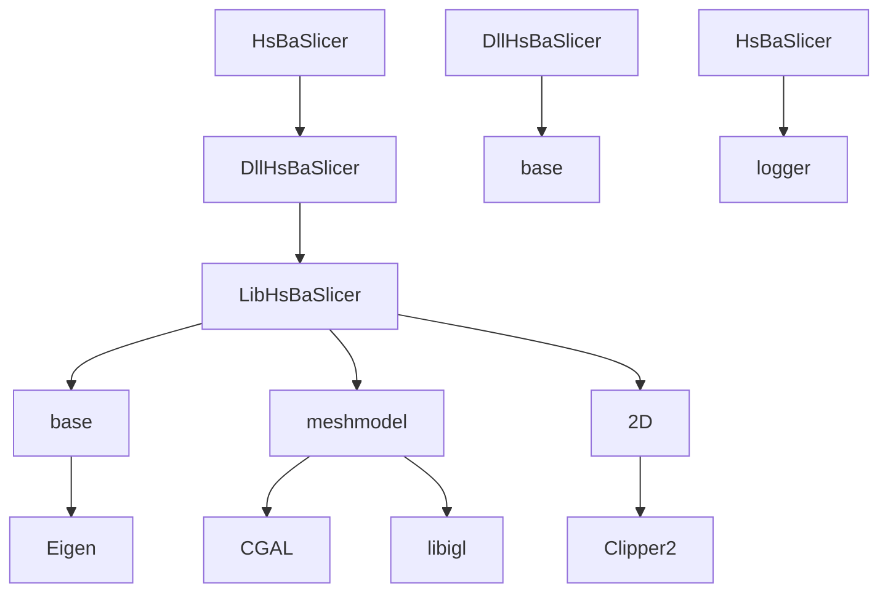

# Component Interactions and Dependencies

<cite>
**Referenced Files in This Document**   
- [HsBaSlicer.cpp](file://HsBaSlicer/HsBaSlicer.cpp)
- [HsBaSlicer.h](file://HsBaSlicer/HsBaSlicer.h)
- [initialize.cpp](file://DllHsBaSlicer/initialize.cpp)
- [initialize.h](file://DllHsBaSlicer/initialize.h)
- [dllexport.h](file://DllHsBaSlicer/dllexport.h)
- [mesh_slice.cpp](file://LibHsBaSlicer/Slice/mesh_slice.cpp)
- [mesh_slice.hpp](file://LibHsBaSlicer/Slice/mesh_slice.hpp)
- [export.h](file://LibHsBaSlicer/export.h)
- [FullTopoModel.cpp](file://meshmodel/FullTopoModel.cpp)
- [FullTopoModel.hpp](file://meshmodel/FullTopoModel.hpp)
- [IModel.hpp](file://base/IModel.hpp)
- [ModelFormat.cpp](file://base/ModelFormat.cpp)
- [ModelFormat.hpp](file://base/ModelFormat.hpp)
- [CgalModel.cpp](file://meshmodel/CgalModel.cpp)
- [CgalModel.hpp](file://meshmodel/CgalModel.hpp)
- [LuaAdapter.cpp](file://2D/LuaAdapter.cpp)
- [LuaAdapter.hpp](file://2D/LuaAdapter.hpp)
- [cipher/LuaAdapter.cpp](file://cipher/LuaAdapter.cpp)
- [fileoperator/LuaAdapter.cpp](file://fileoperator/LuaAdapter.cpp)
</cite>

## Table of Contents
1. [Introduction](#introduction)
2. [Architecture Overview](#architecture-overview)
3. [Call Hierarchy Analysis](#call-hierarchy-analysis)
4. [DLL Interface and ABI Stability](#dll-interface-and-abi-stability)
5. [Dependency Injection and Model Loading](#dependency-injection-and-model-loading)
6. [Lua Scripting Integration](#lua-scripting-integration)
7. [Dependency Graphs](#dependency-graphs)
8. [Versioning and Binary Compatibility](#versioning-and-binary-compatibility)
9. [Plugin Extensibility](#plugin-extensibility)
10. [Troubleshooting Guide](#troubleshooting-guide)

## Introduction

HsBaSlicer is a 3D slicing application with a modular architecture consisting of multiple components that interact through well-defined interfaces. The system is organized into three main components: HsBaSlicer (executable frontend), DllHsBaSlicer (DLL interface), and LibHsBaSlicer (core library). This document analyzes the component interactions, dependencies, and architectural patterns that enable the system to provide stable binary interfaces while maintaining flexibility for extension and customization.

The application follows a layered architecture where the frontend application delegates core slicing functionality to a shared library through a DLL interface. This design enables binary compatibility across versions and supports plugin extensibility. The system also incorporates Lua scripting for custom slicing algorithms and uses dependency injection patterns for model format handling.

**Section sources**
- [HsBaSlicer.cpp](file://HsBaSlicer/HsBaSlicer.cpp#L1-L25)
- [initialize.cpp](file://DllHsBaSlicer/initialize.cpp#L1-L7)

## Architecture Overview

The HsBaSlicer architecture consists of three main components that form a layered system:

1. **HsBaSlicer**: The executable frontend that serves as the application entry point
2. **DllHsBaSlicer**: A DLL that provides a stable ABI for dynamic linking
3. **LibHsBaSlicer**: The core library containing the slicing logic and data structures

These components interact through well-defined interfaces, with the frontend calling into the DLL, which in turn uses the core library functionality. The architecture enables binary compatibility and plugin extensibility while keeping the core slicing algorithms separate from the application interface.

The system uses the PIMPL (Pointer to Implementation) pattern and abstract interfaces to hide implementation details and maintain ABI stability. The DLL interface acts as a bridge between the executable and the core library, allowing for version upgrades without requiring recompilation of client applications.



**Diagram sources **
- [HsBaSlicer.cpp](file://HsBaSlicer/HsBaSlicer.cpp#L1-L25)
- [initialize.cpp](file://DllHsBaSlicer/initialize.cpp#L1-L7)
- [mesh_slice.cpp](file://LibHsBaSlicer/Slice/mesh_slice.cpp#L1-L28)

**Section sources**
- [HsBaSlicer.cpp](file://HsBaSlicer/HsBaSlicer.cpp#L1-L25)
- [initialize.cpp](file://DllHsBaSlicer/initialize.cpp#L1-L7)
- [mesh_slice.cpp](file://LibHsBaSlicer/Slice/mesh_slice.cpp#L1-L28)

## Call Hierarchy Analysis

The call hierarchy in HsBaSlicer follows a clear path from the application entry point through the DLL interface to the core slicing functions and down to the geometry kernel implementations.

The execution begins in the `main()` function of HsBaSlicer, which initializes the logging system and calls the `initialize()` function from DllHsBaSlicer. This function serves as the entry point to the DLL interface and performs any necessary initialization for the slicing library.

From the DLL interface, calls are forwarded to LibHsBaSlicer's slicing functions. The primary slicing function is `Slice()` in the `mesh_slice.cpp` file, which takes an `IModel` reference and a height parameter. This function creates a `FullTopoModel` instance from the input model and calls its `Slice()` method to perform the actual slicing operation.

The `FullTopoModel` class, defined in `FullTopoModel.cpp`, represents a mesh with complete topological information including vertices, edges, and faces with their connectivity relationships. When slicing, it iterates through all faces of the mesh, calculates intersections with the slicing plane at the specified height, and constructs closed polygon loops from the intersection segments.

```mermaid
sequenceDiagram
participant App as HsBaSlicer
participant DLL as DllHsBaSlicer
participant Lib as LibHsBaSlicer
participant Model as FullTopoModel
participant Kernel as Geometry Kernel
App->>DLL : main()
App->>DLL : initialize()
DLL->>Lib : Slice(model, height)
Lib->>Model : FullTopoModel(model)
Model->>Model : Slice(height)
Model->>Kernel : Calculate face-plane intersections
Kernel-->>Model : Intersection segments
Model->>Model : Construct polygon loops
Model-->>Lib : Polygons
Lib-->>DLL : Polygons
DLL-->>App : Result
```



**Diagram sources **
- [HsBaSlicer.cpp](file://HsBaSlicer/HsBaSlicer.cpp#L1-L25)
- [initialize.cpp](file://DllHsBaSlicer/initialize.cpp#L1-L7)
- [mesh_slice.cpp](file://LibHsBaSlicer/Slice/mesh_slice.cpp#L1-L28)
- [FullTopoModel.cpp](file://meshmodel/FullTopoModel.cpp#L1-L852)

**Section sources**
- [HsBaSlicer.cpp](file://HsBaSlicer/HsBaSlicer.cpp#L1-L25)
- [initialize.cpp](file://DllHsBaSlicer/initialize.cpp#L1-L7)
- [mesh_slice.cpp](file://LibHsBaSlicer/Slice/mesh_slice.cpp#L1-L28)
- [FullTopoModel.cpp](file://meshmodel/FullTopoModel.cpp#L1-L852)

## DLL Interface and ABI Stability

The DllHsBaSlicer component provides a stable ABI (Application Binary Interface) that enables dynamic linking and binary compatibility across versions. This is achieved through several key mechanisms:

1. **Export Macros**: The `dllexport.h` file defines the `HSBA_SLICER_API` macro that uses `__declspec(dllexport)` on Windows when building the DLL and `__declspec(dllimport)` when using it. This ensures proper symbol export/import.

2. **C-Compatible Interfaces**: The DLL exports C-style functions with extern "C" linkage to prevent C++ name mangling and ensure ABI stability across different compilers.

3. **Opaque Data Types**: The interface uses abstract interfaces and handles rather than exposing concrete C++ classes, preventing ABI breaks when internal implementations change.

4. **Versioned Interfaces**: The API can be extended with new functions without breaking existing clients, as long as existing functions maintain their signatures.

The `initialize()` function in `initialize.cpp` is a simple exported function that performs library initialization. More complex functionality is exposed through the LibHsBaSlicer library, which the DLL can link against statically or dynamically.

The ABI stability allows client applications to link against the DLL without needing to be recompiled when the underlying implementation changes, as long as the interface remains compatible. This is particularly important for plugin architectures and third-party integrations.

```mermaid
classDiagram
class DllInterface {
+HSBA_SLICER_API void initialize()
+HSBA_SLICER_API int getVersion()
+HSBA_SLICER_API bool sliceModel(ModelHandle, float, PolygonHandle*)
}
class LibInterface {
+HSBA_SLICER_LIB_API Polygons Slice(const IModel&, float)
+HSBA_SLICER_LIB_API UnSafePolygons UnSafeSlice(const IModel&, float)
}
DllInterface --> LibInterface : "delegates to"
DllInterface --> "Stable ABI" : "provides"
LibInterface --> "Implementation" : "contains"
```

**Diagram sources **
- [dllexport.h](file://DllHsBaSlicer/dllexport.h#L1-L16)
- [initialize.cpp](file://DllHsBaSlicer/initialize.cpp#L1-L7)
- [export.h](file://LibHsBaSlicer/export.h#L1-L15)
- [mesh_slice.cpp](file://LibHsBaSlicer/Slice/mesh_slice.cpp#L1-L28)

**Section sources**
- [dllexport.h](file://DllHsBaSlicer/dllexport.h#L1-L16)
- [initialize.cpp](file://DllHsBaSlicer/initialize.cpp#L1-L7)
- [export.h](file://LibHsBaSlicer/export.h#L1-L15)
- [mesh_slice.cpp](file://LibHsBaSlicer/Slice/mesh_slice.cpp#L1-L28)

## Dependency Injection and Model Loading

The HsBaSlicer system implements a dependency injection pattern for model loading, allowing the application to select appropriate model loaders based on file format. This is achieved through the `IModel` interface and format detection mechanisms.

The `IModel` interface, defined in `IModel.hpp`, specifies the contract for 3D models with methods for loading, saving, and geometric operations. Concrete implementations like `CgalModel` and `OcctModel` provide format-specific loading capabilities.

Model format detection is handled by the `ModelFormat` system in `ModelFormat.cpp`. This component uses regular expressions to match file extensions and determine the appropriate format. The `ModelTypeFromExtName()` function analyzes a filename and returns the corresponding `ModelFormat` enum value.

The dependency injection pattern allows the application to instantiate the appropriate model loader based on the detected format. For example, STL and PLY files are handled by mesh-based loaders using CGAL, while STEP and IGES files would use CAD kernel-based loaders.



The system also provides utility functions like `IsMeshFormat()`, `IsBrepFormat()`, and `IsPointCloudFormat()` to categorize models by their geometric representation, enabling format-appropriate processing pipelines.

**Diagram sources **
- [IModel.hpp](file://base/IModel.hpp#L1-L37)
- [ModelFormat.cpp](file://base/ModelFormat.cpp#L1-L166)
- [ModelFormat.hpp](file://base/ModelFormat.hpp#L1-L50)
- [CgalModel.cpp](file://meshmodel/CgalModel.cpp#L1-L366)

**Section sources**
- [IModel.hpp](file://base/IModel.hpp#L1-L37)
- [ModelFormat.cpp](file://base/ModelFormat.cpp#L1-L166)
- [ModelFormat.hpp](file://base/ModelFormat.hpp#L1-L50)
- [CgalModel.cpp](file://meshmodel/CgalModel.cpp#L1-L366)

## Lua Scripting Integration

HsBaSlicer incorporates Lua scripting capabilities that allow users to implement custom slicing algorithms and geometric operations. The integration is facilitated through Lua adapters that expose C++ functionality to Lua scripts.

The system provides multiple Lua adapters in different modules:
- **2D/LuaAdapter**: Exposes 2D geometric operations like boolean operations, offsetting, and hull generation
- **cipher/LuaAdapter**: Provides cryptographic functions like base64 and hex encoding/decoding
- **fileoperator/LuaAdapter**: Offers file operations and database access through SQLite, MySQL, and PostgreSQL

The `FullTopoModel` class supports Lua-based slicing through the `SliceLua()` methods, which execute Lua scripts in a sandboxed environment. The scripts receive access to the model's vertices (V), edges (E), faces (F), and the slicing height as global variables.

When a Lua script is executed, the system:
1. Creates a new Lua state
2. Exposes the model data as Lua tables
3. Executes the provided script
4. Retrieves the resulting polygons from the script's return value or global 'polys' variable
5. Converts the Lua polygon data back to the internal representation



The Lua adapters use the `luaL_Reg` structure to register C++ functions as Lua library functions, making them available to scripts. The adapters also handle proper memory management and error propagation between the C++ and Lua environments.

**Diagram sources **
- [FullTopoModel.cpp](file://meshmodel/FullTopoModel.cpp#L1-L852)
- [2D/LuaAdapter.cpp](file://2D/LuaAdapter.cpp#L1-L287)
- [cipher/LuaAdapter.cpp](file://cipher/LuaAdapter.cpp#L1-L96)
- [fileoperator/LuaAdapter.cpp](file://fileoperator/LuaAdapter.cpp#L1-L800)

**Section sources**
- [FullTopoModel.cpp](file://meshmodel/FullTopoModel.cpp#L1-L852)
- [2D/LuaAdapter.cpp](file://2D/LuaAdapter.cpp#L1-L287)
- [cipher/LuaAdapter.cpp](file://cipher/LuaAdapter.cpp#L1-L96)
- [fileoperator/LuaAdapter.cpp](file://fileoperator/LuaAdapter.cpp#L1-L800)

## Dependency Graphs

The HsBaSlicer system has both compile-time and runtime dependencies that form a directed acyclic graph. Understanding these dependencies is crucial for maintaining binary compatibility and enabling plugin extensibility.

### Compile-Time Dependencies



The executable (HsBaSlicer) depends on the DLL interface (DllHsBaSlicer), which in turn depends on the core library (LibHsBaSlicer). The core library depends on utility modules like base, meshmodel, and 2D, which themselves depend on third-party libraries like Eigen, CGAL, libigl, and Clipper2.

### Runtime Dependencies

```mermaid
graph TD
A[HsBaSlicer.exe] --> B[DllHsBaSlicer.dll]
B --> C[LibHsBaSlicer.dll or static]
C --> D[CGAL-*.dll]
C --> E[igl.dll]
C --> F[Eigen (header-only)]
C --> G[Lua54.dll]
H[Plugins] --> B
I[Scripts] --> C
```

At runtime, the executable loads the DLL interface, which may load additional shared libraries for geometry kernels and scripting. Plugin modules can also load the DLL interface to extend functionality.

The dependency structure enables binary compatibility by isolating changes to specific components. The DLL interface acts as a stable contract between the executable and the core functionality.

**Diagram sources **
- [CMakeLists.txt](file://HsBaSlicer/CMakeLists.txt#L1-L50)
- [CMakeLists.txt](file://DllHsBaSlicer/CMakeLists.txt#L1-L30)
- [CMakeLists.txt](file://LibHsBaSlicer/CMakeLists.txt#L1-L40)
- [CMakeLists.txt](file://base/CMakeLists.txt#L1-L20)

**Section sources**
- [CMakeLists.txt](file://HsBaSlicer/CMakeLists.txt#L1-L50)
- [CMakeLists.txt](file://DllHsBaSlicer/CMakeLists.txt#L1-L30)
- [CMakeLists.txt](file://LibHsBaSlicer/CMakeLists.txt#L1-L40)

## Versioning and Binary Compatibility

HsBaSlicer employs several strategies to maintain versioning and binary compatibility across releases:

1. **Semantic Versioning**: The system likely follows semantic versioning principles where major version changes indicate breaking ABI changes, minor versions add functionality without breaking compatibility, and patch versions fix bugs.

2. **ABI Stability**: The DLL interface maintains ABI stability by:
   - Using C-compatible function signatures
   - Avoiding C++ exceptions across the interface
   - Using opaque handles instead of concrete types
   - Not changing function signatures in minor releases

3. **Export Control**: The `HSBA_SLICER_API` and `HSBA_SLICER_LIB_API` macros in `dllexport.h` and `export.h` control symbol visibility and ensure consistent export behavior across platforms.

4. **Interface Evolution**: New functionality is added by introducing new functions rather than modifying existing ones, preserving backward compatibility.

5. **Version Querying**: The system should provide a version query function (not visible in current code but standard practice) to allow clients to detect the library version at runtime.

Binary compatibility is particularly important for the DLL interface, as it allows client applications to upgrade the library without recompilation. This is achieved by ensuring that the memory layout of exported types remains consistent and that calling conventions are preserved.

The use of abstract interfaces like `IModel` also contributes to binary compatibility, as changes to concrete implementations do not affect the interface used by clients.

**Section sources**
- [dllexport.h](file://DllHsBaSlicer/dllexport.h#L1-L16)
- [export.h](file://LibHsBaSlicer/export.h#L1-L15)
- [initialize.h](file://DllHsBaSlicer/initialize.h#L1-L10)

## Plugin Extensibility

The DLL interface design of HsBaSlicer enables plugin extensibility through several mechanisms:

1. **Dynamic Loading**: The stable ABI allows third-party plugins to be developed against the DLL interface and loaded at runtime.

2. **Lua Scripting**: The integrated Lua interpreter allows users to write custom slicing algorithms and geometric operations without compiling C++ code.

3. **Model Format Extensibility**: The `IModel` interface can be implemented by third-party modules to support additional file formats.

4. **Adapter Pattern**: The Lua adapter system can be extended to expose additional C++ functionality to scripts.

Plugins can extend the system in various ways:
- Adding support for new 3D file formats by implementing the `IModel` interface
- Providing custom slicing algorithms through Lua scripts
- Extending the Lua environment with additional libraries
- Adding post-processing operations on sliced polygons

The system's modular design ensures that plugins can be developed and distributed independently of the main application, as long as they adhere to the published interfaces.

The use of the PIMPL pattern and abstract interfaces minimizes the risk of plugin incompatibility when the core library is updated, as long as the interfaces remain stable.

**Section sources**
- [IModel.hpp](file://base/IModel.hpp#L1-L37)
- [dllexport.h](file://DllHsBaSlicer/dllexport.h#L1-L16)
- [FullTopoModel.cpp](file://meshmodel/FullTopoModel.cpp#L1-L852)
- [2D/LuaAdapter.cpp](file://2D/LuaAdapter.cpp#L1-L287)

## Troubleshooting Guide

When encountering linkage errors and symbol resolution issues in HsBaSlicer, consider the following troubleshooting steps:

### Common Linkage Errors

1. **Unresolved External Symbols**:
   - Ensure the correct library files are linked (DllHsBaSlicer.lib for Windows)
   - Verify that the HSBA_SLICER_EXPORTS macro is not defined when using the DLL
   - Check that function signatures match exactly between declaration and definition

2. **DLL Loading Failures**:
   - Verify that DllHsBaSlicer.dll is in the executable path or system PATH
   - Check that all dependency DLLs (CGAL, libigl, Lua) are available
   - Ensure architecture compatibility (32-bit vs 64-bit)

3. **ABI Compatibility Issues**:
   - Verify that the same compiler and standard library version are used
   - Check that C++ runtime libraries are compatible
   - Ensure consistent compilation flags (especially exception handling and runtime library)

### Symbol Resolution Issues

1. **Name Mangling Problems**:
   - Use extern "C" for exported functions to prevent C++ name mangling
   - Verify that __declspec(dllexport) and __declspec(dllimport) are used correctly
   - Check that header files are included properly

2. **Version Mismatch**:
   - Verify that the DLL version matches the expected interface
   - Check for breaking changes in the API
   - Use version query functions to detect compatibility

3. **Missing Dependencies**:
   - Use dependency walker tools to identify missing DLLs
   - Verify that all third-party libraries are properly installed
   - Check that the Lua interpreter can be loaded

### Debugging Steps

1. Use tools like `dumpbin /exports` (Windows) or `nm` (Linux) to verify exported symbols
2. Check that the DLL interface functions are properly decorated with __declspec(dllexport)
3. Verify that the import library (.lib file) is being linked correctly
4. Use process monitoring tools to trace DLL loading at runtime

The modular architecture should help isolate issues to specific components, making troubleshooting more manageable.

**Section sources**
- [dllexport.h](file://DllHsBaSlicer/dllexport.h#L1-L16)
- [initialize.cpp](file://DllHsBaSlicer/initialize.cpp#L1-L7)
- [HsBaSlicer.cpp](file://HsBaSlicer/HsBaSlicer.cpp#L1-L25)
- [export.h](file://LibHsBaSlicer/export.h#L1-L15)