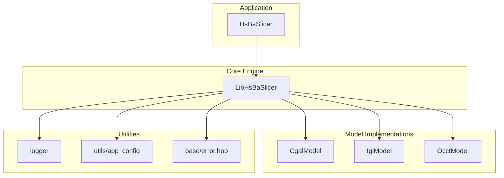
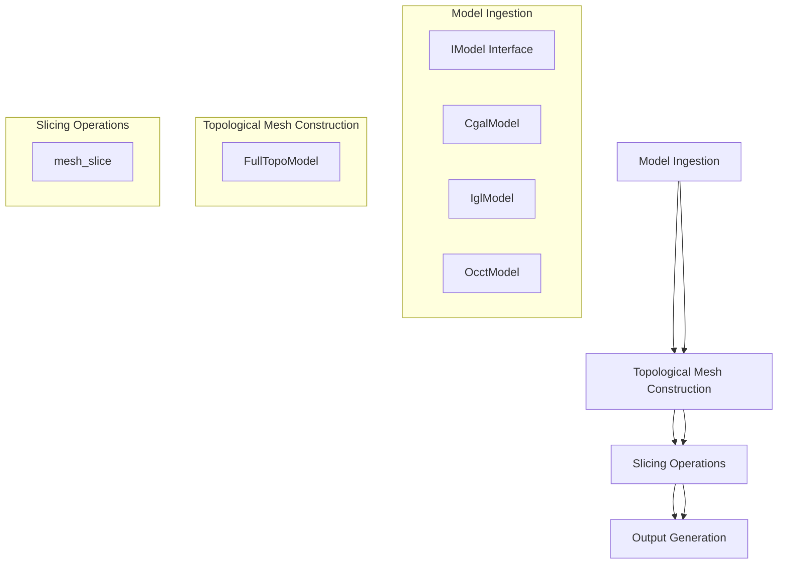
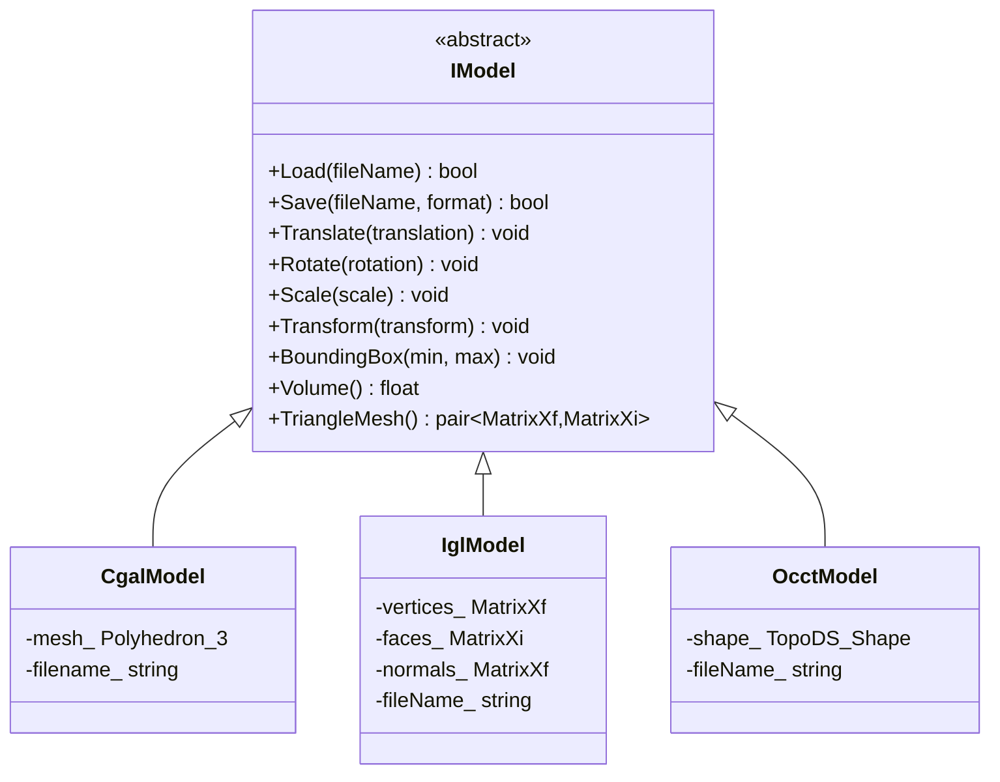
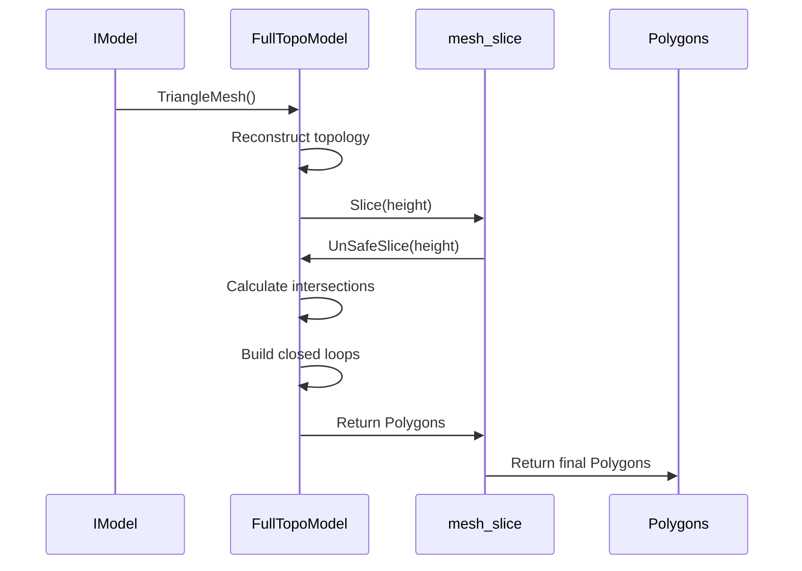
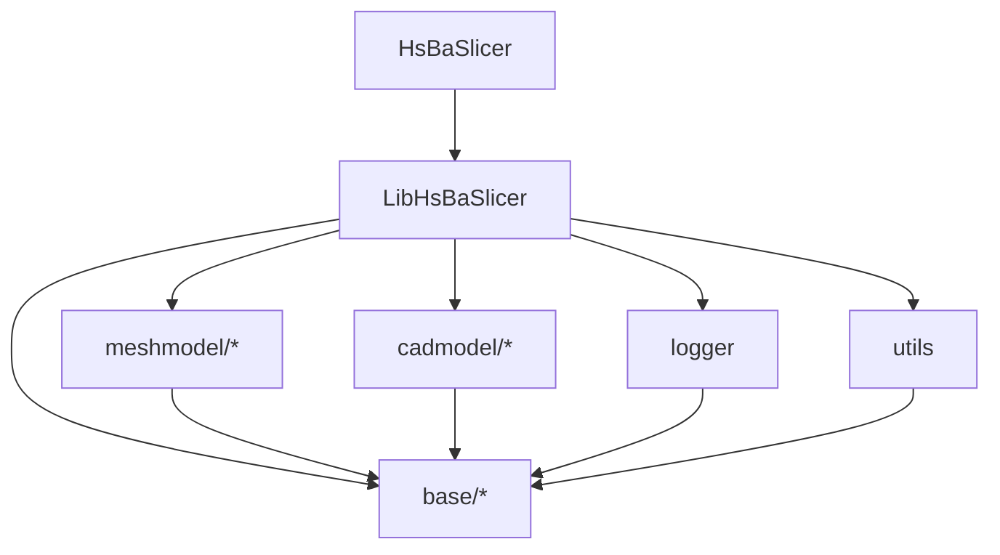

# Core Architecture

<cite>
**Referenced Files in This Document**   
- [LibHsBaSlicer/export.h](file://LibHsBaSlicer/export.h)
- [base/IModel.hpp](file://base/IModel.hpp)
- [meshmodel/CgalModel.hpp](file://meshmodel/CgalModel.hpp)
- [cadmodel/OcctModel.hpp](file://cadmodel/OcctModel.hpp)
- [meshmodel/FullTopoModel.hpp](file://meshmodel/FullTopoModel.hpp)
- [meshmodel/FullTopoModel.cpp](file://meshmodel/FullTopoModel.cpp)
- [LibHsBaSlicer/slice/mesh_slice.hpp](file://LibHsBaSlicer/slice/mesh_slice.hpp)
- [base/error.hpp](file://base/error.hpp)
- [logger/logger.hpp](file://logger/logger.hpp)
- [logger/logger.cpp](file://logger/logger.cpp)
- [utils/app_config.hpp](file://utils/app_config.hpp)
- [utils/app_config.cpp](file://utils/app_config.cpp)
- [base/singleton.hpp](file://base/singleton.hpp)
- [meshmodel/IglModel.hpp](file://meshmodel/IglModel.hpp)
</cite>

## Table of Contents
1. [Introduction](#introduction)
2. [Project Structure](#project-structure)
3. [Core Components](#core-components)
4. [Architecture Overview](#architecture-overview)
5. [Detailed Component Analysis](#detailed-component-analysis)
6. [Dependency Analysis](#dependency-analysis)
7. [Performance Considerations](#performance-considerations)
8. [Troubleshooting Guide](#troubleshooting-guide)
9. [Conclusion](#conclusion)

## Introduction
The HsBaSlicer architecture is designed as a layered system with LibHsBaSlicer serving as the central slicing engine. The system abstracts model handling through the IModel interface, allowing multiple geometry kernel implementations such as CgalModel, IglModel, and OcctModel. This documentation details the architectural design, component interactions, data flow from model ingestion to slicing operations, and key design patterns including Pimpl, interface-based polymorphism, and singleton usage for cross-cutting concerns like logging and configuration.

## Project Structure
The project follows a modular structure with clearly separated components for different concerns. The core slicing functionality resides in LibHsBaSlicer, while model implementations are organized in meshmodel and cadmodel directories. Utility components like logging, configuration, and file operations are separated into their own modules.



**Diagram sources**
- [base/IModel.hpp](file://base/IModel.hpp)
- [meshmodel/CgalModel.hpp](file://meshmodel/CgalModel.hpp)
- [meshmodel/IglModel.hpp](file://meshmodel/IglModel.hpp)
- [cadmodel/OcctModel.hpp](file://cadmodel/OcctModel.hpp)
- [logger/logger.hpp](file://logger/logger.hpp)
- [utils/app_config.hpp](file://utils/app_config.hpp)

**Section sources**
- [base/IModel.hpp](file://base/IModel.hpp)
- [meshmodel/CgalModel.hpp](file://meshmodel/CgalModel.hpp)
- [meshmodel/IglModel.hpp](file://meshmodel/IglModel.hpp)
- [cadmodel/OcctModel.hpp](file://cadmodel/OcctModel.hpp)

## Core Components
The core components of the HsBaSlicer architecture include the LibHsBaSlicer engine, the IModel interface abstraction, and various geometry kernel implementations. The system also includes specialized components for topological mesh construction (FullTopoModel) and slicing operations. Cross-cutting concerns are handled through singleton patterns for logging and configuration management.

**Section sources**
- [LibHsBaSlicer/export.h](file://LibHsBaSlicer/export.h)
- [base/IModel.hpp](file://base/IModel.hpp)
- [meshmodel/FullTopoModel.hpp](file://meshmodel/FullTopoModel.hpp)
- [logger/logger.hpp](file://logger/logger.hpp)
- [utils/app_config.hpp](file://utils/app_config.hpp)

## Architecture Overview
The HsBaSlicer architecture follows a layered design pattern with clear separation of concerns. At the core is LibHsBaSlicer, which provides the slicing functionality and serves as the central coordination point. The architecture is built around the IModel interface, which defines the contract for 3D model manipulation and enables polymorphic behavior across different geometry kernels.

The system processes models through a pipeline that begins with model ingestion via the IModel interface, proceeds through topological mesh construction in FullTopoModel, and concludes with slicing operations. Each layer interacts with the next through well-defined interfaces, ensuring loose coupling and high cohesion.



**Diagram sources**
- [base/IModel.hpp](file://base/IModel.hpp)
- [meshmodel/FullTopoModel.hpp](file://meshmodel/FullTopoModel.hpp)
- [LibHsBaSlicer/slice/mesh_slice.hpp](file://LibHsBaSlicer/slice/mesh_slice.hpp)

## Detailed Component Analysis

### IModel Interface and Polymorphism
The IModel interface serves as the foundation for model abstraction in the HsBaSlicer architecture. It defines a contract for 3D model operations including loading, saving, transformation, and mesh retrieval. This interface enables polymorphic behavior, allowing the system to work with different geometry kernels through a common API.



**Diagram sources**
- [base/IModel.hpp](file://base/IModel.hpp)
- [meshmodel/CgalModel.hpp](file://meshmodel/CgalModel.hpp)
- [meshmodel/IglModel.hpp](file://meshmodel/IglModel.hpp)
- [cadmodel/OcctModel.hpp](file://cadmodel/OcctModel.hpp)

**Section sources**
- [base/IModel.hpp](file://base/IModel.hpp)
- [meshmodel/CgalModel.hpp](file://meshmodel/CgalModel.hpp)
- [meshmodel/IglModel.hpp](file://meshmodel/IglModel.hpp)
- [cadmodel/OcctModel.hpp](file://cadmodel/OcctModel.hpp)

### FullTopoModel and Topological Reconstruction
The FullTopoModel class is responsible for constructing a complete topological representation of a 3D mesh. It takes an IModel instance and rebuilds the topological relationships between vertices, edges, and faces. This topological reconstruction is essential for accurate slicing operations and enables advanced mesh analysis.

```mermaid
classDiagram
class FullTopoModel {
-vertices_ vector~Vertex~
-edges_ vector~Edge~
-faces_ vector~Face~
+CheckTopo() bool
+GetVertices() const vector~Vertex~
+GetEdges() const vector~Edge~
+GetFaces() const vector~Face~
+TriangleMesh() pair~MatrixXf,MatrixXi~
+EulerCharacteristic() int
+Slice(height) Polygons
+UnSafeSlice(height) UnSafePolygons
+SliceLua(script, height) Polygons
}
class FullTopoModel : : Vertex {
-vertex Vector3f
-faces vector~int~
-edges vector~int~
}
class FullTopoModel : : Edge {
-vertices 2[]
-faces 2[]
}
class FullTopoModel : : Face {
-triangle 3[]
-edges 3[]
-normal Vector3f
}
FullTopoModel : : Vertex --> FullTopoModel : : Face : "part of"
FullTopoModel : : Edge --> FullTopoModel : : Face : "part of"
FullTopoModel : : Vertex --> FullTopoModel : : Edge : "connected by"
```

**Diagram sources**
- [meshmodel/FullTopoModel.hpp](file://meshmodel/FullTopoModel.hpp)
- [meshmodel/FullTopoModel.cpp](file://meshmodel/FullTopoModel.cpp)

**Section sources**
- [meshmodel/FullTopoModel.hpp](file://meshmodel/FullTopoModel.hpp)
- [meshmodel/FullTopoModel.cpp](file://meshmodel/FullTopoModel.cpp)

### Slicing Operations and Data Flow
The slicing operations in HsBaSlicer follow a well-defined data flow from model ingestion to slice generation. The process begins with a model implementing the IModel interface, which is then processed by FullTopoModel to construct topological relationships. The resulting topological mesh is used for slicing operations that generate 2D polygonal contours at specified heights.



**Diagram sources**
- [base/IModel.hpp](file://base/IModel.hpp)
- [meshmodel/FullTopoModel.hpp](file://meshmodel/FullTopoModel.hpp)
- [meshmodel/FullTopoModel.cpp](file://meshmodel/FullTopoModel.cpp)
- [LibHsBaSlicer/slice/mesh_slice.hpp](file://LibHsBaSlicer/slice/mesh_slice.hpp)

**Section sources**
- [meshmodel/FullTopoModel.hpp](file://meshmodel/FullTopoModel.hpp)
- [meshmodel/FullTopoModel.cpp](file://meshmodel/FullTopoModel.cpp)
- [LibHsBaSlicer/slice/mesh_slice.hpp](file://LibHsBaSlicer/slice/mesh_slice.hpp)

### Design Patterns and Cross-Cutting Concerns
The HsBaSlicer architecture employs several design patterns to address cross-cutting concerns. The singleton pattern is used for logging and configuration management, ensuring global access to these services while maintaining a single state. Error handling is implemented through a hierarchy of exception classes that extend RuntimeError, providing specific error types for different failure scenarios.

```mermaid
classDiagram
class LoggerSingletone {
-use_log_file_ bool
-log_path_ string
-log_level_ int
+Log(message, log_lv) void
+LogDebug(message) void
+LogInfo(message) void
+LogWarning(message) void
+LogError(message) void
+GetInstance() shared_ptr~LoggerSingletone~
}
class AppConfigSingletone {
-sevenZ_path_ string
+GetSevenZPath() string
+GetInstance() AppConfigSingletone&
}
class RuntimeError {
<<abstract>>
+what() const char*
}
class OutOfRangeError {
}
class InvalidArgumentError {
}
class IOError {
}
class NotImplementedError {
}
RuntimeError <|-- OutOfRangeError
RuntimeError <|-- InvalidArgumentError
RuntimeError <|-- IOError
RuntimeError <|-- NotImplementedError
LoggerSingletone : : GetInstance() --> LoggerSingletone
AppConfigSingletone : : GetInstance() --> AppConfigSingletone
```

**Diagram sources**
- [logger/logger.hpp](file://logger/logger.hpp)
- [logger/logger.cpp](file://logger/logger.cpp)
- [utils/app_config.hpp](file://utils/app_config.hpp)
- [utils/app_config.cpp](file://utils/app_config.cpp)
- [base/error.hpp](file://base/error.hpp)
- [base/singleton.hpp](file://base/singleton.hpp)

**Section sources**
- [logger/logger.hpp](file://logger/logger.hpp)
- [logger/logger.cpp](file://logger/logger.cpp)
- [utils/app_config.hpp](file://utils/app_config.hpp)
- [utils/app_config.cpp](file://utils/app_config.cpp)
- [base/error.hpp](file://base/error.hpp)
- [base/singleton.hpp](file://base/singleton.hpp)

## Dependency Analysis
The HsBaSlicer architecture demonstrates a clear dependency hierarchy with well-defined component interactions. The main application (HsBaSlicer) depends on the LibHsBaSlicer library, which in turn depends on the model implementations and utility components. The dependency graph shows a directed flow from the application layer through the engine to the implementation details.



**Diagram sources**
- [HsBaSlicer/HsBaSlicer.h](file://HsBaSlicer/HsBaSlicer.h)
- [LibHsBaSlicer/export.h](file://LibHsBaSlicer/export.h)
- [base/IModel.hpp](file://base/IModel.hpp)
- [logger/logger.hpp](file://logger/logger.hpp)
- [utils/app_config.hpp](file://utils/app_config.hpp)

**Section sources**
- [HsBaSlicer/HsBaSlicer.h](file://HsBaSlicer/HsBaSlicer.h)
- [LibHsBaSlicer/export.h](file://LibHsBaSlicer/export.h)
- [base/IModel.hpp](file://base/IModel.hpp)
- [logger/logger.hpp](file://logger/logger.hpp)
- [utils/app_config.hpp](file://utils/app_config.hpp)

## Performance Considerations
The architecture incorporates several performance considerations, particularly in the topological reconstruction and slicing operations. The FullTopoModel class builds complete topological relationships during construction, which eliminates the need for repeated topology calculations during slicing. This design choice trades memory usage for computational efficiency, as the topological information is stored rather than recalculated.

The slicing operations are optimized by using integerized coordinates for intersection calculations, which reduces floating-point precision issues and improves performance. The system also supports Lua scripting for custom slicing algorithms, allowing users to implement performance-critical operations in a compiled language when needed.

## Troubleshooting Guide
When encountering issues with the HsBaSlicer architecture, consider the following common problems and solutions:

1. **Model loading failures**: Verify that the file format is supported by the chosen geometry kernel (CgalModel, IglModel, or OcctModel).
2. **Incorrect slicing results**: Check that the model has valid topology by calling FullTopoModel::CheckTopo().
3. **Performance issues**: Ensure that FullTopoModel is being reused for multiple slicing operations rather than recreated for each slice.
4. **Memory leaks**: Verify that model instances are properly managed, especially when using different geometry kernels.
5. **Logging not working**: Check that the logcfg.ini configuration file exists and has the correct permissions.

The error handling system provides specific exception types that can help diagnose issues. For example, IOError indicates file access problems, while InvalidArgumentError suggests incorrect parameters were passed to a function.

**Section sources**
- [base/error.hpp](file://base/error.hpp)
- [logger/logger.hpp](file://logger/logger.hpp)
- [logger/logger.cpp](file://logger/logger.cpp)

## Conclusion
The HsBaSlicer architecture demonstrates a well-structured, layered design with clear separation of concerns. The central LibHsBaSlicer engine provides slicing functionality while abstracting model implementations through the IModel interface. This design enables flexibility in geometry kernel selection while maintaining a consistent API.

The architecture effectively uses design patterns such as interface-based polymorphism and singleton for cross-cutting concerns. The FullTopoModel component plays a crucial role in ensuring accurate slicing by reconstructing complete topological relationships. The system's modular design allows for easy extension and maintenance, making it suitable for both current and future requirements.