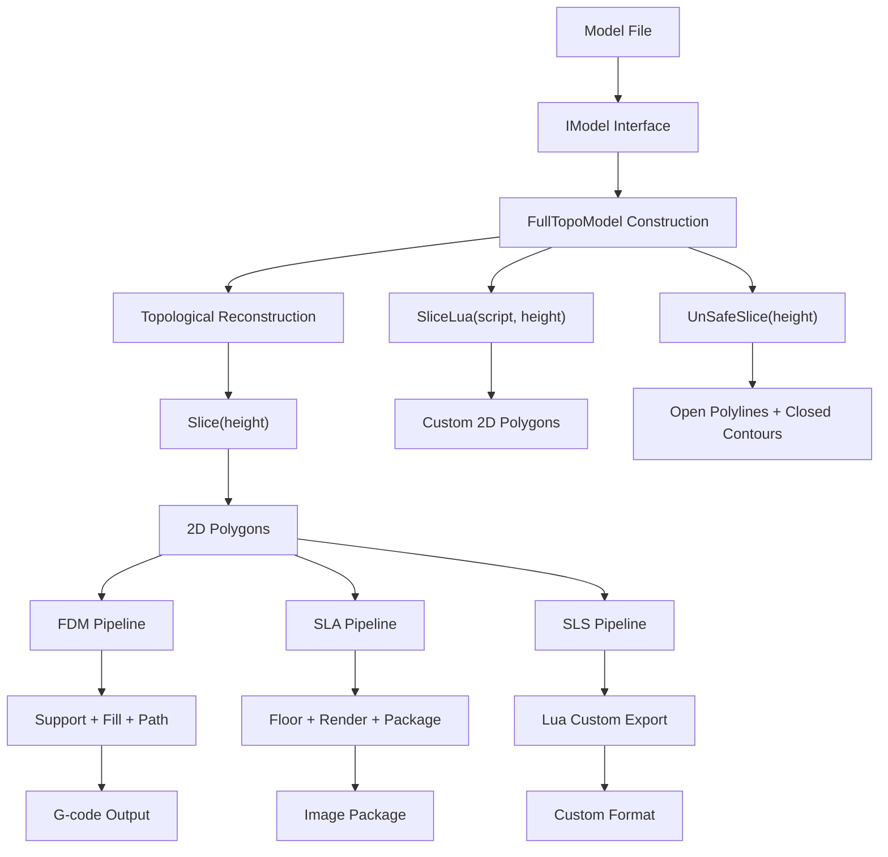
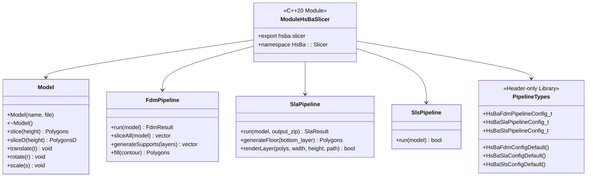
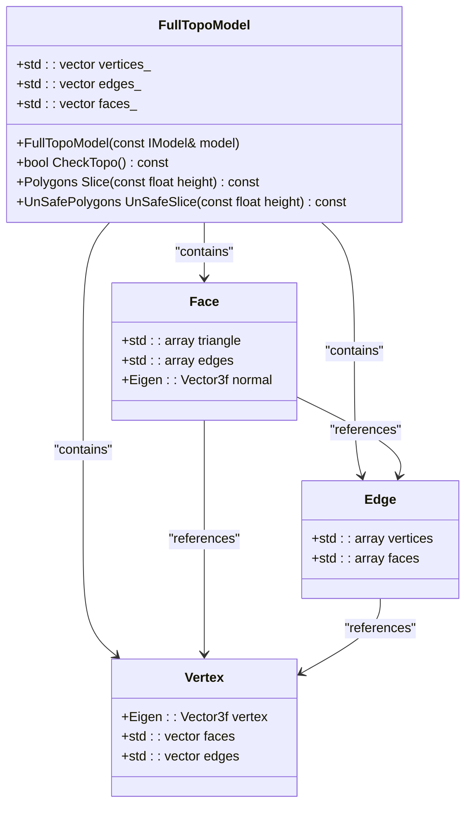
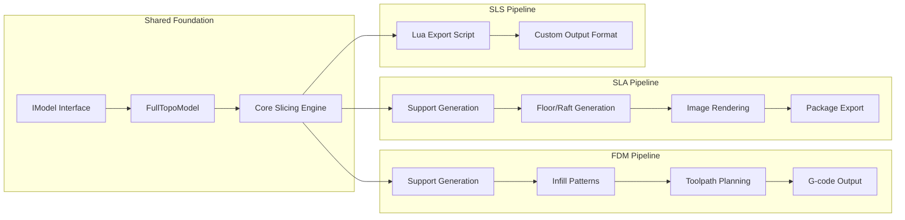
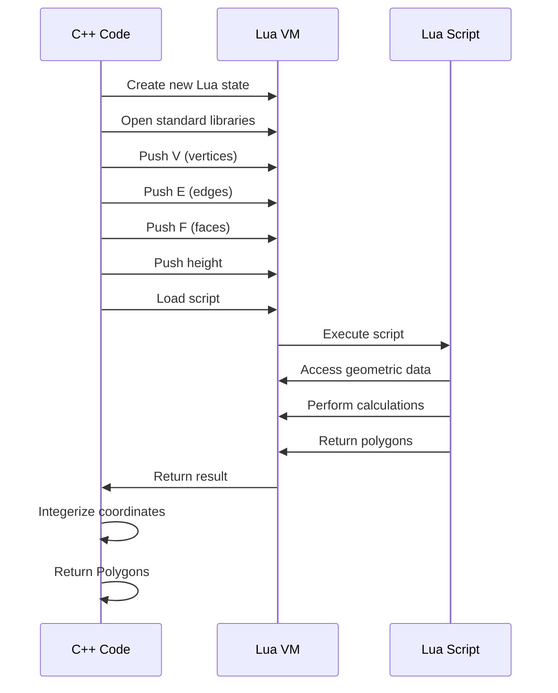

# Data Flow and Processing Pipeline

<cite>
**Referenced Files in This Document**   
- [mesh_slice.cpp](file://LibHsBaSlicer/Slice/mesh_slice.cpp)
- [mesh_slice.hpp](file://LibHsBaSlicer/Slice/mesh_slice.hpp)
- [FullTopoModel.cpp](file://meshmodel/FullTopoModel.cpp)
- [FullTopoModel.hpp](file://meshmodel/FullTopoModel.hpp)
- [IModel.hpp](file://base/IModel.hpp)
- [IntPolygon.hpp](file://2D/IntPolygon.hpp)
- [FloatPolygons.hpp](file://2D/FloatPolygons.hpp)
- [LuaNewObject.hpp](file://utils/LuaNewObject.hpp)
- [pipeline_types.h](file://pipelinetypes/pipeline_types.h)
- [sls_pipeline.h](file://DllHsBaSlicer/sls_pipeline.h)
- [sls_pipeline.cpp](file://DllHsBaSlicer/sls_pipeline.cpp)
- [sls_export.hpp](file://LibHsBaSlicer/Path/sls_export.hpp)
- [hsba_slicer.cppm](file://ModuleHsBaSlicer/hsba_slicer.cppm)
- [main.cpp](file://samples/SLS/main.cpp)
</cite>

## Update Summary
**Changes Made**   
- Added comprehensive SLS (Selective Laser Sintering) processing pipeline documentation
- Updated data flow overview to include three distinct manufacturing process pipelines (FDM, SLA, SLS)
- Enhanced modular architecture section with C++20 module wrapper details
- Added pipelinetypes abstraction layer documentation for unified configuration management
- Updated examples to demonstrate all three pipeline types with their specific characteristics

## Table of Contents
1. [Introduction](#introduction)
2. [Data Flow Overview](#data-flow-overview)
3. [Modular Architecture and Type Abstraction](#modular-architecture-and-type-abstraction)
4. [Model Ingestion via IModel Interface](#model-ingestion-via-imodel-interface)
5. [FullTopoModel Topological Reconstruction](#fulltopomodel-topological-reconstruction)
6. [Multi-Pipeline Processing Architecture](#multi-pipeline-processing-architecture)
7. [SLS Processing Pipeline](#sls-processing-pipeline)
8. [Safe vs Unsafe Slicing](#safe-vs-unsafe-slicing)
9. [Lua-Scripted Slicing](#lua-scripted-slicing)
10. [Performance and Memory Considerations](#performance-and-memory-considerations)
11. [Common Issues and Error Handling](#common-issues-and-error-handling)
12. [Conclusion](#conclusion)

## Introduction

The HsBaSlicer application implements a sophisticated multi-process data flow and processing pipeline designed to efficiently convert raw triangle mesh data into 2D polygonal cross-sections for various additive manufacturing technologies. This document details the end-to-end pathway from model ingestion through topological reconstruction to final slice generation, supporting FDM (Fused Deposition Modeling), SLA (Stereolithography), and SLS (Selective Laser Sintering) processes.

The core of the slicing pipeline revolves around the `FullTopoModel` class, which performs complete topological reconstruction of the input mesh, establishing explicit relationships between vertices, edges, and faces. This pre-processing step enables efficient Z-direction slicing without repeated topological analysis, significantly improving performance for multi-layer slicing operations. The system now features a modular architecture with C++20 modules and a unified type abstraction layer that provides consistent interfaces across all manufacturing processes.

**Section sources**
- [FullTopoModel.hpp:36-42](file://meshmodel/FullTopoModel.hpp#L36-L42)
- [mesh_slice.hpp:9-19](file://LibHsBaSlicer/Slice/mesh_slice.hpp#L9-L19)
- [pipeline_types.h:1-400](file://pipelinetypes/pipeline_types.h#L1-L400)

## Data Flow Overview

The data flow in HsBaSlicer follows a structured modular pipeline that transforms a 3D model into 2D slice polygons through several well-defined stages, with specialized processing paths for different manufacturing technologies. The process begins with model ingestion through the `IModel` interface, which provides a standardized way to access triangle mesh data regardless of the underlying model format or implementation.

Once the model data is available, it is passed to the `FullTopoModel` constructor, which performs comprehensive topological reconstruction. This step creates explicit data structures representing vertices, edges, and faces, along with their interrelationships. The reconstructed topology is stored in memory and can be reused for multiple slicing operations at different heights without repeating the computationally expensive reconstruction process.

The system now supports three distinct processing pipelines:

1. **FDM Pipeline**: Slice → Support Generation → Fill Pattern → Path Planning → G-code Export
2. **SLA Pipeline**: Slice → Support Generation → Floor/Raft Generation → Image Rendering → Package Export  
3. **SLS Pipeline**: Slice → Lua-driven Custom Export (no standard output format)

Each pipeline shares the common topological foundation but diverges in post-processing based on the specific requirements of each manufacturing technology.



**Diagram sources**
- [mesh_slice.cpp:5-26](file://LibHsBaSlicer/Slice/mesh_slice.cpp#L5-L26)
- [FullTopoModel.cpp:19-143](file://meshmodel/FullTopoModel.cpp#L19-L143)
- [sls_pipeline.cpp:169-270](file://DllHsBaSlicer/sls_pipeline.cpp#L169-L270)

## Modular Architecture and Type Abstraction

The HsBaSlicer system has evolved to feature a sophisticated modular architecture built around two key architectural patterns: C++20 modules and centralized type abstraction.

### C++20 Module Wrapper (ModuleHsBaSlicer)

The system now includes a dedicated C++20 module wrapper (`ModuleHsBaSlicer`) that provides a modern, class-based API over the traditional free-function interface. This module exports a clean namespace `HsBa::Slicer` containing RAII-managed classes like `Model`, `FdmPipeline`, `SlaPipeline`, and `SlsPipeline`.

The module architecture follows these principles:
- **Single-file module design**: The entire module interface and implementation are contained in `hsba_slicer.cppm` to avoid MSVC C++20 module compilation issues
- **RAII resource management**: Automatic cleanup of models and resources through destructors
- **Exception-based error handling**: All errors thrown as `SlicerError` exceptions rather than return codes
- **Type re-exporting**: Common types like `Point2`, `Polygon`, `Polygons` are re-exported for convenience

### Pipelinetypes Abstraction Layer

The `pipelinetypes` directory provides a centralized, C-compatible type definition layer that abstracts configuration and result structures across all pipeline types. This header-only library defines unified structures for:

- **FDM Configuration**: `HsBaFdmPipelineConfig_t` with fill modes, support patterns, and path parameters
- **SLA Configuration**: `HsBaSlaPipelineConfig_t` with exposure settings, floor/raft options, and image formats  
- **SLS Configuration**: `HsBaSlsPipelineConfig_t` with laser parameters and Lua export requirements

Each configuration structure includes default initialization functions (`HsBaFdmConfigDefault()`, `HsBaSlaConfigDefault()`, `HsBaSlsConfigDefault()`) ensuring consistent parameter defaults across the system.



**Diagram sources**
- [hsba_slicer.cppm:1-642](file://ModuleHsBaSlicer/hsba_slicer.cppm#L1-L642)
- [pipeline_types.h:1-400](file://pipelinetypes/pipeline_types.h#L1-L400)

**Section sources**
- [hsba_slicer.cppm:1-100](file://ModuleHsBaSlicer/hsba_slicer.cppm#L1-L100)
- [pipeline_types.h:1-400](file://pipelinetypes/pipeline_types.h#L1-L400)

## Model Ingestion via IModel Interface

The data flow begins with the `IModel` interface, which serves as the abstraction layer for all 3D model representations in HsBaSlicer. This interface defines a contract that all concrete model implementations must satisfy, ensuring consistent access to mesh data regardless of the underlying format or geometry kernel.

The key method in the `IModel` interface is `TriangleMesh()`, which returns the model's geometry as a pair of Eigen matrices representing vertices and faces in the IGL (Interactive Graphics Lab) format. This standardized representation allows the slicing pipeline to operate on any model type that implements the interface, including models based on different computational geometry libraries such as CGAL or IGL.

Concrete implementations of the `IModel` interface, such as `CgalModel` and `IglModel`, handle the specifics of loading and processing different file formats and geometry representations. These classes are responsible for tasks such as file I/O, coordinate transformations, and mesh validation, but they all expose their data through the common `TriangleMesh()` method. This design enables the slicing pipeline to remain agnostic to the source of the mesh data, focusing instead on the topological processing and slicing algorithms.

When a model is passed to the slicing functions, it is typically already loaded and transformed as needed. The `IModel` interface ensures that the slicing pipeline receives consistent, validated mesh data that can be reliably processed by the `FullTopoModel` constructor.

**Section sources**
- [IModel.hpp:14-37](file://base/IModel.hpp#L14-L37)
- [CgalModel.cpp:23-42](file://meshmodel/CgalModel.cpp#L23-L42)
- [IglModel.cpp:54-60](file://meshmodel/IglModel.cpp#L54-L60)

## FullTopoModel Topological Reconstruction

The `FullTopoModel` class is the cornerstone of the HsBaSlicer pipeline, responsible for reconstructing complete topological relationships from raw triangle mesh data. This reconstruction process transforms a simple collection of vertices and faces into a rich data structure that explicitly represents the connectivity between all geometric elements.

During construction, `FullTopoModel` processes the input mesh to create three primary data structures: vertices, edges, and faces. Each vertex stores its 3D coordinates and references to the faces and edges that contain it. Each edge maintains references to its two vertices and the one or two faces that share it (with -1 indicating a boundary edge). Each face contains references to its three vertices and three edges, along with its normal vector if requested.

The reconstruction algorithm iterates through each triangular face in the input mesh, creating or reusing edge records as needed. For each edge defined by two vertices, the algorithm checks if an equivalent edge already exists in the collection. If found, it updates the face references; if not, it creates a new edge record. This process ensures that shared edges between adjacent faces are represented by a single edge object with references to both faces, establishing the complete topological connectivity.

This pre-processing step has significant performance implications, as it shifts the computational cost of topological analysis from the slicing stage to the model loading stage. Once the topological structure is established, multiple slicing operations can be performed efficiently without repeating the connectivity analysis. The reconstructed topology also enables advanced mesh analysis, such as Euler characteristic calculation and topological integrity checking through the `CheckTopo()` method.



**Diagram sources**
- [FullTopoModel.hpp:42-115](file://meshmodel/FullTopoModel.hpp#L42-L115)
- [FullTopoModel.cpp:19-143](file://meshmodel/FullTopoModel.cpp#L19-L143)

## Multi-Pipeline Processing Architecture

The HsBaSlicer system now implements a unified multi-pipeline architecture that supports three distinct manufacturing processes while sharing common topological foundations. Each pipeline is optimized for its specific technology requirements while maintaining consistent interfaces through the modular architecture.

### Pipeline Architecture Overview

All three pipelines share the same foundational components:
- **Model Loading**: Via `IModel` interface and `FullTopoModel` reconstruction
- **Core Slicing**: Using `Slice()` or `UnSafeSlice()` methods
- **Coordinate Systems**: Consistent use of integerized coordinates for precision

However, each pipeline diverges in post-processing based on manufacturing requirements:

**FDM Pipeline Characteristics:**
- Requires support structure generation for overhangs
- Needs infill pattern generation for solid parts
- Generates continuous toolpaths for extrusion
- Outputs standard G-code format

**SLA Pipeline Characteristics:**
- Requires floor/raft generation for build plate adhesion
- Needs support structure generation for complex geometries
- Renders layers to images (PNG/JPG/SVG)
- Packages results with exposure parameters

**SLS Pipeline Characteristics:**
- No floor/raft required (powder bed provides support)
- No support structures needed (powder bed acts as support)
- Completely Lua-driven export process
- Custom output format determined by user scripts



**Diagram sources**
- [hsba_slicer.cppm:154-237](file://ModuleHsBaSlicer/hsba_slicer.cppm#L154-L237)
- [sls_pipeline.cpp:169-270](file://DllHsBaSlicer/sls_pipeline.cpp#L169-L270)

## SLS Processing Pipeline

The SLS (Selective Laser Sintering) pipeline represents the most flexible and customizable processing path in HsBaSlicer, designed specifically for powder bed fusion processes where no floor/raft or support structures are required.

### SLS Pipeline Architecture

The SLS pipeline follows a streamlined three-stage process:

1. **Preprocessing Stage**: Model loading and validation
2. **Slicing Stage**: Core topological slicing using `UnSafeSlice()` for maximum geometric information
3. **Export Stage**: Complete customization through Lua scripting

Unlike FDM and SLA pipelines, SLS has no standard output format. Instead, the entire export process is driven by user-provided Lua scripts, giving complete control over output generation, database registration, and custom processing workflows.

### SLS Configuration Structure

The `HsBaSlsPipelineConfig_t` structure encapsulates all SLS-specific parameters:

```cpp
typedef struct HsBaSlsPipelineConfig {
    // Model Configuration
    const char* model_name;
    const char* model_path;
    
    // Slice Configuration  
    float layer_height;        // Default: 0.1mm
    float first_layer_height;  // Default: 0.15mm
    
    // Laser Configuration
    float laser_power;         // Default: 30.0W
    float scan_speed;          // Default: 2000.0mm/s
    float hatch_spacing;       // Default: 0.15mm
    float hatch_rotation;      // Default: 90.0 degrees
    float bed_temperature;     // Default: 180.0°C
    
    // Lua Export Configuration (required)
    const char* export_lua_script;  // Must not be NULL
    const char* export_lua_func;    // Default: "export_sls"
    
    // Output Configuration
    const char* output_path;
} HsBaSlsPipelineConfig_t;
```

### SLS Package Structure

The `SlsPackage` structure carries sliced data to the Lua export script:

```cpp
struct SlsPackage {
    std::vector<PolygonsD> layer_outlines;  // Per-layer slice outlines
    std::vector<float> layer_z_heights;     // Z height per layer (mm)
    std::string config_json;                // Configuration JSON content
};
```

### Lua Export Environment

The Lua export script receives a rich environment with global variables:
- `config`: Table containing `{path="config.json", configStr="<JSON content>"}`
- `images`: Array where each element is `{path="layers/N.json", data="<polygon JSON>"}`
- `output_path`: String with the requested output file path
- Registered libraries: Zipper, Cipher, Bit7zZipper, SQLite, MySQL, PostgreSQL

The example Lua script demonstrates creating zip archives with layer data and registering entries in SQLite databases.

**Section sources**
- [sls_pipeline.h:1-60](file://DllHsBaSlicer/sls_pipeline.h#L1-L60)
- [sls_pipeline.cpp:169-270](file://DllHsBaSlicer/sls_pipeline.cpp#L169-L270)
- [sls_export.hpp:1-52](file://LibHsBaSlicer/Path/sls_export.hpp#L1-L52)
- [main.cpp:1-219](file://samples/SLS/main.cpp#L1-L219)

## Safe vs Unsafe Slicing

HsBaSlicer provides two distinct slicing modes to accommodate different manufacturing requirements: safe slicing and unsafe slicing. These modes are implemented through the `Slice()` and `UnSafeSlice()` methods of the `FullTopoModel` class, respectively, offering different approaches to handling the geometric results of the slicing operation.

Safe slicing, accessed through the `Slice()` function, returns only closed polygonal contours. This mode is appropriate for most additive manufacturing processes where continuous, closed paths are required. The algorithm discards any open polylines or unclosed segments, ensuring that all returned polygons represent valid, enclosed areas. This approach provides robustness against geometric imperfections in the input model, such as small gaps or non-manifold edges, by filtering out potentially problematic open paths.

Unsafe slicing, available through the `UnSafeSlice()` function, includes both closed contours and open polylines in its results. Each result is wrapped in an `UnSafePolygon` structure that includes a `closed` flag indicating whether the path forms a closed loop. This mode is particularly useful for specialized manufacturing processes like wire feeding or directed energy deposition, where open paths may be intentionally used. The documentation notes that unsafe slicing should not be used for SLA (stereolithography) or other area-based processes where closed contours are essential.

The choice between safe and unsafe slicing represents a trade-off between geometric robustness and manufacturing flexibility. Safe slicing ensures that all output is immediately usable for contour-based processes but may discard potentially useful geometric information. Unsafe slicing preserves all intersection geometry, giving downstream processes more information to work with, but requires additional validation to ensure that open paths are handled appropriately.

Both slicing modes share the same underlying intersection algorithm but differ in their post-processing of the results. The safe slicer filters the results to include only closed loops, while the unsafe slicer preserves all paths and annotates them with their closure status.

**Section sources**
- [mesh_slice.hpp:11-15](file://LibHsBaSlicer/Slice/mesh_slice.hpp#L11-L15)
- [FullTopoModel.hpp:18-35](file://meshmodel/FullTopoModel.hpp#L18-L35)
- [FullTopoModel.cpp:256-432](file://meshmodel/FullTopoModel.cpp#L256-L432)

## Lua-Scripted Slicing

The Lua-scripted slicing functionality in HsBaSlicer provides a powerful extension mechanism that allows users to implement custom slicing algorithms through external scripts. This feature is exposed through the `SliceLua()` and `UnSafeSliceLua()` methods of the `FullTopoModel` class, enabling advanced users to override the default slicing behavior with domain-specific logic.

When a Lua script is executed, the `FullTopoModel` exports its complete topological data to the Lua environment as global variables. The vertex data is exposed as a 1-based array `V` containing tables with x, y, and z fields. The edge data is provided as array `E` with vertex indices, and the face data as array `F` with vertex indices. The slicing height is also made available as the global variable `height`.

The Lua script has complete access to this geometric data and can implement any algorithm to generate slice polygons. The script is expected to return a table of polygons, where each polygon is a sequence of point tables with x and y coordinates. These coordinates are automatically integerized using the same scaling factor as the native slicing algorithm to maintain consistency in downstream processing.

The implementation uses a unique Lua state for each script execution, created through `MakeUniqueLuaState()`, ensuring isolation between script runs and proper resource cleanup. The Lua state is initialized with standard libraries and the script is loaded and executed in a protected environment that catches and reports any errors.

This extensibility feature enables advanced use cases such as adaptive slicing based on geometric features, custom support generation algorithms, or integration with external analysis tools. The test cases demonstrate a convex hull algorithm implemented in Lua, showing how complex geometric operations can be performed in the scripting environment.



**Diagram sources**
- [FullTopoModel.cpp:434-642](file://meshmodel/FullTopoModel.cpp#L434-L642)
- [LuaNewObject.hpp:57-61](file://utils/LuaNewObject.hpp#L57-L61)
- [full_topo_model_test.cpp:97-164](file://tests/Models/full_topo_model_test.cpp#L97-L164)

## Performance and Memory Considerations

The design of HsBaSlicer's data flow incorporates several performance and memory optimizations that significantly impact the efficiency of the slicing pipeline. The most significant optimization is the separation of topological reconstruction from the slicing operation, which allows the computationally expensive connectivity analysis to be performed once and reused for multiple slicing heights.

The topological reconstruction process has O(n) time complexity with respect to the number of faces, as each face is processed exactly once to establish edge connectivity. While this initial processing has a noticeable cost, it enables subsequent slicing operations to run in O(m) time, where m is the number of faces intersected by the slicing plane. This is substantially more efficient than approaches that reconstruct topology for each slice, especially for models with many layers.

Memory usage is optimized through the use of compact data structures and efficient container types. The `FullTopoModel` stores vertices, edges, and faces in contiguous vectors, minimizing memory fragmentation and improving cache locality. The adjacency map used during slicing is pre-allocated with an estimated size based on the number of faces, reducing the overhead of dynamic resizing.

The integerization of coordinates, while primarily serving to address floating-point precision issues, also contributes to performance by enabling the use of integer-based algorithms in downstream processing. The scaling factor of 1e6 provides sufficient precision for manufacturing applications while keeping coordinate values within the range of 64-bit integers.

The Lua integration is designed with resource management in mind, using RAII (Resource Acquisition Is Initialization) patterns to ensure that Lua states are properly cleaned up even in the event of exceptions. The `UniqueLua` smart pointer, defined in `LuaNewObject.hpp`, automatically closes the Lua state when it goes out of scope, preventing resource leaks.

For large models, the memory footprint of the `FullTopoModel` is approximately 48 bytes per vertex, 24 bytes per edge, and 60 bytes per face, plus overhead for the container structures. This represents a significant increase over the raw triangle mesh data but is justified by the performance benefits for multi-layer slicing operations.

The modular architecture further enhances performance through compile-time optimizations enabled by C++20 modules, reducing linking overhead and improving build times for consumers using the class-based API.

**Section sources**
- [FullTopoModel.cpp:267-268](file://meshmodel/FullTopoModel.cpp#L267-L268)
- [IntPolygon.hpp](file://2D/IntPolygon.hpp#L10)
- [LuaNewObject.hpp:55-56](file://utils/LuaNewObject.hpp#L55-L56)
- [hsba_slicer.cppm:1-20](file://ModuleHsBaSlicer/hsba_slicer.cppm#L1-L20)

## Common Issues and Error Handling

The HsBaSlicer pipeline includes several mechanisms to handle common geometric issues that can arise with 3D models, particularly those related to non-manifold geometry and floating-point precision. These issues are addressed at multiple stages of the data flow, from topological reconstruction through to the final slicing operation.

Non-manifold geometry, where edges are shared by more than two faces or vertices have inconsistent connectivity, can cause problems in the slicing algorithm. The `FullTopoModel` constructor includes validation checks that skip faces with invalid vertex indices, but it does not perform comprehensive manifold checking. The `CheckTopo()` method provides a basic integrity check, but the documentation notes that the reconstructed topology "may contain errors" and is not guaranteed to be a valid topological manifold.

Floating-point precision issues are addressed through the integerization process used in the slicing algorithm. By scaling coordinates by 1e6 and rounding to integers, the algorithm avoids the accumulation of floating-point errors that can occur during intersection calculations and polygon construction. This approach effectively quantizes the geometry to a fixed precision grid, ensuring consistent results even for models with vertices very close to the slicing plane.

The intersection calculation in `Intersetion()` includes special handling for edge cases, such as when both endpoints lie exactly on the slicing plane. In this case, the algorithm returns one endpoint but indicates that the segment is not a proper intersection, preventing the creation of degenerate zero-length segments.

Error handling is implemented through C++ exceptions in the modular API, with the Lua interface providing detailed error messages for script loading and execution failures. The `SlicerError` class, defined in the module wrapper, is used to report various error conditions, including Lua initialization failures, script loading errors, and runtime exceptions.

For models with known topological issues, users can employ the unsafe slicing mode to examine all intersection geometry, including open polylines that might indicate problems in the model. The Euler characteristic calculation provides a simple metric for assessing topological validity, with values that are not even or greater than 2 suggesting potential issues with the model.

The modular architecture improves error handling by providing consistent exception semantics across all pipeline types, making it easier for consumers to handle errors uniformly regardless of which manufacturing process is being used.

**Section sources**
- [FullTopoModel.cpp:230-254](file://meshmodel/FullTopoModel.cpp#L230-L254)
- [FullTopoModel.hpp:81-83](file://meshmodel/FullTopoModel.hpp#L81-L83)
- [hsba_slicer.cppm:67-72](file://ModuleHsBaSlicer/hsba_slicer.cppm#L67-L72)

## Conclusion

The data flow and processing pipeline in HsBaSlicer demonstrates a well-architected approach to 3D model slicing, balancing performance, flexibility, and robustness across multiple manufacturing technologies. By separating topological reconstruction from the slicing operation and implementing a modular architecture with unified type abstractions, the system achieves significant efficiency gains for multi-layer processing while maintaining the ability to handle complex geometric operations.

The `FullTopoModel` class serves as the central component of this pipeline, transforming raw triangle mesh data into a rich topological representation that enables efficient Z-plane intersection. This design decision shifts computational costs to the model loading phase, allowing subsequent slicing operations to proceed rapidly without repeating connectivity analysis.

The system now supports three distinct manufacturing pipelines (FDM, SLA, SLS) through a unified modular architecture. Each pipeline leverages the common topological foundation while providing specialized post-processing tailored to specific manufacturing requirements. The SLS pipeline exemplifies maximum flexibility through its completely Lua-driven export process, while FDM and SLA pipelines provide standardized workflows with extensive customization options.

The introduction of C++20 modules and centralized type abstractions significantly improves the developer experience, providing modern APIs with RAII resource management, exception-based error handling, and consistent interfaces across all pipeline types. The pipelinetypes abstraction layer ensures uniform configuration management and reduces code duplication across different manufacturing processes.

Performance considerations are addressed through careful memory management, efficient data structures, and the use of integerization to mitigate floating-point precision issues. The system handles common geometric problems through validation checks and robust intersection algorithms, while providing tools for diagnosing and addressing model quality issues.

Overall, the HsBaSlicer pipeline represents a sophisticated solution to the challenges of 3D model processing, combining algorithmic efficiency with practical considerations for real-world manufacturing applications while providing the flexibility needed for diverse additive manufacturing technologies.