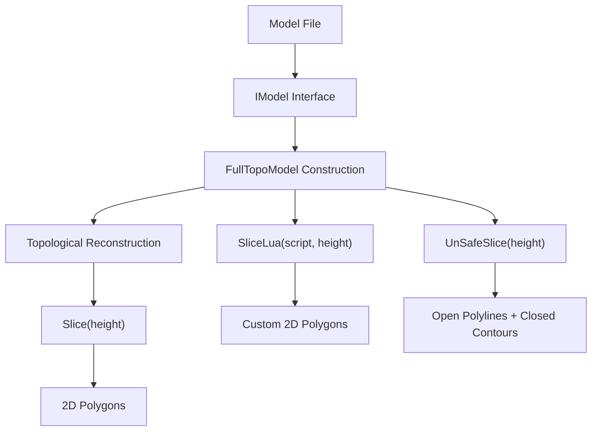
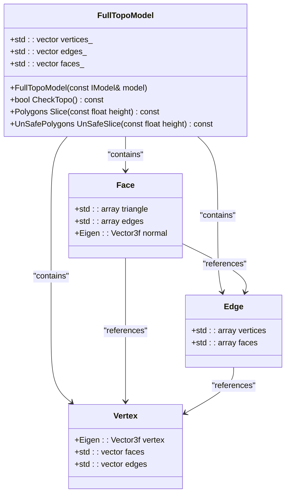
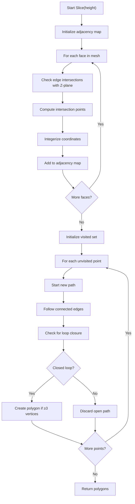
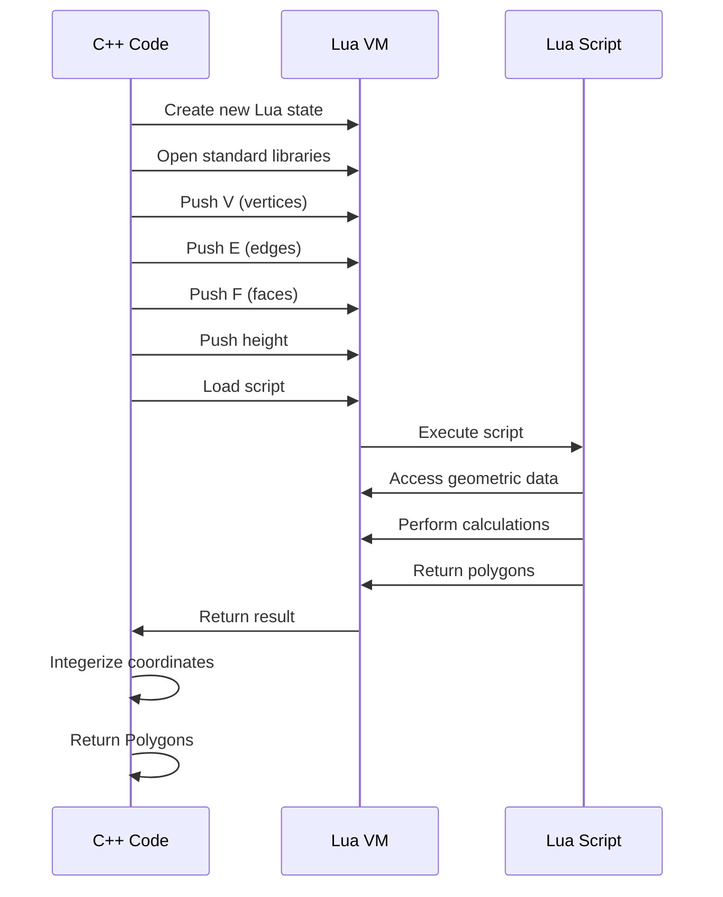

# Data Flow and Processing Pipeline

<cite>
**Referenced Files in This Document**   
- [mesh_slice.cpp](file://LibHsBaSlicer/Slice/mesh_slice.cpp)
- [mesh_slice.hpp](file://LibHsBaSlicer/Slice/mesh_slice.hpp)
- [FullTopoModel.cpp](file://meshmodel/FullTopoModel.cpp)
- [FullTopoModel.hpp](file://meshmodel/FullTopoModel.hpp)
- [IModel.hpp](file://base/IModel.hpp)
- [IntPolygon.hpp](file://2D/IntPolygon.hpp)
- [FloatPolygons.hpp](file://2D/FloatPolygons.hpp)
- [LuaNewObject.hpp](file://utils/LuaNewObject.hpp)
</cite>

## Table of Contents
1. [Introduction](#introduction)
2. [Data Flow Overview](#data-flow-overview)
3. [Model Ingestion via IModel Interface](#model-ingestion-via-imodel-interface)
4. [FullTopoModel Topological Reconstruction](#fulltopomodel-topological-reconstruction)
5. [Slicing Pipeline](#slicing-pipeline)
6. [Safe vs Unsafe Slicing](#safe-vs-unsafe-slicing)
7. [Lua-Scripted Slicing](#lua-scripted-slicing)
8. [Performance and Memory Considerations](#performance-and-memory-considerations)
9. [Common Issues and Error Handling](#common-issues-and-error-handling)
10. [Conclusion](#conclusion)

## Introduction

The HsBaSlicer application implements a sophisticated data flow and processing pipeline for 3D model slicing, designed to efficiently convert raw triangle mesh data into 2D polygonal cross-sections at specified Z-heights. This document details the end-to-end pathway from model ingestion through topological reconstruction to final slice generation, with emphasis on the architectural decisions that enable high-performance slicing operations.

The core of the slicing pipeline revolves around the `FullTopoModel` class, which performs complete topological reconstruction of the input mesh, establishing explicit relationships between vertices, edges, and faces. This pre-processing step enables efficient Z-direction slicing without repeated topological analysis, significantly improving performance for multi-layer slicing operations. The pipeline supports multiple slicing modes, including standard safe slicing, unsafe slicing for specialized manufacturing processes, and Lua-scripted slicing for custom algorithms.

**Section sources**
- [FullTopoModel.hpp](file://meshmodel/FullTopoModel.hpp#L36-L42)
- [mesh_slice.hpp](file://LibHsBaSlicer/Slice/mesh_slice.hpp#L9-L19)

## Data Flow Overview

The data flow in HsBaSlicer follows a structured pipeline that transforms a 3D model into 2D slice polygons through several well-defined stages. The process begins with model ingestion through the `IModel` interface, which provides a standardized way to access triangle mesh data regardless of the underlying model format or implementation.

Once the model data is available, it is passed to the `FullTopoModel` constructor, which performs comprehensive topological reconstruction. This step creates explicit data structures representing vertices, edges, and faces, along with their interrelationships. The reconstructed topology is stored in memory and can be reused for multiple slicing operations at different heights without repeating the computationally expensive reconstruction process.

The final stage is the slicing operation itself, which intersects the reconstructed mesh with a Z-plane at the specified height. The intersection algorithm efficiently computes polygonal cross-sections by analyzing edge-face relationships and constructing closed loops from intersection points. The pipeline supports multiple slicing variants, including safe slicing (which only returns closed contours), unsafe slicing (which includes open polylines), and Lua-scripted slicing (which allows custom algorithms).

**Diagram sources**
- [mesh_slice.cpp](file://LibHsBaSlicer/Slice/mesh_slice.cpp#L5-L26)
- [FullTopoModel.cpp](file://meshmodel/FullTopoModel.cpp#L19-L143)

## Model Ingestion via IModel Interface

The data flow begins with the `IModel` interface, which serves as the abstraction layer for all 3D model representations in HsBaSlicer. This interface defines a contract that all concrete model implementations must satisfy, ensuring consistent access to mesh data regardless of the underlying format or geometry kernel.

The key method in the `IModel` interface is `TriangleMesh()`, which returns the model's geometry as a pair of Eigen matrices representing vertices and faces in the IGL (Interactive Graphics Lab) format. This standardized representation allows the slicing pipeline to operate on any model type that implements the interface, including models based on different computational geometry libraries such as CGAL or IGL.

Concrete implementations of the `IModel` interface, such as `CgalModel` and `IglModel`, handle the specifics of loading and processing different file formats and geometry representations. These classes are responsible for tasks such as file I/O, coordinate transformations, and mesh validation, but they all expose their data through the common `TriangleMesh()` method. This design enables the slicing pipeline to remain agnostic to the source of the mesh data, focusing instead on the topological processing and slicing algorithms.

When a model is passed to the slicing functions, it is typically already loaded and transformed as needed. The `IModel` interface ensures that the slicing pipeline receives consistent, validated mesh data that can be reliably processed by the `FullTopoModel` constructor.

**Section sources**
- [IModel.hpp](file://base/IModel.hpp#L14-L37)
- [CgalModel.cpp](file://meshmodel/CgalModel.cpp#L23-L42)
- [IglModel.cpp](file://meshmodel/IglModel.cpp#L54-L60)

## FullTopoModel Topological Reconstruction

The `FullTopoModel` class is the cornerstone of the HsBaSlicer pipeline, responsible for reconstructing complete topological relationships from raw triangle mesh data. This reconstruction process transforms a simple collection of vertices and faces into a rich data structure that explicitly represents the connectivity between all geometric elements.

During construction, `FullTopoModel` processes the input mesh to create three primary data structures: vertices, edges, and faces. Each vertex stores its 3D coordinates and references to the faces and edges that contain it. Each edge maintains references to its two vertices and the one or two faces that share it (with -1 indicating a boundary edge). Each face contains references to its three vertices and three edges, along with its normal vector if requested.

The reconstruction algorithm iterates through each triangular face in the input mesh, creating or reusing edge records as needed. For each edge defined by two vertices, the algorithm checks if an equivalent edge already exists in the collection. If found, it updates the face references; if not, it creates a new edge record. This process ensures that shared edges between adjacent faces are represented by a single edge object with references to both faces, establishing the complete topological connectivity.

This pre-processing step has significant performance implications, as it shifts the computational cost of topological analysis from the slicing stage to the model loading stage. Once the topological structure is established, multiple slicing operations can be performed efficiently without repeating the connectivity analysis. The reconstructed topology also enables advanced mesh analysis, such as Euler characteristic calculation and topological integrity checking through the `CheckTopo()` method.

**Diagram sources**
- [FullTopoModel.hpp](file://meshmodel/FullTopoModel.hpp#L42-L115)
- [FullTopoModel.cpp](file://meshmodel/FullTopoModel.cpp#L19-L143)

## Slicing Pipeline

The slicing pipeline in HsBaSlicer is designed for efficient Z-direction plane intersection, leveraging the pre-constructed topological model to avoid redundant calculations. The core slicing algorithm, implemented in `FullTopoModel::Slice()`, follows a systematic approach to generate 2D polygonal cross-sections from the 3D mesh.

The algorithm begins by collecting all intersection points between mesh edges and the slicing plane at the specified height. For each triangular face, it checks all three edges for intersection with the Z-plane. The intersection calculation is handled by the `Intersetion()` method, which determines if a line segment crosses the plane and computes the exact intersection point using linear interpolation.

To handle floating-point precision issues, the algorithm employs integerization of coordinates by scaling the X and Y coordinates by a factor of 1e6 (defined as `integerization` in `IntPolygon.hpp`). This conversion to integer coordinates prevents floating-point errors during polygon construction and ensures robust topological operations in subsequent processing stages.

The intersection points are organized into an adjacency map, where each point is associated with its connected neighbors. This graph structure is then traversed to construct closed polygonal loops. The traversal algorithm follows connected edges, ensuring that each polygon is properly closed and that all intersection segments are accounted for. Only polygons with three or more vertices are included in the final result, as smaller collections cannot form valid closed contours.

The slicing function returns a collection of `Polygon` objects, each representing a closed contour in the slice plane. These polygons are ready for further processing, such as path planning, infill generation, or export to manufacturing formats.

**Diagram sources**
- [FullTopoModel.cpp](file://meshmodel/FullTopoModel.cpp#L256-L342)
- [IntPolygon.hpp](file://2D/IntPolygon.hpp#L10)

## Safe vs Unsafe Slicing

HsBaSlicer provides two distinct slicing modes to accommodate different manufacturing requirements: safe slicing and unsafe slicing. These modes are implemented through the `Slice()` and `UnSafeSlice()` methods of the `FullTopoModel` class, respectively, offering different approaches to handling the geometric results of the slicing operation.

Safe slicing, accessed through the `Slice()` function, returns only closed polygonal contours. This mode is appropriate for most additive manufacturing processes where continuous, closed paths are required. The algorithm discards any open polylines or unclosed segments, ensuring that all returned polygons represent valid, enclosed areas. This approach provides robustness against geometric imperfections in the input model, such as small gaps or non-manifold edges, by filtering out potentially problematic open paths.

Unsafe slicing, available through the `UnSafeSlice()` function, includes both closed contours and open polylines in its results. Each result is wrapped in an `UnSafePolygon` structure that includes a `closed` flag indicating whether the path forms a closed loop. This mode is particularly useful for specialized manufacturing processes like wire feeding or directed energy deposition, where open paths may be intentionally used. The documentation notes that unsafe slicing should not be used for SLA (stereolithography) or other area-based processes where closed contours are essential.

The choice between safe and unsafe slicing represents a trade-off between geometric robustness and manufacturing flexibility. Safe slicing ensures that all output is immediately usable for contour-based processes but may discard potentially useful geometric information. Unsafe slicing preserves all intersection geometry, giving downstream processes more information to work with, but requires additional validation to ensure that open paths are handled appropriately.

Both slicing modes share the same underlying intersection algorithm but differ in their post-processing of the results. The safe slicer filters the results to include only closed loops, while the unsafe slicer preserves all paths and annotates them with their closure status.

**Section sources**
- [mesh_slice.hpp](file://LibHsBaSlicer/Slice/mesh_slice.hpp#L11-L15)
- [FullTopoModel.hpp](file://meshmodel/FullTopoModel.hpp#L18-L35)
- [FullTopoModel.cpp](file://meshmodel/FullTopoModel.cpp#L256-L432)

## Lua-Scripted Slicing

The Lua-scripted slicing functionality in HsBaSlicer provides a powerful extension mechanism that allows users to implement custom slicing algorithms through external scripts. This feature is exposed through the `SliceLua()` and `UnSafeSliceLua()` methods of the `FullTopoModel` class, enabling advanced users to override the default slicing behavior with domain-specific logic.

When a Lua script is executed, the `FullTopoModel` exports its complete topological data to the Lua environment as global variables. The vertex data is exposed as a 1-based array `V` containing tables with x, y, and z fields. The edge data is provided as array `E` with vertex indices, and the face data as array `F` with vertex indices. The slicing height is also made available as the global variable `height`.

The Lua script has complete access to this geometric data and can implement any algorithm to generate slice polygons. The script is expected to return a table of polygons, where each polygon is a sequence of point tables with x and y coordinates. These coordinates are automatically integerized using the same scaling factor as the native slicing algorithm to maintain consistency in downstream processing.

The implementation uses a unique Lua state for each script execution, created through `MakeUniqueLuaState()`, ensuring isolation between script runs and proper resource cleanup. The Lua state is initialized with standard libraries and the script is loaded and executed in a protected environment that catches and reports any errors.

This extensibility feature enables advanced use cases such as adaptive slicing based on geometric features, custom support generation algorithms, or integration with external analysis tools. The test cases demonstrate a convex hull algorithm implemented in Lua, showing how complex geometric operations can be performed in the scripting environment.

**Diagram sources**
- [FullTopoModel.cpp](file://meshmodel/FullTopoModel.cpp#L434-L642)
- [LuaNewObject.hpp](file://utils/LuaNewObject.hpp#L57-L61)
- [full_topo_model_test.cpp](file://tests/Models/full_topo_model_test.cpp#L97-L164)

## Performance and Memory Considerations

The design of HsBaSlicer's data flow incorporates several performance and memory optimizations that significantly impact the efficiency of the slicing pipeline. The most significant optimization is the separation of topological reconstruction from the slicing operation, which allows the computationally expensive connectivity analysis to be performed once and reused for multiple slicing heights.

The topological reconstruction process has O(n) time complexity with respect to the number of faces, as each face is processed exactly once to establish edge connectivity. While this initial processing has a noticeable cost, it enables subsequent slicing operations to run in O(m) time, where m is the number of faces intersected by the slicing plane. This is substantially more efficient than approaches that reconstruct topology for each slice, especially for models with many layers.

Memory usage is optimized through the use of compact data structures and efficient container types. The `FullTopoModel` stores vertices, edges, and faces in contiguous vectors, minimizing memory fragmentation and improving cache locality. The adjacency map used during slicing is pre-allocated with an estimated size based on the number of faces, reducing the overhead of dynamic resizing.

The integerization of coordinates, while primarily serving to address floating-point precision issues, also contributes to performance by enabling the use of integer-based algorithms in downstream processing. The scaling factor of 1e6 provides sufficient precision for manufacturing applications while keeping coordinate values within the range of 64-bit integers.

The Lua integration is designed with resource management in mind, using RAII (Resource Acquisition Is Initialization) patterns to ensure that Lua states are properly cleaned up even in the event of exceptions. The `UniqueLua` smart pointer, defined in `LuaNewObject.hpp`, automatically closes the Lua state when it goes out of scope, preventing resource leaks.

For large models, the memory footprint of the `FullTopoModel` is approximately 48 bytes per vertex, 24 bytes per edge, and 60 bytes per face, plus overhead for the container structures. This represents a significant increase over the raw triangle mesh data but is justified by the performance benefits for multi-layer slicing operations.

**Section sources**
- [FullTopoModel.cpp](file://meshmodel/FullTopoModel.cpp#L267-L268)
- [IntPolygon.hpp](file://2D/IntPolygon.hpp#L10)
- [LuaNewObject.hpp](file://utils/LuaNewObject.hpp#L55-L56)

## Common Issues and Error Handling

The HsBaSlicer pipeline includes several mechanisms to handle common geometric issues that can arise with 3D models, particularly those related to non-manifold geometry and floating-point precision. These issues are addressed at multiple stages of the data flow, from topological reconstruction through to the final slicing operation.

Non-manifold geometry, where edges are shared by more than two faces or vertices have inconsistent connectivity, can cause problems in the slicing algorithm. The `FullTopoModel` constructor includes validation checks that skip faces with invalid vertex indices, but it does not perform comprehensive manifold checking. The `CheckTopo()` method provides a basic integrity check, but the documentation notes that the reconstructed topology "may contain errors" and is not guaranteed to be a valid topological manifold.

Floating-point precision issues are addressed through the integerization process used in the slicing algorithm. By scaling coordinates by 1e6 and rounding to integers, the algorithm avoids the accumulation of floating-point errors that can occur during intersection calculations and polygon construction. This approach effectively quantizes the geometry to a fixed precision grid, ensuring consistent results even for models with vertices very close to the slicing plane.

The intersection calculation in `Intersetion()` includes special handling for edge cases, such as when both endpoints lie exactly on the slicing plane. In this case, the algorithm returns one endpoint but indicates that the segment is not a proper intersection, preventing the creation of degenerate zero-length segments.

Error handling is implemented through C++ exceptions, with the Lua interface providing detailed error messages for script loading and execution failures. The `RuntimeError` class, defined in `error.hpp`, is used to report various error conditions, including Lua initialization failures, script loading errors, and runtime exceptions.

For models with known topological issues, users can employ the unsafe slicing mode to examine all intersection geometry, including open polylines that might indicate problems in the model. The Euler characteristic calculation provides a simple metric for assessing topological validity, with values that are not even or greater than 2 suggesting potential issues with the model.

**Section sources**
- [FullTopoModel.cpp](file://meshmodel/FullTopoModel.cpp#L230-L254)
- [FullTopoModel.hpp](file://meshmodel/FullTopoModel.hpp#L81-L83)
- [error.hpp](file://base/error.hpp#L12-L139)

## Conclusion

The data flow and processing pipeline in HsBaSlicer demonstrates a well-architected approach to 3D model slicing, balancing performance, flexibility, and robustness. By separating topological reconstruction from the slicing operation, the system achieves significant efficiency gains for multi-layer processing while maintaining the ability to handle complex geometric operations.

The `FullTopoModel` class serves as the central component of this pipeline, transforming raw triangle mesh data into a rich topological representation that enables efficient Z-plane intersection. This design decision shifts computational costs to the model loading phase, allowing subsequent slicing operations to proceed rapidly without repeating connectivity analysis.

The pipeline supports multiple slicing modes to accommodate different manufacturing requirements, from the robust safe slicing for standard additive processes to the flexible unsafe slicing for specialized techniques. The Lua-scripted slicing extension provides a powerful mechanism for custom algorithms, opening the system to domain-specific optimizations and advanced processing techniques.

Performance considerations are addressed through careful memory management, efficient data structures, and the use of integerization to mitigate floating-point precision issues. The system handles common geometric problems through validation checks and robust intersection algorithms, while providing tools for diagnosing and addressing model quality issues.

Overall, the HsBaSlicer pipeline represents a sophisticated solution to the challenges of 3D model processing, combining algorithmic efficiency with practical considerations for real-world manufacturing applications.

[No sources needed since this section summarizes without analyzing specific files]