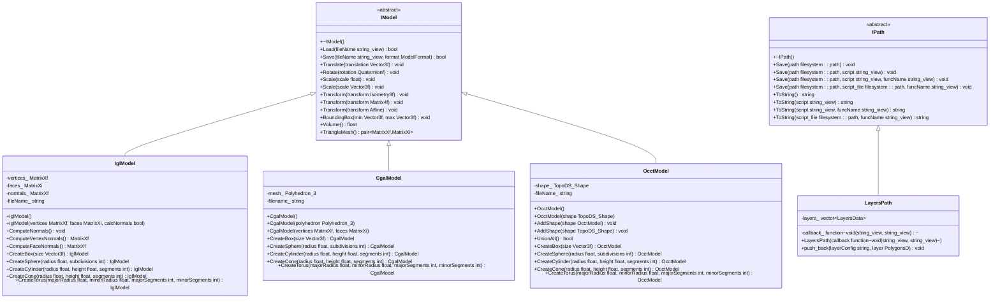
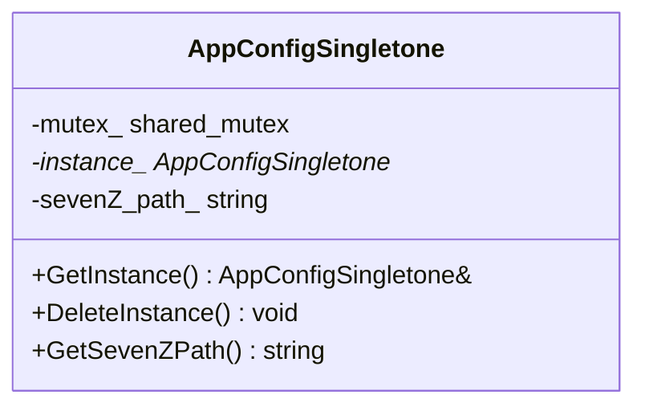
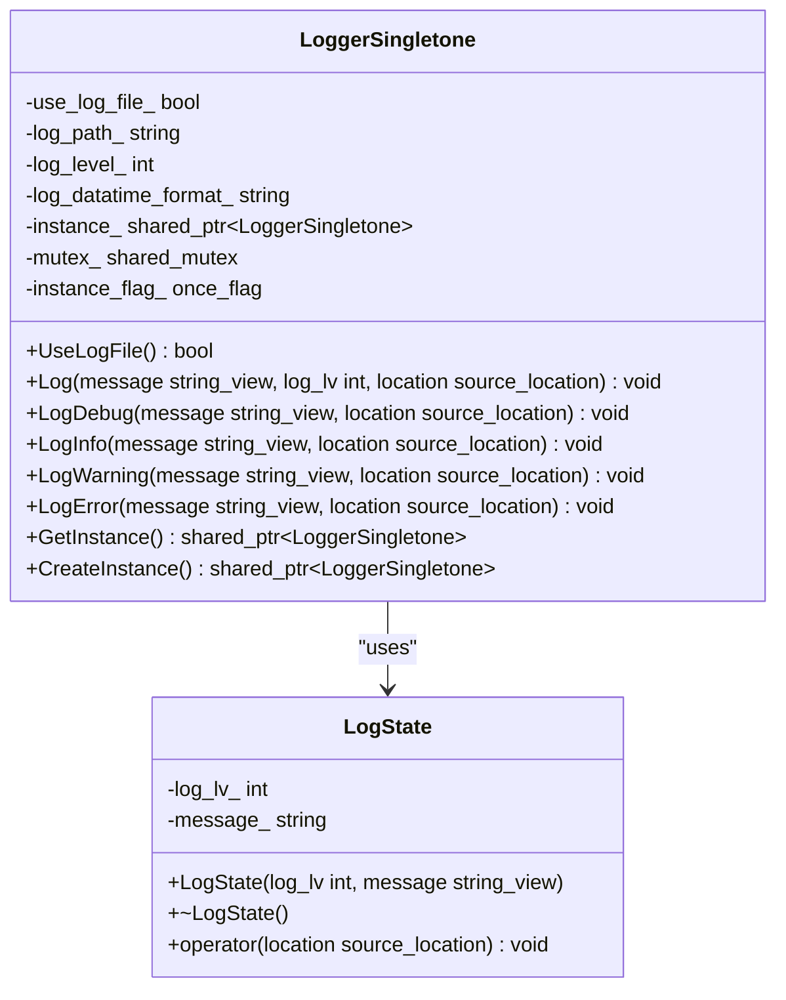
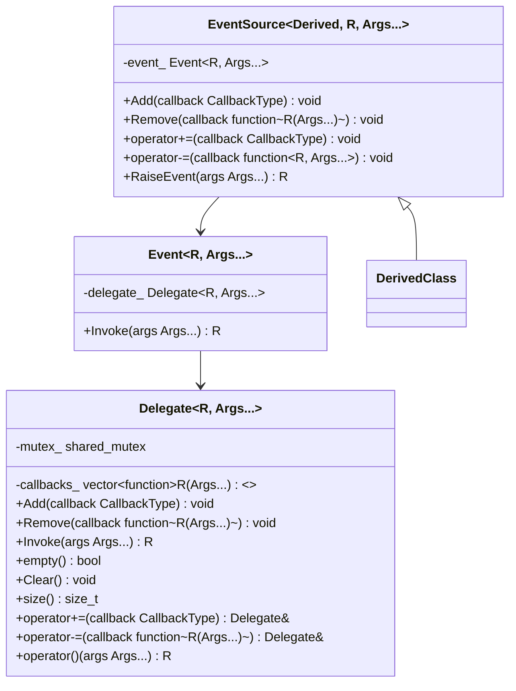
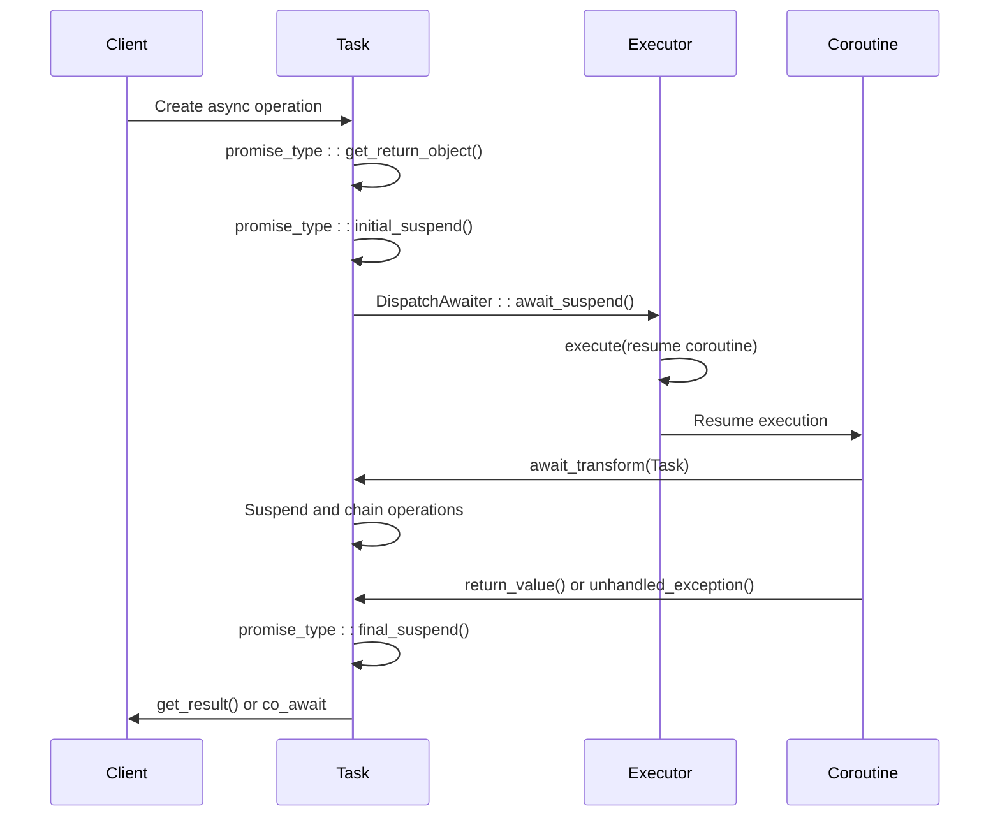
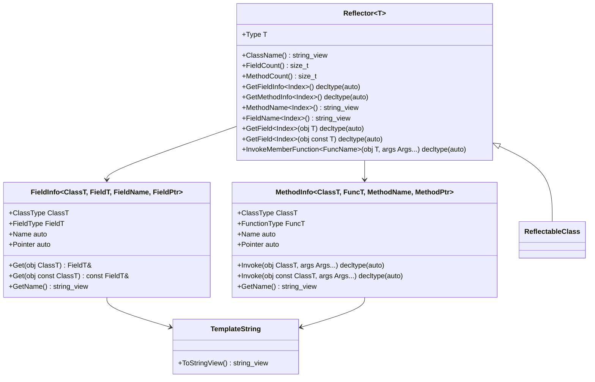

# Design Patterns and Abstraction Layers

<cite>
**Referenced Files in This Document**   
- [IModel.hpp](file://base/IModel.hpp)
- [IPath.hpp](file://paths/IPath.hpp)
- [IglModel.hpp](file://meshmodel/IglModel.hpp)
- [CgalModel.hpp](file://meshmodel/CgalModel.hpp)
- [OcctModel.hpp](file://cadmodel/OcctModel.hpp)
- [layerspath.hpp](file://paths/layerspath.hpp)
- [singleton.hpp](file://base/singleton.hpp)
- [app_config.hpp](file://utils/app_config.hpp)
- [app_config.cpp](file://utils/app_config.cpp)
- [logger.hpp](file://logger/logger.hpp)
- [logger.cpp](file://logger/logger.cpp)
- [delegate.hpp](file://base/delegate.hpp)
- [coroutine.hpp](file://base/coroutine.hpp)
- [static_reflect.hpp](file://base/static_reflect.hpp)
- [base_interface.hpp](file://base/base_interface.hpp)
</cite>

## Table of Contents
1. [Introduction](#introduction)
2. [Interface-Based Polymorphism](#interface-based-polymorphism)
3. [Pimpl Idiom for Compilation Isolation](#pimpl-idiom-for-compilation-isolation)
4. [Singleton Pattern Implementation](#singleton-pattern-implementation)
5. [Delegates and Coroutines for Asynchronous Operations](#delegates-and-coroutines-for-asynchronous-operations)
6. [Static Reflection and Template Metaprogramming](#static-reflection-and-template-metaprogramming)
7. [Architecture Extension Guidelines](#architecture-extension-guidelines)
8. [Pattern Trade-offs and Performance Considerations](#pattern-trade-offs-and-performance-considerations)
9. [Conclusion](#conclusion)

## Introduction
HsBaSlicer implements a sophisticated C++20 architecture leveraging modern design patterns to achieve high performance, maintainability, and extensibility. The system employs interface-based polymorphism through abstract base classes, enabling interchangeable backends for mesh processing (IGL, CGAL) and CAD operations (OpenCASCADE). This documentation analyzes the key design patterns used throughout the codebase, focusing on their implementation details, benefits, and trade-offs in the context of a high-performance slicing application.

The architecture emphasizes binary compatibility, reduced compilation dependencies, and type safety through patterns like Pimpl, Singleton, delegates, coroutines, and static reflection. These patterns work together to create a modular system where components can be developed and tested independently while maintaining high performance characteristics essential for computational geometry operations.

**Section sources**
- [IModel.hpp](file://base/IModel.hpp)
- [IPath.hpp](file://paths/IPath.hpp)

## Interface-Based Polymorphism
HsBaSlicer implements interface-based polymorphism through abstract base classes that define contracts for model and path operations. The `IModel` interface in `base/IModel.hpp` serves as the foundation for all 3D model representations, providing a consistent API for loading, saving, transforming, and querying geometric properties regardless of the underlying implementation.



**Diagram sources**
- [base/IModel.hpp](file://base/IModel.hpp)
- [meshmodel/IglModel.hpp](file://meshmodel/IglModel.hpp)
- [meshmodel/CgalModel.hpp](file://meshmodel/CgalModel.hpp)
- [cadmodel/OcctModel.hpp](file://cadmodel/OcctModel.hpp)
- [paths/IPath.hpp](file://paths/IPath.hpp)
- [paths/layerspath.hpp](file://paths/layerspath.hpp)

The `IModel` interface defines a comprehensive contract for 3D model operations, including geometric transformations (translation, rotation, scaling), file I/O operations, and property queries (bounding box, volume). Concrete implementations like `IglModel`, `CgalModel`, and `OcctModel` provide backend-specific functionality while maintaining the same interface. This allows client code to work with models polymorphically without knowledge of the underlying implementation.

Similarly, the `IPath` interface in `paths/IPath.hpp` abstracts path generation operations, with `LayersPath` providing a concrete implementation for layer-based path generation. This interface-based approach enables the system to support multiple path generation strategies while maintaining a consistent API.

**Section sources**
- [base/IModel.hpp](file://base/IModel.hpp)
- [meshmodel/IglModel.hpp](file://meshmodel/IglModel.hpp)
- [meshmodel/CgalModel.hpp](file://meshmodel/CgalModel.hpp)
- [cadmodel/OcctModel.hpp](file://cadmodel/OcctModel.hpp)
- [paths/IPath.hpp](file://paths/IPath.hpp)
- [paths/layerspath.hpp](file://paths/layerspath.hpp)

## Pimpl Idiom for Compilation Isolation
The codebase employs the Pimpl (Pointer to Implementation) idiom to reduce compilation dependencies and improve binary compatibility. While not explicitly visible in the provided headers, the pattern is evident in the separation of interface and implementation through abstract base classes and forward declarations.

The `IModel` and `IPath` interfaces serve as stable contracts that hide the implementation details of their concrete counterparts. This allows changes to the internal implementation of `IglModel`, `CgalModel`, or `OcctModel` without requiring recompilation of client code that depends only on the `IModel` interface. The use of `std::string_view` and `std::filesystem::path` parameters further enhances this isolation by avoiding direct dependencies on specific string or path implementations.

The logger system in `logger.hpp` also demonstrates Pimpl principles through its `Private` struct and opaque implementation details. The `LoggerSingletone::Private` struct acts as a key to the constructor, preventing direct instantiation while allowing controlled access through the singleton pattern. This design hides the internal state and implementation details of the logger while exposing a stable public interface.

**Section sources**
- [base/IModel.hpp](file://base/IModel.hpp)
- [logger/logger.hpp](file://logger/logger.hpp)

## Singleton Pattern Implementation
HsBaSlicer implements the singleton pattern for global state management in both the `AppConfigSingletone` and `LoggerSingletone` classes. The implementation follows modern C++ practices using Meyer's singleton pattern with `std::call_once` for thread-safe initialization.

The `AppConfigSingletone` in `utils/app_config.hpp` and `utils/app_config.cpp` provides a thread-safe singleton for application configuration with lazy initialization:



**Diagram sources**
- [utils/app_config.hpp](file://utils/app_config.hpp)
- [utils/app_config.cpp](file://utils/app_config.cpp)

The `LoggerSingletone` in `logger/logger.hpp` and `logger/logger.cpp` implements a more sophisticated singleton pattern with additional features:



**Diagram sources**
- [logger/logger.hpp](file://logger/logger.hpp)
- [logger/logger.cpp](file://logger/logger.cpp)

Both implementations use `std::shared_mutex` for concurrent read access and `std::unique_lock` for exclusive write access, optimizing performance in multi-threaded scenarios. The logger also incorporates RAII-based logging through user-defined literals (`_log_debug`, `_log_info`, etc.) that create `LogState` objects for automatic logging at scope exit.

**Section sources**
- [utils/app_config.hpp](file://utils/app_config.hpp)
- [utils/app_config.cpp](file://utils/app_config.cpp)
- [logger/logger.hpp](file://logger/logger.hpp)
- [logger/logger.cpp](file://logger/logger.cpp)

## Delegates and Coroutines for Asynchronous Operations
The codebase implements a comprehensive system for asynchronous operations using delegates and coroutines. The `Delegate` class in `base/delegate.hpp` provides a thread-safe mechanism for event subscription and notification:



**Diagram sources**
- [base/delegate.hpp](file://base/delegate.hpp)

The `Task` coroutine framework in `base/coroutine.hpp` provides a modern C++20 implementation of asynchronous operations with support for different executors:



**Diagram sources**
- [base/coroutine.hpp](file://base/coroutine.hpp)

The coroutine system supports multiple executor types (`NoopExecutor`, `NewThreadExecutor`, `AsyncExecutor`) that determine how continuation tasks are scheduled. The `Task` class implements the coroutine interface with a custom `promise_type` that manages the coroutine state, result storage, and exception handling. Continuation callbacks (`then`, `catching`, `finally`) allow for fluent composition of asynchronous operations.

**Section sources**
- [base/delegate.hpp](file://base/delegate.hpp)
- [base/coroutine.hpp](file://base/coroutine.hpp)

## Static Reflection and Template Metaprogramming
The `static_reflect.hpp` header implements a sophisticated static reflection system using C++20 template metaprogramming. This system enables type-safe configuration mapping and introspection without runtime overhead:



**Diagram sources**
- [base/static_reflect.hpp](file://base/static_reflect.hpp)

The system uses several advanced C++20 features:
- **Template parameters with concepts**: The `Reflectable` concept ensures that only classes with the required reflection metadata can be used with the `Reflector`
- **Non-type template parameters**: String literals are passed as template parameters using the `TemplateString` type
- **Constexpr if and fold expressions**: Enable compile-time branching and iteration over tuple elements
- **Requires clauses**: Constrain template instantiations based on structural requirements

This static reflection system enables type-safe configuration mapping by allowing compile-time inspection of class members and their attributes. It can be used to automatically generate serialization code, validate configuration structures, or create user interfaces based on class metadata.

**Section sources**
- [base/static_reflect.hpp](file://base/static_reflect.hpp)

## Architecture Extension Guidelines
To extend the HsBaSlicer architecture with new model types or path generators, follow these guidelines:

### Adding New Model Types
1. Create a new class that inherits from `IModel` in the appropriate backend directory (`meshmodel` for mesh-based models, `cadmodel` for CAD-based models)
2. Implement all pure virtual methods from the `IModel` interface
3. Ensure proper memory management and exception safety in constructors and destructors
4. Implement factory methods for common geometric primitives (box, sphere, cylinder, etc.)
5. Add appropriate hash specializations if the model will be used in unordered containers

Example structure for a new model type:
```cpp
class NewModel final : public IModel
{
public:
    NewModel() = default;
    NewModel(const Eigen::MatrixXf& vertices, const Eigen::MatrixXi& faces);
    NewModel(const NewModel& o) = default;
    NewModel& operator=(const NewModel& o) = default;
    NewModel(NewModel&& o) = default;
    NewModel& operator=(NewModel&& o) = default;
    ~NewModel() = default;
    
    // IModel interface implementation
    bool Load(std::string_view fileName) override;
    bool Save(std::string_view fileName, const ModelFormat format) const override;
    void Translate(const Eigen::Vector3f& translation) override;
    void Rotate(const Eigen::Quaternionf& rotation) override;
    void Scale(const float scale) override;
    void Scale(const Eigen::Vector3f& scale) override;
    void Transform(const Eigen::Isometry3f& transform) override;
    void Transform(const Eigen::Matrix4f& transform) override;
    void Transform(const Eigen::Transform<float, 3, Eigen::Affine>& transform) override;
    void BoundingBox(Eigen::Vector3f& min, Eigen::Vector3f& max) const override;
    float Volume() const override;
    std::pair<Eigen::MatrixXf, Eigen::MatrixXi> TriangleMesh() const override;
    
    // Factory methods
    static NewModel CreateBox(const Eigen::Vector3f& size);
    static NewModel CreateSphere(const float radius, const int subdivisions = 3);
    static NewModel CreateCylinder(const float radius, const float height, const int segments = 32);
    static NewModel CreateCone(const float radius, const float height, const int segments = 32);
    static NewModel CreateTorus(const float majorRadius, const float minorRadius, const int majorSegments = 32, const int minorSegments = 16);
    
private:
    // Implementation-specific data members
    std::vector<Vertex> vertices_;
    std::vector<Face> faces_;
    std::string fileName_;
};
```

### Adding New Path Generators
1. Create a new class that inherits from `IPath` in the `paths` directory
2. Implement all pure virtual methods from the `IPath` interface
3. Consider using the `EventSource` pattern if the path generator needs to notify subscribers of progress or completion
4. Implement appropriate serialization methods for the specific path format

Example structure for a new path generator:
```cpp
class NewPath : public IPath
{
public:
    NewPath(const std::function<void(std::string_view, std::string_view)>& callback = [](std::string_view, std::string_view){});
    ~NewPath() override = default;
    
    // IPath interface implementation
    void Save(const std::filesystem::path& path) const override;
    void Save(const std::filesystem::path& path, std::string_view script) const override;
    void Save(const std::filesystem::path& path, std::string_view script, std::string_view funcName) const override;
    void Save(const std::filesystem::path& path, const std::filesystem::path& script_file, std::string_view funcName) const override;
    std::string ToString() const override;
    std::string ToString(const std::string_view script) const override;
    std::string ToString(const std::string_view script, const std::string_view funcName) const override;
    std::string ToString(const std::filesystem::path& script_file, const std::string_view funcName) const override;
    
    // Additional methods specific to this path type
    void AddSegment(const Segment& segment);
    void SetParameters(const PathParameters& params);
    
private:
    std::function<void(std::string_view, std::string_view)> callback_;
    std::vector<PathSegment> segments_;
    PathParameters parameters_;
};
```

**Section sources**
- [base/IModel.hpp](file://base/IModel.hpp)
- [paths/IPath.hpp](file://paths/IPath.hpp)
- [meshmodel/IglModel.hpp](file://meshmodel/IglModel.hpp)
- [paths/layerspath.hpp](file://paths/layerspath.hpp)

## Pattern Trade-offs and Performance Considerations
Each design pattern in HsBaSlicer involves specific trade-offs that balance performance, maintainability, and flexibility:

### Interface-Based Polymorphism Trade-offs
**Benefits:**
- Enables interchangeable backends for mesh and CAD operations
- Provides a stable API that insulates client code from implementation changes
- Facilitates unit testing through dependency injection
- Supports multiple inheritance hierarchies for cross-cutting concerns

**Performance Implications:**
- Virtual function calls introduce indirection overhead
- Object slicing can occur if not handled properly
- Memory layout may be less cache-friendly compared to value types
- Dynamic dispatch prevents certain compiler optimizations

**Mitigations:**
- Use final classes when possible to enable devirtualization
- Minimize the number of virtual function calls in performance-critical paths
- Consider using CRTP (Curiously Recurring Template Pattern) for static polymorphism where appropriate
- Profile critical sections to identify and optimize hot paths

### Pimpl Idiom Trade-offs
**Benefits:**
- Reduces compilation dependencies and build times
- Improves binary compatibility across library versions
- Hides implementation details and reduces header bloat
- Enables changing implementation without recompiling client code

**Performance Implications:**
- Additional heap allocation for implementation object
- Indirect memory access patterns may reduce cache efficiency
- Increased memory usage due to pointer overhead
- Potential for memory fragmentation

**Mitigations:**
- Use object pools or custom allocators for frequently created Pimpl objects
- Consider small object optimization for small implementation types
- Cache frequently accessed data to reduce indirection
- Use stack-based alternatives for performance-critical components

### Singleton Pattern Trade-offs
**Benefits:**
- Ensures single instance of global state
- Provides controlled access to shared resources
- Lazy initialization reduces startup overhead
- Thread-safe initialization with modern C++ primitives

**Performance Implications:**
- Global state can create hidden dependencies
- Mutex contention in high-concurrency scenarios
- Difficult to test due to global state
- Potential for memory leaks if not properly managed

**Mitigations:**
- Minimize the scope of singleton usage
- Use dependency injection where possible
- Implement proper cleanup mechanisms
- Consider using scoped singletons or context-based instances

### Delegates and Coroutines Trade-offs
**Benefits:**
- Enables asynchronous programming without blocking threads
- Supports complex event-driven architectures
- Provides type-safe callback mechanisms
- Facilitates responsive user interfaces

**Performance Implications:**
- Heap allocation for captured variables and continuation state
- Context switching overhead between coroutines
- Memory usage for suspended coroutine frames
- Complexity in debugging asynchronous code

**Mitigations:**
- Use lightweight executors for simple operations
- Minimize captured variables in lambdas
- Consider using futures for simple asynchronous operations
- Profile coroutine usage to identify bottlenecks

### Static Reflection Trade-offs
**Benefits:**
- Compile-time introspection without runtime overhead
- Type-safe configuration mapping
- Automatic code generation for repetitive tasks
- Improved maintainability through DRY principles

**Performance Implications:**
- Increased compilation times due to template instantiation
- Larger binary size from generated code
- Complex error messages from template instantiation failures
- Limited IDE support for template-heavy code

**Mitigations:**
- Use precompiled headers for heavily templated code
- Factor out complex templates into separate compilation units
- Provide clear error messages through static_assert
- Document template requirements thoroughly

**Section sources**
- [base/IModel.hpp](file://base/IModel.hpp)
- [base/singleton.hpp](file://base/singleton.hpp)
- [base/delegate.hpp](file://base/delegate.hpp)
- [base/coroutine.hpp](file://base/coroutine.hpp)
- [base/static_reflect.hpp](file://base/static_reflect.hpp)

## Conclusion
HsBaSlicer's architecture demonstrates a sophisticated application of modern C++ design patterns to create a high-performance, maintainable, and extensible slicing application. The interface-based polymorphism through `IModel` and `IPath` abstractions enables interchangeable backends while maintaining a consistent API. The Pimpl idiom and careful header design reduce compilation dependencies and improve binary compatibility.

The singleton pattern implementations for `AppConfigSingletone` and `LoggerSingletone` provide thread-safe global state management with lazy initialization. The delegate and coroutine systems enable responsive, asynchronous operations essential for a computational geometry application. Finally, the static reflection framework in `static_reflect.hpp` provides powerful compile-time introspection capabilities for type-safe configuration mapping.

These patterns work together to create a robust architecture that balances performance requirements with maintainability and extensibility. The codebase demonstrates modern C++20 practices including concepts, coroutines, and advanced template metaprogramming, while maintaining a clean separation of concerns through well-defined interfaces and abstraction layers.

When extending the architecture, developers should follow the established patterns for new model types and path generators, ensuring consistency with the existing codebase. Performance considerations should be balanced against maintainability, with profiling used to identify and optimize critical paths.