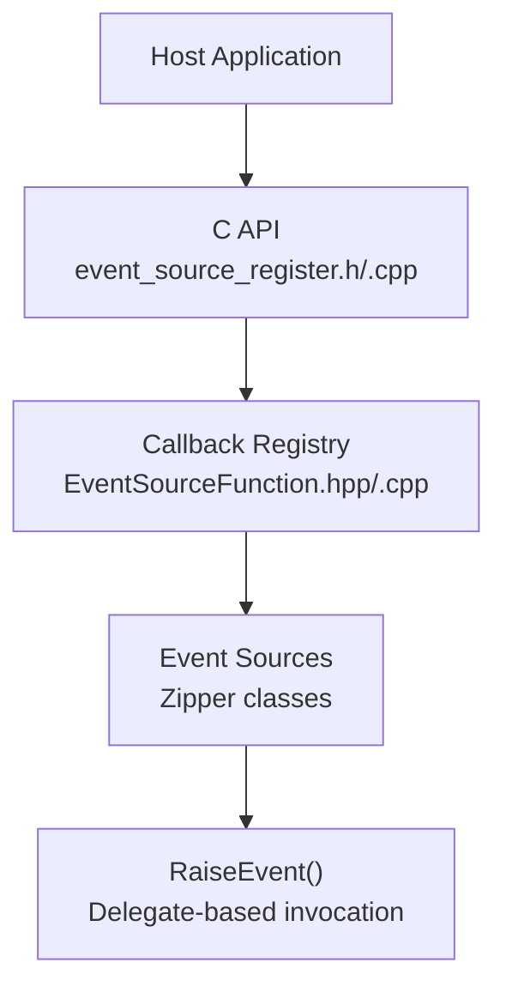
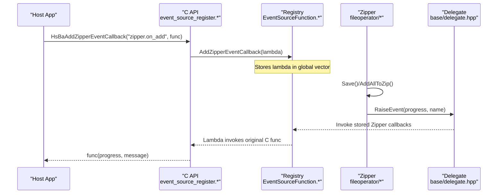
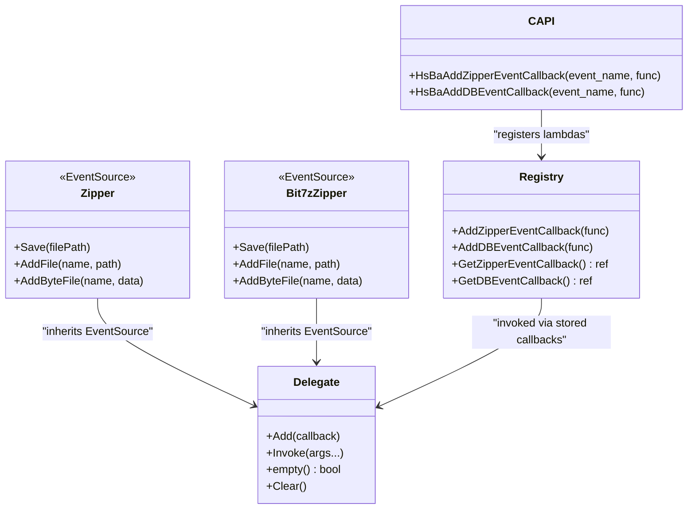

# Event Source Registration System

<cite>
**Referenced Files in This Document**
- [event_source_register.h](file://DllHsBaSlicer/event_source_register.h)
- [event_source_register.cpp](file://DllHsBaSlicer/event_source_register.cpp)
- [EventSourceFunction.hpp](file://LibHsBaSlicer/Extends/EventSourceFunction.hpp)
- [EventSourceFunction.cpp](file://LibHsBaSlicer/Extends/EventSourceFunction.cpp)
- [zipper.hpp](file://fileoperator/zipper.hpp)
- [zipper.cpp](file://fileoperator/zipper.cpp)
- [bit7z_zipper.hpp](file://fileoperator/bit7z_zipper.hpp)
- [delegate.hpp](file://base/delegate.hpp)
- [README.md](file://docs/en/DllHsBaSlicer/README.md)
</cite>

## Table of Contents
1. [Introduction](#introduction)
2. [Project Structure](#project-structure)
3. [Core Components](#core-components)
4. [Architecture Overview](#architecture-overview)
5. [Detailed Component Analysis](#detailed-component-analysis)
6. [Dependency Analysis](#dependency-analysis)
7. [Performance Considerations](#performance-considerations)
8. [Troubleshooting Guide](#troubleshooting-guide)
9. [Conclusion](#conclusion)

## Introduction
This document explains the Event Source Registration System used by HsBaSlicer to expose internal events (such as Zipper compression progress and Database operations) to host applications. It covers how C-style callbacks are registered, how they are bridged into the library’s C++ event system, and how consumers can integrate with these events safely across threads.

## Project Structure
The event registration spans three layers:
- C API surface for external hosts (DllHsBaSlicer)
- C++ callback registry (LibHsBaSlicer Extends)
- Event sources that raise events (fileoperator zip implementations and database adapters)

**Diagram sources**
- [event_source_register.h:1-18](file://DllHsBaSlicer/event_source_register.h#L1-L18)
- [event_source_register.cpp:1-27](file://DllHsBaSlicer/event_source_register.cpp#L1-L27)
- [EventSourceFunction.hpp:1-40](file://LibHsBaSlicer/Extends/EventSourceFunction.hpp#L1-L40)
- [EventSourceFunction.cpp:1-23](file://LibHsBaSlicer/Extends/EventSourceFunction.cpp#L1-L23)
- [zipper.hpp:37-75](file://fileoperator/zipper.hpp#L37-L75)
- [zipper.cpp:96-117](file://fileoperator/zipper.cpp#L96-L117)

**Section sources**
- [event_source_register.h:1-18](file://DllHsBaSlicer/event_source_register.h#L1-L18)
- [event_source_register.cpp:1-27](file://DllHsBaSlicer/event_source_register.cpp#L1-L27)
- [EventSourceFunction.hpp:1-40](file://LibHsBaSlicer/Extends/EventSourceFunction.hpp#L1-L40)
- [EventSourceFunction.cpp:1-23](file://LibHsBaSlicer/Extends/EventSourceFunction.cpp#L1-L23)
- [zipper.hpp:37-75](file://fileoperator/zipper.hpp#L37-L75)
- [zipper.cpp:96-117](file://fileoperator/zipper.cpp#L96-L117)

## Core Components
- C API for registering callbacks:
  - HsBaAddZipperEventCallback(event_name, func)
  - HsBaAddDBEventCallback(event_name, func)
- C++ callback registry:
  - AddZipperEventCallback(func), GetZipperEventCallback()
  - AddDBEventCallback(func), GetDBEventCallback()
- Event sources raising events:
  - Zipper and Bit7zZipper derive from a delegate-based EventSource and call RaiseEvent during compression steps.

Key responsibilities:
- The C API provides a stable, language-neutral entry point for hosts.
- The registry stores std::function callbacks and exposes them via getters.
- Event sources invoke registered callbacks at meaningful points (e.g., per-file progress).

**Section sources**
- [event_source_register.h:11-13](file://DllHsBaSlicer/event_source_register.h#L11-L13)
- [event_source_register.cpp:5-27](file://DllHsBaSlicer/event_source_register.cpp#L5-L27)
- [EventSourceFunction.hpp:14-37](file://LibHsBaSlicer/Extends/EventSourceFunction.hpp#L14-L37)
- [EventSourceFunction.cpp:5-22](file://LibHsBaSlicer/Extends/EventSourceFunction.cpp#L5-L22)
- [zipper.hpp:37-75](file://fileoperator/zipper.hpp#L37-L75)
- [zipper.cpp:114-115](file://fileoperator/zipper.cpp#L114-L115)

## Architecture Overview
The system uses a layered design:
- Host calls C functions to register callbacks.
- C wrappers convert C function pointers into C++ lambdas and store them in global vectors.
- Internal components (e.g., Zipper) raise events through a delegate-based mechanism.
- Registered callbacks are invoked synchronously on the worker thread; hosts must marshal UI updates if needed.

**Diagram sources**
- [event_source_register.cpp:5-15](file://DllHsBaSlicer/event_source_register.cpp#L5-L15)
- [EventSourceFunction.cpp:7-14](file://LibHsBaSlicer/Extends/EventSourceFunction.cpp#L7-L14)
- [zipper.cpp:114-115](file://fileoperator/zipper.cpp#L114-L115)
- [delegate.hpp:197-243](file://base/delegate.hpp#L197-L243)

## Detailed Component Analysis

### C API Layer (DllHsBaSlicer)
- Exposes two functions for registering C-style callbacks.
- Wraps user-provided function pointers into C++ lambdas and forwards them to the registry.
- Filters events by event_name strings (e.g., "zipper.on_add", "db.on_query").

Implementation highlights:
- HsBaAddZipperEventCallback registers a lambda that matches the expected signature and forwards progress and message.
- HsBaAddDBEventCallback registers a lambda that matches query/result signatures.

**Section sources**
- [event_source_register.h:11-13](file://DllHsBaSlicer/event_source_register.h#L11-L13)
- [event_source_register.cpp:5-27](file://DllHsBaSlicer/event_source_register.cpp#L5-L27)

### Callback Registry (LibHsBaSlicer Extends)
- Maintains static vectors of std::function callbacks for Zipper and DB events.
- Provides Add* methods to append callbacks and Get* methods to retrieve them.
- Simple, efficient storage suitable for synchronous invocation from worker threads.

Design notes:
- No synchronization is applied in the registry itself; callers should ensure registration occurs before use or handle concurrency appropriately.
- Accessors return references to allow iteration and invocation by event sources.

**Section sources**
- [EventSourceFunction.hpp:14-37](file://LibHsBaSlicer/Extends/EventSourceFunction.hpp#L14-L37)
- [EventSourceFunction.cpp:5-22](file://LibHsBaSlicer/Extends/EventSourceFunction.cpp#L5-L22)

### Event Sources (Zipper Implementations)
- Both miniz-based Zipper and bit7z-based Bit7zZipper inherit from a delegate-based EventSource.
- During compression, they compute progress and call RaiseEvent with current percentage and file name.
- The delegate invokes all registered callbacks in order.

Usage pattern:
- Register callbacks early (e.g., after initialize()).
- Ensure callbacks copy any string data they need beyond the callback scope.

**Section sources**
- [zipper.hpp:37-75](file://fileoperator/zipper.hpp#L37-L75)
- [zipper.cpp:114-115](file://fileoperator/zipper.cpp#L114-L115)
- [bit7z_zipper.hpp:46-73](file://fileoperator/bit7z_zipper.hpp#L46-L73)

### Delegate and EventSource (base)
- Delegate holds multiple callbacks and invokes them with thread-safe access using shared_mutex.
- EventSource provides a CRTP base to add/remove callbacks and raise events.
- Supports void-returning callbacks and additive result types.

Thread model:
- Invocation is synchronized internally to avoid concurrent modification while iterating.
- Callbacks themselves run on the caller’s thread (typically a worker thread).

**Section sources**
- [delegate.hpp:27-167](file://base/delegate.hpp#L27-L167)
- [delegate.hpp:173-243](file://base/delegate.hpp#L173-L243)

### Integration Points
- SLA floor pipeline passes GetZipperEventCallback() to ImagesPath construction, enabling progress reporting during packaging.
- Documentation outlines threading expectations and marshaling requirements for UI integration.

**Section sources**
- [README.md:329-374](file://docs/en/DllHsBaSlicer/README.md#L329-L374)

## Dependency Analysis
The following diagram shows key dependencies among modules involved in event registration and invocation.

**Diagram sources**
- [event_source_register.h:11-13](file://DllHsBaSlicer/event_source_register.h#L11-L13)
- [event_source_register.cpp:5-27](file://DllHsBaSlicer/event_source_register.cpp#L5-L27)
- [EventSourceFunction.hpp:14-37](file://LibHsBaSlicer/Extends/EventSourceFunction.hpp#L14-L37)
- [zipper.hpp:37-75](file://fileoperator/zipper.hpp#L37-L75)
- [bit7z_zipper.hpp:46-73](file://fileoperator/bit7z_zipper.hpp#L46-L73)
- [delegate.hpp:27-167](file://base/delegate.hpp#L27-L167)

**Section sources**
- [event_source_register.h:11-13](file://DllHsBaSlicer/event_source_register.h#L11-L13)
- [event_source_register.cpp:5-27](file://DllHsBaSlicer/event_source_register.cpp#L5-L27)
- [EventSourceFunction.hpp:14-37](file://LibHsBaSlicer/Extends/EventSourceFunction.hpp#L14-L37)
- [zipper.hpp:37-75](file://fileoperator/zipper.hpp#L37-L75)
- [bit7z_zipper.hpp:46-73](file://fileoperator/bit7z_zipper.hpp#L46-L73)
- [delegate.hpp:27-167](file://base/delegate.hpp#L27-L167)

## Performance Considerations
- Callback storage is O(1) push_back; iteration is O(n) per event raise.
- Delegate uses shared_mutex for safe concurrent access; keep callback count reasonable to minimize lock contention.
- Avoid heavy work inside callbacks; prefer lightweight processing and offload to background tasks when necessary.
- String views passed to callbacks are valid only during the callback; copy required data immediately.

[No sources needed since this section provides general guidance]

## Troubleshooting Guide
Common issues and resolutions:
- Callback not triggered:
  - Ensure registration happens before starting operations.
  - Verify event_name matches the filter used by the C wrapper (e.g., "zipper.on_add", "db.on_query").
- UI freezes or crashes:
  - Callbacks execute on worker threads; marshal UI updates back to the UI thread.
  - Copy UTF-8 strings within the callback; do not retain string_view beyond the callback scope.
- Missing progress updates:
  - Confirm that the event source actually raises events (e.g., Zipper.Save/AddAllToZip loops).
  - Check that GetZipperEventCallback() is passed where needed (e.g., ImagesPath construction).

**Section sources**
- [event_source_register.cpp:10-14](file://DllHsBaSlicer/event_source_register.cpp#L10-L14)
- [zipper.cpp:114-115](file://fileoperator/zipper.cpp#L114-L115)
- [README.md:364-374](file://docs/en/DllHsBaSlicer/README.md#L364-L374)

## Conclusion
The Event Source Registration System provides a clean separation between host-facing C APIs and internal C++ event mechanisms. By registering simple C callbacks, hosts can observe Zipper compression progress and database operations without deep coupling to internal implementation details. Proper attention to threading and string lifetimes ensures robust integration across diverse host environments.

[No sources needed since this section summarizes without analyzing specific files]