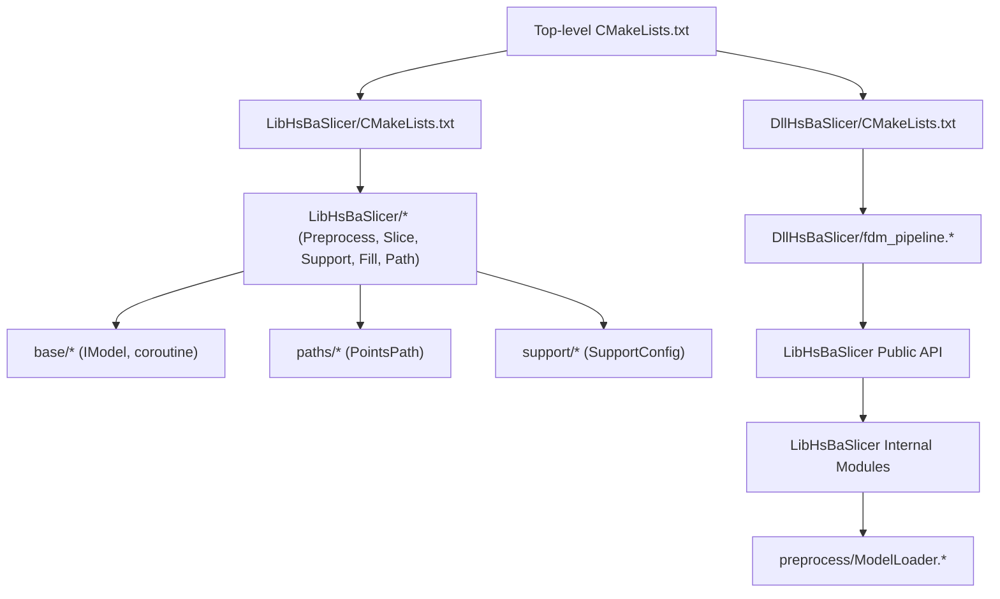
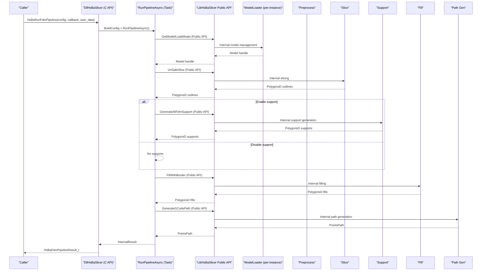
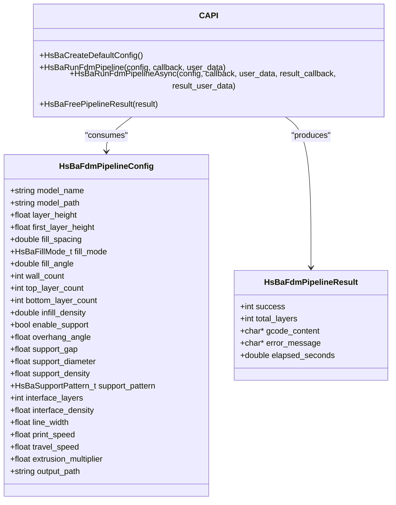
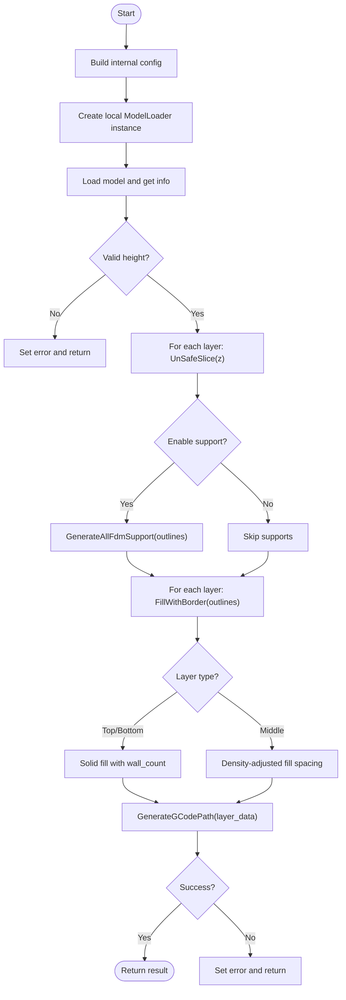
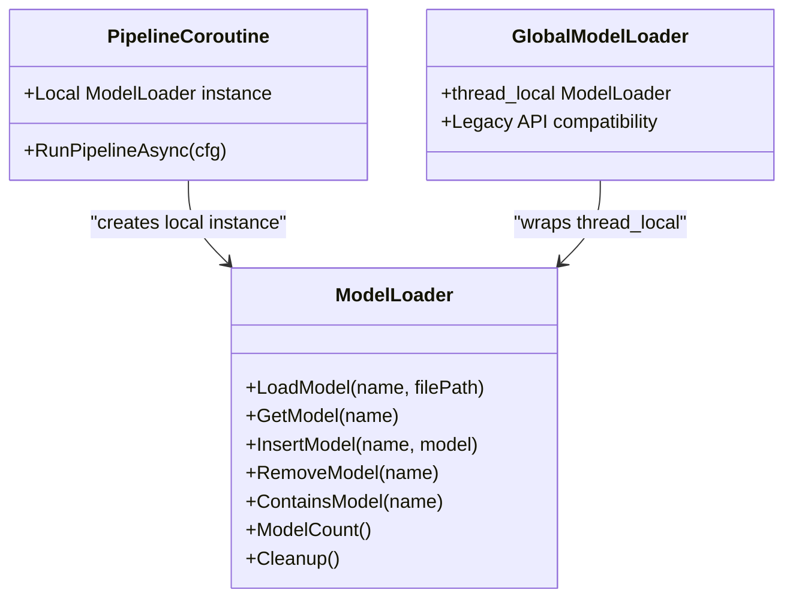
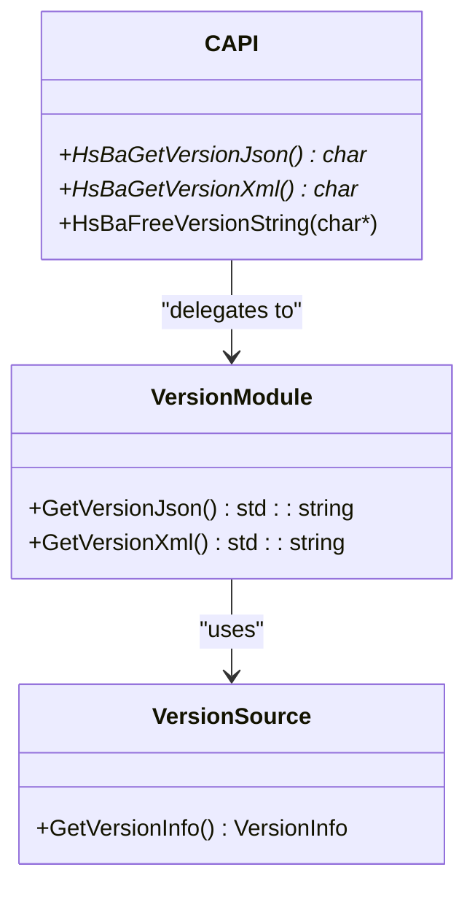
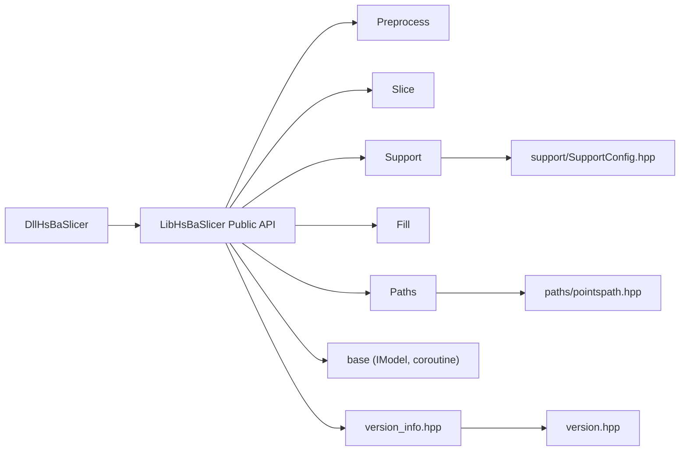

# FDM Pipeline System

<cite>
**Referenced Files in This Document**
- [README.md](file://README.md)
- [CMakeLists.txt](file://CMakeLists.txt)
- [LibHsBaSlicer/CMakeLists.txt](file://LibHsBaSlicer/CMakeLists.txt)
- [DllHsBaSlicer/CMakeLists.txt](file://DllHsBaSlicer/CMakeLists.txt)
- [fdm_pipeline.h](file://DllHsBaSlicer/fdm_pipeline.h)
- [fdm_pipeline.cpp](file://DllHsBaSlicer/fdm_pipeline.cpp)
- [model_preprocess.hpp](file://LibHsBaSlicer/Preprocess/model_preprocess.hpp)
- [model_preprocess.cpp](file://LibHsBaSlicer/Preprocess/model_preprocess.cpp)
- [ModelLoader.hpp](file://preprocess/ModelLoader.hpp)
- [ModelLoader.cpp](file://preprocess/ModelLoader.cpp)
- [fdm_support.hpp](file://LibHsBaSlicer/Support/fdm_support.hpp)
- [polygon_fill.hpp](file://LibHsBaSlicer/Fill/polygon_fill.hpp)
- [path_generator.hpp](file://LibHsBaSlicer/Path/path_generator.hpp)
- [mesh_slice.hpp](file://LibHsBaSlicer/Slice/mesh_slice.hpp)
- [coroutine.hpp](file://base/coroutine.hpp)
- [IModel.hpp](file://base/IModel.hpp)
- [pointspath.hpp](file://paths/pointspath.hpp)
- [SupportConfig.hpp](file://support/SupportConfig.hpp)
- [version_info.hpp](file://LibHsBaSlicer/version_info.hpp)
- [version_info.cpp](file://LibHsBaSlicer/version_info.cpp)
- [version_info.h](file://DllHsBaSlicer/version_info.h)
- [version_info.cpp](file://DllHsBaSlicer/version_info.cpp)
</cite>

## Update Summary
**Changes Made**
- Updated architectural overview to reflect use of LibHsBaSlicer public API instead of direct internal access
- Added comprehensive version information module documentation
- Enhanced separation of concerns explanation between DllHsBaSlicer and LibHsBaSlicer layers
- Updated dependency analysis to show proper API boundaries

## Table of Contents
1. [Introduction](#introduction)
2. [Project Structure](#project-structure)
3. [Core Components](#core-components)
4. [Architecture Overview](#architecture-overview)
5. [Detailed Component Analysis](#detailed-component-analysis)
6. [Dependency Analysis](#dependency-analysis)
7. [Performance Considerations](#performance-considerations)
8. [Troubleshooting Guide](#troubleshooting-guide)
9. [Conclusion](#conclusion)

## Introduction
This document describes the FDM (Fused Deposition Modeling) pipeline system implemented in HsBaSlicer. The system provides a complete end-to-end workflow: model preprocessing, slicing, support generation, infill, and G-code path generation. It exposes both C++ APIs in LibHsBaSlicer and a C-compatible API in DllHsBaSlicer. Internally, it leverages C++20 coroutines for asynchronous execution and progress reporting.

The design emphasizes:
- Clear separation between low-level modules (preprocess, slice, support, fill, paths) and high-level orchestration (pipeline).
- A C-compatible interface for cross-language integration.
- Coroutine-based Task abstraction to simplify async composition and error handling.
- Independent model management per pipeline instance to avoid conflicts during concurrent execution.
- **Updated** Strict adherence to LibHsBaSlicer public API boundaries, preventing direct access to internal implementations.

[No sources needed since this section summarizes without analyzing specific files]

## Project Structure
At a high level:
- base: Core types, interfaces (e.g., IModel), coroutine utilities.
- 2D, paths, preprocess, support, meshmodel, cadmodel: Domain-specific modules.
- LibHsBaSlicer: Public C++ library exposing preprocessing, slicing, support, fill, and path generation.
- DllHsBaSlicer: Dynamic library exporting a C-compatible API that orchestrates the full FDM pipeline using coroutines.
- Top-level CMakeLists.txt configures features, dependencies, and subprojects.

**Diagram sources**
- [CMakeLists.txt:304-327](file://CMakeLists.txt#L304-L327)
- [LibHsBaSlicer/CMakeLists.txt:1-59](file://LibHsBaSlicer/CMakeLists.txt#L1-L59)
- [DllHsBaSlicer/CMakeLists.txt:1-20](file://DllHsBaSlicer/CMakeLists.txt#L1-L20)

**Section sources**
- [README.md:1-40](file://README.md#L1-L40)
- [CMakeLists.txt:304-327](file://CMakeLists.txt#L304-L327)

## Core Components
- Preprocessing: Load, transform, query models via a small pool-like facade.
- Slicing: Convert 3D models into 2D polygons at specified Z heights.
- Support: Generate layer-wise supports based on overhang detection and configuration.
- Infill: Fill polygonal layers with various patterns and borders.
- Path Generation: Convert outlines, fills, and supports into G-code point sequences.
- Pipeline Orchestration: Compose steps into a single task with progress callbacks and error handling.

Key public headers:
- Preprocess: [model_preprocess.hpp:1-88](file://LibHsBaSlicer/Preprocess/model_preprocess.hpp#L1-L88)
- Support: [fdm_support.hpp:1-36](file://LibHsBaSlicer/Support/fdm_support.hpp#L1-L36)
- Fill: [polygon_fill.hpp:1-36](file://LibHsBaSlicer/Fill/polygon_fill.hpp#L1-L36)
- Path: [path_generator.hpp:1-62](file://LibHsBaSlicer/Path/path_generator.hpp#L1-L62)
- Slice: [mesh_slice.hpp:1-28](file://LibHsBaSlicer/Slice/mesh_slice.hpp#L1-L28)

**Section sources**
- [model_preprocess.hpp:1-88](file://LibHsBaSlicer/Preprocess/model_preprocess.hpp#L1-L88)
- [fdm_support.hpp:1-36](file://LibHsBaSlicer/Support/fdm_support.hpp#L1-L36)
- [polygon_fill.hpp:1-36](file://LibHsBaSlicer/Fill/polygon_fill.hpp#L1-L36)
- [path_generator.hpp:1-62](file://LibHsBaSlicer/Path/path_generator.hpp#L1-L62)
- [mesh_slice.hpp:1-28](file://LibHsBaSlicer/Slice/mesh_slice.hpp#L1-L28)

## Architecture Overview
The FDM pipeline composes multiple stages into a single Task. The C API exposes synchronous and asynchronous entry points. Internally, a coroutine-based function executes each stage sequentially while emitting progress updates.

**Updated** The architecture now strictly adheres to LibHsBaSlicer public API boundaries, ensuring proper separation of concerns and maintainability.

**Diagram sources**
- [fdm_pipeline.cpp:182-292](file://DllHsBaSlicer/fdm_pipeline.cpp#L182-L292)
- [fdm_pipeline.h:100-140](file://DllHsBaSlicer/fdm_pipeline.h#L100-L140)
- [mesh_slice.hpp:17-24](file://LibHsBaSlicer/Slice/mesh_slice.hpp#L17-L24)
- [fdm_support.hpp:20-31](file://LibHsBaSlicer/Support/fdm_support.hpp#L20-L31)
- [polygon_fill.hpp:19-31](file://LibHsBaSlicer/Fill/polygon_fill.hpp#L19-L31)
- [path_generator.hpp:45-46](file://LibHsBaSlicer/Path/path_generator.hpp#L45-L46)

## Detailed Component Analysis

### C-Compatible Pipeline API (DllHsBaSlicer)
Responsibilities:
- Define C enums/structs for configuration and results.
- Provide default configuration builder.
- Implement synchronous and asynchronous run functions.
- Manage memory ownership for returned strings.

Key elements:
- Enums: fill mode, support pattern.
- Config struct: model, slicing, fill, support, path, output options.
- Result struct: success flag, total layers, G-code content, error message, elapsed time.
- Callbacks: progress and result callbacks.

Enhanced configuration structure with new parameters for top/bottom layer control and infill density adjustment.

**Diagram sources**
- [fdm_pipeline.h:12-84](file://DllHsBaSlicer/fdm_pipeline.h#L12-L84)
- [fdm_pipeline.h:98-140](file://DllHsBaSlicer/fdm_pipeline.h#L98-L140)

**Section sources**
- [fdm_pipeline.h:1-156](file://DllHsBaSlicer/fdm_pipeline.h#L1-L156)
- [fdm_pipeline.cpp:373-404](file://DllHsBaSlicer/fdm_pipeline.cpp#L373-L404)

### Coroutine-Based Pipeline Orchestration
Responsibilities:
- Convert C config to internal C++ config.
- Execute stages: load model, compute layers, slice, generate supports, fill, build G-code.
- Report progress through a callback.
- Capture timing and errors.

Implementation highlights:
- Uses Utils::Task<T> from coroutine.hpp for async composition.
- Progress is reported at key milestones.
- Converts unsafe slices to safe float polygons where needed.
- Produces a final PointsPath and serializes to string.
- Creates independent ModelLoader instance per pipeline execution to avoid model name conflicts.

Enhanced fill algorithm with configurable top/bottom layer counts and adjustable infill density for middle layers.

**Diagram sources**
- [fdm_pipeline.cpp:182-292](file://DllHsBaSlicer/fdm_pipeline.cpp#L182-L292)

**Section sources**
- [fdm_pipeline.cpp:203-367](file://DllHsBaSlicer/fdm_pipeline.cpp#L203-L367)

### Independent ModelLoader Architecture
Responsibilities:
- Provide isolated model management per pipeline instance.
- Prevent model name conflicts during concurrent pipeline executions.
- Ensure proper resource cleanup when pipeline completes.

The pipeline now creates a local ModelLoader instance within the coroutine scope, eliminating dependency on global thread-local storage and preventing conflicts when running multiple pipelines simultaneously.

**Diagram sources**
- [ModelLoader.hpp:26-127](file://preprocess/ModelLoader.hpp#L26-L127)
- [fdm_pipeline.cpp:212-228](file://DllHsBaSlicer/fdm_pipeline.cpp#L212-228)
- [model_preprocess.cpp:10-14](file://LibHsBaSlicer/Preprocess/model_preprocess.cpp#L10-L14)

**Section sources**
- [ModelLoader.hpp:1-131](file://preprocess/ModelLoader.hpp#L1-L131)
- [ModelLoader.cpp:1-291](file://preprocess/ModelLoader.cpp#L1-L291)
- [fdm_pipeline.cpp:212-228](file://DllHsBaSlicer/fdm_pipeline.cpp#L212-L228)

### Version Information Module
**New Section** The version information system has been centralized into a unified module providing consistent version data across the application.

Responsibilities:
- Provide centralized version information retrieval.
- Support multiple output formats (JSON, XML).
- Maintain consistency between C++ and C APIs.
- Abstract underlying version data source.

Key components:
- LibHsBaSlicer/public API: `GetVersionJson()`, `GetVersionXml()`
- DllHsBaSlicer/C API: `HsBaGetVersionJson()`, `HsBaGetVersionXml()`, `HsBaFreeVersionString()`
- Centralized version data source: `HsBa::Slicer::Version::GetVersionInfo()`

**Diagram sources**
- [version_info.hpp:9-22](file://LibHsBaSlicer/version_info.hpp#L9-L22)
- [version_info.h:20-37](file://DllHsBaSlicer/version_info.h#L20-L37)
- [version.cpp.in:5-24](file://version/version.cpp.in#L5-L24)

**Section sources**
- [version_info.hpp:1-26](file://LibHsBaSlicer/version_info.hpp#L1-L26)
- [version_info.cpp:1-22](file://LibHsBaSlicer/version_info.cpp#L1-L22)
- [version_info.h:1-43](file://DllHsBaSlicer/version_info.h#L1-L43)
- [version_info.cpp:1-39](file://DllHsBaSlicer/version_info.cpp#L1-L39)

### Enhanced Configuration Parameters
The pipeline now supports advanced configuration options for better control over print quality and material usage:

- **top_layer_count**: Number of solid layers at the top of the model
- **bottom_layer_count**: Number of solid layers at the bottom of the model  
- **infill_density**: Density factor (0-1) that adjusts fill spacing for middle layers

These parameters allow fine-tuning between print quality, strength, and material consumption.

**Section sources**
- [fdm_pipeline.h:50-52](file://DllHsBaSlicer/fdm_pipeline.h#L50-L52)
- [fdm_pipeline.cpp:48-50](file://DllHsBaSlicer/fdm_pipeline.cpp#L48-L50)
- [fdm_pipeline.cpp:155-157](file://DllHsBaSlicer/fdm_pipeline.cpp#L155-L157)

### Preprocessing Module (LibHsBaSlicer)
Responsibilities:
- Load models by name and file path.
- Apply transformations (translate, rotate, scale).
- Query model info (bounding box, volume).
- Remove models from internal storage.

Public API surface:
- LoadModel(name, filePath) -> shared_ptr<IModel>
- TranslateModel/RotateModel/ScaleModel(name, ...)
- GetModelInfo(name) -> ModelInfo
- GetModel(name), RemoveModel(name)

Data structures:
- ModelInfo: bbox_min, bbox_max, volume.

**Section sources**
- [model_preprocess.hpp:1-88](file://LibHsBaSlicer/Preprocess/model_preprocess.hpp#L1-L88)
- [model_preprocess.cpp:1-81](file://LibHsBaSlicer/Preprocess/model_preprocess.cpp#L1-L81)
- [IModel.hpp:108-136](file://base/IModel.hpp#L108-L136)

### Slicing Module (LibHsBaSlicer)
Responsibilities:
- Slice a model at a given Z height into 2D polygons.
- Provide both safe (closed only) and unsafe (may include open contours) variants.

Public API surface:
- Slice(model, height) -> Polygons
- UnSafeSlice(model, height) -> UnSafePolygons

Notes:
- Unsafe slicing is suitable for FDM workflows where open contours can be handled downstream.

**Section sources**
- [mesh_slice.hpp:1-28](file://LibHsBaSlicer/Slice/mesh_slice.hpp#L1-L28)

### Support Generation Module (LibHsBaSlicer)
Responsibilities:
- Generate per-layer support polygons based on overhangs and configuration.
- Provide batch generation across all layers.

Public API surface:
- GenerateFdmSupport(current_layer, prev_layer, layer_height, config) -> PolygonsD
- GenerateAllFdmSupport(layers, config) -> vector<PolygonsD>
- GenerateAllLuaSupport(layers, config, script, functionName) -> vector<PolygonsD>

Configuration:
- Derived from Support::FdmSupportConfig (extends SupportConfig).

**Section sources**
- [fdm_support.hpp:1-36](file://LibHsBaSlicer/Support/fdm_support.hpp#L1-L36)
- [SupportConfig.hpp:1-43](file://support/SupportConfig.hpp#L1-L43)

### Enhanced Infill Module (LibHsBaSlicer)
Responsibilities:
- Fill polygonal layers with configurable spacing, border count, and pattern.
- Support density-based spacing adjustment for middle layers.
- Separate handling for top/bottom solid layers vs middle infill layers.

Public API surface:
- FillPolygon(poly, spacing, mode, angle_deg) -> Polygons
- FillWithBorder(poly, spacing, border_count, fill_mode, angle_deg) -> Polygons
- LuaCustomFillByFile(poly, scriptPath, functionName, lineThickness) -> Polygons

Patterns:
- Line, SimpleZigzag, Zigzag.

Enhanced with intelligent layer-type detection and density-based spacing calculation.

**Section sources**
- [polygon_fill.hpp:1-36](file://LibHsBaSlicer/Fill/polygon_fill.hpp#L1-L36)

### Path Generation Module (LibHsBaSlicer)
Responsibilities:
- Convert outlines, fills, and supports into G-code point sequences.
- Serialize to string or save to file.

Public API surface:
- GenerateGCodePath(layer_data, config) -> unique_ptr<PointsPath>
- PolygonsToGPoints(polys, z, config, is_extrude) -> vector<GPoint>

Data structures:
- FdmPathConfig: layer height, line width, speeds, extrusion multiplier, units.
- LayerPathData: outlines, fills, supports, z_height.
- PointsPath: stores GPoint list and serialization methods.

**Section sources**
- [path_generator.hpp:1-62](file://LibHsBaSlicer/Path/path_generator.hpp#L1-L62)
- [pointspath.hpp:1-77](file://paths/pointspath.hpp#L1-L77)

### Coroutine Utilities (base)
Responsibilities:
- Provide Task<T>, Task<void>, CustomAllocatorTask, Generator<T>.
- Offer executors (NoopExecutor, AsyncExecutor) and awaiters.
- Support then(), catching(), finally() chaining and completion callbacks.

Usage in pipeline:
- RunPipelineAsync returns Task<InternalResult>.
- Synchronous API calls task.get_result().
- Asynchronous API uses task.then(...) to deliver results.

Optimized with const reference parameter passing for improved performance in coroutine-based architecture.

**Section sources**
- [coroutine.hpp:1-200](file://base/coroutine.hpp#L1-L200)
- [coroutine.hpp:200-400](file://base/coroutine.hpp#L200-L400)

## Dependency Analysis
High-level dependency relationships:
- DllHsBaSlicer depends on LibHsBaSlicer and several domain libraries.
- LibHsBaSlicer composes preprocess, slice, support, fill, and path modules.
- All modules depend on base types (IModel, coroutines) and shared geometry/path types.
- **Updated** Pipeline now strictly uses LibHsBaSlicer public API, maintaining clear architectural boundaries.

**Diagram sources**
- [DllHsBaSlicer/CMakeLists.txt:1-20](file://DllHsBaSlicer/CMakeLists.txt#L1-L20)
- [LibHsBaSlicer/CMakeLists.txt:37-52](file://LibHsBaSlicer/CMakeLists.txt#L37-L52)
- [CMakeLists.txt:304-327](file://CMakeLists.txt#L304-L327)

**Section sources**
- [DllHsBaSlicer/CMakeLists.txt:1-20](file://DllHsBaSlicer/CMakeLists.txt#L1-L20)
- [LibHsBaSlicer/CMakeLists.txt:1-59](file://LibHsBaSlicer/CMakeLists.txt#L1-L59)
- [CMakeLists.txt:304-327](file://CMakeLists.txt#L304-L327)

## Performance Considerations
- Coroutines: Use Task<T> to avoid blocking threads; prefer asynchronous flows when integrating with UI or other services.
- Layer-wise processing: Keep per-layer work minimal; consider parallelizing independent layers if future extensions require it.
- Geometry conversions: Minimize repeated integerization/unintegerization; reuse intermediate results where possible.
- Memory management: Prefer RAII and move semantics; ensure C strings are freed via HsBaFreePipelineResult.
- Configuration tuning: Adjust fill spacing, wall count, and support density to balance quality and speed.
- Independent ModelLoader instances prevent global state contention but increase memory usage per pipeline.
- Const reference parameter passing reduces unnecessary copies in coroutine-based operations.
- Density-based infill spacing calculation optimizes material usage while maintaining structural integrity.
- **Updated** Centralized version information module reduces redundant version data lookups across the application.

## Troubleshooting Guide
Common issues and remedies:
- Invalid model height: Ensure model bounds yield positive height after transformation; check first_layer_height vs layer_height.
- Empty slices: Verify model integrity and slicing Z positions; consider using UnSafeSlice if open contours are expected.
- Missing supports: Check enable_support flag and overhang threshold; adjust support gap and diameter.
- Excessive fill time: Reduce fill spacing or switch to faster fill modes; reduce wall_count.
- Memory leaks: Always call HsBaFreePipelineResult after use; avoid holding raw char* beyond scope.
- Model loading conflicts: Each pipeline now uses independent ModelLoader instances, eliminating global model name conflicts.
- Infill quality issues: Adjust top_layer_count, bottom_layer_count, and infill_density parameters for optimal results.
- **Updated** Version information access: Use centralized version_info module APIs instead of direct internal access.

**Section sources**
- [fdm_pipeline.cpp:203-367](file://DllHsBaSlicer/fdm_pipeline.cpp#L203-L367)
- [fdm_pipeline.h:132-140](file://DllHsBaSlicer/fdm_pipeline.h#L132-L140)

## Conclusion
The FDM pipeline system integrates preprocessing, slicing, support generation, infill, and path generation into a cohesive, coroutine-driven workflow. It offers a clean C-compatible API for broad integration while leveraging modern C++ features internally for performance and clarity. The modular design enables targeted improvements and testing per stage, and the progress/callback mechanism facilitates responsive applications.

Recent enhancements include strict adherence to LibHsBaSlicer public API boundaries, preventing direct access to internal implementations and improving maintainability. The centralized version information module provides consistent version data access across the application. Independent model management per pipeline instance prevents conflicts during concurrent execution, and advanced configuration options provide precise control over print quality and material usage. The optimized coroutine-based architecture with const reference parameter passing ensures efficient resource utilization and improved performance.