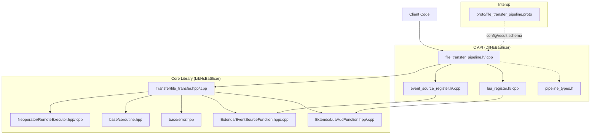
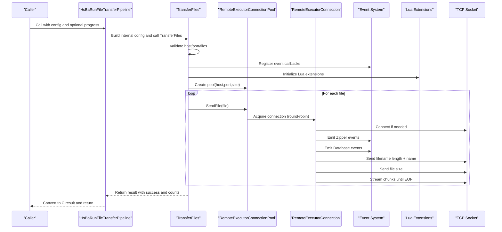
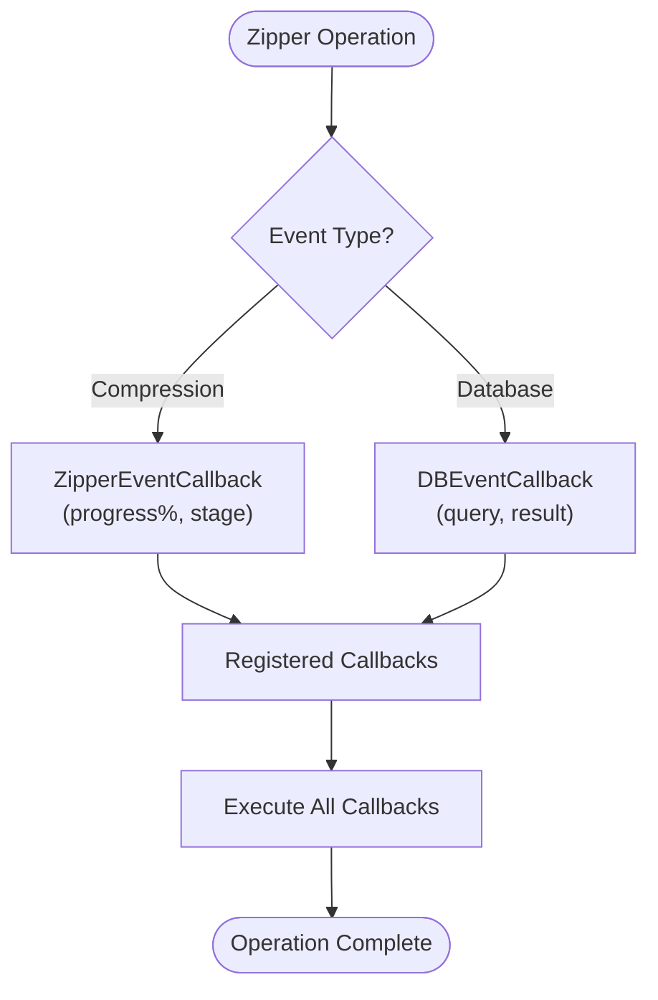
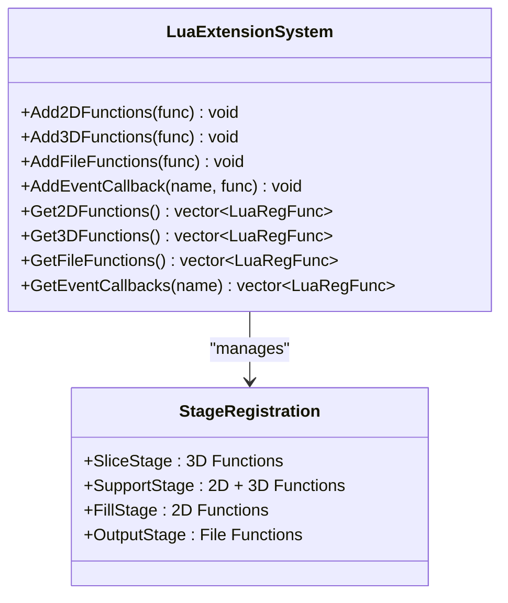
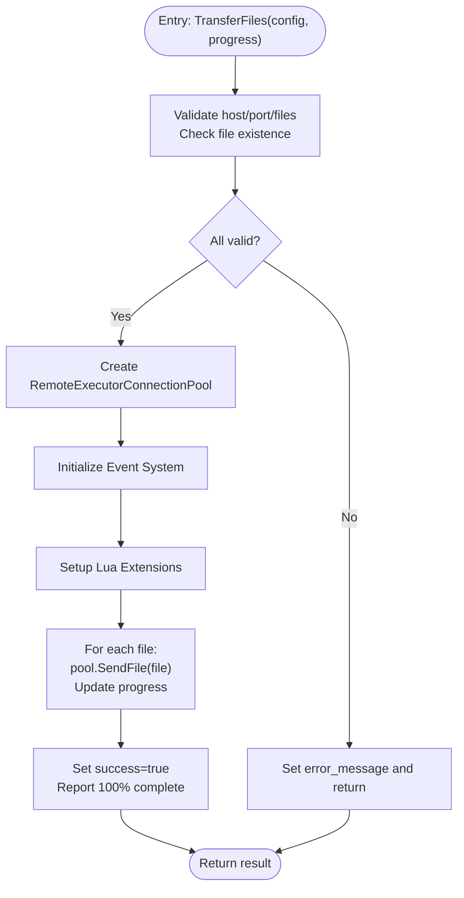
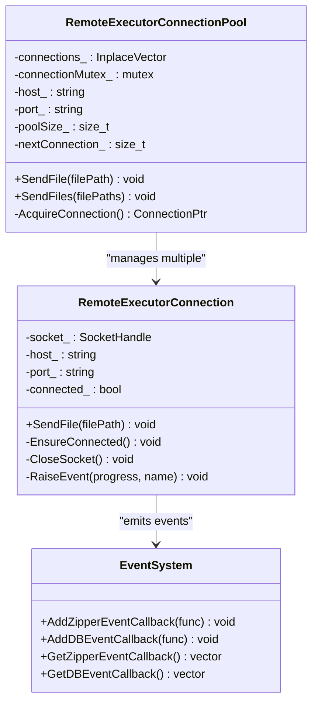
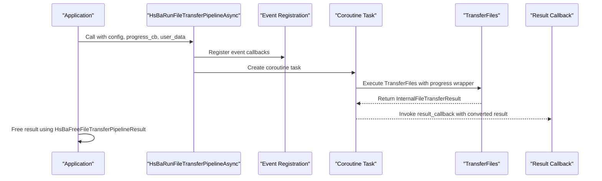
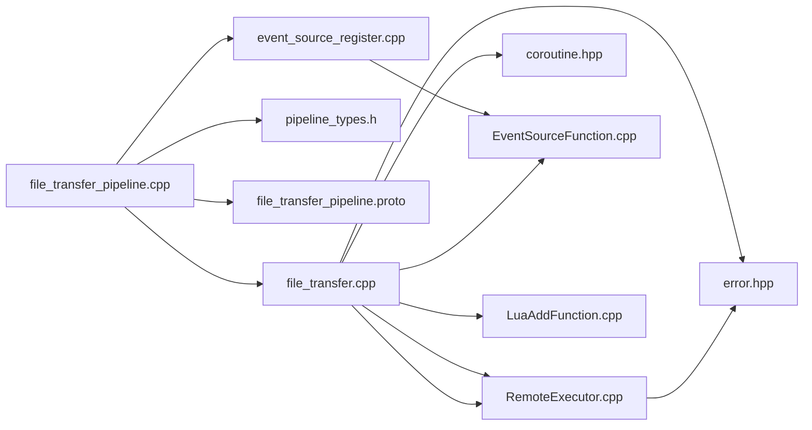

# File Transfer Pipeline System

<cite>
**Referenced Files in This Document**
- [file_transfer.hpp](file://LibHsBaSlicer/Transfer/file_transfer.hpp)
- [file_transfer.cpp](file://LibHsBaSlicer/Transfer/file_transfer.cpp)
- [RemoteExecutor.hpp](file://fileoperator/RemoteExecutor.hpp)
- [RemoteExecutor.cpp](file://fileoperator/RemoteExecutor.cpp)
- [file_transfer_pipeline.h](file://DllHsBaSlicer/file_transfer_pipeline.h)
- [file_transfer_pipeline.cpp](file://DllHsBaSlicer/file_transfer_pipeline.cpp)
- [pipeline_types.h](file://pipelinetypes/pipeline_types.h)
- [coroutine.hpp](file://base/coroutine.hpp)
- [error.hpp](file://base/error.hpp)
- [file_transfer_pipeline.proto](file://proto/file_transfer_pipeline.proto)
- [EventSourceFunction.hpp](file://LibHsBaSlicer/Extends/EventSourceFunction.hpp)
- [EventSourceFunction.cpp](file://LibHsBaSlicer/Extends/EventSourceFunction.cpp)
- [event_source_register.h](file://DllHsBaSlicer/event_source_register.h)
- [event_source_register.cpp](file://DllHsBaSlicer/event_source_register.cpp)
- [lua_register.h](file://DllHsBaSlicer/lua_register.h)
- [lua_register.cpp](file://DllHsBaSlicer/lua_register.cpp)
- [LuaAddFunction.hpp](file://LibHsBaSlicer/Extends/LuaAddFunction.hpp)
- [LuaAddFunction.cpp](file://LibHsBaSlicer/Extends/LuaAddFunction.cpp)
</cite>

## Update Summary
**Changes Made**
- Added comprehensive event handling system documentation for Zipper and Database events
- Enhanced Lua integration section with new function registration capabilities
- Updated architecture diagrams to reflect the new event callback system
- Added detailed sections on C++ and C API event registration mechanisms
- Integrated event handling into the overall file transfer pipeline workflow

## Table of Contents
1. [Introduction](#introduction)
2. [Project Structure](#project-structure)
3. [Core Components](#core-components)
4. [Architecture Overview](#architecture-overview)
5. [Enhanced Event Handling System](#enhanced-event-handling-system)
6. [Detailed Component Analysis](#detailed-component-analysis)
7. [Dependency Analysis](#dependency-analysis)
8. [Performance Considerations](#performance-considerations)
9. [Troubleshooting Guide](#troubleshooting-guide)
10. [Conclusion](#conclusion)

## Introduction
This document explains the File Transfer Pipeline System used by HsBaSlicer to send files to a remote executor service. The system provides:
- A high-level C++ API for configuring and executing file transfers with progress callbacks
- A C API for synchronous and asynchronous execution suitable for integration from other languages or environments
- A robust, cross-platform TCP-based transport with connection pooling and chunked streaming
- Protocol buffer definitions for interoperable configuration and results
- **Enhanced event handling system** for Zipper compression and Database operations
- **Improved Lua integration** with flexible function registration capabilities

The pipeline is designed to be simple to use while offering performance through connection reuse and efficient network I/O, now enhanced with comprehensive event monitoring and extensibility.

## Project Structure
The file transfer functionality spans three layers with enhanced event handling:
- LibHsBaSlicer layer: Core C++ implementation of the transfer logic, networking, and event management
- DllHsBaSlicer layer: C API wrappers exposing synchronous and asynchronous entry points with event registration
- Proto definitions: Cross-language message types for configuration and results



**Diagram sources**
- [file_transfer_pipeline.h:1-63](file://DllHsBaSlicer/file_transfer_pipeline.h#L1-L63)
- [file_transfer_pipeline.cpp:1-189](file://DllHsBaSlicer/file_transfer_pipeline.cpp#L1-L189)
- [event_source_register.h:1-18](file://DllHsBaSlicer/event_source_register.h#L1-L18)
- [event_source_register.cpp:1-27](file://DllHsBaSlicer/event_source_register.cpp#L1-L27)
- [lua_register.h:1-34](file://DllHsBaSlicer/lua_register.h#L1-L34)
- [lua_register.cpp:1-31](file://DllHsBaSlicer/lua_register.cpp#L1-L31)
- [file_transfer.hpp:1-61](file://LibHsBaSlicer/Transfer/file_transfer.hpp#L1-L61)
- [file_transfer.cpp:1-91](file://LibHsBaSlicer/Transfer/file_transfer.cpp#L1-L91)
- [EventSourceFunction.hpp:1-40](file://LibHsBaSlicer/Extends/EventSourceFunction.hpp#L1-L40)
- [EventSourceFunction.cpp:1-23](file://LibHsBaSlicer/Extends/EventSourceFunction.cpp#L1-L23)
- [LuaAddFunction.hpp:1-39](file://LibHsBaSlicer/Extends/LuaAddFunction.hpp#L1-L39)
- [LuaAddFunction.cpp:1-54](file://LibHsBaSlicer/Extends/LuaAddFunction.cpp#L1-L54)

**Section sources**
- [file_transfer.hpp:1-61](file://LibHsBaSlicer/Transfer/file_transfer.hpp#L1-L61)
- [file_transfer.cpp:1-91](file://LibHsBaSlicer/Transfer/file_transfer.cpp#L1-L91)
- [file_transfer_pipeline.h:1-63](file://DllHsBaSlicer/file_transfer_pipeline.h#L1-L63)
- [file_transfer_pipeline.cpp:1-189](file://DllHsBaSlicer/file_transfer_pipeline.cpp#L1-L189)
- [RemoteExecutor.hpp:1-103](file://fileoperator/RemoteExecutor.hpp#L1-L103)
- [RemoteExecutor.cpp:1-313](file://fileoperator/RemoteExecutor.cpp#L1-L313)
- [pipeline_types.h:318-356](file://pipelinetypes/pipeline_types.h#L318-L356)
- [coroutine.hpp:1-200](file://base/coroutine.hpp#L1-L200)
- [error.hpp:1-147](file://base/error.hpp#L1-L147)
- [file_transfer_pipeline.proto:1-21](file://proto/file_transfer_pipeline.proto#L1-L21)

## Core Components
- FileTransferConfig and FileTransferResult define the input and output of the core transfer function.
- TransferFiles orchestrates validation, connection pool setup, and sequential file sending with progress reporting.
- RemoteExecutorConnection and RemoteExecutorConnectionPool implement the TCP transport and connection pooling.
- C API functions expose synchronous and asynchronous execution via HsBaRunFileTransferPipeline and HsBaRunFileTransferPipelineAsync.
- **Enhanced Event System**: ZipperEventCallback and DBEventCallback provide granular event monitoring for compression and database operations.
- **Lua Integration**: Flexible function registration system supporting 2D, 3D, and File operation stages.
- Coroutine utilities provide async task management and callback chaining.

Key responsibilities:
- Validation: host/port/files presence and existence checks
- Connection management: pool creation and round-robin selection
- Data transfer: chunked binary streaming over TCP
- **Event handling**: Zipper compression progress and database operation monitoring
- **Lua extension**: Dynamic function registration for custom operations
- Progress reporting: percentage and stage updates
- Error handling: structured exceptions mapped to result messages

**Section sources**
- [file_transfer.hpp:19-56](file://LibHsBaSlicer/Transfer/file_transfer.hpp#L19-L56)
- [file_transfer.cpp:21-88](file://LibHsBaSlicer/Transfer/file_transfer.cpp#L21-L88)
- [RemoteExecutor.hpp:23-98](file://fileoperator/RemoteExecutor.hpp#L23-L98)
- [RemoteExecutor.cpp:136-313](file://fileoperator/RemoteExecutor.cpp#L136-L313)
- [file_transfer_pipeline.h:17-56](file://DllHsBaSlicer/file_transfer_pipeline.h#L17-L56)
- [file_transfer_pipeline.cpp:150-189](file://DllHsBaSlicer/file_transfer_pipeline.cpp#L150-L189)
- [EventSourceFunction.hpp:14-37](file://LibHsBaSlicer/Extends/EventSourceFunction.hpp#L14-L37)
- [EventSourceFunction.cpp:5-22](file://LibHsBaSlicer/Extends/EventSourceFunction.cpp#L5-L22)
- [LuaAddFunction.hpp:17-35](file://LibHsBaSlicer/Extends/LuaAddFunction.hpp#L17-L35)
- [LuaAddFunction.cpp:7-53](file://LibHsBaSlicer/Extends/LuaAddFunction.cpp#L7-L53)
- [coroutine.hpp:200-382](file://base/coroutine.hpp#L200-L382)

## Architecture Overview
The system follows a layered design with enhanced event handling:
- C API layer exposes stable interfaces for external callers with event registration
- Core library implements business logic, networking, and event management
- Transport uses TCP sockets with chunked streaming and connection pooling
- Async support leverages coroutines for non-blocking execution
- **Event system** provides unified interface for Zipper and Database operations
- **Lua integration** enables dynamic function registration across pipeline stages



**Diagram sources**
- [file_transfer_pipeline.cpp:155-162](file://DllHsBaSlicer/file_transfer_pipeline.cpp#L155-L162)
- [file_transfer.cpp:21-88](file://LibHsBaSlicer/Transfer/file_transfer.cpp#L21-L88)
- [RemoteExecutor.cpp:142-183](file://fileoperator/RemoteExecutor.cpp#L142-L183)
- [EventSourceFunction.cpp:5-22](file://LibHsBaSlicer/Extends/EventSourceFunction.cpp#L5-L22)
- [LuaAddFunction.cpp:7-53](file://LibHsBaSlicer/Extends/LuaAddFunction.cpp#L7-L53)

## Enhanced Event Handling System

### Zipper Event System
The enhanced event handling system provides comprehensive monitoring for Zipper compression operations through a unified callback mechanism.



**Diagram sources**
- [EventSourceFunction.hpp:14-37](file://LibHsBaSlicer/Extends/EventSourceFunction.hpp#L14-L37)
- [EventSourceFunction.cpp:5-22](file://LibHsBaSlicer/Extends/EventSourceFunction.cpp#L5-L22)

### C API Event Registration
The C API provides straightforward event registration for both Zipper and Database operations:

```c
// Register Zipper compression events
void HsBaAddZipperEventCallback(const char* event_name, void (*func)(double, const char*));

// Register Database operation events  
void HsBaAddDBEventCallback(const char* event_name, void (*func)(const char*, const char*));
```

### Lua Extension System
The improved Lua integration enables dynamic function registration across different pipeline stages:



**Diagram sources**
- [LuaAddFunction.hpp:17-35](file://LibHsBaSlicer/Extends/LuaAddFunction.hpp#L17-L35)
- [LuaAddFunction.cpp:7-53](file://LibHsBaSlicer/Extends/LuaAddFunction.cpp#L7-L53)

**Section sources**
- [EventSourceFunction.hpp:14-37](file://LibHsBaSlicer/Extends/EventSourceFunction.hpp#L14-L37)
- [EventSourceFunction.cpp:5-22](file://LibHsBaSlicer/Extends/EventSourceFunction.cpp#L5-L22)
- [event_source_register.h:11-13](file://DllHsBaSlicer/event_source_register.h#L11-L13)
- [event_source_register.cpp:5-27](file://DllHsBaSlicer/event_source_register.cpp#L5-L27)
- [lua_register.h:17-27](file://DllHsBaSlicer/lua_register.h#L17-L27)
- [lua_register.cpp:7-30](file://DllHsBaSlicer/lua_register.cpp#L7-L30)
- [LuaAddFunction.hpp:17-35](file://LibHsBaSlicer/Extends/LuaAddFunction.hpp#L17-L35)
- [LuaAddFunction.cpp:7-53](file://LibHsBaSlicer/Extends/LuaAddFunction.cpp#L7-L53)

## Detailed Component Analysis

### Core Transfer Logic (LibHsBaSlicer)
The core transfer function validates inputs, establishes a connection pool, and sends files sequentially while reporting progress. It maps low-level errors into structured results and integrates with the enhanced event system.



**Diagram sources**
- [file_transfer.cpp:21-88](file://LibHsBaSlicer/Transfer/file_transfer.cpp#L21-L88)

**Section sources**
- [file_transfer.hpp:19-56](file://LibHsBaSlicer/Transfer/file_transfer.hpp#L19-L56)
- [file_transfer.cpp:21-88](file://LibHsBaSlicer/Transfer/file_transfer.cpp#L21-L88)

### Networking Layer (RemoteExecutor)
The networking layer manages TCP connections and streams files in chunks. It supports cross-platform socket operations, ensures reliable transmission, and emits events for Zipper and Database operations.

Key behaviors:
- Lazy connection establishment per connection instance
- Chunked reading and sending with 64KB buffers
- Network byte order conversion for multi-byte fields
- Robust error reporting using custom exception types
- **Event emission** for compression progress and database queries



**Diagram sources**
- [RemoteExecutor.hpp:23-98](file://fileoperator/RemoteExecutor.hpp#L23-L98)
- [RemoteExecutor.cpp:136-313](file://fileoperator/RemoteExecutor.cpp#L136-L313)
- [EventSourceFunction.hpp:14-37](file://LibHsBaSlicer/Extends/EventSourceFunction.hpp#L14-L37)

**Section sources**
- [RemoteExecutor.hpp:1-103](file://fileoperator/RemoteExecutor.hpp#L1-L103)
- [RemoteExecutor.cpp:1-313](file://fileoperator/RemoteExecutor.cpp#L1-L313)
- [error.hpp:49-54](file://base/error.hpp#L49-L54)

### C API Layer (DllHsBaSlicer)
The C API provides both synchronous and asynchronous execution modes with enhanced event registration capabilities:
- Synchronous: HsBaRunFileTransferPipeline blocks until completion
- Asynchronous: HsBaRunFileTransferPipelineAsync returns immediately and invokes a result callback when done
- **Event Registration**: HsBaAddZipperEventCallback and HsBaAddDBEventCallback for monitoring operations
- **Lua Integration**: HsBaAdd2DFunction, HsBaAdd3DFunction, HsBaAddFileFunction for dynamic extensions

Memory management:
- Results contain allocated strings that must be freed using HsBaFreeFileTransferPipelineResult
- Configuration structs are provided via HsBaCreateDefaultFileTransferConfig



**Diagram sources**
- [file_transfer_pipeline.cpp:164-181](file://DllHsBaSlicer/file_transfer_pipeline.cpp#L164-L181)
- [file_transfer_pipeline.h:44-56](file://DllHsBaSlicer/file_transfer_pipeline.h#L44-L56)
- [event_source_register.cpp:5-27](file://DllHsBaSlicer/event_source_register.cpp#L5-L27)

**Section sources**
- [file_transfer_pipeline.h:1-63](file://DllHsBaSlicer/file_transfer_pipeline.h#L1-L63)
- [file_transfer_pipeline.cpp:150-189](file://DllHsBaSlicer/file_transfer_pipeline.cpp#L150-L189)
- [pipeline_types.h:318-356](file://pipelinetypes/pipeline_types.h#L318-L356)
- [event_source_register.h:11-13](file://DllHsBaSlicer/event_source_register.h#L11-L13)
- [event_source_register.cpp:5-27](file://DllHsBaSlicer/event_source_register.cpp#L5-L27)
- [lua_register.h:17-27](file://DllHsBaSlicer/lua_register.h#L17-L27)
- [lua_register.cpp:7-30](file://DllHsBaSlicer/lua_register.cpp#L7-L30)

### Protocol Buffer Definitions
Protocol buffer messages define the schema for configuration and results, enabling interoperability across different programming languages and systems.

Fields include:
- Host and port for remote service connection
- Connection pool size configuration
- Array of file paths to transfer
- Result status, counts, error messages, and elapsed time

**Section sources**
- [file_transfer_pipeline.proto:1-21](file://proto/file_transfer_pipeline.proto#L1-L21)

## Dependency Analysis
The file transfer system has clear dependency relationships with enhanced event handling:



**Diagram sources**
- [file_transfer_pipeline.cpp:1-15](file://DllHsBaSlicer/file_transfer_pipeline.cpp#L1-L15)
- [file_transfer.cpp:1-4](file://LibHsBaSlicer/Transfer/file_transfer.cpp#L1-L4)
- [RemoteExecutor.cpp:1-15](file://fileoperator/RemoteExecutor.cpp#L1-L15)
- [pipeline_types.h:318-356](file://pipelinetypes/pipeline_types.h#L318-L356)
- [file_transfer_pipeline.proto:1-21](file://proto/file_transfer_pipeline.proto#L1-L21)
- [event_source_register.cpp:1-27](file://DllHsBaSlicer/event_source_register.cpp#L1-L27)
- [EventSourceFunction.cpp:1-23](file://LibHsBaSlicer/Extends/EventSourceFunction.cpp#L1-L23)
- [LuaAddFunction.cpp:1-54](file://LibHsBaSlicer/Extends/LuaAddFunction.cpp#L1-L54)

**Section sources**
- [file_transfer_pipeline.cpp:1-15](file://DllHsBaSlicer/file_transfer_pipeline.cpp#L1-L15)
- [file_transfer.cpp:1-4](file://LibHsBaSlicer/Transfer/file_transfer.cpp#L1-L4)
- [RemoteExecutor.cpp:1-15](file://fileoperator/RemoteExecutor.cpp#L1-L15)

## Performance Considerations
- Connection pooling: Reuses TCP connections to avoid repeated handshake overhead
- Chunked transfer: Uses 64KB buffers for efficient memory usage and throughput
- Round-robin distribution: Balances load across multiple connections
- Progress reporting: Minimal overhead with direct callback invocation
- Memory management: Efficient string handling with automatic cleanup
- **Event system optimization**: Batched event processing with minimal overhead
- **Lua extension caching**: Registered functions cached for rapid access

Optimization opportunities:
- Adjust pool size based on network conditions and file sizes
- Implement retry logic for transient network failures
- Add compression for large text files
- Support parallel file transfers within the pool
- **Implement event filtering** to reduce callback overhead
- **Optimize Lua function lookup** with intelligent caching strategies

## Troubleshooting Guide
Common issues and their solutions:

**Validation Errors:**
- Empty host or port: Ensure proper configuration values
- Missing files: Verify file paths exist before transfer
- No files specified: Provide at least one file path

**Network Issues:**
- Connection failures: Check remote service availability and firewall settings
- Socket errors: Verify network connectivity and port accessibility
- Timeout issues: Increase timeout values if needed

**Event System Issues:**
- Event callbacks not firing: Verify event registration before pipeline execution
- Memory leaks in callbacks: Ensure proper cleanup of event handler resources
- Thread safety: Use thread-safe data structures in event handlers

**Lua Integration Issues:**
- Function registration failures: Check function pointer validity and lifetime
- Stage-specific functions: Ensure correct registration for target pipeline stage
- Lua state management: Properly handle Lua stack operations in custom functions

**Resource Management:**
- Memory leaks: Always free results using HsBaFreeFileTransferPipelineResult
- Connection limits: Monitor pool size and adjust based on system capabilities
- Event callback cleanup: Remove unused event handlers to prevent memory growth

Error handling patterns:
- Structured exceptions map to result messages
- Progress callbacks provide real-time feedback
- Comprehensive error messages aid debugging
- **Event error propagation**: Events can carry error information for better diagnostics

**Section sources**
- [file_transfer.cpp:27-54](file://LibHsBaSlicer/Transfer/file_transfer.cpp#L27-L54)
- [RemoteExecutor.cpp:186-233](file://fileoperator/RemoteExecutor.cpp#L186-L233)
- [error.hpp:49-54](file://base/error.hpp#L49-L54)
- [EventSourceFunction.cpp:5-22](file://LibHsBaSlicer/Extends/EventSourceFunction.cpp#L5-L22)
- [LuaAddFunction.cpp:7-53](file://LibHsBaSlicer/Extends/LuaAddFunction.cpp#L7-L53)

## Conclusion
The File Transfer Pipeline System provides a robust, efficient solution for transferring files to remote services with enhanced event handling and Lua integration capabilities. Its layered architecture separates concerns between networking, business logic, API exposure, event management, and extensibility. The system supports both synchronous and asynchronous execution patterns, making it suitable for various integration scenarios.

**Key Enhancements:**
- **Comprehensive Event System**: Unified interface for Zipper compression and Database operation monitoring
- **Flexible Lua Integration**: Dynamic function registration across all pipeline stages
- **Enhanced Extensibility**: Plugin architecture supporting custom operations and monitoring
- **Improved Performance**: Optimized event processing and function caching

With comprehensive error handling, progress reporting, connection pooling, event monitoring, and extensibility features, it delivers reliable performance for file transfer operations while providing developers with powerful tools for customization and monitoring.

The design emphasizes simplicity of use while providing advanced features like connection pooling, async execution, event-driven monitoring, and dynamic Lua extensions. The protocol buffer definitions ensure interoperability across different platforms and programming languages, while the enhanced event system provides deep insights into pipeline operations.