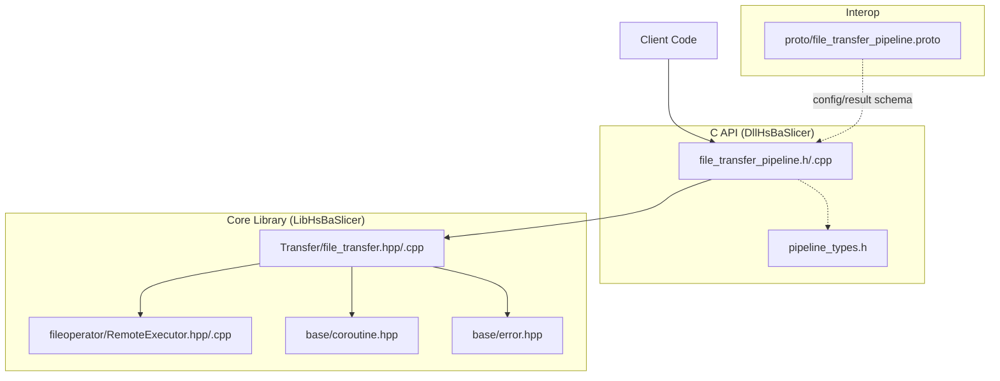
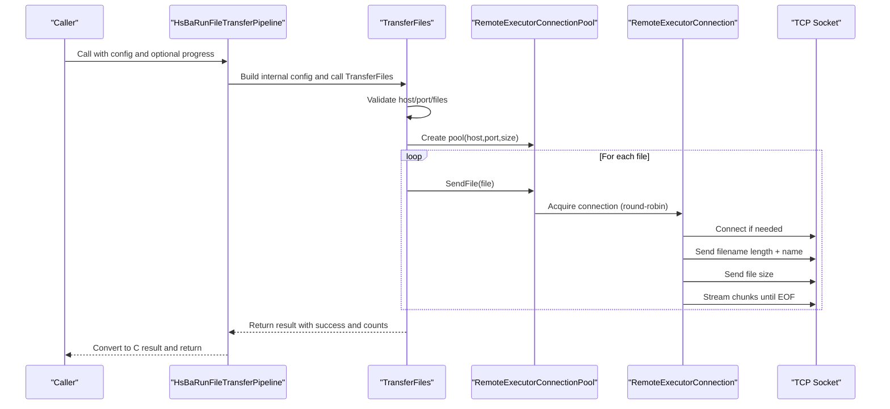
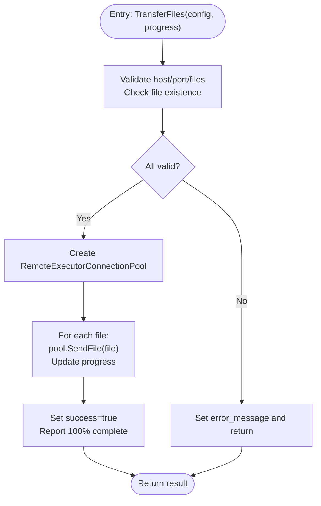
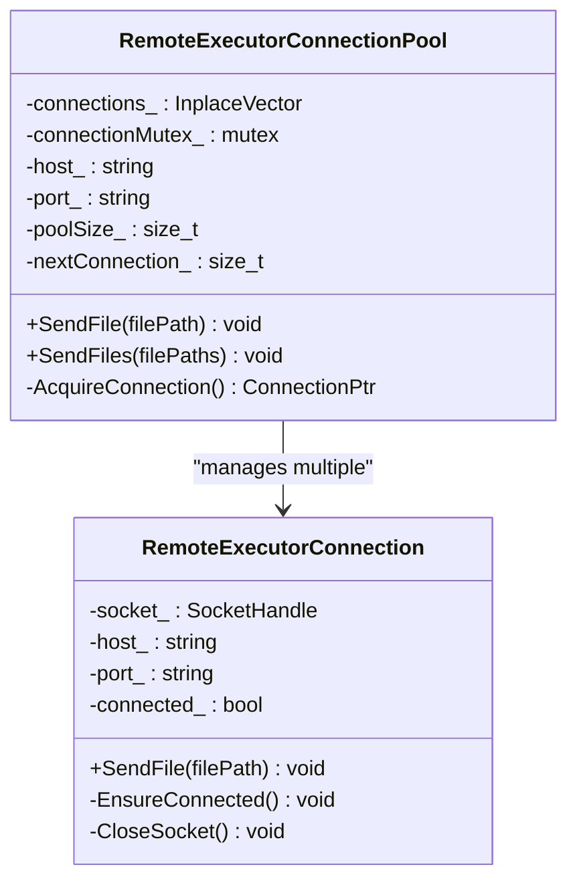
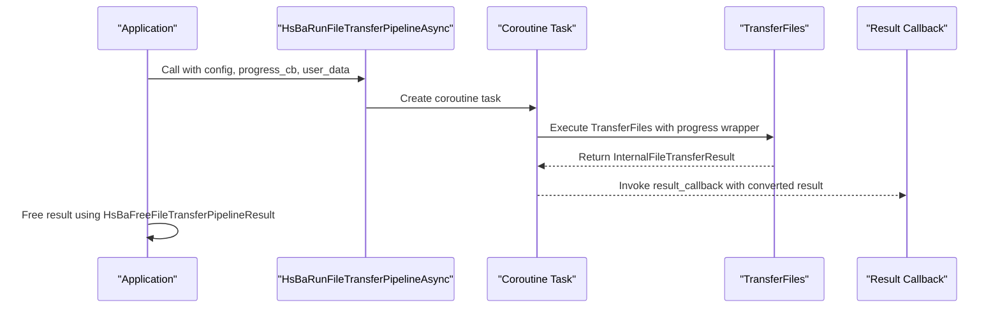
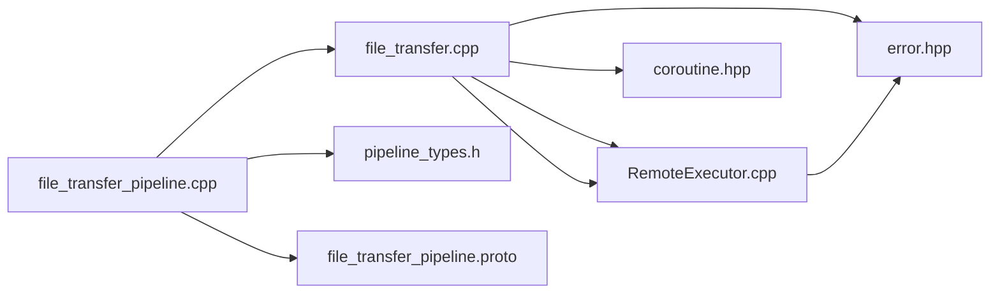

# File Transfer Pipeline System

<cite>
**Referenced Files in This Document**
- [file_transfer.hpp](file://LibHsBaSlicer/Transfer/file_transfer.hpp)
- [file_transfer.cpp](file://LibHsBaSlicer/Transfer/file_transfer.cpp)
- [RemoteExecutor.hpp](file://fileoperator/RemoteExecutor.hpp)
- [RemoteExecutor.cpp](file://fileoperator/RemoteExecutor.cpp)
- [file_transfer_pipeline.h](file://DllHsBaSlicer/file_transfer_pipeline.h)
- [file_transfer_pipeline.cpp](file://DllHsBaSlicer/file_transfer_pipeline.cpp)
- [pipeline_types.h](file://pipelinetypes/pipeline_types.h)
- [coroutine.hpp](file://base/coroutine.hpp)
- [error.hpp](file://base/error.hpp)
- [file_transfer_pipeline.proto](file://proto/file_transfer_pipeline.proto)
</cite>

## Table of Contents
1. [Introduction](#introduction)
2. [Project Structure](#project-structure)
3. [Core Components](#core-components)
4. [Architecture Overview](#architecture-overview)
5. [Detailed Component Analysis](#detailed-component-analysis)
6. [Dependency Analysis](#dependency-analysis)
7. [Performance Considerations](#performance-considerations)
8. [Troubleshooting Guide](#troubleshooting-guide)
9. [Conclusion](#conclusion)

## Introduction
This document explains the File Transfer Pipeline System used by HsBaSlicer to send files to a remote executor service. The system provides:
- A high-level C++ API for configuring and executing file transfers with progress callbacks
- A C API for synchronous and asynchronous execution suitable for integration from other languages or environments
- A robust, cross-platform TCP-based transport with connection pooling and chunked streaming
- Protocol buffer definitions for interoperable configuration and results

The pipeline is designed to be simple to use while offering performance through connection reuse and efficient network I/O.

## Project Structure
The file transfer functionality spans three layers:
- LibHsBaSlicer layer: Core C++ implementation of the transfer logic and networking
- DllHsBaSlicer layer: C API wrappers exposing synchronous and asynchronous entry points
- Proto definitions: Cross-language message types for configuration and results

**Diagram sources**
- [file_transfer_pipeline.h:1-63](file://DllHsBaSlicer/file_transfer_pipeline.h#L1-L63)
- [file_transfer_pipeline.cpp:1-189](file://DllHsBaSlicer/file_transfer_pipeline.cpp#L1-L189)
- [file_transfer.hpp:1-61](file://LibHsBaSlicer/Transfer/file_transfer.hpp#L1-L61)
- [file_transfer.cpp:1-91](file://LibHsBaSlicer/Transfer/file_transfer.cpp#L1-L91)
- [RemoteExecutor.hpp:1-103](file://fileoperator/RemoteExecutor.hpp#L1-L103)
- [RemoteExecutor.cpp:1-313](file://fileoperator/RemoteExecutor.cpp#L1-L313)
- [pipeline_types.h:318-356](file://pipelinetypes/pipeline_types.h#L318-L356)
- [coroutine.hpp:1-200](file://base/coroutine.hpp#L1-L200)
- [error.hpp:1-147](file://base/error.hpp#L1-L147)
- [file_transfer_pipeline.proto:1-21](file://proto/file_transfer_pipeline.proto#L1-L21)

**Section sources**
- [file_transfer.hpp:1-61](file://LibHsBaSlicer/Transfer/file_transfer.hpp#L1-L61)
- [file_transfer.cpp:1-91](file://LibHsBaSlicer/Transfer/file_transfer.cpp#L1-L91)
- [file_transfer_pipeline.h:1-63](file://DllHsBaSlicer/file_transfer_pipeline.h#L1-L63)
- [file_transfer_pipeline.cpp:1-189](file://DllHsBaSlicer/file_transfer_pipeline.cpp#L1-L189)
- [RemoteExecutor.hpp:1-103](file://fileoperator/RemoteExecutor.hpp#L1-L103)
- [RemoteExecutor.cpp:1-313](file://fileoperator/RemoteExecutor.cpp#L1-L313)
- [pipeline_types.h:318-356](file://pipelinetypes/pipeline_types.h#L318-L356)
- [coroutine.hpp:1-200](file://base/coroutine.hpp#L1-L200)
- [error.hpp:1-147](file://base/error.hpp#L1-L147)
- [file_transfer_pipeline.proto:1-21](file://proto/file_transfer_pipeline.proto#L1-L21)

## Core Components
- FileTransferConfig and FileTransferResult define the input and output of the core transfer function.
- TransferFiles orchestrates validation, connection pool setup, and sequential file sending with progress reporting.
- RemoteExecutorConnection and RemoteExecutorConnectionPool implement the TCP transport and connection pooling.
- C API functions expose synchronous and asynchronous execution via HsBaRunFileTransferPipeline and HsBaRunFileTransferPipelineAsync.
- Coroutine utilities provide async task management and callback chaining.

Key responsibilities:
- Validation: host/port/files presence and existence checks
- Connection management: pool creation and round-robin selection
- Data transfer: chunked binary streaming over TCP
- Progress reporting: percentage and stage updates
- Error handling: structured exceptions mapped to result messages

**Section sources**
- [file_transfer.hpp:19-56](file://LibHsBaSlicer/Transfer/file_transfer.hpp#L19-L56)
- [file_transfer.cpp:21-88](file://LibHsBaSlicer/Transfer/file_transfer.cpp#L21-L88)
- [RemoteExecutor.hpp:23-98](file://fileoperator/RemoteExecutor.hpp#L23-L98)
- [RemoteExecutor.cpp:136-313](file://fileoperator/RemoteExecutor.cpp#L136-L313)
- [file_transfer_pipeline.h:17-56](file://DllHsBaSlicer/file_transfer_pipeline.h#L17-L56)
- [file_transfer_pipeline.cpp:150-189](file://DllHsBaSlicer/file_transfer_pipeline.cpp#L150-L189)
- [coroutine.hpp:200-382](file://base/coroutine.hpp#L200-L382)

## Architecture Overview
The system follows a layered design:
- C API layer exposes stable interfaces for external callers
- Core library implements business logic and networking
- Transport uses TCP sockets with chunked streaming and connection pooling
- Async support leverages coroutines for non-blocking execution

**Diagram sources**
- [file_transfer_pipeline.cpp:155-162](file://DllHsBaSlicer/file_transfer_pipeline.cpp#L155-L162)
- [file_transfer.cpp:21-88](file://LibHsBaSlicer/Transfer/file_transfer.cpp#L21-L88)
- [RemoteExecutor.cpp:142-183](file://fileoperator/RemoteExecutor.cpp#L142-L183)

## Detailed Component Analysis

### Core Transfer Logic (LibHsBaSlicer)
The core transfer function validates inputs, establishes a connection pool, and sends files sequentially while reporting progress. It maps low-level errors into structured results.

**Diagram sources**
- [file_transfer.cpp:21-88](file://LibHsBaSlicer/Transfer/file_transfer.cpp#L21-L88)

**Section sources**
- [file_transfer.hpp:19-56](file://LibHsBaSlicer/Transfer/file_transfer.hpp#L19-L56)
- [file_transfer.cpp:21-88](file://LibHsBaSlicer/Transfer/file_transfer.cpp#L21-L88)

### Networking Layer (RemoteExecutor)
The networking layer manages TCP connections and streams files in chunks. It supports cross-platform socket operations and ensures reliable transmission.

Key behaviors:
- Lazy connection establishment per connection instance
- Chunked reading and sending with 64KB buffers
- Network byte order conversion for multi-byte fields
- Robust error reporting using custom exception types

**Diagram sources**
- [RemoteExecutor.hpp:23-98](file://fileoperator/RemoteExecutor.hpp#L23-L98)
- [RemoteExecutor.cpp:136-313](file://fileoperator/RemoteExecutor.cpp#L136-L313)

**Section sources**
- [RemoteExecutor.hpp:1-103](file://fileoperator/RemoteExecutor.hpp#L1-L103)
- [RemoteExecutor.cpp:1-313](file://fileoperator/RemoteExecutor.cpp#L1-L313)
- [error.hpp:49-54](file://base/error.hpp#L49-L54)

### C API Layer (DllHsBaSlicer)
The C API provides both synchronous and asynchronous execution modes:
- Synchronous: HsBaRunFileTransferPipeline blocks until completion
- Asynchronous: HsBaRunFileTransferPipelineAsync returns immediately and invokes a result callback when done

Memory management:
- Results contain allocated strings that must be freed using HsBaFreeFileTransferPipelineResult
- Configuration structs are provided via HsBaCreateDefaultFileTransferConfig

**Diagram sources**
- [file_transfer_pipeline.cpp:164-181](file://DllHsBaSlicer/file_transfer_pipeline.cpp#L164-L181)
- [file_transfer_pipeline.h:44-56](file://DllHsBaSlicer/file_transfer_pipeline.h#L44-L56)

**Section sources**
- [file_transfer_pipeline.h:1-63](file://DllHsBaSlicer/file_transfer_pipeline.h#L1-L63)
- [file_transfer_pipeline.cpp:150-189](file://DllHsBaSlicer/file_transfer_pipeline.cpp#L150-L189)
- [pipeline_types.h:318-356](file://pipelinetypes/pipeline_types.h#L318-L356)

### Protocol Buffer Definitions
Protocol buffer messages define the schema for configuration and results, enabling interoperability across different programming languages and systems.

Fields include:
- Host and port for remote service connection
- Connection pool size configuration
- Array of file paths to transfer
- Result status, counts, error messages, and elapsed time

**Section sources**
- [file_transfer_pipeline.proto:1-21](file://proto/file_transfer_pipeline.proto#L1-L21)

## Dependency Analysis
The file transfer system has clear dependency relationships:

**Diagram sources**
- [file_transfer_pipeline.cpp:1-15](file://DllHsBaSlicer/file_transfer_pipeline.cpp#L1-L15)
- [file_transfer.cpp:1-4](file://LibHsBaSlicer/Transfer/file_transfer.cpp#L1-L4)
- [RemoteExecutor.cpp:1-15](file://fileoperator/RemoteExecutor.cpp#L1-L15)
- [pipeline_types.h:318-356](file://pipelinetypes/pipeline_types.h#L318-L356)
- [file_transfer_pipeline.proto:1-21](file://proto/file_transfer_pipeline.proto#L1-L21)

**Section sources**
- [file_transfer_pipeline.cpp:1-15](file://DllHsBaSlicer/file_transfer_pipeline.cpp#L1-L15)
- [file_transfer.cpp:1-4](file://LibHsBaSlicer/Transfer/file_transfer.cpp#L1-L4)
- [RemoteExecutor.cpp:1-15](file://fileoperator/RemoteExecutor.cpp#L1-L15)

## Performance Considerations
- Connection pooling: Reuses TCP connections to avoid repeated handshake overhead
- Chunked transfer: Uses 64KB buffers for efficient memory usage and throughput
- Round-robin distribution: Balances load across multiple connections
- Progress reporting: Minimal overhead with direct callback invocation
- Memory management: Efficient string handling with automatic cleanup

Optimization opportunities:
- Adjust pool size based on network conditions and file sizes
- Implement retry logic for transient network failures
- Add compression for large text files
- Support parallel file transfers within the pool

## Troubleshooting Guide
Common issues and their solutions:

**Validation Errors:**
- Empty host or port: Ensure proper configuration values
- Missing files: Verify file paths exist before transfer
- No files specified: Provide at least one file path

**Network Issues:**
- Connection failures: Check remote service availability and firewall settings
- Socket errors: Verify network connectivity and port accessibility
- Timeout issues: Increase timeout values if needed

**Resource Management:**
- Memory leaks: Always free results using HsBaFreeFileTransferPipelineResult
- Connection limits: Monitor pool size and adjust based on system capabilities

Error handling patterns:
- Structured exceptions map to result messages
- Progress callbacks provide real-time feedback
- Comprehensive error messages aid debugging

**Section sources**
- [file_transfer.cpp:27-54](file://LibHsBaSlicer/Transfer/file_transfer.cpp#L27-L54)
- [RemoteExecutor.cpp:186-233](file://fileoperator/RemoteExecutor.cpp#L186-L233)
- [error.hpp:49-54](file://base/error.hpp#L49-L54)

## Conclusion
The File Transfer Pipeline System provides a robust, efficient solution for transferring files to remote services. Its layered architecture separates concerns between networking, business logic, and API exposure. The system supports both synchronous and asynchronous execution patterns, making it suitable for various integration scenarios. With comprehensive error handling, progress reporting, and connection pooling, it delivers reliable performance for file transfer operations.

The design emphasizes simplicity of use while providing advanced features like connection pooling and async execution. The protocol buffer definitions ensure interoperability across different platforms and programming languages.