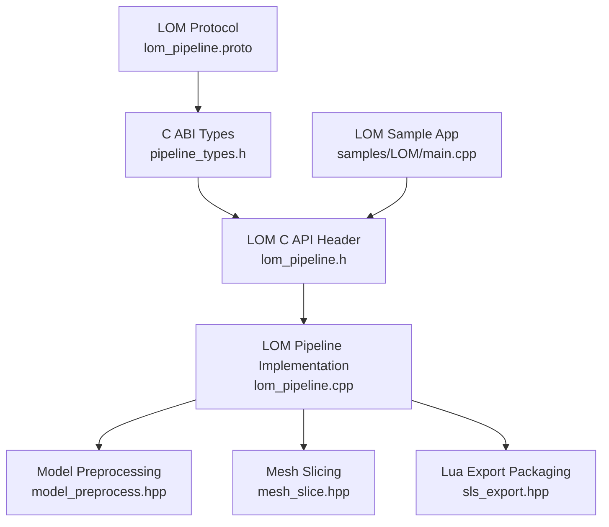
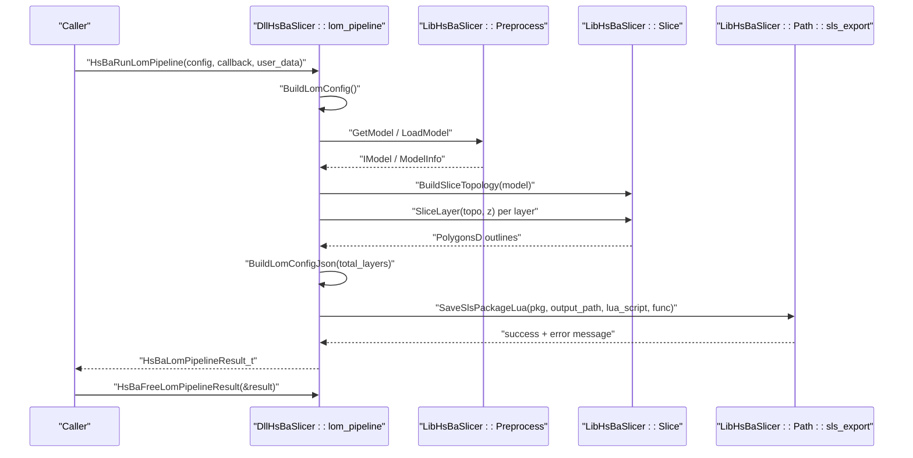
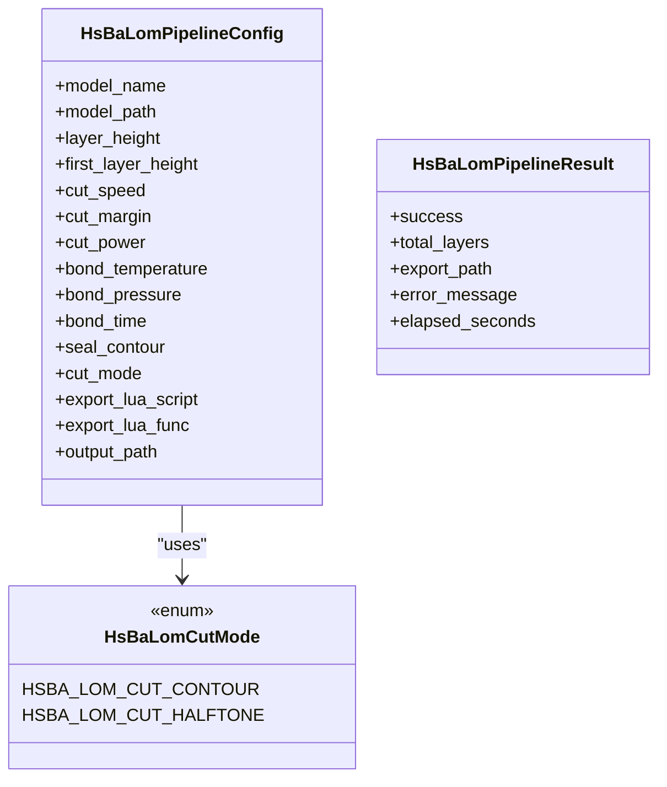
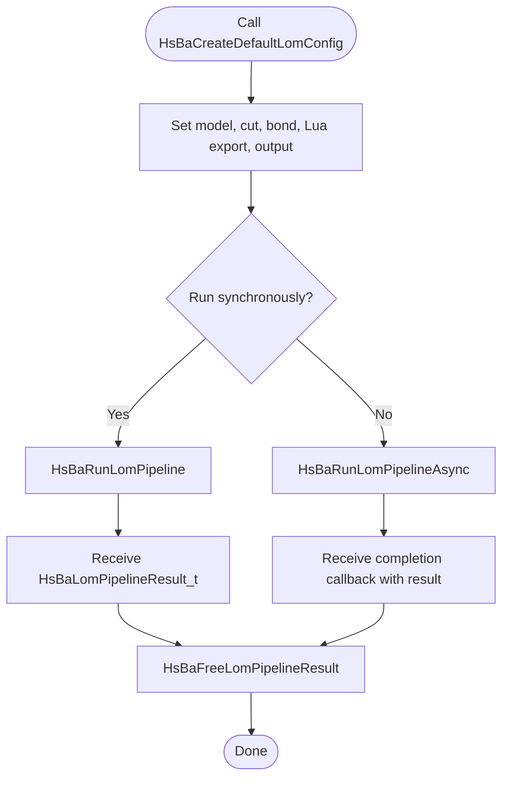
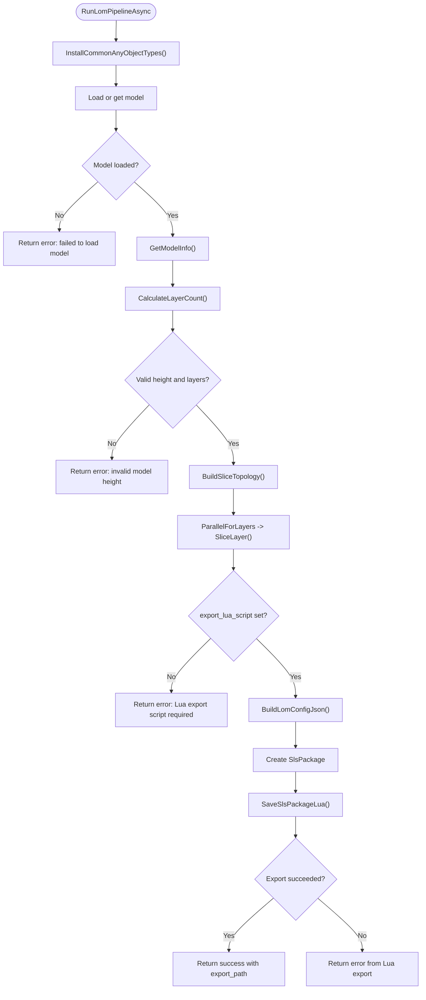
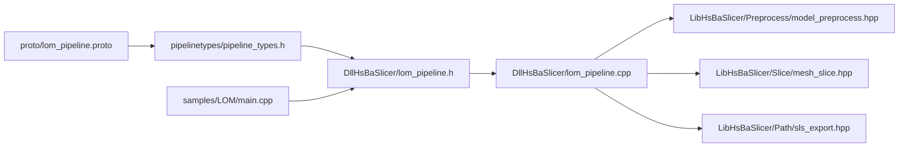

# LOM Manufacturing Process

<cite>
**Referenced Files in This Document**
- [README.md](file://README.md)
- [proto/lom_pipeline.proto](file://proto/lom_pipeline.proto)
- [pipelinetypes/pipeline_types.h](file://pipelinetypes/pipeline_types.h)
- [DllHsBaSlicer/lom_pipeline.h](file://DllHsBaSlicer/lom_pipeline.h)
- [DllHsBaSlicer/lom_pipeline.cpp](file://DllHsBaSlicer/lom_pipeline.cpp)
- [LibHsBaSlicer/Preprocess/model_preprocess.hpp](file://LibHsBaSlicer/Preprocess/model_preprocess.hpp)
- [LibHsBaSlicer/Slice/mesh_slice.hpp](file://LibHsBaSlicer/Slice/mesh_slice.hpp)
- [LibHsBaSlicer/Path/sls_export.hpp](file://LibHsBaSlicer/Path/sls_export.hpp)
- [samples/LOM/main.cpp](file://samples/LOM/main.cpp)
</cite>

## Table of Contents
1. [Introduction](#introduction)
2. [Project Structure](#project-structure)
3. [Core Components](#core-components)
4. [Architecture Overview](#architecture-overview)
5. [Detailed Component Analysis](#detailed-component-analysis)
6. [Dependency Analysis](#dependency-analysis)
7. [Performance Considerations](#performance-considerations)
8. [Troubleshooting Guide](#troubleshooting-guide)
9. [Conclusion](#conclusion)

## Introduction
This document explains the LOM (Laminated Object Manufacturing) manufacturing process as implemented in HsBaSlicer. LOM is a sheet-bonding and contour-cutting process: each “layer” represents a physical sheet thickness, the model is sliced into per-sheet contours, and cut/bond parameters are passed to a Lua export script that produces the final output, typically a zip archive with optional database registration.

The implementation follows the repository’s Lib/Dll pattern:
- `LibHsBaSlicer` provides reusable C++ slicing, preprocessing, and export primitives.
- `DllHsBaSlicer` exposes a stable C ABI for external callers.
- `proto/lom_pipeline.proto` defines the protocol-buffer schema for LOM configuration and results.
- `samples/LOM/main.cpp` demonstrates synchronous, custom-parameter, and asynchronous usage.

## Project Structure
The LOM feature spans several modules:

| Area | Responsibility | Key Files |
|------|----------------|-----------|
| Protocol definition | LOM config/result message types | `proto/lom_pipeline.proto` |
| C ABI types | Stable C structs and enums for all pipelines | `pipelinetypes/pipeline_types.h` |
| Dll entry points | C API functions for default config, sync run, async run, result free | `DllHsBaSlicer/lom_pipeline.h`, `DllHsBaSlicer/lom_pipeline.cpp` |
| Lib preprocessing | Model loading, transforms, bounding box/volume query | `LibHsBaSlicer/Preprocess/model_preprocess.hpp` |
| Lib slicing | Planar slicing, topology reuse, layer slicing | `LibHsBaSlicer/Slice/mesh_slice.hpp` |
| Lib export packaging | SLS-style package type and Lua-driven export | `LibHsBaSlicer/Path/sls_export.hpp` |
| Sample application | End-to-end LOM usage examples | `samples/LOM/main.cpp` |

**Diagram sources**
- [proto/lom_pipeline.proto:1-46](file://proto/lom_pipeline.proto#L1-L46)
- [pipelinetypes/pipeline_types.h:403-461](file://pipelinetypes/pipeline_types.h#L403-L461)
- [DllHsBaSlicer/lom_pipeline.h:1-63](file://DllHsBaSlicer/lom_pipeline.h#L1-L63)
- [DllHsBaSlicer/lom_pipeline.cpp:1-344](file://DllHsBaSlicer/lom_pipeline.cpp#L1-L344)
- [LibHsBaSlicer/Preprocess/model_preprocess.hpp:1-192](file://LibHsBaSlicer/Preprocess/model_preprocess.hpp#L1-L192)
- [LibHsBaSlicer/Slice/mesh_slice.hpp:1-108](file://LibHsBaSlicer/Slice/mesh_slice.hpp#L1-L108)
- [LibHsBaSlicer/Path/sls_export.hpp:1-61](file://LibHsBaSlicer/Path/sls_export.hpp#L1-L61)
- [samples/LOM/main.cpp:1-193](file://samples/LOM/main.cpp#L1-L193)

**Section sources**
- [README.md:19-39](file://README.md#L19-L39)
- [proto/lom_pipeline.proto:1-46](file://proto/lom_pipeline.proto#L1-L46)

## Core Components
The LOM pipeline is composed of four main layers:

1. **Protocol and C ABI Layer**
   - `proto/lom_pipeline.proto` defines `lom_pipe_config` and `lom_pipe_result`.
   - `pipelinetypes/pipeline_types.h` defines the C-compatible `HsBaLomPipelineConfig_t`, `HsBaLomPipelineResult_t`, and `HsBaLomCutMode_t`.

2. **DLL C API Layer**
   - `lom_pipeline.h` declares the exported C functions:
     - `HsBaCreateDefaultLomConfig`
     - `HsBaRunLomPipeline`
     - `HsBaRunLomPipelineAsync`
     - `HsBaFreeLomPipelineResult`

3. **Pipeline Orchestration Layer**
   - `lom_pipeline.cpp` implements:
     - Internal config/result structures
     - Config builder
     - Progress reporting
     - JSON configuration builder for Lua export
     - Async coroutine-based pipeline execution
     - Conversion between internal and C ABI results

4. **Lib Primitives Layer**
   - `model_preprocess.hpp`: model loading, caching, transform, and metadata access.
   - `mesh_slice.hpp`: safe/unsafe slicing, Lua-assisted slicing, reusable topology, and per-layer slicing.
   - `sls_export.hpp`: shared package structure and Lua-driven export function used by LOM.

**Section sources**
- [proto/lom_pipeline.proto:13-45](file://proto/lom_pipeline.proto#L13-L45)
- [pipelinetypes/pipeline_types.h:403-461](file://pipelinetypes/pipeline_types.h#L403-L461)
- [DllHsBaSlicer/lom_pipeline.h:17-56](file://DllHsBaSlicer/lom_pipeline.h#L17-L56)
- [DllHsBaSlicer/lom_pipeline.cpp:28-56](file://DllHsBaSlicer/lom_pipeline.cpp#L28-L56)
- [LibHsBaSlicer/Preprocess/model_preprocess.hpp:22-82](file://LibHsBaSlicer/Preprocess/model_preprocess.hpp#L22-L82)
- [LibHsBaSlicer/Slice/mesh_slice.hpp:22-103](file://LibHsBaSlicer/Slice/mesh_slice.hpp#L22-L103)
- [LibHsBaSlicer/Path/sls_export.hpp:17-56](file://LibHsBaSlicer/Path/sls_export.hpp#L17-L56)

## Architecture Overview
The LOM architecture separates concerns across three layers:

- **External caller**: Uses the C ABI through `lom_pipeline.h`.
- **DLL orchestration**: Converts C ABI inputs into internal C++ objects, runs the pipeline, and returns owned C strings via a dedicated free function.
- **Lib core**: Provides geometry, slicing, and Lua export capabilities without exposing C ABI details.

**Diagram sources**
- [DllHsBaSlicer/lom_pipeline.cpp:187-299](file://DllHsBaSlicer/lom_pipeline.cpp#L187-L299)
- [LibHsBaSlicer/Preprocess/model_preprocess.hpp:32-82](file://LibHsBaSlicer/Preprocess/model_preprocess.hpp#L32-L82)
- [LibHsBaSlicer/Slice/mesh_slice.hpp:79-103](file://LibHsBaSlicer/Slice/mesh_slice.hpp#L79-L103)
- [LibHsBaSlicer/Path/sls_export.hpp:35-56](file://LibHsBaSlicer/Path/sls_export.hpp#L35-L56)

## Detailed Component Analysis

### LOM Protocol and C ABI Types
The LOM protocol defines:
- A cutting mode enum: contour or halftone.
- A configuration message including model identity, sheet thickness, laser cut parameters, bonding parameters, sealing behavior, Lua export script/function, and output path.
- A result message including success, total layers, export path, error message, and elapsed time.

The C ABI mirrors this with:
- `HsBaLomCutMode_t`
- `HsBaLomPipelineConfig_t`
- `HsBaLomPipelineResult_t`
- Progress and result callback types

These types are intentionally POD-friendly and use `const char*` input fields and owned `char*` output fields managed by the DLL.

**Diagram sources**
- [proto/lom_pipeline.proto:7-36](file://proto/lom_pipeline.proto#L7-L36)
- [pipelinetypes/pipeline_types.h:403-448](file://pipelinetypes/pipeline_types.h#L403-L448)

**Section sources**
- [proto/lom_pipeline.proto:7-45](file://proto/lom_pipeline.proto#L7-L45)
- [pipelinetypes/pipeline_types.h:403-461](file://pipelinetypes/pipeline_types.h#L403-L461)

### DLL C API Surface
The LOM C API exposes:
- A default configuration initializer.
- A synchronous pipeline runner.
- An asynchronous pipeline runner.
- A result memory-free function.

The header documents that the pipeline performs preprocessing, slicing, and Lua-driven export, and that the caller must free the returned result.

**Diagram sources**
- [DllHsBaSlicer/lom_pipeline.h:17-56](file://DllHsBaSlicer/lom_pipeline.h#L17-L56)
- [samples/LOM/main.cpp:154-175](file://samples/LOM/main.cpp#L154-L175)

**Section sources**
- [DllHsBaSlicer/lom_pipeline.h:17-56](file://DllHsBaSlicer/lom_pipeline.h#L17-L56)

### LOM Pipeline Orchestration
The implementation uses an internal configuration and result pair:
- `InternalLomConfig` holds C++ string fields, defaults, and progress callbacks.
- `InternalLomResult` holds success, layer count, export path, error message, and elapsed seconds.

Key orchestration steps:
1. Initialize common Lua object types.
2. Load or retrieve the model.
3. Query model info and compute total layers.
4. Build slice topology once.
5. Slice each layer in parallel using `ParallelForLayers`.
6. Build a LOM-specific JSON configuration.
7. Package outlines and Z heights into `SlsPackage`.
8. Call `SaveSlsPackageLua` with the configured Lua script and function.
9. Convert internal result to C ABI result with owned strings.
10. Measure elapsed time and report progress.

**Diagram sources**
- [DllHsBaSlicer/lom_pipeline.cpp:187-299](file://DllHsBaSlicer/lom_pipeline.cpp#L187-L299)

**Section sources**
- [DllHsBaSlicer/lom_pipeline.cpp:28-56](file://DllHsBaSlicer/lom_pipeline.cpp#L28-L56)
- [DllHsBaSlicer/lom_pipeline.cpp:95-146](file://DllHsBaSlicer/lom_pipeline.cpp#L95-L146)
- [DllHsBaSlicer/lom_pipeline.cpp:150-185](file://DllHsBaSlicer/lom_pipeline.cpp#L150-L185)
- [DllHsBaSlicer/lom_pipeline.cpp:187-299](file://DllHsBaSlicer/lom_pipeline.cpp#L187-L299)
- [DllHsBaSlicer/lom_pipeline.cpp:305-343](file://DllHsBaSlicer/lom_pipeline.cpp#L305-L343)

### Lib Preprocessing Interface
The preprocessing interface provides:
- Model loading into an internal pool.
- Model retrieval by name.
- Transform operations such as translation, rotation, and scaling.
- Bounding box and volume queries.
- Model removal and cleanup.

For LOM, the pipeline uses model loading and `GetModelInfo` to determine model height and volume, which drives layer count calculation.

**Section sources**
- [LibHsBaSlicer/Preprocess/model_preprocess.hpp:22-82](file://LibHsBaSlicer/Preprocess/model_preprocess.hpp#L22-L82)
- [LibHsBaSlicer/Preprocess/model_preprocess.hpp:91-120](file://LibHsBaSlicer/Preprocess/model_preprocess.hpp#L91-L120)

### Lib Slicing Interface
The slicing interface supports:
- Safe slicing returning closed polygons.
- Unsafe slicing returning open and closed polygons.
- Lua-assisted slicing.
- Reusable topology construction.
- Per-layer slicing from prebuilt topology.

LOM benefits from `BuildSliceTopology` plus repeated `SliceLayer` calls because it slices many independent layers; this avoids rebuilding topology per layer and enables parallel execution.

**Section sources**
- [LibHsBaSlicer/Slice/mesh_slice.hpp:22-103](file://LibHsBaSlicer/Slice/mesh_slice.hpp#L22-L103)

### Lib Export Packaging Interface
The export packaging interface defines:
- `SlsPackage`, carrying per-layer outlines, Z heights, and configuration JSON.
- `SaveSlsPackageLua`, which executes a Lua script with access to configuration, layer images, output path, and registered libraries.

Although named for SLS, LOM reuses this mechanism because both processes hand layer outlines and process parameters to a Lua export script.

**Section sources**
- [LibHsBaSlicer/Path/sls_export.hpp:17-56](file://LibHsBaSlicer/Path/sls_export.hpp#L17-L56)

### Sample Usage
The LOM sample demonstrates:
- Basic synchronous pipeline execution.
- Custom parameter configuration.
- Asynchronous pipeline execution with a completion callback.
- Proper result freeing.

It also documents that LOM is sheet-bonding, where each layer is a physical sheet thickness, contours are cut and bonded, and the Lua export controls the final output format.

**Section sources**
- [samples/LOM/main.cpp:1-193](file://samples/LOM/main.cpp#L1-L193)

## Dependency Analysis
The LOM module has clear directional dependencies:

- `proto/lom_pipeline.proto` is a data contract and does not depend on runtime code.
- `pipelinetypes/pipeline_types.h` is a standalone C ABI header.
- `DllHsBaSlicer/lom_pipeline.*` depends on:
  - `pipelinetypes/pipeline_types.h`
  - `LibHsBaSlicer/Preprocess/model_preprocess.hpp`
  - `LibHsBaSlicer/Slice/mesh_slice.hpp`
  - `LibHsBaSlicer/Path/sls_export.hpp`
  - Base utilities such as coroutines, error handling, and parallel helpers.
- `samples/LOM/main.cpp` depends only on the DLL header.

**Diagram sources**
- [proto/lom_pipeline.proto:1-46](file://proto/lom_pipeline.proto#L1-L46)
- [pipelinetypes/pipeline_types.h:403-461](file://pipelinetypes/pipeline_types.h#L403-L461)
- [DllHsBaSlicer/lom_pipeline.h:1-63](file://DllHsBaSlicer/lom_pipeline.h#L1-L63)
- [DllHsBaSlicer/lom_pipeline.cpp:17-23](file://DllHsBaSlicer/lom_pipeline.cpp#L17-L23)
- [samples/LOM/main.cpp:1-25](file://samples/LOM/main.cpp#L1-L25)

**Section sources**
- [DllHsBaSlicer/lom_pipeline.cpp:17-23](file://DllHsBaSlicer/lom_pipeline.cpp#L17-L23)

## Performance Considerations
The LOM pipeline includes several performance-oriented design choices:

1. **Topology reuse**
   - `BuildSliceTopology` builds the slicing topology once.
   - `SliceLayer` reads the topology concurrently without rebuilding it per layer.
   - This reduces repeated O(total_faces) work during multi-layer slicing.

2. **Parallel layer slicing**
   - Layers are sliced independently, so the pipeline uses parallel iteration.
   - Each thread writes to its own output slot, making concurrent access safe.

3. **Progress reporting**
   - The pipeline reports progress at model load, slicing start, per-layer slicing, export, and completion.
   - This helps UIs and logs reflect long-running geometric work.

4. **Owned string management**
   - Result strings (`export_path`, `error_message`) are allocated by the library and freed by the caller through `HsBaFreeLomPipelineResult`.
   - This avoids undefined ownership across the C/C++ boundary.

5. **Elapsed time measurement**
   - The pipeline measures wall-clock time around the full operation, enabling performance tracking.

[No sources needed since this section provides general guidance]

## Troubleshooting Guide
Common issues and their likely causes in the LOM pipeline:

| Symptom | Likely Cause | Recommended Action |
|---------|--------------|--------------------|
| Pipeline fails immediately after model load | Invalid model height or zero-height bounding box | Verify model file path and geometry; check `GetModelInfo` behavior. |
| Error mentions missing Lua export script | `export_lua_script` is empty or NULL | Provide a valid Lua export script path. |
| Lua export fails | Lua script path, function name, or script content is incorrect | Verify `export_lua_script` and `export_lua_func`; inspect `error_message`. |
| Output path is unexpected | `output_path` was empty and default naming was used | Set `output_path` explicitly if a specific filename is required. |
| Memory leak or crash after result use | Caller did not call `HsBaFreeLomPipelineResult` | Always call the free function after reading `success`, `export_path`, and `error_message`. |
| Slow slicing performance | Too many layers or expensive geometry | Reduce layer height carefully, verify model complexity, and ensure topology reuse is being used. |

**Section sources**
- [DllHsBaSlicer/lom_pipeline.cpp:194-219](file://DllHsBaSlicer/lom_pipeline.cpp#L194-L219)
- [DllHsBaSlicer/lom_pipeline.cpp:247-285](file://DllHsBaSlicer/lom_pipeline.cpp#L247-L285)
- [DllHsBaSlicer/lom_pipeline.cpp:337-343](file://DllHsBaSlicer/lom_pipeline.cpp#L337-L343)

## Conclusion
The LOM manufacturing process in HsBaSlicer is a well-structured, extensible pipeline:
- It models LOM as sheet-based slicing rather than traditional extrusion or resin curing.
- It separates C ABI stability from C++ implementation details.
- It reuses proven Lib primitives for model preprocessing, planar slicing, and Lua-driven export.
- It provides both synchronous and asynchronous APIs suitable for desktop, mobile, and embedded integration patterns.

For new users, the recommended starting point is the LOM sample, then the C ABI header, followed by the protocol definition and the Lib interfaces when deeper customization is required.

[No sources needed since this section summarizes without analyzing specific files]