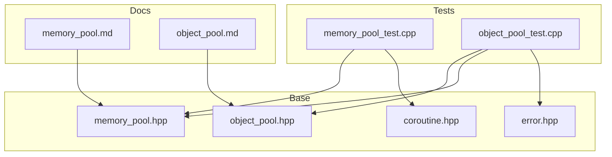
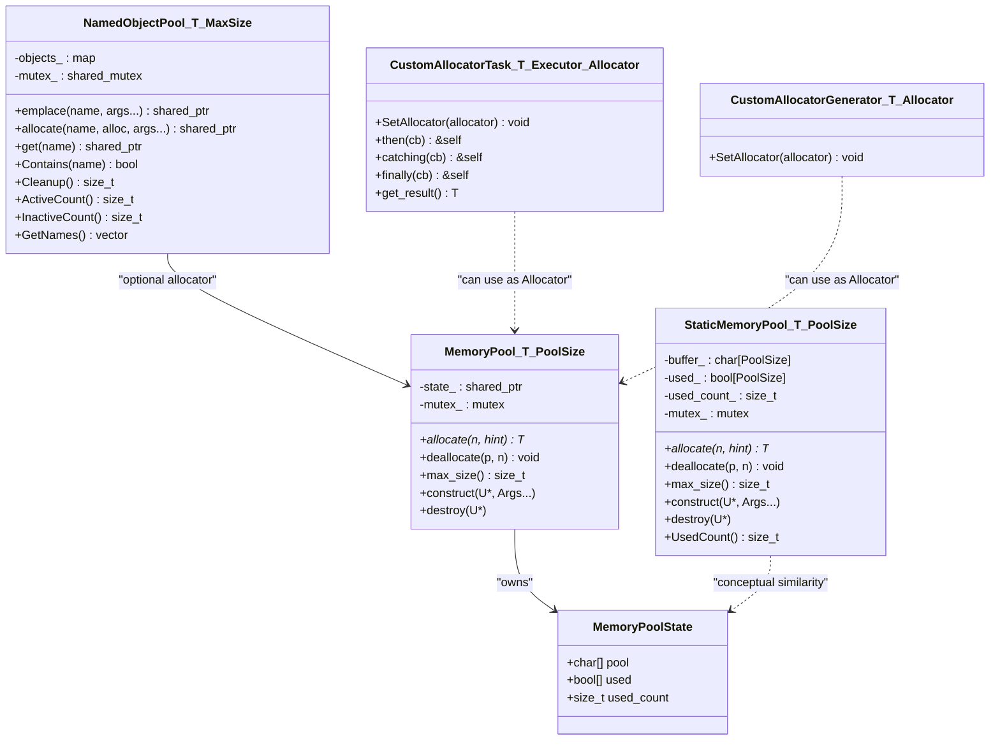
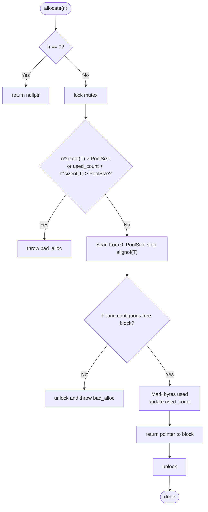
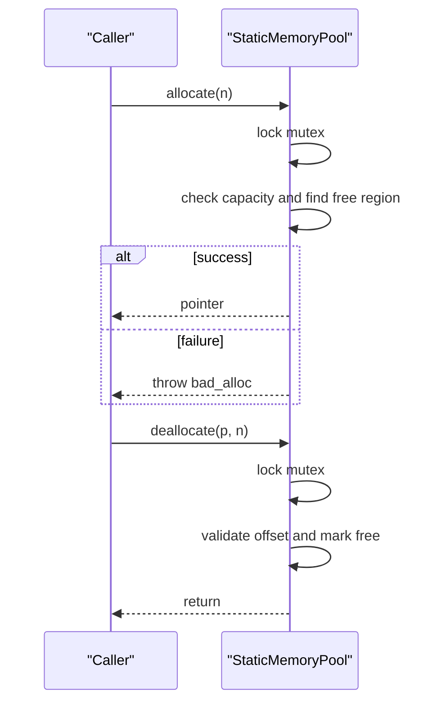
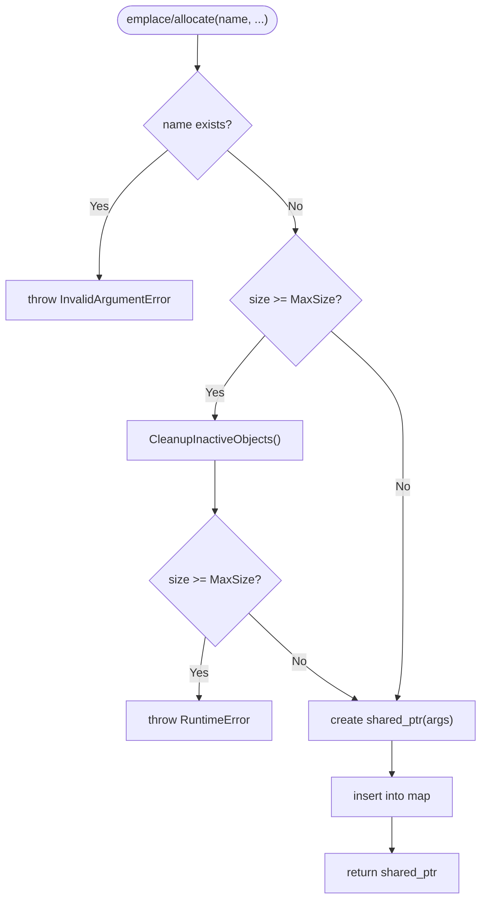
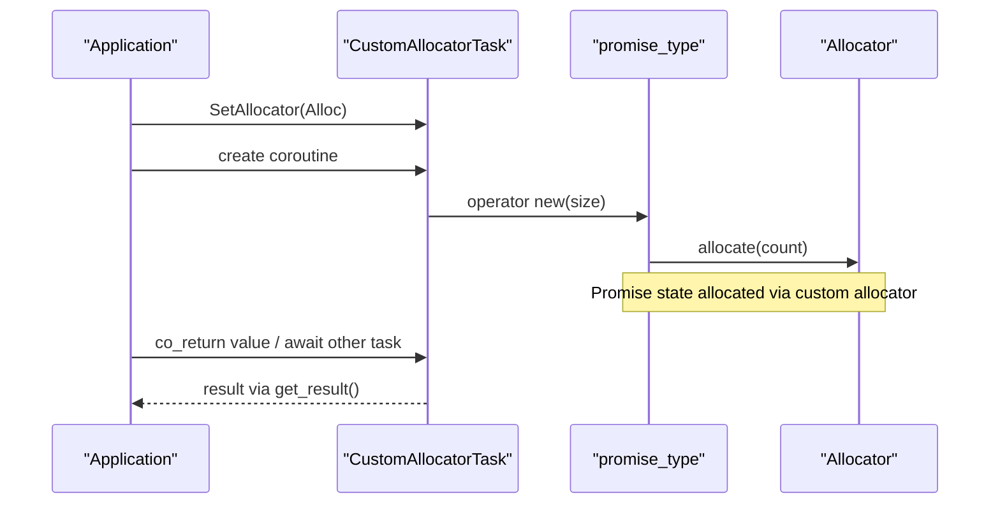
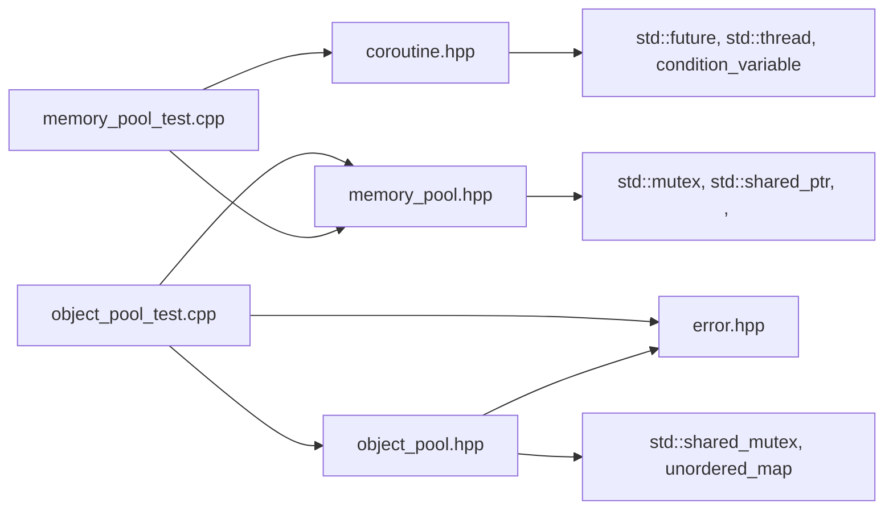

# Memory Management System

<cite>
**Referenced Files in This Document**
- [memory_pool.hpp](file://base/memory_pool.hpp)
- [object_pool.hpp](file://base/object_pool.hpp)
- [coroutine.hpp](file://base/coroutine.hpp)
- [error.hpp](file://base/error.hpp)
- [memory_pool_test.cpp](file://tests/Pool/memory_pool_test.cpp)
- [object_pool_test.cpp](file://tests/Pool/object_pool_test.cpp)
- [memory_pool.md](file://docs/en/base/memory_pool.md)
- [object_pool.md](file://docs/en/base/object_pool.md)
</cite>

## Table of Contents
1. [Introduction](#introduction)
2. [Project Structure](#project-structure)
3. [Core Components](#core-components)
4. [Architecture Overview](#architecture-overview)
5. [Detailed Component Analysis](#detailed-component-analysis)
6. [Dependency Analysis](#dependency-analysis)
7. [Performance Considerations](#performance-considerations)
8. [Troubleshooting Guide](#troubleshooting-guide)
9. [Conclusion](#conclusion)
10. [Appendices](#appendices)

## Introduction
This document describes the memory management system implemented in the repository, focusing on:
- Custom STL-compatible memory pool allocators for deterministic and efficient allocation
- A named object pool with automatic cleanup and capacity control
- Integration with C++20 coroutines to use custom allocators for coroutine state

The goal is to provide a clear understanding of how these components work together, their design trade-offs, and how to use them safely and efficiently.

## Project Structure
The memory management system spans a small set of core headers and tests:
- base/memory_pool.hpp: Two allocator implementations (shared and static)
- base/object_pool.hpp: Named object pool with shared ownership and lifecycle management
- base/coroutine.hpp: Coroutine primitives supporting custom allocators
- base/error.hpp: Custom exception types used by the object pool
- tests/Pool/*: Unit tests validating behavior and integration
- docs/en/base/*.md: User-facing documentation

**Diagram sources**
- [memory_pool.hpp:1-370](file://base/memory_pool.hpp#L1-L370)
- [object_pool.hpp:1-235](file://base/object_pool.hpp#L1-L235)
- [coroutine.hpp:1-1070](file://base/coroutine.hpp#L1-L1070)
- [error.hpp:1-147](file://base/error.hpp#L1-L147)
- [memory_pool_test.cpp:1-100](file://tests/Pool/memory_pool_test.cpp#L1-L100)
- [object_pool_test.cpp:1-162](file://tests/Pool/object_pool_test.cpp#L1-L162)
- [memory_pool.md:1-325](file://docs/en/base/memory_pool.md#L1-L325)
- [object_pool.md:1-274](file://docs/en/base/object_pool.md#L1-L274)

**Section sources**
- [memory_pool.hpp:1-370](file://base/memory_pool.hpp#L1-L370)
- [object_pool.hpp:1-235](file://base/object_pool.hpp#L1-L235)
- [coroutine.hpp:1-1070](file://base/coroutine.hpp#L1-L1070)
- [error.hpp:1-147](file://base/error.hpp#L1-L147)
- [memory_pool_test.cpp:1-100](file://tests/Pool/memory_pool_test.cpp#L1-L100)
- [object_pool_test.cpp:1-162](file://tests/Pool/object_pool_test.cpp#L1-L162)
- [memory_pool.md:1-325](file://docs/en/base/memory_pool.md#L1-L325)
- [object_pool.md:1-274](file://docs/en/base/object_pool.md#L1-L274)

## Core Components
- MemoryPool<T, PoolSize>: Shared-state, thread-safe, STL-compatible allocator backed by a fixed-size buffer. Multiple instances can share the same underlying pool via shared_ptr.
- StaticMemoryPool<T, PoolSize>: Global singleton-style allocator with zero instance overhead; all instances are considered equal and share one static buffer.
- NamedObjectPool<T, MaxSize>: Name-based container of std::shared_ptr<T> with automatic cleanup of inactive objects, capacity limits, and optional custom allocator support.
- Coroutine integration: CustomAllocatorTask and CustomAllocatorGenerator allow coroutine promise objects to be allocated using any custom allocator (including the memory pools).

Key characteristics:
- Thread safety: Mutexes protect allocations/deallocations and object pool operations.
- Capacity enforcement: Pools throw exceptions when overcommitted or full.
- STL compatibility: Allocators implement the standard interface, enabling direct use with containers like std::vector and std::list.
- Lifecycle management: Object pool uses weak references to detect inactive entries and supports manual or automatic cleanup.

**Section sources**
- [memory_pool.hpp:1-370](file://base/memory_pool.hpp#L1-L370)
- [object_pool.hpp:1-235](file://base/object_pool.hpp#L1-L235)
- [coroutine.hpp:1-1070](file://base/coroutine.hpp#L1-L1070)

## Architecture Overview
The system composes three layers:
- Allocator layer: Low-level, fixed-capacity memory pools implementing the STL allocator interface.
- Object pooling layer: Higher-level management of named objects with shared ownership and lifecycle policies.
- Coroutine layer: Asynchronous primitives that can allocate their internal state using custom allocators.

**Diagram sources**
- [memory_pool.hpp:1-370](file://base/memory_pool.hpp#L1-L370)
- [object_pool.hpp:1-235](file://base/object_pool.hpp#L1-L235)
- [coroutine.hpp:1-1070](file://base/coroutine.hpp#L1-L1070)

## Detailed Component Analysis

### MemoryPool<T, PoolSize>
- Purpose: Fixed-capacity, thread-safe allocator sharing a single buffer across instances via shared_ptr.
- Allocation strategy: First-fit scan aligned to alignof(T), marking byte ranges as used/free.
- Concurrency: Protected by a mutex around allocate/deallocate.
- STL compliance: Provides value_type, pointer, rebind, construct/destroy, max_size, and equality semantics.
- Error handling: Throws std::bad_alloc on insufficient space; deallocate validates bounds and throws invalid_argument if out-of-bounds.

**Diagram sources**
- [memory_pool.hpp:111-142](file://base/memory_pool.hpp#L111-L142)

**Section sources**
- [memory_pool.hpp:28-203](file://base/memory_pool.hpp#L28-L203)

### StaticMemoryPool<T, PoolSize>
- Purpose: Global, zero-instance-overhead allocator where all instances are equal and share one static buffer.
- Allocation strategy: Similar first-fit approach without alignment stepping in this variant.
- Concurrency: Protected by a static mutex.
- Observability: Exposes UsedCount() to query current usage.
- Equality: All instances compare equal, enabling containers to treat them as interchangeable.

**Diagram sources**
- [memory_pool.hpp:261-319](file://base/memory_pool.hpp#L261-L319)

**Section sources**
- [memory_pool.hpp:210-367](file://base/memory_pool.hpp#L210-L367)

### NamedObjectPool<T, MaxSize>
- Purpose: Manage named objects with shared ownership, capacity limits, and automatic cleanup of inactive entries.
- Key behaviors:
  - emplace/allocate create objects and store them under unique names.
  - get/operator[] retrieve shared pointers by name.
  - Inactive detection based on shared_ptr use count equals 1 (only pool holds it).
  - Automatic cleanup triggered when adding new items while at capacity.
  - Manual Cleanup() removes all inactive entries.
- Concurrency: Uses shared_mutex to allow concurrent reads and exclusive writes.

**Diagram sources**
- [object_pool.hpp:65-91](file://base/object_pool.hpp#L65-L91)
- [object_pool.hpp:101-122](file://base/object_pool.hpp#L101-L122)
- [object_pool.hpp:211-228](file://base/object_pool.hpp#L211-L228)

**Section sources**
- [object_pool.hpp:1-235](file://base/object_pool.hpp#L1-L235)
- [error.hpp:1-147](file://base/error.hpp#L1-L147)

### Coroutine Integration with Custom Allocators
- CustomAllocatorTask<T, Executor, Allocator>: Task implementation whose promise_type allocates its state using the provided Allocator. Supports chaining callbacks and awaiting other tasks.
- CustomAllocatorGenerator<T, Allocator>: Generator implementation whose promise_type allocates its state using the provided Allocator.
- Configuration: SetAllocator sets a static allocator instance used by subsequent coroutine creations.

**Diagram sources**
- [coroutine.hpp:558-767](file://base/coroutine.hpp#L558-L767)
- [coroutine.hpp:896-1011](file://base/coroutine.hpp#L896-L1011)

**Section sources**
- [coroutine.hpp:1-1070](file://base/coroutine.hpp#L1-L1070)

## Dependency Analysis
- memory_pool.hpp depends on standard library features for synchronization and type traits.
- object_pool.hpp depends on error.hpp for domain-specific exceptions and uses shared_mutex for concurrency.
- coroutine.hpp provides executors and task/generator abstractions; custom allocator variants depend on an allocator concept enforced by constraints.
- Tests demonstrate:
  - Using MemoryPool and StaticMemoryPool with STL containers and smart pointers
  - Integrating StaticMemoryPool with coroutines via SetAllocator
  - NamedObjectPool creation, retrieval, capacity enforcement, and cleanup

**Diagram sources**
- [memory_pool.hpp:1-370](file://base/memory_pool.hpp#L1-L370)
- [object_pool.hpp:1-235](file://base/object_pool.hpp#L1-L235)
- [coroutine.hpp:1-1070](file://base/coroutine.hpp#L1-L1070)
- [error.hpp:1-147](file://base/error.hpp#L1-L147)
- [memory_pool_test.cpp:1-100](file://tests/Pool/memory_pool_test.cpp#L1-L100)
- [object_pool_test.cpp:1-162](file://tests/Pool/object_pool_test.cpp#L1-L162)

**Section sources**
- [memory_pool.hpp:1-370](file://base/memory_pool.hpp#L1-L370)
- [object_pool.hpp:1-235](file://base/object_pool.hpp#L1-L235)
- [coroutine.hpp:1-1070](file://base/coroutine.hpp#L1-L1070)
- [error.hpp:1-147](file://base/error.hpp#L1-L147)
- [memory_pool_test.cpp:1-100](file://tests/Pool/memory_pool_test.cpp#L1-L100)
- [object_pool_test.cpp:1-162](file://tests/Pool/object_pool_test.cpp#L1-L162)

## Performance Considerations
- MemoryPool vs StaticMemoryPool:
  - MemoryPool allows multiple independent pools with shared state between copies; useful for scoped allocation regions.
  - StaticMemoryPool has zero instance overhead and global sharing; ideal for simple, application-wide pools.
- Allocation strategy:
  - First-fit scanning may lead to fragmentation over time; consider periodic compaction strategies if needed.
  - Alignment-aware scanning in MemoryPool ensures correct placement for arbitrary types.
- Concurrency:
  - Both allocators use mutexes; contention increases with high allocation rates. Consider per-thread pools or lock-free designs for extreme throughput.
- Object pool:
  - Lazy cleanup reduces overhead but may delay memory reclamation; call Cleanup() periodically if you need prompt reclamation.
  - Use ActiveCount/InactiveCount to monitor utilization and tune MaxSize.
- Coroutines:
  - Using custom allocators for coroutine promises avoids heap churn in hot paths; ensure the allocator lifetime exceeds coroutine lifetimes.

[No sources needed since this section provides general guidance]

## Troubleshooting Guide
Common issues and resolutions:
- Out of memory in pools:
  - Symptoms: std::bad_alloc during allocate.
  - Causes: Pool capacity exceeded or insufficient contiguous space due to fragmentation.
  - Actions: Increase PoolSize, reduce allocation sizes, or adopt a different pooling strategy.
- Invalid pointer in deallocate:
  - Symptoms: std::invalid_argument indicating pointer out of pool bounds.
  - Causes: Passing a pointer not returned by the pool or incorrect size parameter.
  - Actions: Ensure every deallocate corresponds to a matching allocate with the same n.
- Duplicate object names:
  - Symptoms: InvalidArgumentError when inserting into NamedObjectPool.
  - Causes: Attempting to add an object with an existing name.
  - Actions: Choose unique names or remove/reuse existing entries.
- Pool full and no inactive objects:
  - Symptoms: RuntimeError indicating pool is full.
  - Causes: MaxSize reached and no inactive entries available after cleanup.
  - Actions: Release external shared_ptr references to make objects inactive, call Cleanup(), or increase MaxSize.
- Coroutine allocator configuration:
  - Symptoms: Unexpected allocations or crashes when using coroutines.
  - Causes: Missing SetAllocator call or allocator lifetime shorter than coroutine.
  - Actions: Call SetAllocator before creating coroutines and ensure the allocator remains alive.

**Section sources**
- [memory_pool.hpp:111-175](file://base/memory_pool.hpp#L111-L175)
- [object_pool.hpp:65-122](file://base/object_pool.hpp#L65-L122)
- [error.hpp:1-147](file://base/error.hpp#L1-L147)
- [memory_pool_test.cpp:76-98](file://tests/Pool/memory_pool_test.cpp#L76-L98)
- [object_pool_test.cpp:116-141](file://tests/Pool/object_pool_test.cpp#L116-L141)

## Conclusion
The memory management system provides:
- Deterministic, low-overhead allocation through fixed-capacity pools
- Safe, named object management with automatic cleanup and capacity control
- Seamless integration with modern C++ coroutines via custom allocators

These components enable predictable performance and resource control in demanding applications such as real-time processing, simulation, and high-throughput pipelines.

[No sources needed since this section summarizes without analyzing specific files]

## Appendices

### API Quick Reference
- MemoryPool<T, PoolSize>
  - allocate(n, hint), deallocate(p, n), max_size(), construct/destroy, equality operators
- StaticMemoryPool<T, PoolSize>
  - allocate(n, hint), deallocate(p, n), max_size(), construct/destroy, UsedCount()
- NamedObjectPool<T, MaxSize>
  - emplace(name, ...), allocate(name, alloc, ...), get(name), Contains(name), Cleanup(), ActiveCount(), InactiveCount(), GetNames()
- Coroutine Custom Allocators
  - CustomAllocatorTask<T, Executor, Allocator>::SetAllocator(allocator)
  - CustomAllocatorGenerator<T, Allocator>::SetAllocator(allocator)

**Section sources**
- [memory_pool.hpp:43-203](file://base/memory_pool.hpp#L43-L203)
- [memory_pool.hpp:210-367](file://base/memory_pool.hpp#L210-L367)
- [object_pool.hpp:22-232](file://base/object_pool.hpp#L22-L232)
- [coroutine.hpp:558-767](file://base/coroutine.hpp#L558-L767)
- [coroutine.hpp:896-1011](file://base/coroutine.hpp#L896-L1011)

### Usage Examples (by reference)
- Using allocators with STL containers and smart pointers:
  - See [memory_pool_test.cpp:30-74](file://tests/Pool/memory_pool_test.cpp#L30-L74)
- Integrating allocators with coroutines:
  - See [memory_pool_test.cpp:76-98](file://tests/Pool/memory_pool_test.cpp#L76-L98)
- Named object pool lifecycle and capacity:
  - See [object_pool_test.cpp:9-141](file://tests/Pool/object_pool_test.cpp#L9-L141)

**Section sources**
- [memory_pool_test.cpp:30-98](file://tests/Pool/memory_pool_test.cpp#L30-L98)
- [object_pool_test.cpp:9-141](file://tests/Pool/object_pool_test.cpp#L9-L141)