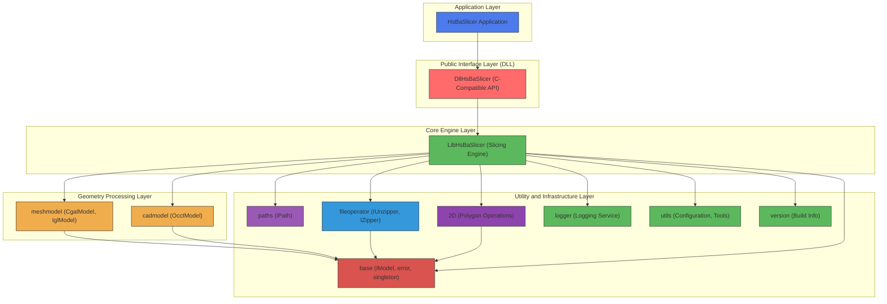
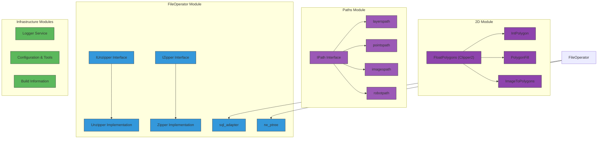
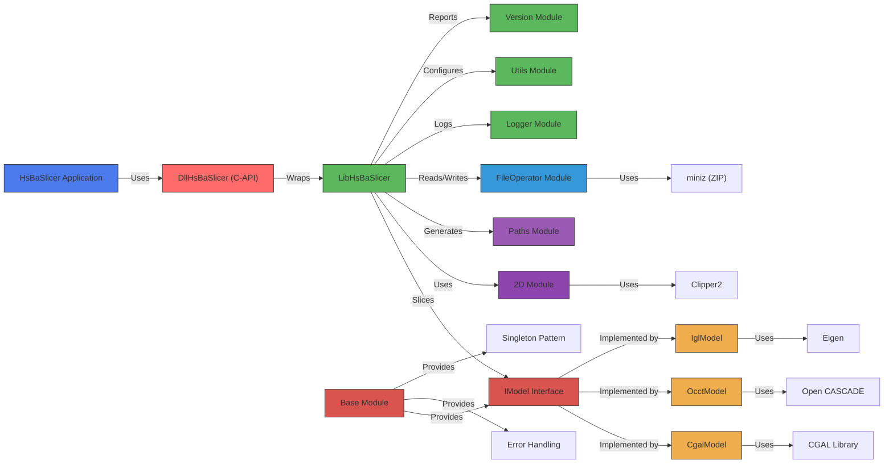
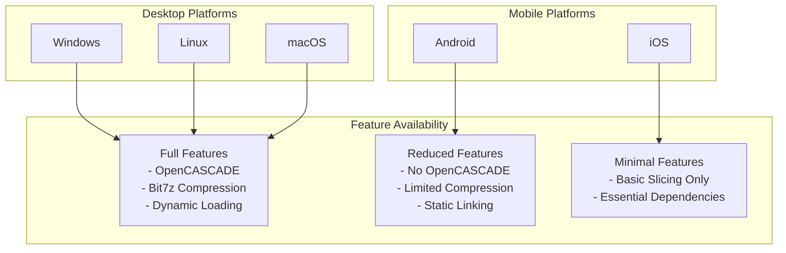

# Module Overview

<cite>
**Referenced Files in This Document**   
- [LibHsBaSlicer/CMakeLists.txt](file://LibHsBaSlicer/CMakeLists.txt)
- [DllHsBaSlicer/CMakeLists.txt](file://DllHsBaSlicer/CMakeLists.txt)
- [HsBaSlicer/CMakeLists.txt](file://HsBaSlicer/CMakeLists.txt)
- [base/IModel.hpp](file://base/IModel.hpp)
- [meshmodel/CgalModel.hpp](file://meshmodel/CgalModel.hpp)
- [cadmodel/OcctModel.hpp](file://cadmodel/OcctModel.hpp)
- [paths/IPath.hpp](file://paths/IPath.hpp)
- [LibHsBaSlicer/Slice/mesh_slice.hpp](file://LibHsBaSlicer/Slice/mesh_slice.hpp)
- [LibHsBaSlicer/export.h](file://LibHsBaSlicer/export.h)
- [DllHsBaSlicer/dllexport.h](file://DllHsBaSlicer/dllexport.h)
- [logger/export.h](file://logger/export.h)
- [base/singleton.hpp](file://base/singleton.hpp)
- [base/error.hpp](file://base/error.hpp)
- [utils/app_config.hpp](file://utils/app_config.hpp)
- [logger/logger.hpp](file://logger/logger.hpp)
- [fileoperator/unzipper.hpp](file://fileoperator/unzipper.hpp)
- [version/version.hpp](file://version/version.hpp)
</cite>

## Update Summary
**Changes Made**   
- Updated architecture diagrams to reflect the new DLL/library separation with DllHsBaSlicer as the public interface layer
- Added documentation for the enhanced build system with platform-specific configurations and conditional compilation
- Updated module dependency relationships to show the new layered architecture with explicit DLL boundaries
- Enhanced cross-cutting concerns section to cover improved error handling and memory management patterns
- Added platform compatibility information for Android, iOS, and desktop platforms

## Table of Contents
1. [Introduction](#introduction)
2. [Layered Architecture Overview](#layered-architecture-overview)
3. [Core Components](#core-components)
4. [Module Dependencies and Data Flow](#module-dependencies-and-data-flow)
5. [Design Patterns and Architectural Principles](#design-patterns-and-architectural-principles)
6. [Cross-Cutting Concerns](#cross-cutting-concerns)
7. [Platform Compatibility and Build System](#platform-compatibility-and-build-system)
8. [Conclusion](#conclusion)

## Introduction
The HsBaSlicer system is a modular 3D slicing engine designed for processing both mesh-based and CAD-based geometric models. The architecture follows a layered design with clear separation between DLL interfaces and library implementations, where LibHsBaSlicer serves as the core slicing engine and DllHsBaSlicer provides the public C-compatible API. The system supports multiple geometry kernels through abstract interfaces and provides extensible modules for geometry processing, path generation, and file I/O operations. This document provides a comprehensive overview of the system's architecture, component interactions, and key design patterns with enhanced modularity and reduced duplication.

## Layered Architecture Overview



**Diagram sources**
- [LibHsBaSlicer/CMakeLists.txt:1-68](file://LibHsBaSlicer/CMakeLists.txt#L1-L68)
- [DllHsBaSlicer/CMakeLists.txt:1-33](file://DllHsBaSlicer/CMakeLists.txt#L1-L33)
- [HsBaSlicer/CMakeLists.txt:1-67](file://HsBaSlicer/CMakeLists.txt#L1-L67)
- [base/IModel.hpp:108-136](file://base/IModel.hpp#L108-L136)

**Section sources**
- [LibHsBaSlicer/CMakeLists.txt](file://LibHsBaSlicer/CMakeLists.txt)
- [DllHsBaSlicer/CMakeLists.txt](file://DllHsBaSlicer/CMakeLists.txt)
- [HsBaSlicer/CMakeLists.txt](file://HsBaSlicer/CMakeLists.txt)
- [base/IModel.hpp](file://base/IModel.hpp)

## Core Components

### DllHsBaSlicer - Public C-Compatible Interface Layer
DllHsBaSlicer serves as the public-facing DLL that provides C-compatible APIs for external applications. It acts as a thin wrapper around LibHsBaSlicer, exposing simplified data structures and functions that are language-agnostic. The DLL exports FDM and SLA pipeline functions with progress callbacks and asynchronous execution support.

Key features include:
- **C-Compatible API**: All exported functions use `extern "C"` with simple data types
- **Pipeline Abstraction**: High-level FDM and SLA pipeline functions
- **Memory Management**: Clear ownership semantics with dedicated cleanup functions
- **Progress Tracking**: Callback-based progress reporting during long-running operations

**Section sources**
- [DllHsBaSlicer/fdm_pipeline.h:1-156](file://DllHsBaSlicer/fdm_pipeline.h#L1-L156)
- [DllHsBaSlicer/sla_pipeline.h:1-160](file://DllHsBaSlicer/sla_pipeline.h#L1-L160)
- [DllHsBaSlicer/dllexport.h:1-16](file://DllHsBaSlicer/dllexport.h#L1-L16)

### LibHsBaSlicer - Central Slicing Engine
LibHsBaSlicer is the core library that provides slicing functionality for 3D models. It acts as an intermediary between the application layer and the underlying geometry processing modules. The library exports slicing functions that operate on the abstract IModel interface, allowing it to work with any geometry kernel implementation.

The slicing functionality is implemented in the `mesh_slice.hpp` component, which provides both safe and unsafe slicing operations. Safe slicing ignores non-closed contours, while unsafe slicing includes them, catering to different manufacturing processes like filament deposition versus SLA printing.

**Updated** Enhanced with improved export macros and better separation from DLL interface layer.

**Section sources**
- [LibHsBaSlicer/Slice/mesh_slice.hpp:1-41](file://LibHsBaSlicer/Slice/mesh_slice.hpp#L1-L41)
- [LibHsBaSlicer/export.h:1-15](file://LibHsBaSlicer/export.h#L1-L15)
- [LibHsBaSlicer/CMakeLists.txt:1-68](file://LibHsBaSlicer/CMakeLists.txt#L1-L68)

### IModel Interface and Geometry Kernel Implementations
The system employs interface-based polymorphism through the `IModel` abstract base class defined in the base module. This interface provides a unified API for loading, saving, transforming, and querying 3D models regardless of the underlying geometry representation.

Two primary geometry kernel implementations exist:
- **CgalModel**: Implements IModel using CGAL (Computational Geometry Algorithms Library) for precise boundary representation and boolean operations
- **OcctModel**: Implements IModel using Open CASCADE Technology for CAD model processing and STEP/IGES file format support
- **IglModel**: Implements IModel using libigl for mesh-based operations and fast processing

Each implementation encapsulates the specific kernel's data structures while presenting a consistent interface to the slicing engine.

```mermaid
classDiagram
class IModel {
<<abstract>>
+~IModel()
+Load(fileName) bool
+Save(fileName, format) bool
+Translate(translation) void
+Rotate(rotation) void
+Scale(scale) void
+Scale(scale) void
+Transform(transform) void
+Transform(transform) void
+Transform(transform) void
+BoundingBox(min, max) void
+Volume() float
+TriangleMesh() pair~MatrixXf,MatrixXi~
}
class CgalModel {
-mesh_ : Polyhedron_3
-filename_ : string
+CgalModel()
+CgalModel(o)
+CgalModel(v, f)
+Union(left, right) CgalModel
+Intersection(left, right) CgalModel
+Difference(left, right) CgalModel
+Xor(left, right) CgalModel
+CreateBox(size) CgalModel
+CreateSphere(radius, subdivisions) CgalModel
}
class OcctModel {
-shape_ : TopoDS_Shape
-fileName_ : string
+OcctModel()
+OcctModel(shape)
+AddShape(o) void
+AddShape(o) void
+AddShape(o) void
+AddShape(o) void
+UnionAll() bool
+Union(left, right) OcctModel
+Intersection(left, right) OcctModel
+Difference(left, right) OcctModel
+Xor(left, right) OcctModel
+ThickSolid(model, thickness) OcctModel
+ThickSolid(model, faces, thickness) OcctModel
+CreateBox(size) OcctModel
+CreateSphere(radius, subdivisions) OcctModel
}
class IglModel {
-vertices_ : MatrixXf
-faces_ : MatrixXi
-normals_ : MatrixXf
-fileName_ : string
+IglModel()
+IglModel(vertices, faces, calcNormals)
+IglModel(vertices, faces, normals)
+ComputeNormals() void
+ComputeVertexNormals() MatrixXf
+ComputeFaceNormals() MatrixXf
+Union(left, right) IglModel
+Intersection(left, right) IglModel
+Difference(left, right) IglModel
+Xor(left, right) IglModel
+CreateBox(size) IglModel
+CreateSphere(radius, subdivisions) IglModel
}
IModel <|-- CgalModel
IModel <|-- OcctModel
IModel <|-- IglModel
note right of CgalModel
Uses CGAL for exact
geometric computations
and boolean operations
end note
note right of OcctModel
Uses Open CASCADE for
CAD model processing
and STEP/IGES support
end note
note right of IglModel
Uses libigl for mesh
processing and fast
geometric operations
end note
```

**Diagram sources**
- [base/IModel.hpp:108-136](file://base/IModel.hpp#L108-L136)
- [meshmodel/CgalModel.hpp:20-70](file://meshmodel/CgalModel.hpp#L20-L70)
- [cadmodel/OcctModel.hpp:16-63](file://cadmodel/OcctModel.hpp#L16-L63)
- [meshmodel/IglModel.hpp:12-63](file://meshmodel/IglModel.hpp#L12-L63)

**Section sources**
- [base/IModel.hpp](file://base/IModel.hpp)
- [meshmodel/CgalModel.hpp](file://meshmodel/CgalModel.hpp)
- [cadmodel/OcctModel.hpp](file://cadmodel/OcctModel.hpp)
- [meshmodel/IglModel.hpp](file://meshmodel/IglModel.hpp)

### Supporting Modules
The architecture includes several specialized modules that handle specific aspects of the slicing pipeline:

- **2D Module**: Provides polygon operations using Clipper2 library for 2D contour processing, including boolean operations, offsetting, and area calculations
- **Paths Module**: Defines the IPath interface for path generation and output, with implementations for different path types (layers, points, images)
- **FileOperator Module**: Handles file I/O operations with support for compressed archives through IUnzipper and IZipper interfaces
- **Base Module**: Contains foundational utilities including error handling, type conversion, and design pattern implementations
- **Logger Module**: Provides centralized logging service with configurable output levels and file destinations
- **Utils Module**: Offers application configuration management and utility functions
- **Version Module**: Manages build information and third-party library metadata



**Diagram sources**
- [2D/FloatPolygons.hpp:13-15](file://2D/FloatPolygons.hpp#L13-L15)
- [paths/IPath.hpp:12-24](file://paths/IPath.hpp#L12-L24)
- [fileoperator/unzipper.hpp:15-17](file://fileoperator/unzipper.hpp#L15-L17)

**Section sources**
- [2D/FloatPolygons.hpp](file://2D/FloatPolygons.hpp)
- [paths/IPath.hpp](file://paths/IPath.hpp)
- [fileoperator/unzipper.hpp](file://fileoperator/unzipper.hpp)

## Module Dependencies and Data Flow



**Diagram sources**
- [LibHsBaSlicer/CMakeLists.txt:45-54](file://LibHsBaSlicer/CMakeLists.txt#L45-L54)
- [DllHsBaSlicer/CMakeLists.txt:18-33](file://DllHsBaSlicer/CMakeLists.txt#L18-L33)
- [base/IModel.hpp:108-136](file://base/IModel.hpp#L108-L136)

**Section sources**
- [LibHsBaSlicer/CMakeLists.txt](file://LibHsBaSlicer/CMakeLists.txt)
- [DllHsBaSlicer/CMakeLists.txt](file://DllHsBaSlicer/CMakeLists.txt)
- [base/IModel.hpp](file://base/IModel.hpp)

## Design Patterns and Architectural Principles

### Interface-Based Polymorphism
The system extensively uses interface-based polymorphism through the IModel and IPath abstract classes. This design allows the slicing engine to work with different geometry representations without being coupled to specific implementations. The client code interacts with models through the IModel interface, while the actual implementation (CgalModel, OcctModel, or IglModel) is determined at runtime.

This approach enables:
- Easy addition of new geometry kernel implementations
- Runtime selection of appropriate kernel based on model type or requirements
- Testability through mock implementations
- Clear separation between interface and implementation

### Pimpl Pattern and Encapsulation
While not explicitly using the Pimpl (Pointer to Implementation) pattern in the traditional sense, the design achieves similar goals through careful encapsulation. Each model implementation (CgalModel, OcctModel, IglModel) hides its internal data structures and exposes functionality only through the public interface. This protects clients from changes in the underlying geometry kernel and reduces compilation dependencies.

### Singleton Pattern for Global Services
The system employs the singleton pattern for managing global services such as logging and configuration. The base/singleton.hpp provides a thread-safe singleton template that ensures only one instance of a service exists throughout the application lifecycle.

Key singleton implementations include:
- **LoggerSingletone**: Centralized logging service with configurable output and levels
- **AppConfigSingletone**: Application configuration management with access to system paths and settings

```mermaid
classDiagram
class Singleton~T~ {
+GetInstance(args) shared_ptr~T~
-instance_ : shared_ptr~T~
-mutex_ : shared_mutex
-instance_flag_ : once_flag
-Singleton()
-~Singleton()
}
class LoggerSingletone {
+Log(message, level, location) void
+LogDebug(message, location) void
+LogInfo(message, location) void
+LogWarning(message, location) void
+LogError(message, location) void
+GetInstance() shared_ptr~LoggerSingletone~
-use_log_file_ : bool
-log_path_ : string
-log_level_ : int
-log_datatime_format_ : string
}
class AppConfigSingletone {
+GetInstance() AppConfigSingletone&
+DeleteInstance() void
+GetSevenZPath() string
-sevenZ_path_ : string
}
Singleton~T~ <|-- LoggerSingletone
Singleton~T~ <|-- AppConfigSingletone
note right of LoggerSingletone
Thread-safe singleton for
centralized logging with
source location support
end note
note right of AppConfigSingletone
Singleton pattern for
application configuration
and system path management
end note
```

**Diagram sources**
- [base/singleton.hpp:11-36](file://base/singleton.hpp#L11-L36)
- [logger/logger.hpp:17-45](file://logger/logger.hpp#L17-L45)
- [utils/app_config.hpp:10-20](file://utils/app_config.hpp#L10-L20)

**Section sources**
- [base/singleton.hpp](file://base/singleton.hpp)
- [logger/logger.hpp](file://logger/logger.hpp)
- [utils/app_config.hpp](file://utils/app_config.hpp)

## Cross-Cutting Concerns

### Error Handling Strategy
The system implements a comprehensive error handling strategy through the base/error.hpp component. It defines a hierarchy of exception classes that inherit from a common RuntimeError base class, providing specific error types for different failure modes:

- **RuntimeError**: Base class for all runtime errors
- **OutOfRangeError**: Index or boundary violations
- **InvalidArgumentError**: Invalid function parameters
- **IOError**: File system and I/O operations
- **NotImplementedError**: Missing functionality
- **NullValueError**: Null pointer or value access
- **NotSupportedError**: Unsupported operations
- **NotFoundError**: Resource not found
- **AlreadyExistsError**: Resource already exists
- **PermissionDeniedError**: Access denied
- **TimeoutError**: Operation timeout
- **InterruptedError**: Operation interrupted
- **CancelledError**: Operation cancelled
- **OutOfMemoryError**: Memory allocation failure

This structured approach allows for precise error reporting and appropriate error handling at different levels of the application.

```mermaid
classDiagram
class RuntimeError {
+RuntimeError(msg)
+RuntimeError(msg)
+what() const char*
}
class OutOfRangeError {
+OutOfRangeError(msg)
+OutOfRangeError(msg)
+what() const char*
}
class InvalidArgumentError {
+InvalidArgumentError(msg)
+InvalidArgumentError(msg)
+what() const char*
}
class IOError {
+IOError(msg)
+IOError(msg)
+what() const char*
}
class NotImplementedError {
+NotImplementedError(msg)
+NotImplementedError(msg)
+what() const char*
}
class NullValueError {
+NullValueError(msg)
+NullValueError(msg)
+what() const char*
}
class NotSupportedError {
+NotSupportedError(msg)
+NotSupportedError(msg)
+what() const char*
}
class NotFoundError {
+NotFoundError(msg)
+NotFoundError(msg)
+what() const char*
}
class AlreadyExistsError {
+AlreadyExistsError(msg)
+AlreadyExistsError(msg)
+what() const char*
}
class PermissionDeniedError {
+PermissionDeniedError(msg)
+PermissionDeniedError(msg)
+what() const char*
}
class TimeoutError {
+TimeoutError(msg)
+TimeoutError(msg)
+what() const char*
}
class InterruptedError {
+InterruptedError(msg)
+InterruptedError(msg)
+what() const char*
}
class CancelledError {
+CancelledError(msg)
+CancelledError(msg)
+what() const char*
}
class OutOfMemoryError {
+OutOfMemoryError(msg)
+OutOfMemoryError(msg)
+what() const char*
}
RuntimeError <|-- OutOfRangeError
RuntimeError <|-- InvalidArgumentError
RuntimeError <|-- IOError
RuntimeError <|-- NotImplementedError
RuntimeError <|-- NullValueError
RuntimeError <|-- NotSupportedError
RuntimeError <|-- NotFoundError
RuntimeError <|-- AlreadyExistsError
RuntimeError <|-- PermissionDeniedError
RuntimeError <|-- TimeoutError
RuntimeError <|-- InterruptedError
RuntimeError <|-- CancelledError
RuntimeError <|-- OutOfMemoryError
note right of RuntimeError
Base class for all runtime
exceptions in the system
end note
note right of IOError
Handles file system and
I/O related errors
end note
note right of NotImplementedError
Used for placeholder
implementations
end note
```

**Diagram sources**
- [base/error.hpp:12-136](file://base/error.hpp#L12-L136)

**Section sources**
- [base/error.hpp](file://base/error.hpp)

### Memory Management
The system employs RAII (Resource Acquisition Is Initialization) principles and smart pointers for memory management. Key patterns include:

- **std::shared_ptr**: Used for shared ownership, particularly in singleton implementations and factory methods
- **std::unique_ptr**: Used for exclusive ownership where applicable
- **std::enable_shared_from_this**: Used in classes like Unzipper to safely create shared_ptr from within member functions
- **Inline static variables**: Used for thread-safe singleton instance management

The design minimizes raw pointer usage and avoids manual memory management, reducing the risk of memory leaks and dangling pointers.

## Platform Compatibility and Build System

### Enhanced Build System Support
The build system has been significantly refactored to provide better platform compatibility and improved modularity. The system now supports multiple target platforms with conditional compilation and feature detection.

**Key improvements include:**
- **Platform Detection**: Automatic detection of Windows, Linux, macOS, Android, and iOS platforms
- **Conditional Compilation**: Feature flags for optional components like bit7z compression and dynamic library loading
- **Dependency Management**: VCPKG integration with platform-specific dependency resolution
- **Export Macros**: Separate export headers for DLL and library interfaces

### Platform-Specific Configurations



**Diagram sources**
- [CMakeLists.txt:168-218](file://CMakeLists.txt#L168-L218)
- [vcpkg.json:1-65](file://vcpkg.json#L1-L65)

### Dependency Matrix

| Component | Windows | Linux | macOS | Android | iOS |
| --------- | ------- | ----- | ----- | ------- | --- |
| boost-log | ✓ | ✓ | ✓ | ✗ | ✗ |
| boost-locale | ✓ | ✓ | ✓ | ✗ | ✗ |
| boost-dll | ✓ | ✓ | ✓ | ✗ | ✗ |
| boost-nowide | ✓ | ✓ | ✓ | ✗ | ✗ |
| boost-date-time | ✓ | ✓ | ✓ | ✓ | ✓ |
| opencv | ✓ | ✓ | ✓ | ✓ | ✗ |
| opencascade | ✓ | ✓ | ✓ | ✗ | ✗ |
| bit7z | ✓ | ✓ | ✓ | ✗ | ✗ |

**Section sources**
- [CMakeLists.txt](file://CMakeLists.txt)
- [vcpkg.json](file://vcpkg.json)

## Conclusion
The HsBaSlicer architecture demonstrates a well-structured, modular design with clear separation of concerns and enhanced DLL/library boundaries. The layered approach with DllHsBaSlicer as the public interface and LibHsBaSlicer as the core engine provides a flexible foundation that can accommodate multiple geometry kernels through the IModel interface. The recent refactoring has improved modularity, reduced duplication, and enhanced platform compatibility.

Key architectural strengths include:
- **Enhanced Modularity**: Clear separation between DLL interface layer and core library implementation
- **Platform Flexibility**: Comprehensive support for desktop and mobile platforms with conditional compilation
- **Extensibility**: Easy addition of new geometry kernel implementations through the IModel interface
- **Robustness**: Comprehensive error handling hierarchy and thread-safe singleton implementations
- **Performance**: Efficient memory management and use of optimized geometry libraries

The architecture effectively balances the need for precision (through CGAL and Open CASCADE) with performance (through libigl), making it suitable for a wide range of 3D printing applications across multiple platforms. The modular design allows for incremental improvements and adaptation to new requirements without major architectural changes.