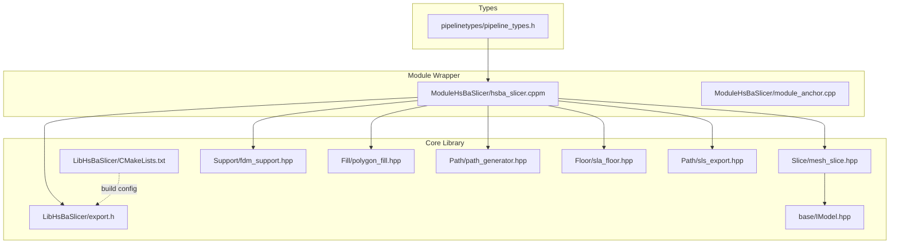
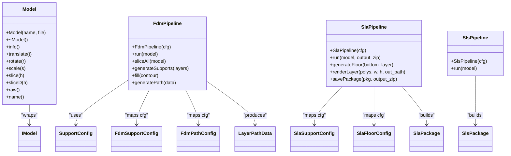
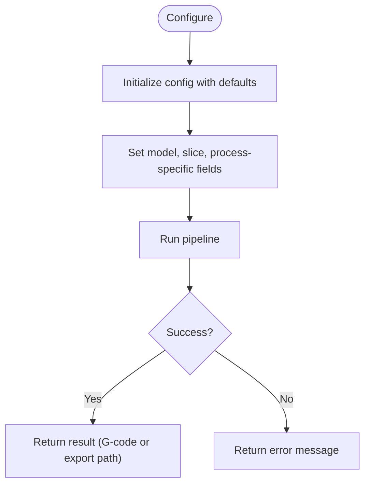
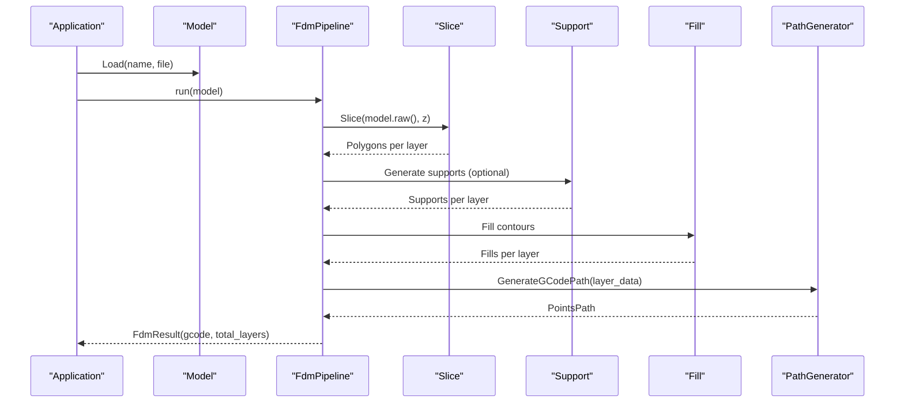
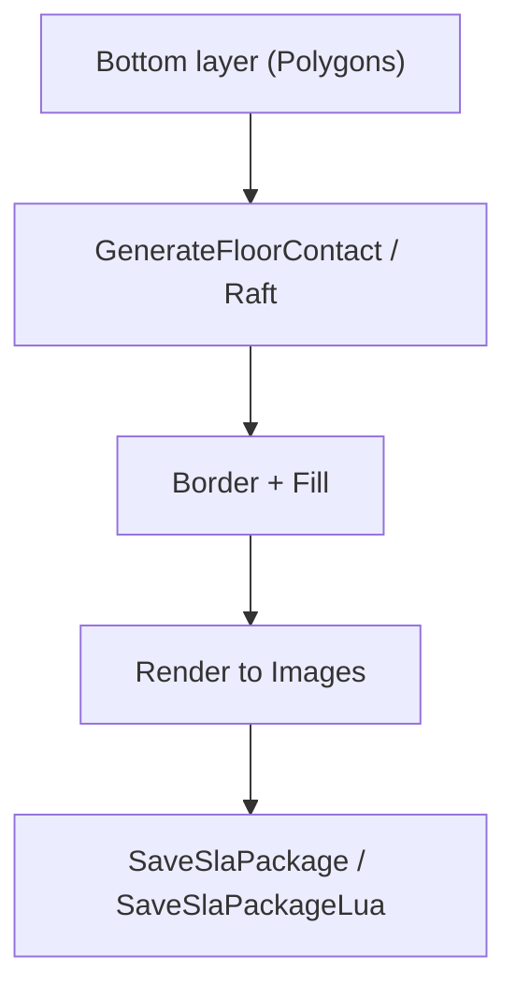
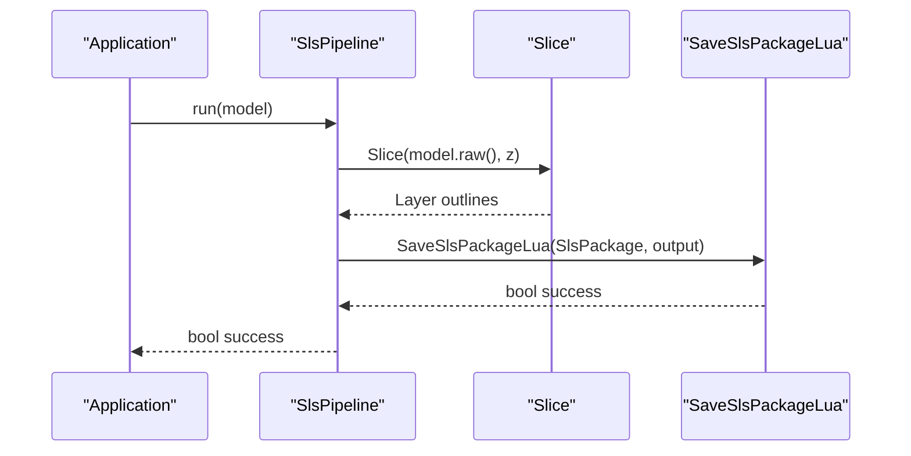
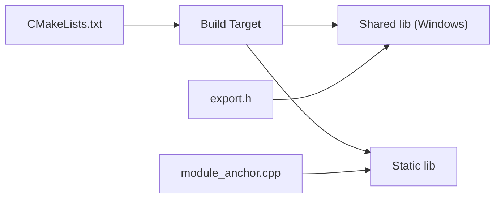
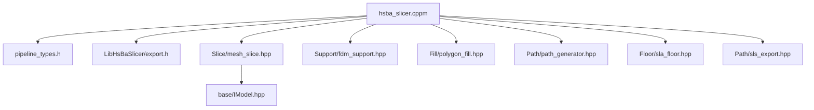

# Pipeline Types Abstraction

<cite>
**Referenced Files in This Document**
- [pipeline_types.h](file://pipelinetypes/pipeline_types.h)
- [hsba_slicer.cppm](file://ModuleHsBaSlicer/hsba_slicer.cppm)
- [module_anchor.cpp](file://ModuleHsBaSlicer/module_anchor.cpp)
- [export.h](file://LibHsBaSlicer/export.h)
- [CMakeLists.txt](file://LibHsBaSlicer/CMakeLists.txt)
- [IModel.hpp](file://base/IModel.hpp)
- [fdm_support.hpp](file://LibHsBaSlicer/Support/fdm_support.hpp)
- [polygon_fill.hpp](file://LibHsBaSlicer/Fill/polygon_fill.hpp)
- [path_generator.hpp](file://LibHsBaSlicer/Path/path_generator.hpp)
- [sla_floor.hpp](file://LibHsBaSlicer/Floor/sla_floor.hpp)
- [sls_export.hpp](file://LibHsBaSlicer/Path/sls_export.hpp)
- [mesh_slice.hpp](file://LibHsBaSlicer/Slice/mesh_slice.hpp)
</cite>

## Table of Contents
1. Introduction
2. Project Structure
3. Core Components
4. Architecture Overview
5. Detailed Component Analysis
6. Dependency Analysis
7. Performance Considerations
8. Troubleshooting Guide
9. Conclusion

## Introduction
This document explains the pipeline types abstraction used across HsBaSlicer and how it is exposed through a modern C++20 module wrapper. The design provides:
- A stable, C-compatible set of configuration and result structures for FDM, SLA, and SLS pipelines.
- A high-level C++ API that wraps LibHsBaSlicer free functions with RAII classes, exceptions, and ergonomic methods.
- Clear separation between portable type definitions (no DLL dependency) and implementation details behind a shared/static library boundary.

The goal is to make it easy to configure and run slicing pipelines while keeping extension points (Lua scripts) available for customization.

## Project Structure
At the heart of the abstraction are:
- Standalone C-compatible types for all pipeline configurations and results.
- A C++20 module that exports class-based APIs over these types and delegates to LibHsBaSlicer.
- LibHsBaSlicer providing the actual algorithms for slicing, support generation, fill, path generation, floor/raft, and export.

**Diagram sources**
- [pipeline_types.h:1-400](file://pipelinetypes/pipeline_types.h#L1-L400)
- [hsba_slicer.cppm:1-642](file://ModuleHsBaSlicer/hsba_slicer.cppm#L1-L642)
- [module_anchor.cpp:1-13](file://ModuleHsBaSlicer/module_anchor.cpp#L1-L13)
- [export.h:1-15](file://LibHsBaSlicer/export.h#L1-L15)
- [CMakeLists.txt:1-78](file://LibHsBaSlicer/CMakeLists.txt#L1-L78)
- [mesh_slice.hpp:1-41](file://LibHsBaSlicer/Slice/mesh_slice.hpp#L1-L41)
- [fdm_support.hpp:1-68](file://LibHsBaSlicer/Support/fdm_support.hpp#L1-L68)
- [polygon_fill.hpp:1-54](file://LibHsBaSlicer/Fill/polygon_fill.hpp#L1-L54)
- [path_generator.hpp:1-62](file://LibHsBaSlicer/Path/path_generator.hpp#L1-L62)
- [sla_floor.hpp:1-183](file://LibHsBaSlicer/Floor/sla_floor.hpp#L1-L183)
- [sls_export.hpp:1-52](file://LibHsBaSlicer/Path/sls_export.hpp#L1-L52)
- [IModel.hpp:1-148](file://base/IModel.hpp#L1-L148)

**Section sources**
- [pipeline_types.h:1-400](file://pipelinetypes/pipeline_types.h#L1-L400)
- [hsba_slicer.cppm:1-642](file://ModuleHsBaSlicer/hsba_slicer.cppm#L1-L642)
- [module_anchor.cpp:1-13](file://ModuleHsBaSlicer/module_anchor.cpp#L1-L13)
- [CMakeLists.txt:1-78](file://LibHsBaSlicer/CMakeLists.txt#L1-L78)

## Core Components
- C-compatible pipeline types:
  - Enums and structs for FDM, SLA, and SLS configuration and results.
  - Inline default initializers for each pipeline config.
- C++20 module wrapper:
  - Exception-based error handling.
  - RAII Model handle.
  - Pipeline classes: FdmPipeline, SlaPipeline, SlsPipeline.
  - Lua customization helpers.
  - Utility conversions between integer and double polygon types.

Key responsibilities:
- Types layer: Portable, no DLL dependency; safe for cross-module usage.
- Module layer: Idiomatic C++ API, encapsulates complexity, forwards to LibHsBaSlicer.
- Library layer: Algorithms and I/O, optionally exported via shared library on Windows.

**Section sources**
- [pipeline_types.h:19-393](file://pipelinetypes/pipeline_types.h#L19-L393)
- [hsba_slicer.cppm:60-276](file://ModuleHsBaSlicer/hsba_slicer.cppm#L60-L276)

## Architecture Overview
The architecture separates concerns into three layers:
- Types: Stable ABI-friendly definitions.
- Module: High-level C++ API using RAII and exceptions.
- Library: Implementation of slicing, support, fill, path, floor, and export.

**Diagram sources**
- [hsba_slicer.cppm:114-237](file://ModuleHsBaSlicer/hsba_slicer.cppm#L114-L237)
- [fdm_support.hpp:1-68](file://LibHsBaSlicer/Support/fdm_support.hpp#L1-L68)
- [path_generator.hpp:1-62](file://LibHsBaSlicer/Path/path_generator.hpp#L1-L62)
- [sla_floor.hpp:1-183](file://LibHsBaSlicer/Floor/sla_floor.hpp#L1-L183)
- [sls_export.hpp:1-52](file://LibHsBaSlicer/Path/sls_export.hpp#L1-L52)
- [IModel.hpp:108-136](file://base/IModel.hpp#L108-L136)

## Detailed Component Analysis

### C-Compatible Pipeline Types
- FDM:
  - Configuration includes model info, slice settings, fill options, support parameters, path/printing parameters, Lua hooks, and output path.
  - Result contains success flag, total layers, G-code content, error message, and elapsed time.
- SLA:
  - Configuration covers exposure, lift/retract, floor/raft, support, Lua hooks, image format/size, and output zip path.
  - Result contains success flag, total layers, export path, error message, and elapsed time.
- SLS:
  - Configuration includes slice settings, laser/hatch parameters, required Lua export script, and optional output path.
  - Result contains success flag, total layers, export path, error message, and elapsed time.
- Default initializers:
  - Inline functions provide sensible defaults for each pipeline config without requiring dynamic linking.

**Diagram sources**
- [pipeline_types.h:19-393](file://pipelinetypes/pipeline_types.h#L19-L393)

**Section sources**
- [pipeline_types.h:19-393](file://pipelinetypes/pipeline_types.h#L19-L393)

### C++20 Module Wrapper: hsba.slicer
- Exception base:
  - SlicerError extends runtime_error for uniform error propagation.
- Type aliases:
  - Re-exports Clipper2 types and pipeline_types enums/structs for convenience.
- Model:
  - RAII wrapper around model pool operations; exposes transforms, slicing, and raw access.
- FdmPipeline:
  - Full run orchestrates slicing, support, fill, and path generation.
  - Step methods allow partial execution and inspection.
- SlaPipeline:
  - Full run orchestrates slicing, support, floor/raft, rendering, and packaging.
  - Helpers for floor generation, rendering, and saving packages.
- SlsPipeline:
  - Requires Lua export script; slices and builds package for Lua-driven export.
- Lua helpers:
  - Convenience wrappers for custom fill, floor, and support via Lua.
- Utilities:
  - Conversion between integer and double polygon types.

**Diagram sources**
- [hsba_slicer.cppm:297-465](file://ModuleHsBaSlicer/hsba_slicer.cppm#L297-L465)
- [mesh_slice.hpp:1-41](file://LibHsBaSlicer/Slice/mesh_slice.hpp#L1-L41)
- [fdm_support.hpp:1-68](file://LibHsBaSlicer/Support/fdm_support.hpp#L1-L68)
- [polygon_fill.hpp:1-54](file://LibHsBaSlicer/Fill/polygon_fill.hpp#L1-L54)
- [path_generator.hpp:1-62](file://LibHsBaSlicer/Path/path_generator.hpp#L1-L62)

**Section sources**
- [hsba_slicer.cppm:60-276](file://ModuleHsBaSlicer/hsba_slicer.cppm#L60-L276)
- [hsba_slicer.cppm:282-642](file://ModuleHsBaSlicer/hsba_slicer.cppm#L282-L642)

### SLA Pipeline Details
- Floor/raft generation:
  - Computes contact area, border loops, and internal fill based on bottom layer.
  - Supports Lua customization for advanced floor patterns.
- Rendering:
  - Converts polygons to images with configurable dimensions and formats.
- Packaging:
  - Saves layer images, floor/support images, and config into a zip archive.
  - Supports Lua-driven export logic.

**Diagram sources**
- [sla_floor.hpp:41-183](file://LibHsBaSlicer/Floor/sla_floor.hpp#L41-L183)
- [hsba_slicer.cppm:471-570](file://ModuleHsBaSlicer/hsba_slicer.cppm#L471-L570)

**Section sources**
- [sla_floor.hpp:1-183](file://LibHsBaSlicer/Floor/sla_floor.hpp#L1-L183)
- [hsba_slicer.cppm:471-570](file://ModuleHsBaSlicer/hsba_slicer.cppm#L471-L570)

### SLS Pipeline Details
- SLS has no standard output; export is fully driven by a Lua script.
- The pipeline slices layers and constructs an SlsPackage for the Lua exporter.

**Diagram sources**
- [sls_export.hpp:1-52](file://LibHsBaSlicer/Path/sls_export.hpp#L1-L52)
- [hsba_slicer.cppm:576-601](file://ModuleHsBaSlicer/hsba_slicer.cppm#L576-L601)
- [mesh_slice.hpp:1-41](file://LibHsBaSlicer/Slice/mesh_slice.hpp#L1-L41)

**Section sources**
- [sls_export.hpp:1-52](file://LibHsBaSlicer/Path/sls_export.hpp#L1-L52)
- [hsba_slicer.cppm:576-601](file://ModuleHsBaSlicer/hsba_slicer.cppm#L576-L601)

### Build and Linking Notes
- LibHsBaSlicer can be built as static or shared library.
- On Windows, export macros control symbol visibility when building shared libraries.
- The module anchor ensures the static library archive is produced even if only module files are present.

**Diagram sources**
- [CMakeLists.txt:1-78](file://LibHsBaSlicer/CMakeLists.txt#L1-L78)
- [export.h:1-15](file://LibHsBaSlicer/export.h#L1-L15)
- [module_anchor.cpp:1-13](file://ModuleHsBaSlicer/module_anchor.cpp#L1-L13)

**Section sources**
- [CMakeLists.txt:1-78](file://LibHsBaSlicer/CMakeLists.txt#L1-L78)
- [export.h:1-15](file://LibHsBaSlicer/export.h#L1-L15)
- [module_anchor.cpp:1-13](file://ModuleHsBaSlicer/module_anchor.cpp#L1-L13)

## Dependency Analysis
- Module depends on:
  - Types header for configs/results.
  - LibHsBaSlicer headers for slicing, support, fill, path, floor, and export.
  - Base interfaces like IModel.
- LibHsBaSlicer links against core components (2D, mesh, paths, support, utils, preprocess, version).
- No circular dependencies observed between module and library; module consumes library APIs.

**Diagram sources**
- [hsba_slicer.cppm:37-56](file://ModuleHsBaSlicer/hsba_slicer.cppm#L37-L56)
- [pipeline_types.h:1-400](file://pipelinetypes/pipeline_types.h#L1-L400)
- [export.h:1-15](file://LibHsBaSlicer/export.h#L1-L15)
- [mesh_slice.hpp:1-41](file://LibHsBaSlicer/Slice/mesh_slice.hpp#L1-L41)
- [fdm_support.hpp:1-68](file://LibHsBaSlicer/Support/fdm_support.hpp#L1-L68)
- [polygon_fill.hpp:1-54](file://LibHsBaSlicer/Fill/polygon_fill.hpp#L1-L54)
- [path_generator.hpp:1-62](file://LibHsBaSlicer/Path/path_generator.hpp#L1-L62)
- [sla_floor.hpp:1-183](file://LibHsBaSlicer/Floor/sla_floor.hpp#L1-L183)
- [sls_export.hpp:1-52](file://LibHsBaSlicer/Path/sls_export.hpp#L1-L52)
- [IModel.hpp:1-148](file://base/IModel.hpp#L1-L148)

**Section sources**
- [hsba_slicer.cppm:37-56](file://ModuleHsBaSlicer/hsba_slicer.cppm#L37-L56)
- [CMakeLists.txt:49-68](file://LibHsBaSlicer/CMakeLists.txt#L49-L68)

## Performance Considerations
- Prefer double-precision polygons for support generation and avoid repeated conversions.
- Use first-layer height explicitly to reduce re-slicing overhead.
- Disable unnecessary steps (e.g., support or floor) when not needed.
- For large models, consider batching or parallelization at the application level where appropriate.
- Choose appropriate image resolution for SLA to balance quality and memory usage.

[No sources needed since this section provides general guidance]

## Troubleshooting Guide
- Missing Lua export script for SLS:
  - Ensure export_lua_script is provided; otherwise, the pipeline throws an error.
- Invalid model path or unsupported format:
  - Verify file existence and supported formats; check exception messages from Model construction.
- Incorrect image size or unsupported format:
  - Confirm width/height and extension (.png, .jpg, .svg) for SLA rendering.
- Memory management for C results:
  - When using C-compatible results directly, call the corresponding free functions to release memory.

**Section sources**
- [hsba_slicer.cppm:576-601](file://ModuleHsBaSlicer/hsba_slicer.cppm#L576-L601)
- [pipeline_types.h:92-117](file://pipelinetypes/pipeline_types.h#L92-L117)

## Conclusion
The pipeline types abstraction cleanly separates portable configuration/result definitions from implementation details, while the C++20 module wrapper delivers a modern, exception-based API. This design enables straightforward integration, extensibility via Lua, and clear lifecycle management through RAII. It balances usability with performance and maintainability across FDM, SLA, and SLS workflows.