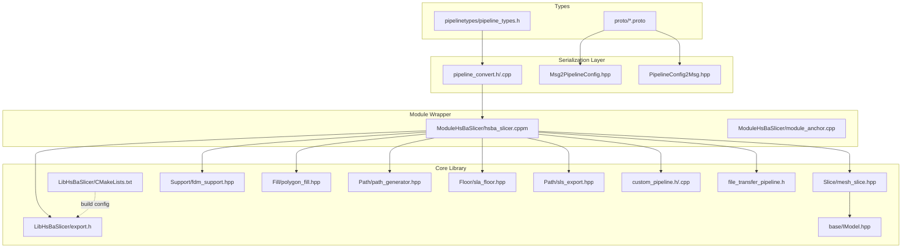
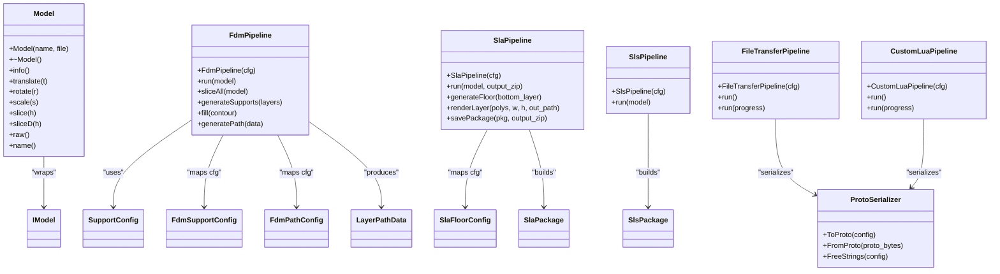
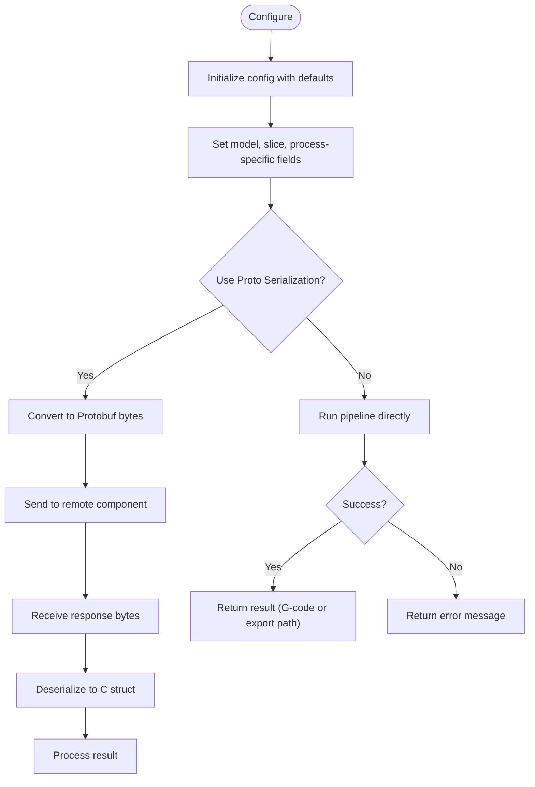
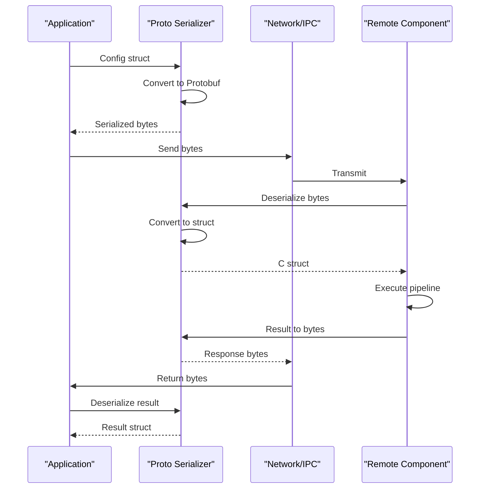
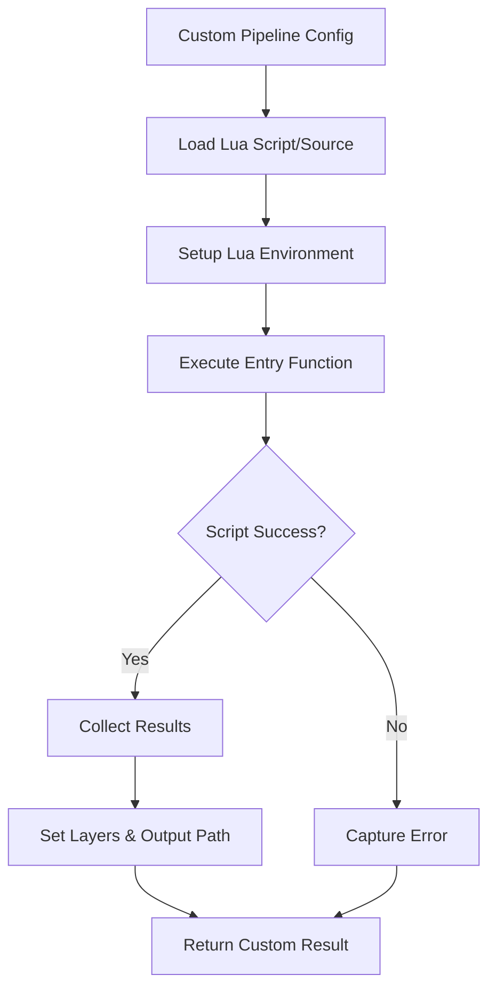
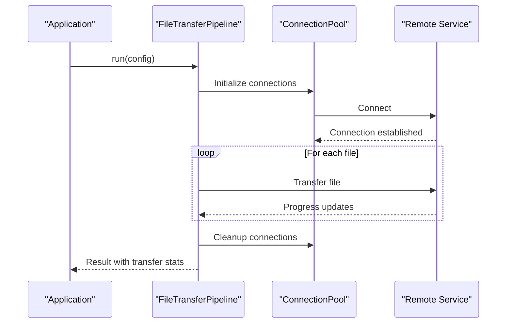
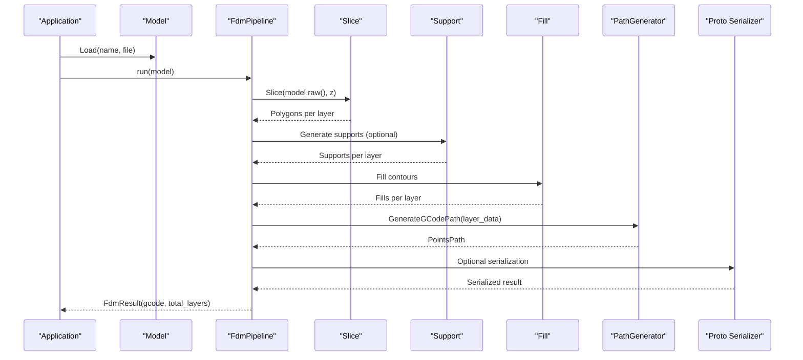
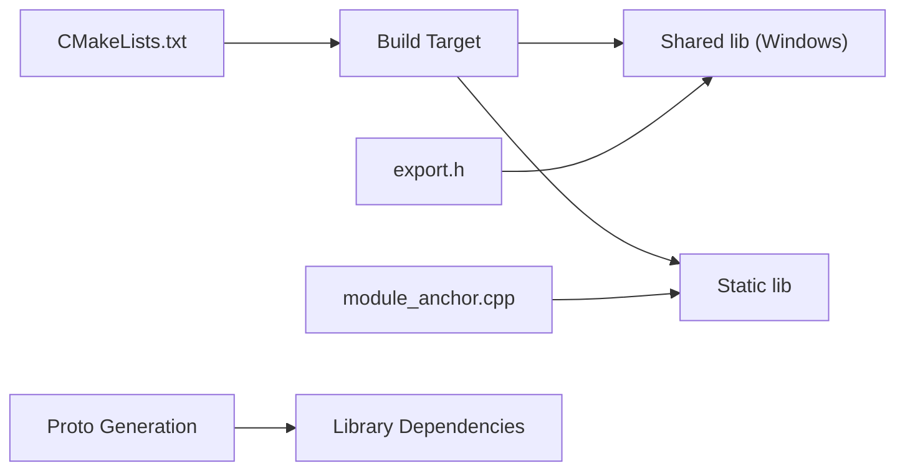
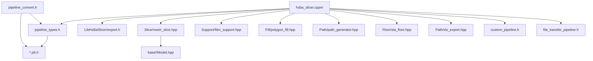

# Pipeline Types Abstraction

<cite>
**Referenced Files in This Document**
- [pipeline_types.h](file://pipelinetypes/pipeline_types.h)
- [hsba_slicer.cppm](file://ModuleHsBaSlicer/hsba_slicer.cppm)
- [module_anchor.cpp](file://ModuleHsBaSlicer/module_anchor.cpp)
- [export.h](file://LibHsBaSlicer/export.h)
- [CMakeLists.txt](file://LibHsBaSlicer/CMakeLists.txt)
- [IModel.hpp](file://base/IModel.hpp)
- [fdm_support.hpp](file://LibHsBaSlicer/Support/fdm_support.hpp)
- [polygon_fill.hpp](file://LibHsBaSlicer/Fill/polygon_fill.hpp)
- [path_generator.hpp](file://LibHsBaSlicer/Path/path_generator.hpp)
- [sla_floor.hpp](file://LibHsBaSlicer/Floor/sla_floor.hpp)
- [sls_export.hpp](file://LibHsBaSlicer/Path/sls_export.hpp)
- [custom_pipeline.h](file://DllHsBaSlicer/custom_pipeline.h)
- [custom_pipeline.cpp](file://DllHsBaSlicer/custom_pipeline.cpp)
- [file_transfer_pipeline.h](file://DllHsBaSlicer/file_transfer_pipeline.h)
- [pipeline_convert.h](file://DllHsBaSlicer/pipeline_convert.h)
- [pipeline_convert.cpp](file://DllHsBaSlicer/pipeline_convert.cpp)
- [Msg2PipelineConfig.hpp](file://convert/Msg2PipelineConfig.hpp)
- [PipelineConfig2Msg.hpp](file://convert/PipelineConfig2Msg.hpp)
- [custom_pipeline.proto](file://proto/custom_pipeline.proto)
</cite>

## Update Summary
**Changes Made**
- Added comprehensive support for Custom Lua Pipeline types with full configuration and result structures
- Integrated Proto buffer serialization for all pipeline types including custom pipelines
- Enhanced cross-process and cross-language communication capabilities
- Added File Transfer Pipeline support for remote file operations
- Updated architecture diagrams to reflect new pipeline types and serialization layers

## Table of Contents
1. Introduction
2. Project Structure
3. Core Components
4. Architecture Overview
5. Detailed Component Analysis
6. Dependency Analysis
7. Performance Considerations
8. Troubleshooting Guide
9. Conclusion

## Introduction
This document explains the pipeline types abstraction used across HsBaSlicer and how it is exposed through a modern C++20 module wrapper. The design provides:
- A stable, C-compatible set of configuration and result structures for FDM, SLA, SLS, File Transfer, and Custom Lua pipelines.
- Comprehensive Proto buffer serialization for cross-process and cross-language communication between components.
- A high-level C++ API that wraps LibHsBaSlicer free functions with RAII classes, exceptions, and ergonomic methods.
- Clear separation between portable type definitions (no DLL dependency) and implementation details behind a shared/static library boundary.

The goal is to make it easy to configure and run slicing pipelines while keeping extension points (Lua scripts) available for customization and enabling seamless integration across different processes and programming languages.

## Project Structure
At the heart of the abstraction are:
- Standalone C-compatible types for all pipeline configurations and results, including the new Custom Lua and File Transfer pipelines.
- Proto buffer definitions for serialization between components.
- A C++20 module that exports class-based APIs over these types and delegates to LibHsBaSlicer.
- LibHsBaSlicer providing the actual algorithms for slicing, support generation, fill, path generation, floor/raft, export, and file transfer operations.

```mermaid
graph TB
subgraph "Types"
PT["pipelinetypes/pipeline_types.h"]
PROTO["proto/*.proto"]
end
subgraph "Serialization Layer"
CONVERT["pipeline_convert.h/.cpp"]
MSG2CFG["Msg2PipelineConfig.hpp"]
CFG2MSG["PipelineConfig2Msg.hpp"]
end
subgraph "Module Wrapper"
MIF["ModuleHsBaSlicer/hsba_slicer.cppm"]
MAN["ModuleHsBaSlicer/module_anchor.cpp"]
end
subgraph "Core Library"
LEXP["LibHsBaSlicer/export.h"]
CMK["LibHsBaSlicer/CMakeLists.txt"]
SLICE["Slice/mesh_slice.hpp"]
SUPPORT["Support/fdm_support.hpp"]
FILL["Fill/polygon_fill.hpp"]
PATH["Path/path_generator.hpp"]
FLOOR["Floor/sla_floor.hpp"]
SLS["Path/sls_export.hpp"]
IMODEL["base/IModel.hpp"]
CUSTOM["custom_pipeline.h/.cpp"]
FILEXFER["file_transfer_pipeline.h"]
end
PT --> CONVERT
PROTO --> MSG2CFG
PROTO --> CFG2MSG
CONVERT --> MIF
MIF --> LEXP
MIF --> SLICE
MIF --> SUPPORT
MIF --> FILL
MIF --> PATH
MIF --> FLOOR
MIF --> SLS
MIF --> CUSTOM
MIF --> FILEXFER
SLICE --> IMODEL
CMK -. build config .-> LEXP
```

**Diagram sources**
- [pipeline_types.h:1-567](file://pipelinetypes/pipeline_types.h#L1-L567)
- [custom_pipeline.proto:1-31](file://proto/custom_pipeline.proto#L1-L31)
- [pipeline_convert.h:1-215](file://DllHsBaSlicer/pipeline_convert.h#L1-L215)
- [Msg2PipelineConfig.hpp:1-70](file://convert/Msg2PipelineConfig.hpp#L1-L70)
- [PipelineConfig2Msg.hpp:1-49](file://convert/PipelineConfig2Msg.hpp#L1-L49)
- [hsba_slicer.cppm:1-642](file://ModuleHsBaSlicer/hsba_slicer.cppm#L1-L642)
- [custom_pipeline.h:1-66](file://DllHsBaSlicer/custom_pipeline.h#L1-L66)
- [file_transfer_pipeline.h:1-63](file://DllHsBaSlicer/file_transfer_pipeline.h#L1-L63)

**Section sources**
- [pipeline_types.h:1-567](file://pipelinetypes/pipeline_types.h#L1-L567)
- [custom_pipeline.proto:1-31](file://proto/custom_pipeline.proto#L1-L31)
- [pipeline_convert.h:1-215](file://DllHsBaSlicer/pipeline_convert.h#L1-L215)
- [Msg2PipelineConfig.hpp:1-70](file://convert/Msg2PipelineConfig.hpp#L1-L70)
- [PipelineConfig2Msg.hpp:1-49](file://convert/PipelineConfig2Msg.hpp#L1-L49)

## Core Components
- **Enhanced C-compatible pipeline types**:
  - Enums and structs for FDM, SLA, SLS, File Transfer, and Custom Lua pipeline configurations and results.
  - Inline default initializers for each pipeline config.
  - New Custom Lua pipeline types supporting fully script-driven workflows.
  - File Transfer pipeline types for remote file operations.
- **Proto buffer serialization layer**:
  - Bidirectional conversion between C structs and Protobuf messages.
  - Support for cross-process and cross-language communication.
  - Memory-safe string handling with automatic cleanup.
- **C++20 module wrapper**:
  - Exception-based error handling.
  - RAII Model handle.
  - Pipeline classes: FdmPipeline, SlaPipeline, SlsPipeline, FileTransferPipeline, CustomLuaPipeline.
  - Lua customization helpers.
  - Utility conversions between integer and double polygon types.

Key responsibilities:
- **Types layer**: Portable, no DLL dependency; safe for cross-module usage.
- **Serialization layer**: Handles Protobuf conversion for inter-component communication.
- **Module layer**: Idiomatic C++ API, encapsulates complexity, forwards to LibHsBaSlicer.
- **Library layer**: Algorithms and I/O, optionally exported via shared library on Windows.

**Section sources**
- [pipeline_types.h:19-567](file://pipelinetypes/pipeline_types.h#L19-L567)
- [pipeline_convert.h:13-215](file://DllHsBaSlicer/pipeline_convert.h#L13-L215)
- [Msg2PipelineConfig.hpp:16-65](file://convert/Msg2PipelineConfig.hpp#L16-L65)
- [PipelineConfig2Msg.hpp:16-44](file://convert/PipelineConfig2Msg.hpp#L16-L44)

## Architecture Overview
The architecture separates concerns into four layers:
- **Types**: Stable ABI-friendly definitions for all pipeline types.
- **Serialization**: Protobuf-based conversion for cross-process communication.
- **Module**: High-level C++ API using RAII and exceptions.
- **Library**: Implementation of slicing, support, fill, path, floor, export, and file transfer.

```mermaid
classDiagram
class Model {
+Model(name, file)
+~Model()
+info()
+translate(t)
+rotate(r)
+scale(s)
+slice(h)
+sliceD(h)
+raw()
+name()
}
class FdmPipeline {
+FdmPipeline(cfg)
+run(model)
+sliceAll(model)
+generateSupports(layers)
+fill(contour)
+generatePath(data)
}
class SlaPipeline {
+SlaPipeline(cfg)
+run(model, output_zip)
+generateFloor(bottom_layer)
+renderLayer(polys, w, h, out_path)
+savePackage(pkg, output_zip)
}
class SlsPipeline {
+SlsPipeline(cfg)
+run(model)
}
class FileTransferPipeline {
+FileTransferPipeline(cfg)
+run()
+run(progress)
}
class CustomLuaPipeline {
+CustomLuaPipeline(cfg)
+run()
+run(progress)
}
class ProtoSerializer {
+ToProto(config)
+FromProto(proto_bytes)
+FreeStrings(config)
}
class SupportConfig
class FdmSupportConfig
class FdmPathConfig
class LayerPathData
class SlaFloorConfig
class SlaPackage
class SlsPackage
FdmPipeline --> SupportConfig : "uses"
FdmPipeline --> FdmSupportConfig : "maps cfg"
FdmPipeline --> FdmPathConfig : "maps cfg"
FdmPipeline --> LayerPathData : "produces"
SlaPipeline --> SlaFloorConfig : "maps cfg"
SlaPipeline --> SlaPackage : "builds"
SlsPipeline --> SlsPackage : "builds"
FileTransferPipeline --> ProtoSerializer : "serializes"
CustomLuaPipeline --> ProtoSerializer : "serializes"
Model --> IModel : "wraps"
```

**Diagram sources**
- [hsba_slicer.cppm:114-237](file://ModuleHsBaSlicer/hsba_slicer.cppm#L114-L237)
- [pipeline_convert.h:20-215](file://DllHsBaSlicer/pipeline_convert.h#L20-L215)
- [custom_pipeline.h:13-66](file://DllHsBaSlicer/custom_pipeline.h#L13-L66)
- [file_transfer_pipeline.h:13-63](file://DllHsBaSlicer/file_transfer_pipeline.h#L13-L63)
- [IModel.hpp:108-136](file://base/IModel.hpp#L108-L136)

## Detailed Component Analysis

### Enhanced C-Compatible Pipeline Types
- **FDM**:
  - Configuration includes model info, slice settings, fill options, support parameters, path/printing parameters, Lua hooks, and output path.
  - Result contains success flag, total layers, G-code content, error message, and elapsed time.
- **SLA**:
  - Configuration covers exposure, lift/retract, floor/raft, support, Lua hooks, image format/size, and output zip path.
  - Result contains success flag, total layers, export path, error message, and elapsed time.
- **SLS**:
  - Configuration includes slice settings, laser/hatch parameters, required Lua export script, and optional output path.
  - Result contains success flag, total layers, export path, error message, and elapsed time.
- **File Transfer**:
  - Configuration supports remote host/port connection, connection pool sizing, and multiple file transfers.
  - Result tracks files transferred vs total files with progress reporting.
- **Custom Lua Pipeline**:
  - Fully script-driven workflow with flexible configuration via JSON.
  - Supports both external script files and inline Lua source code.
  - Provides rich Lua environment with access to all pipeline building blocks.
  - Result includes script return value, layer count, and output path from Lua execution.
- **Default initializers**:
  - Inline functions provide sensible defaults for each pipeline config without requiring dynamic linking.

```mermaid
flowchart TD
Start(["Configure"]) --> InitCfg["Initialize config with defaults"]
InitCfg --> SetFields["Set model, slice, process-specific fields"]
SetFields --> Serialize{"Use Proto Serialization?"}
Serialize --> |Yes| ToProto["Convert to Protobuf bytes"]
Serialize --> |No| Run["Run pipeline directly"]
ToProto --> Send["Send to remote component"]
Send --> Receive["Receive response bytes"]
Receive --> FromProto["Deserialize to C struct"]
FromProto --> Process["Process result"]
Run --> Success{"Success?"}
Success --> |Yes| Output["Return result (G-code or export path)"]
Success --> |No| Error["Return error message"]
```

**Diagram sources**
- [pipeline_types.h:19-567](file://pipelinetypes/pipeline_types.h#L19-L567)
- [pipeline_convert.h:20-215](file://DllHsBaSlicer/pipeline_convert.h#L20-L215)

**Section sources**
- [pipeline_types.h:19-567](file://pipelinetypes/pipeline_types.h#L19-L567)

### Proto Buffer Serialization Layer
The serialization layer provides bidirectional conversion between C structs and Protobuf messages:

- **Message Definitions**:
  - `custom_pipe_config`: Lightweight configuration for fully Lua-driven pipelines.
  - `custom_pipe_result`: Results from Lua pipeline execution.
  - Standard messages for FDM, SLA, SLS, and File Transfer pipelines.
- **Conversion Functions**:
  - `MsgToCustomConfig` / `CustomConfigToMsg`: Convert between C structs and Protobuf messages.
  - Memory management with automatic string allocation and cleanup.
  - Safe handling of optional fields and empty values.
- **Cross-Process Communication**:
  - Wire format compatible with any language supporting Protobuf.
  - Efficient binary serialization for network transmission.
  - Backward compatibility considerations for version evolution.

```mermaid
sequenceDiagram
participant App as "Application"
participant Serializer as "Proto Serializer"
participant Network as "Network/IPC"
participant Remote as "Remote Component"
App->>Serializer : Config struct
Serializer->>Serializer : Convert to Protobuf
Serializer-->>App : Serialized bytes
App->>Network : Send bytes
Network->>Remote : Transmit
Remote->>Serializer : Deserialize bytes
Serializer->>Serializer : Convert to struct
Serializer-->>Remote : C struct
Remote->>Remote : Execute pipeline
Remote->>Serializer : Result to bytes
Serializer-->>Network : Response bytes
Network->>App : Return bytes
App->>Serializer : Deserialize result
Serializer-->>App : Result struct
```

**Diagram sources**
- [pipeline_convert.h:20-215](file://DllHsBaSlicer/pipeline_convert.h#L20-L215)
- [custom_pipeline.proto:9-30](file://proto/custom_pipeline.proto#L9-L30)
- [Msg2PipelineConfig.hpp:56-65](file://convert/Msg2PipelineConfig.hpp#L56-L65)
- [PipelineConfig2Msg.hpp:40-44](file://convert/PipelineConfig2Msg.hpp#L40-L44)

**Section sources**
- [pipeline_convert.h:13-215](file://DllHsBaSlicer/pipeline_convert.h#L13-L215)
- [custom_pipeline.proto:1-31](file://proto/custom_pipeline.proto#L1-L31)
- [Msg2PipelineConfig.hpp:56-65](file://convert/Msg2PipelineConfig.hpp#L56-L65)
- [PipelineConfig2Msg.hpp:40-44](file://convert/PipelineConfig2Msg.hpp#L40-L44)

### Custom Lua Pipeline Details
The Custom Lua Pipeline provides maximum flexibility for complex workflows:

- **Configuration**:
  - `pipeline_lua_script`: Path to external Lua script file.
  - `pipeline_lua_source`: Inline Lua source code executed before script loading.
  - `entry_func`: Name of entry function (default: "run_pipeline").
  - `config_json`: Free-form JSON passed to Lua as `pipeline_config`.
  - Model and output path information passed to Lua environment.
- **Execution Environment**:
  - Full access to pipeline building blocks through global `HsBa` table.
  - Model loading, slicing, support generation, fill algorithms.
  - Floor/raft generation, G-code path output, SLA/SLS packaging.
  - Progress reporting and error handling.
- **Result Handling**:
  - Script sets layer count via `HsBa.setLayers()`.
  - Output path reported by script via `HsBa.setOutputPath()`.
  - String return value from entry function captured in result.
  - Error messages propagated from Lua execution.

```mermaid
flowchart TD
A["Custom Pipeline Config"] --> B["Load Lua Script/Source"]
B --> C["Setup Lua Environment"]
C --> D["Execute Entry Function"]
D --> E{"Script Success?"}
E --> |Yes| F["Collect Results"]
E --> |No| G["Capture Error"]
F --> H["Set Layers & Output Path"]
H --> I["Return Custom Result"]
G --> I
```

**Diagram sources**
- [custom_pipeline.cpp:112-154](file://DllHsBaSlicer/custom_pipeline.cpp#L112-L154)
- [custom_pipeline.h:20-36](file://DllHsBaSlicer/custom_pipeline.h#L20-L36)

**Section sources**
- [custom_pipeline.h:13-66](file://DllHsBaSlicer/custom_pipeline.h#L13-L66)
- [custom_pipeline.cpp:112-154](file://DllHsBaSlicer/custom_pipeline.cpp#L112-L154)
- [pipeline_types.h:358-415](file://pipelinetypes/pipeline_types.h#L358-L415)

### File Transfer Pipeline Details
The File Transfer Pipeline enables remote file operations:

- **Connection Management**:
  - Configurable host and port for remote service.
  - Connection pool sizing for concurrent transfers.
  - Automatic connection lifecycle management.
- **File Operations**:
  - Support for multiple file transfers in single operation.
  - Progress reporting during transfer operations.
  - Error handling and retry mechanisms.
- **Integration**:
  - Compatible with existing pipeline infrastructure.
  - Async and sync execution modes.
  - Progress callbacks for monitoring.

```mermaid
sequenceDiagram
participant App as "Application"
participant FTP as "FileTransferPipeline"
participant Pool as "ConnectionPool"
participant Remote as "Remote Service"
App->>FTP : run(config)
FTP->>Pool : Initialize connections
Pool->>Remote : Connect
Remote-->>Pool : Connection established
loop For each file
FTP->>Remote : Transfer file
Remote-->>FTP : Progress updates
end
FTP->>Pool : Cleanup connections
FTP-->>App : Result with transfer stats
```

**Diagram sources**
- [file_transfer_pipeline.h:19-47](file://DllHsBaSlicer/file_transfer_pipeline.h#L19-L47)
- [pipeline_types.h:313-356](file://pipelinetypes/pipeline_types.h#L313-L356)

**Section sources**
- [file_transfer_pipeline.h:13-63](file://DllHsBaSlicer/file_transfer_pipeline.h#L13-L63)
- [pipeline_types.h:313-356](file://pipelinetypes/pipeline_types.h#L313-L356)

### C++20 Module Wrapper: hsba.slicer
- **Exception base**:
  - SlicerError extends runtime_error for uniform error propagation.
- **Type aliases**:
  - Re-exports Clipper2 types and pipeline_types enums/structs for convenience.
- **Model**:
  - RAII wrapper around model pool operations; exposes transforms, slicing, and raw access.
- **Enhanced Pipeline Classes**:
  - FdmPipeline: Full run orchestrates slicing, support, fill, and path generation.
  - SlaPipeline: Full run orchestrates slicing, support, floor/raft, rendering, and packaging.
  - SlsPipeline: Requires Lua export script; slices and builds package for Lua-driven export.
  - FileTransferPipeline: Manages remote file transfer operations.
  - CustomLuaPipeline: Executes fully Lua-driven workflows.
- **Lua helpers**:
  - Convenience wrappers for custom fill, floor, and support via Lua.
- **Utilities**:
  - Conversion between integer and double polygon types.

```mermaid
sequenceDiagram
participant App as "Application"
participant Mod as "Model"
participant Fdmp as "FdmPipeline"
participant Slice as "Slice"
participant Sup as "Support"
participant Fill as "Fill"
participant Path as "PathGenerator"
participant Proto as "Proto Serializer"
App->>Mod : Load(name, file)
App->>Fdmp : run(model)
Fdmp->>Slice : Slice(model.raw(), z)
Slice-->>Fdmp : Polygons per layer
Fdmp->>Sup : Generate supports (optional)
Sup-->>Fdmp : Supports per layer
Fdmp->>Fill : Fill contours
Fill-->>Fdmp : Fills per layer
Fdmp->>Path : GenerateGCodePath(layer_data)
Path-->>Fdmp : PointsPath
Fdmp->>Proto : Optional serialization
Proto-->>Fdmp : Serialized result
Fdmp-->>App : FdmResult(gcode, total_layers)
```

**Diagram sources**
- [hsba_slicer.cppm:297-465](file://ModuleHsBaSlicer/hsba_slicer.cppm#L297-L465)
- [pipeline_convert.h:20-215](file://DllHsBaSlicer/pipeline_convert.h#L20-L215)
- [mesh_slice.hpp:1-41](file://LibHsBaSlicer/Slice/mesh_slice.hpp#L1-L41)
- [fdm_support.hpp:1-68](file://LibHsBaSlicer/Support/fdm_support.hpp#L1-L68)
- [polygon_fill.hpp:1-54](file://LibHsBaSlicer/Fill/polygon_fill.hpp#L1-L54)
- [path_generator.hpp:1-62](file://LibHsBaSlicer/Path/path_generator.hpp#L1-L62)

**Section sources**
- [hsba_slicer.cppm:60-276](file://ModuleHsBaSlicer/hsba_slicer.cppm#L60-L276)
- [hsba_slicer.cppm:282-642](file://ModuleHsBaSlicer/hsba_slicer.cppm#L282-L642)

### Build and Linking Notes
- LibHsBaSlicer can be built as static or shared library.
- On Windows, export macros control symbol visibility when building shared libraries.
- The module anchor ensures the static library archive is produced even if only module files are present.
- Proto buffer dependencies are automatically generated and linked.

```mermaid
graph LR
CMK["CMakeLists.txt"] --> BUILD["Build Target"]
BUILD --> SHARED["Shared lib (Windows)"]
BUILD --> STATIC["Static lib"]
EXPORT["export.h"] --> SHARED
ANCHOR["module_anchor.cpp"] --> STATIC
PROTO_GEN["Proto Generation"] --> LIB["Library Dependencies"]
```

**Diagram sources**
- [CMakeLists.txt:1-78](file://LibHsBaSlicer/CMakeLists.txt#L1-L78)
- [export.h:1-15](file://LibHsBaSlicer/export.h#L1-L15)
- [module_anchor.cpp:1-13](file://ModuleHsBaSlicer/module_anchor.cpp#L1-L13)

**Section sources**
- [CMakeLists.txt:1-78](file://LibHsBaSlicer/CMakeLists.txt#L1-L78)
- [export.h:1-15](file://LibHsBaSlicer/export.h#L1-L15)
- [module_anchor.cpp:1-13](file://ModuleHsBaSlicer/module_anchor.cpp#L1-L13)

## Dependency Analysis
- Module depends on:
  - Types header for configs/results.
  - LibHsBaSlicer headers for slicing, support, fill, path, floor, export, and file transfer.
  - Base interfaces like IModel.
  - Proto buffer generated headers for serialization.
- LibHsBaSlicer links against core components (2D, mesh, paths, support, utils, preprocess, version).
- No circular dependencies observed between module and library; module consumes library APIs.

```mermaid
graph TB
MOD["hsba_slicer.cppm"] --> TYPES["pipeline_types.h"]
MOD --> LIB_EXPORT["LibHsBaSlicer/export.h"]
MOD --> SLICE["Slice/mesh_slice.hpp"]
MOD --> SUPPORT["Support/fdm_support.hpp"]
MOD --> FILL["Fill/polygon_fill.hpp"]
MOD --> PATH["Path/path_generator.hpp"]
MOD --> FLOOR["Floor/sla_floor.hpp"]
MOD --> SLS["Path/sls_export.hpp"]
MOD --> CUSTOM["custom_pipeline.h"]
MOD --> FILEXFER["file_transfer_pipeline.h"]
TYPES --> PROTO["*.pb.h"]
PROTOSER["pipeline_convert.h"] --> PROTO
PROTOSER --> TYPES
SLICE --> IMODEL["base/IModel.hpp"]
```

**Diagram sources**
- [hsba_slicer.cppm:37-56](file://ModuleHsBaSlicer/hsba_slicer.cppm#L37-L56)
- [pipeline_types.h:1-567](file://pipelinetypes/pipeline_types.h#L1-L567)
- [export.h:1-15](file://LibHsBaSlicer/export.h#L1-L15)
- [mesh_slice.hpp:1-41](file://LibHsBaSlicer/Slice/mesh_slice.hpp#L1-L41)
- [fdm_support.hpp:1-68](file://LibHsBaSlicer/Support/fdm_support.hpp#L1-L68)
- [polygon_fill.hpp:1-54](file://LibHsBaSlicer/Fill/polygon_fill.hpp#L1-L54)
- [path_generator.hpp:1-62](file://LibHsBaSlicer/Path/path_generator.hpp#L1-L62)
- [sla_floor.hpp:1-183](file://LibHsBaSlicer/Floor/sla_floor.hpp#L1-L183)
- [sls_export.hpp:1-52](file://LibHsBaSlicer/Path/sls_export.hpp#L1-L52)
- [custom_pipeline.h:1-66](file://DllHsBaSlicer/custom_pipeline.h#L1-L66)
- [file_transfer_pipeline.h:1-63](file://DllHsBaSlicer/file_transfer_pipeline.h#L1-L63)
- [IModel.hpp:1-148](file://base/IModel.hpp#L1-L148)

**Section sources**
- [hsba_slicer.cppm:37-56](file://ModuleHsBaSlicer/hsba_slicer.cppm#L37-L56)
- [CMakeLists.txt:49-68](file://LibHsBaSlicer/CMakeLists.txt#L49-L68)

## Performance Considerations
- Prefer double-precision polygons for support generation and avoid repeated conversions.
- Use first-layer height explicitly to reduce re-slicing overhead.
- Disable unnecessary steps (e.g., support or floor) when not needed.
- For large models, consider batching or parallelization at the application level where appropriate.
- Choose appropriate image resolution for SLA to balance quality and memory usage.
- **New considerations**:
  - Proto buffer serialization adds minimal overhead but enables efficient cross-process communication.
  - Custom Lua pipelines may have higher startup costs due to Lua interpreter initialization.
  - File transfer operations should use appropriate connection pool sizes based on network conditions.
  - Memory management for serialized data requires careful handling of allocated buffers.

## Troubleshooting Guide
- Missing Lua export script for SLS:
  - Ensure export_lua_script is provided; otherwise, the pipeline throws an error.
- Invalid model path or unsupported format:
  - Verify file existence and supported formats; check exception messages from Model construction.
- Incorrect image size or unsupported format:
  - Confirm width/height and extension (.png, .jpg, .svg) for SLA rendering.
- Memory management for C results:
  - When using C-compatible results directly, call the corresponding free functions to release memory.
- **New troubleshooting scenarios**:
  - Custom Lua pipeline errors: Check Lua script syntax and ensure required functions are implemented.
  - Proto serialization failures: Verify field types and sizes match between sender and receiver.
  - File transfer connection issues: Validate host/port connectivity and firewall rules.
  - Memory leaks in custom pipelines: Ensure proper cleanup of Lua resources and string allocations.

**Section sources**
- [hsba_slicer.cppm:576-601](file://ModuleHsBaSlicer/hsba_slicer.cppm#L576-L601)
- [pipeline_types.h:92-117](file://pipelinetypes/pipeline_types.h#L92-L117)
- [custom_pipeline.cpp:120-126](file://DllHsBaSlicer/custom_pipeline.cpp#L120-L126)
- [pipeline_convert.h:13-215](file://DllHsBaSlicer/pipeline_convert.h#L13-L215)

## Conclusion
The enhanced pipeline types abstraction cleanly separates portable configuration/result definitions from implementation details, while the C++20 module wrapper delivers a modern, exception-based API. The addition of comprehensive Proto buffer serialization enables seamless cross-process and cross-language communication, making the system suitable for distributed architectures. The new Custom Lua Pipeline and File Transfer Pipeline types provide maximum flexibility for complex workflows and remote operations. This design enables straightforward integration, extensibility via Lua, and clear lifecycle management through RAII, balancing usability with performance and maintainability across FDM, SLA, SLS, and custom pipeline workflows.