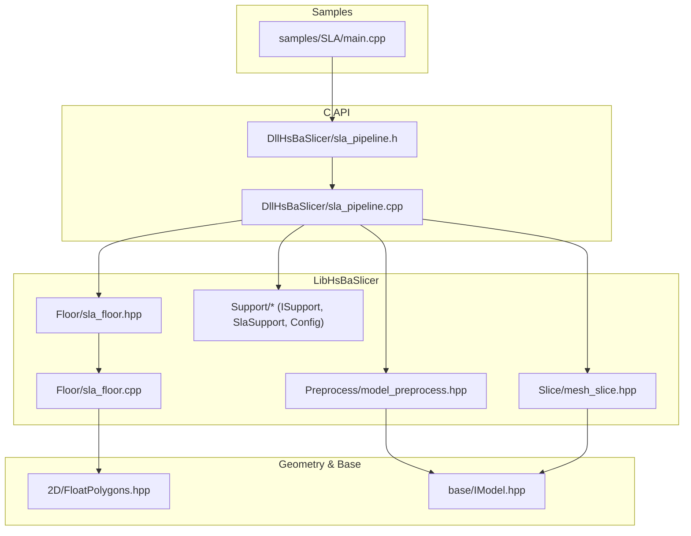
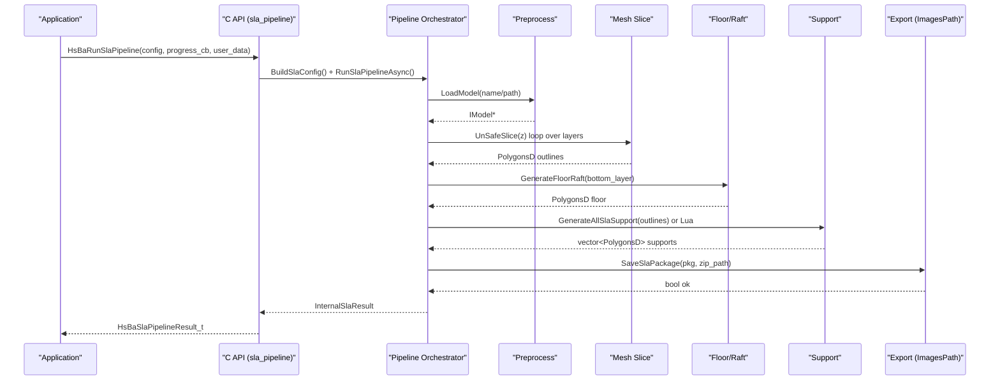
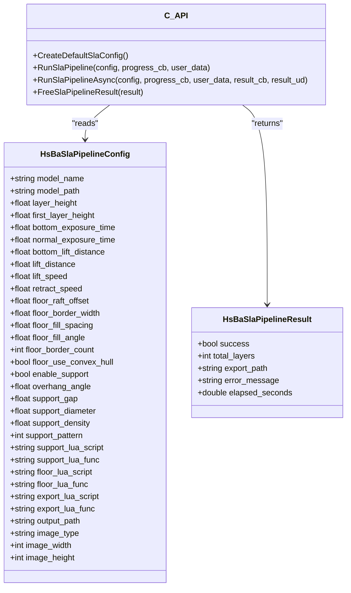
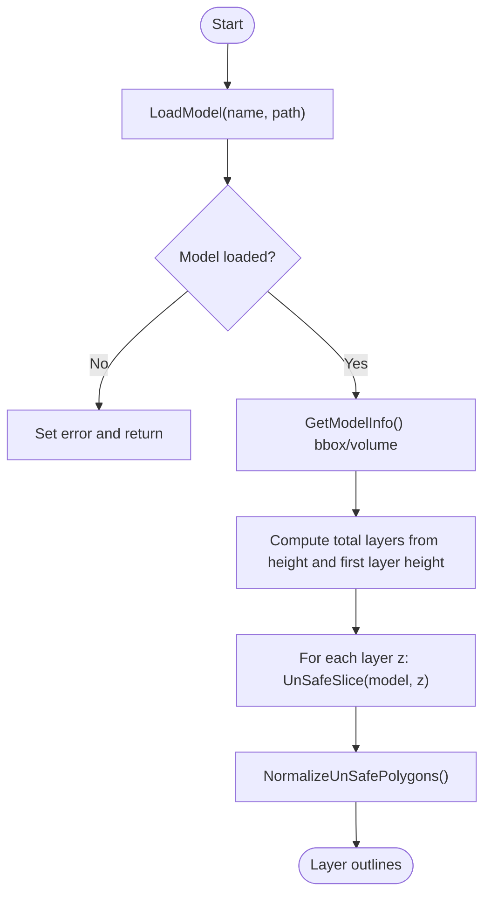
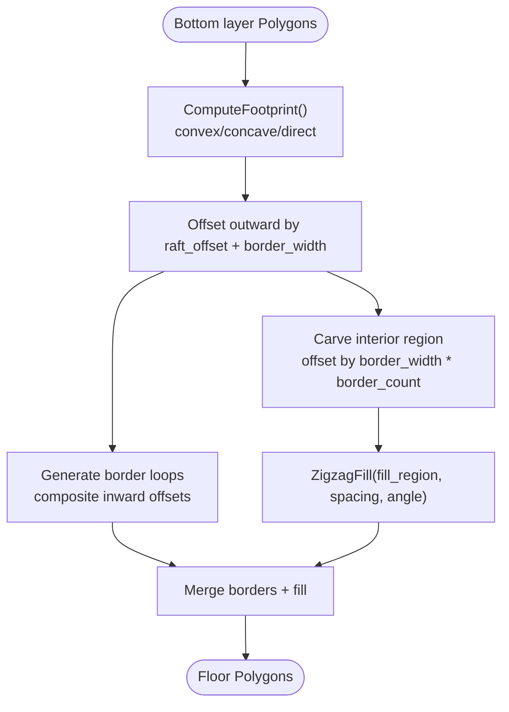
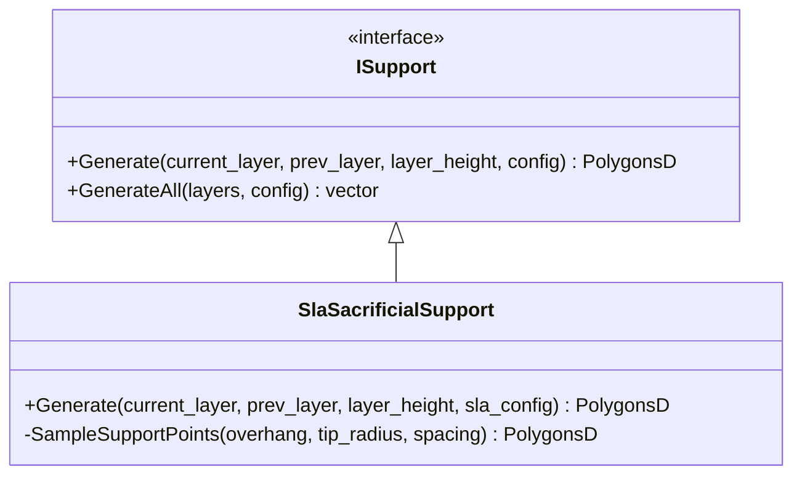
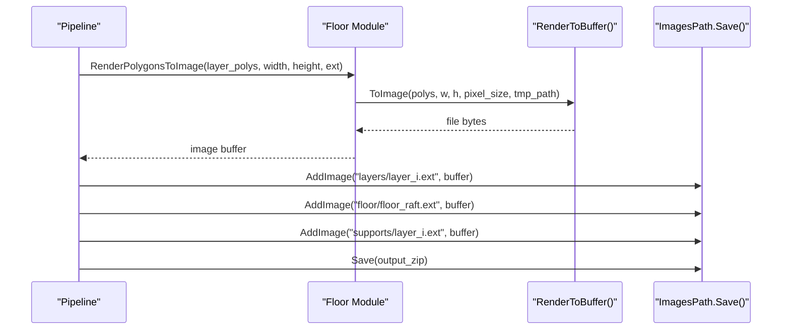
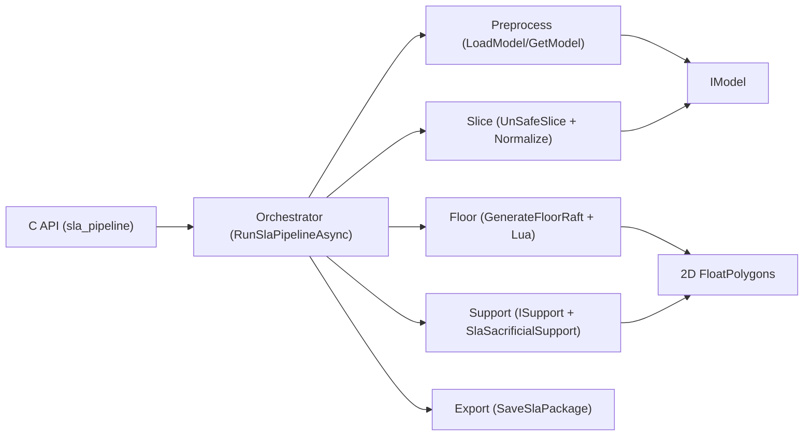

# SLA Slicing Pipeline

<cite>
**Referenced Files in This Document**
- [sla_pipeline.h](file://DllHsBaSlicer/sla_pipeline.h)
- [sla_pipeline.cpp](file://DllHsBaSlicer/sla_pipeline.cpp)
- [sla_floor.hpp](file://LibHsBaSlicer/Floor/sla_floor.hpp)
- [sla_floor.cpp](file://LibHsBaSlicer/Floor/sla_floor.cpp)
- [model_preprocess.hpp](file://LibHsBaSlicer/Preprocess/model_preprocess.hpp)
- [mesh_slice.hpp](file://LibHsBaSlicer/Slice/mesh_slice.hpp)
- [ISupport.hpp](file://support/ISupport.hpp)
- [SlaSupport.hpp](file://support/SlaSupport.hpp)
- [SlaSupport.cpp](file://support/SlaSupport.cpp)
- [SupportConfig.hpp](file://support/SupportConfig.hpp)
- [FloatPolygons.hpp](file://2D/FloatPolygons.hpp)
- [IModel.hpp](file://base/IModel.hpp)
- [main.cpp](file://samples/SLA/main.cpp)
</cite>

## Table of Contents
1. [Introduction](#introduction)
2. [Project Structure](#project-structure)
3. [Core Components](#core-components)
4. [Architecture Overview](#architecture-overview)
5. [Detailed Component Analysis](#detailed-component-analysis)
6. [Dependency Analysis](#dependency-analysis)
7. [Performance Considerations](#performance-considerations)
8. [Troubleshooting Guide](#troubleshooting-guide)
9. [Conclusion](#conclusion)
10. [Appendices](#appendices)

## Introduction
This document explains the SLA Slicing Pipeline, a C/C++ library that converts 3D models into layer images and packaging for resin (SLA/DLP/LCD) printing. The pipeline provides:
- A stable C API for synchronous and asynchronous execution
- Model preprocessing and slicing to 2D contours
- Floor/raft generation with optional Lua customization
- Support generation with built-in or Lua-driven strategies
- Export to a zip archive containing configuration JSON and per-layer images

The design emphasizes modularity, configurability, and extensibility via Lua scripts for floor, support, and export logic.

## Project Structure
At a high level, the SLA pipeline is exposed through a C interface in DllHsBaSlicer and implemented by composing LibHsBaSlicer modules for preprocessing, slicing, floor generation, support generation, and export.

**Diagram sources**
- [sla_pipeline.h:1-160](file://DllHsBaSlicer/sla_pipeline.h#L1-L160)
- [sla_pipeline.cpp:1-509](file://DllHsBaSlicer/sla_pipeline.cpp#L1-L509)
- [model_preprocess.hpp:1-88](file://LibHsBaSlicer/Preprocess/model_preprocess.hpp#L1-L88)
- [mesh_slice.hpp:1-41](file://LibHsBaSlicer/Slice/mesh_slice.hpp#L1-L41)
- [sla_floor.hpp:1-183](file://LibHsBaSlicer/Floor/sla_floor.hpp#L1-L183)
- [sla_floor.cpp:1-465](file://LibHsBaSlicer/Floor/sla_floor.cpp#L1-L465)
- [ISupport.hpp:1-45](file://support/ISupport.hpp#L1-L45)
- [SlaSupport.hpp:1-42](file://support/SlaSupport.hpp#L1-L42)
- [SlaSupport.cpp:1-116](file://support/SlaSupport.cpp#L1-L116)
- [FloatPolygons.hpp:1-267](file://2D/FloatPolygons.hpp#L1-L267)
- [IModel.hpp:1-148](file://base/IModel.hpp#L1-L148)
- [main.cpp:1-271](file://samples/SLA/main.cpp#L1-L271)

**Section sources**
- [sla_pipeline.h:1-160](file://DllHsBaSlicer/sla_pipeline.h#L1-L160)
- [sla_pipeline.cpp:1-509](file://DllHsBaSlicer/sla_pipeline.cpp#L1-L509)
- [model_preprocess.hpp:1-88](file://LibHsBaSlicer/Preprocess/model_preprocess.hpp#L1-L88)
- [mesh_slice.hpp:1-41](file://LibHsBaSlicer/Slice/mesh_slice.hpp#L1-L41)
- [sla_floor.hpp:1-183](file://LibHsBaSlicer/Floor/sla_floor.hpp#L1-L183)
- [sla_floor.cpp:1-465](file://LibHsBaSlicer/Floor/sla_floor.cpp#L1-L465)
- [ISupport.hpp:1-45](file://support/ISupport.hpp#L1-L45)
- [SlaSupport.hpp:1-42](file://support/SlaSupport.hpp#L1-L42)
- [SlaSupport.cpp:1-116](file://support/SlaSupport.cpp#L1-L116)
- [FloatPolygons.hpp:1-267](file://2D/FloatPolygons.hpp#L1-L267)
- [IModel.hpp:1-148](file://base/IModel.hpp#L1-L148)
- [main.cpp:1-271](file://samples/SLA/main.cpp#L1-L271)

## Core Components
- C API surface:
  - Configuration struct covering model, slice, exposure, lift/retract, floor/raft, support, Lua hooks, and output image settings
  - Result struct with success flag, total layers, exported path, error message, and elapsed time
  - Progress and result callbacks for async usage
  - Functions to create default config, run sync/async pipeline, and free results
- Internal pipeline orchestration:
  - Builds internal config from C struct
  - Executes stages: Preprocess -> Slice -> Floor -> Support -> Export
  - Emits progress updates and timing
- Floor/raft module:
  - Computes footprint using convex/concave hull options
  - Generates border loops and fill patterns
  - Supports Lua-based custom floor generation
  - Renders polygons to images and packages them into a zip
- Support module:
  - Abstract ISupport interface with default all-layers generator
  - SLA sacrificial support implementation using overhang detection and point sampling
- Geometry primitives:
  - Double-precision polygon types and operations (union, difference, offset, etc.)
- Model abstraction:
  - IModel interface for loading, transforming, querying bounding box/volume, and mesh access

**Section sources**
- [sla_pipeline.h:1-160](file://DllHsBaSlicer/sla_pipeline.h#L1-L160)
- [sla_pipeline.cpp:212-509](file://DllHsBaSlicer/sla_pipeline.cpp#L212-L509)
- [sla_floor.hpp:1-183](file://LibHsBaSlicer/Floor/sla_floor.hpp#L1-L183)
- [sla_floor.cpp:1-465](file://LibHsBaSlicer/Floor/sla_floor.cpp#L1-L465)
- [ISupport.hpp:1-45](file://support/ISupport.hpp#L1-L45)
- [SlaSupport.hpp:1-42](file://support/SlaSupport.hpp#L1-L42)
- [SlaSupport.cpp:1-116](file://support/SlaSupport.cpp#L1-L116)
- [FloatPolygons.hpp:1-267](file://2D/FloatPolygons.hpp#L1-L267)
- [IModel.hpp:1-148](file://base/IModel.hpp#L1-L148)

## Architecture Overview
The SLA pipeline composes several subsystems behind a simple C API. Internally it uses coroutines to drive stage progression and progress reporting.

**Diagram sources**
- [sla_pipeline.cpp:266-430](file://DllHsBaSlicer/sla_pipeline.cpp#L266-L430)
- [model_preprocess.hpp:35-42](file://LibHsBaSlicer/Preprocess/model_preprocess.hpp#L35-L42)
- [mesh_slice.hpp:18-36](file://LibHsBaSlicer/Slice/mesh_slice.hpp#L18-L36)
- [sla_floor.hpp:41-114](file://LibHsBaSlicer/Floor/sla_floor.hpp#L41-L114)
- [sla_floor.cpp:353-405](file://LibHsBaSlicer/Floor/sla_floor.cpp#L353-L405)
- [ISupport.hpp:31-41](file://support/ISupport.hpp#L31-L41)
- [SlaSupport.cpp:70-114](file://support/SlaSupport.cpp#L70-L114)

## Detailed Component Analysis

### C API Surface and Orchestration
- Configuration fields include model paths, slice heights, exposure/lift parameters, floor/raft geometry, support thresholds and pattern, Lua script/function names, and output image format/size.
- Sync entry builds an internal config, runs a coroutine-based pipeline, and returns a C-compatible result.
- Async entry wraps the same pipeline and invokes a completion callback with the result.
- Memory ownership: exported strings in the result must be freed by the caller via the provided free function.

**Diagram sources**
- [sla_pipeline.h:15-98](file://DllHsBaSlicer/sla_pipeline.h#L15-L98)
- [sla_pipeline.cpp:436-509](file://DllHsBaSlicer/sla_pipeline.cpp#L436-L509)

**Section sources**
- [sla_pipeline.h:1-160](file://DllHsBaSlicer/sla_pipeline.h#L1-L160)
- [sla_pipeline.cpp:212-509](file://DllHsBaSlicer/sla_pipeline.cpp#L212-L509)

### Preprocessing and Slicing
- Preprocessing loads a model into a pool and exposes transforms and metadata (bounding box, volume).
- Slicing produces double-precision polygons per layer; unsafe slicing is normalized to clean polygons for downstream use.

**Diagram sources**
- [model_preprocess.hpp:35-77](file://LibHsBaSlicer/Preprocess/model_preprocess.hpp#L35-L77)
- [mesh_slice.hpp:18-36](file://LibHsBaSlicer/Slice/mesh_slice.hpp#L18-L36)
- [sla_pipeline.cpp:276-313](file://DllHsBaSlicer/sla_pipeline.cpp#L276-L313)

**Section sources**
- [model_preprocess.hpp:1-88](file://LibHsBaSlicer/Preprocess/model_preprocess.hpp#L1-L88)
- [mesh_slice.hpp:1-41](file://LibHsBaSlicer/Slice/mesh_slice.hpp#L1-L41)
- [sla_pipeline.cpp:276-313](file://DllHsBaSlicer/sla_pipeline.cpp#L276-L313)

### Floor/Raft Generation
- Footprint computation can use convex hull, concave hull simulation, or direct footprint.
- Border loops are generated by composite offsets; interior fill uses zigzag fill at configured spacing and angle.
- Lua integration allows custom floor generation by passing bottom layer polygons and a config table.

**Diagram sources**
- [sla_floor.cpp:19-102](file://LibHsBaSlicer/Floor/sla_floor.cpp#L19-L102)
- [FloatPolygons.hpp:46-117](file://2D/FloatPolygons.hpp#L46-L117)

**Section sources**
- [sla_floor.hpp:17-114](file://LibHsBaSlicer/Floor/sla_floor.hpp#L17-L114)
- [sla_floor.cpp:19-102](file://LibHsBaSlicer/Floor/sla_floor.cpp#L19-L102)
- [FloatPolygons.hpp:1-267](file://2D/FloatPolygons.hpp#L1-L267)

### Support Generation
- Abstract ISupport defines a single-layer generator and a default all-layers iterator.
- SLA sacrificial support detects overhangs between consecutive layers, applies gap, samples points on a grid within gapped regions, and unions small circles to form support cross-sections.

**Diagram sources**
- [ISupport.hpp:18-41](file://support/ISupport.hpp#L18-L41)
- [SlaSupport.hpp:16-38](file://support/SlaSupport.hpp#L16-L38)
- [SlaSupport.cpp:34-114](file://support/SlaSupport.cpp#L34-L114)

**Section sources**
- [ISupport.hpp:1-45](file://support/ISupport.hpp#L1-L45)
- [SlaSupport.hpp:1-42](file://support/SlaSupport.hpp#L1-L42)
- [SlaSupport.cpp:1-116](file://support/SlaSupport.cpp#L1-L116)
- [SupportConfig.hpp:1-43](file://support/SupportConfig.hpp#L1-L43)

### Export and Packaging
- The pipeline renders polygons to images (PNG/JPG/SVG), writes a configuration JSON, and packages everything into a zip.
- Both built-in and Lua-customized export are supported.

**Diagram sources**
- [sla_floor.cpp:299-405](file://LibHsBaSlicer/Floor/sla_floor.cpp#L299-L405)
- [sla_floor.hpp:132-178](file://LibHsBaSlicer/Floor/sla_floor.hpp#L132-L178)

**Section sources**
- [sla_floor.cpp:299-465](file://LibHsBaSlicer/Floor/sla_floor.cpp#L299-L465)
- [sla_floor.hpp:117-178](file://LibHsBaSlicer/Floor/sla_floor.hpp#L117-L178)

### Usage Examples
- The sample demonstrates basic usage, custom parameters, Lua customization, and async execution. It shows how to set model paths, process/exposure parameters, floor/support options, and handle results.

**Section sources**
- [main.cpp:1-271](file://samples/SLA/main.cpp#L1-L271)

## Dependency Analysis
Key dependencies and relationships:
- C API depends on internal orchestrator which composes preprocess, slice, floor, support, and export modules.
- Floor and support modules rely on 2D polygon operations and integerization utilities.
- Model abstraction decouples geometry backends from the pipeline.

**Diagram sources**
- [sla_pipeline.cpp:266-430](file://DllHsBaSlicer/sla_pipeline.cpp#L266-L430)
- [model_preprocess.hpp:35-42](file://LibHsBaSlicer/Preprocess/model_preprocess.hpp#L35-L42)
- [mesh_slice.hpp:18-36](file://LibHsBaSlicer/Slice/mesh_slice.hpp#L18-L36)
- [sla_floor.hpp:41-114](file://LibHsBaSlicer/Floor/sla_floor.hpp#L41-L114)
- [ISupport.hpp:18-41](file://support/ISupport.hpp#L18-L41)
- [FloatPolygons.hpp:1-267](file://2D/FloatPolygons.hpp#L1-L267)
- [IModel.hpp:108-136](file://base/IModel.hpp#L108-L136)

**Section sources**
- [sla_pipeline.cpp:266-430](file://DllHsBaSlicer/sla_pipeline.cpp#L266-L430)
- [model_preprocess.hpp:1-88](file://LibHsBaSlicer/Preprocess/model_preprocess.hpp#L1-L88)
- [mesh_slice.hpp:1-41](file://LibHsBaSlicer/Slice/mesh_slice.hpp#L1-L41)
- [sla_floor.hpp:1-183](file://LibHsBaSlicer/Floor/sla_floor.hpp#L1-L183)
- [ISupport.hpp:1-45](file://support/ISupport.hpp#L1-L45)
- [FloatPolygons.hpp:1-267](file://2D/FloatPolygons.hpp#L1-L267)
- [IModel.hpp:1-148](file://base/IModel.hpp#L1-L148)

## Performance Considerations
- Layer count calculation scales linearly with model height divided by layer thickness; ensure reasonable layer heights to avoid excessive layers.
- Slicing iterates per layer; consider batching or parallelization if extending the pipeline.
- Floor and support generation involve polygon offsets and fills; large footprints increase computational cost.
- Image rendering occurs per layer; choose appropriate image dimensions and formats to balance quality and size.
- Use async mode to keep UI responsive while processing long jobs.

[No sources needed since this section provides general guidance]

## Troubleshooting Guide
Common issues and remedies:
- Model load failures: verify model name/path and supported formats; check error messages returned in the result.
- Invalid model height: ensure non-zero Z extent; adjust first layer height and layer height to produce at least one layer.
- Empty slices or supports: confirm overhang threshold, support gap, and diameter values; inspect intermediate outputs if available.
- Export failures: validate output path permissions and disk space; ensure image extension matches renderer capabilities.
- Lua errors: confirm script paths and function names exist; review Lua runtime errors reported during script load/call.

**Section sources**
- [sla_pipeline.cpp:276-430](file://DllHsBaSlicer/sla_pipeline.cpp#L276-L430)
- [sla_floor.cpp:133-293](file://LibHsBaSlicer/Floor/sla_floor.cpp#L133-L293)
- [SlaSupport.cpp:70-114](file://support/SlaSupport.cpp#L70-L114)

## Conclusion
The SLA Slicing Pipeline offers a robust, configurable, and extensible solution for generating resin-print-ready layer data. Its modular architecture separates concerns across preprocessing, slicing, floor/raft generation, support creation, and packaging, while providing both synchronous and asynchronous interfaces and Lua hooks for customization.

[No sources needed since this section summarizes without analyzing specific files]

## Appendices

### API Reference Summary
- Configuration: model, slice, exposure/lift, floor/raft, support, Lua hooks, output image settings
- Results: success, total layers, exported path, error message, elapsed seconds
- Callbacks: progress percent/stage, async result delivery

**Section sources**
- [sla_pipeline.h:15-111](file://DllHsBaSlicer/sla_pipeline.h#L15-L111)
- [sla_pipeline.cpp:436-509](file://DllHsBaSlicer/sla_pipeline.cpp#L436-L509)