# SLA Slicing Pipeline

<cite>
**Referenced Files in This Document**
- [sla_pipeline.h](file://DllHsBaSlicer/sla_pipeline.h)
- [sla_pipeline.cpp](file://DllHsBaSlicer/sla_pipeline.cpp)
- [pipeline_parallel.hpp](file://DllHsBaSlicer/pipeline_parallel.hpp)
- [mesh_slice.hpp](file://LibHsBaSlicer/Slice/mesh_slice.hpp)
- [mesh_slice.cpp](file://LibHsBaSlicer/Slice/mesh_slice.cpp)
- [sla_floor.hpp](file://LibHsBaSlicer/Floor/sla_floor.hpp)
- [sla_floor.cpp](file://LibHsBaSlicer/Floor/sla_floor.cpp)
- [model_preprocess.hpp](file://LibHsBaSlicer/Preprocess/model_preprocess.hpp)
- [ISupport.hpp](file://support/ISupport.hpp)
- [SlaSupport.hpp](file://support/SlaSupport.hpp)
- [SlaSupport.cpp](file://support/SlaSupport.cpp)
- [SupportConfig.hpp](file://support/SupportConfig.hpp)
- [FloatPolygons.hpp](file://2D/FloatPolygons.hpp)
- [IModel.hpp](file://base/IModel.hpp)
- [error.hpp](file://base/error.hpp)
- [main.cpp](file://samples/SLA/main.cpp)
</cite>

## Update Summary
**Changes Made**
- Enhanced Performance Section with parallel slicing implementation details
- Updated Architecture Overview to reflect new parallel execution model
- Added detailed coverage of error handling improvements with GuardSlice wrapper
- Expanded Performance Considerations with thread pool configuration and optimization strategies
- Updated Detailed Component Analysis to include parallel topology building and layer processing

## Table of Contents
1. [Introduction](#introduction)
2. [Project Structure](#project-structure)
3. [Core Components](#core-components)
4. [Architecture Overview](#architecture-overview)
5. [Detailed Component Analysis](#detailed-component-analysis)
6. [Dependency Analysis](#dependency-analysis)
7. [Performance Considerations](#performance-considerations)
8. [Error Handling and Robustness](#error-handling-and-robustness)
9. [Troubleshooting Guide](#troubleshooting-guide)
10. [Conclusion](#conclusion)
11. [Appendices](#appendices)

## Introduction
This document explains the SLA Slicing Pipeline, a C/C++ library that converts 3D models into layer images and packaging for resin (SLA/DLP/LCD) printing. The pipeline provides:
- A stable C API for synchronous and asynchronous execution
- Model preprocessing and slicing to 2D contours with parallel processing
- Floor/raft generation with optional Lua customization
- Support generation with built-in or Lua-driven strategies
- Export to a zip archive containing configuration JSON and per-layer images
- Enhanced error handling and robust exception management

The design emphasizes modularity, configurability, extensibility via Lua scripts, and high-performance parallel processing for large models.

## Project Structure
At a high level, the SLA pipeline is exposed through a C interface in DllHsBaSlicer and implemented by composing LibHsBaSlicer modules for preprocessing, slicing, floor generation, support generation, and export.

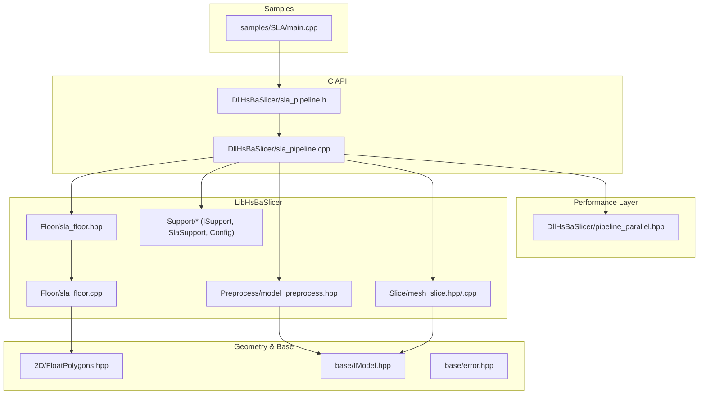
```mermaid
graph TB
subgraph "C API"
A["DllHsBaSlicer/sla_pipeline.h"]
B["DllHsBaSlicer/sla_pipeline.cpp"]
end
subgraph "Performance Layer"
P["DllHsBaSlicer/pipeline_parallel.hpp"]
end
subgraph "LibHsBaSlicer"
C["Preprocess/model_preprocess.hpp"]
D["Slice/mesh_slice.hpp/.cpp"]
E["Floor/sla_floor.hpp"]
F["Floor/sla_floor.cpp"]
G["Support/* (ISupport, SlaSupport, Config)"]
end
subgraph "Geometry & Base"
H["2D/FloatPolygons.hpp"]
I["base/IModel.hpp"]
J["base/error.hpp"]
end
subgraph "Samples"
K["samples/SLA/main.cpp"]
end
A --> B
B --> P
B --> C
B --> D
B --> E
B --> G
E --> F
F --> H
C --> I
D --> I
K --> A
```

**Diagram sources**
- [sla_pipeline.h:1-63](file://DllHsBaSlicer/sla_pipeline.h#L1-L63)
- [sla_pipeline.cpp:1-508](file://DllHsBaSlicer/sla_pipeline.cpp#L1-L508)
- [pipeline_parallel.hpp:1-122](file://DllHsBaSlicer/pipeline_parallel.hpp#L1-L122)
- [mesh_slice.hpp:1-108](file://LibHsBaSlicer/Slice/mesh_slice.hpp#L1-L108)
- [mesh_slice.cpp:1-118](file://LibHsBaSlicer/Slice/mesh_slice.cpp#L1-L118)
- [model_preprocess.hpp:1-88](file://LibHsBaSlicer/Preprocess/model_preprocess.hpp#L1-L88)
- [sla_floor.hpp:1-183](file://LibHsBaSlicer/Floor/sla_floor.hpp#L1-L183)
- [sla_floor.cpp:1-465](file://LibHsBaSlicer/Floor/sla_floor.cpp#L1-L465)
- [ISupport.hpp:1-45](file://support/ISupport.hpp#L1-L45)
- [SlaSupport.hpp:1-42](file://support/SlaSupport.hpp#L1-L42)
- [SlaSupport.cpp:1-116](file://support/SlaSupport.cpp#L1-L116)
- [FloatPolygons.hpp:1-267](file://2D/FloatPolygons.hpp#L1-L267)
- [IModel.hpp:1-148](file://base/IModel.hpp#L1-L148)
- [error.hpp:41-111](file://base/error.hpp#L41-L111)
- [main.cpp:1-271](file://samples/SLA/main.cpp#L1-L271)

**Section sources**
- [sla_pipeline.h:1-63](file://DllHsBaSlicer/sla_pipeline.h#L1-L63)
- [sla_pipeline.cpp:1-508](file://DllHsBaSlicer/sla_pipeline.cpp#L1-L508)
- [pipeline_parallel.hpp:1-122](file://DllHsBaSlicer/pipeline_parallel.hpp#L1-L122)
- [mesh_slice.hpp:1-108](file://LibHsBaSlicer/Slice/mesh_slice.hpp#L1-L108)
- [mesh_slice.cpp:1-118](file://LibHsBaSlicer/Slice/mesh_slice.cpp#L1-L118)
- [model_preprocess.hpp:1-88](file://LibHsBaSlicer/Preprocess/model_preprocess.hpp#L1-L88)
- [sla_floor.hpp:1-183](file://LibHsBaSlicer/Floor/sla_floor.hpp#L1-L183)
- [sla_floor.cpp:1-465](file://LibHsBaSlicer/Floor/sla_floor.cpp#L1-L465)
- [ISupport.hpp:1-45](file://support/ISupport.hpp#L1-L45)
- [SlaSupport.hpp:1-42](file://support/SlaSupport.hpp#L1-L42)
- [SlaSupport.cpp:1-116](file://support/SlaSupport.cpp#L1-L116)
- [FloatPolygons.hpp:1-267](file://2D/FloatPolygons.hpp#L1-L267)
- [IModel.hpp:1-148](file://base/IModel.hpp#L1-L148)
- [error.hpp:41-111](file://base/error.hpp#L41-L111)
- [main.cpp:1-271](file://samples/SLA/main.cpp#L1-L271)

## Core Components
- C API surface:
  - Configuration struct covering model, slice, exposure, lift/retract, floor/raft, support, Lua hooks, and output image settings
  - Result struct with success flag, total layers, exported path, error message, and elapsed time
  - Progress and result callbacks for async usage
  - Functions to create default config, run sync/async pipeline, and free results
- Internal pipeline orchestration:
  - Builds internal config from C struct
  - Executes stages: Preprocess -> Slice -> Floor -> Support -> Export
  - Emits progress updates and timing
  - Uses parallel processing for layer operations
- Parallel execution engine:
  - Thread-safe layer processing with configurable worker threads
  - Environment-based thread count control (HSBA_PIPELINE_THREADS)
  - Block-based progress reporting for efficient UI updates
- Floor/raft module:
  - Computes footprint using convex/concave hull options
  - Generates border loops and fill patterns
  - Supports Lua-based custom floor generation
  - Renders polygons to images and packages them into a zip
- Support module:
  - Abstract ISupport interface with default all-layers generator
  - SLA sacrificial support implementation using overhang detection and point sampling
- Geometry primitives:
  - Double-precision polygon types and operations (union, difference, offset, etc.)
- Model abstraction:
  - IModel interface for loading, transforming, querying bounding box/volume, and mesh access
- Error handling system:
  - Comprehensive exception hierarchy with specialized error types
  - Guarded slicing operations with foreign exception translation

**Section sources**
- [sla_pipeline.h:1-63](file://DllHsBaSlicer/sla_pipeline.h#L1-L63)
- [sla_pipeline.cpp:281-463](file://DllHsBaSlicer/sla_pipeline.cpp#L281-L463)
- [pipeline_parallel.hpp:22-117](file://DllHsBaSlicer/pipeline_parallel.hpp#L22-L117)
- [mesh_slice.cpp:17-43](file://LibHsBaSlicer/Slice/mesh_slice.cpp#L17-L43)
- [sla_floor.hpp:1-183](file://LibHsBaSlicer/Floor/sla_floor.hpp#L1-L183)
- [sla_floor.cpp:1-465](file://LibHsBaSlicer/Floor/sla_floor.cpp#L1-L465)
- [ISupport.hpp:1-45](file://support/ISupport.hpp#L1-L45)
- [SlaSupport.hpp:1-42](file://support/SlaSupport.hpp#L1-L42)
- [SlaSupport.cpp:1-116](file://support/SlaSupport.cpp#L1-L116)
- [FloatPolygons.hpp:1-267](file://2D/FloatPolygons.hpp#L1-L267)
- [IModel.hpp:1-148](file://base/IModel.hpp#L1-L148)
- [error.hpp:41-111](file://base/error.hpp#L41-L111)

## Architecture Overview
The SLA pipeline composes several subsystems behind a simple C API with enhanced parallel processing capabilities. Internally it uses coroutines to drive stage progression and progress reporting, with parallel execution for independent layer operations.

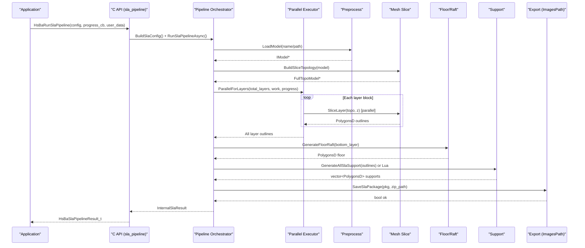
```mermaid
sequenceDiagram
participant App as "Application"
participant API as "C API (sla_pipeline)"
participant Pipe as "Pipeline Orchestrator"
participant Parallel as "Parallel Executor"
participant Prep as "Preprocess"
participant Slice as "Mesh Slice"
participant Floor as "Floor/Raft"
participant Supp as "Support"
participant Export as "Export (ImagesPath)"
App->>API : HsBaRunSlaPipeline(config, progress_cb, user_data)
API->>Pipe : BuildSlaConfig() + RunSlaPipelineAsync()
Pipe->>Prep : LoadModel(name/path)
Prep-->>Pipe : IModel*
Pipe->>Slice : BuildSliceTopology(model)
Slice-->>Pipe : FullTopoModel*
Pipe->>Parallel : ParallelForLayers(total_layers, work, progress)
loop Each layer block
Parallel->>Slice : SliceLayer(topo, z) [parallel]
Slice-->>Parallel : PolygonsD outlines
end
Parallel-->>Pipe : All layer outlines
Pipe->>Floor : GenerateFloorRaft(bottom_layer)
Floor-->>Pipe : PolygonsD floor
Pipe->>Supp : GenerateAllSlaSupport(outlines) or Lua
Supp-->>Pipe : vector<PolygonsD> supports
Pipe->>Export : SaveSlaPackage(pkg, zip_path)
Export-->>Pipe : bool ok
Pipe-->>API : InternalSlaResult
API-->>App : HsBaSlaPipelineResult_t
```

**Diagram sources**
- [sla_pipeline.cpp:281-463](file://DllHsBaSlicer/sla_pipeline.cpp#L281-L463)
- [pipeline_parallel.hpp:41-117](file://DllHsBaSlicer/pipeline_parallel.hpp#L41-L117)
- [mesh_slice.hpp:89-103](file://LibHsBaSlicer/Slice/mesh_slice.hpp#L89-L103)
- [model_preprocess.hpp:35-42](file://LibHsBaSlicer/Preprocess/model_preprocess.hpp#L35-L42)
- [sla_floor.hpp:41-114](file://LibHsBaSlicer/Floor/sla_floor.hpp#L41-L114)
- [ISupport.hpp:31-41](file://support/ISupport.hpp#L31-L41)

## Detailed Component Analysis

### C API Surface and Orchestration
- Configuration fields include model paths, slice heights, exposure/lift parameters, floor/raft geometry, support thresholds and pattern, Lua script/function names, and output image format/size.
- Sync entry builds an internal config, runs a coroutine-based pipeline, and returns a C-compatible result.
- Async entry wraps the same pipeline and invokes a completion callback with the result.
- Memory ownership: exported strings in the result must be freed by the caller via the provided free function.

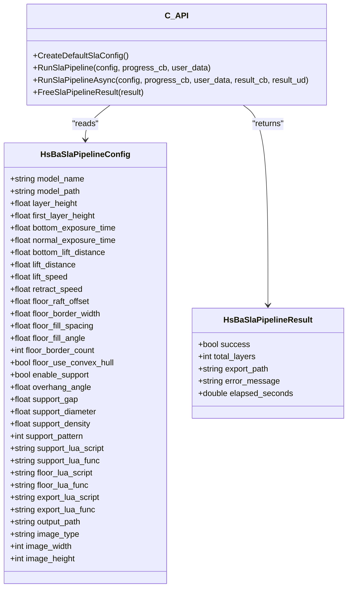
```mermaid
classDiagram
class HsBaSlaPipelineConfig {
+string model_name
+string model_path
+float layer_height
+float first_layer_height
+float bottom_exposure_time
+float normal_exposure_time
+float bottom_lift_distance
+float lift_distance
+float lift_speed
+float retract_speed
+float floor_raft_offset
+float floor_border_width
+float floor_fill_spacing
+float floor_fill_angle
+int floor_border_count
+bool floor_use_convex_hull
+bool enable_support
+float overhang_angle
+float support_gap
+float support_diameter
+float support_density
+int support_pattern
+string support_lua_script
+string support_lua_func
+string floor_lua_script
+string floor_lua_func
+string export_lua_script
+string export_lua_func
+string output_path
+string image_type
+int image_width
+int image_height
}
class HsBaSlaPipelineResult {
+bool success
+int total_layers
+string export_path
+string error_message
+double elapsed_seconds
}
class C_API {
+CreateDefaultSlaConfig()
+RunSlaPipeline(config, progress_cb, user_data)
+RunSlaPipelineAsync(config, progress_cb, user_data, result_cb, result_ud)
+FreeSlaPipelineResult(result)
}
C_API --> HsBaSlaPipelineConfig : "reads"
C_API --> HsBaSlaPipelineResult : "returns"
```

**Diagram sources**
- [sla_pipeline.h:17-56](file://DllHsBaSlicer/sla_pipeline.h#L17-L56)
- [sla_pipeline.cpp:469-507](file://DllHsBaSlicer/sla_pipeline.cpp#L469-L507)

**Section sources**
- [sla_pipeline.h:1-63](file://DllHsBaSlicer/sla_pipeline.h#L1-L63)
- [sla_pipeline.cpp:227-279](file://DllHsBaSlicer/sla_pipeline.cpp#L227-L279)

### Parallel Processing Engine
**Updated** The pipeline now includes a sophisticated parallel execution engine that significantly improves performance for large models.

- **Thread Pool Management**: Uses a configurable ThreadPool with automatic hardware concurrency detection
- **Environment Control**: HSBA_PIPELINE_THREADS environment variable allows runtime thread count adjustment
- **Block Processing**: Processes layers in blocks to minimize synchronization overhead while maintaining responsive progress updates
- **Exception Safety**: Worker exceptions are properly propagated to the calling thread

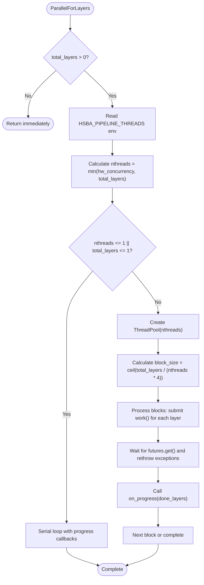
```mermaid
flowchart TD
Start(["ParallelForLayers"]) --> Check{"total_layers > 0?"}
Check --> |No| Return(["Return immediately"])
Check --> |Yes| Env["Read HSBA_PIPELINE_THREADS env"]
Env --> Calc["Calculate nthreads = min(hw_concurrency, total_layers)"]
Calc --> Serial{"nthreads <= 1 || total_layers <= 1?"}
Serial --> |Yes| SerialLoop["Serial loop with progress callbacks"]
Serial --> |No| ThreadPool["Create ThreadPool(nthreads)"]
ThreadPool --> Blocks["Calculate block_size = ceil(total_layers / (nthreads * 4))"]
Blocks --> Process["Process blocks: submit work() for each layer"]
Process --> Wait["Wait for futures.get() and rethrow exceptions"]
Wait --> Progress["Call on_progress(done_layers)"]
Progress --> NextBlock["Next block or complete"]
SerialLoop --> Complete(["Complete"])
NextBlock --> Complete
```

**Diagram sources**
- [pipeline_parallel.hpp:41-117](file://DllHsBaSlicer/pipeline_parallel.hpp#L41-L117)

**Section sources**
- [pipeline_parallel.hpp:1-122](file://DllHsBaSlicer/pipeline_parallel.hpp#L1-L122)

### Enhanced Slicing with Reusable Topology
**Updated** The slicing process now uses reusable topology building for significant performance improvements.

- **Topology Building**: `BuildSliceTopology()` creates a shared topology object once, avoiding O(total_faces) rebuild per layer
- **Parallel Layer Slicing**: `SliceLayer()` operates on the prebuilt topology, enabling safe concurrent access
- **Memory Efficiency**: The topology owns its own vertex/face copies, independent of source model lifetime
- **Exception Translation**: All slicing operations wrapped with `GuardSlice()` for robust error handling

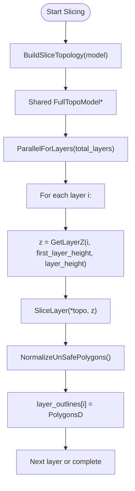
```mermaid
flowchart TD
Start(["Start Slicing"]) --> Build["BuildSliceTopology(model)"]
Build --> Shared["Shared FullTopoModel*"]
Shared --> Parallel["ParallelForLayers(total_layers)"]
Parallel --> Loop["For each layer i:"]
Loop --> Z["z = GetLayerZ(i, first_layer_height, layer_height)"]
Z --> Slice["SliceLayer(*topo, z)"]
Slice --> Normalize["NormalizeUnSafePolygons()"]
Normalize --> Output["layer_outlines[i] = PolygonsD"]
Output --> Next["Next layer or complete"]
```

**Diagram sources**
- [mesh_slice.hpp:89-103](file://LibHsBaSlicer/Slice/mesh_slice.hpp#L89-L103)
- [mesh_slice.cpp:105-115](file://LibHsBaSlicer/Slice/mesh_slice.cpp#L105-L115)
- [sla_pipeline.cpp:324-339](file://DllHsBaSlicer/sla_pipeline.cpp#L324-L339)

**Section sources**
- [mesh_slice.hpp:1-108](file://LibHsBaSlicer/Slice/mesh_slice.hpp#L1-L108)
- [mesh_slice.cpp:1-118](file://LibHsBaSlicer/Slice/mesh_slice.cpp#L1-L118)
- [sla_pipeline.cpp:319-339](file://DllHsBaSlicer/sla_pipeline.cpp#L319-L339)

### Preprocessing and Slicing
- Preprocessing loads a model into a pool and exposes transforms and metadata (bounding box, volume).
- Slicing produces double-precision polygons per layer; unsafe slicing is normalized to clean polygons for downstream use.
- **Enhanced**: Now uses parallel processing with reusable topology for improved performance.

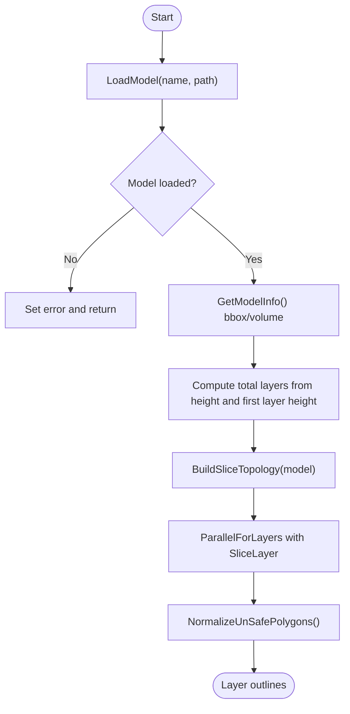
```mermaid
flowchart TD
Start(["Start"]) --> Load["LoadModel(name, path)"]
Load --> Valid{"Model loaded?"}
Valid --> |No| Error["Set error and return"]
Valid --> |Yes| Info["GetModelInfo() bbox/volume"]
Info --> Layers["Compute total layers from height and first layer height"]
Layers --> Topo["BuildSliceTopology(model)"]
Topo --> Parallel["ParallelForLayers with SliceLayer"]
Parallel --> Normalize["NormalizeUnSafePolygons()"]
Normalize --> Out(["Layer outlines"])
```

**Diagram sources**
- [model_preprocess.hpp:35-77](file://LibHsBaSlicer/Preprocess/model_preprocess.hpp#L35-L77)
- [mesh_slice.hpp:18-36](file://LibHsBaSlicer/Slice/mesh_slice.hpp#L18-L36)
- [sla_pipeline.cpp:291-339](file://DllHsBaSlicer/sla_pipeline.cpp#L291-L339)

**Section sources**
- [model_preprocess.hpp:1-88](file://LibHsBaSlicer/Preprocess/model_preprocess.hpp#L1-L88)
- [mesh_slice.hpp:1-108](file://LibHsBaSlicer/Slice/mesh_slice.hpp#L1-L108)
- [sla_pipeline.cpp:291-339](file://DllHsBaSlicer/sla_pipeline.cpp#L291-L339)

### Floor/Raft Generation
- Footprint computation can use convex hull, concave hull simulation, or direct footprint.
- Border loops are generated by composite offsets; interior fill uses zigzag fill at configured spacing and angle.
- Lua integration allows custom floor generation by passing bottom layer polygons and a config table.

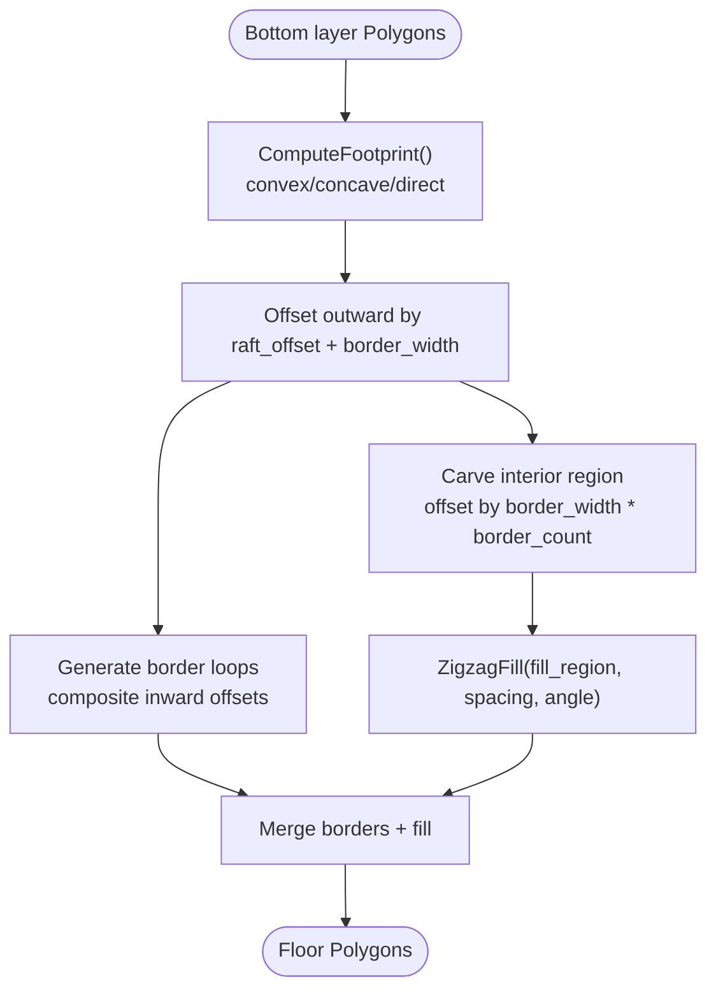
```mermaid
flowchart TD
In(["Bottom layer Polygons"]) --> Footprint["ComputeFootprint()<br/>convex/concave/direct"]
Footprint --> Outer["Offset outward by raft_offset + border_width"]
Outer --> Borders["Generate border loops<br/>composite inward offsets"]
Outer --> FillRegion["Carve interior region<br/>offset by border_width * border_count"]
FillRegion --> Zigzag["ZigzagFill(fill_region, spacing, angle)"]
Borders --> Merge["Merge borders + fill"]
Zigzag --> Merge
Merge --> Out(["Floor Polygons"])
```

**Diagram sources**
- [sla_floor.cpp:19-102](file://LibHsBaSlicer/Floor/sla_floor.cpp#L19-L102)
- [FloatPolygons.hpp:46-117](file://2D/FloatPolygons.hpp#L46-L117)

**Section sources**
- [sla_floor.hpp:17-114](file://LibHsBaSlicer/Floor/sla_floor.hpp#L17-L114)
- [sla_floor.cpp:19-102](file://LibHsBaSlicer/Floor/sla_floor.cpp#L19-L102)
- [FloatPolygons.hpp:1-267](file://2D/FloatPolygons.hpp#L1-L267)

### Support Generation
- Abstract ISupport defines a single-layer generator and a default all-layers iterator.
- SLA sacrificial support detects overhangs between consecutive layers, applies gap, samples points on a grid within gapped regions, and unions small circles to form support cross-sections.

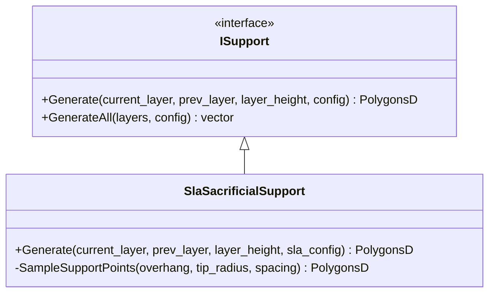
```mermaid
classDiagram
class ISupport {
<<interface>>
+Generate(current_layer, prev_layer, layer_height, config) PolygonsD
+GenerateAll(layers, config) vector<PolygonsD>
}
class SlaSacrificialSupport {
+Generate(current_layer, prev_layer, layer_height, sla_config) PolygonsD
-SampleSupportPoints(overhang, tip_radius, spacing) PolygonsD
}
ISupport <|-- SlaSacrificialSupport
```

**Diagram sources**
- [ISupport.hpp:18-41](file://support/ISupport.hpp#L18-L41)
- [SlaSupport.hpp:16-38](file://support/SlaSupport.hpp#L16-L38)
- [SlaSupport.cpp:34-114](file://support/SlaSupport.cpp#L34-L114)

**Section sources**
- [ISupport.hpp:1-45](file://support/ISupport.hpp#L1-L45)
- [SlaSupport.hpp:1-42](file://support/SlaSupport.hpp#L1-L42)
- [SlaSupport.cpp:1-116](file://support/SlaSupport.cpp#L1-L116)
- [SupportConfig.hpp:1-43](file://support/SupportConfig.hpp#L1-L43)

### Export and Packaging
- The pipeline renders polygons to images (PNG/JPG/SVG), writes a configuration JSON, and packages everything into a zip.
- Both built-in and Lua-customized export are supported.

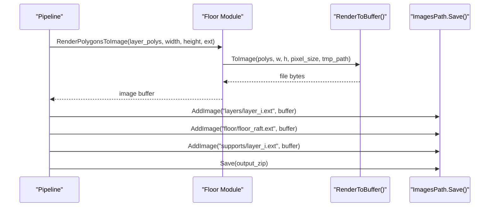
```mermaid
sequenceDiagram
participant Pipe as "Pipeline"
participant Floor as "Floor Module"
participant Img as "RenderToBuffer()"
participant Zip as "ImagesPath.Save()"
Pipe->>Floor : RenderPolygonsToImage(layer_polys, width, height, ext)
Floor->>Img : ToImage(polys, w, h, pixel_size, tmp_path)
Img-->>Floor : file bytes
Floor-->>Pipe : image buffer
Pipe->>Zip : AddImage("layers/layer_i.ext", buffer)
Pipe->>Zip : AddImage("floor/floor_raft.ext", buffer)
Pipe->>Zip : AddImage("supports/layer_i.ext", buffer)
Pipe->>Zip : Save(output_zip)
```

**Diagram sources**
- [sla_floor.cpp:299-405](file://LibHsBaSlicer/Floor/sla_floor.cpp#L299-L405)
- [sla_floor.hpp:132-178](file://LibHsBaSlicer/Floor/sla_floor.hpp#L132-L178)

**Section sources**
- [sla_floor.cpp:299-465](file://LibHsBaSlicer/Floor/sla_floor.cpp#L299-L465)
- [sla_floor.hpp:117-178](file://LibHsBaSlicer/Floor/sla_floor.hpp#L117-L178)

### Usage Examples
- The sample demonstrates basic usage, custom parameters, Lua customization, and async execution. It shows how to set model paths, process/exposure parameters, floor/support options, and handle results.

**Section sources**
- [main.cpp:1-271](file://samples/SLA/main.cpp#L1-L271)

## Dependency Analysis
Key dependencies and relationships:
- C API depends on internal orchestrator which composes preprocess, slice, floor, support, and export modules.
- **Enhanced**: Parallel execution engine coordinates thread pool management and layer distribution.
- Floor and support modules rely on 2D polygon operations and integerization utilities.
- Model abstraction decouples geometry backends from the pipeline.
- **New**: Comprehensive error handling system with specialized exception types.

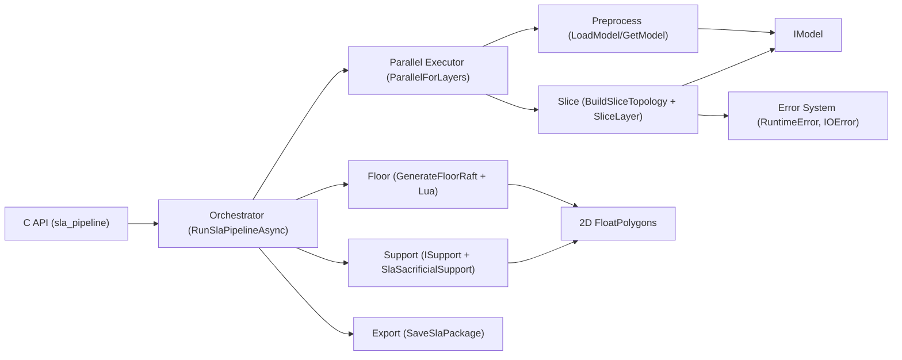
```mermaid
graph LR
API["C API (sla_pipeline)"] --> ORCH["Orchestrator (RunSlaPipelineAsync)"]
ORCH --> PARALLEL["Parallel Executor (ParallelForLayers)"]
PARALLEL --> PREP["Preprocess (LoadModel/GetModel)"]
PARALLEL --> SLICE["Slice (BuildSliceTopology + SliceLayer)"]
ORCH --> FLOOR["Floor (GenerateFloorRaft + Lua)"]
ORCH --> SUPP["Support (ISupport + SlaSacrificialSupport)"]
ORCH --> EXPORT["Export (SaveSlaPackage)"]
FLOOR --> GEO["2D FloatPolygons"]
SUPP --> GEO
PREP --> MODEL["IModel"]
SLICE --> MODEL
SLICE --> ERRORS["Error System (RuntimeError, IOError)"]
```

**Diagram sources**
- [sla_pipeline.cpp:281-463](file://DllHsBaSlicer/sla_pipeline.cpp#L281-L463)
- [pipeline_parallel.hpp:41-117](file://DllHsBaSlicer/pipeline_parallel.hpp#L41-L117)
- [mesh_slice.hpp:89-103](file://LibHsBaSlicer/Slice/mesh_slice.hpp#L89-L103)
- [model_preprocess.hpp:35-42](file://LibHsBaSlicer/Preprocess/model_preprocess.hpp#L35-L42)
- [sla_floor.hpp:41-114](file://LibHsBaSlicer/Floor/sla_floor.hpp#L41-L114)
- [ISupport.hpp:18-41](file://support/ISupport.hpp#L18-L41)
- [FloatPolygons.hpp:1-267](file://2D/FloatPolygons.hpp#L1-L267)
- [IModel.hpp:108-136](file://base/IModel.hpp#L108-L136)
- [error.hpp:41-111](file://base/error.hpp#L41-L111)

**Section sources**
- [sla_pipeline.cpp:281-463](file://DllHsBaSlicer/sla_pipeline.cpp#L281-L463)
- [pipeline_parallel.hpp:1-122](file://DllHsBaSlicer/pipeline_parallel.hpp#L1-L122)
- [mesh_slice.hpp:1-108](file://LibHsBaSlicer/Slice/mesh_slice.hpp#L1-L108)
- [model_preprocess.hpp:1-88](file://LibHsBaSlicer/Preprocess/model_preprocess.hpp#L1-L88)
- [sla_floor.hpp:1-183](file://LibHsBaSlicer/Floor/sla_floor.hpp#L1-L183)
- [ISupport.hpp:1-45](file://support/ISupport.hpp#L1-L45)
- [FloatPolygons.hpp:1-267](file://2D/FloatPolygons.hpp#L1-L267)
- [IModel.hpp:1-148](file://base/IModel.hpp#L1-L148)
- [error.hpp:41-111](file://base/error.hpp#L41-L111)

## Performance Considerations
**Updated** The SLA pipeline now includes significant performance optimizations:

- **Parallel Slicing**: Layer operations are distributed across multiple threads using a configurable thread pool
- **Reusable Topology**: Single topology build avoids O(total_faces) reconstruction per layer
- **Thread Pool Configuration**: 
  - Automatic hardware concurrency detection
  - HSBA_PIPELINE_THREADS environment variable for runtime control
  - Block-based processing for efficient progress reporting
- **Memory Optimization**: Shared topology objects reduce memory allocation overhead
- **Layer Count Calculation**: Scales linearly with model height divided by layer thickness; ensure reasonable layer heights to avoid excessive layers
- **Slicing Performance**: Parallel iteration over layers with thread-safe output slots
- **Floor and Support Generation**: Polygon operations benefit from optimized 2D geometry libraries
- **Image Rendering**: Per-layer rendering with configurable dimensions and formats
- **Async Mode**: Keeps UI responsive while processing long jobs

**Optimization Strategies**:
- Set HSBA_PIPELINE_THREADS=1 for serial testing vs parallel comparison
- Use appropriate layer heights to balance quality and processing time
- Leverage parallel processing for models with many layers
- Monitor thread pool utilization for optimal performance tuning

[No sources needed since this section provides general guidance based on analyzed code]

## Error Handling and Robustness
**New Section** The pipeline includes comprehensive error handling and robustness features:

- **Exception Hierarchy**: Specialized error types including RuntimeError, IOError, NotImplementedError, NullValueError, NotSupportedError, NotFoundError, AlreadyExistsError, PermissionDeniedError, TimeoutError
- **Guarded Operations**: All slicing operations wrapped with `GuardSlice()` to translate foreign exceptions (CGAL::Exception, Standard_Failure, std::runtime_error) into project-specific IOError
- **Pipeline-Level Error Handling**: Try-catch blocks around critical sections with meaningful error messages
- **Resource Management**: Proper cleanup of allocated memory and resources even when errors occur
- **Validation**: Input validation for model properties, layer calculations, and parameter ranges
- **Progress Reporting**: Graceful degradation with partial progress information when errors occur

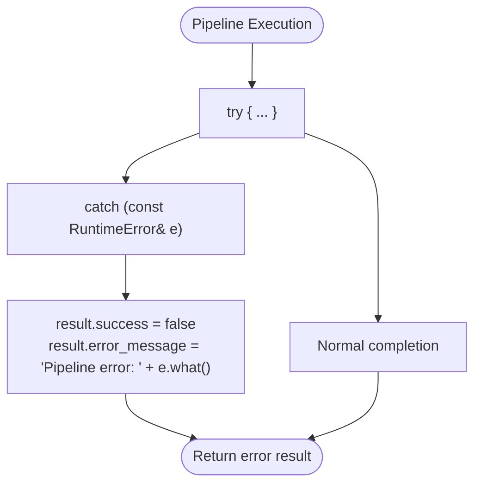
```mermaid
flowchart TD
Start(["Pipeline Execution"]) --> TryTry["try { ... }"]
TryTry --> CatchRuntime["catch (const RuntimeError& e)"]
CatchRuntime --> HandleRuntime["result.success = false<br/>result.error_message = 'Pipeline error: ' + e.what()"]
HandleRuntime --> End(["Return error result"])
TryTry --> Success["Normal completion"]
Success --> End
```

**Diagram sources**
- [mesh_slice.cpp:27-42](file://LibHsBaSlicer/Slice/mesh_slice.cpp#L27-L42)
- [sla_pipeline.cpp:453-457](file://DllHsBaSlicer/sla_pipeline.cpp#L453-L457)
- [error.hpp:41-111](file://base/error.hpp#L41-L111)

**Section sources**
- [mesh_slice.cpp:17-43](file://LibHsBaSlicer/Slice/mesh_slice.cpp#L17-L43)
- [sla_pipeline.cpp:453-457](file://DllHsBaSlicer/sla_pipeline.cpp#L453-L457)
- [error.hpp:41-111](file://base/error.hpp#L41-L111)

## Troubleshooting Guide
Common issues and remedies:
- Model load failures: verify model name/path and supported formats; check error messages returned in the result.
- Invalid model height: ensure non-zero Z extent; adjust first layer height and layer height to produce at least one layer.
- Empty slices or supports: confirm overhang threshold, support gap, and diameter values; inspect intermediate outputs if available.
- Export failures: validate output path permissions and disk space; ensure image extension matches renderer capabilities.
- Lua errors: confirm script paths and function names exist; review Lua runtime errors reported during script load/call.
- **Performance Issues**: 
  - Adjust HSBA_PIPELINE_THREADS environment variable for optimal thread count
  - Monitor memory usage with large models
  - Consider reducing layer count for faster processing
- **Error Handling**: 
  - Check error_message field in pipeline results
  - Verify model integrity before processing
  - Ensure sufficient disk space for output files

**Section sources**
- [sla_pipeline.cpp:291-463](file://DllHsBaSlicer/sla_pipeline.cpp#L291-L463)
- [sla_floor.cpp:133-293](file://LibHsBaSlicer/Floor/sla_floor.cpp#L133-L293)
- [SlaSupport.cpp:70-114](file://support/SlaSupport.cpp#L70-L114)
- [pipeline_parallel.hpp:49-61](file://DllHsBaSlicer/pipeline_parallel.hpp#L49-L61)

## Conclusion
The SLA Slicing Pipeline offers a robust, configurable, and extensible solution for generating resin-print-ready layer data with significant performance enhancements. Its modular architecture separates concerns across preprocessing, slicing, floor/raft generation, support creation, and packaging, while providing both synchronous and asynchronous interfaces and Lua hooks for customization. The new parallel processing engine and comprehensive error handling system make it suitable for production environments requiring high throughput and reliability.

[No sources needed since this section summarizes without analyzing specific files]

## Appendices

### API Reference Summary
- Configuration: model, slice, exposure/lift, floor/raft, support, Lua hooks, output image settings
- Results: success, total layers, exported path, error message, elapsed seconds
- Callbacks: progress percent/stage, async result delivery
- **Performance**: HSBA_PIPELINE_THREADS environment variable for thread control

**Section sources**
- [sla_pipeline.h:17-56](file://DllHsBaSlicer/sla_pipeline.h#L17-L56)
- [sla_pipeline.cpp:469-507](file://DllHsBaSlicer/sla_pipeline.cpp#L469-L507)
- [pipeline_parallel.hpp:49-61](file://DllHsBaSlicer/pipeline_parallel.hpp#L49-L61)