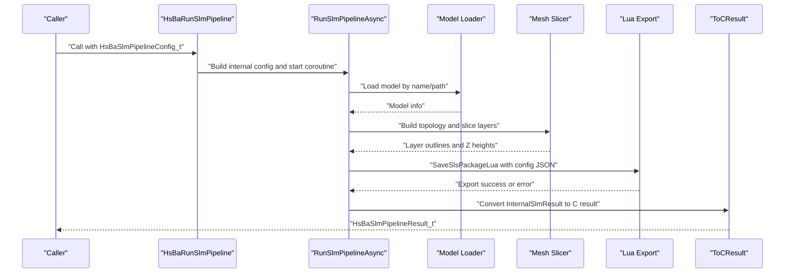
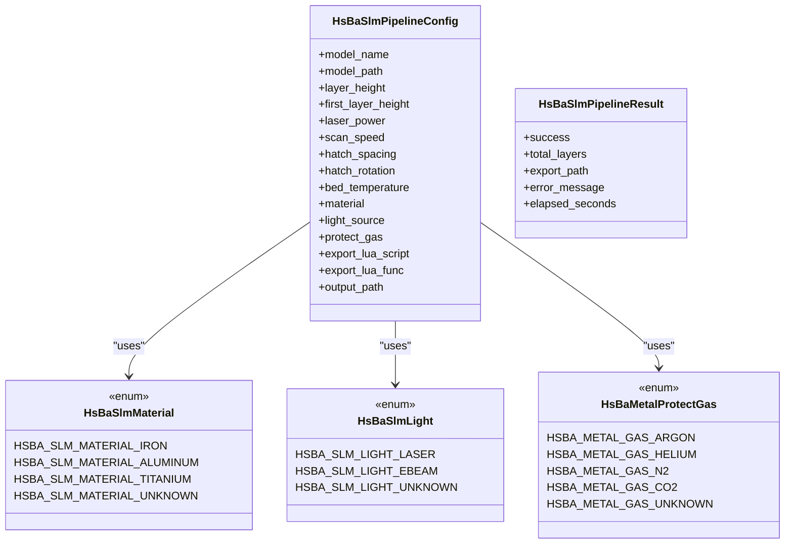
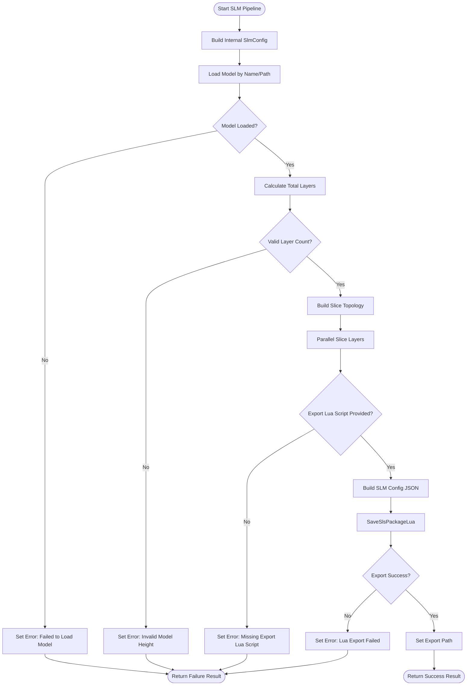
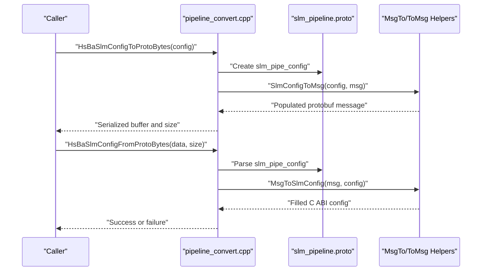
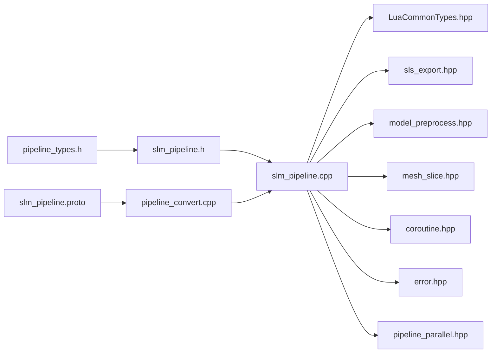

# SLM Manufacturing Process

<cite>
**Referenced Files in This Document**
- [README.md](file://README.md)
- [slm_pipeline.h](file://DllHsBaSlicer/slm_pipeline.h)
- [slm_pipeline.cpp](file://DllHsBaSlicer/slm_pipeline.cpp)
- [pipeline_types.h](file://pipelinetypes/pipeline_types.h)
- [slm_pipeline.proto](file://proto/slm_pipeline.proto)
- [pipeline_convert.cpp](file://DllHsBaSlicer/pipeline_convert.cpp)
- [param_reflect.hpp](file://fileoperator/param_reflect.hpp)
- [README.md](file://docs/en/DllHsBaSlicer/README.md)
</cite>

## Table of Contents
1. [Introduction](#introduction)
2. [Project Structure](#project-structure)
3. [Core Components](#core-components)
4. [Architecture Overview](#architecture-overview)
5. [Detailed Component Analysis](#detailed-component-analysis)
6. [Dependency Analysis](#dependency-analysis)
7. [Performance Considerations](#performance-considerations)
8. [Troubleshooting Guide](#troubleshooting-guide)
9. [Conclusion](#conclusion)

## Introduction
This document explains the SLM (Selective Laser Melting) manufacturing process as implemented in HsBaSlicer. SLM is modeled as a metal powder-bed slicing pipeline that mirrors the SLS flow: model preprocessing, layer slicing, and Lua-driven export. The main difference from SLS is that SLM carries metal-specific parameters such as material, energy source, and shielding gas into the configuration JSON handed to the export script.

At a high level, callers use C ABI functions exported by `DllHsBaSlicer` to create an SLM configuration, run the pipeline synchronously or asynchronously, and receive a result containing success status, total layers, exported path, error message, and elapsed time. Internally, the implementation uses LibHsBaSlicer model loading, slicing, and SLS-style packaging, plus coroutines and parallel layer slicing for performance.

## Project Structure
The SLM feature spans several modules:

| Area | Responsibility |
|------|----------------|
| `pipelinetypes/pipeline_types.h` | Defines C-compatible SLM config, result, enums, and callback types. |
| `DllHsBaSlicer/slm_pipeline.{h,cpp}` | Exposes C ABI entry points and implements the SLM workflow. |
| `proto/slm_pipeline.proto` | Protobuf definition for SLM config/result serialization. |
| `DllHsBaSlicer/pipeline_convert.cpp` | Converts between C ABI structs and protobuf messages. |
| `LibHsBaSlicer/*` | Provides model loading, mesh slicing, SLS packaging, and Lua export helpers used by SLM. |
| `fileoperator/param_reflect.hpp` | Registers reflection metadata for `HsBaSlmPipelineConfig_t`, enabling ParamStore persistence. |
| `docs/en/DllHsBaSlicer/README.md` | Documents the public SLM C API surface. |

```mermaid
graph TB
Caller["External Caller<br/>C/C++/Python/Java"] --> DllApi["DllHsBaSlicer C API<br/>slm_pipeline.h"]
DllApi --> Impl["SLM Implementation<br/>slm_pipeline.cpp"]
Impl --> Preprocess["Model Preprocessing<br/>LibHsBaSlicer"]
Impl --> Slice["Mesh Slicing<br/>LibHsBaSlicer"]
Slice --> Parallel["Parallel Layer Slicing<br/>pipeline_parallel.hpp"]
Impl --> Export["Lua Export Packaging<br/>SlsPackage + SaveSlsPackageLua"]
Impl --> Result["Result Conversion<br/>ToCResult"]
Proto["protobuf slm_pipeline.proto"] < --> Convert["pipeline_convert.cpp"]
Types["pipelinetypes/pipeline_types.h"] --> DllApi
Reflect["fileoperator param_reflect.hpp"] --> Types
```

**Diagram sources**
- [slm_pipeline.h:1-63](file://DllHsBaSlicer/slm_pipeline.h#L1-L63)
- [slm_pipeline.cpp:17-24](file://DllHsBaSlicer/slm_pipeline.cpp#L17-L24)
- [slm_pipeline.cpp:230-342](file://DllHsBaSlicer/slm_pipeline.cpp#L230-L342)
- [slm_pipeline.proto:33-64](file://proto/slm_pipeline.proto#L33-L64)
- [pipeline_convert.cpp:413-475](file://DllHsBaSlicer/pipeline_convert.cpp#L413-L475)
- [pipeline_types.h:312-401](file://pipelinetypes/pipeline_types.h#L312-L401)
- [param_reflect.hpp:188-212](file://fileoperator/param_reflect.hpp#L188-L212)

**Section sources**
- [README.md:21-39](file://README.md#L21-L39)
- [README.md:104-124](file://README.md#L104-L124)

## Core Components
The SLM manufacturing process is primarily composed of:

1. **C ABI types**: `HsBaSlmPipelineConfig_t`, `HsBaSlmPipelineResult_t`, `HsBaSlmMaterial_t`, `HsBaSlmLight_t`, `HsBaMetalProtectGas_t`, and progress/result callbacks.
2. **Public C API**: `HsBaCreateDefaultSlmConfig`, `HsBaRunSlmPipeline`, `HsBaRunSlmPipelineAsync`, and `HsBaFreeSlmPipelineResult`.
3. **Internal SLM implementation**: Builds an internal configuration, loads the model, computes layer count, slices layers in parallel, builds a config JSON with metal parameters, and exports via an SLS-style Lua package.
4. **Protobuf conversion**: Functions to serialize/deserialize SLM config and result between C ABI and protobuf.
5. **ParamStore reflection**: Reflection registration for `HsBaSlmPipelineConfig_t` so the same struct can be persisted through ParamStore.

Key responsibilities:
- The header defines the stable cross-language contract.
- The implementation owns memory allocation for result strings and exposes a dedicated free function.
- The pipeline is coroutine-based and supports both synchronous blocking calls and asynchronous completion callbacks.
- Metal-specific behavior is expressed through enums and JSON fields rather than separate code paths.

**Section sources**
- [pipeline_types.h:312-401](file://pipelinetypes/pipeline_types.h#L312-L401)
- [slm_pipeline.h:17-56](file://DllHsBaSlicer/slm_pipeline.h#L17-L56)
- [slm_pipeline.cpp:28-56](file://DllHsBaSlicer/slm_pipeline.cpp#L28-L56)
- [slm_pipeline.cpp:348-386](file://DllHsBaSlicer/slm_pipeline.cpp#L348-L386)
- [pipeline_convert.cpp:413-475](file://DllHsBaSlicer/pipeline_convert.cpp#L413-L475)
- [param_reflect.hpp:188-212](file://fileoperator/param_reflect.hpp#L188-L212)

## Architecture Overview
The SLM architecture follows the project’s layered design:

- **Caller layer**: External applications call C ABI functions.
- **DLL boundary**: `DllHsBaSlicer` exposes stable C functions and handles memory ownership across the boundary.
- **Implementation layer**: `slm_pipeline.cpp` orchestrates preprocessing, slicing, and export.
- **Library layer**: `LibHsBaSlicer` provides reusable slicing and packaging primitives.
- **Serialization layer**: `slm_pipeline.proto` and `pipeline_convert.cpp` provide protobuf interchange.
- **Persistence layer**: ParamStore reflection allows saving/loading `HsBaSlmPipelineConfig_t`.



**Diagram sources**
- [slm_pipeline.cpp:230-342](file://DllHsBaSlicer/slm_pipeline.cpp#L230-L342)
- [slm_pipeline.cpp:353-360](file://DllHsBaSlicer/slm_pipeline.cpp#L353-L360)

## Detailed Component Analysis

### SLM Configuration and Result Types
The C ABI types are defined in `pipeline_types.h`. They include:

- Material enum: iron, aluminum, titanium, unknown.
- Light-source enum: laser, electron beam, unknown.
- Shared metal shielding-gas enum: argon, helium, nitrogen, CO₂, unknown.
- Config struct: model name/path, layer geometry, laser/power parameters, bed temperature, material/light/gas, Lua export script/function, and output path.
- Result struct: success flag, total layers, exported path, error message, elapsed seconds.

These types are intentionally POD-friendly and use `const char*` for input strings and `char*` for owned output strings returned by the library.



**Diagram sources**
- [pipeline_types.h:320-376](file://pipelinetypes/pipeline_types.h#L320-L376)
- [pipeline_types.h:378-388](file://pipelinetypes/pipeline_types.h#L378-L388)

**Section sources**
- [pipeline_types.h:312-401](file://pipelinetypes/pipeline_types.h#L312-L401)

### Public C API Surface
The public SLM API is declared in `slm_pipeline.h`:

- `HsBaCreateDefaultSlmConfig`: returns a default-initialized SLM configuration.
- `HsBaRunSlmPipeline`: runs the full pipeline synchronously.
- `HsBaRunSlmPipelineAsync`: starts the pipeline asynchronously and invokes a result callback when complete.
- `HsBaFreeSlmPipelineResult`: frees the result’s owned string fields.

The documentation comments describe the pipeline stages and emphasize that `export_lua_script` must not be NULL.

**Section sources**
- [slm_pipeline.h:17-56](file://DllHsBaSlicer/slm_pipeline.h#L17-L56)
- [README.md:224-239](file://docs/en/DllHsBaSlicer/README.md#L224-L239)

### SLM Pipeline Implementation
The implementation in `slm_pipeline.cpp` performs these steps:

1. **Configuration building**: Copies caller-provided values into an internal structure with defaults for numeric fields and safe handling of null strings.
2. **Model loading**: Resolves the model by name or path using the LibHsBaSlicer model funnel.
3. **Layer count calculation**: Computes total layers from model height, first-layer height, and regular layer height.
4. **Topology and slicing**: Builds slice topology once and slices each layer independently; layer slicing is parallelized.
5. **Progress reporting**: Emits percentage and stage descriptions through the provided progress callback.
6. **Lua export**: Requires an export Lua script; builds a JSON configuration including metal parameters and packs layer data via `SaveSlsPackageLua`.
7. **Result conversion**: Transfers owned strings to the C result structure and records elapsed time.



**Diagram sources**
- [slm_pipeline.cpp:193-228](file://DllHsBaSlicer/slm_pipeline.cpp#L193-L228)
- [slm_pipeline.cpp:230-342](file://DllHsBaSlicer/slm_pipeline.cpp#L230-L342)

**Section sources**
- [slm_pipeline.cpp:28-56](file://DllHsBaSlicer/slm_pipeline.cpp#L28-L56)
- [slm_pipeline.cpp:95-111](file://DllHsBaSlicer/slm_pipeline.cpp#L95-L111)
- [slm_pipeline.cpp:121-189](file://DllHsBaSlicer/slm_pipeline.cpp#L121-L189)
- [slm_pipeline.cpp:193-228](file://DllHsBaSlicer/slm_pipeline.cpp#L193-L228)
- [slm_pipeline.cpp:230-342](file://DllHsBaSlicer/slm_pipeline.cpp#L230-L342)

### Protobuf Serialization and Conversion
The SLM protobuf schema defines:

- `slm_material`
- `slm_light`
- `slm_protect_gas`
- `slm_pipe_config`
- `slm_pipe_result`

Conversion functions in `pipeline_convert.cpp` expose:

- `HsBaSlmConfigFromProtoBytes`
- `HsBaSlmConfigToProtoBytes`
- `HsBaSlmResultFromProtoBytes`
- `HsBaSlmResultToProtoBytes`

These functions validate inputs, parse or serialize protobuf messages, and delegate field mapping to helper functions in the `HsBa::Slicer` namespace.



**Diagram sources**
- [slm_pipeline.proto:9-64](file://proto/slm_pipeline.proto#L9-L64)
- [pipeline_convert.cpp:413-475](file://DllHsBaSlicer/pipeline_convert.cpp#L413-L475)

**Section sources**
- [slm_pipeline.proto:33-64](file://proto/slm_pipeline.proto#L33-L64)
- [pipeline_convert.cpp:413-475](file://DllHsBaSlicer/pipeline_convert.cpp#L413-L475)

### ParamStore Reflection Integration
Although the primary focus here is SLM slicing, the repository also registers reflection metadata for `HsBaSlmPipelineConfig_t` in `fileoperator/param_reflect.hpp`. This enables ParamStore to treat the SLM configuration as a typed object for persistence operations such as save/load by key.

The reflection block declares type information, copy/move/destroy handlers, and field registrations for all SLM config members.

**Section sources**
- [param_reflect.hpp:188-212](file://fileoperator/param_reflect.hpp#L188-L212)

## Dependency Analysis
The SLM module has clear dependencies:

| Dependency | Purpose |
|------------|---------|
| `pipelinetypes/pipeline_types.h` | Stable C ABI types for config, result, and callbacks. |
| `LibHsBaSlicer/Extends/LuaCommonTypes.hpp` | Initializes common Lua types before running export scripts. |
| `LibHsBaSlicer/Path/sls_export.hpp` | Provides `SlsPackage` and `SaveSlsPackageLua` for SLS-style packaging reused by SLM. |
| `LibHsBaSlicer/Preprocess/model_preprocess.hpp` | Loads models and retrieves model info. |
| `LibHsBaSlicer/Slice/mesh_slice.hpp` | Builds slice topology and slices individual layers. |
| `base/coroutine.hpp` | Enables coroutine-based async execution. |
| `base/error.hpp` | Provides `RuntimeError` for consistent error propagation. |
| `pipeline_parallel.hpp` | Provides parallel layer iteration utilities. |
| `proto/slm_pipeline.proto` | Defines protobuf interchange format. |
| `DllHsBaSlicer/pipeline_convert.cpp` | Bridges C ABI and protobuf. |



**Diagram sources**
- [slm_pipeline.cpp:17-24](file://DllHsBaSlicer/slm_pipeline.cpp#L17-L24)
- [slm_pipeline.proto:33-64](file://proto/slm_pipeline.proto#L33-L64)
- [pipeline_convert.cpp:413-475](file://DllHsBaSlicer/pipeline_convert.cpp#L413-L475)

**Section sources**
- [slm_pipeline.cpp:17-24](file://DllHsBaSlicer/slm_pipeline.cpp#L17-L24)
- [slm_pipeline.proto:33-64](file://proto/slm_pipeline.proto#L33-L64)
- [pipeline_convert.cpp:413-475](file://DllHsBaSlicer/pipeline_convert.cpp#L413-L475)

## Performance Considerations
The SLM implementation includes several performance-oriented design choices:

- **Coroutines**: The pipeline is implemented as a coroutine task, allowing non-blocking execution and structured async composition.
- **Parallel layer slicing**: Each layer is sliced independently after building the topology once, reducing repeated topology work.
- **Progress callbacks**: Progress updates are emitted during model loading, slicing, and export, enabling responsive UIs or monitoring systems.
- **Memory ownership**: Owned strings in results are allocated by the library and freed by a dedicated function, avoiding mismatched allocators across DLL boundaries.
- **Minimal duplication**: SLM reuses SLS packaging logic, keeping export overhead predictable and focused on metal-specific JSON parameters.

Potential optimization opportunities include:

- Tuning parallelism based on model complexity and available CPU cores.
- Reusing or caching slice topology for repeated runs with identical models.
- Validating and normalizing layer heights early to avoid unnecessary slicing work.
- Providing optional dry-run mode to compute layer count and estimated time without exporting.

[No sources needed since this section provides general guidance]

## Troubleshooting Guide
Common issues and their likely causes:

| Symptom | Likely Cause | Resolution |
|---------|--------------|------------|
| Pipeline fails immediately with missing export script | `export_lua_script` is NULL or empty | Provide a valid Lua export script path. |
| Export fails with Lua error | Lua export script failed during `SaveSlsPackageLua` | Inspect the error message in the result and verify the Lua function name and script contents. |
| Result contains invalid model height | Model bounding box yields zero or negative height | Verify model file integrity and coordinate system. |
| Asynchronous result callback never fires | Callback pointer is NULL or event loop does not drive tasks | Ensure a non-null result callback and proper runtime event processing. |
| Memory leak in result strings | Caller did not call `HsBaFreeSlmPipelineResult` | Always free the result after use. |

Error handling in the implementation:

- Model load failures set an error message and return a failure result.
- Invalid layer counts produce a specific error.
- Missing Lua export script produces a validation error.
- Lua export errors propagate through the result’s error message.
- Exceptions are caught and converted into `RuntimeError`-based failure results.

**Section sources**
- [slm_pipeline.cpp:237-263](file://DllHsBaSlicer/slm_pipeline.cpp#L237-L263)
- [slm_pipeline.cpp:290-328](file://DllHsBaSlicer/slm_pipeline.cpp#L290-L328)
- [slm_pipeline.cpp:332-341](file://DllHsBaSlicer/slm_pipeline.cpp#L332-L341)
- [slm_pipeline.cpp:380-386](file://DllHsBaSlicer/slm_pipeline.cpp#L380-L386)

## Conclusion
The SLM manufacturing process in HsBaSlicer is a well-structured extension of the SLS pipeline, adding metal-specific configuration while preserving the same preprocessing, slicing, and Lua-driven export pattern. Its C ABI makes it suitable for integration with external applications, its protobuf definitions support serialization across languages, and its ParamStore reflection enables persistence of SLM configurations. For production use, callers should ensure a valid Lua export script, handle result memory correctly, and monitor progress callbacks for long-running jobs.

[No sources needed since this section summarizes without analyzing specific files]