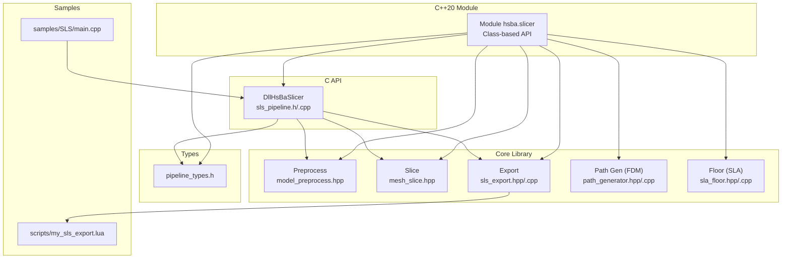
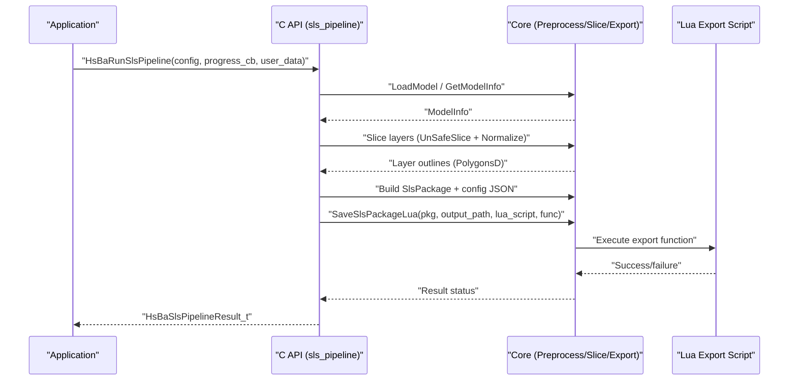
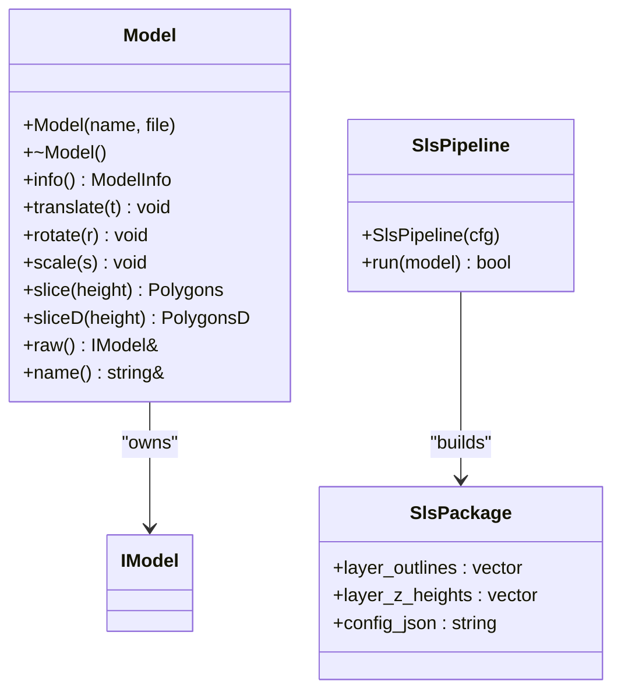
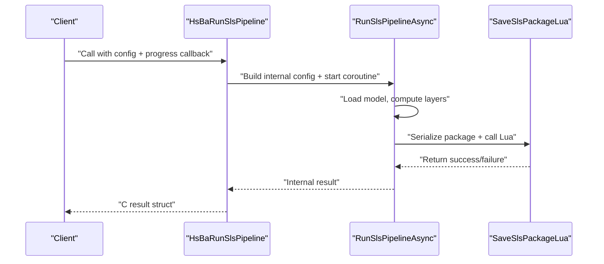
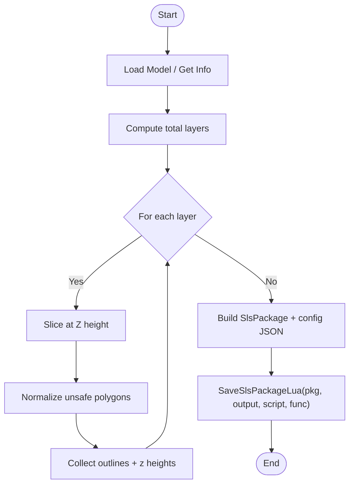
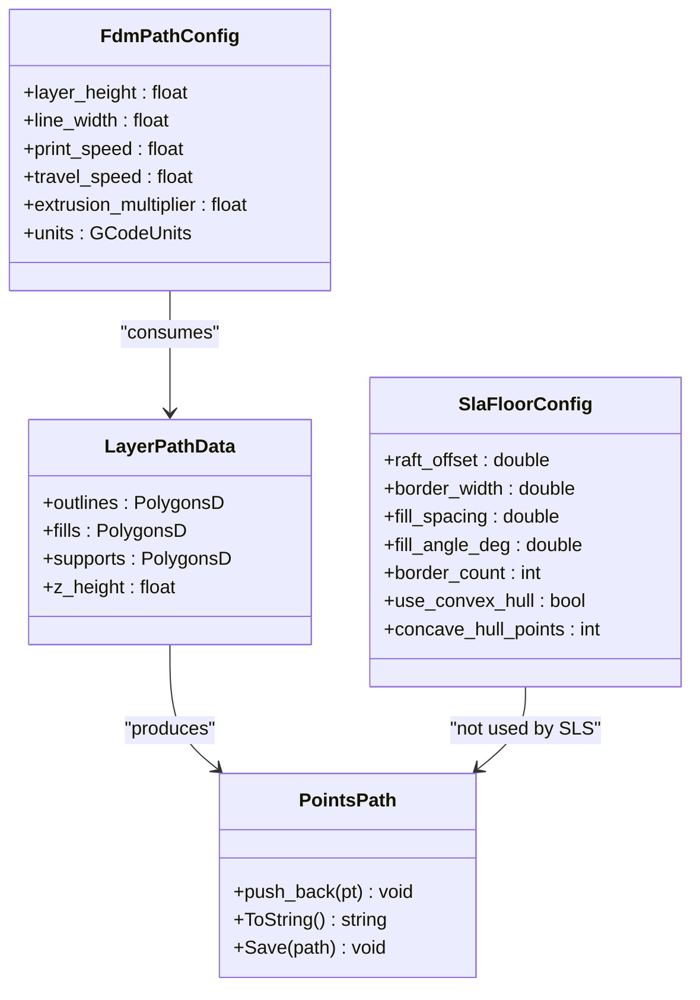
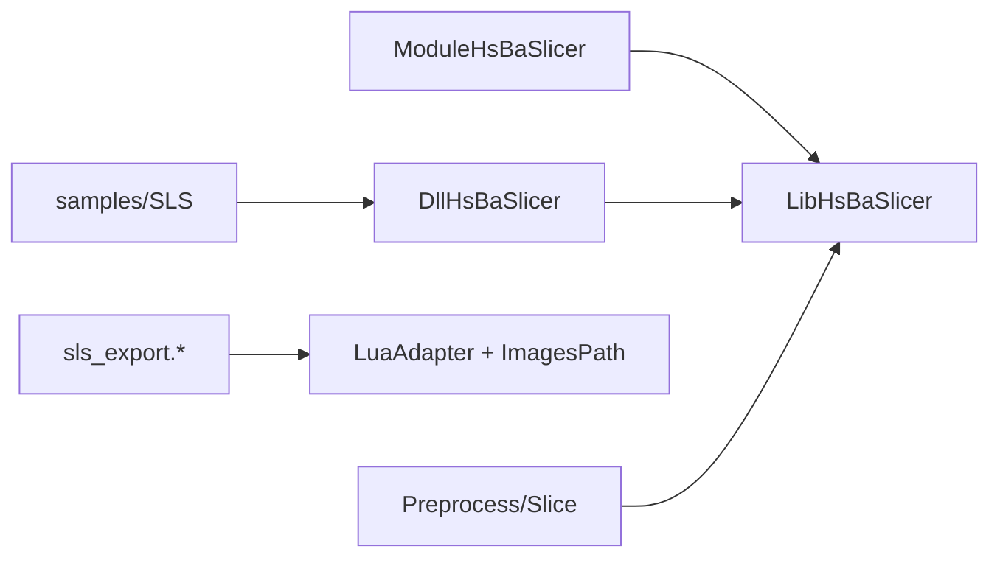

# SLS Pipeline System

<cite>
**Referenced Files in This Document**
- [hsba_slicer.cppm](file://ModuleHsBaSlicer/hsba_slicer.cppm)
- [sls_pipeline.h](file://DllHsBaSlicer/sls_pipeline.h)
- [sls_pipeline.cpp](file://DllHsBaSlicer/sls_pipeline.cpp)
- [sls_export.hpp](file://LibHsBaSlicer/Path/sls_export.hpp)
- [sls_export.cpp](file://LibHsBaSlicer/Path/sls_export.cpp)
- [pipeline_types.h](file://pipelinetypes/pipeline_types.h)
- [path_generator.hpp](file://LibHsBaSlicer/Path/path_generator.hpp)
- [path_generator.cpp](file://LibHsBaSlicer/Path/path_generator.cpp)
- [model_preprocess.hpp](file://LibHsBaSlicer/Preprocess/model_preprocess.hpp)
- [mesh_slice.hpp](file://LibHsBaSlicer/Slice/mesh_slice.hpp)
- [sla_floor.hpp](file://LibHsBaSlicer/Floor/sla_floor.hpp)
- [sla_floor.cpp](file://LibHsBaSlicer/Floor/sla_floor.cpp)
- [main.cpp](file://samples/SLS/main.cpp)
- [my_sls_export.lua](file://samples/SLS/scripts/my_sls_export.lua)
</cite>

## Table of Contents
1. [Introduction](#introduction)
2. [Project Structure](#project-structure)
3. [Core Components](#core-components)
4. [Architecture Overview](#architecture-overview)
5. [Detailed Component Analysis](#detailed-component-analysis)
6. [Dependency Analysis](#dependency-analysis)
7. [Performance Considerations](#performance-considerations)
8. [Troubleshooting Guide](#troubleshooting-guide)
9. [Conclusion](#conclusion)
10. [Appendices](#appendices)

## Introduction
This document explains the SLS (Selective Laser Sintering) pipeline system within HsBaSlicer. The SLS pipeline is a powder-bed process that requires no floor or support structures; instead, it slices the model into layers and delegates output packaging to a Lua export script. The system provides:
- A C API for synchronous and asynchronous execution with progress callbacks
- A C++20 module wrapper exposing a modern class-based API
- Core slicing and export utilities
- Sample usage and a sample Lua export script

The design emphasizes modularity, clear separation between core algorithms and user-facing APIs, and extensibility via Lua scripts for custom export logic.

## Project Structure
Key directories and files involved in the SLS pipeline:
- ModuleHsBaSlicer: C++20 module wrapper providing a class-based API
- DllHsBaSlicer: C API entry points for SLS pipeline (sync/async)
- LibHsBaSlicer: Core libraries including slicing, path generation, and SLS export
- pipelinetypes: C-compatible configuration/result types
- samples/SLS: Example application and Lua export script

**Diagram sources**
- [hsba_slicer.cppm:1-642](file://ModuleHsBaSlicer/hsba_slicer.cppm#L1-L642)
- [sls_pipeline.h:1-60](file://DllHsBaSlicer/sls_pipeline.h#L1-L60)
- [sls_pipeline.cpp:1-316](file://DllHsBaSlicer/sls_pipeline.cpp#L1-L316)
- [sls_export.hpp:1-52](file://LibHsBaSlicer/Path/sls_export.hpp#L1-L52)
- [sls_export.cpp:1-97](file://LibHsBaSlicer/Path/sls_export.cpp#L1-L97)
- [pipeline_types.h:1-400](file://pipelinetypes/pipeline_types.h#L1-L400)
- [path_generator.hpp:1-62](file://LibHsBaSlicer/Path/path_generator.hpp#L1-L62)
- [path_generator.cpp:1-89](file://LibHsBaSlicer/Path/path_generator.cpp#L1-L89)
- [model_preprocess.hpp:1-88](file://LibHsBaSlicer/Preprocess/model_preprocess.hpp#L1-L88)
- [mesh_slice.hpp:1-41](file://LibHsBaSlicer/Slice/mesh_slice.hpp#L1-L41)
- [sla_floor.hpp:1-183](file://LibHsBaSlicer/Floor/sla_floor.hpp#L1-L183)
- [sla_floor.cpp:1-465](file://LibHsBaSlicer/Floor/sla_floor.cpp#L1-L465)
- [main.cpp:1-219](file://samples/SLS/main.cpp#L1-L219)
- [my_sls_export.lua:1-80](file://samples/SLS/scripts/my_sls_export.lua#L1-L80)

**Section sources**
- [hsba_slicer.cppm:1-642](file://ModuleHsBaSlicer/hsba_slicer.cppm#L1-L642)
- [sls_pipeline.h:1-60](file://DllHsBaSlicer/sls_pipeline.h#L1-L60)
- [sls_pipeline.cpp:1-316](file://DllHsBaSlicer/sls_pipeline.cpp#L1-L316)
- [sls_export.hpp:1-52](file://LibHsBaSlicer/Path/sls_export.hpp#L1-L52)
- [sls_export.cpp:1-97](file://LibHsBaSlicer/Path/sls_export.cpp#L1-L97)
- [pipeline_types.h:1-400](file://pipelinetypes/pipeline_types.h#L1-L400)
- [path_generator.hpp:1-62](file://LibHsBaSlicer/Path/path_generator.hpp#L1-L62)
- [path_generator.cpp:1-89](file://LibHsBaSlicer/Path/path_generator.cpp#L1-L89)
- [model_preprocess.hpp:1-88](file://LibHsBaSlicer/Preprocess/model_preprocess.hpp#L1-L88)
- [mesh_slice.hpp:1-41](file://LibHsBaSlicer/Slice/mesh_slice.hpp#L1-L41)
- [sla_floor.hpp:1-183](file://LibHsBaSlicer/Floor/sla_floor.hpp#L1-L183)
- [sla_floor.cpp:1-465](file://LibHsBaSlicer/Floor/sla_floor.cpp#L1-L465)
- [main.cpp:1-219](file://samples/SLS/main.cpp#L1-L219)
- [my_sls_export.lua:1-80](file://samples/SLS/scripts/my_sls_export.lua#L1-L80)

## Core Components
- C++20 Module Wrapper (ModuleHsBaSlicer): Provides a modern RAII Model class and pipeline classes (FdmPipeline, SlaPipeline, SlsPipeline). It re-exports convenient type aliases and default config factories while forwarding calls to LibHsBaSlicer free functions.
- C API (DllHsBaSlicer): Exposes C-compatible functions for creating configs, running pipelines synchronously/asynchronously, and freeing results. Internally uses coroutines for async execution and progress callbacks.
- Core Libraries (LibHsBaSlicer):
  - Preprocess: Model loading, transforms, info retrieval
  - Slice: Safe and unsafe slicing, normalization helpers
  - Path Generation (FDM): G-code path generation from layer data
  - Floor (SLA): Floor/raft generation and image rendering
  - SLS Export: Serialization of layer outlines and configuration JSON, and invocation of Lua export script
- Types (pipelinetypes): C-compatible structs and enums for FDM/SLA/SLS configurations and results, plus default initializers.
- Samples: Example application demonstrating basic, custom, and async SLS runs; sample Lua export script showing zip packaging and optional database registration.

**Section sources**
- [hsba_slicer.cppm:1-642](file://ModuleHsBaSlicer/hsba_slicer.cppm#L1-L642)
- [sls_pipeline.h:1-60](file://DllHsBaSlicer/sls_pipeline.h#L1-L60)
- [sls_pipeline.cpp:1-316](file://DllHsBaSlicer/sls_pipeline.cpp#L1-L316)
- [sls_export.hpp:1-52](file://LibHsBaSlicer/Path/sls_export.hpp#L1-L52)
- [sls_export.cpp:1-97](file://LibHsBaSlicer/Path/sls_export.cpp#L1-L97)
- [pipeline_types.h:1-400](file://pipelinetypes/pipeline_types.h#L1-L400)
- [path_generator.hpp:1-62](file://LibHsBaSlicer/Path/path_generator.hpp#L1-L62)
- [path_generator.cpp:1-89](file://LibHsBaSlicer/Path/path_generator.cpp#L1-L89)
- [model_preprocess.hpp:1-88](file://LibHsBaSlicer/Preprocess/model_preprocess.hpp#L1-L88)
- [mesh_slice.hpp:1-41](file://LibHsBaSlicer/Slice/mesh_slice.hpp#L1-L41)
- [sla_floor.hpp:1-183](file://LibHsBaSlicer/Floor/sla_floor.hpp#L1-L183)
- [sla_floor.cpp:1-465](file://LibHsBaSlicer/Floor/sla_floor.cpp#L1-L465)
- [main.cpp:1-219](file://samples/SLS/main.cpp#L1-L219)
- [my_sls_export.lua:1-80](file://samples/SLS/scripts/my_sls_export.lua#L1-L80)

## Architecture Overview
The SLS pipeline architecture separates concerns across three layers:
- User-facing APIs: C++20 module and C API
- Core processing: Model preprocessing, slicing, and export serialization
- Extensibility: Lua-driven export for flexible packaging and database integration

**Diagram sources**
- [sls_pipeline.cpp:169-270](file://DllHsBaSlicer/sls_pipeline.cpp#L169-L270)
- [sls_export.hpp:1-52](file://LibHsBaSlicer/Path/sls_export.hpp#L1-L52)
- [sls_export.cpp:50-94](file://LibHsBaSlicer/Path/sls_export.cpp#L50-L94)
- [mesh_slice.hpp:1-41](file://LibHsBaSlicer/Slice/mesh_slice.hpp#L1-L41)
- [model_preprocess.hpp:1-88](file://LibHsBaSlicer/Preprocess/model_preprocess.hpp#L1-L88)

## Detailed Component Analysis

### C++20 Module Wrapper (ModuleHsBaSlicer)
The module exposes a clean, exception-based API:
- Model: RAII wrapper around model lifecycle (load, transform, slice)
- SlsPipeline: High-level run() method orchestrating slicing and Lua export
- Type aliases and default config factories for convenience

**Diagram sources**
- [hsba_slicer.cppm:114-152](file://ModuleHsBaSlicer/hsba_slicer.cppm#L114-L152)
- [hsba_slicer.cppm:226-237](file://ModuleHsBaSlicer/hsba_slicer.cppm#L226-L237)
- [sls_export.hpp:20-25](file://LibHsBaSlicer/Path/sls_export.hpp#L20-L25)

**Section sources**
- [hsba_slicer.cppm:1-642](file://ModuleHsBaSlicer/hsba_slicer.cppm#L1-L642)

### C API (DllHsBaSlicer)
Provides:
- Default config creation
- Synchronous and asynchronous pipeline execution
- Progress callbacks and result cleanup

**Diagram sources**
- [sls_pipeline.h:17-53](file://DllHsBaSlicer/sls_pipeline.h#L17-L53)
- [sls_pipeline.cpp:276-315](file://DllHsBaSlicer/sls_pipeline.cpp#L276-L315)
- [sls_pipeline.cpp:169-270](file://DllHsBaSlicer/sls_pipeline.cpp#L169-L270)
- [sls_export.cpp:50-94](file://LibHsBaSlicer/Path/sls_export.cpp#L50-L94)

**Section sources**
- [sls_pipeline.h:1-60](file://DllHsBaSlicer/sls_pipeline.h#L1-L60)
- [sls_pipeline.cpp:1-316](file://DllHsBaSlicer/sls_pipeline.cpp#L1-L316)

### Core Processing (Preprocess, Slice, Export)
- Preprocess: Load models, retrieve bounding box/volume, apply transforms
- Slice: Generate safe or unsafe polygons; normalize unsafe polygons to double precision
- Export: Serialize layer outlines and configuration JSON; invoke Lua export script

**Diagram sources**
- [model_preprocess.hpp:1-88](file://LibHsBaSlicer/Preprocess/model_preprocess.hpp#L1-L88)
- [mesh_slice.hpp:1-41](file://LibHsBaSlicer/Slice/mesh_slice.hpp#L1-L41)
- [sls_export.hpp:1-52](file://LibHsBaSlicer/Path/sls_export.hpp#L1-L52)
- [sls_export.cpp:50-94](file://LibHsBaSlicer/Path/sls_export.cpp#L50-L94)

**Section sources**
- [model_preprocess.hpp:1-88](file://LibHsBaSlicer/Preprocess/model_preprocess.hpp#L1-L88)
- [mesh_slice.hpp:1-41](file://LibHsBaSlicer/Slice/mesh_slice.hpp#L1-L41)
- [sls_export.hpp:1-52](file://LibHsBaSlicer/Path/sls_export.hpp#L1-L52)
- [sls_export.cpp:1-97](file://LibHsBaSlicer/Path/sls_export.cpp#L1-L97)

### Supporting Components (FDM Path Generation and SLA Floor)
Although not used by SLS directly, these components are part of the same library surface exposed by the module:
- FDM Path Generation: Converts layer outlines/fills/supports into G-code paths
- SLA Floor: Generates raft/border/fill and renders images for SLA packages

**Diagram sources**
- [path_generator.hpp:18-37](file://LibHsBaSlicer/Path/path_generator.hpp#L18-L37)
- [path_generator.cpp:54-86](file://LibHsBaSlicer/Path/path_generator.cpp#L54-L86)
- [sla_floor.hpp:20-29](file://LibHsBaSlicer/Floor/sla_floor.hpp#L20-L29)

**Section sources**
- [path_generator.hpp:1-62](file://LibHsBaSlicer/Path/path_generator.hpp#L1-L62)
- [path_generator.cpp:1-89](file://LibHsBaSlicer/Path/path_generator.cpp#L1-L89)
- [sla_floor.hpp:1-183](file://LibHsBaSlicer/Floor/sla_floor.hpp#L1-L183)
- [sla_floor.cpp:1-465](file://LibHsBaSlicer/Floor/sla_floor.cpp#L1-L465)

### Configuration and Results (C-Compatible Types)
Defines C-compatible structs and enums for all pipelines, including SLS:
- HsBaSlsPipelineConfig_t: Model, slice, laser, Lua export, and output fields
- HsBaSlsPipelineResult_t: Success flag, total layers, export path, error message, elapsed time
- Default initializer: HsBaSlsConfigDefault()

**Section sources**
- [pipeline_types.h:224-287](file://pipelinetypes/pipeline_types.h#L224-L287)
- [pipeline_types.h:377-393](file://pipelinetypes/pipeline_types.h#L377-L393)

### Sample Usage and Lua Export
- main.cpp demonstrates basic, custom parameter, and async SLS pipeline usage
- my_sls_export.lua shows how to create a zip archive with config and per-layer JSON, and optionally register records in SQLite

**Section sources**
- [main.cpp:1-219](file://samples/SLS/main.cpp#L1-L219)
- [my_sls_export.lua:1-80](file://samples/SLS/scripts/my_sls_export.lua#L1-L80)

## Dependency Analysis
High-level dependencies among components:
- ModuleHsBaSlicer depends on LibHsBaSlicer headers and types
- DllHsBaSlicer depends on LibHsBaSlicer core and coroutine utilities
- SLS export depends on ImagesPath and LuaAdapter for packaging and scripting
- Samples depend on DllHsBaSlicer C API

**Diagram sources**
- [hsba_slicer.cppm:1-642](file://ModuleHsBaSlicer/hsba_slicer.cppm#L1-L642)
- [sls_pipeline.cpp:1-316](file://DllHsBaSlicer/sls_pipeline.cpp#L1-L316)
- [sls_export.cpp:1-97](file://LibHsBaSlicer/Path/sls_export.cpp#L1-L97)

**Section sources**
- [hsba_slicer.cppm:1-642](file://ModuleHsBaSlicer/hsba_slicer.cppm#L1-L642)
- [sls_pipeline.cpp:1-316](file://DllHsBaSlicer/sls_pipeline.cpp#L1-L316)
- [sls_export.cpp:1-97](file://LibHsBaSlicer/Path/sls_export.cpp#L1-L97)

## Performance Considerations
- Asynchronous execution: The C API uses coroutines to avoid blocking the caller during long-running operations.
- Memory management: Use provided free functions for C results to prevent leaks.
- Polygon normalization: Normalizing unsafe polygons ensures downstream stability but adds overhead; consider batch processing if needed.
- Image rendering (SLA): Rendering large images can be expensive; adjust width/height appropriately.
- Lua script performance: Keep export scripts efficient; avoid heavy computations inside Lua when possible.

[No sources needed since this section provides general guidance]

## Troubleshooting Guide
Common issues and resolutions:
- Missing Lua export script: SLS requires export_lua_script; ensure the path is valid and accessible.
- Invalid model path or unsupported format: Verify model_name and model_path; check supported formats.
- Zero or negative model height: Ensure the model has non-zero volume and correct orientation.
- Lua script errors: Check function name and global variables (config, images, output_path); review registered libraries availability.
- Result memory not freed: Always call the free function for C results after use.

**Section sources**
- [sls_pipeline.cpp:222-227](file://DllHsBaSlicer/sls_pipeline.cpp#L222-L227)
- [sls_pipeline.cpp:174-201](file://DllHsBaSlicer/sls_pipeline.cpp#L174-L201)
- [sls_export.cpp:50-94](file://LibHsBaSlicer/Path/sls_export.cpp#L50-L94)
- [sls_pipeline.h:46-53](file://DllHsBaSlicer/sls_pipeline.h#L46-L53)

## Conclusion
The SLS pipeline system offers a robust, extensible framework for powder-bed additive manufacturing workflows. By separating core slicing/export logic from user-facing APIs and leveraging Lua for customization, it balances flexibility with ease of use. The C++20 module wrapper provides a modern interface for C++ consumers, while the C API supports broader integrations.

[No sources needed since this section summarizes without analyzing specific files]

## Appendices

### API Reference Summary
- C API:
  - HsBaCreateDefaultSlsConfig(): Create default SLS config
  - HsBaRunSlsPipeline(): Run synchronously with progress callback
  - HsBaRunSlsPipelineAsync(): Run asynchronously with completion callback
  - HsBaFreeSlsPipelineResult(): Free result memory
- C++20 Module:
  - SlsPipeline::run(const Model&): Execute full SLS pipeline
  - Model: RAII model handle with transformations and slicing
- Core Functions:
  - SaveSlsPackageLua(): Serialize package and invoke Lua export script

**Section sources**
- [sls_pipeline.h:17-53](file://DllHsBaSlicer/sls_pipeline.h#L17-L53)
- [hsba_slicer.cppm:226-237](file://ModuleHsBaSlicer/hsba_slicer.cppm#L226-L237)
- [sls_export.hpp:45-47](file://LibHsBaSlicer/Path/sls_export.hpp#L45-L47)