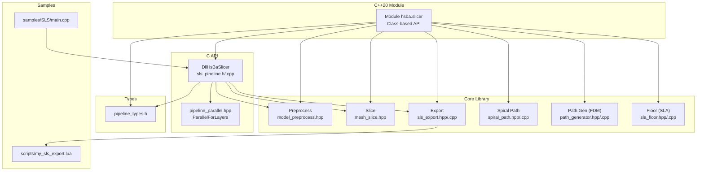
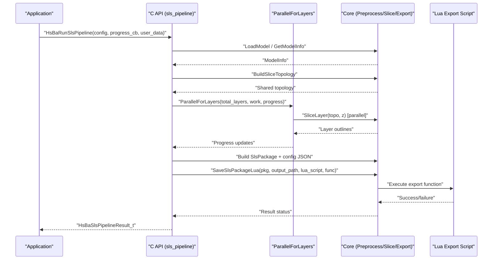
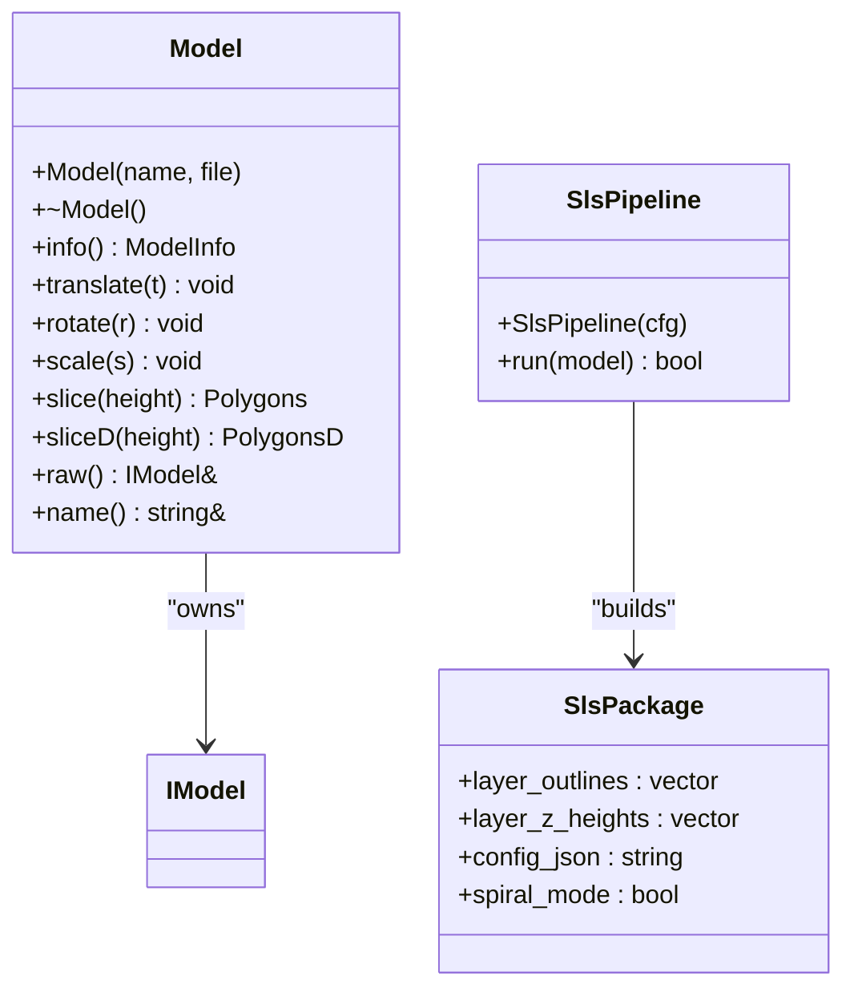
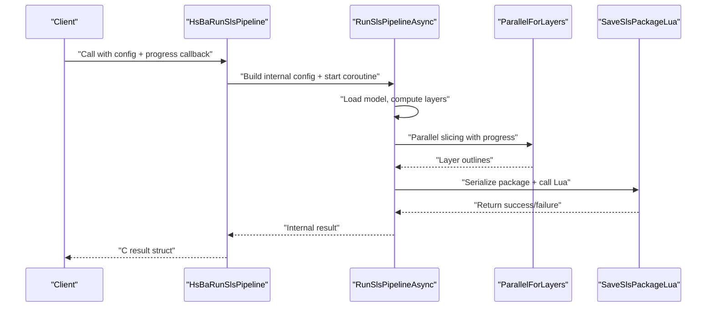
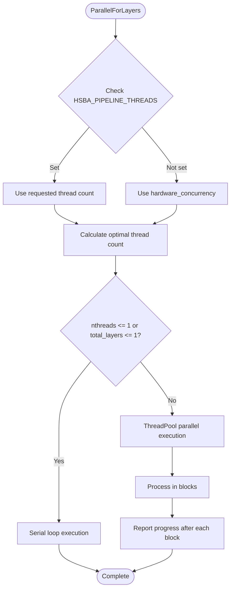
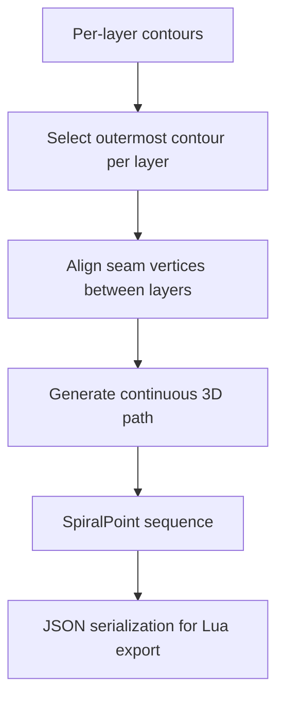
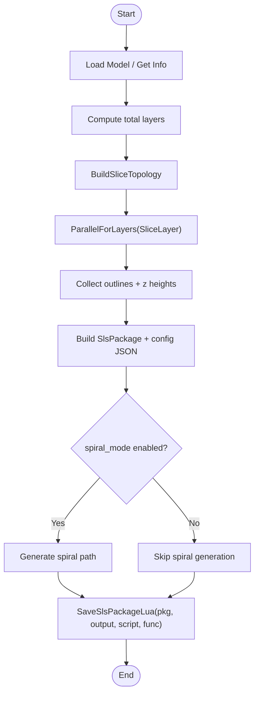
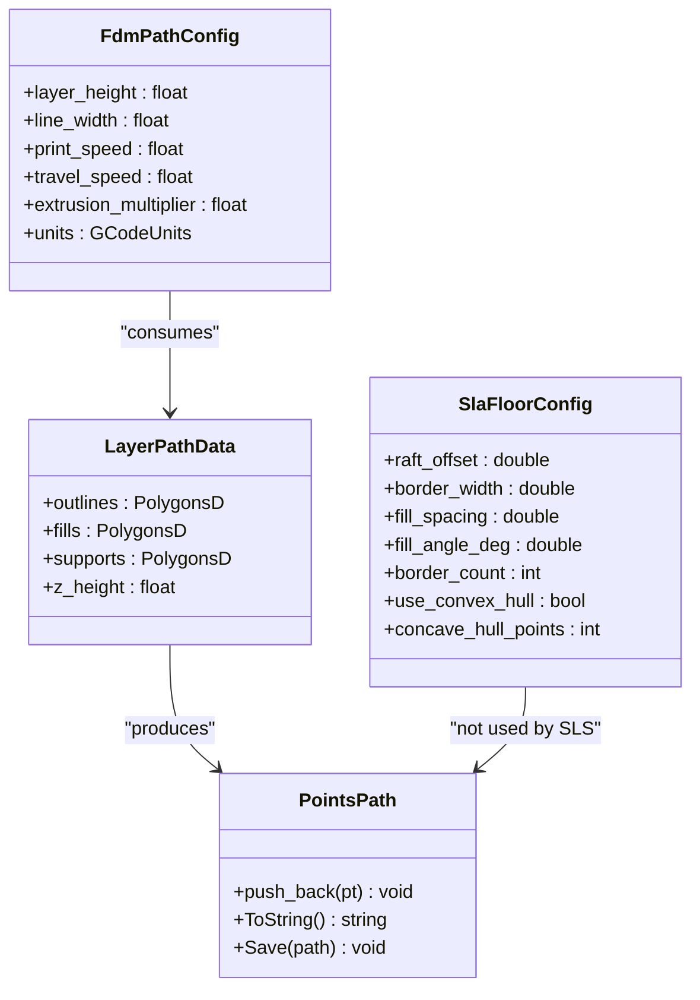
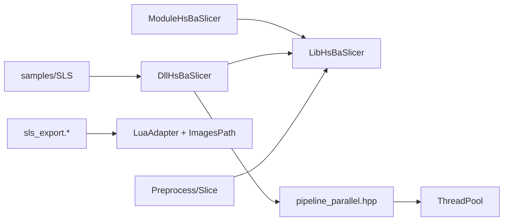

# SLS Pipeline System

<cite>
**Referenced Files in This Document**
- [hsba_slicer.cppm](file://ModuleHsBaSlicer/hsba_slicer.cppm)
- [sls_pipeline.h](file://DllHsBaSlicer/sls_pipeline.h)
- [sls_pipeline.cpp](file://DllHsBaSlicer/sls_pipeline.cpp)
- [pipeline_parallel.hpp](file://DllHsBaSlicer/pipeline_parallel.hpp)
- [sls_export.hpp](file://LibHsBaSlicer/Path/sls_export.hpp)
- [sls_export.cpp](file://LibHsBaSlicer/Path/sls_export.cpp)
- [spiral_path.hpp](file://LibHsBaSlicer/Path/spiral_path.hpp)
- [spiral_path.cpp](file://LibHsBaSlicer/Path/spiral_path.cpp)
- [pipeline_types.h](file://pipelinetypes/pipeline_types.h)
- [path_generator.hpp](file://LibHsBaSlicer/Path/path_generator.hpp)
- [path_generator.cpp](file://LibHsBaSlicer/Path/path_generator.cpp)
- [model_preprocess.hpp](file://LibHsBaSlicer/Preprocess/model_preprocess.hpp)
- [mesh_slice.hpp](file://LibHsBaSlicer/Slice/mesh_slice.hpp)
- [sla_floor.hpp](file://LibHsBaSlicer/Floor/sla_floor.hpp)
- [sla_floor.cpp](file://LibHsBaSlicer/Floor/sla_floor.cpp)
- [main.cpp](file://samples/SLS/main.cpp)
- [my_sls_export.lua](file://samples/SLS/scripts/my_sls_export.lua)
</cite>

## Update Summary
**Changes Made**
- Enhanced parallel processing with `ParallelForLayers` for improved slicing performance
- Improved error handling with comprehensive exception management and detailed error messages
- Added spiral/vase mode support for continuous 3D path generation
- Enhanced memory management with proper resource cleanup
- Added environment-based thread control for performance tuning

## Table of Contents
1. [Introduction](#introduction)
2. [Project Structure](#project-structure)
3. [Core Components](#core-components)
4. [Architecture Overview](#architecture-overview)
5. [Detailed Component Analysis](#detailed-component-analysis)
6. [Performance Enhancements](#performance-enhancements)
7. [Error Handling Improvements](#error-handling-improvements)
8. [Dependency Analysis](#dependency-analysis)
9. [Troubleshooting Guide](#troubleshooting-guide)
10. [Conclusion](#conclusion)
11. [Appendices](#appendices)

## Introduction
This document explains the enhanced SLS (Selective Laser Sintering) pipeline system within HsBaSlicer. The SLS pipeline is a powder-bed process that requires no floor or support structures; instead, it slices the model into layers and delegates output packaging to a Lua export script. The system provides:
- A C API for synchronous and asynchronous execution with progress callbacks
- A C++20 module wrapper exposing a modern class-based API
- Core slicing and export utilities with parallel processing
- Spiral/vase mode support for continuous 3D path generation
- Comprehensive error handling and performance optimizations
- Sample usage and a sample Lua export script

The design emphasizes modularity, clear separation between core algorithms and user-facing APIs, extensibility via Lua scripts for custom export logic, and high-performance parallel processing.

## Project Structure
Key directories and files involved in the enhanced SLS pipeline:
- ModuleHsBaSlicer: C++20 module wrapper providing a class-based API
- DllHsBaSlicer: C API entry points for SLS pipeline (sync/async) with parallel processing
- LibHsBaSlicer: Core libraries including slicing, path generation, spiral path generation, and SLS export
- pipelinetypes: C-compatible configuration/result types
- samples/SLS: Example application and Lua export script

```mermaid
graph TB
subgraph "C++20 Module"
M["Module hsba.slicer<br/>Class-based API"]
end
subgraph "C API"
CAPI["DllHsBaSlicer<br/>sls_pipeline.h/.cpp"]
PARALLEL["pipeline_parallel.hpp<br/>ParallelForLayers"]
end
subgraph "Core Library"
PRE["Preprocess<br/>model_preprocess.hpp"]
SLI["Slice<br/>mesh_slice.hpp"]
EXP["Export<br/>sls_export.hpp/.cpp"]
SPIRAL["Spiral Path<br/>spiral_path.hpp/.cpp"]
PATH["Path Gen (FDM)<br/>path_generator.hpp/.cpp"]
FLOOR["Floor (SLA)<br/>sla_floor.hpp/.cpp"]
end
subgraph "Types"
TYPES["pipeline_types.h"]
end
subgraph "Samples"
APP["samples/SLS/main.cpp"]
LUA["scripts/my_sls_export.lua"]
end
M --> CAPI
CAPI --> PRE
CAPI --> SLI
CAPI --> EXP
CAPI --> PARALLEL
M --> PRE
M --> SLI
M --> EXP
M --> SPIRAL
M --> PATH
M --> FLOOR
CAPI --> TYPES
M --> TYPES
APP --> CAPI
EXP --> LUA
```

**Diagram sources**
- [hsba_slicer.cppm:1-642](file://ModuleHsBaSlicer/hsba_slicer.cppm#L1-L642)
- [sls_pipeline.h:1-63](file://DllHsBaSlicer/sls_pipeline.h#L1-L63)
- [sls_pipeline.cpp:1-334](file://DllHsBaSlicer/sls_pipeline.cpp#L1-L334)
- [pipeline_parallel.hpp:1-122](file://DllHsBaSlicer/pipeline_parallel.hpp#L1-L122)
- [sls_export.hpp:1-61](file://LibHsBaSlicer/Path/sls_export.hpp#L1-L61)
- [sls_export.cpp:1-133](file://LibHsBaSlicer/Path/sls_export.cpp#L1-L133)
- [spiral_path.hpp:1-63](file://LibHsBaSlicer/Path/spiral_path.hpp#L1-L63)
- [spiral_path.cpp:1-54](file://LibHsBaSlicer/Path/spiral_path.cpp#L1-L54)
- [pipeline_types.h:1-400](file://pipelinetypes/pipeline_types.h#L1-L400)
- [path_generator.hpp:1-62](file://LibHsBaSlicer/Path/path_generator.hpp#L1-L62)
- [path_generator.cpp:1-89](file://LibHsBaSlicer/Path/path_generator.cpp#L1-L89)
- [model_preprocess.hpp:1-88](file://LibHsBaSlicer/Preprocess/model_preprocess.hpp#L1-L88)
- [mesh_slice.hpp:1-41](file://LibHsBaSlicer/Slice/mesh_slice.hpp#L1-L41)
- [sla_floor.hpp:1-183](file://LibHsBaSlicer/Floor/sla_floor.hpp#L1-L183)
- [sla_floor.cpp:1-465](file://LibHsBaSlicer/Floor/sla_floor.cpp#L1-L465)
- [main.cpp:1-209](file://samples/SLS/main.cpp#L1-L209)
- [my_sls_export.lua:1-80](file://samples/SLS/scripts/my_sls_export.lua#L1-L80)

**Section sources**
- [hsba_slicer.cppm:1-642](file://ModuleHsBaSlicer/hsba_slicer.cppm#L1-L642)
- [sls_pipeline.h:1-63](file://DllHsBaSlicer/sls_pipeline.h#L1-L63)
- [sls_pipeline.cpp:1-334](file://DllHsBaSlicer/sls_pipeline.cpp#L1-L334)
- [pipeline_parallel.hpp:1-122](file://DllHsBaSlicer/pipeline_parallel.hpp#L1-L122)
- [sls_export.hpp:1-61](file://LibHsBaSlicer/Path/sls_export.hpp#L1-L61)
- [sls_export.cpp:1-133](file://LibHsBaSlicer/Path/sls_export.cpp#L1-L133)
- [spiral_path.hpp:1-63](file://LibHsBaSlicer/Path/spiral_path.hpp#L1-L63)
- [spiral_path.cpp:1-54](file://LibHsBaSlicer/Path/spiral_path.cpp#L1-L54)
- [pipeline_types.h:1-400](file://pipelinetypes/pipeline_types.h#L1-L400)
- [path_generator.hpp:1-62](file://LibHsBaSlicer/Path/path_generator.hpp#L1-L62)
- [path_generator.cpp:1-89](file://LibHsBaSlicer/Path/path_generator.cpp#L1-L89)
- [model_preprocess.hpp:1-88](file://LibHsBaSlicer/Preprocess/model_preprocess.hpp#L1-L88)
- [mesh_slice.hpp:1-41](file://LibHsBaSlicer/Slice/mesh_slice.hpp#L1-L41)
- [sla_floor.hpp:1-183](file://LibHsBaSlicer/Floor/sla_floor.hpp#L1-L183)
- [sla_floor.cpp:1-465](file://LibHsBaSlicer/Floor/sla_floor.cpp#L1-L465)
- [main.cpp:1-209](file://samples/SLS/main.cpp#L1-L209)
- [my_sls_export.lua:1-80](file://samples/SLS/scripts/my_sls_export.lua#L1-L80)

## Core Components
- C++20 Module Wrapper (ModuleHsBaSlicer): Provides a modern RAII Model class and pipeline classes (FdmPipeline, SlaPipeline, SlsPipeline). It re-exports convenient type aliases and default config factories while forwarding calls to LibHsBaSlicer free functions.
- C API (DllHsBaSlicer): Exposes C-compatible functions for creating configs, running pipelines synchronously/asynchronously, and freeing results. Internally uses coroutines for async execution and progress callbacks.
- Parallel Processing Engine (`pipeline_parallel.hpp`): Header-only parallel execution helper that distributes layer processing across multiple threads using ThreadPool, with environment-based thread control.
- Core Libraries (LibHsBaSlicer):
  - Preprocess: Model loading, transforms, info retrieval
  - Slice: Safe and unsafe slicing, normalization helpers
  - Spiral Path Generation: Continuous 3D helical path generation for vase/spiral modes
  - Path Generation (FDM): G-code path generation from layer data
  - Floor (SLA): Floor/raft generation and image rendering
  - SLS Export: Serialization of layer outlines and configuration JSON, and invocation of Lua export script
- Types (pipelinetypes): C-compatible structs and enums for FDM/SLA/SLS configurations and results, plus default initializers.
- Samples: Example application demonstrating basic, custom, and async SLS runs; sample Lua export script showing zip packaging and optional database registration.

**Section sources**
- [hsba_slicer.cppm:1-642](file://ModuleHsBaSlicer/hsba_slicer.cppm#L1-L642)
- [sls_pipeline.h:1-63](file://DllHsBaSlicer/sls_pipeline.h#L1-L63)
- [sls_pipeline.cpp:1-334](file://DllHsBaSlicer/sls_pipeline.cpp#L1-L334)
- [pipeline_parallel.hpp:1-122](file://DllHsBaSlicer/pipeline_parallel.hpp#L1-L122)
- [sls_export.hpp:1-61](file://LibHsBaSlicer/Path/sls_export.hpp#L1-L61)
- [sls_export.cpp:1-133](file://LibHsBaSlicer/Path/sls_export.cpp#L1-L133)
- [spiral_path.hpp:1-63](file://LibHsBaSlicer/Path/spiral_path.hpp#L1-L63)
- [spiral_path.cpp:1-54](file://LibHsBaSlicer/Path/spiral_path.cpp#L1-L54)
- [pipeline_types.h:1-400](file://pipelinetypes/pipeline_types.h#L1-L400)
- [path_generator.hpp:1-62](file://LibHsBaSlicer/Path/path_generator.hpp#L1-L62)
- [path_generator.cpp:1-89](file://LibHsBaSlicer/Path/path_generator.cpp#L1-L89)
- [model_preprocess.hpp:1-88](file://LibHsBaSlicer/Preprocess/model_preprocess.hpp#L1-L88)
- [mesh_slice.hpp:1-41](file://LibHsBaSlicer/Slice/mesh_slice.hpp#L1-L41)
- [sla_floor.hpp:1-183](file://LibHsBaSlicer/Floor/sla_floor.hpp#L1-L183)
- [sla_floor.cpp:1-465](file://LibHsBaSlicer/Floor/sla_floor.cpp#L1-L465)
- [main.cpp:1-209](file://samples/SLS/main.cpp#L1-L209)
- [my_sls_export.lua:1-80](file://samples/SLS/scripts/my_sls_export.lua#L1-L80)

## Architecture Overview
The enhanced SLS pipeline architecture separates concerns across three layers with parallel processing capabilities:
- User-facing APIs: C++20 module and C API
- Core processing: Model preprocessing, parallel slicing, and export serialization
- Extensibility: Lua-driven export for flexible packaging and database integration

```mermaid
sequenceDiagram
participant App as "Application"
participant CAPI as "C API (sls_pipeline)"
participant Parallel as "ParallelForLayers"
participant Core as "Core (Preprocess/Slice/Export)"
participant Lua as "Lua Export Script"
App->>CAPI : "HsBaRunSlsPipeline(config, progress_cb, user_data)"
CAPI->>Core : "LoadModel / GetModelInfo"
Core-->>CAPI : "ModelInfo"
CAPI->>Core : "BuildSliceTopology"
Core-->>CAPI : "Shared topology"
CAPI->>Parallel : "ParallelForLayers(total_layers, work, progress)"
Parallel->>Core : "SliceLayer(topo, z) [parallel]"
Core-->>Parallel : "Layer outlines"
Parallel-->>CAPI : "Progress updates"
CAPI->>Core : "Build SlsPackage + config JSON"
CAPI->>Core : "SaveSlsPackageLua(pkg, output_path, lua_script, func)"
Core->>Lua : "Execute export function"
Lua-->>Core : "Success/failure"
Core-->>CAPI : "Result status"
CAPI-->>App : "HsBaSlsPipelineResult_t"
```

**Diagram sources**
- [sls_pipeline.cpp:176-289](file://DllHsBaSlicer/sls_pipeline.cpp#L176-L289)
- [pipeline_parallel.hpp:41-117](file://DllHsBaSlicer/pipeline_parallel.hpp#L41-L117)
- [sls_export.hpp:1-61](file://LibHsBaSlicer/Path/sls_export.hpp#L1-L61)
- [sls_export.cpp:72-130](file://LibHsBaSlicer/Path/sls_export.cpp#L72-L130)
- [mesh_slice.hpp:1-41](file://LibHsBaSlicer/Slice/mesh_slice.hpp#L1-L41)
- [model_preprocess.hpp:1-88](file://LibHsBaSlicer/Preprocess/model_preprocess.hpp#L1-L88)

## Detailed Component Analysis

### C++20 Module Wrapper (ModuleHsBaSlicer)
The module exposes a clean, exception-based API:
- Model: RAII wrapper around model lifecycle (load, transform, slice)
- SlsPipeline: High-level run() method orchestrating slicing and Lua export
- Type aliases and default config factories for convenience

```mermaid
classDiagram
class Model {
+Model(name, file)
+~Model()
+info() ModelInfo
+translate(t) void
+rotate(r) void
+scale(s) void
+slice(height) Polygons
+sliceD(height) PolygonsD
+raw() IModel&
+name() string&
}
class SlsPipeline {
+SlsPipeline(cfg)
+run(model) bool
}
class SlsPackage {
+layer_outlines : vector<PolygonsD>
+layer_z_heights : vector<float>
+config_json : string
+spiral_mode : bool
}
Model --> IModel : "owns"
SlsPipeline --> SlsPackage : "builds"
```

**Diagram sources**
- [hsba_slicer.cppm:114-152](file://ModuleHsBaSlicer/hsba_slicer.cppm#L114-L152)
- [hsba_slicer.cppm:226-237](file://ModuleHsBaSlicer/hsba_slicer.cppm#L226-L237)
- [sls_export.hpp:24-33](file://LibHsBaSlicer/Path/sls_export.hpp#L24-L33)

**Section sources**
- [hsba_slicer.cppm:1-642](file://ModuleHsBaSlicer/hsba_slicer.cppm#L1-L642)

### C API (DllHsBaSlicer)
Provides:
- Default config creation
- Synchronous and asynchronous pipeline execution
- Progress callbacks and result cleanup
- Enhanced error handling with detailed error messages

```mermaid
sequenceDiagram
participant Client as "Client"
participant API as "HsBaRunSlsPipeline"
participant Task as "RunSlsPipelineAsync"
participant Parallel as "ParallelForLayers"
participant Export as "SaveSlsPackageLua"
Client->>API : "Call with config + progress callback"
API->>Task : "Build internal config + start coroutine"
Task->>Task : "Load model, compute layers"
Task->>Parallel : "Parallel slicing with progress"
Parallel-->>Task : "Layer outlines"
Task->>Export : "Serialize package + call Lua"
Export-->>Task : "Return success/failure"
Task-->>API : "Internal result"
API-->>Client : "C result struct"
```

**Diagram sources**
- [sls_pipeline.h:17-56](file://DllHsBaSlicer/sls_pipeline.h#L17-L56)
- [sls_pipeline.cpp:300-325](file://DllHsBaSlicer/sls_pipeline.cpp#L300-L325)
- [sls_pipeline.cpp:176-289](file://DllHsBaSlicer/sls_pipeline.cpp#L176-L289)
- [sls_export.cpp:72-130](file://LibHsBaSlicer/Path/sls_export.cpp#L72-L130)

**Section sources**
- [sls_pipeline.h:1-63](file://DllHsBaSlicer/sls_pipeline.h#L1-L63)
- [sls_pipeline.cpp:1-334](file://DllHsBaSlicer/sls_pipeline.cpp#L1-L334)

### Enhanced Parallel Processing Engine
The new `ParallelForLayers` function provides high-performance parallel execution:
- Environment-based thread control via `HSBA_PIPELINE_THREADS`
- Automatic fallback to serial execution when needed
- Block-based processing for efficient progress reporting
- Exception safety with proper error propagation

```mermaid
flowchart TD
Start(["ParallelForLayers"]) --> CheckEnv{"Check HSBA_PIPELINE_THREADS"}
CheckEnv --> |Set| SetThreads["Use requested thread count"]
CheckEnv --> |Not set| UseHW["Use hardware_concurrency"]
SetThreads --> CalcThreads["Calculate optimal thread count"]
UseHW --> CalcThreads
CalcThreads --> CheckSerial{"nthreads <= 1 or total_layers <= 1?"}
CheckSerial --> |Yes| SerialLoop["Serial loop execution"]
CheckSerial --> |No| ParallelExec["ThreadPool parallel execution"]
SerialLoop --> End(["Complete"])
ParallelExec --> Blocks["Process in blocks"]
Blocks --> Progress["Report progress after each block"]
Progress --> End
```

**Diagram sources**
- [pipeline_parallel.hpp:41-117](file://DllHsBaSlicer/pipeline_parallel.hpp#L41-L117)

**Section sources**
- [pipeline_parallel.hpp:1-122](file://DllHsBaSlicer/pipeline_parallel.hpp#L1-L122)

### Enhanced Error Handling System
Comprehensive error handling throughout the pipeline:
- Custom exception hierarchy with specific error types
- Proper exception translation and error message formatting
- Graceful error recovery and resource cleanup
- Detailed error reporting to callers

```mermaid
classDiagram
class RuntimeError {
+what() string
+message string
}
class OutOfRangeError {
+extends RuntimeError
}
class InvalidArgumentError {
+extends RuntimeError
}
class IOError {
+extends RuntimeError
}
class NotImplementedError {
+extends RuntimeError
}
class NullValueError {
+extends RuntimeError
}
class NotSupportedError {
+extends RuntimeError
}
class NotFoundError {
+extends RuntimeError
}
class AlreadyExistsError {
+extends RuntimeError
}
class PermissionDeniedError {
+extends RuntimeError
}
class TimeoutError {
+extends RuntimeError
}
class InterruptedError {
+extends RuntimeError
}
class CancelledError {
+extends RuntimeError
}
class OutOfMemoryError {
+extends RuntimeError
}
RuntimeError <|-- OutOfRangeError
RuntimeError <|-- InvalidArgumentError
RuntimeError <|-- IOError
RuntimeError <|-- NotImplementedError
RuntimeError <|-- NullValueError
RuntimeError <|-- NotSupportedError
RuntimeError <|-- NotFoundError
RuntimeError <|-- AlreadyExistsError
RuntimeError <|-- PermissionDeniedError
RuntimeError <|-- TimeoutError
RuntimeError <|-- InterruptedError
RuntimeError <|-- CancelledError
RuntimeError <|-- OutOfMemoryError
```

**Diagram sources**
- [error.hpp:20-144](file://base/error.hpp#L20-L144)

**Section sources**
- [sls_pipeline.cpp:279-288](file://DllHsBaSlicer/sls_pipeline.cpp#L279-L288)
- [sls_export.cpp:124-129](file://LibHsBaSlicer/Path/sls_export.cpp#L124-L129)
- [error.hpp:1-147](file://base/error.hpp#L1-L147)

### Spiral/Vase Mode Support
New spiral path generation capability for continuous 3D deposition:
- Continuous helical outer-wall path generation
- Seamless Z-rising between layers without retractions
- Optional spiral mode in SLS export package
- Integration with existing layer outline processing

```mermaid
flowchart TD
Input["Per-layer contours"] --> SelectOuter["Select outermost contour per layer"]
SelectOuter --> AlignSeam["Align seam vertices between layers"]
AlignSeam --> GeneratePath["Generate continuous 3D path"]
GeneratePath --> Output["SpiralPoint sequence"]
Output --> JSON["JSON serialization for Lua export"]
```

**Diagram sources**
- [spiral_path.hpp:31-58](file://LibHsBaSlicer/Path/spiral_path.hpp#L31-L58)
- [spiral_path.cpp:1-54](file://LibHsBaSlicer/Path/spiral_path.cpp#L1-L54)
- [sls_export.cpp:95-103](file://LibHsBaSlicer/Path/sls_export.cpp#L95-L103)

**Section sources**
- [spiral_path.hpp:1-63](file://LibHsBaSlicer/Path/spiral_path.hpp#L1-L63)
- [spiral_path.cpp:1-54](file://LibHsBaSlicer/Path/spiral_path.cpp#L1-L54)
- [sls_export.hpp:24-33](file://LibHsBaSlicer/Path/sls_export.hpp#L24-L33)
- [sls_export.cpp:95-103](file://LibHsBaSlicer/Path/sls_export.cpp#L95-L103)

### Core Processing (Preprocess, Slice, Export)
Enhanced core processing with parallel slicing:
- Preprocess: Load models, retrieve bounding box/volume, apply transforms
- Slice: Generate safe or unsafe polygons with parallel processing; normalize unsafe polygons to double precision
- Export: Serialize layer outlines and configuration JSON; invoke Lua export script with spiral mode support

```mermaid
flowchart TD
Start(["Start"]) --> Load["Load Model / Get Info"]
Load --> ComputeLayers["Compute total layers"]
ComputeLayers --> BuildTopo["BuildSliceTopology"]
BuildTopo --> ParallelSlice["ParallelForLayers(SliceLayer)"]
ParallelSlice --> Collect["Collect outlines + z heights"]
Collect --> BuildPkg["Build SlsPackage + config JSON"]
BuildPkg --> SpiralMode{"spiral_mode enabled?"}
SpiralMode --> |Yes| GenerateSpiral["Generate spiral path"]
SpiralMode --> |No| SkipSpiral["Skip spiral generation"]
GenerateSpiral --> ExportLua["SaveSlsPackageLua(pkg, output, script, func)"]
SkipSpiral --> ExportLua
ExportLua --> End(["End"])
```

**Diagram sources**
- [model_preprocess.hpp:1-88](file://LibHsBaSlicer/Preprocess/model_preprocess.hpp#L1-L88)
- [mesh_slice.hpp:1-41](file://LibHsBaSlicer/Slice/mesh_slice.hpp#L1-L41)
- [sls_export.hpp:1-61](file://LibHsBaSlicer/Path/sls_export.hpp#L1-L61)
- [sls_export.cpp:72-130](file://LibHsBaSlicer/Path/sls_export.cpp#L72-L130)
- [pipeline_parallel.hpp:41-117](file://DllHsBaSlicer/pipeline_parallel.hpp#L41-L117)

**Section sources**
- [model_preprocess.hpp:1-88](file://LibHsBaSlicer/Preprocess/model_preprocess.hpp#L1-L88)
- [mesh_slice.hpp:1-41](file://LibHsBaSlicer/Slice/mesh_slice.hpp#L1-L41)
- [sls_export.hpp:1-61](file://LibHsBaSlicer/Path/sls_export.hpp#L1-L61)
- [sls_export.cpp:1-133](file://LibHsBaSlicer/Path/sls_export.cpp#L1-L133)

### Supporting Components (FDM Path Generation and SLA Floor)
Although not used by SLS directly, these components are part of the same library surface exposed by the module:
- FDM Path Generation: Converts layer outlines/fills/supports into G-code paths
- SLA Floor: Generates raft/border/fill and renders images for SLA packages

```mermaid
classDiagram
class LayerPathData {
+outlines : PolygonsD
+fills : PolygonsD
+supports : PolygonsD
+z_height : float
}
class FdmPathConfig {
+layer_height : float
+line_width : float
+print_speed : float
+travel_speed : float
+extrusion_multiplier : float
+units : GCodeUnits
}
class PointsPath {
+push_back(pt) void
+ToString() string
+Save(path) void
}
class SlaFloorConfig {
+raft_offset : double
+border_width : double
+fill_spacing : double
+fill_angle_deg : double
+border_count : int
+use_convex_hull : bool
+concave_hull_points : int
}
FdmPathConfig --> LayerPathData : "consumes"
LayerPathData --> PointsPath : "produces"
SlaFloorConfig --> PointsPath : "not used by SLS"
```

**Diagram sources**
- [path_generator.hpp:18-37](file://LibHsBaSlicer/Path/path_generator.hpp#L18-L37)
- [path_generator.cpp:54-86](file://LibHsBaSlicer/Path/path_generator.cpp#L54-L86)
- [sla_floor.hpp:20-29](file://LibHsBaSlicer/Floor/sla_floor.hpp#L20-L29)

**Section sources**
- [path_generator.hpp:1-62](file://LibHsBaSlicer/Path/path_generator.hpp#L1-L62)
- [path_generator.cpp:1-89](file://LibHsBaSlicer/Path/path_generator.cpp#L1-L89)
- [sla_floor.hpp:1-183](file://LibHsBaSlicer/Floor/sla_floor.hpp#L1-L183)
- [sla_floor.cpp:1-465](file://LibHsBaSlicer/Floor/sla_floor.cpp#L1-L465)

### Configuration and Results (C-Compatible Types)
Defines C-compatible structs and enums for all pipelines, including SLS:
- HsBaSlsPipelineConfig_t: Model, slice, laser, Lua export, and output fields
- HsBaSlsPipelineResult_t: Success flag, total layers, export path, error message, elapsed time
- Default initializer: HsBaSlsConfigDefault()

**Section sources**
- [pipeline_types.h:224-287](file://pipelinetypes/pipeline_types.h#L224-L287)
- [pipeline_types.h:377-393](file://pipelinetypes/pipeline_types.h#L377-L393)

### Sample Usage and Lua Export
- main.cpp demonstrates basic, custom parameter, and async SLS pipeline usage
- my_sls_export.lua shows how to create a zip archive with config and per-layer JSON, and optionally register records in SQLite

**Section sources**
- [main.cpp:1-209](file://samples/SLS/main.cpp#L1-L209)
- [my_sls_export.lua:1-80](file://samples/SLS/scripts/my_sls_export.lua#L1-L80)

## Performance Enhancements

### Parallel Processing Implementation
The enhanced SLS pipeline now utilizes parallel processing for significant performance improvements:

- **Thread Pool Integration**: Uses `ThreadPool` for efficient task distribution across available CPU cores
- **Environment-Based Control**: `HSBA_PIPELINE_THREADS` environment variable allows runtime thread count adjustment
- **Block-Based Processing**: Processes layers in blocks to minimize synchronization overhead while maintaining responsive progress reporting
- **Automatic Fallback**: Gracefully falls back to serial execution on single-core systems or when only one layer exists

### Memory Management Improvements
- **RAII Pattern**: All resources use RAII principles through `OwnedCString` and smart pointers
- **Efficient Data Structures**: Pre-allocated vectors for layer outlines and Z heights
- **Proper Resource Cleanup**: Automatic cleanup of temporary data and proper error handling ensures no memory leaks

### Optimization Techniques
- **Shared Topology**: Builds slicing topology once and shares it across parallel workers
- **Const-Correct Access**: Workers only read shared data, eliminating race conditions
- **Progress Batching**: Groups progress updates to reduce callback overhead

**Section sources**
- [pipeline_parallel.hpp:41-117](file://DllHsBaSlicer/pipeline_parallel.hpp#L41-L117)
- [sls_pipeline.cpp:219-234](file://DllHsBaSlicer/sls_pipeline.cpp#L219-L234)
- [sls_pipeline.cpp:58-90](file://DllHsBaSlicer/sls_pipeline.cpp#L58-L90)

## Error Handling Improvements

### Comprehensive Exception Hierarchy
The system now provides a rich exception hierarchy for precise error categorization:
- **RuntimeError**: Base class for all runtime errors
- **Specific Error Types**: OutOfRangeError, InvalidArgumentError, IOError, etc.
- **Consistent Interface**: All exceptions inherit from std::runtime_error

### Enhanced Error Reporting
- **Detailed Error Messages**: Contextual error messages with stage information
- **Graceful Degradation**: Pipeline continues where possible and reports specific failures
- **Resource Safety**: Proper cleanup even when errors occur during processing

### Error Propagation
- **Exception Translation**: Low-level exceptions are translated to project-specific error types
- **User-Friendly Messages**: Technical details are wrapped in user-friendly error messages
- **Debug Information**: Error messages include sufficient context for debugging

**Section sources**
- [sls_pipeline.cpp:279-288](file://DllHsBaSlicer/sls_pipeline.cpp#L279-L288)
- [sls_export.cpp:124-129](file://LibHsBaSlicer/Path/sls_export.cpp#L124-L129)
- [error.hpp:1-147](file://base/error.hpp#L1-L147)

## Dependency Analysis
High-level dependencies among components:
- ModuleHsBaSlicer depends on LibHsBaSlicer headers and types
- DllHsBaSlicer depends on LibHsBaSlicer core and coroutine utilities
- SLS export depends on ImagesPath and LuaAdapter for packaging and scripting
- Samples depend on DllHsBaSlicer C API
- Parallel processing depends on ThreadPool for worker management

```mermaid
graph LR
MOD["ModuleHsBaSlicer"] --> LIB["LibHsBaSlicer"]
DLL["DllHsBaSlicer"] --> LIB
DLL --> PARALLEL["pipeline_parallel.hpp"]
SAMPLES["samples/SLS"] --> DLL
EXPORT["sls_export.*"] --> LUA["LuaAdapter + ImagesPath"]
CORE["Preprocess/Slice"] --> LIB
PARALLEL --> THREADPOOL["ThreadPool"]
```

**Diagram sources**
- [hsba_slicer.cppm:1-642](file://ModuleHsBaSlicer/hsba_slicer.cppm#L1-L642)
- [sls_pipeline.cpp:1-334](file://DllHsBaSlicer/sls_pipeline.cpp#L1-L334)
- [sls_export.cpp:1-133](file://LibHsBaSlicer/Path/sls_export.cpp#L1-L133)
- [pipeline_parallel.hpp:1-122](file://DllHsBaSlicer/pipeline_parallel.hpp#L1-L122)

**Section sources**
- [hsba_slicer.cppm:1-642](file://ModuleHsBaSlicer/hsba_slicer.cppm#L1-L642)
- [sls_pipeline.cpp:1-334](file://DllHsBaSlicer/sls_pipeline.cpp#L1-L334)
- [sls_export.cpp:1-133](file://LibHsBaSlicer/Path/sls_export.cpp#L1-L133)
- [pipeline_parallel.hpp:1-122](file://DllHsBaSlicer/pipeline_parallel.hpp#L1-L122)

## Troubleshooting Guide
Common issues and resolutions:
- Missing Lua export script: SLS requires export_lua_script; ensure the path is valid and accessible.
- Invalid model path or unsupported format: Verify model_name and model_path; check supported formats.
- Zero or negative model height: Ensure the model has non-zero volume and correct orientation.
- Lua script errors: Check function name and global variables (config, images, output_path); review registered libraries availability.
- Result memory not freed: Always call the free function for C results after use.
- Performance issues: Adjust `HSBA_PIPELINE_THREADS` environment variable to control parallelism.
- Thread-related errors: Ensure thread-safe access to shared resources in custom Lua scripts.

**Section sources**
- [sls_pipeline.cpp:222-227](file://DllHsBaSlicer/sls_pipeline.cpp#L222-L227)
- [sls_pipeline.cpp:174-201](file://DllHsBaSlicer/sls_pipeline.cpp#L174-L201)
- [sls_export.cpp:72-130](file://LibHsBaSlicer/Path/sls_export.cpp#L72-L130)
- [sls_pipeline.h:46-56](file://DllHsBaSlicer/sls_pipeline.h#L46-L56)
- [pipeline_parallel.hpp:49-61](file://DllHsBaSlicer/pipeline_parallel.hpp#L49-L61)

## Conclusion
The enhanced SLS pipeline system offers a robust, high-performance framework for powder-bed additive manufacturing workflows. Key improvements include:

- **Parallel Processing**: Significant performance gains through intelligent layer parallelization
- **Enhanced Error Handling**: Comprehensive exception hierarchy with detailed error reporting
- **Spiral/Vase Mode**: New continuous 3D path generation capability
- **Improved Memory Management**: RAII patterns and efficient resource utilization
- **Flexible Configuration**: Environment-based tuning for different deployment scenarios

By separating core slicing/export logic from user-facing APIs and leveraging Lua for customization, it balances flexibility with ease of use. The C++20 module wrapper provides a modern interface for C++ consumers, while the C API supports broader integrations. The parallel processing engine and enhanced error handling make the system suitable for production environments requiring both performance and reliability.

## Appendices

### API Reference Summary
- C API:
  - HsBaCreateDefaultSlsConfig(): Create default SLS config
  - HsBaRunSlsPipeline(): Run synchronously with progress callback
  - HsBaRunSlsPipelineAsync(): Run asynchronously with completion callback
  - HsBaFreeSlsPipelineResult(): Free result memory
- C++20 Module:
  - SlsPipeline::run(const Model&): Execute full SLS pipeline
  - Model: RAII model handle with transformations and slicing
- Core Functions:
  - SaveSlsPackageLua(): Serialize package and invoke Lua export script
  - ParallelForLayers(): Parallel execution helper for layer processing
  - SpiralizeOuterWall(): Generate continuous 3D spiral path

**Section sources**
- [sls_pipeline.h:17-56](file://DllHsBaSlicer/sls_pipeline.h#L17-L56)
- [hsba_slicer.cppm:226-237](file://ModuleHsBaSlicer/hsba_slicer.cppm#L226-L237)
- [sls_export.hpp:54-56](file://LibHsBaSlicer/Path/sls_export.hpp#L54-L56)
- [pipeline_parallel.hpp:41-42](file://DllHsBaSlicer/pipeline_parallel.hpp#L41-L42)
- [spiral_path.hpp:57-58](file://LibHsBaSlicer/Path/spiral_path.hpp#L57-L58)