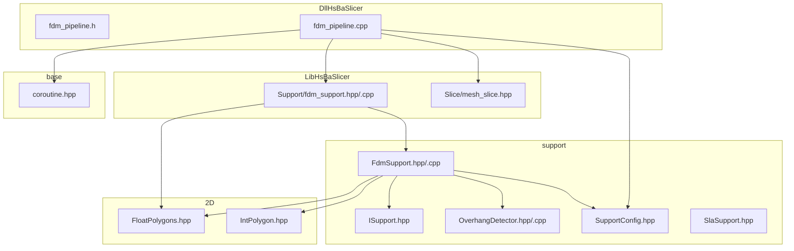
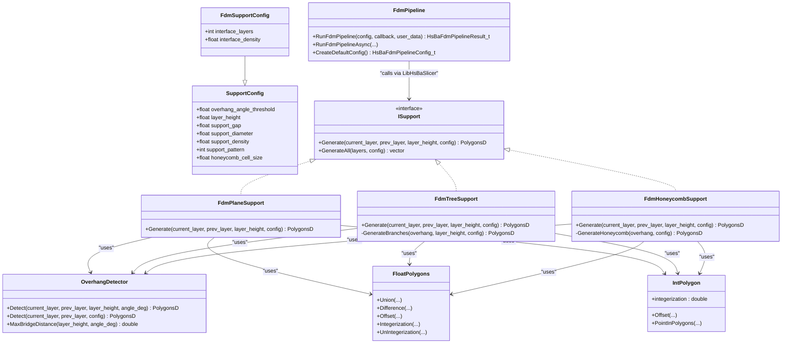
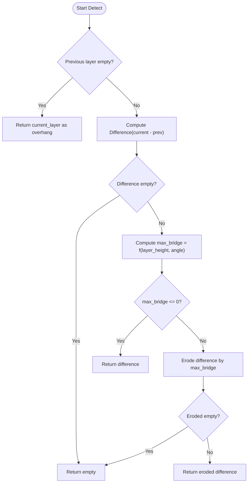
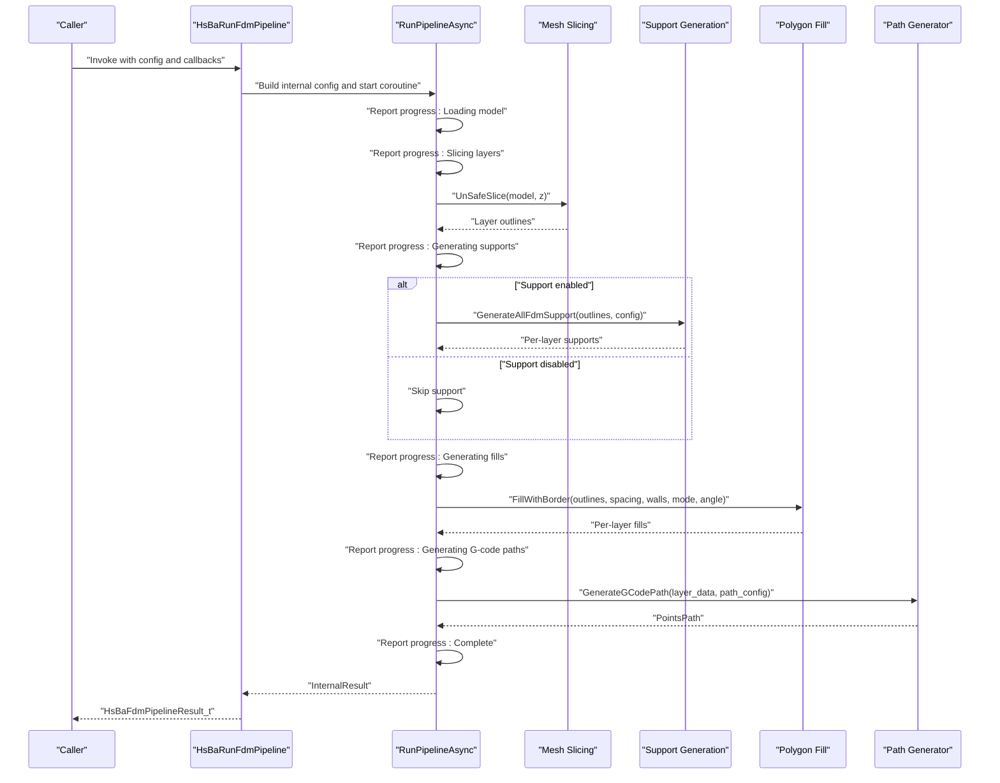
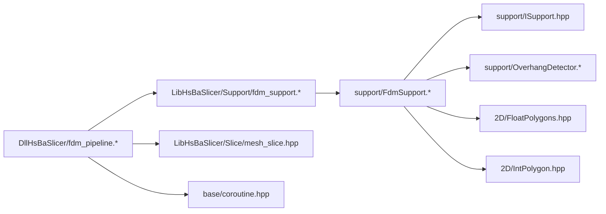

# Support Generation System

<cite>
**Referenced Files in This Document**
- [fdm_support.hpp](file://LibHsBaSlicer/Support/fdm_support.hpp)
- [fdm_support.cpp](file://LibHsBaSlicer/Support/fdm_support.cpp)
- [FdmSupport.hpp](file://support/FdmSupport.hpp)
- [FdmSupport.cpp](file://support/FdmSupport.cpp)
- [ISupport.hpp](file://support/ISupport.hpp)
- [OverhangDetector.hpp](file://support/OverhangDetector.hpp)
- [OverhangDetector.cpp](file://support/OverhangDetector.cpp)
- [SupportConfig.hpp](file://support/SupportConfig.hpp)
- [SlaSupport.hpp](file://support/SlaSupport.hpp)
- [FloatPolygons.hpp](file://2D/FloatPolygons.hpp)
- [IntPolygon.hpp](file://2D/IntPolygon.hpp)
- [mesh_slice.hpp](file://LibHsBaSlicer/Slice/mesh_slice.hpp)
- [fdm_pipeline.h](file://DllHsBaSlicer/fdm_pipeline.h)
- [fdm_pipeline.cpp](file://DllHsBaSlicer/fdm_pipeline.cpp)
- [coroutine.hpp](file://base/coroutine.hpp)
- [CMakeLists.txt](file://LibHsBaSlicer/CMakeLists.txt)
</cite>

## Table of Contents
1. [Introduction](#introduction)
2. [Project Structure](#project-structure)
3. [Core Components](#core-components)
4. [Architecture Overview](#architecture-overview)
5. [Detailed Component Analysis](#detailed-component-analysis)
6. [Dependency Analysis](#dependency-analysis)
7. [Performance Considerations](#performance-considerations)
8. [Troubleshooting Guide](#troubleshooting-guide)
9. [Conclusion](#conclusion)

## Introduction
This document describes the Support Generation System for FDM 3D printing within the HsBaSlicer project. It explains how overhang regions are detected and transformed into support structures across layers, how different support patterns (plane, tree, honeycomb) are implemented, and how these components integrate into a full FDM pipeline that includes preprocessing, slicing, support generation, infill, and G-code path generation. The system exposes both C++ APIs and a C-compatible interface for external consumers.

## Project Structure
The support generation system spans several modules:
- LibHsBaSlicer: High-level API wrappers for support generation and integration with other stages (preprocess, slice, fill, path).
- support: Core algorithms for support generation, including overhang detection and pattern-specific implementations.
- 2D: Polygon math utilities used by support logic.
- DllHsBaSlicer: C-compatible entry points and an end-to-end FDM pipeline orchestrator using coroutines.
- base: Coroutine primitives used by the pipeline.

**Diagram sources**
- [fdm_support.hpp:1-36](file://LibHsBaSlicer/Support/fdm_support.hpp#L1-L36)
- [fdm_support.cpp:1-48](file://LibHsBaSlicer/Support/fdm_support.cpp#L1-L48)
- [FdmSupport.hpp:1-63](file://support/FdmSupport.hpp#L1-L63)
- [FdmSupport.cpp:1-232](file://support/FdmSupport.cpp#L1-L232)
- [ISupport.hpp:1-45](file://support/ISupport.hpp#L1-L45)
- [OverhangDetector.hpp:1-50](file://support/OverhangDetector.hpp#L1-L50)
- [OverhangDetector.cpp:1-73](file://support/OverhangDetector.cpp#L1-L73)
- [SupportConfig.hpp:1-43](file://support/SupportConfig.hpp#L1-L43)
- [SlaSupport.hpp:1-42](file://support/SlaSupport.hpp#L1-L42)
- [FloatPolygons.hpp:1-267](file://2D/FloatPolygons.hpp#L1-L267)
- [IntPolygon.hpp:1-220](file://2D/IntPolygon.hpp#L1-L220)
- [mesh_slice.hpp:1-28](file://LibHsBaSlicer/Slice/mesh_slice.hpp#L1-L28)
- [fdm_pipeline.h:1-147](file://DllHsBaSlicer/fdm_pipeline.h#L1-L147)
- [fdm_pipeline.cpp:1-357](file://DllHsBaSlicer/fdm_pipeline.cpp#L1-L357)
- [coroutine.hpp:1-800](file://base/coroutine.hpp#L1-L800)

**Section sources**
- [fdm_support.hpp:1-36](file://LibHsBaSlicer/Support/fdm_support.hpp#L1-L36)
- [fdm_support.cpp:1-48](file://LibHsBaSlicer/Support/fdm_support.cpp#L1-L48)
- [FdmSupport.hpp:1-63](file://support/FdmSupport.hpp#L1-L63)
- [FdmSupport.cpp:1-232](file://support/FdmSupport.cpp#L1-L232)
- [ISupport.hpp:1-45](file://support/ISupport.hpp#L1-L45)
- [OverhangDetector.hpp:1-50](file://support/OverhangDetector.hpp#L1-L50)
- [OverhangDetector.cpp:1-73](file://support/OverhangDetector.cpp#L1-L73)
- [SupportConfig.hpp:1-43](file://support/SupportConfig.hpp#L1-L43)
- [SlaSupport.hpp:1-42](file://support/SlaSupport.hpp#L1-L42)
- [FloatPolygons.hpp:1-267](file://2D/FloatPolygons.hpp#L1-L267)
- [IntPolygon.hpp:1-220](file://2D/IntPolygon.hpp#L1-L220)
- [mesh_slice.hpp:1-28](file://LibHsBaSlicer/Slice/mesh_slice.hpp#L1-L28)
- [fdm_pipeline.h:1-147](file://DllHsBaSlicer/fdm_pipeline.h#L1-L147)
- [fdm_pipeline.cpp:1-357](file://DllHsBaSlicer/fdm_pipeline.cpp#L1-L357)
- [coroutine.hpp:1-800](file://base/coroutine.hpp#L1-L800)

## Core Components
- Support configuration: Defines parameters such as overhang angle threshold, layer height, gap, diameter, density, pattern selection, and pattern-specific options.
- Overhang detector: Computes unsupported regions between adjacent layers based on geometry and angle thresholds.
- Support generators: Implement specific patterns (plane, tree, honeycomb) to produce per-layer support polygons from overhang regions.
- LibHsBaSlicer wrapper: Exposes simple functions to generate single-layer or all-layer supports.
- Pipeline integration: The FDM pipeline orchestrates model loading, slicing, support generation, infill, and path generation, reporting progress and errors.

Key responsibilities:
- Configuration: Centralized via SupportConfig and derived types.
- Detection: OverhangDetector provides geometric filtering of unsupported areas.
- Generation: Pattern classes implement Generate methods returning PolygonsD per layer.
- Orchestration: DllHsBaSlicer pipeline composes steps and manages lifecycle and memory.

**Section sources**
- [SupportConfig.hpp:1-43](file://support/SupportConfig.hpp#L1-L43)
- [OverhangDetector.hpp:1-50](file://support/OverhangDetector.hpp#L1-L50)
- [OverhangDetector.cpp:1-73](file://support/OverhangDetector.cpp#L1-L73)
- [ISupport.hpp:1-45](file://support/ISupport.hpp#L1-L45)
- [FdmSupport.hpp:1-63](file://support/FdmSupport.hpp#L1-L63)
- [FdmSupport.cpp:1-232](file://support/FdmSupport.cpp#L1-L232)
- [fdm_support.hpp:1-36](file://LibHsBaSlicer/Support/fdm_support.hpp#L1-L36)
- [fdm_support.cpp:1-48](file://LibHsBaSlicer/Support/fdm_support.cpp#L1-L48)
- [fdm_pipeline.cpp:1-357](file://DllHsBaSlicer/fdm_pipeline.cpp#L1-L357)

## Architecture Overview
The support generation system is layered:
- Data layer: Polygons and integerized polygon operations provide robust boolean and offset computations.
- Algorithm layer: Overhang detection and pattern-specific support generation.
- API layer: LibHsBaSlicer exposes high-level functions.
- Integration layer: DllHsBaSlicer composes the entire FDM workflow and exposes C-compatible interfaces.

**Diagram sources**
- [SupportConfig.hpp:1-43](file://support/SupportConfig.hpp#L1-L43)
- [ISupport.hpp:1-45](file://support/ISupport.hpp#L1-L45)
- [FdmSupport.hpp:1-63](file://support/FdmSupport.hpp#L1-L63)
- [FdmSupport.cpp:1-232](file://support/FdmSupport.cpp#L1-L232)
- [OverhangDetector.hpp:1-50](file://support/OverhangDetector.hpp#L1-L50)
- [OverhangDetector.cpp:1-73](file://support/OverhangDetector.cpp#L1-L73)
- [FloatPolygons.hpp:1-267](file://2D/FloatPolygons.hpp#L1-L267)
- [IntPolygon.hpp:1-220](file://2D/IntPolygon.hpp#L1-L220)
- [fdm_pipeline.h:1-147](file://DllHsBaSlicer/fdm_pipeline.h#L1-L147)
- [fdm_pipeline.cpp:1-357](file://DllHsBaSlicer/fdm_pipeline.cpp#L1-L357)

## Detailed Component Analysis

### Overhang Detection
Purpose: Identify unsupported regions between consecutive layers based on geometry and angle threshold.

Algorithm overview:
- If there is no previous layer, the entire current layer is considered overhang.
- Compute difference between current and previous layers.
- Filter small overhangs using erosion based on maximum bridge distance derived from layer height and angle threshold.
- Return eroded difference as overhang regions.

**Diagram sources**
- [OverhangDetector.cpp:1-73](file://support/OverhangDetector.cpp#L1-L73)
- [OverhangDetector.hpp:1-50](file://support/OverhangDetector.hpp#L1-L50)

**Section sources**
- [OverhangDetector.cpp:1-73](file://support/OverhangDetector.cpp#L1-L73)
- [OverhangDetector.hpp:1-50](file://support/OverhangDetector.hpp#L1-L50)

### Support Patterns

#### Plane Support
Behavior:
- Detect overhang regions.
- Apply gap to separate support from model.
- Inflate by half support diameter to create column cross-sections.
- Return unioned columns.

Complexity considerations:
- Boolean operations and offsets dominate runtime; complexity scales with polygon vertex count and number of features.

**Section sources**
- [FdmSupport.cpp:44-68](file://support/FdmSupport.cpp#L44-L68)
- [FdmSupport.hpp:15-20](file://support/FdmSupport.hpp#L15-L20)

#### Tree Support
Behavior:
- Detect overhang regions and apply gap.
- Sample candidate branch points within the gapped region at regular spacing.
- Create circles at sample points and union them to form branch tips.
- Expand branches downward across layers (handled by multi-layer generation).

Implementation notes:
- Grid sampling uses bounding box traversal and point-in-polygon tests.
- Union operation collapses overlapping circles.

**Section sources**
- [FdmSupport.cpp:73-146](file://support/FdmSupport.cpp#L73-L146)
- [FdmSupport.hpp:29-40](file://support/FdmSupport.hpp#L29-L40)

#### Honeycomb Support
Behavior:
- Detect overhang regions and apply gap.
- Generate hexagonal cells covering the bounding area.
- Intersect unioned hexagons with gapped overhang region.

Implementation notes:
- Hexagon geometry is flat-top; cell size configurable.
- Intersection ensures support only fills required regions.

**Section sources**
- [FdmSupport.cpp:151-230](file://support/FdmSupport.cpp#L151-L230)
- [FdmSupport.hpp:48-59](file://support/FdmSupport.hpp#L48-L59)

### LibHsBaSlicer Support Wrapper
Responsibilities:
- Provide simple functions to generate single-layer or all-layer supports.
- Select implementation based on configuration (plane/tree/honeycomb).
- Delegate to underlying ISupport implementations.

API highlights:
- Single-layer generation function.
- All-layers generation function.

**Section sources**
- [fdm_support.hpp:1-36](file://LibHsBaSlicer/Support/fdm_support.hpp#L1-L36)
- [fdm_support.cpp:1-48](file://LibHsBaSlicer/Support/fdm_support.cpp#L1-L48)

### SLA Support (Contextual)
SLA sacrificial support generates thin columns with tapered diameters suitable for resin printing. While not used directly in the FDM pipeline, it demonstrates the extensibility of the ISupport interface.

**Section sources**
- [SlaSupport.hpp:1-42](file://support/SlaSupport.hpp#L1-L42)

### FDM Pipeline Integration
The FDM pipeline composes multiple stages:
- Preprocessing: Load model and compute info.
- Slicing: Generate per-layer outlines.
- Support generation: Optional, based on configuration.
- Infill: Fill per-layer outlines with borders and specified mode.
- Path generation: Combine outlines, fills, and supports into G-code paths.

Progress reporting and error handling are integrated throughout.

**Diagram sources**
- [fdm_pipeline.cpp:182-292](file://DllHsBaSlicer/fdm_pipeline.cpp#L182-L292)
- [fdm_pipeline.h:1-147](file://DllHsBaSlicer/fdm_pipeline.h#L1-L147)
- [mesh_slice.hpp:1-28](file://LibHsBaSlicer/Slice/mesh_slice.hpp#L1-L28)
- [fdm_support.hpp:1-36](file://LibHsBaSlicer/Support/fdm_support.hpp#L1-L36)

**Section sources**
- [fdm_pipeline.cpp:1-357](file://DllHsBaSlicer/fdm_pipeline.cpp#L1-L357)
- [fdm_pipeline.h:1-147](file://DllHsBaSlicer/fdm_pipeline.h#L1-L147)
- [mesh_slice.hpp:1-28](file://LibHsBaSlicer/Slice/mesh_slice.hpp#L1-L28)

## Dependency Analysis
The support generation system depends on:
- 2D polygon utilities for boolean operations, offsets, and conversions.
- Overhang detection for identifying unsupported regions.
- ISupport-based pattern implementations for generating support shapes.
- LibHsBaSlicer wrappers for exposing functionality.
- DllHsBaSlicer pipeline for orchestration and C compatibility.

**Diagram sources**
- [FdmSupport.cpp:1-232](file://support/FdmSupport.cpp#L1-L232)
- [ISupport.hpp:1-45](file://support/ISupport.hpp#L1-L45)
- [OverhangDetector.cpp:1-73](file://support/OverhangDetector.cpp#L1-L73)
- [FloatPolygons.hpp:1-267](file://2D/FloatPolygons.hpp#L1-L267)
- [IntPolygon.hpp:1-220](file://2D/IntPolygon.hpp#L1-L220)
- [fdm_support.cpp:1-48](file://LibHsBaSlicer/Support/fdm_support.cpp#L1-L48)
- [fdm_pipeline.cpp:1-357](file://DllHsBaSlicer/fdm_pipeline.cpp#L1-L357)
- [mesh_slice.hpp:1-28](file://LibHsBaSlicer/Slice/mesh_slice.hpp#L1-L28)
- [coroutine.hpp:1-800](file://base/coroutine.hpp#L1-L800)

**Section sources**
- [FdmSupport.cpp:1-232](file://support/FdmSupport.cpp#L1-L232)
- [ISupport.hpp:1-45](file://support/ISupport.hpp#L1-L45)
- [OverhangDetector.cpp:1-73](file://support/OverhangDetector.cpp#L1-L73)
- [FloatPolygons.hpp:1-267](file://2D/FloatPolygons.hpp#L1-L267)
- [IntPolygon.hpp:1-220](file://2D/IntPolygon.hpp#L1-L220)
- [fdm_support.cpp:1-48](file://LibHsBaSlicer/Support/fdm_support.cpp#L1-L48)
- [fdm_pipeline.cpp:1-357](file://DllHsBaSlicer/fdm_pipeline.cpp#L1-L357)
- [mesh_slice.hpp:1-28](file://LibHsBaSlicer/Slice/mesh_slice.hpp#L1-L28)
- [coroutine.hpp:1-800](file://base/coroutine.hpp#L1-L800)

## Performance Considerations
- Boolean operations and offsets are computationally intensive; minimize unnecessary conversions between integer and floating-point representations.
- For tree support, grid sampling density affects performance; adjust spacing relative to feature size.
- Honeycomb generation creates many hexagons; consider bounding box optimization and early exits when regions are empty.
- Pipeline progress reporting should avoid excessive overhead; batch updates where possible.

[No sources needed since this section provides general guidance]

## Troubleshooting Guide
Common issues and remedies:
- Invalid model height: Ensure model bounds are valid and non-zero; check first layer height vs. layer height settings.
- No support generated: Verify overhang angle threshold and layer height; confirm gap and diameter values are reasonable.
- Memory leaks in C results: Always call the provided free function to release allocated strings in the result structure.
- Progress callback not invoked: Confirm callback pointer and user data are set correctly; ensure pipeline runs to completion.

**Section sources**
- [fdm_pipeline.cpp:167-179](file://DllHsBaSlicer/fdm_pipeline.cpp#L167-L179)
- [fdm_pipeline.cpp:350-357](file://DllHsBaSlicer/fdm_pipeline.cpp#L350-L357)

## Conclusion
The Support Generation System integrates robust overhang detection with flexible support patterns and a cohesive FDM pipeline. By leveraging efficient 2D polygon operations and a clear separation of concerns, it delivers scalable support generation suitable for diverse geometries and print configurations. The C-compatible interface enables easy integration into external applications while preserving performance and usability.