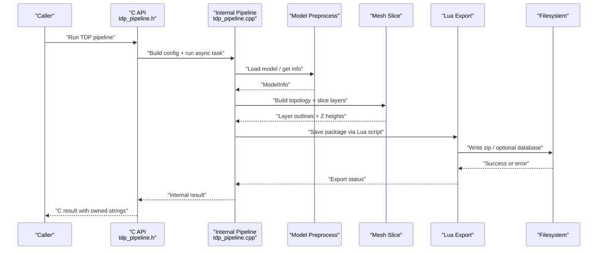
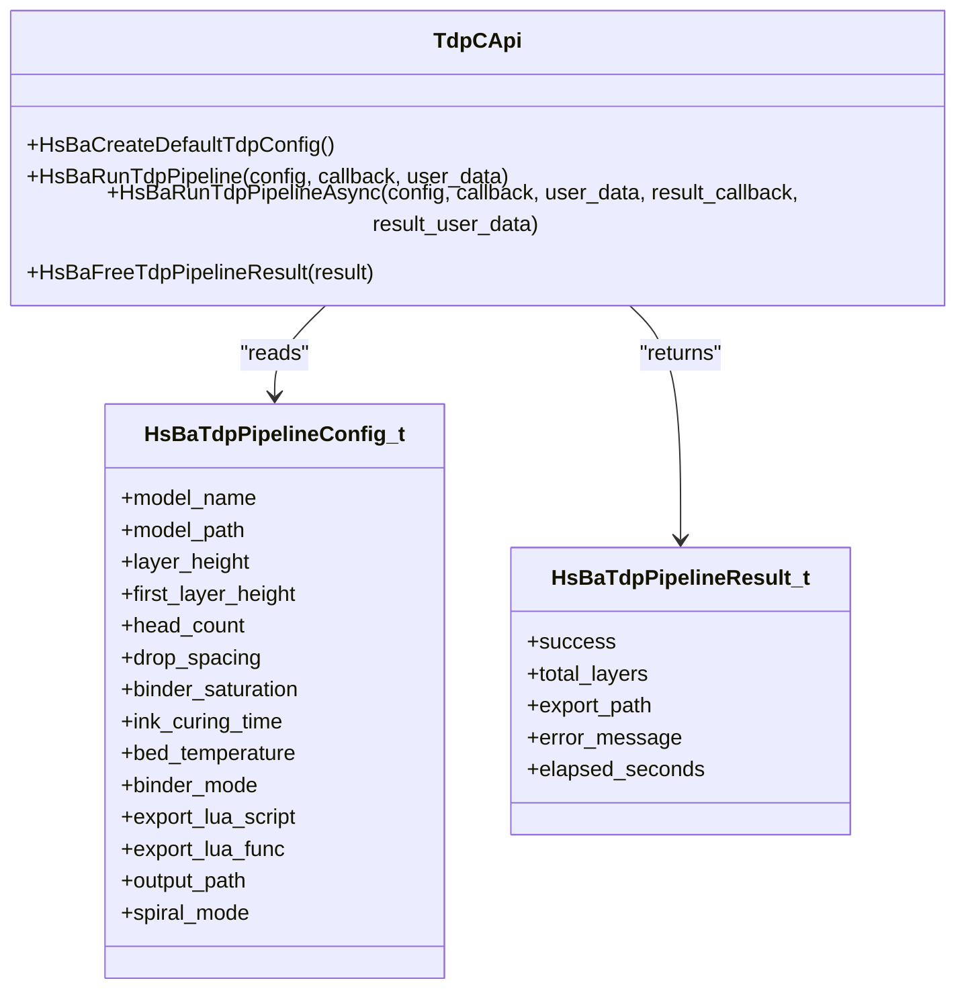
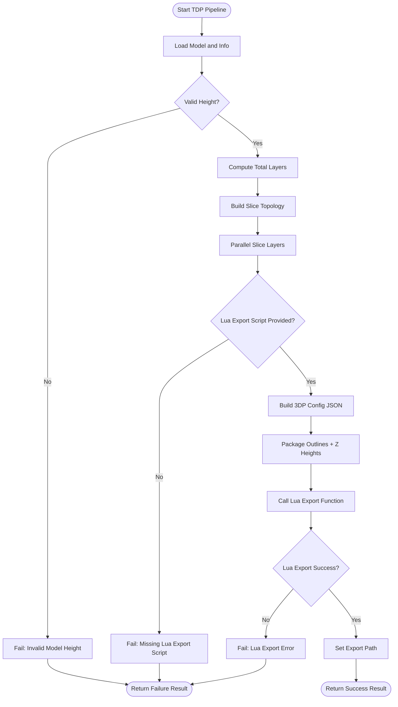
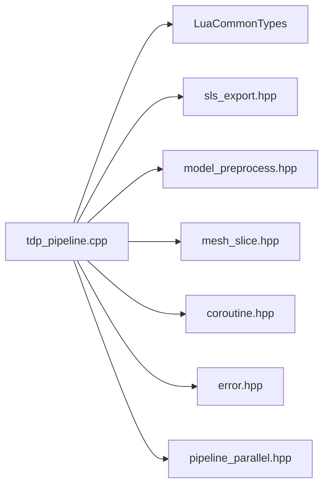

# TDP Manufacturing Process

<cite>
**Referenced Files in This Document**
- [README.md](file://README.md)
- [tdp_pipeline.h](file://DllHsBaSlicer/tdp_pipeline.h)
- [tdp_pipeline.cpp](file://DllHsBaSlicer/tdp_pipeline.cpp)
- [pipeline_types.h](file://pipelinetypes/pipeline_types.h)
- [tdp_pipeline.proto](file://proto/tdp_pipeline.proto)
- [Msg2PipelineConfig.cpp](file://convert/Msg2PipelineConfig.cpp)
- [PipelineConfig2Msg.cpp](file://convert/PipelineConfig2Msg.cpp)
- [main.cpp](file://samples/TDP/main.cpp)
- [my_tdp_export.lua](file://samples/TDP/scripts/my_tdp_export.lua)
</cite>

## Table of Contents
1. [Introduction](#introduction)
2. [Project Structure](#project-structure)
3. [Core Components](#core-components)
4. [Architecture Overview](#architecture-overview)
5. [Detailed Component Analysis](#detailed-component-analysis)
6. [Dependency Analysis](#dependency-analysis)
7. [Performance Considerations](#performance-considerations)
8. [Troubleshooting Guide](#troubleshooting-guide)
9. [Conclusion](#conclusion)

## Introduction
This document explains the TDP (Three-Dimensional Printing, binder jetting) manufacturing process as implemented in HsBaSlicer. The TDP pipeline is a powder-bed + liquid-binder workflow: the model is sliced per layer, and each layer’s binder-jet outlines are handed to a Lua export script together with head, drop, saturation, curing, bed temperature, and spiral-mode settings. The C ABI exposes synchronous and asynchronous entry points, while the internal implementation uses coroutines, parallel layer slicing, and an SLS-style packaging path for Lua-driven output.

The repository also provides Protobuf definitions and conversion helpers that map between the C ABI structs and protobuf messages, enabling cross-language or remote orchestration around the same TDP process.

## Project Structure
The TDP feature spans several layers:

| Layer | Responsibility | Key Files |
|---|---|---|
| Public C ABI | Stable interface for external callers | `DllHsBaSlicer/tdp_pipeline.h` |
| C++ Pipeline Implementation | Config building, coroutine-based execution, progress reporting, result conversion | `DllHsBaSlicer/tdp_pipeline.cpp` |
| Shared C Types | POD config/result enums and structs used by convert and samples | `pipelinetypes/pipeline_types.h` |
| Protobuf Contract | Cross-language message schema | `proto/tdp_pipeline.proto` |
| Message Conversion | C ABI ↔ Protobuf mapping | `convert/Msg2PipelineConfig.cpp`, `convert/PipelineConfig2Msg.cpp` |
| Sample Application | End-to-end usage examples | `samples/TDP/main.cpp` |
| Lua Export Script | Custom zip/database output driven by user code | `samples/TDP/scripts/my_tdp_export.lua` |

```mermaid
graph TB
Caller["External Caller"] --> CApi["C API<br/>tdp_pipeline.h"]
CApi --> Impl["TDP Pipeline Implementation<br/>tdp_pipeline.cpp"]
Impl --> Preprocess["Model Preprocess"]
Impl --> Slice["Mesh Slice"]
Impl --> Parallel["Parallel Layer Slicing"]
Impl --> LuaExport["Lua Export Packaging"]
LuaExport --> Output["Zip + Optional Database"]
Convert["Message Conversion"] < --> Proto["Protobuf Schema<br/>tdp_pipeline.proto"]
Samples["Sample App<br/>samples/TDP/main.cpp"] --> CApi
```

**Diagram sources**
- [tdp_pipeline.h:1-63](file://DllHsBaSlicer/tdp_pipeline.h#L1-L63)
- [tdp_pipeline.cpp:197-310](file://DllHsBaSlicer/tdp_pipeline.cpp#L197-L310)
- [tdp_pipeline.proto:1-46](file://proto/tdp_pipeline.proto#L1-L46)
- [Msg2PipelineConfig.cpp:303-336](file://convert/Msg2PipelineConfig.cpp#L303-L336)
- [PipelineConfig2Msg.cpp:328-354](file://convert/PipelineConfig2Msg.cpp#L328-L354)
- [main.cpp:55-82](file://samples/TDP/main.cpp#L55-L82)

**Section sources**
- [README.md:21-39](file://README.md#L21-L39)
- [README.md:104-124](file://README.md#L104-L124)

## Core Components
The TDP manufacturing process is exposed through a small, stable C ABI and backed by a coroutine-driven C++ pipeline.

### Public C API
- Default configuration factory.
- Synchronous full-pipeline run.
- Asynchronous non-blocking run with completion callback.
- Result memory release function.

These functions operate on `HsBaTdpPipelineConfig_t` and return `HsBaTdpPipelineResult_t`. String fields in results are UTF-8 and must be freed by the caller using the provided free function.

**Section sources**
- [tdp_pipeline.h:17-56](file://DllHsBaSlicer/tdp_pipeline.h#L17-L56)

### C Type Definitions
The TDP types are defined in the shared C header so that both Dll and convert modules can use them without depending on the shared library.

Key elements:
- Binder mode enum: full-color, single-channel, sintering-assisted.
- Configuration struct: model name/path, slice heights, head count, drop spacing, binder saturation, curing time, bed temperature, Lua export script/function, optional output path, and spiral mode.
- Result struct: success flag, total layers, exported path, error message, elapsed seconds.
- Progress and async result callback types.

**Section sources**
- [pipeline_types.h:463-521](file://pipelinetypes/pipeline_types.h#L463-L521)

### Protobuf Contract
The protobuf schema defines the same TDP concepts for cross-language integration:
- Binder mode enum.
- Configuration message with all relevant fields.
- Result message mirroring the C result.

**Section sources**
- [tdp_pipeline.proto:1-46](file://proto/tdp_pipeline.proto#L1-L46)

### Message Conversion
Conversion helpers translate between the C ABI structs and protobuf messages:
- From protobuf to C config/result.
- From C config/result to protobuf.

This allows remote services or other languages to construct or inspect TDP pipelines using generated bindings.

**Section sources**
- [Msg2PipelineConfig.cpp:303-336](file://convert/Msg2PipelineConfig.cpp#L303-L336)
- [PipelineConfig2Msg.cpp:328-354](file://convert/PipelineConfig2Msg.cpp#L328-L354)

## Architecture Overview
At runtime, the TDP pipeline follows a clear three-stage flow: preprocess, slice, and Lua export. The C API is thin; most logic lives in the internal coroutine task.



**Diagram sources**
- [tdp_pipeline.cpp:197-310](file://DllHsBaSlicer/tdp_pipeline.cpp#L197-L310)
- [tdp_pipeline.h:23-50](file://DllHsBaSlicer/tdp_pipeline.h#L23-L50)

## Detailed Component Analysis

### TDP C API Surface
The public surface is intentionally minimal:
- A default-config initializer.
- A synchronous runner.
- An asynchronous runner.
- A dedicated result-free function.

This keeps the ABI stable and simple for external languages such as Java, C#, Python, or mobile platforms.



**Diagram sources**
- [pipeline_types.h:463-521](file://pipelinetypes/pipeline_types.h#L463-L521)
- [tdp_pipeline.h:17-56](file://DllHsBaSlicer/tdp_pipeline.h#L17-L56)

**Section sources**
- [tdp_pipeline.h:17-56](file://DllHsBaSlicer/tdp_pipeline.h#L17-L56)
- [pipeline_types.h:463-521](file://pipelinetypes/pipeline_types.h#L463-L521)

### Internal TDP Pipeline Logic
The internal implementation converts the C config into an internal structure, then runs a coroutine-based pipeline:

1. **Preprocess**: Load the model if not already registered, fetch bounding box/volume information, compute total layers from first-layer height and regular layer height.
2. **Slicing**: Build the slicing topology once, then slice each layer in parallel. Each layer computes its Z position and produces polygon outlines.
3. **Export**: Require a Lua export script. Build a JSON configuration describing 3DP parameters, pack layer outlines and Z heights, and call the Lua function. If no explicit output path is set, a default zip name is derived from the model name.
4. **Result**: Convert internal strings to owned C strings, fill success/layer count/error/time, and report progress at key stages.



**Diagram sources**
- [tdp_pipeline.cpp:197-310](file://DllHsBaSlicer/tdp_pipeline.cpp#L197-L310)

**Section sources**
- [tdp_pipeline.cpp:28-55](file://DllHsBaSlicer/tdp_pipeline.cpp#L28-L55)
- [tdp_pipeline.cpp:94-157](file://DllHsBaSlicer/tdp_pipeline.cpp#L94-L157)
- [tdp_pipeline.cpp:161-195](file://DllHsBaSlicer/tdp_pipeline.cpp#L161-L195)
- [tdp_pipeline.cpp:197-310](file://DllHsBaSlicer/tdp_pipeline.cpp#L197-L310)

### Lua Export Script
The sample Lua script demonstrates how the 3DP output is packaged:
- It receives a configuration table containing a JSON string with process, slice, binder, bed temperature, and spiral-mode data.
- It iterates over per-layer images and adds them to a zip archive.
- It writes a README describing the package contents.
- It optionally registers the export in a SQLite database.
- It returns a table indicating success and the exported path.

Important contract notes:
- The script must return a table, not a plain string, otherwise it may overwrite the written zip file.
- The database registration is wrapped in a protected call so failures do not abort the whole export.

**Section sources**
- [my_tdp_export.lua:1-63](file://samples/TDP/scripts/my_tdp_export.lua#L1-L63)

### Sample Usage
The sample application shows four typical workflows:
- Basic pipeline with minimal configuration.
- Custom binder and head parameters.
- Asynchronous pipeline with a completion callback.
- Spiral mode, which exposes a continuous rising deposition path to the export script.

All examples follow the same pattern: create default config, set required fields, run the pipeline, handle success/failure, and free the result.

**Section sources**
- [main.cpp:55-82](file://samples/TDP/main.cpp#L55-L82)
- [main.cpp:87-125](file://samples/TDP/main.cpp#L87-L125)
- [main.cpp:129-170](file://samples/TDP/main.cpp#L129-L170)
- [main.cpp:175-205](file://samples/TDP/main.cpp#L175-L205)

## Dependency Analysis
The TDP module depends on several core libraries and utilities:

| Dependency | Role |
|---|---|
| `LibHsBaSlicer/Extends/LuaCommonTypes.hpp` | Initializes common Lua object types before running the export script. |
| `LibHsBaSlicer/Path/sls_export.hpp` | Reuses SLS-style packaging for 3DP binder-jet outputs. |
| `LibHsBaSlicer/Preprocess/model_preprocess.hpp` | Loads models and retrieves model metadata. |
| `LibHsBaSlicer/Slice/mesh_slice.hpp` | Builds slicing topology and slices per layer. |
| `base/coroutine.hpp` | Provides coroutine-based task execution. |
| `base/error.hpp` | Provides the project’s exception type for error handling. |
| `pipeline_parallel.hpp` | Provides parallel iteration over layers. |



**Diagram sources**
- [tdp_pipeline.cpp:17-23](file://DllHsBaSlicer/tdp_pipeline.cpp#L17-L23)

**Section sources**
- [tdp_pipeline.cpp:17-23](file://DllHsBaSlicer/tdp_pipeline.cpp#L17-L23)

## Performance Considerations
- **Parallel layer slicing**: The implementation builds the slicing topology once and slices layers in parallel. This reduces total slicing time when many layers are present.
- **Progress reporting**: Progress callbacks are invoked at model load, slicing start, per-layer updates, export start, and completion. This helps UI responsiveness but should not be called excessively in tight loops.
- **Memory ownership**: Result strings are allocated by the library and must be freed by the caller. Forgetting to call the free function leads to leaks.
- **Lua export cost**: The most variable part of the pipeline is the Lua script. Heavy image processing or database operations inside the script can dominate runtime.
- **Spiral mode**: Enabling spiral mode changes the data passed to the export script; ensure the Lua script handles the additional spiral path data correctly.

[No sources needed since this section provides general guidance]

## Troubleshooting Guide
Common issues and their likely causes:

| Symptom | Likely Cause | Recommended Action |
|---|---|---|
| Pipeline fails with invalid model height | Model has zero or negative height after preprocessing. | Verify model path and geometry; check bounding box computation. |
| Pipeline fails because Lua export script is missing | `export_lua_script` is empty or invalid. | Provide a valid Lua script path and function name. |
| Lua export fails | Lua script throws an error or returns unexpected value. | Inspect Lua error message; ensure the script returns a table and does not overwrite the zip. |
| No output file created | Output path is invalid or filesystem write failed. | Check directory permissions and path validity. |
| Memory grows over time | Caller did not free result strings. | Always call the TDP result free function after using the result. |
| Async callback never fires | Event loop or waiting logic is incorrect. | Ensure the host application processes events or waits properly on the completion flag. |

**Section sources**
- [tdp_pipeline.cpp:204-309](file://DllHsBaSlicer/tdp_pipeline.cpp#L204-L309)
- [tdp_pipeline.cpp:348-354](file://DllHsBaSlicer/tdp_pipeline.cpp#L348-L354)
- [my_tdp_export.lua:35-59](file://samples/TDP/scripts/my_tdp_export.lua#L35-L59)

## Conclusion
The TDP manufacturing process in HsBaSlicer is a clean separation between a stable C ABI and a coroutine-based C++ pipeline. The process loads a model, slices it in parallel, and delegates final output formatting to a Lua script. The design supports multiple binder modes, spiral-mode deposition paths, and cross-language integration through Protobuf conversions. For reliable production use, callers should validate inputs, handle Lua errors, respect memory ownership rules, and tune both the C++ slicing parameters and the Lua export script for their specific binder-jetting hardware.

[No sources needed since this section summarizes without analyzing specific files]