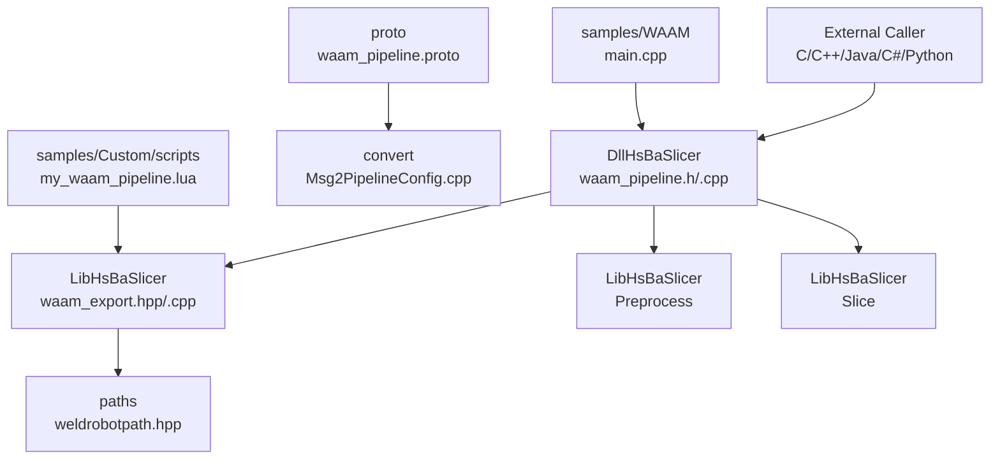
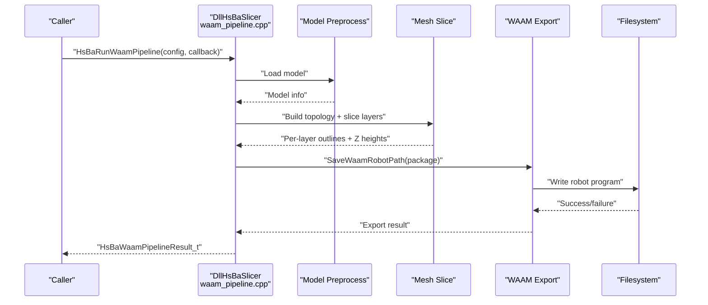
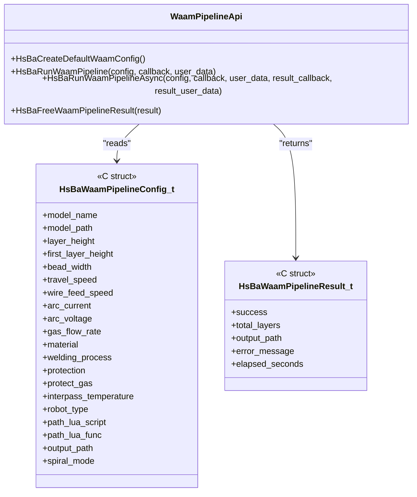
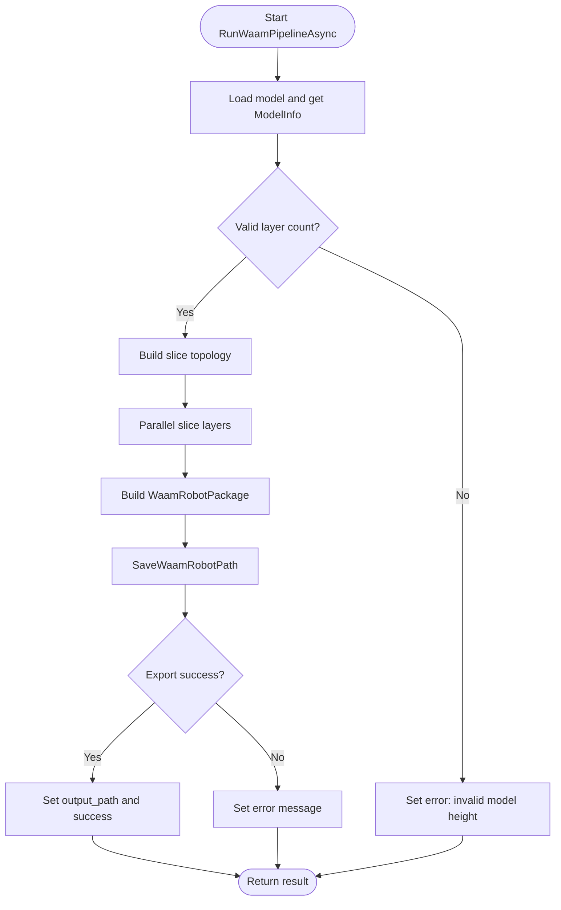
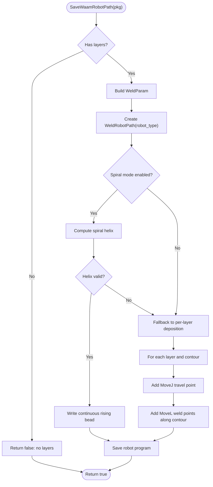
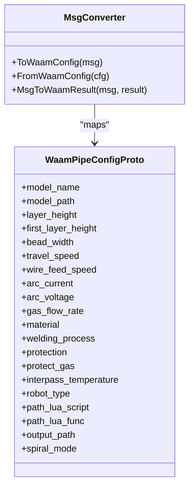
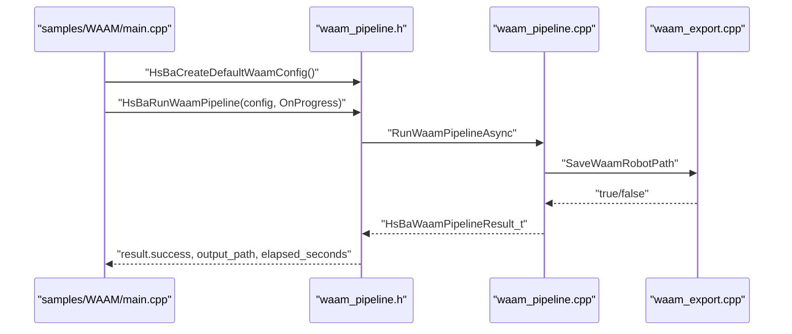
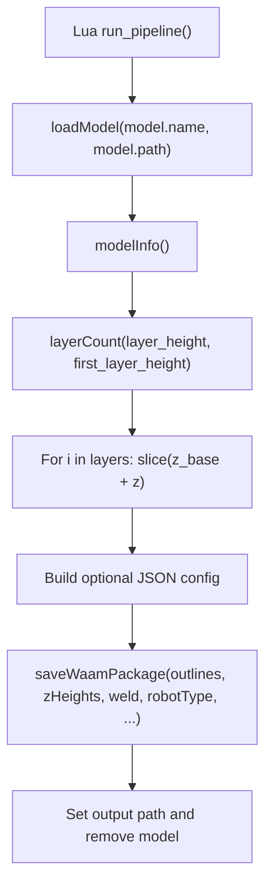
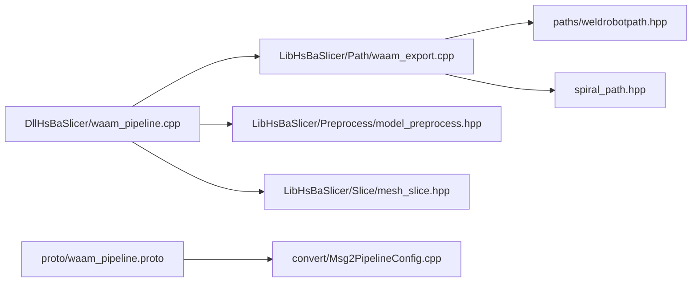

# WAAM Manufacturing Process

<cite>
**Referenced Files in This Document**
- [README.md](file://README.md)
- [waam_pipeline.h](file://DllHsBaSlicer/waam_pipeline.h)
- [waam_pipeline.cpp](file://DllHsBaSlicer/waam_pipeline.cpp)
- [waam_export.hpp](file://LibHsBaSlicer/Path/waam_export.hpp)
- [waam_export.cpp](file://LibHsBaSlicer/Path/waam_export.cpp)
- [weldrobotpath.hpp](file://paths/weldrobotpath.hpp)
- [waam_pipeline.proto](file://proto/waam_pipeline.proto)
- [Msg2PipelineConfig.cpp](file://convert/Msg2PipelineConfig.cpp)
- [main.cpp](file://samples/WAAM/main.cpp)
- [my_waam_pipeline.lua](file://samples/Custom/scripts/my_waam_pipeline.lua)
</cite>

## Table of Contents
1. [Introduction](#introduction)
2. [Project Structure](#project-structure)
3. [Core Components](#core-components)
4. [Architecture Overview](#architecture-overview)
5. [Detailed Component Analysis](#detailed-component-analysis)
6. [Dependency Analysis](#dependency-analysis)
7. [Performance Considerations](#performance-considerations)
8. [Troubleshooting Guide](#troubleshooting-guide)
9. [Conclusion](#conclusion)

## Introduction
This document explains the Wire Arc Additive Manufacturing (WAAM) manufacturing process as implemented in HsBaSlicer. Unlike powder-bed or layer-stacking processes, WAAM is a robot-based deposition process: metal is deposited bead-by-bead along per-layer contours, and the final output is a robot language program for ABB, KUKA, FANUC, or a custom Lua-driven generator.

At a high level, the WAAM pipeline:
- Loads a 3D model.
- Computes the number of layers from model height, first-layer height, and layer height.
- Slices the model into per-layer deposition contours.
- Converts those contours into a welding robot path.
- Writes a robot program file to disk.

The implementation follows HsBaSlicer’s layered architecture:
- `DllHsBaSlicer` exposes a C ABI for external languages.
- `LibHsBaSlicer` provides the core slicing and export logic.
- `paths` contains the underlying robot-path and welding abstractions.
- `proto` defines cross-language protocol buffers for configuration and results.
- Samples demonstrate synchronous, asynchronous, custom-Lua, and spiral/vase-mode usage.

## Project Structure
The WAAM feature spans several modules:

**Diagram sources**
- [waam_pipeline.h:1-64](file://DllHsBaSlicer/waam_pipeline.h#L1-L64)
- [waam_pipeline.cpp:1-322](file://DllHsBaSlicer/waam_pipeline.cpp#L1-L322)
- [waam_export.hpp:1-77](file://LibHsBaSlicer/Path/waam_export.hpp#L1-L77)
- [waam_export.cpp:1-179](file://LibHsBaSlicer/Path/waam_export.cpp#L1-L179)
- [weldrobotpath.hpp:1-43](file://paths/weldrobotpath.hpp#L1-L43)
- [waam_pipeline.proto:1-89](file://proto/waam_pipeline.proto#L1-L89)
- [Msg2PipelineConfig.cpp:352-381](file://convert/Msg2PipelineConfig.cpp#L352-L381)
- [main.cpp:1-237](file://samples/WAAM/main.cpp#L1-L237)
- [my_waam_pipeline.lua:1-94](file://samples/Custom/scripts/my_waam_pipeline.lua#L1-L94)

**Section sources**
- [README.md:21-39](file://README.md#L21-L39)

## Core Components
The WAAM manufacturing process is composed of four main components:

| Component | Responsibility | Key Interfaces / Types |
|---|---|---|
| C ABI Pipeline Wrapper | Exposes WAAM to external callers via C functions | `HsBaCreateDefaultWaamConfig`, `HsBaRunWaamPipeline`, `HsBaRunWaamPipelineAsync`, `HsBaFreeWaamPipelineResult` |
| Internal Pipeline Orchestrator | Coordinates model loading, slicing, and robot export | `InternalWaamConfig`, `InternalWaamResult`, `RunWaamPipelineAsync` |
| Robot Path Exporter | Builds `WeldRobotPath` and writes ABB/KUKA/FANUC programs | `WaamRobotPackage`, `WaamWeldParams`, `SaveWaamRobotPath` |
| Protocol Buffer Definitions | Defines cross-language config/result messages | `waam_pipe_config`, `waam_pipe_result` |

Key design decisions:
- The C ABI returns owned string fields (`output_path`, `error_message`) that must be released by `HsBaFreeWaamPipelineResult`.
- The internal pipeline uses coroutines and parallel layer slicing to improve throughput.
- Spiral mode merges outer walls into one continuous rising weld bead when possible; otherwise it falls back to per-layer deposition.
- Built-in robot generators support ABB, KUKA, and FANUC; unknown robots require a Lua path script.

**Section sources**
- [waam_pipeline.h:17-57](file://DllHsBaSlicer/waam_pipeline.h#L17-L57)
- [waam_pipeline.cpp:26-59](file://DllHsBaSlicer/waam_pipeline.cpp#L26-L59)
- [waam_export.hpp:17-72](file://LibHsBaSlicer/Path/waam_export.hpp#L17-L72)
- [waam_pipeline.proto:49-88](file://proto/waam_pipeline.proto#L49-L88)

## Architecture Overview
The WAAM pipeline is a three-stage flow: preprocess, slice, and export.

**Diagram sources**
- [waam_pipeline.cpp:168-277](file://DllHsBaSlicer/waam_pipeline.cpp#L168-L277)
- [waam_export.cpp:61-175](file://LibHsBaSlicer/Path/waam_export.cpp#L61-L175)

## Detailed Component Analysis

### C ABI Pipeline Wrapper
The C ABI is the entry point for non-C++ callers. It provides:
- Default configuration creation.
- Synchronous execution with progress callbacks.
- Asynchronous execution with completion callbacks.
- Result cleanup for allocated strings.

**Diagram sources**
- [waam_pipeline.h:17-57](file://DllHsBaSlicer/waam_pipeline.h#L17-L57)
- [waam_pipeline.cpp:283-321](file://DllHsBaSlicer/waam_pipeline.cpp#L283-L321)

**Section sources**
- [waam_pipeline.h:1-64](file://DllHsBaSlicer/waam_pipeline.h#L1-L64)
- [waam_pipeline.cpp:283-321](file://DllHsBaSlicer/waam_pipeline.cpp#L283-L321)

### Internal Pipeline Orchestrator
The orchestrator converts the C config into an internal configuration, then runs a coroutine-based pipeline:

1. Load model and compute total layers.
2. Build slice topology once.
3. Slice each layer in parallel.
4. Build a `WaamRobotPackage`.
5. Call `SaveWaamRobotPath`.
6. Return a C-compatible result.

**Diagram sources**
- [waam_pipeline.cpp:98-107](file://DllHsBaSlicer/waam_pipeline.cpp#L98-L107)
- [waam_pipeline.cpp:168-277](file://DllHsBaSlicer/waam_pipeline.cpp#L168-L277)

**Section sources**
- [waam_pipeline.cpp:98-152](file://DllHsBaSlicer/waam_pipeline.cpp#L98-L152)
- [waam_pipeline.cpp:168-277](file://DllHsBaSlicer/waam_pipeline.cpp#L168-L277)

### Robot Path Exporter
The exporter transforms per-layer deposition contours into a welding robot path. It supports two modes:

- **Spiral mode**: If every layer has at least one closed contour, the outer walls are merged into one continuous rising weld bead.
- **Per-layer mode**: For each layer and each contour, rapid travel moves are inserted before depositing along the contour vertices.

**Diagram sources**
- [waam_export.cpp:61-175](file://LibHsBaSlicer/Path/waam_export.cpp#L61-L175)

**Section sources**
- [waam_export.hpp:17-72](file://LibHsBaSlicer/Path/waam_export.hpp#L17-L72)
- [waam_export.cpp:18-57](file://LibHsBaSlicer/Path/waam_export.cpp#L18-L57)
- [waam_export.cpp:61-175](file://LibHsBaSlicer/Path/waam_export.cpp#L61-L175)

### Protocol Buffer Configuration and Conversion
The WAAM configuration is defined in protobuf and converted into the C ABI structure through conversion utilities.

**Diagram sources**
- [waam_pipeline.proto:49-88](file://proto/waam_pipeline.proto#L49-L88)
- [Msg2PipelineConfig.cpp:352-381](file://convert/Msg2PipelineConfig.cpp#L352-L381)

**Section sources**
- [waam_pipeline.proto:1-89](file://proto/waam_pipeline.proto#L1-L89)
- [Msg2PipelineConfig.cpp:352-381](file://convert/Msg2PipelineConfig.cpp#L352-L381)

### Usage Examples
The sample application demonstrates four common WAAM workflows:

1. Basic built-in ABB robot program generation.
2. Custom welding parameters with KUKA robot.
3. Asynchronous pipeline with a custom Lua robot-code generator.
4. Spiral/vase mode producing one continuous rising bead.

**Diagram sources**
- [main.cpp:54-81](file://samples/WAAM/main.cpp#L54-L81)
- [main.cpp:86-131](file://samples/WAAM/main.cpp#L86-L131)
- [main.cpp:155-178](file://samples/WAAM/main.cpp#L155-L178)
- [main.cpp:183-217](file://samples/WAAM/main.cpp#L183-L217)

**Section sources**
- [main.cpp:1-237](file://samples/WAAM/main.cpp#L1-L237)

### Lua-Based Full WAAM Pipeline
A fully Lua-driven WAAM pipeline is also supported. The Lua script:
- Loads the model.
- Computes layer count and per-layer slices.
- Optionally builds a JSON configuration sidecar.
- Calls `HsBa.saveWaamPackage` to generate the robot program.

**Diagram sources**
- [my_waam_pipeline.lua:22-94](file://samples/Custom/scripts/my_waam_pipeline.lua#L22-L94)

**Section sources**
- [my_waam_pipeline.lua:1-94](file://samples/Custom/scripts/my_waam_pipeline.lua#L1-L94)

## Dependency Analysis
The WAAM module depends on lower-level slicing, path, and protocol infrastructure.

**Diagram sources**
- [waam_pipeline.cpp:16-21](file://DllHsBaSlicer/waam_pipeline.cpp#L16-L21)
- [waam_export.cpp:11-13](file://LibHsBaSlicer/Path/waam_export.cpp#L11-L13)
- [weldrobotpath.hpp:1-43](file://paths/weldrobotpath.hpp#L1-L43)
- [waam_pipeline.proto:1-89](file://proto/waam_pipeline.proto#L1-L89)
- [Msg2PipelineConfig.cpp:352-381](file://convert/Msg2PipelineConfig.cpp#L352-L381)

**Section sources**
- [waam_pipeline.cpp:16-21](file://DllHsBaSlicer/waam_pipeline.cpp#L16-L21)
- [waam_export.cpp:11-13](file://LibHsBaSlicer/Path/waam_export.cpp#L11-L13)

## Performance Considerations
- **Parallel slicing**: The pipeline builds the slice topology once and slices layers in parallel, since each layer only reads shared topology data.
- **Spiral mode optimization**: When all layers have closed outer contours, spiral mode avoids per-layer arc restarts and travel moves, reducing robot motion overhead.
- **Memory ownership**: The C API allocates `output_path` and `error_message`; callers must use `HsBaFreeWaamPipelineResult` to avoid leaks.
- **Progress reporting**: Progress callbacks are invoked at key stages: model load, slicing, and pipeline completion.

[No sources needed since this section provides general guidance]

## Troubleshooting Guide
Common issues and their likely causes:

| Symptom | Likely Cause | Recommended Action |
|---|---|---|
| Pipeline fails with “Invalid model height” | Model bounding box height is zero or negative | Verify model path and geometry validity |
| Export fails with “Failed to export WAAM robot path” | Lua script missing, function name wrong, or unsupported robot type without Lua script | Provide a valid Lua path script or use a supported robot type |
| No output file created | Empty layer outlines or degenerate spiral mode | Ensure per-layer contours contain at least two points; check spiral mode requirements |
| Memory leak after calling async pipeline | Not freeing result returned by completion callback | Always call `HsBaFreeWaamPipelineResult` on the result |
| Unexpected robot code | Wrong `robot_type` or custom Lua script not applied | Confirm `robot_type` matches target controller; verify Lua script path and function name |

**Section sources**
- [waam_pipeline.cpp:193-198](file://DllHsBaSlicer/waam_pipeline.cpp#L193-L198)
- [waam_pipeline.cpp:259-263](file://DllHsBaSlicer/waam_pipeline.cpp#L259-L263)
- [waam_export.cpp:67-73](file://LibHsBaSlicer/Path/waam_export.cpp#L67-L73)
- [waam_pipeline.cpp:315-321](file://DllHsBaSlicer/waam_pipeline.cpp#L315-L321)

## Conclusion
The HsBaSlicer WAAM manufacturing process provides a robust, extensible pipeline for robot-based metal deposition. It separates concerns across a C ABI wrapper, a coroutine-based orchestrator, and a dedicated robot-path exporter. Users can choose between built-in ABB/KUKA/FANUC generators or fully customize behavior through Lua scripts. Spiral mode offers significant efficiency gains when applicable, while parallel slicing improves throughput. Proper memory management and parameter validation are essential for reliable operation.

[No sources needed since this section summarizes without analyzing specific files]